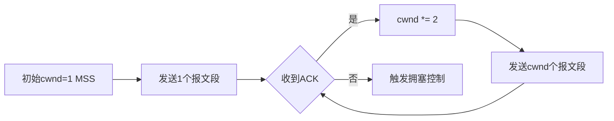
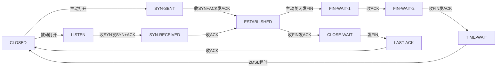
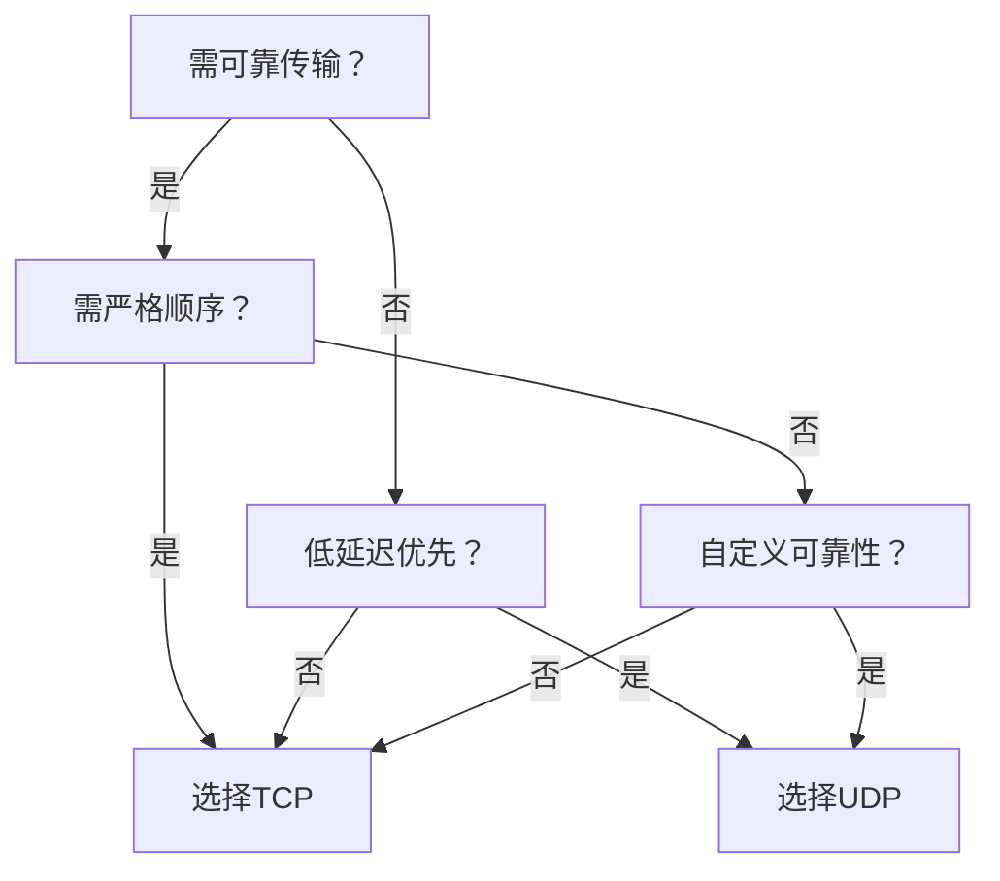

# 2025 Apple SRE PRP


## Unix Processes

### 进程与线程的区别是什么？

线程是一种轻量级进程。

**每个进程拥有独立的栈、代码段、数据段和堆；**

**线程虽拥有自己的栈，但与所属进程共享代码段、数据段和堆。**

其中：

* 代码段 指程序本身的可执行指令
* 数据段 存储程序的输入数据
* 堆 用于动态分配内存（存储文件、锁、套接字等对象）


### 僵尸进程是什么？

僵尸进程是**已完成执行但仍在进程表中保留记录**的进程。其存在的意义是让父进程能够读取子进程的退出状态。这类进程被称为"僵尸"，是因为它虽然已经"死亡"，却尚未被父进程"回收"（reaped）。父进程通常会通过 `wait` 系统调用来获取子进程的退出状态，此时僵尸进程才会被彻底移除。

#### 关键特性：

1. **不可终止性**  
   `kill` 命令对僵尸进程无效（因其实际已终止运行）
   
2. **信号机制** 
 
   子进程终止时，父进程会收到 `SIGCHLD` 信号

3. **资源占用**  

   僵尸进程几乎不消耗系统资源，仅占用进程表中极小的记录空间

---

### 术语对照表
| 英文术语        | 中文翻译         | 技术含义                          |
|----------------|------------------|----------------------------------|
| Zombie process | 僵尸进程         | 已终止但未被回收的进程             |
| Process table  | 进程表           | 操作系统维护的进程状态记录结构      |
| Exit status    | 退出状态         | 进程终止时返回给父进程的状态代码    |
| wait system call | wait系统调用    | 父进程回收子进程资源的阻塞操作      |
| SIGCHLD signal | SIGCHLD信号      | **子进程状态变更时发送给父进程的信号**  |

---

### 技术延伸说明
- **与孤儿进程的区别**：**孤儿进程是父进程先终止的子进程，由init进程接管；僵尸进程则是父进程未及时回收的子进程残骸**
- **清除方式**：  
  - 正确做法：父进程调用 `wait()`/`waitpid()`  
  - 极端情况：强制终止父进程（僵尸进程会被init进程接管并回收）
- **系统影响**：大量僵尸进程可能导致进程表溢出（但现代系统进程表容量通常足够大）

> 示例场景：当父进程未实现SIGCHLD信号处理程序，或未调用wait()时，子进程会持续保持僵尸状态直至父进程终止。

该译文严格遵循操作系统领域术语规范，并通过结构化呈现增强技术概念的清晰度。

## 以下是关于僵尸进程成因及守护进程创建的专业中文解析：

---

### 僵尸进程的产生条件

**根本原因**：父进程未调用 `wait()`/`waitpid()` 系统调用回收子进程  
**典型场景**：  

1. 父进程未正确处理 `SIGCHLD` 信号  
2. 父进程设计缺陷（如未实现子进程状态轮询机制）  
3. 父进程崩溃前未清理已终止的子进程  

> 示例：若父进程执行 `fork()` 后未调用 `wait()`，子进程退出时将滞留为僵尸状态

---

### 守护进程（Daemon）创建步骤详解

| 步骤             | 系统调用/操作      | 技术原理说明                                                                 |
|------------------|-------------------|----------------------------------------------------------------------------|
| **1. 创建子进程**  | `fork()`          | 生成独立于父进程的新进程，父进程立即退出（子进程由init接管）                  |
| **2. 脱离控制终端**| `setsid()`        | 创建新会话并成为会话领头进程，彻底脱离原终端关联                             |
| **3. 重置文件掩码**| `umask(0)`        | 清除继承的文件创建权限掩码，确保守护进程创建文件时拥有精确权限                |
| **4. 切换工作目录**| `chdir("/")`      | 避免占用可卸载文件系统（如挂载目录），通常切换到根目录                       |
| **5. 重定向标准流**| 重开`stdin/stdout/stderr` | 关闭继承的文件描述符，通常重定向到 `/dev/null` 或日志文件                    |

#### 关键操作代码示例
```c
// 创建守护进程核心逻辑
pid_t pid = fork();
if (pid > 0) exit(EXIT_SUCCESS); // 父进程退出
if (pid < 0) exit(EXIT_FAILURE); // 错误处理

setsid();                        // 脱离终端控制
umask(0);                        // 重置文件掩码
chdir("/");                      // 切换工作目录

// 关闭并重定向标准流
close(STDIN_FILENO);
close(STDOUT_FILENO);
close(STDERR_FILENO);
open("/dev/null", O_RDONLY);     // stdin → /dev/null
open("/dev/null", O_WRONLY);     // stdout → /dev/null
open("/var/log/daemon.log", O_WRONLY | O_APPEND); // stderr → 日志文件
```

---

### 技术要点说明
1. **僵尸进程预防**  
   - 父进程必须实现 `SIGCHLD` 信号处理函数并在其中调用 `waitpid()`  
   - 使用 `WNOHANG` 选项进行非阻塞回收：  
     ```c
     while (waitpid(-1, &status, WNOHANG) > 0);
     ```

2. **守护进程必要性**  
   - 长期运行的服务（如Web服务器/数据库）必须脱离终端  
   - 避免因终端关闭导致进程意外终止  
   - 实现后台服务自治（日志独立/资源隔离）

> **注意**：现代Linux系统可通过 `daemon()` 函数（封装上述步骤）直接创建守护进程，但理解底层机制仍至关重要。

###  Shell执行进程的完整流程

以下是对Unix Shell中进程执行机制的详细说明（以`/bin/ls`命令为例）：

---

### Shell执行进程的完整流程

#### 1. **命令解析与路径搜索**
   - 当用户输入`ls`时，Shell解析命令并检索**PATH环境变量**  
   - 按路径顺序（如`/bin:/usr/bin`）查找名为`ls`的可执行文件  
   - 定位到目标程序路径：`/bin/ls`

#### 2. **创建子进程（关键步骤）**
   ```c
   pid_t child_pid = fork();  // 系统调用复制当前Shell进程
   ```
   - **父进程（Shell）**：  
     - 保留控制终端，通过`waitpid()`等待子进程结束  
     - 维护作业控制（如后台运行`&`）
   - **子进程**：  
     - 获得父进程内存空间的完整副本  
     - 拥有独立PID但暂时与父进程执行相同代码

#### 3. **进程映像替换（核心操作）**
   ```c
   if (child_pid == 0) {  // 子进程执行流
       execl("/bin/ls", "ls", "-l", NULL);  // 加载目标程序
   }
   ```
   - `exec`系列系统调用：  
     - 将子进程的**内存映像**完全替换为`/bin/ls`的代码段  
     - 继承父进程已打开的文件描述符（除非显式关闭）  
     - 命令行参数（如`-l`）通过`exec`的参数数组传递

#### 4. **执行权限与进程终止**
   - 若`/bin/ls`无执行权限，`exec`失败 → 子进程退出并返回错误码  
   - 执行成功后：  
     - `ls`进程运行结束 → 向父进程发送`SIGCHLD`信号  
     - Shell通过`wait()`回收子进程资源，避免僵尸进程

---

### 关键技术图解
```mermaid
graph TD
    A[Shell父进程] -->|1. fork()| B[子进程 Shell副本]
    B -->|2. exec('/bin/ls')| C[/bin/ls 进程/]
    C -->|3. 执行结束| D[发送SIGCHLD]
    A -->|4. wait()回收资源| D
```

---

### 关键特性说明
| 步骤         | 系统调用 | 作用                                                                 |
|--------------|----------|----------------------------------------------------------------------|
| **进程复制** | `fork()` | 创建与原进程完全相同的副本（包括打开的文件/环境变量）                 |
| **映像替换** | `exec()` | 将当前进程的代码/数据/堆栈替换为新程序（PID保持不变）                |
| **资源回收** | `wait()` | 父进程阻塞等待子进程终止，获取退出状态并释放内核进程表资源           |

> **注意**：Shell内置命令（如`cd`/`export`）无需`fork-exec`，由Shell直接处理

---

### 实际系统调用观察
使用`strace`工具追踪命令执行过程：
```bash
$ strace -f -e fork,execve,wait4 bash -c 'ls'
# 输出示例：
fork() = 1234       # 创建子进程(PID=1234)
execve("/bin/ls", ["ls", "-l"], [...]) = 0  # 子进程加载ls程序
wait4(1234, ...)    # 父进程等待回收
```
此过程清晰展示了Unix **"fork-exec-wait"** 经典执行模型。


## Networking

以下是对TCP慢启动（Slow Start）机制的完整解析，严格遵循RFC 5681规范并补充关键技术细节：

---

### TCP慢启动定义
**核心机制**：一种拥塞控制算法，通过**指数级增长**方式动态调整拥塞窗口（cwnd），在避免网络过载的同时最大化吞吐量。  
**触发条件**：  
- 新建TCP连接时  
- 发生超时重传（RTO）后  
- 空闲连接恢复传输时  

#### 运作流程


---

### RFC 5681 关键规范解析
#### 1. **拥塞窗口（cwnd）**  
- **定义**：发送方维护的状态变量，限制**未经确认的在途数据量**  
- **约束公式**：  
  ```
  最大发送序号 ≤ 最高已确认序号 + min(cwnd, rwnd)
  ```

#### 2. **接收窗口（rwnd）**  
- **定义**：接收方通告的剩余缓冲区大小（通过TCP头部的Window字段传递）  
- **与cwnd关系**：实际传输量受二者共同制约：  
  `有效窗口 = min(cwnd, rwnd)`

#### 3. **慢启动核心规则**
| 阶段               | cwnd变化规则                          | 网络探测目标               |
|--------------------|--------------------------------------|--------------------------|
| **启动阶段**       | 每收到1个ACK，cwnd增加1个MSS         | 快速探测可用带宽          |
| **退出条件**       | 发生丢包 或 cwnd ≥ 慢启动阈值(ssthresh)| 切换为拥塞避免模式        |
| **重置机制**       | 超时丢包时：ssthresh = cwnd/2, cwnd=1| 网络拥塞后重新收敛        |

---

### 技术细节说明
1. **ACK处理机制**  
   - 每收到**一个ACK**，cwnd增加 **1个MSS**（最大报文段长度）  
   - 实际效果：**每RTT（往返时间）cwnd翻倍**  
     *例：初始cwnd=2 → 收到2个ACK → cwnd=4 → 发送4个报文段*

2. **退出慢启动的阈值**  
   - 慢启动阈值（ssthresh）：初始值通常为接收方通告窗口大小  
   - 当`cwnd >= ssthresh`时，切换至**拥塞避免阶段**（线性增长）

3. **与快速重传/恢复的交互**  
   - 发生**三次重复ACK**时：  
     - 不重置cwnd为1（区别于超时丢包）  
     - 执行快速恢复：`cwnd = cwnd/2 + 3`，直接进入拥塞避免  
     *（RFC 6582改进算法）*

---

### 实例演算（初始cwnd=2 MSS）
| RTT轮次 | 发送量 | 收到ACK量 | cwnd变化     | 下一轮发送量 |
|---------|--------|-----------|-------------|-------------|
| 1       | 2      | 2         | 2+2=4       | 4           |
| 2       | 4      | 4         | 4+4=8       | 8           |
| 3       | 8      | 8         | 8+8=16      | 16          |
| 4       | 16     | 16        | 16+16=32    | 32          |
| ...     | ...    | ...       | **指数增长**| ...         |

> **注**：现代Linux默认初始cwnd=10（RFC 6928），加速高速网络传输

---

### 设计哲学
- **谨慎启动**：新连接以最小负载试探网络状态  
- **指数探测**：快速逼近但不突破当前网络容量上限  
- **拥塞优先**：任何丢包事件视为网络过载的绝对信号  
- **公平性**：通过ssthresh记录历史拥塞点，避免重复拥塞  

> 此机制与拥塞避免（AIMD）、快速重传/恢复共同构成TCP拥塞控制核心框架（RFC 5681/5682/6582）。


以下是TCP连接状态的完整列表及说明（依据RFC 793规范）：

---

### TCP连接状态详解


| 状态              | 触发条件                          | 典型场景                     | 协议行为                     |
|-------------------|----------------------------------|----------------------------|----------------------------|
| **1. LISTEN**     | 服务器调用`listen()`             | Web服务器（HTTP:80）        | 等待SYN请求                 |
| **2. SYN-SENT**   | 客户端发送SYN后                  | 调用`connect()`时           | 等待SYN-ACK响应             |
| **3. SYN-RECEIVED**| 服务器收到SYN并回复SYN-ACK后     | 高并发连接时                | 等待客户端最终ACK           |
| **4. ESTABLISHED**| 完成三次握手后                   | 数据传输阶段                | 正常收发数据                |
| **5. FIN-WAIT-1** | 主动关闭方发送FIN                | 客户端调用`close()`         | 等待ACK或对方FIN            |
| **6. FIN-WAIT-2** | 收到FIN的ACK后                   | 半关闭状态                  | 等待对方FIN                 |
| **7. CLOSE-WAIT** | 被动关闭方收到FIN                | 服务器处理关闭请求          | 等待应用层调用`close()`     |
| **8. LAST-ACK**   | 被动关闭方发送FIN后              | 应用层关闭完成时            | 等待最终ACK                 |
| **9. TIME-WAIT**  | 主动关闭方收到最终ACK后          | 客户端等待2MSL             | 确保对方收到ACK             |
| **10. CLOSED**    | 连接完全终止                     | 资源释放后                 | 无状态（虚拟状态）          |

---

### 关键状态转换图


---

### 特殊状态说明
1. **TIME-WAIT（2MSL等待）**  
   - **目的**：确保最后一个ACK到达 + 让旧报文段过期  
   - **时长**：2 × 最大报文段生存时间（通常60-120秒）  
   - **系统参数**：`net.ipv4.tcp_fin_timeout`（Linux可调）

2. **SYN-RECEIVED**  
   - 常见于SYN Flood攻击：恶意客户端不回复ACK  
   - 防护机制：SYN Cookies（`net.ipv4.tcp_syncookies=1`）

3. **CLOSE-WAIT**  
   - **风险点**：若应用未调用`close()`，导致连接永久滞留  
   - 检测命令：`netstat -ant | grep CLOSE_WAIT`

---

### 状态观察工具
```bash
# Linux查看TCP状态统计
ss -ant | awk 'NR>1 {print $1}' | sort | uniq -c

# 输出示例：
  10 ESTAB
   2 LISTEN
   3 TIME-WAIT
   1 SYN-RECV
```

> **注**：现代操作系统（如Linux 3.7+）新增状态：  
> - **SYN-SENT-RECOVERY**（Fast Open连接恢复）  
> - **TCP_REPAIR**（内核级连接修复模式）


以下是TCP与UDP的核心区别对比，涵盖协议本质、传输特性及适用场景：

---

### 核心差异全景图
| **特性**          | **TCP (传输控制协议)**                     | **UDP (用户数据报协议)**          |
|-------------------|-------------------------------------------|----------------------------------|
| **可靠性**         | ✅ 可靠传输 (ACK确认 + 重传机制)            | ❌ 不可靠 (无确认/重传)            |
| **数据顺序**       | ✅ 严格保序 (序列号 + 重组机制)             | ❌ 不保证顺序                      |
| **连接模式**       | ⚖️ 面向连接 (三次握手/四次挥手)            | 🚀 无连接 (直接发送数据报)         |
| **协议开销**       | 🔴 高开销 (20-60字节头部 + 流控/拥塞控制)   | 🟢 极低开销 (固定8字节头部)        |
| **传输模式**       | 📜 字节流 (无边界，需应用层拆包)            | ✉️ 数据报 (保留发送边界)           |
| **速度性能**       | ⏱️ 较慢 (握手/确认延迟)                    | ⚡ 极快 (无需建立连接)             |
| **拥塞控制**       | 🚦 完备机制 (慢启动/拥塞避免/快速重传)      | 🚫 无控制 (可能加剧网络拥塞)       |
| **应用场景**       | 🌐 Web/邮件/文件传输 (HTTP/SMTP/FTP)       | 🎥 实时应用 (视频流/DNS/VoIP)      |

---

### 关键技术细节解析
#### 1. **头部结构对比**
```diff
! TCP头部 (最小20字节)
| 源端口(2) | 目的端口(2) | 序列号(4) | 确认号(4) |
| 数据偏移(4) | 保留(6) | 控制位(6) | 窗口大小(2) |
| 校验和(2) | 紧急指针(2) | [选项(0-40)] |

! UDP头部 (固定8字节)
| 源端口(2) | 目的端口(2) | 长度(2) | 校验和(2) |
```
> 📌 **关键区别**：TCP头部多出序列号/确认号/控制位等字段，为可靠性提供支撑

#### 2. **可靠性机制实现**
- **TCP可靠性三角**：
  ```mermaid
  graph LR
      A[数据分片] --> B[序列号标记]
      B --> C[接收方ACK确认]
      C -->|丢包检测| D[超时重传]
      D -->|乱序| E[接收端重组]
  ```
- **UDP无保障**：  
  应用需自行实现可靠性（如QUIC协议在UDP上构建重传逻辑）

#### 3. **传输模式本质差异**
| **TCP流传输**                          | **UDP数据报**                          |
|---------------------------------------|----------------------------------------|
| 发送端：`write("AAAAABBBBB")`          | 发送端：`sendto("AAAAA")` + `sendto("BBBBB")` |
| 接收端可能收到：`"AAAAABBBBB"` 或      | 接收端收到：`"AAAAA"` 和 `"BBBBB"` 独立包   |
| `"AAA"` + `"AABBBBB"`（需重组）        | （始终保留发送边界）                    |

---

### 典型应用场景
| **协议** | 适用场景                                                                 | 代表应用                          |
|----------|--------------------------------------------------------------------------|----------------------------------|
| **TCP**  | 数据完整性 > 实时性的场景                                                | ✔️ 网页浏览 (HTTPS)               |
|          |                                                                          | ✔️ 文件传输 (FTP/SFTP)           |
|          |                                                                          | ✔️ 电子邮件 (SMTP/IMAP)          |
| **UDP**  | 实时性 > 完整性的场景                                                    | ✔️ 视频会议 (WebRTC)              |
|          |                                                                          | ✔️ 域名解析 (DNS)                |
|          |                                                                          | ✔️ 物联网传感数据 (MQTT-SN)      |
|          |                                                                          | ✔️ 多人游戏 (实时位置同步)        |

---

### 协议选择决策树


> 💡 **设计启示**：现代协议常融合两者优势（如QUIC=UDP+TLS+重传），在保持速度的同时提升可靠性。


## Section 1: PostgreSQL Basics

### **What are the key features of PostgreSQL?**

ACID compliance, MVCC, support for JSON/BSON, full-text search, custom data types, indexing (GIN, GiST, BRIN), replication, partitioning, logical and physical backups.


#### What are the different data types supported in PostgreSQL?


**Numeric, text, date/time, geometric, JSON/JSONB, UUID, arrays, range types, composite types, custom types.**

#### How does MVCC (Multi-Version Concurrency Control) work in PostgreSQL?

Each transaction sees a snapshot of the database at a certain point in time. 

**Changes are written as new versions, and vacuuming cleans up old versions**.

### Section 2: Administration and Performance


#### How do you monitor PostgreSQL performance?

Using `pg_stat_activity`, `pg_stat_user_tables`, `auto_explain`, `pgBadger`, and external tools like Prometheus, Grafana.

#### What is autovacuum and why is it important?

It automatically removes dead tuples to prevent table bloat and maintain performance.


#### How can you check for table bloat?


Using `pg_stat_user_tables`, `pgstattuple,` or tools like `pg_bloat_check.`


#### How do you tune PostgreSQL for better performance?

Tune `shared_buffers`, `work_mem`, `maintenance_work_mem`, `effective_cache_size`, and `wal_buffers`. Also use indexes effectively and vacuum/analyze regularly.

#### What are WAL files?

**Write-Ahead Logs: ensure durability by writing changes to disk before applying them to data files.**

### Section 3: Backup and Restore


#### 1 What are the types of backups in PostgreSQL?

**SQL dump (`pg_dump`), file system level, continuous archiving (WAL), and base backup (`pg_basebackup)`.**

#### 2 How do you take a logical backup of a database?

Using `pg_dump `or `pg_dumpall`.

#### 3 How do you restore a PostgreSQL database from a dump?


Using `psql` or `pg_restore`, depending on the format of the backup.


#### What is PITR (Point-In-Time Recovery)?

Restoring the database to a specific point in time using base backup + WAL files.

#### How do you set up continuous archiving for PITR?


**Set `archive_mode = on`, and define `archive_command` to copy WAL files to a secure location.**


### Section 4: Replication and High Availability

#### 1 What is streaming replication in PostgreSQL?

**A method where WALs are sent to replicas in real-time** over a network connection.

#### 2 What’s the difference between physical and logical replication?

**Physical replicates byte-level changes (base backup + WALs), **

**logical replicates at the table level using SQL**.


#### 3 How do you set up streaming replication?


**Use `pg_basebackup` to copy data directory, configure `primary_conninfo`, and use replication slots.**


#### 4 What is a replication slot?

A mechanism to retain WAL files until they’re consumed by a replica, preventing data loss in async replication.

#### 5 What is `pg_hba.conf`?

PostgreSQL’s client authentication configuration file.

#### 6 How can replication lag be monitored?

A replica acts as a source for another replica.


#### 7 Can you replicate only certain tables?

Yes, using logical replication and publication/subscription model.

#### 8 How do you failover to a standby server?

Promote the standby using `pg_ctl promote`, or configure tools like Patroni, repmgr, or Pacemaker.


#### 9 What is repmgr?

A tool for PostgreSQL replication management including automatic failover, monitoring, and administration.


### Section 5: Multi-Data Center and Distributed Setups

#### 1 How can PostgreSQL be deployed across multiple data centers?

Use asynchronous replication with proper network latency handling. Tools like BDR, Citus, or Bucardo can be used for multi-master or sharded setups.

#### 2 What are the challenges with multi-DC replication?

**Network latency, data consistency, failover coordination, and conflict resolution.**

#### 3 What is BDR (Bi-Directional Replication)?

An extension for PostgreSQL enabling multi-master replication.


#### 4 How do you deal with replication conflicts?

In logical replication or BDR, conflict resolution rules need to be defined or conflict-free schema must be designed.

#### 5 How can you ensure high availability in a distributed setup?

Use a combination of replication, monitoring, failover orchestration, and DNS or proxy-based redirection.

### Section 6: Security and Access Control


#### 1 How do you manage user roles in PostgreSQL?

**Using CREATE ROLE, GRANT, REVOKE.**

#### 2 How does PostgreSQL authenticate users?

Using `pg_hba.conf` with methods like md5, scram-sha-256, peer, trust, or certificate-based.

#### 3 What is row-level security (RLS)?

Allows control of row access per user using `CREATE POLICY`.

#### 4 How do you enable SSL connections?


**Configure `ssl = on`, and provide `ssl_cert_file` and `ssl_key_file`**

#### 4 How can you audit PostgreSQL activity?

Using logging (`log_statement`, `log_duration`) or extensions like pgAudit.

### Section 7: Troubleshooting and Maintenance

#### 1 How do you identify slow queries?

Use `pg_stat_statements`, `EXPLAIN ANALYZE`, `auto_explain`, or log-based tools.

#### 2 What does VACUUM do?

Cleans up dead tuples, frees space. **ANALYZE** updates statistics for query planning.

#### 3 What is the difference between VACUUM FULL and regular VACUUM?

**`VACUUM FULL` rewrites the table and reclaims disk space;** 

it locks the table.

#### 4 What causes deadlocks and how do you prevent them?

Two or more transactions waiting on each other. **Prevent via consistent locking order and short transactions**.

#### 5 How do you check current locks in PostgreSQL?

Query `pg_locks` and join with `pg_stat_activity`.


### Section 8: Advanced Topics


### 1 How does PostgreSQL handle parallel query execution?

It uses multiple workers for suitable queries based on planner decisions.

#### 2 What is partitioning in PostgreSQL?

Splitting a large table into smaller pieces using range, list, or hash partitioning.

#### 3 How do you analyze and optimize a query?

**Use `EXPLAIN` and `EXPLAIN ANALYZE`, check indexes, and consider rewriting.**

#### 4 What are CTEs and how are they useful?

Common Table Expressions; useful for readable subqueries and recursive queries.

How do you upgrade PostgreSQL?

Use `pg_upgrade` for in-place upgrades or dump/restore method.

#### 5 How do you upgrade PostgreSQL?

Use `pg_upgrade` for in-place upgrades or dump/restore method.


## 🛠️ PostgreSQL (SRE focus)

### 1 How would you design a high-availability PostgreSQL cluster?

Explain primary–standby streaming replication, replication slots, synchronous vs asynchronous modes, and automatic failover tools **like repmgr, Patroni, or custom automation**.

### 2 How do you monitor and mitigate replication lag?

Discuss metrics (`pg_stat_replication` → `write_lag`, `replay_lag`), alert thresholds, connection tuning, network latency issues between data centers.

### 3 Explain how Point-in-Time Recovery (PITR) works in multi-DC setups.

Base backup + WAL archiving via `archive_command`, restoring to specific timestamp, network considerations.

### 4 How do you handle schema changes (e.g. adding columns or indexes) on a live DB without disruption?

Use `ALTER TABLE ... ADD COLUMN` (non-blocking), `CREATE INDEX CONCURRENTLY`, rolling updates across replicas.

### 5 What strategies do you use to prevent table/index bloat?

Autovacuum tuning, manual vacuum/analyze runs, monitoring via `pg_stat_user_tables`, tools like `pg_bloat_check`.

### 6 How would you troubleshoot a slow query in production?

Use `EXPLAIN ANALYZE`, `pg_stat_statements`, `indexing considerations`, I/O waits, planner misestimates; suggest logging and analysis strategies.

### 7 Describe your backup and disaster recovery process.

Logical (`pg_dump`), physical (`pg_basebackup`), WAL archiving, cross-DC backups, scripts for restore, DR drills.

### 8 Explain logical replication and its value for partial-shard or multi-schema setups.

Publications/subscriptions, filtering tables, schema sync implications, use of pglogical or built-in logical replication.

### 9 How do you upgrade PostgreSQL with minimal downtime?

Use `pg_upgrade --link`, logical upgrade via replication, blue-green deployment using replicas.

### 10 What PostgreSQL metrics do you monitor in Prometheus/Grafana?

Replication lag, active connections, locks, long-running queries, index usage, disk I/O, `pg_stat_connections`, `pg_stat_bgwriter`.


## 🌐 HTTP (SRE focus)

### Explain the HTTP request lifecycle from DNS lookup to response.

DNS resolution, TCP handshake, TLS handshake, HTTP request/response, connection teardown or keep-alive.

### What HTTP status codes are crucial for SREs and what do they indicate?

2xx (success), 3xx (redirect loops), 4xx (client errors), 5xx (server errors), what triggers alerts.

### What are HTTP keep-alive and connection pooling?

How reusing TCP/TLS connections reduces latency and resource usage; when to disable keep-alive.

### How do you monitor HTTP endpoint performance?

Use APM, synthetic checks, real user monitoring, **latency percentiles (p95/p99), error budget tracking.**

###  Explain HTTP/2 benefits and potential SRE concerns.

* Multiplexing, header compression, server push; 

* watch out for head-of-line blocking and resource prioritization.

### How do you debug an HTTP performance regression?

Use request tracing, distributed tracing, slow response logs, waterfall analysis.

###  How do REST and gRPC compare from an SRE perspective?

* REST: human-readable, client overhead; 
* gRPC: binary, HTTP/2, tighter contracts; consider performance, tooling, observability.

###  Discuss retries and idempotency in HTTP.

Use of idempotent methods (GET, PUT), safe retries with backoff, handling non-idempotent requests.

###   How do you secure HTTP traffic in production?

TLS termination, HSTS, certificate rotation, vulnerability scanning, HTTP headers (CSP, X-Frame, etc.).

###   What kinds of HTTP-level attacks do SREs protect against?

**DDoS, rate-limiting, throttling, circuit breakers, WAFs, anomaly detection.**


## 🌎 TCP/IP (SRE focus)

#### 1 Describe the TCP three-way handshake and teardown.

* SYN, SYN-ACK, ACK; 
* FIN sequence; 
* connection states (`TIME_WAIT`, `CLOSE_WAIT`) .

#### 2 Explain TCP vs UDP and their use cases in system design.

TCP: reliable, ordered; 

UDP: low-latency, no guarantee — use in streaming, metrics, etc. 

#### 3 How do you identify and debug packet loss and network latency?

Tools: ping, traceroute, mtr, tcpdump, Wireshark; check retransmissions and RTT variations.

#### 4 Explain socket states and how they’re used in troubleshooting.

ESTABLISHED, LISTEN, `CLOSE_WAIT`, `TIME_WAIT`; diagnose leaks or too many open connections.

#### 5 What is a TCP port, how are ports managed, and what causes port exhaustion?

Ephemeral ports, TCP/IP stack limits, connection reuse, issues in high-traffic services.

#### 6 How does NAT (SNAT/DNAT) work in data center networks?

* SNAT: source translation outbound; 
* DNAT: inbound redirection — used in load balancers or firewall rules. 


#### 7 What is the OSI model? Where does TCP/IP fit, and which layers are SREs responsible for?

IP layer (~3), TCP/UDP (~4), HTTP/AWS (~7); SREs often work across layers 3–7 for reliability.

#### 8 How do you use netstat, ss, and ip for diagnosing network issues?

Viewing socket states, interface routes, NAT rules, bandwidth usage, NAT/SNAT.

#### 9 How do you monitor network traffic in Kubernetes or containers?

CNI plugins, proxies, service mesh, tools like cilium, calico, conntrack, ebpf.


## How does the PXE boot process work?

The PXE (Preboot eXecution Environment) boot process allows a computer to boot from a network server instead of local storage (e.g., HDD/SSD). Here’s a step-by-step breakdown:

1. PXE-Enabled Client: NIC with PXE firmware (part of UEFI/BIOS).
2. DHCP Server: Assigns IP addresses and directs clients to the TFTP server.
3. TFTP Server: Hosts boot files (e.g., bootloader, kernel).
4. Boot Server: Optional; serves larger files (e.g., OS images) via HTTP, NFS, or SMB.