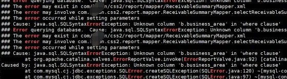
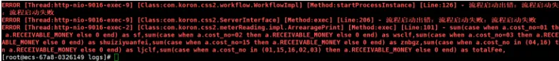
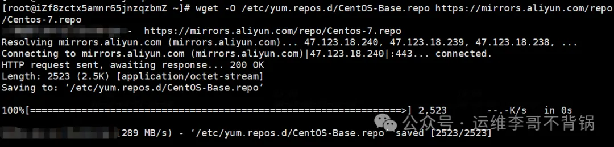
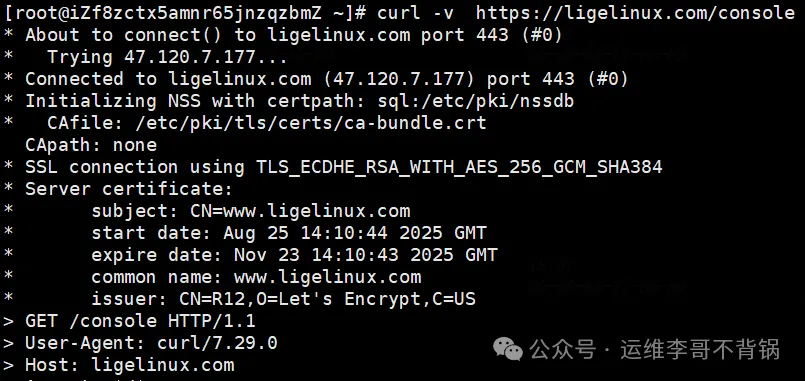
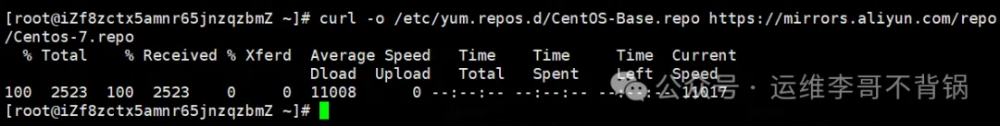
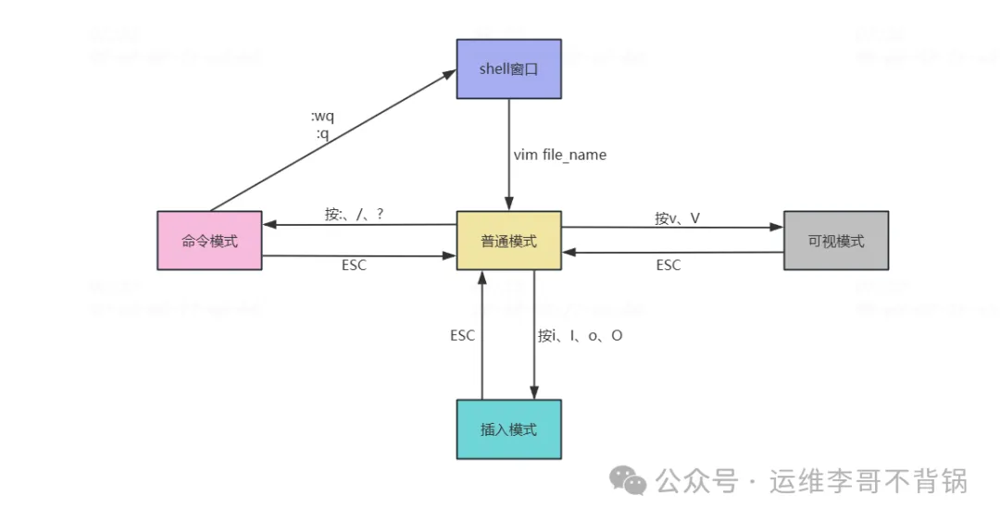

# 1 典型Linux面试题 (Greg, wget, curl，Vim) 

### 1 如何查看系统资源使用情况？

```
top             # 实时显示系统运行信息（CPU、内存、进程）
htop            # top 的增强版（需安装）
free -h         # 查看内存使用情况
df -h           # 查看磁盘使用率
du -sh *        # 当前目录下每个文件夹占用空间
vmstat 1 5      # 显示虚拟内存使用情况
iostat -x 1     # I/O 负载（需安装 sysstat）
uptime          # 查看系统运行时长和平均负载
```

### 2 如何查看端口是否被占用？

**面试官目的：排查端口冲突或服务是否成功启动。**

```
netstat -tulnp | grep :端口号
ss -tulnp | grep :端口号  # 推荐使用，效率更高
lsof -i:端口号            # 查看具体哪个程序占用端口
```


### 3 如何给文件添加执行权限？

```
chmod +x script.sh         # 添加执行权限
chmod 755 script.sh        # rwxr-xr-x：常用于可执行脚本
ls -l                      # 查看权限

# chown命令修改属主属组
chown liyb.liyb script.sh  # 将脚本属主和属组修改为liyb

# -R 参数可以将权限递归
```

### 4 如何查看某个进程的详细信息？

```
ps aux | grep 进程名           # 查找进程 PID 和状态

top -p PID                    # 查看指定 PID 的动态资源占用

cat /proc/PID/status          # 查看进程详细状态

lsof -p PID                   # 查看进程打开的文件

strace -p PID                 # 跟踪系统调用（排查卡顿）
```

### 5 软链接和硬链接的区别？

* **软链接：类似 Windows 快捷方式，指向文件路径。**
* **硬链接：指向相同的 inode，不依赖文件名。**

#### **区别：**

**删除原文件：软链接失效，硬链接仍然可用。**

跨分区：软链接可以，硬链接不行。

**目录：通常不允许创建硬链接**

```
ln -s source.txt softlink.txt     # 创建软链接
ln source.txt hardlink.txt        # 创建硬链接
```

### 6 Linux 系统负载高怎么办？

**确认负载：**

```
uptime     # 查看 load average（过去1、5、15分钟）

top        # 查看 CPU、内存占用进程
```

**查看 I/O 压力：**

```
iostat -x 1

iotop              # 实时查看 I/O 重的进程
```

**内存检查：**

```
free -m

vmstat 1 5
```

**日志检查：**

```
dmesg | tail       # 内核错误信息

journalctl -xe     # 查看最近系统错误
```

高级工具：

**strace、perf top、sar 等用于深入性能分析**

### 8 如何查看和分析系统日志？

**日志位置：**

```
/var/log/messages      # 系统日志（传统 Linux）
/var/log/syslog        # Debian 系
/var/log/dmesg         # 启动硬件日志

journalctl  -xe             # systemd 日志查看器
```

有些是应用日志，需要根据实际的配置路径来查看，查看日志时一般使用tail -f 来持续查看日志输出

### 9 Linux 如何设置定时任务？

```
crontab -e           # 编辑当前用户的定时任务

crontab -l           # 查看当前任务
```

语法结构：

```
* * * * * command_to_run
分 时 日 月 星期 要执行的命令
```

示例：每天凌晨 3 点执行备份脚本

```
0 3 * * * /home/user/backup.sh
```

### 10 如何查找文件或内容？

```
find /path -name "*.log"           # 按名称查找
find / -type f -size +100M         # 查找大文件
```


查找文件内容：

```
grep "关键词" 文件名
grep -r "关键词" ./               # 递归查找
find . -type f | xargs grep "关键词"
```

## 12个grep命令行组合

分享一下grep常用组合。在 Linux/Unix 的日常运维、开发调试、日志分析中，grep 是几乎人手必备的工具。

### 1 最简单查找

```
grep "ERROR" /var/log/messages
```

**这是精确查找方式，查找日志里所有包含 ERROR 的行。**

### 2 忽略大小写

```
grep -i "error" /var/log/messages
```

这是模糊查找方式，-i参数可以忽略大小写。无论 error、Error、ERROR 都能搜到。


### 3 显示行号 + 高亮

```
grep -ni --color=auto "ERROR" /data/tomcat/logs/catalina.out
```

-n带行号输出、带高亮，快速定位问题行。



### 4 统计关键字出现次数

```
grep -c "ERROR" /var/log/messages
```

输出匹配总次数，而不是具体内容。

#### 5 排除干扰信息


```
grep "ERROR" /var/log/messages | grep -v "DEBUG"
```

**先匹配 ERROR，再过滤掉 DEBUG 行。 在复杂日志里很常用。**


#### 6 多关键字组合

```
grep -E "ERROR|WARN" /var/log/messages
```

同时查找 ERROR 或 WARN。

#### 7 抽取关键部分

```
grep -o "ERROR.*"  /data/tomcat/logs/catalina.out
```

只输出匹配片段，比如提取 ERROR 开头的报错内容。



#### 8 搜索整个目录

```
grep -ir "https://www.liyb.com" ./logs
```

**-r 参数是遍历当前目录及目录下所有文件，在代码目录里递归搜索 https://www.liyb.com 标记。**

#### 9 限定文件类型

```
grep -ir --include="*.log" "Logger" ./logs
```

只搜 .log 文件，避免无关文件干扰。

#### 10 查看上下文

```
grep -C 3 "ERROR" catalina.out
```

匹配结果前后各显示 3 行上下文。 组合：


- -A N 只看后面 N 行
- -B N 只看前面 N 行

#### 11. 实时过滤日志

```
tail -f catalina.out | grep "ERROR"
```

生产环境实时盯报错。 组合增强版：

```
tail -f catalina.out | grep -E "ERROR|WARN" | grep -v "DEBUG"
```

实时只看 ERROR/WARN，过滤掉 DEBUG，清爽很多。

#### 12. 结合 find 精确搜索

```
find ./ -name "*.log" | xargs grep "OutOfMemory"
```

在所有 .log 文件里查找 OutOfMemory 报错。


## 3 curl和wget的正确使用姿势

### 1 区别：定位不同

wget：专注于下载，curl：专注于数据传输

简单来说，如果你想下载文件，用wget；如果你想调试API、传输复杂数据，用curl。


### 2 wget：专业的下载工具

**2.1 核心用途**

- 递归下载整个网站
- 断点续传大文件
- 批量下载资源

**2.2 常用操作**

```
# 基本下载，后面直接加URL
wget https://packages.gitlab.com/gitlab/gitlab-ce/packages/ol/9/gitlab-ce-18.2.8-ce.0.el9.x86_64.rpm

# -c: 断点续传（生产环境必备！）
wget -c https://packages.gitlab.com/gitlab/gitlab-ce/packages/ol/9/gitlab-ce-18.2.8-ce.0.el9.x86_64.rpm

# -b：后台下载
wget -b https://packages.gitlab.com/gitlab/gitlab-ce/packages/ol/9/gitlab-ce-18.2.8-ce.0.el9.x86_64.rpm

# 限速下载（避免影响业务）
wget --limit-rate=200k https://packages.gitlab.com/gitlab/gitlab-ce/packages/ol/9/gitlab-ce-18.2.8-ce.0.el9.x86_64.rpm

# -r：递归下载整个目录
wget -r -np -nH https://baidu.com/files/

# 下载并重命名
wget -O /etc/yum.repos.d/CentOS-Base.repo https://mirrors.aliyun.com/repo/Centos-7.repo

# 指定重试次数
wget -t 5 https://baidu.com/unstable-file.zip

# 超时设置
wget -T 30 https://baidu.com/slow-file.zip
```



### 3 curl：强大的数据传输工具

**3.1 核心用途**

- API调试和测试
- 复杂HTTP请求
- 文件上传
- 协议支持广泛（支持20+种协议）

**3.2 常用操作**

```
# 基本请求
curl curl https://ligelinux.com

# 显示详细请求信息（调试神器）
curl -v  https://ligelinux.com/console

# 只显示响应头
curl -I https://ligelinux.com/console

# 指定请求方法
curl -X POST https://ligelinux.com/console
curl -X GET https://ligelinux.com/console


# 发送JSON数据
curl -X POST \
     -H "Content-Type: application/json" \
     -d '{"name":"张三","email":"zhangsan@example.com"}' \
     https://baidu.com/users

# 输出到文件
curl -o /etc/yum.repos.d/CentOS-Base.repo https://mirrors.aliyun.com/repo/Centos-7.repo

# 跟随重定向
curl -L https://ligelinux.com/console
```



### 4 关键区别总结

| 特性 | wget | curl |
|:----|:---:|:---:|
| 主要定位 |下载工具 | 数据传输工具 |
| 协议支持 | HTTP, HTTPS, FTP | 20+种协议 |
| 递归下载 | 原生支持 | 不支持|
| 断点续传 | 原生支持 | 需要特定参数 |
| API调试 | 有限 | 非常强大 |
| 输出默认 | 保存到文件 | 输出到stdout |

### 5 常见误区纠正

**误区1：curl不能下载文件**

错误：很多人认为curl只能查看内容不能下载

正确：curl也能下载

```
# curl也可以下载文件
curl -O  https://mirrors.aliyun.com/repo/Centos-7.repo         # 保持原文件名
curl -o /etc/yum.repos.d/CentOS-Base.repo https://mirrors.aliyun.com/repo/Centos-7.repo
  # 自定义文件名
```



**误区2：wget可以很好地进行API调试**

错误：用wget测试复杂API

正确：wget适合简单下载，复杂API应该用curl

**误区3：两者可以完全互换**

错误：认为curl和wget功能相同

正确：各有专长，根据场景选择


**总之记住这个简单的原则：下载用wget，调试用curl。**

## 4 Vim

```
yum install -y vim
```




1、普通模式

默认的编辑模式。从 shell 窗口打开文件进入的第一个模式，其他模式可以通过按 ESC 键回退到普通模式。

2、命令模式

用于执行复杂查询命令，从普通模式输入“:”，“/”或“?”等符号即可进入命令模式，回车键表示输入完成

3、插入模式

该模式就类似 window 中操作文本文件，普通模式下可通过输入“i”,“o”等字符即可进入插入模式。编辑完成后按 ESC 键退出到普通模式

4、可视模式

用于选定文本块；可以在正常模式下输入“v”（小写）来按字符选定，输入“V”（大写）来按行选定，或输入“Ctrl-V”来按方块选定。

### 三、每个模式的常用操作

**1、vim 打开文件方法**

* vim filename   正常打开vim文件
* vim + filename 打开文件，并将光标置于最后一行
* vim +n filename 打开文件，并将光标置于第n行
* vim +/ssh passwd 打开文件，并将光标置于第一个与ssh匹配的位置
* vim -r filename  恢复上次vim打开时崩溃的文件

**2、普通模式**

- G 跳到最后一行
- **gg 跳到第一行**
- 5G 跳到第5行
- **yy 复制当前行**
- 5yy 复制从当前行往后的5行
- **p 粘贴已复制的行到光标后**
- P 粘贴已复制的行到光标前
- **dd (1)剪切当前行，以p粘贴；(2)删除当前行**
- 5dd 删除5行
- **dG 从当前行删到最后一行**
- D 从光标处删除到行尾
- **5dG 从当前行删到第五行**
- x 删除光标所在位置的字符
- **5x 删除光标所在位置的字符及往后的5个字符**
- X 删除光标所在位置的前一个字符
- **u 撤销之前的操作**
- Ctrl + r 反撤销（恢复撤销）
- 数字0或者^  将光标移动到当前行的行首
- $ 将光标移动到当前行的行尾
- ctrl +f 向下翻页
- ctrl +b 向上翻页
- N 查找下一个相同的字符
- N 查找上一个相同的字符
- r替换光标所在位置的字符
- R 从光标当前位置开始替换字符，输入内容会覆盖后面等长的内容，按“Esc”结束输入
- h向左移动光标
- j向下移动光标
- k向上移动光标
- l向右移动光标

### 3、命令模式常用命令

- :wq 保存退出
- :wq! 强制保存退出
- :q 不保存退出
- :q! 强制退出，一般已经对文件内容已经进行了修改，不保存强制退出的情况使用
- :set nu 设置行号显示
- :set nonu 取消行号
- :set list 取消行号
- set paste 启用粘贴模式
- set nopaste 关闭粘贴模式
- :s/a/b/g 将当前光标所在行中所有a替换成b
- :2,5s/a/b/g 将2-5行中所有a替换成b
- :%s/a/b/g 将文件所有的a替换成b
- /word 从文本查找字符串，按“n”可以查看下一个相同字符 .注意：查找会区分大小写
- /^word 查询以work开头的行
- /work$ 查询以work结尾
- ？work 从文本查找字符串，按“n”可以查看上一个相同字符


### 4、进入插入模式方法

- i光标所在位置插入
- I光标所在位置行首插入
- o光标所在位置下一行插入
- O光标所在位置上一行插入
- a光标所在位置下一个字符的位置插入
- A光标所在位置行尾插

进入到插入模式后就如同进入一个文档文件，按ESC键退出到普通模式

### 5、可视化模式常用操作

- v 字符选择模式，选中光标经过的所有字符
- V 行选择模式，选择光标经过的所有行
