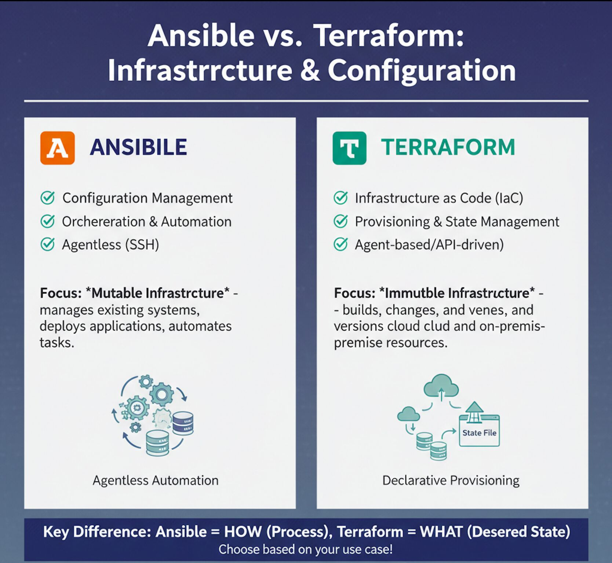
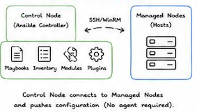

# 1 Ansible Interview Question



## Ansible Quick Reference Guide


### 1 Core Concepts

#### 1-1 Ansible Key Concepts:

**Agentless**: No agent installation on managed nodes.

**SSH Based:** Communicates via SSH (WinRM for Windows).

**YAML Based**: Playbooks written in YAML.

**Idempotent:** Multiple runs bring the same result.

**Declarative:** Define desired state; Ansible ensures it.

**Lightweight:** Simple, Powerful and Easy to use.


#### 1-2 ANSIBLE ARCHITECTURE




#### 1-3 Ansible Components:

**Inventory:** List of hosts and groups.

**Playbook**: YAML file containing plays, tasks.

**Modules**: Reusable units of code to perform tasks.

**Plugins**: Extend Ansible's functionality.

**Roles**: Reusable playbooks and files.

**Variables**: Store data to customize playbooks.

**Facts**: System info gathered from hosts.

**Handlers:** Tasks triggered by notifications.

**Templates:** Dynamic files using Jinja2.


### 2  Command Line & Playbooks


#### 2-1 ANSIBLE AD-HOC COMMANDS

```
ansible all -m ping     # Check connectivity

ansible all -m setup    # Gather facts

ansible all -a command -a "uptime"  # Run command

ansible web -m shell -a "df -h"  # Run shell command

ansible all -m copy -a "sre=/etc/hosts dest=/tmp/hosts" # Copy file 

ansible all -m file -a "path=/tmp/test state=touch"   # Create file

ansible all -m file -a "path=/tmp/test state=absent"   # Delete file

ansible all -m service -a "name=nginx state=started"     #  Start service

ansible all -m service -a "name=nginx state=stopped"     # Stop service

ansible all -m yum -a "name=httpd state=present"       # Install package

ansible all -m yum -a "name=httpd state=absent"       # Remove package

ansible all -m user -a "name=devops state=present"     # Create user

ansible all -m user -a "name=devops state=absent"     # Delete user
```

#### 2-2 PLAYBOOK BASIC EXAMPLE

```
---
- name: Install and start nginx
  hosts: web
  become: yes
  vars:
    pkg_name: nginx
  tasks:
    - name: Install nginx
      yum:
        name: "{{ pkg_name }}"
        state: present

    - name: Start nginx service
      service:
        name: nginx
        state: started
        enabled: yes

    - name: Create index file
      copy:
        content: "<h1>Welcome to Ansible</h1>\n"
        dest: /usr/share/nginx/html/index.html

    - name: Restart nginx
      service:
        name: nginx
        state: restarted
```


**PLAYBOOK STRUCTURE: play -> tasks -> modules -> hosts**


#### 2-3 ROLES STRUCTURE

```
roles/
└── nginx/
    ├── tasks/             # Task definitions
    │   └── main.yml    
    ├── handlers/         # Handler tasks
    │   └── main.yml
    ├── templates/         # Jinja2 templates
    │   └── index.html
    ├── files/          # Static files
    ├── vars/           # Role variables
    │   └── main.yml 
    └── defaults/       # Default variables
        └── main.yml
```


1. Playbook Code Transcription


```
---
- hosts: web
  become: yes
  roles:
    - common
    - nginx
    - firewall
```


1. roles/ (in playbook dir): Ansible first looks for a directory named roles located in the exact same directory as the playbook file being executed.

2. roles/ (in configured path): If not found in the playbook directory, Ansible looks in any directories specified by the roles_path setting in the ansible.cfg configuration file.

3. /etc/ansible/roles/: Finally, Ansible checks the default global system path for roles.

#### 2-4 HANDLERS (NOTIFICATIONS)

```
---
- hosts: web
  become: yes
  tasks:
    - name: Copy config
      template:
        src: nginx.conf.j2
        dest: /etc/nginx/nginx.conf
      notify: Restart nginx

  handlers:
    - name: Restart nginx
      service:
        name: nginx
        state: restarted
```


**Task changes something:** The execution starts with a regular task. In the example, this is the Copy config task. It only proceeds to the next step if the task actually modifies the target system (state change). If the system is already in the desired state (idempotent), the sequence stops here.

**Notify Handler:** Because a change occurred, Ansible looks for a handler matching the notify name.

**Handler runs at the end of play (once)**: This is a key concept. The handler does not run immediately after the task that notifies it. Instead, Ansible waits until all regular tasks in the play have finished executing. Once all tasks are complete, the handler runs. Furthermore, regardless of how many tasks notify the same handler, the handler will only run once at the very end of the play.


Task changes something  -> Notify Handler -> Handler runs at the end of play (once)


#### 2-5 TEMPLATES (JINJA2)

**app.conf.j2**

```
server {
    server_name {{ server_name }};
    listen {{ port }};
    root {{ doc_root }};
}
```


**Variables: vars.yml**

```
server_name: example.com
port: 80
doc_root: /var/www/html
```

**3. Playbook**

```
- name: Configure Nginx
  hosts: web
  become: yes

  vars_files:
    - vars.yml

  tasks:
    - name: Deploy Nginx configuration
      template:
        src: app.conf.j2
        dest: /etc/nginx/conf.d/app.conf
```


**ansible-playbook nginx.yml**

### 3 Security & Best Practices

#### 3-1 ANSIBLE VAULT (ENCRYPT DATA)

```
# Encrypt a file  ansible-vault encrypt secrets.yml
# Edit encrypted file  ansible-vault edit secrets. yml
# View encrypted file  ansible-vault view secrets. yml
# Decrypt a file        ansible-vault decrypt secrets. yml
```

#### 3-2 USEFUL MODULES

command - Run commands

shell - Run shell commands

copy - Copy files

file - Manage files/dirs

template - Template files

yum/apt - Install packages

service - Manage services

user - Manage users

group - Manage groups

lineinfile - Line operations

replace - Replace strings

cron - Manage cron jobs

unarchive - Extract archives

fetch - Fetch files from remote

debug - Debug messages


#### 3-3 ANSIBLE CONFIG (ansible.cfg)

```
[defaults]
inventory            = inventory.ini
remote_user          = ec2-user
private_key_file     = ~/.ssh/id_rsa
host_key_checking    = False
retry_files_enabled  = False
```

#### 3-4 BEST PRACTICES

* Keep playbooks small and focused.
* Use mearingful names for variables and tasks.
* Use roles for reusability.
* Store sensitive data in Ansible Vault.
* Test playbooks in lower environments first.
* Vac_idempnteot modules and avoid shell when possible.


#### 3-5 COMMON ANSIBLE COMMANDS

```
ansible-playbook site.yml.      # Run playbook

ansible-playbook site.yml --check    # Dry run

ansible-playbook site.yml --syntax-check    # Syntax check

ansible-doc yum  # Get module docs

ansible-galaxy init myrole   # Create role

ansible-galaxy install geerlingguy.nginx  # Install role
```

### 1. What is Ansible and how does it work?

Ansible is an open-source configuration management, application deployment, and task automation tool. 


It works by connecting to nodes over SSH (or WinRM for Windows), **pushing small programs called 'modules' to these nodes, and executing them**. 

**The modules are removed once the task is complete**. Ansible uses YAML-based playbooks for automation.

### 2. How can you make Ansible idempotent?

Ansible modules are designed to be idempotent by default, meaning running the same playbook multiple times won't change the system unless there is a change in configuration.

To ensure idempotence, avoid using shell or command modules unless absolutely necessary and rely on modules like `yum`, `copy`, `file`, `service`, etc

#### 3. Scenario: You need to deploy a web application to 100 servers, but 20 are not reachable. How do you handle this in Ansible?

Use `serial` in the playbook to limit the number of servers deployed at a time and handle unreachable hosts gracefully:


```
- hosts: web_servers
  serial: 10
  ignore_unreachable: yes
  tasks:
  - name: Deploy web app
    include_role:
    name: web_app
```

You can also use `--limit` and `--start-at-task` to resume deployments.


#### 4. What are Ansible roles and how do they help in playbook structuring?

- Roles are a way to organize playbooks into reusable components. 
- Each role has a specific structure with directories **like tasks, handlers, templates, files, vars, and defaults.**
- Roles promote reusability, modularity, and clean separation of concerns in complex environments.

#### 5. How does Ansible differ from other configuration management tools like Puppet or Chef?

- Ansible is agentless and uses YAML for playbook definitions, making it easier to learn and use. 
- **Puppet and Chef require agents and use Ruby DSL.**
- **Ansible's push-based model over SSH contrasts with Puppet’s pull model**

#### 6. Scenario: How would you implement dynamic inventory in Ansible for AWS EC2 instances

Use the `ec2.py` dynamic inventory script or the `amazon.aws.aws_ec2` inventory plugin. 

Set up the required AWS credentials and use filters to dynamically target specific instances.

**Example in `ansible.cfg`**

```
[inventory]
enable_plugins = aws_ec2
```

Then configure the plugin in `aws_ec2.yaml`.


#### 7. How do you handle secret variables in Ansible?

**Use `ansible-vault` to encrypt secrets like passwords, API keys, etc.** 

**Create an encrypted file using: `ansible-vault create secrets.yml`**


**Decrypt with `--ask-vault-pass` or use a vault password file. Secrets can also be encrypted inline using `!vault`**

#### 8. What are Ansible facts and how are they used in playbooks?

Facts are system properties collected by the `setup` module. 

**They include details like OS, IP, memory, etc., and are accessible via `hostvars` or directly as variables (e.g.,`ansible_os_family`).**

You can disable them using `gather_facts: no`.

#### 9. Scenario: You need to execute a task only if a specific file exists on the target host. How do you do it?

Use a conditional with the `stat` module to check file existence:

```
- name: Check if config file exists
  stat:
    path: /etc/myapp/config.ini
    register: config_file
    
- name: Run task if file exists
  command: /usr/local/bin/apply_config
  when: config_file.stat.exists
```


#### 10. What are callback plugins in Ansible?

Callback plugins control how Ansible displays output. 

Examples include `default`, `json`,`yaml`, and `minimal`. You can also write custom plugins to log or process events in custom formats.

#### 11. How can you optimize playbook performance?

Use strategies like:

- **Reducing unnecessary fact gathering**
- **Using `block` and `when` to avoid unneeded tasks**
- Limiting hosts with `--limit`
- **Running tasks in parallel with `forks`**
- Using `async` for long tasks
- Leveraging `free` strategy for non-blocking execution

### 12. Scenario: You want to restart a service only when its configuration file changes. How do you do that?

Use handlers triggered by tasks. Example:

```
- name: Copy config file
  template:
    src: app.conf.j2
    dest: /etc/app/app.conf
  notify: Restart app

handlers:
- name: Restart app
  service:
    name: app
    state: restarted
```

#### 13. What is the difference between `include` and `import` in Ansible?

**`import_tasks` and `import_playbook` are static, evaluated at playbook parse time.**


**`include_tasks` and `include_playbook` are dynamic, evaluated at runti**me. Use `include`
when you need conditionals or loops around task files.

#### 14. How do you use Jinja2 templates in Ansible?


Templates are used for dynamically generating configuration files. They use `.j2` extension
and allow variables, loops, and conditionals. Example:

`{{ ansible_hostname }} - {{ inventory_hostname }}`

#### 15. Scenario: You need to run different tasks on RHEL and Ubuntu systems. How would you handle it?

Use conditionals based on `ansible_os_family`:

```
- name: Install package
yum:
name: httpd
state: present
when: ansible_os_family == 'RedHat'

- name: Install package
apt:
name: apache2
state: present
when: ansible_os_family == 'Debian'
```

#### 16. How does Ansible Tower differ from Ansible Core?

Ansible Tower (now part of Red Hat Automation Platform) is a web UI and REST API
interface for Ansible Core. 

**It adds features like RBAC, job scheduling, logging, credentials
management, and workflow support**

#### 18. What is a vault ID and why is it useful?

Vault ID allows multiple vault passwords to be used in a single playbook run, useful when
encrypting different variables with different keys. 


Command: `--vault-id dev@prompt --vault-id prod@prompt`

#### 19. What is the difference between `delegate_to` and `local_action`?

`delegate_to` runs a task on another host (can be remote or localhost), while `local_action` is
shorthand to run on localhost. 


Use `delegate_to` when you want remote delegation.