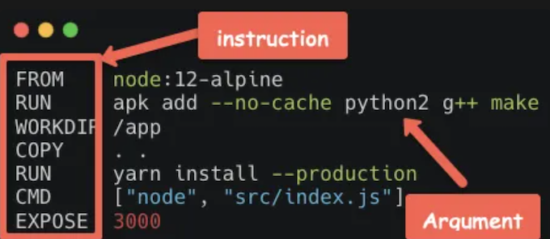
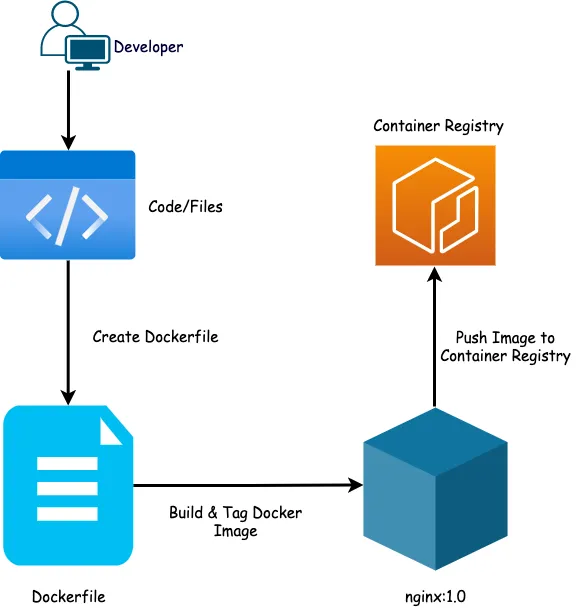
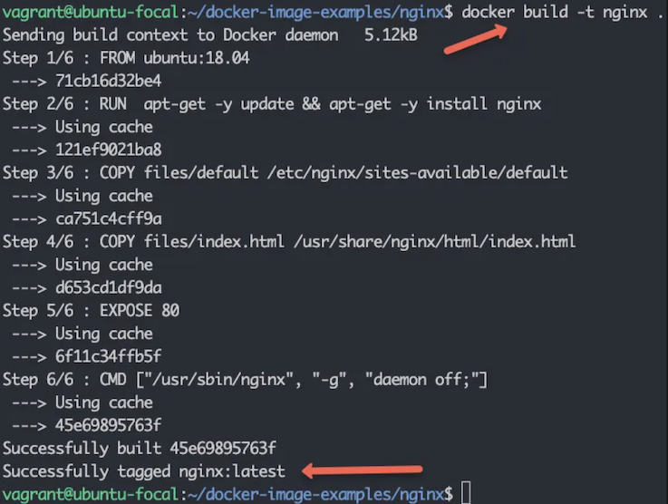
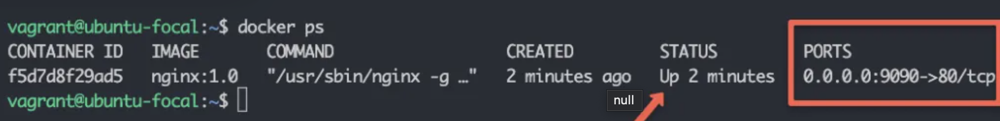
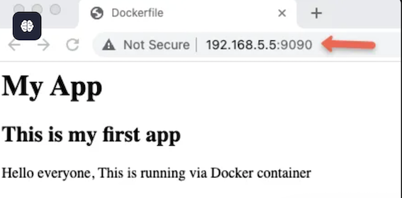
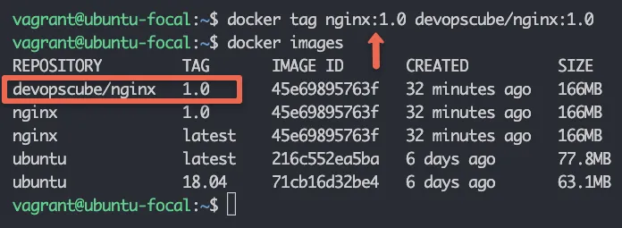
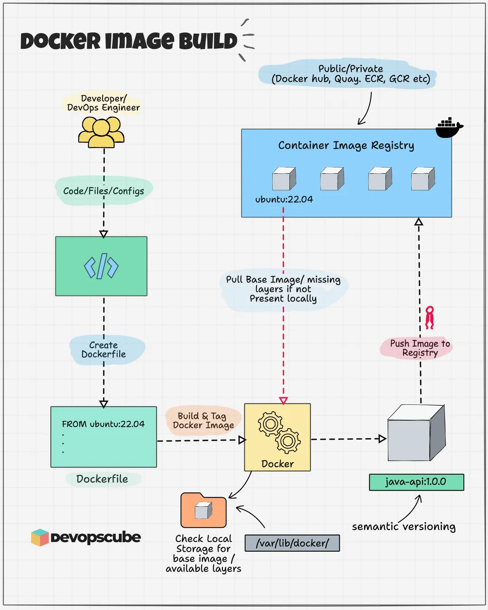
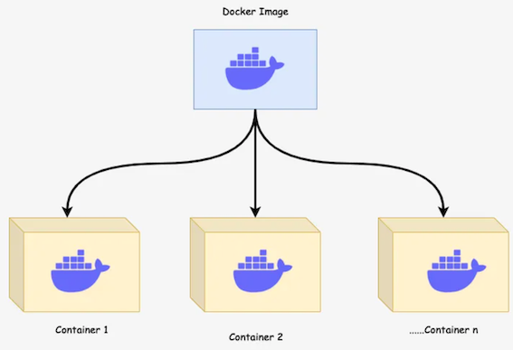

# 2 Docker面试10大必考题

### 1. 什么是 Docker？它与虚拟机（VM）有何区别？

Docker： 轻量级容器化平台，基于操作系统级虚拟化，共享宿主内核，启动快、资源占用低。

**区别：**

* 资源占用：
	* **Docker 容器共享宿主机内核**，
	* **VM 需要独立内核和完整操作系统**。
 
* **启动速度：**
	* 容器秒级启动，
	* VM 分钟级启动。
* **隔离性**
	* VM 提供更强的隔离性，
	* 容器通**过命名空间**和 **Cgroups 实现轻量隔离**。

### 2. 解释 Docker 镜像、容器和仓库的作用。

* **镜像（Image）**： 只读模板，**包含运行应用所需的代码、库和环境**。
* **容器（Container）**： 镜像的运行实例，**具有可写层，生命周期独立**。
* **仓库（Registry）**： 存储和分发镜像的平台（如 Docker Hub、私有仓库）

#### 3. 如何从 Docker 镜像启动一个容器？

```
docker run -d --name my_container -p 8080:80 nginx:alpine
```

*  `-d`： 后台运行
*  `--name`： 指定容器名称
*   `-p`： 端口映射（宿主机端口:容器端口）

#### 4. 什么是 Docker 的多阶段构建（Multi-stage Builds）？

多阶段构建是 Dockerfile 的一种优化技巧，可以减少镜像的大小。

在多阶段构建中，多个 FROM 语句用于在不同阶段构建镜像。

你可以在前一个阶段中执行复杂的构建和安装操作，而在后一个阶段中只复制所需的文件到最终的镜像中。

```
第一阶段：构建应用
FROM golang:1.16 AS builder
WORKDIR /app
COPY . .
RUN go build -o myapp
第二阶段：运行应用
FROM alpine:latest
WORKDIR /root/
COPY --from=builder /app/myapp .
CMD ["./myapp"]
```

在此示例中，第一阶段使用了 golang 镜像来编译 Go 应用，第二阶段只包含一个更小的 alpine 镜像，并从第一阶段复制编译后的可执行文件。

#### 5. 如何查看正在运行的容器日志？

```
docker logs -f my_container  # 实时查看日志

docker logs --tail 100 my_container  # 查看最后 100 行日志
```

#### 6 Docker 数据持久化的方式有哪些？


**Bind Mount： 将宿主机目录挂载到容器。**

```
docker run -v /host/path:/container/path nginx
```

**Volume： 由 Docker 管理的持久化存储卷。**

```
docker volume create my_vol
docker run -v my_vol:/container/path nginx
```

**tmpfs Mount： 仅存储在内存中（临时数据）**

#### 7 如何配置容器间的网络通信？

默认网络： 容器通过 **docker network** 创建的默认桥接网络通信。

自定义网络：
 
```
docker network create my_net
docker run --network my_net --name app1 my_image
docker run --network my_net --name app2 my_image
```

**直接通过容器名通信**： 在自定义网络中，容器可通过名称互相访问（如 ping app1）。

#### 8 如何限制容器的 CPU 和内存使用？

```
docker run --cpus=2 --memory=512m my_image  # 限制 2 核 CPU 和 512MB 内存
```

#### 9 如何调试容器启动失败的问题？

查看容器日志：` docker logs <container_id>`

以交互模式启动容器：

```
docker run -it --entrypoint /bin/sh my_image  # 手动执行命令排查
```

**检查容器状态：`docker inspect <container_id>`**
 
#### 10 Docker Compose 的作用是什么？编写一个简单的 `docker-compose.yml`

**作用： 定义和运行多容器应用，简化容器编排。**

示例：
 
```
version: '3'
services:
  web:
    image: nginx:alpine
    ports:
      - "8080:80"
  db:
    image: mysql:5.7
    environment:
      MYSQL_ROOT_PASSWORD: secret
```

#### 11. 如何以非 root 用户运行容器？

**在 Dockerfile 中指定用户：**

```
FROM alpine
RUN adduser -D myuser
USER myuser
CMD ["sleep", "infinity"]
```

**`RUN adduser -D myuser`**

#### 12 如何避免 Docker 镜像中的敏感信息泄露？

* 使用 `.dockerignore` 文件排除敏感文件（如密钥、配置文件）。
* 通过环境变量传递敏感信息（如 `-e MYSQL_PASSWORD=xxx`）。
* 使用 `Docker Secrets` 或 `Kubernetes Secrets` 管理敏感数据。

#### 13 解释 Docker 的 Cgroups 和 Namespace 的作用。

*  **Cgroups： 限制容器资源使用（CPU、内存、磁盘 I/O）**。
*  **Namespace**： 实现进程、网络、文件系统等资源的隔离（PID、Network、Mount 等）。

#### 14 Docker Swarm 和 Kubernetes 有什么区别？

* Docker Swarm 是 Docker 官方提供的原生容器编排工具，支持容器的部署、扩展和负载均衡。它的优点是设置和使用简单，适合小型或中型应用，但缺乏一些高级功能，如自动化容器健康检查等。
* Kubernetes 是一个更为复杂且功能强大的容器编排平台，广泛用于大规模分布式系统的管理。它支持自动化部署、扩展、管理和服务发现。Kubernetes 提供更强的功能，例如自动扩缩容、自动负载均衡、容器健康检查、故障恢复等。

#### 15 如何优化 Docker 镜像的大小？

* **使用小的基础镜像**： 如使用 alpine 镜像代替 ubuntu 或 debian，因为 alpine 镜像非常小。
* **减少层数**： 每个 RUN 命令都会创建一个新的镜像层，因此应合并命令以减少镜像层数，例如将多个 RUN 命令合并为一个。
* **清理缓存**： **在 Dockerfile 中，可以使用 `RUN apt-get clean` 或 `rm -rf /var/lib/apt/lists/*` 等命令来清理临时文件和缓存，避免将其包含在镜像中**。
* **复制所需文件**： 仅将必要的文件复制到镜像中，避免将不需要的文件（如开发工具、文档等）复制到镜像中。
* **多阶段构建**： **使用多阶段构建，将编译、构建等过程放在临时镜像中，最终的生产镜像只包含运行所需的文件**

#### 16  如何处理 Docker 中的安全性问题？

* **限制容器的权限**： 避免容器运行在 root 用户下，可以使用 USER 指令指定非特权用户。
*  **使用 Docker 审计日志**： 启用 Docker 审计日志来监控容器和镜像的活动
*  **镜像安全**： 从可信的镜像源拉取镜像，避免使用不明来源的镜像，定期扫描镜像是否包含已知的安全漏洞。
*  **网络隔离**： 通过创建用户自定义网络和隔离网络来限制容器之间的通信。
*  **限制容器资源**： 为容器设置资源限制（如 CPU、内存等），避免资源过度占用，影响其他容器或宿主机。
*   **使用 seccomp 和 AppArmor： Docker 支持 seccomp 和 AppArmor 安全模块，可以进一步限制容器的系统调用，增加容器的安全性**。

#### 17. 如何在 Docker 中配置容器间的通信？

* **使用 Docker 网络**： 容器默认会连接到一个名为 bridge 的网络，但你也可以创建自定义网络，**通过创建用户自定义的 bridge 网络或 overlay 网络（适用于 Docker Swarm 环境）来让容器进行更灵活的通信**。
* **端口映射**： 可以通过 **`docker run -p <host_port>:<container_port>`**命令将容器内部的端口映射到宿主机的端口，以便外部可以访问容器内的服务。
* **容器间通信**： 在同一网络中的容器可以通过容器名称来相互通信。容器的 DNS 会自动解析其他容器的名称。

### 18 如何在 Docker 中设置环境变量？

**在 Dockerfile 中设置环境变量**： 使用 ENV 指令来设置环境变量。例如：

```
ENV ENV_VAR_NAME value
```

**在运行容器时传递环境变量： 使用 `-e` 或 `--env` 参数传递环境变量**。例如：

```
docker run -e ENV_VAR_NAME=value my_image
```

在 Docker Compose 文件中设置环境变量： 使用 environment 配置项来为服务指定环境变量。例如：

```
version: '3'
services:
  web:
    image: my_image
    environment:
      - ENV_VAR_NAME=value
```
 
#### 19 如何监控 Docker 容器的性能？

* **Docker Stats： 使用 docker stats 命令查看正在运行的容器的实时资源使用情况，包括 CPU 使用率、内存使用情况、网络 I/O 和磁盘 I/O 等**。
* Prometheus 和 Grafana： 使用 Prometheus 收集 Docker 容器的指标数据，并通过 Grafana 可视化展示。
* **cAdvisor： Google 提供的 cAdvisor（Container Advisor）可以监控 Docker 容器的性能，提供 CPU、内存、网络等方面的指标**。
* Docker API： 通过 Docker API 获取容器的性能数据，可以集成到自定义的监控系统中。

#### 20. 如何在 Docker 中实现高可用性（HA）？

实现 Docker 的高可用性（HA）通常涉及以下几个方面：

* **Docker Swarm / Kubernetes**： 使用 Docker Swarm 或 Kubernetes 来管理容器的集群，这两个工具都支持高可用性。它们可以在容器或节点失败时自动调度和重启容器，确保应用的可用性。
* **服务副本**： 通过在 Docker Swarm 或 Kubernetes 中配置多个副本，确保服务的高可用性。若某个容器或节点发生故障，系统会自动重新调度或重启副本容器。
* **负载均衡**： **配置负载均衡器（如 HAProxy、Traefik、Nginx）来将流量分发到不同的容器实例，确保请求的分配均匀，从而提高可用性**。
* **存储和数据持久化**： 使用分布式存储系统（**如 Ceph 或 GlusterFS**）来保证容器中的数据不丢失，即使容器迁移或重启。
* 健康检查： 配置容器健康检查（HEALTHCHECK）指令，确保容器健康，失败时自动重启容器。


#### 21. 如何处理 Docker 的容器间服务发现？

容器间服务发现是确保容器在不同环境中能够互相通信的关键。Docker 提供了几种方式来实现服务发现：

* **Docker 默认的 DNS 解析**： 在 Docker 中，容器通过名称进行通信。当容器连接到同一网络时，Docker 会自动为每个容器分配一个 **DNS 名称**，容器可以通过该名称访问其他容器。**例如，容器 web 可以通过 http://db:3306 访问容器 db，前提是它们在同一个网络中**。
* **Docker Compose**： 在使用 Docker Compose 时，每个服务会自动成为网络的一部分，并且 Compose 会自动配置服务名称的 DNS 解析。服务可以通过其名称互相发现，例如 web 服务可以通过 db 服务名访问数据库。
* **Consul 或 Etcd**： 对于更复杂的应用，使用工具如 Consul 或 Etcd 来进行服务注册与发现。这些工具可以为容器提供动态的服务发现机制。
* **Kubernetes DNS： Kubernetes 提供了自动的服务发现机制，Pods 之间可以通过服务名称（如 my-service.default.svc.cluster.local）进行通信**。

#### 22. Docker 容器的资源限制如何工作？

Docker 提供了多种方式来限制容器的资源使用，以确保容器不会消耗过多的系统资源。常见的资源限制包括

**CPU 限制**

* **--cpus** : 限制容器的 CPU 使用量。**例如，`--cpus="1.5"` 限制容器使用最多 1.5 个 CPU 核心**
* **--cpu-shares**： 为容器指定 CPU 权重，默认值是 1024。高权重的容器将获得更多的 CPU 时间
* **`--cpuset-cpus`**:  限制容器只能使用指定的 CPU 核心。例如，**--cpuset-cpus="0.1"** 限制容器只在 CPU 0 和 1 上运行。 

**内存限制**

* `--memory`：限制容器的最大内存使用量。例如，`--memory="512m"` 限制容器最多使用 512MB 内存。
* `--memory-swap`: 设置容器的最大交换内存。**此值应该大于 `--memory`，否则 Docker 会禁止交换**。

**磁盘 I/O 限制：**

* **`--blokio-weight`**:  设置容器的磁盘 I/O 权重，**值范围是 10 到 1000，默认值是 500**。
* `--device-read-bps` \ ` --device-write-bps` :分别限制容器的读写速率。

**网络带宽限制：**

`--network`: 配置容器的网络设置并限制带宽。

#### 23. Docker 镜像的多阶段构建有什么优势？

多阶段构建可以大大优化 Docker 镜像的大小和构建效率，主要优势如下：

* **减少镜像大小**： 多阶段构建允许在一个 Dockerfile 中进行不同阶段的构建，最终只将生产环境所需的文件复制到最终的镜像中。这种方式避免了将不必要的工具、编译器等包含在最终镜像中，从而减少镜像的大小。
* **分离构建和运行环境**： 在第一个阶段中可以使用重的开发环境，如构建工具和依赖，然后在第二阶段中使用精简的基础镜像（如 alpine），仅包含最终应用所需的运行时环境。
* **加速构建**： 可以通过缓存机制加速构建过程，减少不必要的步骤和重复操作，尤其是在使用 CI/CD 工具链时。

**Dockerfile**

```
第一阶段：构建
FROM golang:1.16 AS builder
WORKDIR /app
COPY . .
RUN go build -o myapp
第二阶段：运行
FROM alpine:latest
WORKDIR /root/
COPY --from=builder /app/myapp .
CMD ["./myapp"]
```

#### 24. 如何处理 Docker 容器中的日志管理？

Docker 提供了几种方式来处理和管理容器的日志：

**Docker 默认日志驱动**： 

Docker 使用不同的日志驱动（如**json-file、journald、syslog** 等）。默认日志驱动是` json-file`，容器的日志被存储在宿主机的 `/var/lib/docker/containers/<container-id>/` 目录下

**配置日志驱动：**

通过 `--log-driver` 选项指定其他日志驱动（如 syslog、fluentd、awslogs 等）以将日志发送到外部系统。

**Docker logs 命令**

通过 `docker logs <container-id>` 命令查看容器的标准输出和标准错误日志

**集中式日志管理：** 
 
 对于生产环境，使用集中式日志管理工具，如 ELK（Elasticsearch, Logstash, Kibana） 堆栈、Fluentd、Graylog 等，将容器日志集中收集和分析。
 
**日志轮转**： 

为防止日志文件过大，可以配置日志轮转。**Docker 支持 `max-size` 和 `max-file` 选项来设置日志轮转和保留日志文件的数量**

#### 25. 如何在 Docker 中调优性能？

Docker 容器的性能优化主要涉及以下几个方面：

* **镜像优化**： 使用轻量级的基础镜像（如 alpine）以减少镜像的大小，并且只包含运行时所需的依赖。
* **容器资源限制**： 合理限制 CPU、内存、I/O 等资源，确保容器不会消耗过多的资源，影响其他容器或宿主机。
* **合并 Dockerfile 层**： **通过减少 Dockerfile 中的 RUN、COPY 等命令的数量，减少镜像层数，优化构建时间**。
* **使用共享内存**： 通过使用 `--shm-size` 参数为容器设置适当的共享内存大小，避免内存不足导致性能瓶颈。
* **性能监控**： 使用 Docker 内建的 docker stats 命令或 Prometheus + Grafana 等工具来监控容器性能，识别瓶颈。
* **日志优化**： 避免将日志写入容器内的本地文件系统，尤其是在高负载环境下。使用外部日志管理系统

#### 26 如何在 Docker 中处理容器的高效网络通信？

* **用户定义网络**： **通过创建用户定义的 bridge 网络或 overlay 网络，使容器能够通过名称相互通信，且性能更优**。
* **Docker 网络模式： Docker 支持不同的网络模式，如 host、bridge、overlay、none**。选择合适的网络模式来确保容器间高效通信。
* **容器连接到多个网络**： 一个容器可以连接到多个网络，这样可以同时享受不同网络配置带来的优势。
* **网络 I/O 性能调优**： 通过设置网络带宽限制、优化网络接口的配置，


## 如何构建 Docker 镜像

### Dockerfile 详解

一个 Docker 镜像最基础的建筑块是一个 Dockerfile。

一个 Dockerfile **是一个带有指令和参数的简易的文本文件**。Docker 可以通过读取这些在 Dockerfile 里给出的指令自动构建镜像。

在一个 Dockerfile 里，在左边的一切都是**指令(Instruction)**，**而在右边的一切都是赋予给指令的参数(Argement)**。还有，要记着这个文件名称是 Dockerfile 它不需要任何的扩展名



以下的表格中包含了重要的 Dockerfile 指令和它们的解释。

Dockerfile 指令 | 解释
------------- | -------------
**FROM**	  |   可以从容器注册表拉取的基础镜像 ( Docker hub, GCR, Quay, ECR, 等等)
**RUN**  | 在镜像构建过程中执行的命令
 **ENV** |  在镜像中设置环境变量。它是构建过程中是可用的，同样在运行的容器中也是。如果您只想要在构建时间中使用它，请使用 ARG 指令
 **COPY**	|  拷贝本地文件和目录到镜像中
 **EXPOSE**	|  为 Docker 容器指定特定的要暴露的端口
 **ADD**	|  它是 COPY 指令的功能更丰富的版本。它还允许从源 URL 复制并将 tar 文件自动提取到镜像中。但是，**建议使用 COPY 命令而不是 ADD**。如果要下载远程文件，**请使用 curl 或使用 RUN 获取**
 **WORKDIR** |  设置当前的工作目录。您可以在一个 Dockerfile 里面重复使用这个指令去设置一个不同的工作目录。如果您设置了 ENTRYPOINT，像 RUN，CMD，ADD，COPY，或者 ENTRYPOINT 这样的指令就会在你的这个目录里执行
**VOLUME**	|  它是用于创建或者挂载卷到 Docker 容器
**USER** | 当运行容器时，设置用户名称和 UID 。你可以使用这个指令去设置一个非 root 的容器用户
**LABEL** | 它是去指定 Docker 镜像的 metadata 信息
**ARG** |  **设置构建时，带有 Key 和 Value 的变量。当容器运行时，ARG 变量将不可用。如果你坚持想要在一个运行的容器中使用一个变量，请使用 ENV**
**SHELL**	| 它被用于为了给其后的 RUN，CMD 和 ENTRYPOINT 去设置 shell 选项和默认 shell 。
**CMD** | 它用于在一个运行的容器中执行一条命令。**这里只能有一个 CMD， 如果有多个，它只让最后一个执行。它还可以被 Docker CLI 覆盖**
**ENTRYPOINT**	 | 当容器启动时，指定的命令将会执行。如果您不指定任何 ENTRYPOINT，它默认会是 `/bin/sh -c `。您还可以使用 CLI 的 `--entrypoint` 覆盖 ENTRYPOINT。

## 使用 Dockerfile 构建 Docker 镜像

在这一节，您将会学习使用一个在现实工作中使用的案例去构建一个 Docker 镜像。我们将会从头使用一个自定义的 Index 页面去创建一个 Nginx Docker 镜像。

以下的照片展示了镜像构建过程的工作流。



**步骤 1: 创建一个必须的文件和文档**

创建一个名为 nginx-image 和一个名为 files 的文件夹

```
mkdir nginx-image && cd nginx-image
mkdir files
```


创建一个 `.dockerignore` 文件

```
touch .dockerignore
```

**步骤 2: 创建一个模板 HTML 文件和 config 文件**


当您构建一个为实时项目的 Docker 镜像时，它包含了代码或者应用配置文件。

用于演示目的，我们将要创建一个简单的 HTML 文件和 config 文件作为我们的 app 代码，再使用 Docker 打包。

这是一个简单的 index.html 文件。如果您愿意，您可以创建您自己喜欢的。

cd 进入文件夹

```
cd files
```

创建一个 index.html 文件

```
vim index.html
```

复制以下的内容到 index.html 再保存这个文件

```
<html>
  <head>
    <title>Dockerfile</title>
  </head>
  <body>
    <div class="container">
      <h1>My App</h1>
      <h2>This is my first app</h2>
      <p>Hello everyone, This is running via Docker container</p>
    </div>
  </body>
</html>
```
创建一个名字为 default 的文件

```
vim default
```

**复制以下的的内容到 default 文件**

```
server {
    listen 80 default_server;
    listen [::]:80 default_server;
    
    root /usr/share/nginx/html;
    index index.html index.htm;

    server_name _;
    location / {
        try_files $uri $uri/ =404;
    }
}
```

**步骤 3: 选择一个基础镜像**

我们在 Dockerfile 中使用 FROM 命令，该命令指示 Docker 根据 Docker 中心或任何使用 Docker 配置的容器注册表上可用的镜像创建镜像。 我们称它为一个基础镜像。

它是和我们在云上如何从一个虚拟机镜像创建一个虚拟机是相似的。

选择一个基础镜像取决于我们的应用和选择的 OS 平台。在我们的例子中，我们选择 ubuntu:18.04 基础镜像。

**步骤 4: 创建一个 Dockerfile**

在 nginx-image 文件夹中创建一个 Dockerfile。


```
vim Dockerfile
```

这里是一份简单的 Dockerfile 为了我们能够好的继续。然后把这些添加到我们的 Dockerfile。

```
FROM ubuntu:18.04  
LABEL maintainer="contact@devopscube.com" 
RUN  apt-get -y update && apt-get -y install nginx
COPY files/default /etc/nginx/sites-available/default
COPY files/index.html /usr/share/nginx/html/index.html
EXPOSE 80
CMD ["/usr/sbin/nginx", "-g", "daemon off;"]
```
 
这里是每一步的解释：

1. 使用 LABEL 指令, 我们添加了关于维护者的 一些信息。他不是必须的指令哈。
2. **FROM 指令将会从 Docker hub 拉取 Ubuntu 18.04 版本的镜像，在第三行，我们正在安装 Nginx** 。
3. 然后，我们将 Nginx 的默认配置文件从本地文件目录拷贝到目标镜像目录。
4. 下一步，**我们将 Index.html 文件从本地目录拷贝进目标镜像目录**。它将会覆盖在 Nginx 安装过程中被创建的默认的 Index.html 文件。
5. 我们暴露了 80 端口，作为 Nginx 服务监听的 80 端口。
6. 最终，当 Docker 镜像启动，我们的 Nginx 服务会在运行过程中使用 CMD 指令。

> 在Docker 容器， 这个 daemon off; 指令会告诉 Nginx 停留在前端。这就意味着 Nginx 进程进会保持运行不会停止，直到你自己停止这个容器。它不允许 Nginx 的 自守护进程行为。-g 选项指定了一个指令给 Nginx 。

我们在前台运行该进程的原因是将控制台进程附加到标准输入、输出和错误。这意味着您可以看到来自 Nginx 进程的日志或消息。

**步骤 4: 构建你的第一个 Docker 镜像**

最终的文件夹和文件结构看起来像以下内容。

```
nginx-image
├── Dockerfile
└── files
    ├── default
    └── index.html
```

现在，我们要使用 Docker 命令构建我们的镜像。以下的命令会从相同的目录使用 Dockerfile 构建镜像。

```
docker build -t nginx:1.0 .
```

1. `-t` 是为了给这个镜像起个名字和指定你的标签
2. nginx 是这个镜像的名字
3. 1.0 是这个标签名称。如果你不添加任何标签，它默认的标签名称为 Latest
4. . 在末尾的 . 意味着我们会参考 Dokerfile 位置作为我们的 Docker 构建上下文。也就是我们现在的目录



如果 Dockerfile 在另一个文件夹，那么你需要明确的把它指定出来，否则会找不到

```
docker build -t nginx /path/to/folder 

docker images
```

```
vagrant@ubuntu-focal:~$ docker images
REPOSITORY TAG IMAGE ID CREATED SIZE
nginx 1.0 45e69895763f 23 minutes ago 166MB
nginx latest 45e69895763f 23 minutes ago 166MB
ubuntu latest 216c552ea5ba 6 days ago 77.8MB
ubuntu 18.04 71cb16d32be4 6 days ago 63.1MB
```

我们在这里可以看见标签是1.0。 如果我们想要弄一个指定的标签，我们可以这样写 image-name:[tag] 。还是那句话，如果你不指定任何标签，默认会是 Latest 。

```
docker build -t nginx:2.0 .
```

一个单一的镜像可以有多个标签。这里有两种我们普遍认同的给镜像打标签的方法：

1. 稳定的 Tags – 我们可以继续拉取我们指定的标签，它会继续获得更新。标签总是不变的，但是镜像的内容可以改变。

2. 唯一的 Tags – 我们为每一个镜像使用一个不同和唯一的标签。有多种方式可以提供唯一标签，**例如日期时间戳、构建编号、提交 ID 等**。
 
**步骤 5: 测试你的 Docker 镜像**

现在，构建过镜像之后，我们将会运行这个 Docker 镜像。这个命令是：

```
docker run -d -p 9090:80 --name webserver nginx:1.0
```

这里

1. `-d` 这个表示让容器在后台运行
2. `-p` 这个为了指定端口，格式为 本地端口:容器端口
3. `--name` 指定容器的名称，webserver 是我们的名称

我们可以通过以下的命令检查这个容器

```
docker ps
```



现在在浏览器中，如果你去到 http://[host-ip]:9090，您可以看到索引页，其中显示了我们添加到 docker 镜像中的自定义 HTML 页面中的内容。



### 推送 Docker 镜像到 Docker Hub

推送我们的 Docker 镜像到 Docker hub，我们需要在 Docker hub 创建一个帐号。

从终端执行以下命令登录。它将会要求输入一个用户名和密码。也支持 Docker hub 凭证。

```
docker login

docker tag nginx:1.0 <username>/<image-name>:tag

docker tag nginx:1.0 devopscube/nginx:1.0
```

再次运行 docker images 命令，检查被打了标签的镜像将会显示在这里。



现在，我们使用以下的命令推送我们的镜像到 Docker hub 。

```
docker push devopscube/nginx:1.0
```



### 在 Dockerfile 中使用 heredoc

```
RUN <<EOF
apt-get update
apt-get upgrade -y
apt-get install -y nginx
EOF
```

还有， 让我们聊聊你想要从 Dockerfile 执行的一个 Python 脚本，你可以使用以下的的语法。

```
RUN python3 <<EOF
with open("/hello", "w") as f:
    print("Hello", file=f)
    print("World", file=f)
EOF
```

你还可以使用 heredoc 语法去创建一个文件，这里是一个 Nginx 例子。

```
FROM nginx

COPY <<EOF /usr/share/nginx/html/index.html
<html>
  <head>
    <title>Dockerfile</title>
  </head>
  <body>
    <div class="container">
      <h1>My App</h1>
      <h2>This is my first app</h2>
      <p>Hello everyone, This is running via Docker container</p>
    </div>
  </body>
</html>
```

### Dockerfile 的最好实践

这里是一些我们应该遵循 Dockerfile 的通常做法：

1. 使用一个 `.dockerignore` 文件去排除不必要的文件和目录，好增强我们的构建性能。
2. 只使用被信任的基础镜像，进行定期更新的镜像。
3. 在 Dockerfile 每一个指令都向 Docker 镜像添加了额外的一层。通过把指令合并，让镜像层尽量以最少的层去构建，有助于增强构建性能和时间。
4. **以一个非 ROOT 用户去运行，有助于更加安全**。
5. 把镜像体积保持为最小：在你的镜像中，为了更快的部署， 要避免安装不必要的工具，以减少镜像的大小。使用尽可能小的镜像为了减少攻击面。
6. 使用特定标签覆盖镜像的最新标签，以避免随着时间的推移发生重大变化。
7. 当创建多个缓存的层时，它通常会影响到构建过程的效率，所以应避免使用多个 RUN 命令。
8. **永远不要往你的 Dockerfile 中共享和拷贝应用程序的凭证或者任何敏感的信息。如果你使用了它，请将其添加它到 .dockerignore**。
9. 尽可能在末尾中使用 EXPOSE 和 ENV 命令。
10. **使用一个 linter: 使用一个像 hadolint 的 linter 去检查你的 Dockerfile，这是为了常见的问题和最好的实践**。
11. 每一个容器只使用一个单独进程: 每一个容器应该只运行一个单独的进程。这是为了让它更容易去管理和监控容器，还有帮助我们保持容器是轻量的。
12. **使用多阶段构建**：使用多阶段构建去创建更小和更有效率的镜像。

### 潜在的 Docker 构建问题

1. **如果在 Dockerfile 里面有一个语法错误或者一个无效的参数，Docker build 命令将会有一个错误信息的失败。可以检查语法去解决这个**。
2. 始终尝试使用 **docker run 命令为容器命名**。如果不指定名称，Docker 会自动分配一个随机名称，这可能会导致一些问题。
3. 端口冲突问题：有时会遇到类似 Bind for **0.0.0.0:8080 failed: port is already allocated 的错误，这是因为其他软件或服务正在使用该端口**。可以通过 netstat 或 ss 命令检查端口占用情况，然后选择使用其他端口或停止占用端口的服务来解决此问题。
4. **依赖包下载失败：有时 Docker 会报错 Failed to download package [package-name]**，这通常是因为容器无法访问互联网或存在其他依赖问题

### Docker Image vs. Containers

Docker 镜像是文件系统和应用依赖的快照。

**它是一个可执行的软件包，包含了运行应用所需的一切，比如应用代码、库、工具、依赖项和其他文件。你可以将其类比为虚拟机的黄金镜像。**

> Docker 镜像以堆叠在一起的只读层形式组织。


Docker 容器是 Docker 镜像的运行实例。就像从虚拟机镜像创建虚拟机一样，我们从容器镜像创建容器。当你从 Docker 镜像创建容器时，会在现有镜像层之上创建一个可写层。

Docker 镜像和容器之间的主要区别在于容器顶部的可写层。**这意味着，如果你从一个镜像运行了五个容器，所有容器都会共享镜像中的相同只读层，而顶部的可写层对每个容器来说是独立的**。

镜像可以独立于容器存在，而容器需要镜像才能运行。我们可以从同一个镜像创建多个容器，每个容器都有自己独立的数据和状态。



