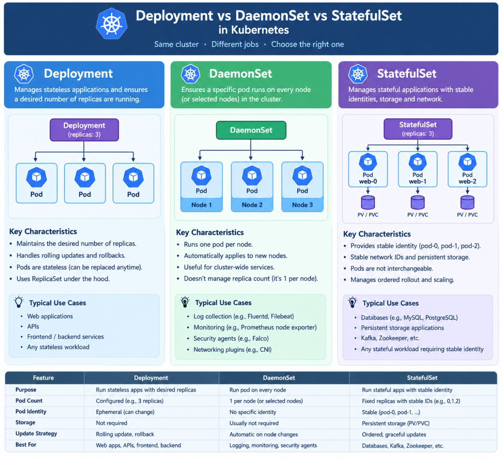
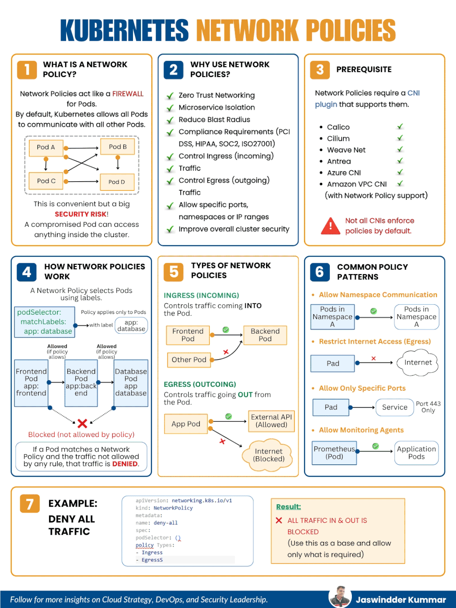
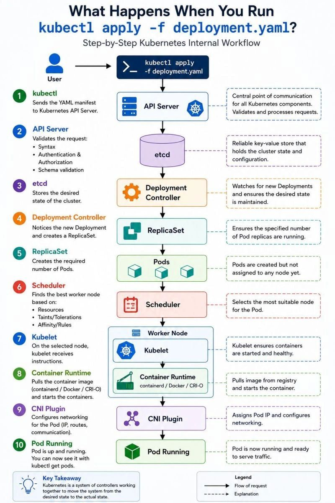
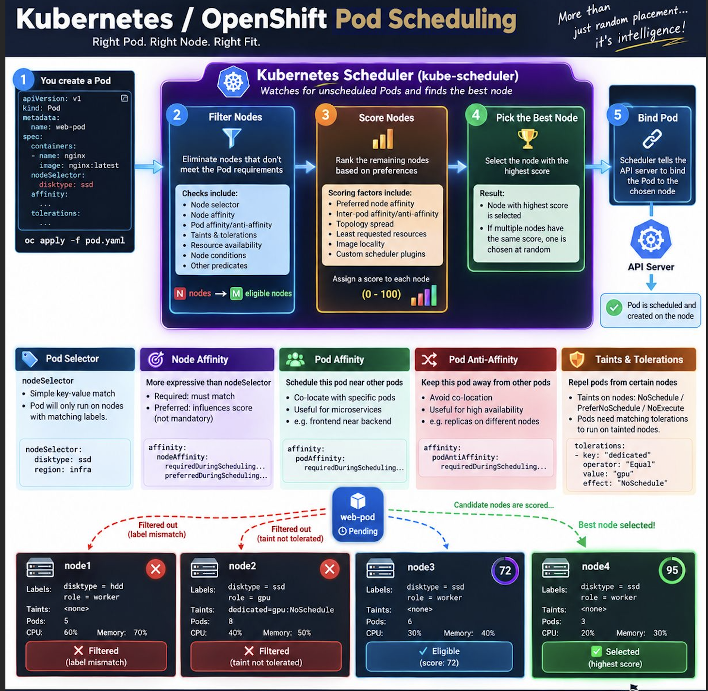
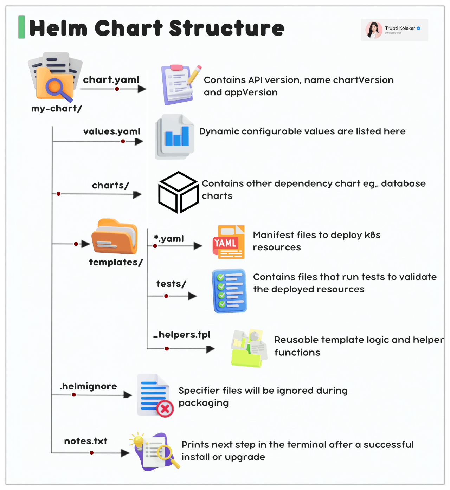
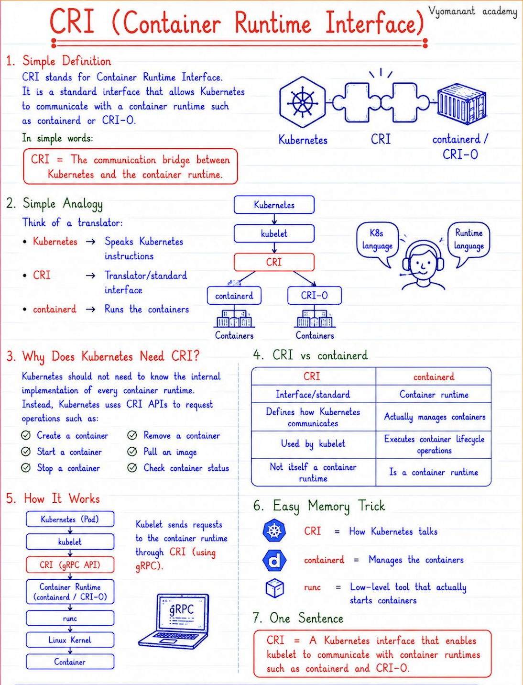
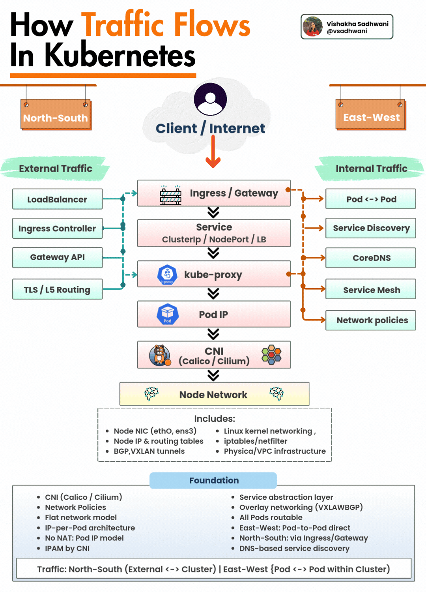
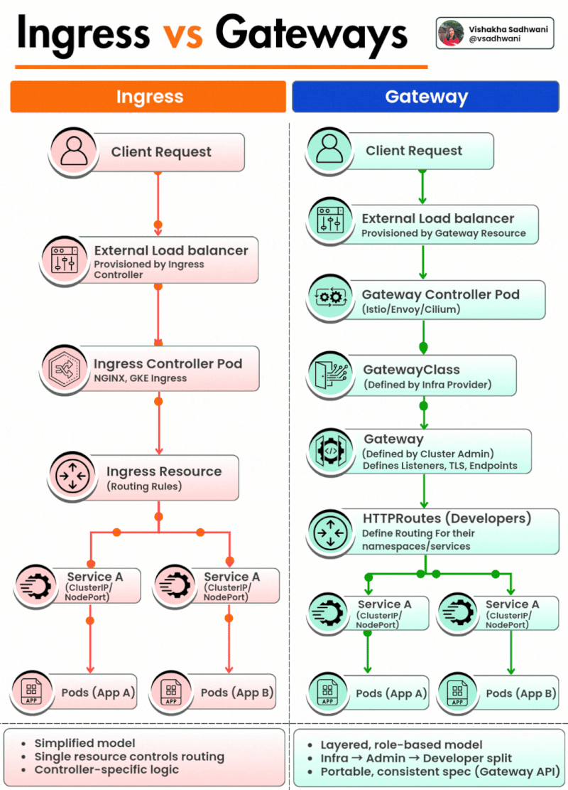

####  1. What is the difference between a Deployment and a StatefulSet in Kubernetes?

A Deployment is used for stateless applications where the state of the application does not need to be preserved. 

It manages replica sets and ensures that the desired number of pod replicas are running.


A StatefulSet, on the other hand, is used for stateful applications where each pod needs to be uniquely identified and must retain its state even after rescheduling.

**<mark>It assigns a stable identity (DNS name and persistent volume) to each pod</mark>**

**Key differences:**

* **Pod Identity**: StatefulSet pods have stable hostnames (e.g., web-0, web-1) while Deployment pods do not
* **Storage**: *StatefulSets are typically used with persistent volume claims (PVCs) that are retained even when pods are deleted.*
* **Scaling behavior**: StatefulSets create/delete pods in order, while Deployments do it in parallel.

**Example Use Case:**

- Deployment: Web servers, microservices.
- StatefulSet: Databases like MySQL, MongoDB, Kafka

**Deployment**

* Pods are anonymous
* **Pods don't have stable storage**
* Easy scaling (add/remove pods)
* Stateless applications

**StatefulSet**

- Each pod has a unique identity (pod-0, pod-1)
- Each pod has its own persistent volume
- Scaling pods is more controlled with stable identities
- Stateful applications (e.g., databases)

#### 2. Explain how Kubernetes handles rolling updates and rollbacks.

Kubernetes supports **rolling updates using the Deployment controller**. 

It updates pods in a controlled fashion to minimize downtime. 

The process gradually replaces old pods with new ones, ensuring that some pods are always running

RollingUpdate Strategy: Default update strategy in Deployments.


* **maxUnavailable**: How many pods can be unavailable during the update.
* **maxSurge**: How many extra pods can be created during the update.

**Rollback**:

If a rollout fails or a bug is introduced, Kubernetes allows you to rollback to the previous version

```
kubectl rollout undo deployment <deployment-name>

kubectl rollout status deployment my-deployment

kubectl rollout history deployment my-deployment

kubectl rollout undo deployment my-deployment
```

Benefits:

- Zero-downtime deployment.
- Version tracking of rollouts.
- Fast recovery from bad deployments.


#### Deployment vs DaemonSet vs StatefulSet in Kubernetes





#### 3. What are Kubernetes DaemonSets and give a real-world use case?

A DaemonSet ensures that a copy of a pod runs on every node (or a subset of nodes) in the cluster

Use Cases:

* **Running a node-level monitoring agent** (e.g., Prometheus Node Exporter).
* **Running a log collector** (e.g., Fluentd, Filebeat).
* **Running a storage driver or system daemon**.

When a new node is added to the cluster, the DaemonSet controller automatically schedules the pod on the new node.

#### 4. What are the differences between ConfigMap and Secret in Kubernetes?


Both ConfigMap and Secret are used to inject configuration into pods, but they serve different purposes

**ConfigMap**

* Store non-sensitive config data
* Plain text
* Not encrypted
* Yes

**Secret**

* Store sensitive data (passwords, tokens)
* Base64 encoded
* Can be encrypted at rest (KMS)
* Yes


#### 5. What is the role of etcd in a Kubernetes cluster?

etcd is a distributed key-value store used by Kubernetes to store all cluster data. 

**It acts as the source of truth for the Kubernetes control plane.**

**Responsibilities:**

* **Stores configuration data, cluster state, secrets, and service discovery info**.
* Supports consistent reads and writes across the cluster.


Key Features:

- **Highly available and distributed**.
- **Uses Raft consensus algorithm for leader election and consistency**.
- Requires backup and disaster recovery strategy.

Security Considerations:

* TLS encryption.
* Authentication and access control.

```
To view keys in etcd (if directly accessing):

ETCDCTL_API=3 etcdctl get "" --prefix --keys-only
```

#### 6. How does Kubernetes networking work? Explain the Pod-to-Pod communication.

**Kubernetes networking is based on a flat network model**, where all pods can communicate with each other without NAT (Network Address Translation), regardless of the node they’re on.

**Core Networking Rules:**

1. <mark>**Every pod gets its own IP address**.<mark>
2. <mark>**All pods can reach each other directly via IP**.<mark>
3. <mark>Containers within a pod share the same network namespace (localhost).<mark>
4. <mark>**Communication between pods across nodes is handled by CNI plugins (e.g., Calico,Flannel, Cilium).**<mark>

**Pod-to-Pod Communication Steps:**

- Pod A wants to reach Pod B using Pod B’s IP.
- If both pods are on the same node: **traffic stays local**.
- <mark>If on different nodes: the packet is routed via virtual network interfaces provided by the CNI plugin<mark>.

```
kubectl exec -it pod-a -- curl <pod-b-ip>:<port>
```

#### 7. What are Kubernetes Network Policies and how do they work?

**A NetworkPolicy in Kubernetes is a resource used to control traffic flow at the IP address or port level between pods**

Default Behavior:

**By default, all pods can communicate with all other pods. NetworkPolicies restrict this.**

Features:

* <mark>Allow/deny ingress (incoming) or egress (outgoing) traffic.</mark>
* Based on labels, namespaces, and IP blocks.
* **Require a CNI plugin that supports NetworkPolicy (e.g., Calico, Cilium)**

**Example: Allow ingress traffic to pods with label app=db only from app=web:**

```
apiVersion: networking.k8s.io/v1
kind: NetworkPolicy
metadata:
 name: allow-web-to-db
spec:
  podSelector:
    matchLabels:
      app: db
ingress:
- from:
  - podSelector:
     matchLabels:
       app: web
```

Note: NetworkPolicies are additive — start from "deny all" and explicitly allow traffic.


Network Policies control the communication between pods and services in a Kubernetes cluster, **based on IP addresses or labels. These policies are used to enforce security rules, isolating applications and reducing the attack surface**

Key Features:

- **Can restrict incoming and outgoing traffic to/from pods**.
- Works by defining ingress (incoming) and egress (outgoing) rules.
- Can target specific pod selectors or namespaces.

```
apiVersion: networking.k8s.io/v1
kind: NetworkPolicy
metadata:
	name: allow-frontend
spec:
	podSelector:
		matchLabels:
			app: frontend
ingress:
- from:
	- podSelector:
		matchLabels:
			app: backend
ports:
- protocol: TCP
	port: 80
```




#### 8. Explain the Kubernetes control plane components and their responsibilities

The Kubernetes control plane is the brain of the cluster and consists of several components:

1. kube-apiserver: Entry point for all REST API requests. Validates and processes requests.
2. etcd: Stores all cluster state and configuration data.
3. kube-scheduler: Assigns pods to nodes based on resource availability and constraints.
4. kube-controller-manager: Runs all controllers (e.g., Node, Deployment, ReplicaSet controllers) to ensure the desired state.
5. cloud-controller-manager: Manages cloud provider-specific control loops (like load balancers, volumes)

Workflow Example:

- You apply a deployment YAML.
- kube-apiserver receives it.
- etcd stores the desired state.
- **kube-controller-manager ensures replicas match**.
- kube-scheduler assigns pods to nodes.

This architecture allows scalability, self-healing, and declarative infrastructure.



1.  **kubectl (User):** The user sends the YAML manifest to the Kubernetes API Server.
2.  **API Server:** This is the central communication point. It validates the request (syntax, authentication, authorization, schema).
3.  **etcd:** The API Server stores the desired state of the cluster in etcd, a reliable key-value store.
4.  **Deployment Controller:** This controller watches for new Deployments and creates a **ReplicaSet** to match the desired state.
5.  **ReplicaSet:** Ensures the specified number of **Pods** are created (though they are not yet assigned to a node).
6.  **Scheduler:** Watches for newly created Pods and selects the most suitable **Worker Node** for them based on resources, taints/tolerations, and affinity rules.
7.  **Kubelet:** On the selected worker node, the Kubelet receives instructions to start the containers.
8.  **Container Runtime:** The Kubelet instructs the container runtime (like containerd, Docker, or CRI-O) to pull the required image and start the container.
9.  **CNI Plugin:** Configures networking for the Pod, including assigning an IP address and setting up routes.
10. **Pod Running:** The Pod is now up and running, ready to serve traffic (visible via `kubectl get pods`).

**Key Takeaway (Bottom Left):**
Kubernetes is fundamentally a system of controllers working together to move the system from its **desired state** to the **actual state**.

**Legend (Bottom Right):**
*   **Solid arrows:** Flow of the request.
*   **Dashed arrows:** Explanations of the components.


#### 9. What is the role of Kubernetes Ingress and how does it differ from a Service?

An Ingress is a Kubernetes resource that manages external access to services, typically HTTP/HTTPS traffic. 

**It acts as a Layer 7 (application layer) reverse proxy.**

**Service**

- L4 (TCP/UDP) 
- Expose internal or external service / Yes / 
- **TLS Support Manually via Service/LoadBalancer**


**Ingress**

- L7 (HTTP/HTTPS) 
-  **Expose multiple services under a single IP** / No (path/host-based rules) / 
-  Built-in SSL termination


```
apiVersion: networking.k8s.io/v1
kind: Ingress
metadata:
  name: web-ingress
spec:
 rules:
 - host: example.com
 http:
  paths:
  - path: /app1
    pathType: Prefix
    backend:
      service:
        name: app1-service
        port:
          number: 80
```

**Ingress Controllers**(e.g., NGINX, Traefik) are required to implement ingress rules.

#### 10. How do you perform debugging in Kubernetes when a pod is not starting?


**1. Describe the pod:**

```
kubectl describe pod <pod-name>
```

Check events at the bottom — look for image pull errors, scheduling issues, resource limits.

**2. Check logs:**

```
kubectl logs <pod-name>

If multiple containers:
kubectl logs <pod-name> -c <container-name>
```

**3. Check status**

```
kubectl get pods
```

Look for status like CrashLoopBackOff, ImagePullBackOff, Pending.


**4. Exec into container (if running):**

```
kubectl exec -it <pod-name> -- /bin/sh
```

**5. Use ephemeral debug containers:**

```
kubectl debug -it <pod-name> --image=busybox
```

**6.Check node status:**

```
kubectl get nodes
kubectl describe node <node-name>
```

**Common Issues:**


- Missing ConfigMap/Secret
- Insufficient resources
- Incorrect image or tag
- Network policy restrictions
- Node taints or affinity rules

#### 11. What is a Kubernetes Job and how does it differ from a Deployment?

A Job in Kubernetes **is used to run one-time or batch tasks that terminate once completed successfully**. It ensures that a pod runs to completion (success or failure) and can be retried if it fails.


A Deployment, by contrast, is used for long-running, stateless applications that must be kept running continuously.


**Use Cases for Job:**

- Database migrations
- Sending notification emails
- Data backups

**Types of Jobs:**

- **One-off Job**: Runs a pod to completion once.
- **Parallel Job**: Runs multiple pods in parallel.
- **Completions & Parallelism**: Controls number of successful completions and concurrent pods.


#### 12. What are Init Containers in Kubernetes and why are they used?


Init Containers are specialized containers that run **before the main application container in a pod**. They are used to perform setup tasks such as:


- Waiting for a service to become available
- Cloning a git repository
- Setting environment preconditions

Features:

- Run **sequentially** before app containers.
- Must complete **successfully** before main containers start.
- Support different images and tools than main containers

```
initContainers:
- name: wait-for-db
  image: busybox
  command: ['sh', '-c', 'until nslookup mydb; do echo waiting; sleep 2; done']
```

Benefits:

- Separation of concerns.
- Improved modularity and debugging.
- Retry logic before main workload runs.

#### 💩💩💩 <mark>13. What are taints and tolerations in Kubernetes?<mark>

Taints are applied to nodes to prevent pods from being scheduled on them unless the pod has a matching toleration

```
kubectl taint nodes <node-name> key=value:NoSchedule
```

Taint Effects:

- **NoSchedule**: Pod will not be scheduled unless it tolerates the taint.
- **PreferNoSchedule**: Avoid scheduling if possible.
- **NoExecute**: Pod is evicted if already running.

Use Cases:

- **Reserve nodes for specific workloads (e.g., GPU jobs).**
- **Ensure critical workloads get priority on dedicated nodes.**

#### 15. What are sidecar containers and how are they used in Kubernetes?

**A sidecar container is a helper container that runs in the <mark>same pod<mark> as the main application and provides supporting functionality.**

Common Use Cases:

- **Logging agents (e.g., Filebeat)**
- **Proxies (e.g., Envoy in Istio)**
- **Data synchronization tools**
- **Service mesh communication**

```
containers:
- name: app
  image: myapp
- name: sidecar
  image: busybox
command: ["tail", "-f", "/dev/null"]
```

- Shares the same network namespace and volumes.
- Can start and stop independently of the main container.
- Promotes modularity and separation of concerns.

#### 16. What are Kubernetes Volumes and how do they differ from Docker volumes?

In Kubernetes, a Volume is a directory accessible to containers in a pod that is preserved across container restarts.

Differences from Docker Volumes:

- **Kubernetes volumes are tied to the pod's lifecycle, not the container.**
- Kubernetes supports different volume types (e.g., hostPath, emptyDir, configMap, persistentVolumeClaim).

Common Volume Types:

- emptyDir: Temporary storage shared between containers.
- hostPath: Maps a file/directory from the host node.
- persistentVolumeClaim: For persistent storage (e.g., AWS EBS, NFS).

```
volumes:
- name: data
  emptyDir: {}
```

- Share data between containers.
- Preserve logs or cache.
- Mount external storage (persistent).

#### 17. Explain Kubernetes PersistentVolumes (PV) and PersistentVolumeClaims (PVC).

1. **Admin creates a PV or defines a StorageClass**.
2. User creates a PVC.
3. Kubernetes binds a matching PV to the PVC.
4. Pod mounts the PVC.

Access Modes:

- <mark>**ReadWriteOnce — one node read/write**.<mark>
- <mark>**ReadOnlyMany — multiple nodes read-only**.<mark>
- <mark>**ReadWriteMany — multiple nodes read/write**.<mark>*

#### 18. What is a Kubernetes ServiceAccount and when do you use it?

**A ServiceAccount provides an identity for pods to access the Kubernetes API or external**


Default Behavior:

- Every pod is associated with a default service account in its namespace.
- Tokens are automatically mounted into pods via /var/run/secrets/....


Use Cases:

- Granting fine-grained API permissions via RBAC.
- • Interacting with cloud provider APIs (e.g., via Workload Identity).

```
apiVersion: v1
kind: ServiceAccount
metadata:
name: read-only
```

<mark>**Mounting in Pod:**<mark>

```
spec:
serviceAccountName: read-only
```


<mark>**RBAC Binding Example:**<mark>

```
kind: RoleBinding
roleRef:
 kind: Role
 name: pod-reader
 apiGroup: rbac.authorization.k8s.io
subjects:
- kind: ServiceAccount
  name: read-only
```

#### 20. What is a Kubernetes Horizontal Pod Autoscaler (HPA) and how does it work?

The Horizontal Pod Autoscaler (HPA) automatically scales the number of pods in a deployment, **replication controller, or statefulset based on CPU/memory usage or custom metrics**.

How it Works:

- **Monitors pod metrics via the Metrics Server**.
- If usage exceeds target thresholds, it increases replicas.
- If usage drops, it scales down.

```
kubectl autoscale deployment myapp --cpu-percent=50 --min=2 --max=10
```

```
apiVersion: autoscaling/v2
kind: HorizontalPodAutoscaler
spec:
 minReplicas: 2
 maxReplicas: 10
 metrics:
 - type: Resource
   resource:
    name: cpu
    target:
     type: Utilization
     averageUtilization: 50
```

Dependencies:

- • Metrics Server must be installed.
- • Works with custom metrics (Prometheus Adapter) in v2.

#### 24. What are Kubernetes Admission Controllers?


**Admission Controllers are plugins that intercept requests to the Kubernetes API after authentication and authorization but before persistence.**

Two Types:

- Validating Admission Controllers: Validate the request (e.g., resource quota).
- Mutating Admission Controllers: Modify the request (e.g., inject sidecar).


Examples:

- **NamespaceLifecycle**: Prevents deletion of system namespaces.
- L**imitRanger**: Enforces resource limits.

- **MutatingAdmissionWebhook**: Used by Istio, Linkerd to inject proxies.
- **ValidatingAdmissionWebhook**: Used for custom validations.

Use Case:

**Injecting a monitoring agent in all pods using a Mutating Admission Webhook.**

#### 30. What is Kubernetes Pod Disruption Budget (PDB)?

<mark>A **PodDisruptionBudget** ensures that a minimum number or percentage of pods in a deployment/statefulset remain available **during voluntary** disruptions<mark>, such as:

- **Node drain**
- Rolling updates
- Maintenance tasks

PDB Example:


```
apiVersion: policy/v1
kind: PodDisruptionBudget
metadata:
  name: myapp-pdb
spec:
minAvailable: 2
selector:
 matchLabels:
 app: myapp
```

**Key Parameters:**

- **minAvailable**: Minimum pods that must be running.
- **maxUnavailable:** Maximum pods that can be down.

<mark>**PDB does not apply to involuntary disruptions (e.g., hardware failure).**</mark>


### 33. What is a Kubernetes ReplicaSet and how does it differ from a Deployment?

A ReplicaSet ensures that a specified number of pod replicas are running at all times. It is primarily used to maintain pod availability and redundancy.

Differences with Deployment:

- <mark>**A Deployment is a higher-level controller that manages ReplicaSets and provides rolling updates, rollbacks, and more.**</mark>
- A ReplicaSet is responsible for maintaining the desired pod count but does not manage deployments, upgrades, or rollbacks.


#### 34. 💩💩💩 How does Kubernetes handle pod scheduling?

Kubernetes uses the **Scheduler** to assign pods to nodes in the cluster based on resource availability, constraints, and other scheduling policies

Scheduling Steps:

1. **Predicate Phase**: Filters nodes that don't meet pod requirements (e.g., resource requests, taints).
2. **Priority Phase**: Prioritizes nodes based on constraints like affinity and anti-affinity rules, resource usage, etc
3. **Binding Phase**: Assigns the pod to the selected node.

Types of Scheduling Constraints:

- • **Node Affinity**: Scheduling based on node labels.
- • **Taints and Tolerations**: Restricting pod scheduling on specific nodes.
- • **Pod Affinity/Anti-Affinity**: Scheduling based on other pods in the cluster.

```
affinity:
  nodeAffinity:
    requiredDuringSchedulingIgnoredDuringExecution:
     nodeSelectorTerms:
     - matchExpressions:
      - key: "kubernetes.io/hostname"
        operator: In
        values:
        - node1
```




The Core Scheduling Workflow (Top Section)


*   **Step 1: You create a Pod.** The process begins with a user applying a YAML configuration (`oc apply -f pod.yaml`). 
	*   The YAML shows a pod named `web-pod` running an `nginx:latest` image, with a `nodeSelector` requiring `disktype: ssd` and defined `affinity` and `tolerations`.


*   **Step 2: Filter Nodes (The "Predicates" phase).** The scheduler eliminates nodes that don't meet the Pod's requirements.
    *   *Checks include:* Node selector, Node affinity, Pod affinity/anti-affinity, Taints & tolerations, Resource availability, Node conditions, and other predicates.
    *   *Result:* It goes from **N nodes** down to **M eligible nodes**.

*   **Step 3: Score Nodes (The "Priorities" phase).** The scheduler ranks the remaining eligible nodes based on preferences.
    *   *Scoring factors include:* Preferred node affinity, Inter-pod affinity/anti-affinity, Topology spread, Least requested resources, Image locality, and Custom scheduler plugins.
    *   *Result:* Each node is assigned a score from **0 to 100**.

*   **Step 4: Pick the Best Node.** The scheduler selects the node with the highest score. If there is a tie, one is chosen at random.

*   **Step 5: Bind Pod.** The Scheduler tells the **API Server** to bind the Pod to the chosen node. The Pod is then scheduled and created on that node.


**2. Key Scheduling Concepts (Middle Section)**

This section defines the five main mechanisms used to control where pods land:

*   **Pod Selector:** Simple key-value match. The Pod will only run on nodes with matching labels. (e.g., `nodeSelector: disktype: ssd`)
*   
*   **Node Affinity:** More expressive than nodeSelector.
    *   *Required:* Must match.
    *   *Preferred:* Influences score (not mandatory).
    *   (e.g., `nodeAffinity: requiredDuringScheduling... preferredDuringScheduling...`)
    
*   **Pod Affinity:** Schedule this pod **near** other pods. Useful for microservices (e.g., frontend near backend).


*   **Pod Anti-Affinity:** Keep this pod **away** from other pods. Useful for high availability (e.g., replicas on different nodes).


*   **Taints & Tolerations:** Repel pods from certain nodes.
    *   *Taints on nodes:* NoSchedule / PreferNoSchedule / NoExecute.
    *   *Pods must have matching tolerations* to run on tainted nodes. (e.g., `tolerations: key: "dedicated", operator: "Equal", value: "gpu", effect: "NoSchedule"`)


**3. Practical Example: The "web-pod" (Bottom Section)**

The diagram shows a practical scenario with a `web-pod` (Pending status) and four candidate nodes (node1 to node4). The green dashed line indicates that candidate nodes are being scored.

*   **Node 1 (Filtered out):** Labels: `disktype= hdd`. Because the pod requires `ssd`, this node is **Filtered (label mismatch)**.
*   **Node 2 (Filtered out):** Labels: `disktype= ssd`. However, it has a Taint: `dedicated=gpu:NoSchedule`. Because the pod does not have a matching toleration, it is **Filtered (taint not tolerated)**.
*   **Node 3 (Eligible):** Labels: `disktype= ssd`. No taints. It passes the filter and receives a score of **72**.
*   **Node 4 (Selected):** Labels: `disktype= ssd`. No taints. It receives the highest score of **95**, making it the **Selected (highest score)** node.


#### 35. What is the Kubernetes API Server and its role?


The **Kubernetes API Server** is the central control plane component that exposes the 

Kubernetes API and handles all requests to the cluster.

Role:

- • Receives and validates API requests.
- • **Acts as the interface between clients (kubectl, controllers, etc.) and the cluster.**
- • Stores resource state in etcd.
- • **Communicates with other components (e.g., Scheduler, Controller Manager)**.

#### 36. What is Kubernetes Ingress and how does it differ from a Service?

**Ingress is a set of rules that allow inbound connections to reach the services in a Kubernetes cluster, often managing HTTP/HTTPS traffic.**

Differences from Service:

**Service** provides a stable endpoint for accessing a set of pods, generally used for internal communication.

**Ingress** manages external access, **typically for HTTP/S traffic, by defining routing rules based on URL paths, hostnames**, etc.

```
apiVersion: networking.k8s.io/v1
kind: Ingress
metadata:
  name: my-ingress
spec:
  rules:
  - host: www.example.com
    http:
     paths:
     - path: /foo
       pathType: Prefix
       backend:
        service:
          name: foo-service
        port:
         number: 80
```

Benefits:

- <mark>**URL path-based routing.**<mark>
- SSL termination.
- **Load balancing and reverse proxy features**.

#### 37. How does Kubernetes handle cluster upgrades?

Kubernetes handles cluster upgrades in a rolling fashion to minimize downtime. The upgrade process includes:

**1. Control Plane Upgrades:**
   
Upgrade kube-apiserver, kube-controller-manager, kube-scheduler first. Ensure backward compatibility with existing nodes.

**3. Node Upgrades:**

- Upgrade nodes one at a time to avoid disrupting the entire cluster.
- Use kubectl drain to evict pods and kubectl uncordon to bring nodes back online.

Best Practices:

* Test the upgrade in a non-production environment.
* Upgrade kubelet and kubectl to the matching version after upgrading the control plane.

#### 38. What is Kubernetes Horizontal Pod Autoscaler (HPA) and how is it configured?

The Horizontal Pod Autoscaler (HPA) automatically adjusts the number of replicas of a pod based on observed metrics (e.g., CPU, memory, custom metrics).

**How it works:**

HPA monitors the metrics (usually from the Metrics Server) and adjusts pod replicas to meet the target utilization.

**Configuration Example:**

```
kubectl autoscale deployment myapp --cpu-percent=50 --min=1 --max=10
```

**Custom Metrics:**

To scale based on custom metrics, you need to use an adapter like the Prometheus Adapter.

```
apiVersion: autoscaling/v2
kind: HorizontalPodAutoscaler
metadata:
	name: myapp-hpa
spec:
	minReplicas: 2
	maxReplicas: 10
metrics:
 - type: Resource
   resource:
	name: cpu
	target:
		type: Utilization
		averageUtilization: 50
```

#### 39. What is Kubernetes ServiceAccount and how is it used for API access?

A ServiceAccount provides an identity for pods to interact with the Kubernetes API.

Key Features:

- Service accounts are used for **API authentication.**
- They allow fine-grained RBAC policies to **control access**.
- A default service account is automatically created in each namespace.

#### 42. How does Kubernetes handle high availability (HA) for control plane components?

To achieve high availability for the Kubernetes control plane:

1. Multiple API Servers: Deploy multiple kube-apiserver instances behind a load balancer.
2. Etcd Cluster: Set up a distributed etcd cluster with an odd number of nodes (3, 5, etc.) to ensure quorum.
3. Control Plane Pods: Deploy multiple replicas of components like kube-scheduler and kube-controller-manager.

#### 44. What is the purpose of kubelet in Kubernetes?

**The kubelet is an agent that runs on each node in the cluster and ensures the containers in the pods are running as expected**.

Responsibilities:

- **Watches the API server for pod specifications and ensures the desired state is met on the node**.
- Monitors containers and restarts them if necessary (e.g., if they crash).
- **Reports node health to the API server.**

#### 49. What are Kubernetes Endpoints and how are they related to Services?

Endpoints are objects that represent the IP addresses of the pods that back a Kubernetes Service.

When a Service is created, Kubernetes automatically creates Endpoints objects that match the pods selected by the Service's label selector.

How They Work:

- **The Service proxy forwards requests to the endpoints associated with the service.**
- When a pod is added or removed, the list of endpoints is updated.

#### 50. What is the purpose of kubectl drain and kubectl cordon?


These commands are used for node maintenance.

* **kubectl cordon**: Marks a node as unschedulable, preventing new pods from being scheduled on it.
* **kubectl drain:** Evicts all pods from the node, marking the node as unschedulable and preparing it for maintenance.

```
kubectl cordon node1
kubectl drain node1 --ignore-daemonsets
```

- **Draining a node before maintenance (e.g., upgrading hardware or OS).**
- **Temporarily isolating a node from the cluster.**


### 51 ONE KUBERNETES CLUSTER OR MANY?

**Kubernetes：One Cluster or Multiple Clusters?**

**核心思想**

> **不要先问“需要几个 Cluster”，而要问“需要隔离什么？”**

主要考虑 7 个维度：

* **Security boundaries** — 安全边界
* **Failure domains** — 故障域
* **Compliance requirements** — 合规要求
* **Regions & data locality** — 区域和数据所在地
* **Teams / tenants** — 团队 / 租户
* **Operational boundaries** — 运维边界
* **Workload criticality** — 工作负载重要性

#### **1. One Shared Cluster**

多个团队共享一个 Kubernetes Cluster，通过 Namespace 隔离：

```text
Single Cluster
├── Team A Namespace
├── Team B Namespace
├── Team C Namespace
└── Team D Namespace
```

**适合场景**

* Higher resource utilization
* Simpler administration
* Lower control-plane overhead
* Easier sharing between teams
* Centralized platform services

**需要管理**

* RBAC / Access Control
* Network Policies
* Resource Quotas / Limits
* Namespace boundaries
* Noisy neighbors
* Cluster-wide resources

关键理解

**Namespace 可以提供逻辑隔离，但不是完整的基础设施隔离。**

#### 2. Multiple Clusters

例如：

```text
Prod Cluster       → Region 1
Staging Cluster    → Region 2
Compliance Cluster → On-Prem
```

多个 Cluster 上面可以共享一个统一的 Platform Layer：

```text
GitOps
Security & Policy
Observability
Cluster Lifecycle
```

**适合场景**

* Production vs Non-production
* Different regions / data locality
* Compliance / regulatory requirements
* Different security domains
* Critical workloads
* Independent upgrade cycles
* Blast-radius reduction


#### 3. Multiple Clusters 的代价

Cluster 越多，运维工作越多：

* Multiple upgrade processes
* Multiple monitoring configurations
* Multiple policy configurations
* Multiple credentials
* Configuration drift risk
* More clusters to manage

所以：

> **Multiple clusters aren't automatically more complex.**
>
> **Complexity depends on what you have to manage around them.**


#### 4. 面试最重要的结论 ⭐


> **The goal isn't to minimize the number of clusters.**
> **The goal is to minimize the number of different ways you operate Kubernetes.**

也就是说：

```text
          Isolation Requirements
                   ↓
       ┌───────────┴───────────┐
       ↓                       ↓
 Shared Cluster          Multiple Clusters
       ↓                       ↓
 Namespace               Strong isolation
 RBAC                    Compliance
 NetworkPolicy            Regions
 Quota                   Failure domains
       └───────────┬───────────┘
                   ↓
             IaC + GitOps
                   ↓
        Standardized Operations
```

⭐ 面试可以直接这样回答

> **I choose the cluster model based on isolation requirements. 
> 
> A shared cluster is suitable when teams can share the same security and failure boundaries, using namespaces, RBAC, NetworkPolicies and quotas for isolation. 
> 
> Multiple clusters are better when we need stronger isolation for production, compliance, different regions, critical workloads or independent upgrade cycles. 
> 
> The goal is not simply to minimize the number of clusters, but to standardize and automate how we operate them.**


### 52 Helm Chart Structure




```
my-chart/
├── Chart.yaml
├── values.yaml
├── charts/
├── templates/
│   ├── *.yaml
│   ├── tests/
│   └── _helpers.tpl
├── .helmignore
└── NOTES.txt
```

**1. Chart.yaml**

Chart 的元数据：

* API version
* Chart name
* chartVersion
* appVersion

```
apiVersion: v2
name: my-app
version: 1.0.0
appVersion: "2.0"
```

> version = Helm Chart 版本
> 
> appVersion = 应用版本

**2. values.yaml**

存放可配置的默认参数。

例如：

```
replicaCount: 2

image:
  repository: nginx
  tag: "1.25"
```
 
 
 Template 中使用：
 
 ```
 replicas: {{ .Values.replicaCount }}
 ```
 
**3. charts/**

存放 dependency charts。

例如：

```
charts/
└── mysql/
```

也可以在 Chart.yaml 定义 dependency。


**4. templates/**

存放 Kubernetes Manifest Templates。

例如：

```
templates/
├── deployment.yaml
├── service.yaml
├── ingress.yaml
└── configmap.yaml
```

Helm 会把 Template + Values 渲染成最终的 Kubernetes YAML。

```
values.yaml
      +
templates/*.yaml
      ↓
helm template / helm install
      ↓
Kubernetes Manifests
```

**5. templates/tests/**

存放 Helm 测试文件，用于验证部署后的资源是否正常。

常见：

```
templates/tests/test-connection.yaml
```

**`helm test my-release`**


**6. `_helpers.tpl`**

**存放可复用的 Template Logic / Helper Functions。**

例如定义：

```
{{- define "mychart.fullname" -}}
...
{{- end }}
```


然后其他 template 可以调用。

> _helpers.tpl 通常不直接生成 Kubernetes Resource，主要用于复用模板逻辑

**7. `.helmignore`**

指定 Helm 打包时忽略的文件。

类似：

```
.git/
*.log
README.md
```

执行：

**`helm package my-chart`**

这些文件不会进入 Chart package。


| 文件             | 作用                                |
| -------------- | --------------------------------- |
| `Chart.yaml`   | Chart metadata                    |
| `values.yaml`  | Configurable/default values       |
| `templates/`   | Kubernetes manifest templates     |
| `charts/`      | Dependencies                      |
| `tests/`       | Helm tests                        |
| `_helpers.tpl` | Reusable template logic           |
| `.helmignore`  | Files ignored during packaging    |
| `NOTES.txt`    | Post-install/upgrade instructions |

Chart.yaml defines the chart metadata, values.yaml provides configurable values, templates contains Kubernetes manifests, charts contains dependencies, tests validates the deployment, `_helpers.tpl `provides reusable template logic, .helmignore controls packaging exclusions, and NOTES.txt displays post-install instructions.


### You have 10 Kubernetes pods running for your production application, but traffic is reaching only 3 pods. How would you troubleshoot this?


**Troubleshooting: Traffic Reaching Only 3 of 10 Pods**

**1. Check Service Selector**

- Verify the service selector matches labels on all 10 pods.

```bash
kubectl get svc <service-name> -o yaml
kubectl get pods --show-labels
```

**2. Check Endpoints / EndpointSlices**

- See how many pod IPs are registered behind the Service.
- If only 3 IPs, investigate why the other 7 are excluded.

```bash
kubectl get endpoints <service-name>
kubectl get endpointSlices
```

**3. Verify Readiness Probe**

- A pod can be `Running` but not `Ready`.
- If readiness probe fails, the pod is removed from endpoints.


```bash
kubectl get pods
kubectl describe pod <pod-name>
```

**4. Check Application Health**

- Verify the app is healthy and listening on the correct port (matches Service `targetPort`).


```bash
kubectl logs <pod-name>
# then exec in and check: netstat -tlnp or curl localhost:<port>
```

**5. Check Session Affinity**

- If `sessionAffinity: ClientIP` is enabled, traffic may be pinned to a subset of pods.


```bash
kubectl describe svc <service-name>
# look for sessionAffinity field
```

**6. Check Ingress / Load Balancer**

- Verify ingress controller or cloud LB health check settings.
- Some LBs have their own health checks that may differ from k8s readiness probes.


```bash
kubectl describe ingress <ingress-name>
# also check LB health check config in cloud console
```

**Key Takeaway:**

Identify exactly at which layer the other 7 pods are being dropped — Service selector, Endpoints, Readiness Probe, or Load Balancer health checks.

Great summary! Here's a slightly polished version with a few corrections and clarifications:


### 53 CRI (Container Runtime Interface)

**Simple Definition**

CRI stands for **Container Runtime Interface**.  

It is a standard plugin interface that allows Kubernetes to communicate with container runtimes such as containerd or CRI-O.

> **CRI = The communication bridge between Kubernetes and the container runtime.**


**Simple Analogy**

Think of a translator:

- **Kubernetes** → Speaks Kubernetes instructions
- **CRI** → Translator / standard interface
- **containerd** → Actually runs the containers


**Why Does Kubernetes Need CRI?**

Kubernetes should not be tightly coupled to any specific container runtime.  

Instead, it uses CRI APIs to request operations like:

- Create a container
- Start / Stop a container
- Remove a container
- Pull an image
- Check container status


**CRI vs containerd**

| CRI | containerd |
|-----|------------|
| Interface / standard | Container runtime |
| Defines how Kubernetes communicates | Actually manages containers |
| Used by Kubernetes | Executes container lifecycle operations |
| Not a container runtime itself | Is a container runtime |

**How It Works (Flow)**

```
Kubectl → Kubernetes API Server → Kubelet → CRI (gRPC) → containerd/CRI-O → runc → Linux Kernel → Container
```

- Kubelet sends requests to the container runtime via CRI using **gRPC**.
- containerd then calls **runc** (low-level) to actually start the container.

**Memory Trick**

- **CRI** = How Kubernetes talks
- **containerd** = Manages the containers (high-level runtime)
- **runc** = Low-level tool that actually starts containers (OCI-compliant)


**One Sentence**

> CRI is a Kubernetes interface that enables kubelet to communicate with container runtimes like containerd and CRI-O.


**Small correction:** In your flow chart, "kubernetes" appears twice — it should be `Kubectl → API Server → Kubelet → CRI → containerd → runc`. Also, `containerd` is misspelled as "contained" a couple of times — easy fix. Otherwise, very clear and concise!





### 54 KUBECTL TRICKS THAT WILL SAVE YOU HOURS

**`kubect get events -A -w | grep -v "Normal"`**

> Streams only warnings and failures from all namespaces in real time.

**kubect diff -f deployment.yaml**

> Shows the exact changes Kubernetes will apply before deployment.

**`kubectl get pods -A --sort-by='.status.containerStatuses[0].restartCount'`**

> Sorts pods by restart count to quickly find unstable workloads.

**`kubect top pods - A --sort-by=memory --containers`**

> Shows the exact changes Kubernetes will apply before deployment.

**`kubectl debug -it <pod-name> - -image=busybox - -copy-to=debug-pod`**

This creates a copy of the failing pod with a debug container attached for investigation.


### 55 Kubernetes Networking Overview




**External Traffic (North-South)**

- LoadBalancer (cloud LB or MetalLB)
- Ingress Controller (NGINX, Traefik, etc.)
- Gateway API (newer, more flexible than Ingress)
- **TLS termination / L7 routing**

**Internal Traffic (East-West)**

- Pod ↔ Pod communication
- Service Discovery (via CoreDNS)
- Service Mesh (Istio, Linkerd — optional)
- Network Policies (security/firewall rules)

**Kubernetes Networking Layer (CNI)**

- CNI plugins: **Calico** / **Cilium** / Flannel
  - Node NIC: `eth0`, `ens3`, etc.
  - Node IP & routing tables
  - BGP (Calico) or VXLAN tunnels (Flannel/Cilium)
- Linux kernel networking:
  - `iptables` / `netfilter` (kube-proxy)
  - eBPF (Cilium, modern alternative)
- Underlying Physical / VPC infrastructure

**Foundational Concepts**

- **Service abstraction** — stable IP/DNS for pods
- **Overlay networking** — VXLAN, IPIP, or BGP routing
- All pods get routable IPs (within cluster)
- **East-West**: Pod-to-Pod direct communication
- **North-South**: External access via Ingress / Gateway / LoadBalancer
- **DNS-based service discovery** — `my-svc.namespace.svc.cluster.local`


**Traffic Summary**

- **North-South** = External ↔ Cluster
- **East-West** = Pod ↔ Pod within the cluster


**Minor typos to fix:**

- `VXLAWBGP` → `VXLAN / BGP`
- `Physics` → `Physical`
- `L5 Routing` → `L7 Routing` (Layer 7, unless you meant Layer 4/5)

#### Ingress vs Gateway API





**Ingress (Traditional)**

```
Client Request
    ↓
External Load Balancer (provisioned by Ingress Controller)
    ↓
Ingress Controller Pod (NGINX, GKE Ingress, AWS ALB Ingress)
    ↓
Ingress Resource (Routing Rules - defined by devs)
    ↓
Service A (ClusterIP) → Pods
```

**Characteristics**


- Single resource controls all routing

- Controller-specific logic — behavior depends on which controller you use (NGINX vs GKE vs AWS)

- Annotations are often used for advanced config (non-standard)

- Devs define both routing AND sometimes TLS/annotations


**Gateway API (Newer)**

```
Client Request
    ↓
External Load Balancer (provisioned by Gateway Resource)
    ↓
Gateway Controller Pod (Istio/Envoy/Cilium/NGINX)
    ↓
GatewayClass (defined by Infra Provider — e.g., AWS, GCP)
    ↓
Gateway (defined by Cluster Admin) → Listeners, TLS, Ports, IPs
    ↓
HTTPRoutes / TLSRoutes (defined by Developers) → Per-namespace routing
    ↓
Service A (ClusterIP) → Pods
```

**Characteristics**


* Layered, role-based model:
* Infra Provider → Defines GatewayClass
* Cluster Admin → Defines Gateway (TLS certs, listeners)
* Developers → Define HTTPRoutes (routing rules per namespace)
* Portable & consistent — same spec works across providers
* More granular access control (namespaced resources)

* Supports advanced routing: header matching, weight-based splitting, etc.


| Aspect | Ingress | Gateway API |
|--------|---------|-------------|
| **Resource model** | Single resource | Multiple resources (GatewayClass, Gateway, Routes) |
| **Role separation** | Devs own everything | Infra Admin / Cluster Admin / Devs split |
| **Portability** | Controller-specific annotations | Standardized spec across providers |
| **Namespace isolation** | Limited | Routes are namespaced |
| **Advanced routing** | Limited / vendor-specific | Built-in (header, path, weight, etc.) |
| **Status** | GA (stable) | GA (v1.0 released in 2023) |


> **Ingress** is a simple, controller-specific routing resource; **Gateway API** is a more flexible, role-based, and portable standard for advanced traffic management.

#### Pods Are Pending, But Karpenter Isn't Scaling

Your deployment scales from 10 → 40 replicas.

Nodes have available capacity. Karpenter is healthy.

Yet new Pods are stuck in Pending.

Let's break down what to check.


**`Pod (Pending) → Scheduler → Karpenter → NodePool → NodeClaim → EC2`**

**Step 1: Check why the Pod is Pending**

**Action:** Look at the scheduler events to understand why it can't be placed.

**Command:** `kubectl describe pod <pod>`

**Common events to look for:**

*   Insufficient memory
*   didn't match node affinity
*   untolerated taint

**Step 2: Check Pod requirements**

**Action:** Make sure the requests and constraints are intentional.

**Configuration to check (example YAML provided for `resources`):**

*   `requests: cpu: "4", memory: "8Gi"`

**Other constraints to verify:**

*   CPU / memory requests
*   `nodeSelector`
*   Node affinity
*   Taints & tolerations
*   Topology constraints
*   Architecture (ARM64 / AMD64)


**Step 3: Investigate Karpenter**

**Action:** Determine if Karpenter can provision a node that matches the Pod's requirements.

**Commands provided:**

*   `kubectl get nodepool`
*   `kubectl describe nodepool <name>`
*   `kubectl get nodeclaims`
*   `kubectl describe nodeclaim <name>`

**Step 4: Look for mismatches**

**Action:** If Pod requirements and NodePool constraints don't align, Karpenter cannot launch a 
node.

**Example of a mismatch:**

*   **Pod requires:** ARM64, 8 vCPU, 32 GiB
*   **NodePool allows:** x86_64 only (No matching instance)
*   *Result:* The pod will remain pending because the NodePool is restricted from provisioning the type of instance the pod needs.

#### Pods Are Running, But Users Get 503

> Everything looks healthy in Kuberentes, yet your application is returning 503 Service Unavailable. Let's break it down.

**1. Follow the Traffic Path**

The first step is to trace the request from the user down to the application to find where the chain breaks. The path is:

**Client** → **AWS ALB (Target Group)** → **Ingress (ALB Ingress)** → **Service** → **Endpoints** → **Pod (Container Port)** → **Application**

**2. Check Each Layer**

The guide provides specific checks for each component along the traffic path to isolate the issue:

1.  **AWS ALB & Target Group:**
    *   Are targets healthy?
    *   Is the health check path/port correct?
    *   Any recent changes?
2.  **Ingress:**
    *   Is the host/path routing to the right service?
    *   Check annotations and ALB configuration.
3.  **Service & Endpoints:**
    *   Does the service have endpoints?
    *   Verify selectors and pod labels.
4.  **Pod & Readiness:**
    *   Is the pod actually ready to serve traffic?
    *   Check readiness probe, container port, and application logs.
5.  **Network & Security:**
    *   Are security groups and NACLs allowing traffic?
    *   Is the target port open?
6.  **Test from Inside the Cluster:**
    *   Verify connectivity directly using a command like: `kubectl exec -it <pod> -- curl http://<service>:<port>`

**3. Useful Commands & Pro Tip**

The infographic provides a helpful cheat sheet of `kubectl` commands to gather information at different layers:

*   **Check Ingress:** `kubectl get ingress` / `kubectl describe ingress <ingress-name>`
*   **Check Service and Endpoints:** `kubectl get svc` / `kubectl describe svc <service-name>` / `kubectl get endpoints <service-name>`
*   **Check Pods:** `kubectl get pods -o wide` / `kubectl describe pod <pod-name>`

**Pro Tip:** "Don't jump straight to restarting pods. Follow the path, isolate the layer, find the root cause."

**Common Causes**

Even when pods are running, a 503 error can occur due to:

*   ALB target unhealthy
*   Incorrect target port or container port
*   Ingress misconfiguration
*   Wrong service selector
*   Readiness probe failing
*   Security group restrictions

Key Takeaway

The central message at the bottom reinforces the troubleshooting philosophy:

> "A running pod only means the container is alive. Readiness, networking, and configuration determine whether it can actually receive traffic."

The accompanying diagram emphasizes the workflow: **Observe → Trace → Isolate → Fix → Verify**.
