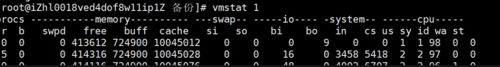

# 4 Linux 系统故障时

## 简介

### 1 CPU 性能分析

* top： **实时显示系统的 CPU、内存使用情况，以及各个进程的资源消耗**。
* htop： top 命令的增强版，界面更友好，支持鼠标操作，可以更加方便地查看和管理进程。
* mpstat： 显示各个 CPU 核心的使用情况，分析多核系统中的 CPU 负载。
* sar： 系统活动报告工具，可以监控 CPU、内存、I/O 等系统资源的使用情况。它可以在长时间内进行系统性能的数据采集。
* **vmstat： 查看 CPU、内存、交换分区的性能，能够检测 CPU 的等待时间和系统瓶颈**

### 2 内存性能分析

* **free： 显示系统当前的内存和交换分区使用情况。** 
* *vmstat： 显示内存、进程、I/O 系统的性能状态。可以帮助分析内存的使用情况。
* smem： 详细列出每个进程的内存消耗情况。
* **top / htop： 可以查看每个进程的内存使用情况**
* slabtop： 显示内核 slab 缓存的使用情况，有助于了解内存中缓存数据块的分布。

### 3 磁盘IO性能分析

* iostat： 显示磁盘 I/O 的性能统计信息，尤其是在分析磁盘读写性能时非常有用。
* iotop： 类似于 top，但专注于磁盘 I/O，能够按进程显示实时 I/O 活动。
* **df： 显示文件系统的磁盘使用情况**
* **du： 显示文件或目录的磁盘空间使用情况**。
* **lsblk： 列出所有存储设备和分区信息**。
* **blktrace： 对块设备进行详细的 I/O 跟踪分析**。

### 4 网络性能分析

- ifconfig / ip： 显示和配置网络接口的信息。
- **netstat： 查看网络连接、路由表、接口状态、协议统计等**。
- ss： 替代 netstat 的工具，功能更强大，速度更快，分析网络连接和套接字。
- **iftop： 实时监控网络带宽使用情况，显示每个网络连接的实时流量**。
- nload： 实时查看网络流量的工具，能够显示出入口和出口的带宽使用情况。
- ping： 测试与远程主机的网络连通性，测量网络延迟。
- **traceroute： 查看数据包从本地主机到目标主机经过的路由信息**。
- tcpdump： 强大的网络抓包工具，能够捕获和分析网络数据包。
- **nmap： 网络扫描工具，检查开放端口、主机发现和网络服务**

### 5 进程管理

- **ps： 列出当前正在运行的进程。**
- **top / htop： 查看实时进程资源消耗情况。**
- **pstree： 以树形结构展示进程关系**。
- kill： 终止特定的进程。
- **strace： 跟踪系统调用和信号，分析进程执行的系统调用，非常适合调试和跟踪进程的运行状态。**

### 6 综合性能分析

* dstat： 结合 vmstat、iostat、netstat 等工具的功能，实时显示 CPU、内存、磁盘 I/O、网络等资源的使用情况。
* **perf： 内核提供的强大性能分析工具，支持采样、跟踪和性能分析，适合开发人员和高级用户进行深入的性能调优**。
* sar： 系统监控和报告工具，可以详细记录 CPU、内存、网络、I/O 等各方面的性能。
* sysstat： 包含 iostat、mpstat、sar 等多种工具的综合工具包。
* glances： 类似于 htop 和 dstat 的结合，实时监控 CPU、内存、磁盘、网络、进程等多项系统性能指标

## 最佳实践

### 1 CPU性能分析

#### **1. top**

* **用途： 实时监控 CPU、内存及进程资源消耗**。

```
top -c  # 显示完整进程命令行
```

**htop / mpstat**

- mpstat 用途： 监控多核 CPU 各核心利用率。
- htop 增强版 top，支持鼠标操作、多核负载可视化。
- perf: 深入分析 CPU 性能事件（如函数热点、缓存命中率）。

```
mpstat -P ALL 1  # 每秒刷新所有核心状态
```

```
perf top       # 实时查看 CPU 热点
perf record -g # 生成火焰图数据
```

### 2 内存性能分析

**1. free**

用途： 快速查看内存和 Swap 使用量。

```
free -h  # 以 GB/MB 显示
```

**2. vmstat**

- 用途： 综合监控内存、Swap、进程队列和 I/O。
- 示例：

```
vmstat 1  # 每秒刷新一次
```

### 3 磁盘IO性能分析

1 iostat（需安装 sysstat）

**用途： 监控磁盘吞吐量、延迟和利用率**。

```
iostat -xz 1  # 查看详细 I/O 统计
```


### 4 网络性能分析

#### 1 ss

用途： **替代 netstat，快速查看连接和端口状态**

```
ss -tunlp  # 显示所有 TCP/UDP 连接及进程
```

#### 2 tcpdump

**用途： 抓包分析网络流量（需 root 权限）。**

```
tcpdump -i eth0 port 80  # 抓取 HTTP 流量
```

#### 5 进程级分析

**1.pidstat（需安装 sysstat ）**

**用途： 监控进程的 CPU、内存、I/O。**

```
pidstat -d -p 1234 1  # 监控 PID 1234 的磁盘 I/O
```

**2.strace**

用途： 跟踪进程的系统调用和信号。

```
strace -p 1234 -T  # 跟踪 PID 1234 的调用耗时
```

### 5 高频场景速查

#### 系统卡顿：

```
top → vmstat 1 → iostat 1 → pidstat 1  # 逐层定位瓶颈
```

#### 网络延迟：

```
ping 8.8.8.8 → traceroute google.com → tcpdump -i eth0  # 逐步排查
```

#### 进程异常：

```
strace -p <PID> → perf record -g -p <PID>  # 分析系统调用和 CPU 热点
```

### 6 实用组合命令

**查找 CPU/内存占用 Top 进程：**

```
ps aux --sort=-%cpu | head -10  # Top 10 CPU 进程
ps aux --sort=-%mem | head -10  # Top 10 内存进程
```

**持续监控磁盘空间：**

```
watch -n 1 'df -h'  # 每秒刷新磁盘使用
```

### 7 使用场景总结

- 系统变慢： **先用 top 或 htop 查看整体负载，再用 vmstat/iostat 定位 CPU、磁盘或内存瓶颈**。
- **网络延迟： iftop 或 nethogs 查看流量，tcpdump 抓包分析**。
- **进程卡死： strace 跟踪系统调用，perf 分析 CPU 热点**


### 8 vmstat




**vmstat 命令显示了 系统资源的实时状态，帮助你监控 CPU、内存、IO、进程等资源的使用情况**

**1.procs（进程相关）**

- r：运行队列中等待 CPU 的进程数。如果这个数值大于 CPU 核心数量，说明系统 CPU 资源不足。
- b：不可中断睡眠的进程数（一般是等待1/O 的进程

**2.memory（内存相关）**

- swpd：使用的swap 空间（单位：KB）。如果非0，表示系统已经在使用swap 分区，可能会影响性能。
- free：空闲内存（单位：KB）。
- buff：用于缓冲区的内存（单位：KB），用于存储文件系统的元数据。
- cache：用于缓存的内存（单位：KB），加速数据读取。如果缓存命中率高，会减少1/O 压力。

**3 swap（交换分区相关）**

- si （swap in）：从swap 分区交换到内存的大小（单位：KB/秒）。
- so （swap out）：从内存交换到 swap 分区的大小（单位：KB/秒）。
- 如果si 和so值较大，说明系统内存不足，需要频繁使用swap，这会降低性能。


**4.i0 （I/O相关）**

- bi （block in）：从块设备（如磁盘）读取的数据量（单位：块/秒）。
- bo （block out）：写入块设备（如磁盘）的数据量（单位：块/秒）。
- 这两个值高时，说明磁盘 I/O 活动频繁，可能会成为系统瓶颈。


**5. 系统相关**

- in： 每秒中断次数，包括硬件和系统时钟中断。
- cs（context switches）： 每秒上下文切换次数。上下文切换多说明进程频繁切换，可能影响性能。

**6 CPU**

- us（user time）： CPU 花费在用户进程上的时间百分比。用户进程是指非内核的应用程序。
- sy（system time）： CPU 花费在系统内核进程上的时间百分比。
- id（idle time）： CPU 的空闲时间百分比。如果值很高，说明 CPU 比较空闲。
- wa（wait time）： CPU 等待 I/O 的时间百分比。如果值高，说明 I/O 成为系统瓶颈。
- st（steal time）： 虚拟机中，CPU 被其他虚拟机占用的时间百分比。如果值高，说明虚拟化资源不足

如何分析图中的数据

- r 为 0： 没有等待 CPU 的进程，CPU 资源充足。
- id 高达 98-97%： CPU 基本处于空闲状态，系统负载很低。
- wa 为 0%： 没有 CPU 等待 I/O，I/O 性能正常。
- si 和 so 为 0： 系统没有使用 swap，内存充足。
- bi 和 bo 较低： 磁盘 I/O 压力不大。

从截图来看，系统整体运行状态非常良好：


- CPU 基本处于空闲状态（id 很高）。
- 没有使用 swap（swpd、si、so 都是 0）。
- 没有等待 CPU 或 I/O 的进程（r、b 和 wa 都接近 0）。
