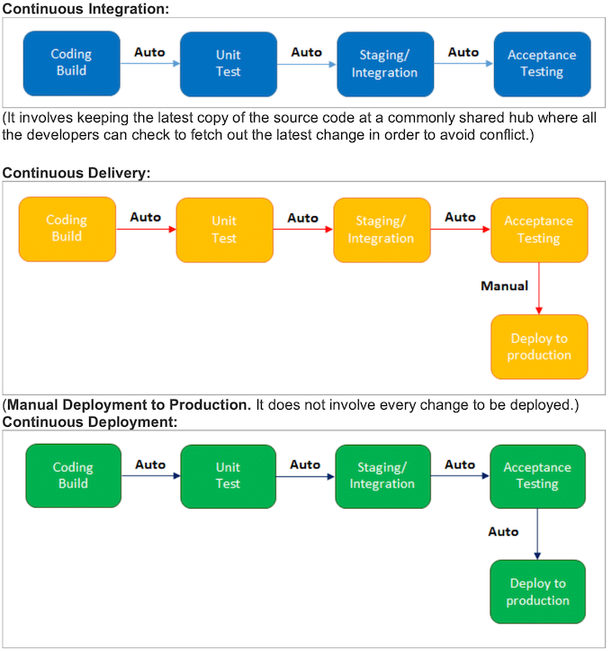

# Jenkins Interview Questions

### 1 What are the advantages of Jenkins? Why we use Jenkins?

Answer: Jenkins is used to continuously monitor the large code base in real-time. 

It enables developers to find bugs in their code and fix them. Email notifications are made to the developers regarding their check-ins as a post-build action

- Build failures are cached during the integration stage.
- Notifies the developers about build report status using LDAP (Lightweight Directory Access Protocol) mail server.
- Maven release project is automated with simple steps.
- Easy bug tracking.
- Automatic changes get updated in the build report with notification.
- Supports Continuous Integration in agile development and test-driven development.

### 2 Mention some of the important plugins in Jenkins?

Gits / Maven 2 Project / HTML Publisher / Copy Artcraft / Join / Green Balls / Amazon EC2

### 3 What is Continuous Integration in Jenkins?

Continuous Integration comprises of:


- Development and Compilation
- **Database Integration**
- Unit Testing
- Production Deployment
- **Code Labeling**
- **Functional Testing**
- Generating and Analyzing Reports

### 4  What is the difference between Continuous Integration, Continuous Delivery, and Continuous Deployment?

**Continuous Integration**:  involves keeping the latest copy of the source code at a commonly shared hub where all the developers can check to fetch out the latest change in order to avoid conflict

* ***Continuous Delivery:**

**Manual Deployment to Production. It does not involve every change to be deployed.**

* **Continuous Deployment**

**Automated Deployment to Production**. Involves every change to be deployed automatically

	

### 5  What is Jenkins Pipeline? What is a CI CD pipeline?

The pipeline can be defined as the suite of plugins supporting the implementation and integration of continuous delivery pipelines in Jenkins.

Continuous integration or continuous delivery pipeline consists of **build, deploy, test, release pipeline**. 


- The pipeline feature saves a lot of time and error in maintaining the builds.
- Basically, a pipeline is a group of build jobs that are chained and integrated in sequence.

### What are Scripted Pipelines in Jenkins?

Scripted Pipeline follows Groovy Syntax as given below:

```
Node {

}
```

In the above syntax, the node is a part of the Jenkins distributed mode architecture, where there are two types of node, **Master which handle all the tasks in the development environment and the Agent is being used to handle multiple tasks individually**.

### What are Declarative Pipelines in Jenkins?


Declarative Pipelines are the newest additions to Jenkins that simplify the groovy syntax of Jenkins pipelines (top-level pipeline) with some exceptions, such as: No semicolon to be used as a statement separator. The top-level pipeline should be enclosed within block viz

```
pipeline {

/* Declarative Pipeline */

}
```

**Blocks must contain Sections, Directives, steps or assignments.**

```
pipeline {
  agent any
  stages {
	stage(‘Build’) 
    {
steps 
	{
	// Statements…
  }
}

stage (‘Test’) 
	{
	steps {
	// Statements…
	 }
   }
 }
}
```

The above code has 3 major elements

- **Pipeline**: The block of script contents.
- **Agent**: Defines where the pipeline will start running from.
- **Stage**: The pipelines contain several steps enclosed in the block called Stage


### What is SCM? Which SCM tools are supported in Jenkins?

- SCM stands for Source Control Management.
- SCM module specifies the source code location.
- The entry point to SCM is being specified as `jenkins_jobs.scm`.
- The job specified with ‘scm’ attribute accepts multiple numbers of SCM definitions

```
scm:
	name: eloc – scm
scm:
	git:
	url: ssh://Jenkins.org/eloc.git
```

Jenkins supported SCM tools include:

CVS / Git / Perforce / AccuRev / Subversion / Clearcase

###  Which commands can be used to start Jenkins manually?

- `(Jenkins_url)/restart`: To force restart without waiting for build completion.
- `(Jenkin_url)/safeRestart`: Waits until all the build gets completed before restarting.

**What are Triggers?**

Answer: Trigger in Jenkins defines the way in which the pipeline should be executed frequently. PollSCM, Cron, etc are the currently available Triggers


###  What is the difference between Maven, Ant, and Jenkins?

Maven is a build tool like Ant. It consists of a pom.xml file which is specified in Jenkins to run the code. 


Whereas, Jenkins is used as a continuous integration tool and automates the deployment process. The reports of the builds can be used to set a mark for continuous delivery as well.


### How will you define Post in Jenkins?

Post is a section that contains several additional steps that might execute after the completion of the pipeline. The execution of all the steps within the condition block depends upon the completion status of the pipeline.

The condition block includes the following conditions – **changed success, always, failure, unstable and aborted.**


### How can you secure Jenkins?

Answer: Securing Jenkins is a little lengthy process, and there are two aspects of securing Jenkins:

i) Access Control which includes authenticating users and giving them an appropriate set of permissions, which can be done in 2 ways.

* ***Security Realm** determines a security Realm determines a user or a group of users with their passwords.
* **Authorization Strategy** defines what should be accessible to which user. In this case, there might be different types of security based on the permissions granted to the user such as Quick and simple security with easy setup, Standard security setup, Apache front-end security, etc

**(ii) Protecting Jenkins users from outside threats.**


### How to create a backup and copy files in Jenkins?

**In Jenkins, all the settings, build logs and configurations are stored in the `JENKINS_HOME` directory. **

**Whenever you want to create a backup of your Jenkins you can back up `JENKINS_HOME` directory frequently.**

It consists of all the job configurations and slave node configurations. Hence, regularly copying this directory allows us to keep a backup of Jenkins.


### What are the various ways in which the build can be scheduled in Jenkins?

1. After the completion of other builds.
2. By source code management (modifications) commit.
3. At a specific time.
4. By requesting manual builds.

### Give any simple example of Jenkins script.

```
agent
 stages {
  stage('Building your first asset') {
  agent
   steps {
    echo 'Build asset'
  }
}
stage('Test') {
  agent
   steps {
    echo 'Building project 1'
    }
  }
  }
}
```

### Why is Jenkins called a Continuous Delivery Tool?

