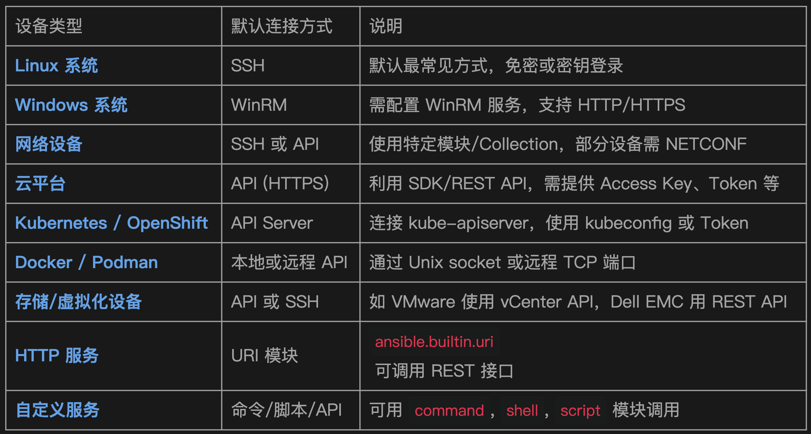
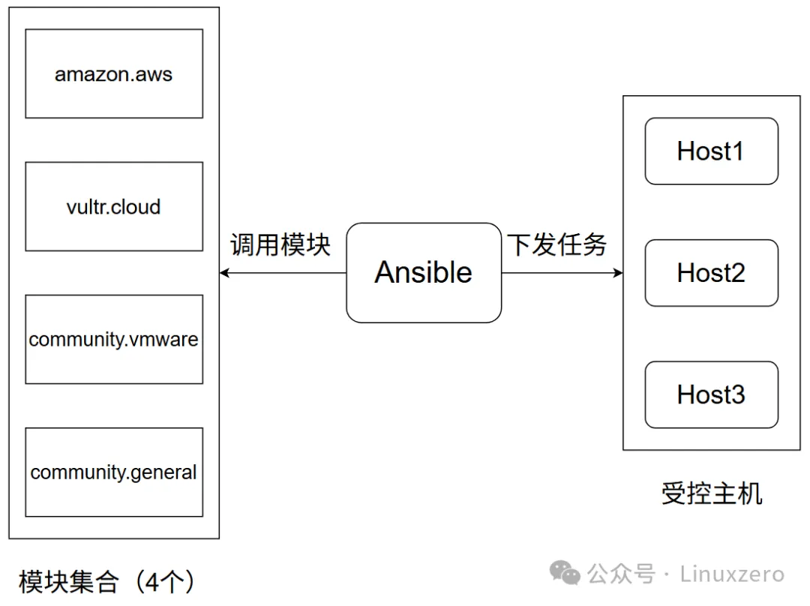
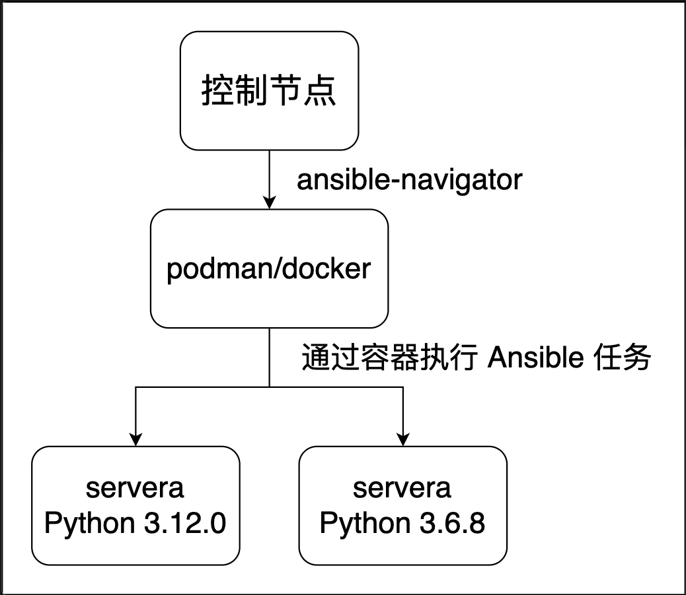

#  Ansible 从入门到放弃

## 1 Ansible 简介

### Ansible 简介

Ansible 是一个由 Red Hat 开发的 开源自动化运维工具，用来做：

- • 配置管理
- • 应用部署
- • 自动化任务执行
- • 多台服务器批量操作

它的最大特点是：**无代理（agentless）+ 基于 SSH 连接 + YAML 编写（可读性强）。**

### 为什么选择 Ansible？

```

特点     描述
✅ 无代理     被控端无需安装 agent，直接通过 SSH 操作
✅ 易于上手   使用 YAML 编写 playbook，可读性强
✅ 模块丰富   内置和社区模块支持各种平台与任务
✅ 跨平台     管理 Linux、Windows、网络设备等
✅ 可扩展     支持自定义模块和插件系统
✅ 社区活跃   拥有丰富的开源资源和文档
```

### Ansible 能做什么？

- • 批量部署软件（如安装 nginx、mysql）
- • 配置文件下发与模板替换
- • 重启服务、管理用户、开防火墙等
- • 自动化部署 Web 应用、容器、云服务（AWS、Azure）
- • 编排跨主机任务（如部署 Hadoop、K8s、Ceph）

### Ansible 的架构


**Ansible 管理节点负责下发任务，包含以下组件：**

- • Ansible：Ansible-core，Ansible 的主程序，包含 Ansible 相关二进程程序
- • Inventory：主机清单，用来定义被管理服务器的清单
- • Ad Hoc：Ansible 的命令行，用于执行简单的任务或做调试使用
- • **Playbooks：剧本，用来定义复杂的自动化任务**
- • **Core Modules：Ansible 核心模块，包含 Ansible 最常用的模块（Ansible 2.9 以前会包含大量模块，但在 2.10 后 Ansible 只会包含少量的核心模块）**
- • Ansible Collections：核心模块只能满足基础功能，通过 Ansible Collections 可以安装新的模块来扩展 Ansible 的功能
- • Connection Plugins： 连接插件 ，连接插件定义 Ansible 连接到远程主机的方式


### Ansible 管理主机的流程：

1. Ansible 通过 Inventory 来定义主机清单
2. 通过 Playbooks 或 Ad Hoc 来定义任务（任务通过模块执行）和要执行任务的主机
3. 通过连接插件，将模块推送到被控端
4. 在被控端执行模块的任务，执行完成后删除模块

> Ansible 的大部分模块都具有幂等性，多次执行只会修改需要改的内容。但部分模块除外，如 raw、command 和 shell 模块。

**Ansible 的管理节点只能是 Linux 系统**



Ansible 会使用被控节点有的连接方式来管理被控节点，如通过 SSH 管理 Linux，因此 Ansible 是无代理的，不需要在被控节点安装 Agent


- • `ANSIBLE_CONFIG` 的环境变量
- • 当前工作目录下的 `ansible.cfg`
- • 当前用户家目录下的 `.ansible.cfg` 隐藏文件
- • 全局默认的配置文件 ``/etc/ansible/ansible.cfg`


## Ansible 安装

Ansible 有三种安装方式，源码安装、发行版安装和 Python 安装。

使用发行版安装或 Python 安装两种方式时，Ansible 的安装包有两个，区别如下：

- • ansible-core：一种极简语言和运行时包，包含一组内置模块和插件。
- • ansible：一个更大的“包含电池”的软件包，它添加了社区精选的 Ansible 集合选择，用于自动化各种设备。

> 在用源码或者 Python 安装 Ansible 时，默认不会安装 sshpass 软件包，该软件包用来给 Ansible 提供密码验证被控端，因此如果在执行 Ansible 的命令时需要输入 ssh 的密码，则需要该软件包，该软件包通过 `dnf install -y sshpass`。

```
[root@ansible ansible]# ansible servera -m ping
servera | FAILED! => {
 "msg": "to use the 'ssh' connection type with passwords or pkcs11_provider, you must install the sshpass program"
}
```

```
[root@ansible ~]# dnf install python3.12 python3.12-pip sshpass
[root@ansible ~]# tar xf ansible-2.16.3.tar.gz
[root@ansible ~]# cd ansible-2.16.3/
[root@ansible ansible-2.16.3]# python3 -m pip install -r ./requirements.txt
[root@ansible ansible-2.16.3]# python3 setup.py install
```

**源码安装只能安装 Ansible-core。**


```
[root@ansible ~]# dnf install -y epel-release

# 安装最简洁的 Ansible
[root@ansible ~]# dnf install ansible-core


# 安装包含常用模块的 Ansible
[root@ansible ~]# dnf install ansible
```


Python 安装

```
# 安装 Python3 和 pip
[root@ansible ~]# dnf install python3.12 python3.12-pip sshpass

# 安装 Ansible-core
[root@ansible ~]# python3.12 -m pip install ansible-core==2.16.3

# 安装 Ansible
[root@ansible ~]# python3.12 -m pip install ansible
```

### 设置 Ansible 参数自动补全

```
[root@ansible ~]# python3 -m pip install argcomplete
[root@ansible ~]# activate-global-python-argcomplete --user
```

**重新登录命令行加载一下环境变量就可以看到自动补全了。**

###  快速配置并使用 Ansible

有一个被控节点，地址为 192.168.221.131，主机名为 servera。


```
[root@ansible ~]# mkdir ansible
[root@ansible ~]# cd ansible
[root@ansible ansible]# sed -i 's/;inventory=.*/inventory\ =\ .\/inventory/' ansible.cfg
[root@ansible ansible]# cat <<-EOF > ansible.cfg
[defaults]
inventory      = ./inventory
ask_pass       = false
remote_user    =  root
log_path       = /var/log/ansible.log
host_key_checking = False
[privilege_escalation]
become = True
become_method = sudo
become_user = root
become_ask_pass = False
[ssh_connection]
ssh_args = -C -o ControlMaster=auto -o ControlPersist=60s -o StrictHostKeyChecking=no
EOF

[root@ansible ansible]# echo servera > inventory

[root@ansible ansible]# tail -n1 /etc/hosts
192.168.221.131 servera

# 通过 ping 模块测试网络连通性
[root@ansible ansible]# ansible all -k -m ping
SSH password:
servera | SUCCESS => {
    "ansible_facts": {
        "discovered_interpreter_python": "/usr/libexec/platform-python"
    },
    "changed": false,
    "ping": "pong"
}
 
```

## 3 Ansible 配置文件

### Ansible配置文件

```
[root@ansible ansible]# ansible --version
ansible [core 2.16.3]
  config file = /root/ansible/ansible.cfg
  configured module search path = ['/root/.ansible/plugins/modules', '/usr/share/ansible/plugins/modules']
  ansible python module location = /usr/local/lib/python3.12/site-packages/ansible_core-2.16.3-py3.12.egg/ansible
  ansible collection location = /root/.ansible/collections:/usr/share/ansible/collections
  executable location = /usr/local/bin/ansible
  python version = 3.12.8 (main, Dec 12 2024, 16:30:29) [GCC 8.5.0 20210514 (Red Hat 8.5.0-22)] (/usr/bin/python3)
  jinja version = 3.1.6
  libyaml = True
```


### **文件位置和优先级**

Ansible 的配置文件在四个位置可以出现：

- • `ANSIBLE_CONFIG` 的环境变量
- • 当前工作目录下的 `ansible.cfg`
- • 当前用户家目录下的 `.ansible.cfg` 隐藏文件
- • 全局默认的配置文件 `/etc/ansible/ansible.cfg`

优先级由高到低：**环境变量 → 当前工作目录 → 家目录 → /etc**

所以执行 Ansible 指令时，先从环境变量中找配置文件，如果环境变量没有，就到当前工作目录下找配置文件，如果当前工作目录依然没有，就到当前用户的家目录下找配置文件，如果当前用户家目录下还没有，就去找 `/etc/ansible/ansible.cfg`。


推荐的 ansible.cfg 管理方式：

优先级从高到低如下：

1. 当前目录的 `./ansible.cfg`
2. 环境变量 `ANSIBLE_CONFIG` 指定的路径
3. 用户目录下的 ``~/.ansible.cfg`
4. 系统路径 `/etc/ansible/ansible.cfg`


**生成一个默认的配置文件**


```
[root@ansible ansible]# ansible-config init --disabled > ansible.cfg

```

文件内容


```
[root@ansible ansible]# grep -E '^\[' ansible.cfg
[defaults]
[privilege_escalation]
[persistent_connection]
[connection]
[colors]
[selinux]
[diff]
[galaxy]
[inventory]
[netconf_connection]
[paramiko_connection]
[jinja2]
[tags]
```

### Ansible 配置段说明

```
[defaults]	
默认设置
主要配置 Ansible 的基础行为，比如 inventory, remote_user, timeout, roles_path 等


[privilege_escalation]	
提权控制
控制 become, become_user, become_method 等提权行为（如 sudo）

[persistent_connection]	
持久连接参数
控制连接插件如 SSH 的持久化（可减少连接开销）

[persistent_connection]	
持久连接参数
控制连接插件如 SSH 的持久化（可减少连接开销）

[connection]	
通用连接配置
包括远程连接的超时、重试、缓存控制等

[selinux]	
SELinux 设置
是否自动管理 semanage、标签恢复等（对启用 SELinux 的主机有用）

[diff]	
显示差异设置
控制是否开启 diff 模式，能在修改配置时显示差异

[galaxy]	
Ansible Galaxy 设置
设置 Galaxy 源、缓存策略、角色下载等

[diff]	
显示差异设置
控制是否开启 diff 模式，能在修改配置时显示差异

[galaxy]	
Ansible Galaxy 设置
设置 Galaxy 源、缓存策略、角色下载等

[inventory]	
动态库存参数
针对 Inventory 插件的默认设置，比如缓存、路径等

[netconf_connection]	
Netconf 连接参数
针对支持 NETCONF 的网络设备（如 Cisco、Juniper）连接设置


[paramiko_connection]	
使用 paramiko 时的设置
使用 paramiko（Python SSH 库）替代 OpenSSH 时的行为控制

[jinja2]	
模板渲染设置
控制模板变量、未定义变量行为、Jinja 环境等


[tags]	
tag 行为
控制运行 playbook 时关于 tag 的匹配方式
```

### 常用配置选项

**[defaults] 常用配置：**

```
inventory	
指定主机清单路径
inventory = ./hosts


remote_user	
默认远程登录用户
remote_user = ansible


ask_pass	
是否在执行时询问 SSH 密码
ask_pass = false

ask_become_pass	
是否询问 sudo 密码
ask_become_pass = true

private_key_file	
指定私钥路径
private_key_file = ~/.ssh/id_rsa

host_key_checking	
是否启用 SSH 主机密钥检查
host_key_checking = false

timeout	
连接超时时间（秒）
timeout = 30

forks	
并发执行主机数
forks = 10

retry_files_enabled	
是否生成 .retry 文件
retry_files_enabled = false


log_path	
日志文件路径
log_path = /var/log/ansible.log


roles_path	
指定角色目录
roles_path = ./roles


gathering	
控制 facts 的收集方式（implicit、explicit、smart）
gathering = smart


fact_caching	
是否启用 facts 缓存
fact_caching = jsonfile


fact_caching_connection	
facts 缓存路径
fact_caching_connection = ./fact_cache
```

### `[privilege_escalation] `提权配置：

```
become	
是否启用提权
become = true


become_method	
使用提权方式（sudo/su/pbrun/doas 等）
become_method = sudo

become_user	
提权后的目标用户
become_user = root

become_ask_pass	
是否询问提权密码
become_ask_pass = false
```

### [`ssh_connection`]（或 [connection]）连接优化配置：

```
pipelining	
启用 SSH pipelining，加速执行
pipelining = true

control_path	
SSH 控制连接的 socket 路径
control_path = %(directory)s/%%h-%%r

ssh_args	
传递给 SSH 的参数
ssh_args = -o ControlMaster=auto -o ControlPersist=60s

retries	
SSH 失败重试次数
retries = 3
```

### [jinja2] 模板渲染相关：

```
undefined	
控制未定义变量的处理方式（如 strict）
undefined = strict

trim_blocks	
去除 Jinja2 模板中的空行
trim_blocks = true

lstrip_blocks	
去除 Jinja2 左侧空格
lstrip_blocks = true
```

### [diff] 差异显示：

```
always	
是否始终显示变更 diff
always = true

context	
显示上下文行数
context = 5
```

### [galaxy] Ansible Galaxy 设置：

```
server_list	
指定 Galaxy 服务器
server_list = ansible_galaxy

ignore_certs	
忽略 Galaxy HTTPS 证书验证
ignore_certs = false
```

### [inventory] 主机清单设置（动态库存）：

```
enable_plugins	
启用的库存插件
enable_plugins = host_list, yaml, ini

ache	
启用主机缓存
cache = true

cache_plugin	
使用的缓存插件
cache_plugin = jsonfile

cache_timeout	
缓存有效时间
cache_timeout = 600
```

### 其他配置段（可选）：

```
[paramiko_connection]	
如果使用 paramiko 作为 SSH 连接后端，配置连接行为

[netconf_connection]	
管理 NETCONF 网络设备的连接参数

[colors]	
控制终端输出颜色样式

[selinux]	
配置如何处理 SELinux 标签修复

[tags]	
控制 tag 匹配行为，比如 skip_tags 默认值等
```

### 配置案例

```
[defaults]  
inventory      = ./inventory    # 主机清单的位置
fork           = 20                # 并发执行的主机数
ask_pass       = False            # 执行 Ansible 时是否询问密码
remote_user    =  root            # 表示使用 root 用户来访问被控节点
log_path       = /var/log/ansible.log    # 指定 Ansible 的日志文件位置
host_key_checking = False                # 是否进行 SSH 主机 Key 检查
ansible_python_interpreter = /usr/bin/python3.9        # 指定被控端上 Python 的解释器
[privilege_escalation]
become = True    # 是否提权
become_method = sudo    # 提权的方式
become_user = root        # 提权到哪个用户
become_ask_pass = False    # 执行 Ansible 时是否询问提权密码
```

## 4 Ansible 主机清单

### Ansible 主机清单

主机清单用来定义哪些主机在 Ansible 的管理范围。主机清单支持以下写法：

- • IP 地址
- • 主机名
- • 范围（`server[b:c]`）
- • 主机组（webserver）
- • 组的子组（lnmp:children）


### 主机清单

```
172.25.250.10

[webserver]
server[b:c]

[mysql]
172.25.250.1[3:4]

[lnmp:children]
webserver
mysql
```

• 直接定义主机名或地址，当前 172.25.250.10 不属于任何组。

```
172.25.250.10
```

• 定义主机组，webserver 主机组包含 serverb 到 serverc

```
[webserver]
server[b:c]
```

• 组和组之间可以嵌套

```
[lnmp:children]
webserver
mysql
```

• 使用范围来匹配主机

```
server[b:c]
172.25.250.1[3:4]
```

### 选择主机和主机组

**匹配所有主机**

```
**ansible all --list-hosts
  hosts (5):
    172.25.250.10
    serverb
    serverc
    172.25.250.13
    172.25.250.14**
```

匹配指定的主机或主机组

```
ansible serverc --list-hosts
  hosts (1):
    serverc

ansible lnmp --list-hosts
  hosts (4):
    serverb
    serverc
    172.25.250.13
    172.25.250.14

```

**匹配多个主机和主机组**

```
ansible serverb,serverc --list-hosts
  hosts (2):
    serverb
    serverc

ansible webserver,mysql --list-hosts
  hosts (4):
    serverb
    serverc
    172.25.250.13
    172.25.250.14
```

**匹配没有组的主机**

```
ansible server* --list-hosts
  hosts (2):
    serverb
    serverc

ansible *25.* --list-hosts
  hosts (3):
    172.25.250.10
    172.25.250.13
    172.25.250.14
```

**通配符逻辑组合**

- • `&``：取交集
- • `!``：去反
- • `，``：取并集

```
# 匹配所有以server开头的主机，排除serverc
ansible 'server*,!serverc' --list-hosts
  hosts (1):
    serverb

# 匹配组webserver和组lnmp两个组内相同的主机
ansible 'webserver,&lnmp' --list-hosts
  hosts (2):
    serverb
    serverc

# 在上一个例子在排除serverc
ansible 'webserver,&lnmp,!serverc' --list-hosts
  hosts (1):
    serverb
```

使用正则匹配

```
# '~'后接正则表达式，下边例子表示匹配以se开头的主机
ansible '~^se' --list-hosts
  hosts (2):
    serverb
    serverc
```

通过limit匹配主机

```
ansible all --limit serverb,172.25.250.13 --list-hosts
  hosts (2):
    serverb
    172.25.250.13

# 使用文件匹配
cat <<EOF > ip.txt
serverb
serverc
172.25.250.14
EOF

ansible all --limit @/home/student/ansible/ip.txt --list-hosts
  hosts (3):
    serverb
    serverc
    172.25.250.14
```

### 特殊的主机 localhost

最后说一个特殊的主机 localhost，这是一个特殊的主机，它不需要在主机清单里声明就可以使用。

localhost 表示本地主机，未在主机清单中声明时，Ansible 会使用 local 方式连接，相当于在本地执行命令，以下是它和 SSH 连接的区别：

```
项目  local. ssh
执行位置. 控制节点本地执行. 远程通过 ssh 执行
是否走网络. 否. 是
权限控制. 当前用户. 可指定远程用户
常见用途. 控制节点配置、本地调试. 正式环境、管理多台主机
```

可以通过在主机清单内明确指定 localhost 来设置连接方式为 ssh。

**local 和 ssh 连接有个最大的区别就是 local 会忽略 `remote_user `选项，可以看以下例子：**

```
# 配置文件
[test@awx-1 ansible]$ cat ansible.cfg
[defaults]
inventory      = ./inventory
fork          = 20
ask_pass       = False
remote_user    =  remote-manager
host_key_checking = False
ansible_python_interpreter = /usr/bin/python3.9
[privilege_escalation]
become = True
become_method = sudo
become_user = root
become_ask_pass = False


# 当前用户
[test@awx-1 ansible]$ id
uid=1000(test) gid=1000(test) groups=1000(test) context=unconfined_u:unconfined_r:unconfined_t:s0-s0:c0.c1023

# 查看主机清单，当前 localhost 已被注释
[test@awx-1 ansible]$ cat inventory
#localhost ansible_ssh_password=redhat

# 测试
[test@awx-1 ansible]$ ansible localhost -b -m command -a 'id'
localhost | CHANGED | rc=0 >>
uid=0(root) gid=0(root) groups=0(root) context=unconfined_u:unconfined_r:unconfined_t:s0-s0:c0.c1023
# 可以看到可以执行成功

# 删除主机清单的注释
[test@awx-1 ansible]$ cat inventory
localhost ansible_ssh_password=redhat

# 再次测试
[test@awx-1 ansible]$ ansible localhost -b -m command -a 'id'
localhost | UNREACHABLE! => {
    "changed": false,
    "msg": "Failed to connect to the host via ssh: remote-manager@localhost: Permission denied (publickey,gssapi-keyex,gssapi-with-mic,password,keyboard-interactive).",
    "unreachable": true
}
# 可以看到报错了，因为 test 不能直接 ssh remote-manager 用户
```

可以看到 local 方式会忽略 remote_user 选项，而 ssh 不会忽略。


## 5 Ansible 常用命令

Ansible 有多个命令，不同命令有不同的功能，以下列出一些常用的命令和常用参数。

### 常用命令

```
# 设置 ansible 的配置文件
ansible-config

# 查看 ansible 相关模块和模块文档
ansible-doc

# 查看 ansible 的主机清单
ansible-inventory

# 执行临时任务
ansible

# 执行 ansible 的 playbook
ansible-playbook

# 设置 ansible 的角色
ansible-galaxy

# ansible 相关文件加密或解密
ansible-vault
```

### Ansible-config 常用参数

```
# 生成一个注释所有配置的 ansible 配置文件
ansible-config init --disabled -t all > ./ansible.cfg
```

### Ansible-doc 常用参数

```
# 列出所有支持的模块
ansible-doc -l

# 查看模块参数
ansible-doc -s <模块名>

# 查看模块案例
ansible-doc <模块名>
# 这个可以通过搜索 EXAMPLE 来快速查看使用方法

# 按类型列出模块
ansible-doc -t cache -l        # 列出所有缓存模块
```

### Ansible-inventory 常用参数

```
# 列出所有主机
ansible-inventory -i inventory --list
-i        # 指定主机清单文件
--list    # 列出所有主机

# 查看某一个主机
ansible-inventory -i inventory --host server1

# 以树状图显示并显示变量
ansible-inventory -i inventory --graph --vars

# 以 toml 格式输出主机清单
ansible-inventory -i inventory --list --toml

# 以 yaml 格式输出主机清单
ansible-inventory -i inventory --list --yaml

# 将内容输出到文件里
ansible-inventory -i inventory --list --output file
```

### Ansible 常用参数

```
ansible all -u root -k -m command -a 'pwd chdir=/opt removes=/root/anaconda-ks.cfg'
all        # 表示需要执行任务的主机或主机组
-m        # 后接要使用的模块
command    # 使用的模块
-u root    # 指定连接用户
-k        # 手动输入密码
-a        # 后接模块的参数
```

> 有的地方可能会提到 Ansible Ad-Hoc，Ansible Ad-Hoc 就是 ansible 命令，通过命令的方式执行简单任务（一次使用一个模块执行一个任务）。

### Ansible-playbook 常用参数

```
ansible-playbook --become --become-method sudo \
    --become-user root -i inventory \
    --ask-pass --ask-become-pass playbook.yaml
--become            # 启动提权
--become-method        # 设置提权方法
--become-user        # 设置提权到什么用户
--ask-pass            # 输入远程用户密码
--ask-become-pass    # 设置提权密码

# 检查 playbook 是否有语法错误
ansible-playbook --syntax-check playbook.yaml

# 执行 playbook 但不做更改
ansible-playbook --check playbook.yaml
```

### Ansible-galaxy 常用选项

```
# 列出所有 role
ansible-galaxy role list

# 初始化一个名为 role 的 role1
ansible-galaxy role init role1

# 下载集合
ansible-galaxy collection download
```

### Ansible-vault 常用选项

```
# 创建加密文件
ansible-vault create test1

# 对已有文件进行加密
ansible-vault encrypt test

# 对字符串 username=root 进行加密
ansible-vault encrypt_string "username=root"

# 编辑加密文件
ansible-vault edit test

# 查看加密文件
ansible-vault view test

# 修改文件密码
ansible-vault rekey test

# 解密文件
ansible-vault decrypt test2
```

## 6 Ansible 模块和集合

### Ansible 模块和集合

Ansible 通过模块执行任务，例如 `ansible.builtin.hostname` 用于设置主机名。

> `ansible.builtin`  是模块的命名空间，不同的模块属于不同的命名空间，一般情况下模块名称不会冲突，但是随着模块数量的增加，不排除模块名冲突的可能，所以将不同的模块放在不同的命名空间里用于区分，如果控制节点安装的模块没有模块名冲突的情况，调用模块时可以不写命名空间，如：hostname。

> Ansible 是 Python 写的，所以 Ansible 的大部分模块都需要被控主机有 Python才能使用，少部分模块除外，如：ansible.builtin.raw。

### 文件与目录操作模块

```
模块名	功能描述	
ansible.builtin.copy		复制文件到远程主机
ansible.builtin.template	渲染 Jinja2 模板并传输
ansible.builtin.fetch	从远程主机获取文件
ansible.builtin.file	设置文件权限、属主等
ansible.builtin.stat	获取文件状态
ansible.builtin.unarchive	解压归档文件
ansible.builtin.lineinfile	修改文件中的一行内容
ansible.builtin.blockinfile	向文件中插入多个行
```

### 系统管理模块


```
模块名. 功能描述

ansible.builtin.hostname	设置主机名
ansible.builtin.user	创建/修改/删除用户
ansible.builtin.group	创建/修改/删除用户组
ansible.builtin.service	管理系统服务
ansible.builtin.systemd	 管理 systemd 服务
ansible.builtin.package	 安装/卸载通用软件包（自动选择后端）
ansible.builtin.yum	   使用 yum 安装包
ansible.builtin.apt	  使用 apt 安装包
ansible.builtin.dnf	  使用 dnf 安装包
```

### 命令执行模块

```

模块名   功能描述
ansible.builtin.command	  运行普通命令（不支持管道、重定向）
ansible.builtin.shell	  运行 shell 命令（支持管道、重定向等）
ansible.builtin.raw	      原始命令执行，不走模块系统
ansible.builtin.script	  将本地脚本上传并执行
```

### 归档与压缩

```
模块名.  功能描述
ansible.builtin.archive	   创建归档文件（如 tar.gz）
ansible.builtin.unarchive	   解压归档文件
```

### 权限与认证

```
模块名		功能描述
ansible.builtin.seboolean	管理 SELinux 布尔值
ansible.builtin.selinux	    设置 SELinux 模式
ansible.builtin.authorized_key		添加 SSH 公钥到用户 ~/.ssh/authorized_keys
```

### 网络与远程连接

```
模块名.    功能描述
ansible.builtin.uri	 发 HTTP 请求
ansible.builtin.get_url	  下载文件
ansible.builtin.wait_for	 等待端口/文件状态变更
```

### 控制逻辑模块

```
模块名			功能描述
ansible.builtin.debug		输出调试信息
ansible.builtin.pause		暂停执行
ansible.builtin.assert		条件断言
ansible.builtin.set_fact	设置自定义变量
```

> 这些模块都可以通过 `ansible-doc <模块名> ` 来查看帮助文档，可以通过搜索 EXAMPLE 来快速了解模块的使用，也可以通过 `ansible-doc -s <模块名>` 查看模块选项。

举个例子，`ansible.builtin.systemd` 模块用于服务管理，通过 ansible-doc 查看模块文档并搜索 EXAMPLE。

```
[root@awx-1 ansible]# ansible-doc ansible.builtin.systemd
# 用 /EXAMPLE 搜索
EXAMPLES:

- name: Make sure a service unit is running
  ansible.builtin.systemd:
    state: started
    name: httpd

- name: Stop service cron on debian, if running
  ansible.builtin.systemd:
    name: cron
    state: stopped

- name: Restart service cron on centos, in all cases, also issue daemon-reload to pick up config changes
  ansible.builtin.systemd:
    state: restarted
    daemon_reload: true
    name: crond

- name: Reload service httpd, in all cases
  ansible.builtin.systemd:
    name: httpd.service
    state: reloaded

- name: Enable service httpd and ensure it is not masked
  ansible.builtin.systemd:
    name: httpd
    enabled: true
    masked: no

- name: Enable a timer unit for dnf-automatic
  ansible.builtin.systemd:
    name: dnf-automatic.timer
    state: started
    enabled: true

- name: Just force systemd to reread configs (2.4 and above)
  ansible.builtin.systemd:
    daemon_reload: true

- name: Just force systemd to re-execute itself (2.8 and above)
  ansible.builtin.systemd:
    daemon_reexec: true

- name: Run a user service when XDG_RUNTIME_DIR is not set on remote login
  ansible.builtin.systemd:
    name: myservice
    state: started
    scope: user
  environment:
    XDG_RUNTIME_DIR: "/run/user/{{ myuid }}"
```

很多选项都能做到见文知意，比方说 enabled 用于设置是否开机自启，state 用于设置服务状态。

### Ansible 集合

Ansible-core 自带一组模块，以 `ansible.builtin` 开头，这些模块是远远不够的，需要其他模块来扩展 Ansible 的功能，为了方便这些模块的管理，所以将这些扩展模块分类，一类模块就组成一个集合。




```
ansible-galaxy collection download community.general
```

```
---
- name: init    # 定义 Playbook 的名字
  hosts: all    # 定义被控主机范围
  tasks:        # 定义要执行的任务，下边一个 - 对应一个任务（一个 - 表示一个列表）
  - name: set hostname        # 第一个任务的名称
    ansible.builtin.hostname:    # 第一个任务使用的模块
      name: "{{ inventory_hostname }}.{{ host_search_name }}"    # 模块选项
  - name: dnf install package    # 第二个任务名称
    ansible.builtin.dnf:        # 第二个任务使用的模块
      name:                        # 模块选项
      - bash-completion
      - vim
      - gcc
      - make
      - git
      - wget
      - tar
      - bzip2
      - unzip
      - python3
      - sysstat
      state: present
  - name: set hosts
    ansible.builtin.template:
      src: ./templates/hosts.j2
      dest: /etc/hosts
      owner: root
      group: root
      mode: '0644'
```

- `---`：—yaml 文件的文档分隔符，多个 yaml 文档可以放在一个文件里，用---来做分隔

- `- name`：用于定义 Playbook 和 Play 的名称，类似于注释

- `hosts`：定义 Playbook 作用的主机范围

- `tasks`：定义 Playbook 的多个自动化任务，下边包含多个任务

YAML对缩进有严格要求，比方说`- name`和`hosts`是一个等级（在一个列表），所以缩进是对齐的，tasks下的`- name`和`ansible.builtin.hostname`是它的子项（是tasks下的列表），所以会多缩进两个空格（缩进以第一个字母算，不考虑-）。

```
  - name: set hosts
    ansible.builtin.template:
      src: ./templates/hosts.j2
      dest: /etc/hosts
      owner: root
      group: root
      mode: '0644'
```


这个表示一个 play，play 的名字为set hosts，使用的模块为`ansible.builtin.template`，模块使用的参数有`src、dest、owner、group、mode`。

### Ansible Playbook 命令常用选项

1. 可以通过ansible-playbook命令来执行 Playbook，通过-v可以查看更详细的信息。
  - •-v: 提供任务和主机状态的详细信息，但不包括变量值和详细调试信息。
  - •-vv: 提供更详细的任务执行信息，包括变量值。
  - •-vvv: 显示包括变量展开和任务详细信息在内的更多调试信息。
  - •-vvvv: 显示所有调试信息，包括 HTTP 请求和响应的详细内容。
    
2. 可以通过`--syntax-check`选项来对 Playbook 的格式进行检查
3. 可以通过`--check`来执行 Playbook，但并不做实际的改变


Ansible Playbook 队列错误处理机制

Ansible Playbook 的机制是如果某个主机的某个 Play 执行错误，那么这个主机就会被移除执行队列，该主机相关的后续所有 Play 都不会执行


有时候我们可能希望任务报错后节点继续执行后边的任务，这个时候可以使用`ignore_errors: yes`来实现。

```
  - name: dnf install package
    ansible.builtin.dnf:
      name:    sysstat
      state: present
    ignore_errors: yes
```

### Ansible Handlers


Ansible Handlers 表示一组特殊的任务，它只会在特定的情况下才会被执行，例如配置 sssd 服务，可以通过 Ansible Handlers 来实现只有 sssd 服务的配置文件发生改变后才执行 sssd 服务的重启。

**Ansible Handlers 有两个常用选项，notify、handlers和listen。**

**notify：在某个 play 下追加notify后，表示这个 play 执行成功后并且做出修改后触发handlers的某个特殊任务**

#### Ansible Handlers 例子

```
---
- name: set sssd
  hosts: all
  gather_facts: false
  vars:
    sssd_packages:
    - sssd
    - sssd-tools
    - oddjob
    - oddjob-mkhomedir
    - libsss_sudo
  tasks:
  - name: install packages
    ansible.builtin.yum:
      name: "{{ sssd_packages }}"
      state: present
  - name: set sssd.conf
    ansible.builtin.template:
      src: templates/sssd.conf.j2
      dest: /etc/sssd/sssd.conf
      mode: '0600'
      owner: root
      group: root
    notify: set_pam_and_service
  - name: set oddjob service
    ansible.builtin.systemd:
      name: oddjobd
      state: started
      enabled: true
  handlers:
  - name: set authselect
    ansible.builtin.command: "authselect select sssd with-sudo with-mkhomedir --force"
    listen: set_pam_and_service
  - name: set sssd service
    ansible.builtin.systemd:
      name: sssd
      state: restarted
    listen: set_pam_and_service
```

**在这个 Playbook 中，在名为set sssd.conf的 Play 下定义了一个notify，notify的名字为 `set_pam_and_service`，然后在handlers中定义了两个 Play，分别是`set authselect`和`set sssd service`，**

这两个 Play 都一个listen选项，listen的内容均为 `set_pam_and_service`，这个实现的结果就是当`set sssd.conf`执行成功且做出改变之后就会触发`set authselect`和`set sssd service`这两个任务，当`set sssd.con`f没有做出改变时，`set authselect`和`set sssd service`这两个任务会直接被跳过。

**上述例子里是一个 Play 触发两个handlers的 Play，如果handlers里被触发的 Play 只有一个，那么可以不用listen，可以直接将handlers里 Play 的name设置为和notify内容相同。（如果handlers里多个 Play 的名字为`set_pam_and_service`，那么只有第一个 Play 会被执行）**

```
---
- name: set sssd
  hosts: all
  gather_facts: false
  tasks:
  - name: set sssd.conf
    ansible.builtin.template:
      src: templates/sssd.conf.j2
      dest: /etc/sssd/sssd.conf
      mode: '0600'
      owner: root
      group: root
    notify: set_pam_and_service
  handlers:
  - name: set_pam_and_service
    ansible.builtin.systemd:
      name: sssd
      state: restarted
```

### 强制执行 handlers

**Ansible 的机制是如果某个主机的某个 Play 执行错误，那么这个主机就会被移除执行队列，该主机相关的后续所有 Play 都不会执行，所以为了保证handlers能够正常执行，可以添加§`force_handlers: true`选项，这样无论是否有错误任务产生handlers都会正常执行**

```
---
- name: set sssd
  hosts: all
  gather_facts: false
  force_handlers: true
  tasks:
  ...
```

## 8 Ansible 变量的定义和引用

### Ansible 变量


- • Ansible 的变量区分大小写
- • Ansible 的变量不要重名，特别是不要和内置变量冲突
- • Ansible 的变量名称可以使用数字、字母和下划线组成，但是只能以字母开头

### 连接变量

连接变量是 Ansible 的内置变量，这个变量控制 Ansible 对被控主机的连接方式。

可以在主机清单、Playbook 和ansible -e处设置变量。

- • `ansible_host`~：指定清单中主机的真实 IP 地址
- • `ansible_port`：指定清单中主机的端口
- • `ansible_user`：指定清单中主机的连接用户
- • `ansible_become`：是否进行特权升级
- • `ansible_become_user`：通过特权升级到哪个用户
- • `ansible_become_password`：提升特权时，如果需要密码的话，可以通过该变量指定
- • `ansible_sudo_exec`：如果 sudo 命令不在默认路径，需要指定 sudo 命令路径
- • `ansible_connection`：ssh 连接的类型：local, ssh, paramiko，默认是 ssh
- • `ansible_ssh_password`：ssh 连接时的密码
- • `ansible_ssh_private_key_file`：秘钥文件路径，如果不想使用 ssh-agent 管理秘钥文件时可以使用此选项
- • `ansible_ssh_executable`：如果 ssh 指令不在默认路径当中，可以使用该变量来定义其路径
- • `ansible_ssh_extra_args`：额外的 ssh 参数。
- • `ansible_python_interpreter`：指定受控主机的 python 的位置


以下是在主机清单中设置变量示例：

```
[all:vars]
ansible_ssh_user = root
ansible_ssh_password = redhat
ansible_become = true
ansible_become_user = redhat
```

### 定义变量

**主机清单定义**

```
server1 MYSQL_VERSION=5.7 MYSQL_MASTER=true
[web]
server2
server3

[web:vars]
HTTPD_VERSION=2.4

[all:vars]
SYSTEM_TYPE=RHEL
```

- • 主机变量写在主机后边用空格分隔，如`MYSQL_VERSION`和`MYSQL_MASTER`
- • 组变量通过组名接`:vars`定义，如`[web:vars]`
- • 所有主机的变量可以通过`[all:vars]`来定义

也可用 yaml 格式定义主机清单

```
ungrouped:
  hosts:
    server1:
      MYSQL_VERSION: 5.7
      MYSQL_MASTER: true

web:
  hosts:
    server2:
    server3:
  vars:
    HTTPD_VERSION: 2.4

all:
  vars:
    SYSTEM_TYPE: RHEL
```

**`sssd_packages`就是定义的变量**

通过 `set_fact` 模块设置

```
- name: set fact
  hosts: localhost
  gather_facts: false
  tasks:
  - name: set fact
    ansible.builtin.set_fact:
      var1: one
      var2:
      - two
      - three
  - name: print vars
    ansible.builtin.debug:
      msg: "{{ var1 }} and {{ var2 }} "
```

**var1 和 var2 都是通过`set_fact`模块设置的变量，通过`set_fact`设置的变量可以给后续的模块使用**。

通过文件设置变量

自定义变量文件

```
cat vars_file.yml
---
var3: three
var4: four

cat test.yml
- name: set fact
  hosts: localhost
  gather_facts: false
  vars_files:
  - ./vars_file.yml
  tasks:
  - name: print vars
    ansible.builtin.debug:
      msg: "{{ var3 }} and {{ var4 }} "
```

**将变量写入 `vars_file.yml` 文件，在 playbook 中通过 `vars_files` 加载变量文件**

**设置主机变量**

```
cat host_vars/localhost/vars.yml
---
HTTPD_VERSION: 2.4
cat test.yml
- name: set fact
  hosts: localhost
  gather_facts: false
  tasks:
  - name: print vars
    ansible.builtin.debug:
      msg: "{{ HTTPD_VERSION }}"
```

在 Ansible 配置文件所在目录创建一个 `host_vars` 目录，在 `host_vars` 目录下创建和清单中对应名称或地址的目录，如`./host_vars/localhost/`（表示设置localhost主机的变量），在`./host_vars/localhost/`下创建任意名称的文件（文件取什么名字都可以，最好以`.yml`或`.yaml`结尾，方便观看），将变量写入文件，如`./host_vars/localhost/vars.yml`，Ansible 会自动取读取同名目录下的文件，Playbook 可以直接引用变量。

**设置主机组变量**

```
cat inventory
[webserver]
server1
server2
cat group_vars/webserver/vars.yml
---
SYSTEM_TYPE: RHEL
cat test.yml
- name: set fact
  hosts: webserver
  gather_facts: false
  tasks:
  - name: print vars
    ansible.builtin.debug:
      msg: "{{ SYSTEM_TYPE }}"
```

和 `host_vars` 类似，只不过主机换成了组。

**注册变量**

```
cat test.yml
- name: set fact
  hosts: webserver
  gather_facts: false
  tasks:
  - name: register
    ansible.builtin.command: id
    register: register_var
  - name: print vars
    ansible.builtin.debug:
      msg: "{{ register_var }}"
```

在模块执行成功后可以通过register来将输出注册为变量，注册的变量输出如下

```
ok: [server1] => {
    "msg": {
        "ansible_facts": {
            "discovered_interpreter_python": "/usr/libexec/platform-python"
        },
        "changed": true,
        "cmd": [
            "id"
        ],
        "delta": "0:00:00.004153",
        "end": "2024-08-04 23:09:14.460466",
        "failed": false,
        "msg": "",
        "rc": 0,
        "start": "2024-08-04 23:09:14.456313",
        "stderr": "",
        "stderr_lines": [],
        "stdout": "uid=0(root) gid=0(root) groups=0(root) context=unconfined_u:unconfined_r:unconfined_t:s0-s0:c0.c1023",
        "stdout_lines": [
            "uid=0(root) gid=0(root) groups=0(root) context=unconfined_u:unconfined_r:unconfined_t:s0-s0:c0.c1023"
        ]
    }
}
```

这里有价值的几个输出为failed、rc、stderr、stderr_lines、stdout和stdout_lines，这几个输出可用于判断执行是否成功和后续模块对这次执行结果内容的引用。

### 通过 Ansible Ad-Hoc 设置变量

```
ansible localhost -e SYSTEM_TYPE=RHEL -m debug -a 'msg="{{ SYSTEM_TYPE }}"'
```

使用-e选项设置变量，优先级最高。

### Ansible Playbook 引用变量

**通过` {{}}` 引用**

```
---
- name: set sssd
  hosts: all
  gather_facts: false
  vars:
    sssd_packages:
    - sssd
    - sssd-tools
    - oddjob
    - oddjob-mkhomedir
    - libsss_sudo
  tasks:
  - name: install packages
    ansible.builtin.yum:
      name: "{{ sssd_packages }}"
```

playbook 在使用变量的时候需要注意双引号的使用，如果某个段落的开头就是调用变量，即以{{开头，那么这个段落就需要使用双引号引起来，但如果开始是字符串，那么可以不使用双引号。

```
---
- name: vars example
  hosts: all
  vars:
    var1: one
    var2: two
  tasks:
  - name: debug1
    ansible.builtin.debug:
      msg: vars is {{ var1 }} and {{ var2 }}
  - name: debug2
    ansible.builtin.debug:
      msg: "{{ var1 }} and {{ var2 }}"
```

template 模块也可以使用变量，使用方法和上边一样。

### 通过 [] 引用

`[]`引用和`{{}}`的区别就是`[]`内的值会被当成变量处理，举个例子：

```
---
- name: test
  hosts: localhost
  vars:
    netcard: ens18
  tasks:
  - name: loop list
    debug:
      msg: "{{ ansible_facts[netcard].ipv4.address }}"
```

上边的`"{{ ansible_facts[netcard].ipv4.address }}"`使用了`[]`，netcard也会被”成变量处理，实际要打印的变量为`ansible_facts.ens18.ipv4.address`。

> 有的地方在引用变量是会使用['']，这个因为带有''，所以里边的值不会当成变量处理，比如：ansible_facts['ens18']ipv4.address就是ansible_facts.ens18.ipv4.address。
>
> 注意使用[]时，左边是没有.的，举个例子：ansible_facts[netcard].ipv4['address']。

## 9 Ansible 事实变量和魔法变量

事实变量

顾名思义事实变量就是根据事实定义的变量。比方说被控主机的配置信息，如 cpu、内存、硬盘、IP 和系统版本等信息。

### 默认的事实变量

**`ansible_facts` 是 Ansible 的事实变量。**

```
ansible localhost -m ansible.builtin.setup
```

通过 ansible.builtin.setup 可以查看受控主机的事实变量。

```
ansible localhost -m ansible.builtin.setup -a 'filter=ansible_distribution'
ansible localhost -m ansible.builtin.setup -a 'filter=ansible_distribution_file_variety'
ansible localhost -m ansible.builtin.setup -a 'filter=ansible_distribution_major_version'
ansible localhost -m ansible.builtin.setup -a 'filter=ansible_distribution_version'
```

**通过 `-a 'filter=ansible_distribution’`` 来进行过滤，所有 `ansible.builtin.setup` 模块看到的变量都可以引用。**

> 通过 `-a 'filter=ansible_distribution’` 来进行过滤，所有 `ansible.builtin.setup` 模块看到的变量都可以引用。

举个例子：

```
[root@awx-1 ansible]# ansible localhost -m ansible.builtin.setup -a 'filter=ansible_python'
localhost | SUCCESS => {
    "ansible_facts": {
        "ansible_python": {
            "executable": "/usr/bin/python3.11",
            "has_sslcontext": true,
            "type": "cpython",
            "version": {
                "major": 3,
                "micro": 5,
                "minor": 11,
                "releaselevel": "final",
                "serial": 0
            },
            "version_info": [
                3,
                11,
                5,
                "final",
                0
            ]
        }
    },
    "changed": false
}
[root@awx-1 ansible]# ansible localhost -m ansible.builtin.setup -a 'filter=ansible_python.version'
localhost | SUCCESS => {
    "ansible_facts": {},
    "changed": false
}
[root@awx-1 ansible]# ansible localhost -m ansible.builtin.setup -a 'filter=ansible_python.version'
localhost | SUCCESS => {
    "ansible_facts": {},
    "changed": false
}
[root@awx-1 ansible]# ansible localhost -m ansible.builtin.debug -a 'var=ansible_python.version'
localhost | SUCCESS => {
    "ansible_python.version": {
        "major": 3,
        "micro": 5,
        "minor": 11,
        "releaselevel": "final",
        "serial": 0
    }
}
```


**自定义事实变量**

```
cat /etc/ansible/facts.d/install.fact
[install]
install_date=2024-8-4

cat /etc/ansible/facts.d/uptime.fact
{
  "uptime": {
    "time": "10d",
    "health": "true"
  }
}

```


在受控主机创建 `/etc/ansible/facts.d/`，在 `/etc/ansible/facts.d/` 目录下创建变量文件（必须以 .fact 结尾），如 `/etc/ansible/facts.d/install.fact`，文件内容可以是 INI 格式，也可以是 JSON 格式。


```
ansible localhost -m setup -a 'filter=ansible_local'
localhost | SUCCESS => {
    "ansible_facts": {
        "ansible_local": {
            "install_vars": {
                "install": {
                    "install_date": "2024-8-4"
                }
            },
            "uptime_vars": {
                "uptime": {
                    "health": "true",
                    "time": "10d"
                }
            }
        }
    },
    "changed": false
}
```

通过 `-a 'filter=ansible_local' `可以查找自定义事实变量，`ansible_local` 表示自定义事实变量，`install_vars` 和自定义事实变量文件名对应，install 对应文件里的 `[install]，"install_date": "2024-8-4”` 对应文件里的 `install_date=2024-8-4`

```
ansible localhost -m ansible.builtin.debug -a 'msg="{{ ansible_local.uptime_vars.uptime.time }}"'
ansible localhost -m ansible.builtin.debug -a 'var=ansible_local.uptime_vars.uptime.time'
```

> 打印变量的时候使用 ansible.builtin.debug 模块打印比较方便.

### 魔法变量

https://docs.ansible.com/ansible/latest/reference_appendices/special_variables.html#magic-variables


Ansible 魔法变量是反映当前的一些状态的变量，如配置文件位置、Ansible 版本、Python 版本、当前主机在主机清单中的名字和所属主机组，这些变量的值都是随着配置文件或主机清单等来确定的，可以用 `ansible all -m debug -a 'var=hostvars’ ` 来查看所有魔法变量

```
#查看所有魔法变量
ansible all -m debug -a 'var=hostvars'

#查看主机清单中设置的主机名
ansible all -m debug -a 'var=inventory_hostname'

#查看主机所属组
ansible all -m debug -a 'var=group_names'
```

上边列出几个查看的例子，其他的以此类推。

### 魔法变量和事实变量的区别

我自己的理解，事实变量记录着当前受控主机的相关信息，比如CPU、内存、硬盘，当前主机的 python 版本，这些变量都是从受控主机采集的信息，所以它们的值会随着受控主机的改变而改变，Ansible 是没有办法在 server2 主机上使用 server1 的事实变量的。

但是魔法变量不一样，如受控主机在主机清单的名字、主机组名字、Ansible 的配置文件、控制节点的 python 路径等，这些都是受 Ansible 配置文件或主机清单来配置的，因为在 Ansible 配置文件和主机清单确定之后，魔法变量的值也都确定了，所以是可以在 server2 上使用 server1 的魔法变量的，例如：

```
ansible server1,server2 -m debug -a 'var=hostvars.server1.inventory_hostname'
```

这个命令会在 server1 和 server2 都输出 server1。

**再举一个例子：**

```
[root@awx-1 ansible]# cat hosts
servera ansible_ssh_host=127.0.0.1 ansible_ssh_user=root ansible_ssh_password=redhat
[root@awx-1 ansible]# ansible servera -i hosts -m ansible.builtin.debug -a 'var=hostvars.servera.inventory_hostname'
servera | SUCCESS => {
    "hostvars.servera.inventory_hostname": "servera"
}
[root@awx-1 ansible]# ansible servera -i hosts -m ansible.builtin.debug -a 'var=ansible_hostname'
servera | SUCCESS => {
    "ansible_hostname": "awx-1"
}
```

主机清单里有 servera 主机，通过 servera 主机查看魔法变量就能看到 servera，这个变量就是通过主机清单定义的，跟被控主机的配置没有任何关系。

## 10 Ansible 变量的优先级、判断和循环

优先级是从高到低

1. 命令行设置的变量优先级最高
2. role 中的 vars 变量
3. playbook 中定义的变量其次
4. `host_vars` 目录和 `group_vars` 目录的变量（`host_vars` 优先于 `group_vars`）
5. inventory 变量
6. role 中的 default 变量

- • 变量名相同，高优先级会覆盖低优先级变量
- • 变量名相同，主机变量会覆盖主机组变量
- • 变量名相同，子组覆盖嵌套组的变量

> 感觉只要变量不重名应该就不涉及优先级问题。

### 变量的条件判断


**判断的类型**

针对变量有以下判断方法：

```
等于（字符串）	
ansible_machine == "x86_64"

等于（数字）	
ansible_distribution_major_version == 8

小于	
ansible_memfree_mb < 1024

大于	
ansible_memfree_mb > 1024

小于等于	
ansible_memfree_mb <= 1024

大于等于	
ansible_memfree_mb >= 1024

不等于	
ansible_memfree_mb != 1024

变量存在	
custom_var is defined

变量不存在	
custom_var is not defined

布尔变量为 True。True、Yes 或 1	
ansible_selinux_python_present

布尔变量为 False。False、No 或 0	
not ansible_selinux_python_present

第一个变量存在，且在第二个变量的列表里	
ansible_distribution in supported_distros

变量是否为空	
custom_var == ""

变量是否不为空	
custom_var != ""

变量是路径时的文件类型	
custom_var is file (directory、link、mount、exists)
```

> 通过 ansible -e 或 ansible-playbook -e 设置的变量为字符串。
>
> 布尔变量需要用 var=true 和 var=false 设置。
>
> 数字需要通过 json 方式设置：'{ "var": 100 }'。

判断可以组合使用，比如：


```
custom_var is defined and custom_var == "RedHat"

ansible_distribution == "Rocky" or (custom_var is defined and custom_var == "Linux")
```

**多个判断可以用列表**


```
when:
  - my_var is defined
  - my_var == 'abc'
```

例子

```
---
- name: test
  hosts: localhost
  tasks:
  - name: test
    debug:
      msg:
      - "{{ ansible_facts.hostname }}"
    when: ansible_distribution == "Rocky" or (custom_var is defined and custom_var == "Linux")
```

### 列表变量和字典变量

列表变量和字典变量

#### 列表

列表是一个有序的元素集合，元素可以是数字、字符串、字典、甚至是另一个列表。可以通过下标访问列表的元素。

以下是列表变量定义的方式：

```
list_var1:
- var1
- var2
- var3

list_var2: [ "var4", "var5", "var6" ]
```


#### 字典

字典是一个无序的键值对集合，每个键都有对应的值。字典可以嵌套，键和值的类型可以是任何数据类型。

以下是字典变量定义的方式

```
dict_var1:
  var7: 7
  var8: "eight"

dict_var2: { var9: "nine", var10: 10 }
```

#### 列表和字典的混合

```
list_var:
- var1: 1
- var2: "two"
dict_var:
  var3:
  - var3_1
  - var3_2
  var4: "four"
```

### 遍历变量

遍历变量通过 loop 实现，以下是一个在 Playbook 遍历变量的例子：

```
---
- name: test
  hosts: localhost
  vars:
    user_list:
    - name: "root"
      password: "redhat"
      host: "192.168.1.1"
    - name: "admin"
      password: "redhat"
      host: "192.168.1.2"
  tasks:
  - name: loop list
    debug:
      msg: "{{ item }}"
    loop: "{{ user_list }}"
  - name: loop list.name
    debug:
      msg: "{{ item.name }}"
    loop: "{{ user_list }}"
```

**早版本的 Ansible 可能会有 `with_items` 或 `with_dict`，不过已经被淘汰了（可能还支持），新版本统一用 loop。**

## 11 Ansible 通过 ansible-doc 查询模块选项和使用案例

### 模块选项查询说明

**模块选项查询说明**

```
[root@awx-1 ansible]# ansible --version
ansible [core 2.16.3]
  config file = /root/ansible/ansible.cfg
  configured module search path = ['/root/.ansible/plugins/modules', '/usr/share/ansible/plugins/modules']
  ansible python module location = /usr/lib/python3.12/site-packages/ansible
  ansible collection location = /root/.ansible/collections:/usr/share/ansible/collections
  executable location = /usr/bin/ansible
  python version = 3.12.8 (main, Dec 12 2024, 16:30:29) [GCC 8.5.0 20210514 (Red Hat 8.5.0-22)] (/usr/bin/python3.12)
  jinja version = 3.1.2
  libyaml = True
```


Ansible 版本：2.16.3

Python 版本：3.12.8

后边会写一些常用模块的常用选项和使用例子，全部都基于这个版本写的。


### 通过 ansible-doc 查询模块


通过 `ansible-doc -l` 可以列出当前所有可用模块：

```
[root@awx-1 ansible]# ansible-doc -l | grep ansible.builtin | head
ansible.builtin.add_host                                                                         Add a host (and alternatively a group) to the ansible-playbo...
ansible.builtin.apt                                                                              ...
ansible.builtin.apt_key                                                                          Ad...
ansible.builtin.apt_repository                                                                   Add and r...
ansible.builtin.assemble                                                                         Assemble configuratio...
ansible.builtin.assert                                                                           Asserts give...
ansible.builtin.async_status                                                                     Obtain statu...
ansible.builtin.blockinfile                                                                      Insert/update/remove a text block surr...
ansible.builtin.command                                                                          Execu...
ansible.builtin.copy                                                                             Copy fil...
```


通过 `ansible-doc ansible.builtin.yum` 可以查询 `ansible.builtin.yum` 使用说明：

```
[root@awx-1 ansible]# ansible-doc ansible.builtin.yum
```

查询的信息有以下重要段落（比方说通过 /EXAMPLE 来搜索例子）：

OPTIONS：可用选项（选项）针对 OPTIONS，有两个重要的属性：

**type：定义了选项的数据结构（list/str/bool 等）**

**比如 `ansible.builtin.yum` 模块的 name 选项的 type 为 list，所以写法如下**：

```
- name: Download the nginx package but do not install it
  ansible.builtin.yum:
    name:
      - nginx
      - mysql
    state: latest
```

- • list：列表
- • str：字符串
- • bool：布尔值（yes/no、true/false）

**• default：定义选项的默认值**

通过 `ansible-doc -s ansible.builtin.yum` 可以列出模块所有选项：

```
[root@awx-1 ansible]# ansible-doc -s ansible.builtin.yum
```

> 我一般的使用习惯就是先 ansible-doc ansible.builtin.yum，然后搜索 EXAMPLE，直接抄例子。


## 12 从 0 开始配置一个 Ansible 环境

### 节点环境

**管理节点**

- • 系统版本：Rocky Linux release 8.10 (Green Obsidian)，最小化安装
- • Python 环境：python3.12
- • Ansible-core 版本：2.15.13

> 这里为了演示，安装的是 ansible-core（只带基础模块），正常使用可以安装 ansible（带有一些扩展模块），更方便使用。
>
> 本次安装通过 pip 安装。

### 被控节点

- • 系统版本：Rocky Linux release 8.10 (Green Obsidian)，最小化安装
- • Python 环境：python3.6

三个节点地址分别为：192.168.221.142、192.168.221.143、192.168.221.144。

> Ansible 对 Python 版本会有要求，如果 Ansible 版本过高，而被控节点 Python 版本较低，可能会存在模块执行失败的情况。
>
> https://docs.ansible.com/ansible/latest/reference_appendices/release_and_maintenance.html#ansible-core-target-node-python-support

### 配置基础环境

```
# 安装 Python 和 两个常用基础包
[root@ansible-controller ~]# dnf install -y vim bash-completion python3.12 python3.12-pip sshpass

# 升级 pip
[root@ansible-controller ~]# python3.12 -m pip install --upgrade pip
```

### 安装 Ansible

```
# 检查可用 Ansible-core 版本
[root@ansible-controller ~]# python3.12 -m pip index versions ansible-core
ansible-core (2.18.5)
Available versions: 2.18.5, 2.18.4, 2.18.3, 2.18.2, 2.18.1, 2.18.0, 2.17.11, 2.17.10, 2.17.9, 2.17.8, 2.17.7, 2.17.6, 2.17.5, 2.17.4, 2.17.3, 2.17.2, 2.17.1, 2.17.0, 2.16.14, 2.16.13, 2.16.12, 2.16.11, 2.16.10, 2.16.9, 2.16.8, 2.16.7, 2.16.6, 2.16.5, 2.16.4, 2.16.3, 2.16.2, 2.16.1, 2.16.0, 2.15.13, 2.15.12, 2.15.11, 2.15.10, 2.15.9, 2.15.8, 2.15.7, 2.15.6, 2.15.5, 2.15.4, 2.15.3, 2.15.2, 2.15.1, 2.15.0, 2.14.18, 2.14.17, 2.14.16, 2.14.15, 2.14.14, 2.14.13, 2.14.12, 2.14.11, 2.14.10, 2.14.9, 2.14.8, 2.14.7, 2.14.6, 2.14.5, 2.14.4, 2.14.3, 2.14.2, 2.14.1, 2.14.0, 2.13.13, 2.13.12, 2.13.11, 2.13.10, 2.13.9, 2.13.8, 2.13.7, 2.13.6, 2.13.5, 2.13.4, 2.13.3, 2.13.2, 2.13.1, 2.13.0, 2.12.10, 2.12.9, 2.12.8, 2.12.7, 2.12.6, 2.12.5, 2.12.4, 2.12.3, 2.12.2, 2.12.1, 2.12.0, 2.11.12, 2.11.11, 2.11.10, 2.11.9, 2.11.8, 2.11.7, 2.11.6, 2.11.5, 2.11.4, 2.11.3, 2.11.2, 2.11.1, 2.11.0

# 安装 Ansible-core
[root@ansible-controller ~]# python3.12 -m pip install ansible-core==2.15.13 argcomplete
...output omitted...

# 配置命令自动补全
[root@ansible-controller ansible]# activate-global-python-argcomplete --user
Adding shellcode to /root/.zshenv...
Added.
Adding shellcode to /root/.bash_completion...
Added.
Please restart your shell or source the installed file to activate it.
[root@ansible-controller ~]# exit
logout
# 重新打开一个命令行

# 查看安装的 Ansible
[root@ansible-controller ~]# ansible --version
ansible [core 2.15.13]
  config file = /root/ansible_init/ansible.cfg
  configured module search path = ['/root/.ansible/plugins/modules', '/usr/share/ansible/plugins/modules']
  ansible python module location = /usr/local/lib/python3.12/site-packages/ansible
  ansible collection location = /root/.ansible/collections:/usr/share/ansible/collections
  executable location = /usr/local/bin/ansible
  python version = 3.12.8 (main, Dec 12 2024, 16:30:29) [GCC 8.5.0 20210514 (Red Hat 8.5.0-22)] (/usr/bin/python3.12)
  jinja version = 3.1.6
  libyaml = True

# 可以看到只有 70 个基础模块
[root@ansible-controller ~]# ansible-doc -l | wc -l
74
```

### 配置 Ansible 初始化环境

这里主要是配置被控节点支持运行 Ansible 模块，主要是安装 Python 和 创建 Ansible 连接账户。

#### **初始化被控节点模块执行环境**

创建一个临时环境，用于给被控节点安装 Python 和创建 Ansible 连接账户。

```
# 创建 ansible 主目录
[root@ansible-controller ~]# mkdir ansible_init
[root@ansible-controller ~]# cd ansible_init/

# 创建配置文件
[root@ansible-controller ansible_init]# cat ansible.cfg
[defaults]
inventory=./inventory
become=false
host_key_checking=False

# 配置初始化配置的主机清单
[root@ansible-controller ansible_init]# cat inventory
master1 ansible_ssh_host=192.168.221.142 HOSTNAME=master1.example.com
worker1 ansible_ssh_host=192.168.221.143 HOSTNAME=worker1.example.com
worker2 ansible_ssh_host=192.168.221.144 HOSTNAME=worker2.example.com

[all:vars]
ansible_ssh_user=root
ansible_ssh_password=redhat

# 测试
[root@ansible-controller ansible_init]# ansible all -m raw -a id
worker1 | CHANGED | rc=0 >>
uid=0(root) gid=0(root) groups=0(root) context=unconfined_u:unconfined_r:unconfined_t:s0-s0:c0.c1023
Shared connection to 192.168.221.143 closed.

master1 | CHANGED | rc=0 >>
uid=0(root) gid=0(root) groups=0(root) context=unconfined_u:unconfined_r:unconfined_t:s0-s0:c0.c1023
Shared connection to 192.168.221.142 closed.

worker2 | CHANGED | rc=0 >>
uid=0(root) gid=0(root) groups=0(root) context=unconfined_u:unconfined_r:unconfined_t:s0-s0:c0.c1023
Shared connection to 192.168.221.144 closed.

# 安装 python3
[root@ansible-controller ansible_init]# ansible all -m raw -a 'dnf install -y python3'
...output omitted...

# 测试模块
[root@ansible-controller ansible_init]# ansible all -m ping
...output omitted...
```

#### 添加 Ansible 管理用户

```
# 添加 Ansible 用户
[root@ansible-controller ~]# openssl passwd -6 -salt randomsalt redhat
$6$randomsalt$nyZMZWZT9mAsW3O4fAAX66nk/RagLSUr4vq921cGE/hsqskAzcOJvaF4uvHUFxYnT1vBB9tGbR7UhEAhuVWu/0
[root@ansible-controller ansible_init]# ansible all -m user \
    -a 'name=ansible uid=10000 groups=wheel append=true password=$6$randomsalt$nyZMZWZT9mAsW3O4fAAX66nk/RagLSUr4vq921cGE/hsqskAzcOJvaF4uvHUFxYnT1vBB9tGbR7UhEAhuVWu/0'
...output omitted...
```

## 13 —— 通过容器解决 Ansible 版本兼容性问题

### 通过容器解决 Ansible 版本兼容性问题

**Ansible 和 Python 之前存储版本依赖，不同版本的 Python 支持的 Ansible 版本不一样。**

https://docs.ansible.com/ansible/latest/reference_appendices/release_and_maintenance.html#ansible-core-control-node-python-support

https://docs.ansible.com/ansible/latest/reference_appendices/release_and_maintenance.html#ansible-core-target-node-python-support

Ansible 与 Python 版本不兼容导致执行失败的问题，比方说 Ansible 版本为 3.18.2，被控节点 Python 分别为 3.12.0 和 3.6.8，对 3.6.8 Python 版本的被控节点执行任务时会有 Python 报错导致任务执行失败，为了解决这个问题，Ansible 提出了通过容器执行 Ansible 任务的方式





### Ansible 执行环境演示

```
[root@study ansible]# ansible all --list-hosts
  hosts (2):
    servera
    serverb
```

这两台服务器的 python 版本不一致，其中 servera 为当前 Ansible 控制节点：

```
[root@study ansible]# ansible --version
ansible [core 2.18.2]
  config file = /root/ansible1/ansible.cfg
  configured module search path = ['/root/.ansible/plugins/modules', '/usr/share/ansible/plugins/modules']
  ansible python module location = /usr/local/python/lib/python3.12/site-packages/ansible
  ansible collection location = /root/.ansible/collections:/usr/share/ansible/collections
  executable location = /usr/local/python/bin/ansible
  python version = 3.12.0 (main, Oct  8 2023, 15:41:59) [GCC 8.5.0 20210514 (Red Hat 8.5.0-18)] (/usr/local/python/bin/python3.12)
  jinja version = 3.1.2
  libyaml = True
[root@study ansible]# ssh servera
root@servera's password:
Activate the web console with: systemctl enable --now cockpit.socket

Last login: Sun Feb  9 16:52:29 2025 from 10.0.164.64
[root@localhost ~]# python3 --version
Python 3.6.8
[root@localhost ~]# python
python3                                       python3.6m                                    python-argcomplete-tcsh
python3.6                                     python-argcomplete-check-easy-install-script
```

- • Ansible 的 版本为 2.18.2
- • servera 的 Python 版本为 3.12.0
- • serverb 的 Python 版本为 3.6.8

执行 ansible 命令测试：


```
[root@study ansible]# ansible servera -m ping
[WARNING]: Platform linux on host servera is using the discovered Python interpreter at /usr/local/python/bin/python3.12, but future installation of another Python
interpreter could change the meaning of that path. See https://docs.ansible.com/ansible-core/2.18/reference_appendices/interpreter_discovery.html for more
information.
servera | SUCCESS => {
    "ansible_facts": {
        "discovered_interpreter_python": "/usr/local/python/bin/python3.12"
    },
    "changed": false,
    "ping": "pong"
}
[root@study ansible]# ansible serverb -m ping
[WARNING]: Unhandled error in Python interpreter discovery for host serverb: Expecting value: line 1 column 1 (char 0)
An exception occurred during task execution. To see the full traceback, use -vvv. The error was: SyntaxError: future feature annotations is not defined
[WARNING]: Platform linux on host serverb is using the discovered Python interpreter at /usr/bin/python3, but future installation of another Python interpreter could
change the meaning of that path. See https://docs.ansible.com/ansible-core/2.18/reference_appendices/interpreter_discovery.html for more information.
serverb | FAILED! => {
    "ansible_facts": {
        "discovered_interpreter_python": "/usr/bin/python3"
    },
    "changed": false,
    "module_stderr": "Shared connection to serverb closed.\r\n",
    "module_stdout": "Traceback (most recent call last):\r\n  File \"/root/.ansible/tmp/ansible-tmp-1739091843.7380877-172497-249791526669330/AnsiballZ_ping.py\", line 107, in <module>\r\n    _ansiballz_main()\r\n  File \"/root/.ansible/tmp/ansible-tmp-1739091843.7380877-172497-249791526669330/AnsiballZ_ping.py\", line 99, in _ansiballz_main\r\n    invoke_module(zipped_mod, temp_path, ANSIBALLZ_PARAMS)\r\n  File \"/root/.ansible/tmp/ansible-tmp-1739091843.7380877-172497-249791526669330/AnsiballZ_ping.py\", line 44, in invoke_module\r\n    from ansible.module_utils import basic\r\n  File \"<frozen importlib._bootstrap>\", line 971, in _find_and_load\r\n  File \"<frozen importlib._bootstrap>\", line 951, in _find_and_load_unlocked\r\n  File \"<frozen importlib._bootstrap>\", line 894, in _find_spec\r\n  File \"<frozen importlib._bootstrap_external>\", line 1157, in find_spec\r\n  File \"<frozen importlib._bootstrap_external>\", line 1131, in _get_spec\r\n  File \"<frozen importlib._bootstrap_external>\", line 1112, in _legacy_get_spec\r\n  File \"<frozen importlib._bootstrap>\", line 441, in spec_from_loader\r\n  File \"<frozen importlib._bootstrap_external>\", line 544, in spec_from_file_location\r\n  File \"/tmp/ansible_ping_payload_3__qh04p/ansible_ping_payload.zip/ansible/module_utils/basic.py\", line 5\r\nSyntaxError: future feature annotations is not defined\r\n",
    "msg": "MODULE FAILURE: No start of json char found\nSee stdout/stderr for the exact error",
    "rc": 1
}
```

可以看到 serverb 执行失败了，因为 Python 版本太低了。

制作了一个 Ansible 的容器执行环境：

```
[root@study ansible]# podman images
REPOSITORY                     TAG         IMAGE ID      CREATED         SIZE
localhost/ansible_ee_rocky     8.10        516702fcfaf2  32 minutes ago  364 MB
```

检查容器执行环境的版本：

```
[root@study ansible]# ansible-navigator exec -- ansible --version
ansible [core 2.15.13]
  config file = /root/ansible/ansible.cfg
  configured module search path = ['/root/.ansible/plugins/modules', '/usr/share/ansible/plugins/modules']
  ansible python module location = /usr/local/lib/python3.9/site-packages/ansible
  ansible collection location = /root/.ansible/collections:/usr/share/ansible/collections
  executable location = /usr/local/bin/ansible
  python version = 3.9.20 (main, Oct 23 2024, 13:02:27) [GCC 8.5.0 20210514 (Red Hat 8.5.0-22)] (/usr/bin/python3)
  jinja version = 3.1.5
  libyaml = True
```

可以看到容器内执行环境的 Ansible 版本为 2.15.13，Python 版本为 3.9.20。

使用容器执行环境执行命令测试：

```
[root@study ansible]# ansible-navigator exec -- ansible servera -m ping
servera | SUCCESS => {
    "ansible_facts": {
        "discovered_interpreter_python": "/usr/libexec/platform-python"
    },
    "changed": false,
    "ping": "pong"
}
[root@study ansible]# ansible-navigator exec -- ansible serverb -m ping
serverb | SUCCESS => {
    "ansible_facts": {
        "discovered_interpreter_python": "/usr/libexec/platform-python"
    },
    "changed": false,
    "ping": "pong"
}
```


可以看到这样能够执行了，所以针对多种系统版本的环境时，可以通过容器执行环境来规避版本兼容性的问题，而且可以针对不同的 Ansible 集合制作容器执行环境，便于不同模式的管理，比方说一个容器执行境用于系统初始化，安装系统初始化使用的模块，另一个容器执行环境安装 Ldap 集合，用于 Ldap 的管理。

### 配置 Ansible 容器执行环境


**安装 Ansible 容器执行环境**

配置 Ansible 执行环境需要安装 ansible-navigator 和容器环境，如果是 RHEL 系统且有 RHEL 订阅，都会有相应的 RPM 包，如果是开源环境，ansible-navigator 可以用 pip 安装，容器环境可以使用 podman 或 docker。

> 因为是通过容器执行，所以需要容器镜像，开源的 ansible-navigator 默认使用的镜像是 ghcr.io/ansible/community-ansible-dev-tools:latest。

```
# 安装 ansible-navigator
[root@ansible-controller ~]# python3 -m pip install ansible-navigator

# 安装容器环境
[root@ansible-controller ~]# dnf install podman

# 测试
[root@ansible-controller ~]# cd ansible-navigator/
[root@ansible-controller ansible-navigator]# ansible-navigator welcome
-------------------------------------------------------------------------------------
Execution environment image and pull policy overview
-------------------------------------------------------------------------------------
Execution environment image name:     ghcr.io/ansible/community-ansible-dev-tools:latest
Execution environment image tag:      latest
Execution environment pull arguments: None
Execution environment pull policy:    tag
Execution environment pull needed:    True
-------------------------------------------------------------------------------------
Updating the execution environment
-------------------------------------------------------------------------------------
Running the command: podman pull ghcr.io/ansible/community-ansible-dev-tools:latest
Trying to pull ghcr.io/ansible/community-ansible-dev-tools:latest...

# 执行 ansible-navigator welcome 会出现一个交互页面，页面如下
 0│Welcome
 1│————————————————————————————————————————————————————————————————————————————————————————————————————————————————————————
 2│
 3│Some things you can try from here:
 4│- :collections                                    Explore available collections
 5│- :config                                         Explore the current ansible configuration
 6│- :doc <plugin>                                   Review documentation for a module or plugin
 7│- :help                                           Show the main help page
 8│- :images                                         Explore execution environment images
 9│- :inventory -i <inventory>                       Explore an inventory
10│- :log                                            Review the application log
11│- :lint <file or directory>                       Lint Ansible/YAML files (experimental)
12│- :open                                           Open current page in the editor
13│- :replay                                         Explore a previous run using a playbook artifact
14│- :run <playbook> -i <inventory>                  Run a playbook in interactive mode
15│- :settings                                       Review the current ansible-navigator settings
16│- :quit                                           Quit the application
17│
18│happy automating,
19│
20│-winston
```

在上边这个交互页面下，输入 :collections 可以查看可使用的集合（就像 VIM 时输入 :wq 保存文件一样）。

通过容器来执行 Ansible 任务

- • --pp 设置镜像拉取策略
- • --eei 设置使用什么容器镜像

```
[root@ansible-controller ~]# mkdir ansible-navigator/
[root@ansible-controller ~]# cd ansible-navigator/
[root@ansible-controller ansible-navigator]# ansible-navigator exec --pp missing --eei quay.io/ansible/awx-ee:24.6.1 -- ansible --version
ansible [core 2.15.12]
  config file = /root/ansible-navigator/ansible.cfg
  configured module search path = ['/root/.ansible/plugins/modules', '/usr/share/ansible/plugins/modules']
  ansible python module location = /usr/local/lib/python3.9/site-packages/ansible
  ansible collection location = /root/.ansible/collections:/usr/share/ansible/collections
  executable location = /usr/local/bin/ansible
  python version = 3.9.19 (main, Jun 11 2024, 00:00:00) [GCC 11.4.1 20231218 (Red Hat 11.4.1-3)] (/usr/bin/python3)
  jinja version = 3.1.4
  libyaml = True

# 准备配置文件和主机清单用于测试
[root@ansible-controller ansible-navigator]# cat ansible.cfg
[defaults]
inventory=./inventory
host_key_checking=False
[root@ansible-controller ansible-navigator]# cat inventory
master1 ansible_ssh_host=192.168.221.142 HOSTNAME=master1.example.com
worker1 ansible_ssh_host=192.168.221.143 HOSTNAME=worker1.example.com

[all:vars]
ansible_ssh_user=ansible
ansible_ssh_password=redhat
```

> 被控节点系统为 Rocky 8.10，Python 版本为 3.6.8。

ansible-navigator 执行任务有两种方式：

- • 通过 exec 选项执行 Ansible Ad-Hoc
- • 通过 run 选项执行 Ansible Playbook


**通过容器执行 Ansible Ad-Hoc**

**``-m stdout` 设置输出模式为非交互模式**

```
[root@ansible-controller ansible-navigator]# ansible-navigator exec --pp missing --eei quay.io/ansible/awx-ee:24.6.1 -- 'ansible all -m command -a "python3 --version"'
worker1 | CHANGED | rc=0 >>
Python 3.6.8
master1 | CHANGED | rc=0 >>
Python 3.6.8
```

**通过容器执行 Playbook**

**`-m stdout` 设置输出模式为非交互模式**

```
[root@ansible-controller ansible-navigator]# ansible-navigator --pp missing --eei quay.io/ansible/awx-ee:24.6.1 -m stdout run test.yml

PLAY [Ansible-navigator test!] *************************************************

TASK [Gathering Facts] *********************************************************
ok: [master1]
ok: [worker1]

TASK [Print Hello World!] ******************************************************
ok: [master1] => {
    "msg": "Hello World!"
}
ok: [worker1] => {
    "msg": "Hello World!"
}

PLAY RECAP *********************************************************************
master1                    : ok=2    changed=0    unreachable=0    failed=0    skipped=0    rescued=0    ignored=0
worker1                    : ok=2    changed=0    unreachable=0    failed=0    skipped=0    rescued=0    ignored=0
```

## 14 Ansible-navigator 介绍

### Step 3: Save the insights to the C:\Resources\Video\Insights.json folder.

简单讲，ansible-navigator 就是通过容器来运行 Ansible 任务，ansible-navigator 调用 ansible-runner 接口来启动容器并执行任务。

```
┌──────────────────────────────────────────────┐
│ 🟦 ansible-navigator                         │
│    - Reads .ansible-navigator.yml            │
│    - Parses CLI arguments                    │
│    - Constructs execution context            │
└────────────┬─────────────────────────────────┘
             │ calls ansible-runner API
             ▼
┌──────────────────────────────────────────────┐
│ 🟨 ansible-runner (Python API)               │
│    - Builds podman/docker command            │
│    - Prepares artifacts directory structure  │
│    - Generates env.list, cmd, settings       │
└────────────┬─────────────────────────────────┘
             │ launches container
             ▼
┌──────────────────────────────────────────────┐
│ 🟩 EE Container (Execution Environment)      │
│    - Entrypoint: ansible-playbook            │
│    - Uses mounted inventory/playbook/env     │
│    - Runs tasks, connects to targets         │
└────────────┬─────────────────────────────────┘
             │ writes output
             ▼
┌──────────────────────────────────────────────┐
│ 🟪 artifacts/ (on host)                      │
│    - stdout                                  │
│    - job_events/*.json                       │
│    - command, env.list, status               │
└──────────────────────────────────────────────┘
```

ansible-navigator 可以通过容器完成 Ansible 所有的命令。

### 查看帮助文档

通过 `ansible-navigator --help` 可以查看帮助文档。

通过 `ansible-navigator <subcommand> --help` —查看子选项帮助文档（比方说 `ansible-navigator run --help`）。

```
[root@ansible-controller ansible-navigator]# ansible-navigator --help
Usage: ansible-navigator [options]

Options (global):
-h     --help                                   Show this help message and exit
--version                                       Show the application version and exit
--rad  --ansible-runner-artifact-dir            The directory path to store artifacts generated by ansible-runner
--rac  --ansible-runner-rotate-artifacts-count  Keep ansible-runner artifact directories, for last n runs, if set to 0 artifact directories won't be deleted
--rt   --ansible-runner-timeout                 The timeout value after which ansible-runner will forcefully stop the execution
--rwje --ansible-runner-write-job-events        Write ansible-runner job_events in the artifact directory (true|false)
--cdcp --collection-doc-cache-path              The path to collection doc cache (default: /root/.cache/ansible-navigator/collection_doc_cache.db)
--ce   --container-engine                       Specify the container engine (auto=podman then docker) (auto|podman|docker) (default: auto)
--co   --container-options                      Extra parameters passed to the container engine command
--dc   --display-color                          Enable the use of color for mode interactive and stdout (true|false) (default: true)
--ecmd --editor-command                         Specify the editor command (default: vi +{line_number} {filename})
--econ --editor-console                         Specify if the editor is console based (true|false) (default: true)
--ee   --execution-environment                  Enable or disable the use of an execution environment (true|false) (default: true)
--eei  --execution-environment-image            Specify the name of the execution environment image (default: ghcr.io/ansible/community-ansible-dev-tools:latest)
--eev  --execution-environment-volume-mounts    Specify volume to be bind mounted within an execution environment (--eev /home/user/test:/home/user/test:Z)
--la   --log-append                             Specify if log messages should be appended to an existing log file, otherwise a new log file will be created per session (true|false)
                                                (default: true)
--lf   --log-file                               Specify the full path for the ansible-navigator log file (default: /root/ansible-navigator/ansible-navigator.log)
--ll   --log-level                              Specify the ansible-navigator log level (debug|info|warning|error|critical) (default: warning)
-m     --mode                                   Specify the user-interface mode (stdout|interactive) (default: interactive)
--osc4 --osc4                                   Enable or disable terminal color changing support with OSC 4 (true|false) (default: true)
--penv --pass-environment-variable              Specify an existing environment variable to be passed through to and set within the execution environment (--penv MY_VAR)
--pa   --pull-arguments                         Specify any additional parameters that should be added to the pull command when pulling an execution environment from a container
                                                registry. e.g. --pa='--tls-verify=false'
--pp   --pull-policy                            Specify the image pull policy always:Always pull the image, missing:Pull if not locally available, never:Never pull the image, tag:if the
                                                image tag is 'latest', always pull the image, otherwise pull if not locally available (always|missing|never|tag) (default: tag)
--senv --set-environment-variable               Specify an environment variable and a value to be set within the execution environment (--senv MY_VAR=42)
--tz   --time-zone                              Specify the IANA time zone to use or 'local' to use the system time zone (default: utc)

Subcommands:
{subcommand} --help
 builder                                        Build [execution environment](https://ansible.readthedocs.io/en/latest/getting_started_ee/index.html) (container image)
 collections                                    Explore available collections
 config                                         Explore the current ansible configuration
 doc                                            Review documentation for a module or plugin
 exec                                           Run a command within an execution environment
 images                                         Explore execution environment images
 inventory                                      Explore an inventory
 lint                                           Lint a file or directory for common errors and issues
 replay                                         Explore a previous run using a playbook artifact
 run                                            Run a playbook
 settings                                       Review the current ansible-navigator settings
 welcome                                        Start at the welcome page
```

**ansible-navigator 子命令**

```
子命令	功能描述	常见用途
run		运行一个 playbook	执行自动化任务
exec	在执行环境中运行命令	进入容器环境进行调试、执行 shell
images	查看本地已有的执行环境镜像	管理 EE 镜像
builder		构建 EE 容器镜像（使用 ansible-builder）	自定义执行环境
collections		查看当前可用的 Ansible Collections	了解已安装的模块包
config		查看当前 ansible 配置（ansible.cfg）	快速查明配置来源
doc		查看模块或插件文档	查用法，如：doc -t module ping
inventory		浏览并测试 inventory 文件	查看组/主机结构或变量
lint	对 Playbook、role 进行语法检查	检查最佳实践、错误
replay	回顾已执行过的 playbook（artifact）用于调试和回顾历史执行
settings	显示当前的 ansible-navigator 设置	查看配置项及来源
welcome		打开欢迎界面（TUI 模式）从 TUI 界面开始导航
```

#### **ansible-navigator 通用选项**

* 基础选项

```
参数	含义	默认值
-h, --help	显示帮助信息	-
--version	显示版本信息	-
-m, --mode	UI 模式：stdout 或 interactive	interactive
--tz	设置时区（如 utc、local）	utc
```