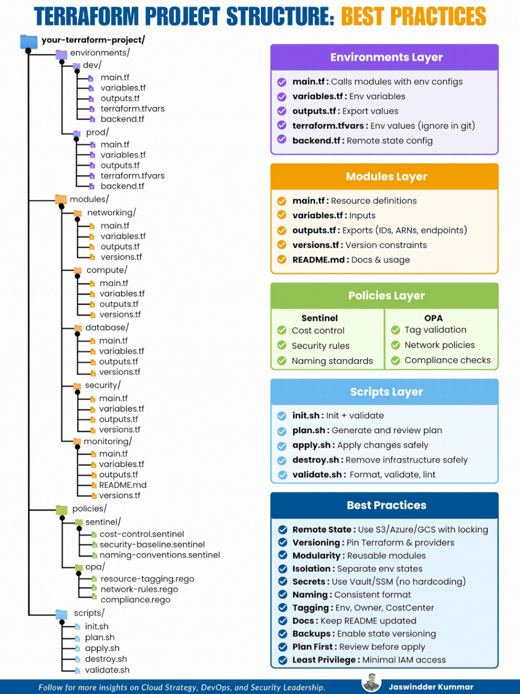

# 2026 DevOps CheatSheet


## 3 Infrastructure as Code (IaC)

### 3-1 TERRAFORM WITH AWS AND KUBERNETES

Terraform is an Infrastructure as Code (IaC) tool that allows us to define, provision and manage cloud resources in a declarative and automated way. 

It supports multiple providers, including AWS, Kubernetes and many others.

#### 2. Terraform Core Concepts

- **Provider** - A plugin to interact with APls (e.g., AWS, Kubernetes)
- **Resource** - A managed infrastructure component (e.g., EC2, S3)
- **Data Source** - Fetches information from existing resources
- **Variables** - Input values to make configuration dynamic
- **State File** - Stores the current state of infrastructure
- **Modules** - Reusable configurations for best practices

#### 3. Terraform with AWS

**Common AWS Resources**

| Category   | Resources (Examples)                                       |
| ---------- | ---------------------------------------------------------- |
| Compute    | EC2, Auto Scaling Group, Lambda                            |
| Storage    | S3, EBS, EFS                                               |
| Networking | VPC, Subnet, Internet Gateway, Route Table, Security Group |
| Database   | RDS, DynamoDB                                              |
| Security   | IAM, KMS, Security Group                                   |
| Others     | CloudWatch, SNS, SQS, ELB                                  |

**Benefits**

- → **Consistent and repeatable deployments**
- → **Version controlled infrastructure**
- → **Cost effective and highly available architecture**
- → **Easy scaling and management**

**Sample: AWS Infrastructure using Terraform**


```
Internet
  └── AWS Cloud
        └── VPC 10.0.0.0/16
              ├── Public Subnet 10.0.1.0/24
              │     └── EC2 Instance (Web Server)
              └── Private Subnet 10.0.2.0/24
                    └── RDS Instance (Database)
```

```
provider "aws" {
    region = "ap-south-1"
}

resource "aws_instance" "web" {
    ami = "ami-0c55b159cbfaef1f0"
    instance_type = "t2.micro"
    subnet_id = aws_subnet.public.id
    security_groups = [aws_security_group.web_sg.name]
    tags = {
        Name = "Terraform-EC2-Instance"
    }
}
```


#### 4. Terraform with Kubernetes

- Terraform can manage Kubernetes resources using the **Kubernetes provider**.
- It can create **namespaces**, **deployments**, **services**, **configmaps**, **secrets** and more.
- **Use case**: Provision infrastructure in AWS and then deploy applications on EKS using Terraform.

#### Example: Kubernetes Resources

- Namespace
- Deployment
- Service
- ConfigMap
- Secret

#### Example Terraform Snippet (Kubernetes - Deployment)

```hcl
provider "kubernetes" {
  config_path = "/.kube/config"
}

resource "kubernetes_deployment" "app" {
  metadata {
    name = "my-app"
    labels = {
      app = "my-app"
    }
  }
  spec {
    replicas = 2
    selector {
      match_labels = {
        app = "my-app"
      }
    }
    template {
      metadata {
        labels = {
          app = "my-app"
        }
      }
      spec {
        container {
          image = "nginx:latest"
          name = "nginx"
          port {
            container_port = 80
          }
        }
      }
    }
  }
}
```

```
EKS Architecture

AWS
|
VPC
|
EKS Cluster
|
Kubernetes
Resources
(Pods, Services etc.)
```

### Best Practices

- **Use remote backend (S3 + DynamoDB) for state locking**.
- Write modular and reusable Terraform code.
- **Use variables and locals for flexibility**.
- **Enable versioning and tagging for all resources**.
- Follow security best practices (IAM least privilege, security groups).





#### Step-by-Step Configuration Guide with AWS EC2 Instance 

1. **Main Terraform Configuration: main.tf:**

Terraform Configuration Example:

```
terraform {
  required_providers {
    aws = {
      source = "hashicorp/aws"
      version = "> 4.16"
    }
  }
  required_version = "> 1.2.0"
}

provider "aws" {
  region = "us-west-2"
}

resource "aws_instance" "app_server" {
  ami = "ami-08d70e59c07c61a3a"
  instance_type = "t2.micro"

  tags = {
    Name = var.instance_name
  }
}
```


**2. Input Variables: variables.tf**

**Example:**

```hcl
variable "instance_name" {
  description = "Value of the Name tag for the EC2 instance"
  type        = string
  default     = "ExampleAppServerInstance"
}
```

**3. Output Values: outputs.tf**

```hcl
output "instance_id" {
  description = "ID of the EC2 instance"
  value       = aws_instance.app_server.id
}

output "instance_public_ip" {
  description = "Public IP address of the EC2 instance"
  value       = aws_instance.app_server.public_ip
}
```

#### **4. Running the Configuration**

**Initialize Terraform:**


```bash
terraform init
```

**Apply the Configuration:**

```bash
terraform apply
```

- Confirm by typing `yes` when prompted.

Inspect Output Values:

```bash
terraform output
```

Destroy the Infrastructure:

```bash
terraform destroy
```

#### Terraform Advanced Configuration Use Cases

**1. Provider Configuration:**

```hcl
provider "aws" {
  region = "us-west-2"
}
```

**2. Resource Creation:**

```hcl
resource "aws_instance" "example" {
  ami           = "ami-0c55b159cbfafe1f0"
  instance_type = "t2.micro"
  tags = {
    Name = "ExampleInstance"
  }
}

**3. Variable Management:**

```hcl
variable "region" {
  default = "us-west-2"
}

provider "aws" {
  region = var.region
}
```


**4. State Management:**

Example for using remote state in S3:

```hcl
terraform {
  backend "s3" {
    bucket          = "my-tfstate-bucket"
    key             = "terraform/state"
    region          = "us-west-2"
    encrypt         = true
    dynamodb_table  = "terraform-locks"
  }
}
```

**5. Modules:**

Module Configuration:

```hcl
module "vpc" {
  source = "terraform-aws-modules/vpc/aws"

  name = "my-vpc"
  cidr = "10.0.0.0/16"

  azs = ["us-west-2a", "us-west-2b"]

  public_subnets = ["10.0.1.0/24", "10.0.2.0/24"]

  private_subnets = ["10.0.3.0/24", "10.0.4.0/24"]
}
```

Terraform Commands Cheat Sheet

- **terraform init**: Initializes the Terraform configuration.
- **terraform fmt**: Formats configuration files.
- **terraform validate**: Validates the configuration files.
- **terraform plan**: Previews changes to be applied.
- **terraform apply**: Applies the changes to reach the desired state.
- **terraform destroy**: Destroys the infrastructure and removes it from the state.
- **terraform show**: Displays the current state of resources.
- **terraform state list**: Lists resources in the current state.
- **terraform taint <resource>**: Marks a resource for recreation.
- **terraform import <resource> <resource_id>**: Imports existing resources into Terraform.
- **terraform providers**: Lists the providers used in the configuration.


Terraform Best Practices

- Use **Version Control** to manage your Terraform code.

## 5. Cloud Services

### 5-1 AWS (EC2, S3, IAM, VPC, Lambda)

#### EC2 (Elastic Compute Cloud)

● aws ec2 describe-instances – List all instances

● aws ec2 start-instances --instance-ids <id> – Start an instance

● aws ec2 stop-instances --instance-ids <id> – Stop an instance

● aws ec2 terminate-instances --instance-ids <id> – Terminate an instance

● aws ec2 create-key-pair --key-name <name> – Create a key pair

● aws ec2 describe-security-groups – List security groups


#### S3 (Simple Storage Service)

● aws s3 ls – List buckets

● `aws s3 mb s3://<bucket>` – Create a bucket

● `aws s3 cp <file> s3://<bucket>/` – Upload a file

● `aws s3 rm s3://<bucket>/<file>` – Delete a file

● `aws s3 rb s3://<bucket> --force` – Delete a bucket

● `aws s3 sync <local-dir> s3://<bucket>/` – Sync local and S3


#### IAM (Identity and Access Management)

● `aws iam list-users` – List IAM users

● `aws iam create-user --user-name <name>` – Create a user

● `aws iam attach-user-policy --user-name <name> --policy-arn <policy>` Attach a policy

● `aws iam list-roles – List IAM roles`

● `aws iam create-role --role-name <name> --assume-role-policy-document file://policy.json` – Create a role

● `aws iam list-policies` – List policies


#### Lambda (Serverless Computing)

● `aws lambda list-functions` – List all Lambda functions

● `aws lambda create-function --function-name <name> --runtime <runtime> --role <role> --handler <handler>` – Create a function

● `aws lambda update-function-code --function-name <name> --zip-file fileb://<file>.zip` – Update function code

● `aws lambda delete-function --function-name <name>` – Delete a function

● `aws lambda invoke --function-name <name> output.json` – Invoke a function


## 9. Networking, Ports & Load Balancing

### 9-1 Networking Basics

**IP Addressing**

- **Private IPs**: 10.0.0.0/8, 172.16.0.0/12, 192.168.0.0/16
- **Public IPs**: Assigned by ISPs
- **CIDR Notation**: 192.168.1.0/24 (Subnet Mask: 255.255.255.0)

**Protocols** 


- TCP (Reliable, connection-based)
- UDP (Fast, connectionless)
- ICMP (Used for ping)
- HTTP(S), FTP, SSH, DNS

### 9-2. Network Commands


ip a # Show IP addresses

ifconfig # Older command

**Check connectivity**  ping google.com

**Trace route** traceroute google.com

DNS lookup 

nslookup google.com 

dig google.com

**Test ports** 

telnet google.com 80 

nc -zv google.com 443

Firewall Rules (iptables) List firewall rules 

`sudo iptables -L -v`

Allow SSH: `sudo iptables -A INPUT -p tcp --dport 22 -j ACCEPT`

Block an IP `sudo iptables -A INPUT -s 192.168.1.100 -j DROP`

Netcat (nc):  Start a simple TCP listener 	`nc -lvp 8080`

Send data to a listening server `echo "Hello" | nc 192.168.1.100 8080`


### 9-3 Kubernetes Networking

List services and their endpoints 

`kubectl get svc -o wide`

Get pods and their IPs 

`kubectl get pods -o wide`

Port forward a service 

`kubectl port-forward svc/my-service 8080:80`

Expose a pod 

`kubectl expose pod mypod --type=NodePort --port=80`


### 9-4. Docker Networking 

List networks `docker network ls`

Inspect a network `docker network inspect bridge`

Create a custom network `docker network create mynetwork`

Run a container in a custom network `docker run -d --network=mynetwork nginx`


