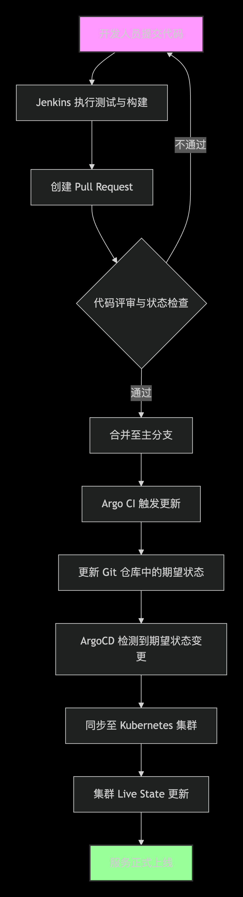
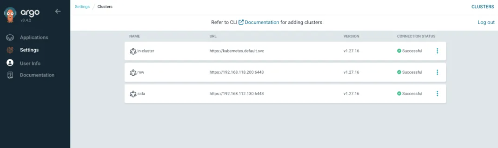
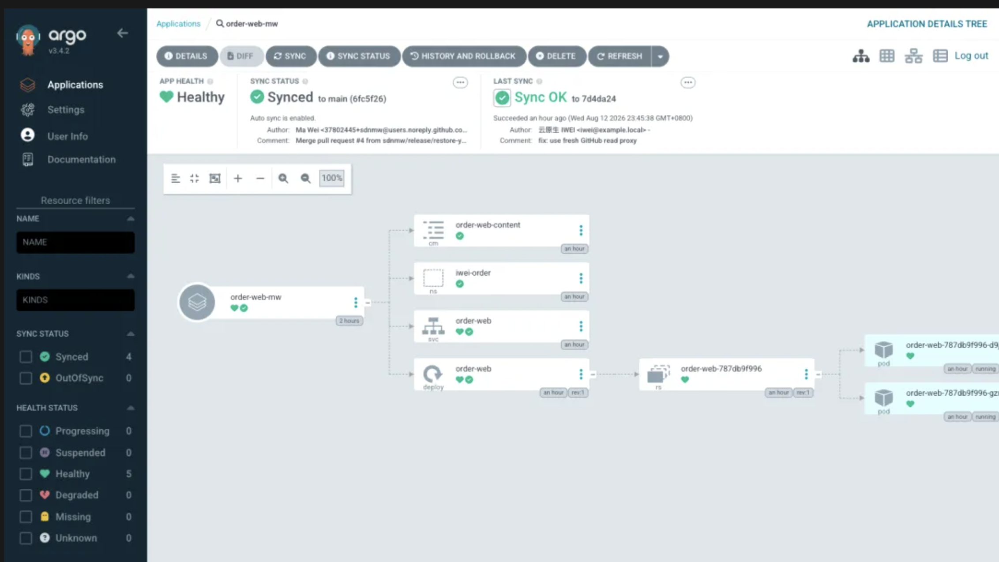
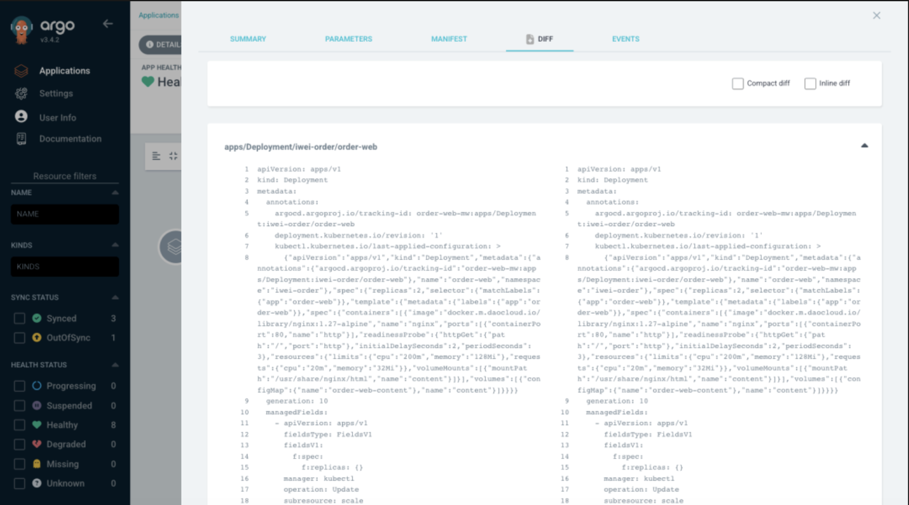
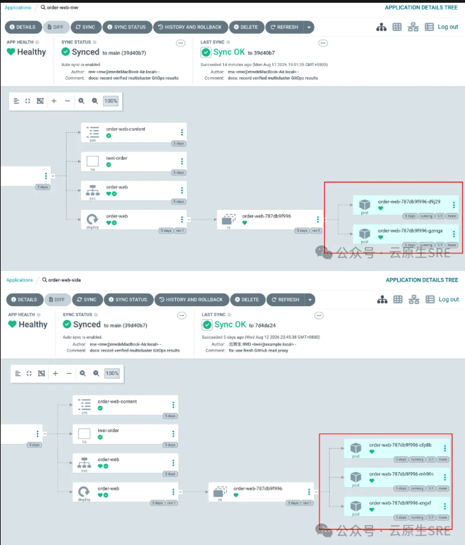
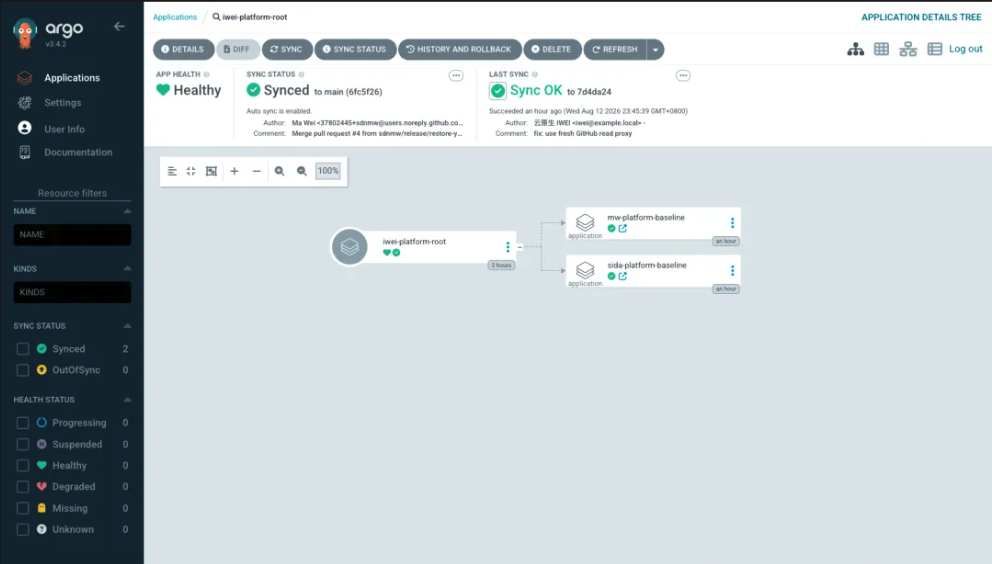
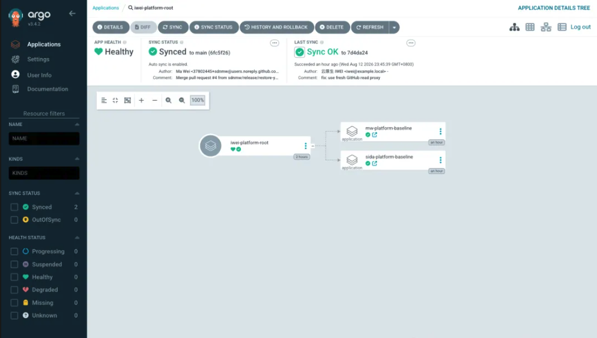
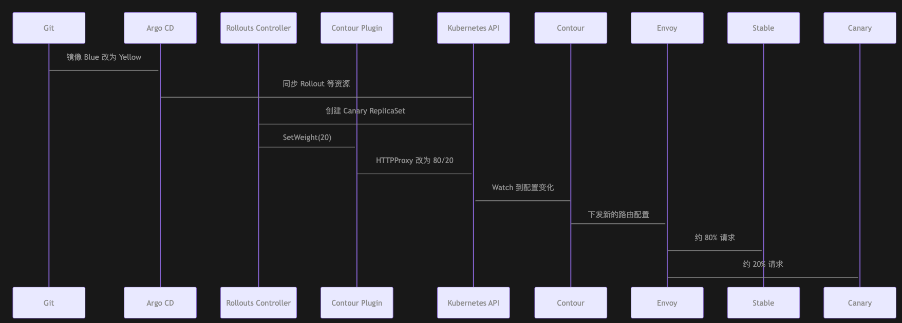

# 6 从 kubectl apply 到 GitOps：Argo CD 如何改变 Kubernetes 应用交付


## 从 kubectl apply 到 GitOps：Argo CD 如何改变 Kubernetes 应用交付

我们把一套订单系统刚迁移到 Kubernetes 时，发布流程通常很直接：开发人员修改 YAML，运维人员登录跳板机，然后执行 kubectl apply -f。

这种方式在一个集群、几个服务时没有明显问题。但当订单系统同时运行在多个集群，配置中又有副本数、域名、资源限制和环境参数的差异时，很快会遇到几个难以回答的问题：

* 生产环境当前运行的 YAML，究竟来自哪个 Git Commit？
* 某个人临时执行 `kubectl scale` 后，集群已经与代码仓库不一致，谁会发现？
* Git 中删掉一个 ConfigMap，集群中的旧对象会不会永远留下？
* 两个集群是否都完成发布，业务是否健康，有没有一个统一视图？
* 一次发布失败后，是在集群中手工修改，还是把 Git 恢复到已验证的版本


kubectl apply 解决的是“把这份配置提交给 API Server”，但它不会持续确认集群是否仍然符合这份配置。更麻烦的是，发布权限开始散落在跳板机、 CI 凭据、运维人员的 kubeconfig 中，操作过程却很难完整审计。


## 02 GitOps：如果 Git 成为生产环境的唯一事实来源

GitOps 的核心不是“把 YAML 放进 Git”，而是让 Git 中的声明式配置成为环境的期望状态，再由运行于 Kubernetes 中的 Controller 持续把集群拉回这个状态。

它改变了交付方向：



这时，发布不再是一次短暂的命令，而是一个持续运行的闭环：

1. Git 记录应该运行什么。
2. Argo CD 观察集群正在运行什么。
3. 两者不同时，Argo CD 将差异标记为 OutOfSync。
4. 策略允许时，Argo CD 执行同步、自愈或删除旧资源。

于是，变更有了 Pull Request、评审人、Commit 和回退记录。**修改 Git 才是正常入口，手工改集群只是需要被发现和纠正的漂移**


## 03 Argo CD 是什么？它与 Jenkins 有什么不同？


Argo CD 是一个运行于 Kubernetes 中的声明式 GitOps 持续交付工具。它理解 Kubernetes YAML、Helm、Kustomize 等配置形式，也理解 Deployment、Service、CRD 等资源的实际状态。Argo 项目已是 CNCF Graduated 项目

Jenkins 和 Argo CD 不是同一层工具：

| 环节 | Jenkins 更擅长 | Argo CD 更擅长 |
|------|----------------|----------------|
| 代码 | 编译、单元测试、安全扫描 | 不参与代码编译 |
| 镜像 | 构建、签名、推送 Registry | 观察 Git 中声明的镜像版本 |
| 部署 | 可以调用 kubectl，但需持有集群凭据 | 根据 Git YAML 持续调谐 Kubernetes |
| 状态 | Pipeline 结束后不再持续观察 | 持续检测 Sync、Health 和 Drift |
| 审计 | 保留构建和任务记录 | 将 Git Revision 与集群资源对应起来 |

可以这样分工：Jenkins 负责产出可交付物并更新 Git，Argo CD 负责把 Git 中的版本交付到集群。 Jenkins 不再需要嵌入生产 kubeconfig，生产集群也不需要接收来自 CI 的任意 kubectl 命令。


## 04 Argo CD 架构：Git 中的 YAML 如何最终变成 Kubernetes 资源？


API Server 是 UI、CLI 和外部系统访问 Argo CD 的入口。用户登录、RBAC 判断、Application 操作、仓库和集群凭据管理，都会经过它。它是管理面入口，不会成为业务流量的代理。


Repository Server 负责读取 Git 仓库和生成最终 Manifest。如果源目录是 Helm Chart，它执行模板渲染；如果是 Kustomize Overlay，它将 Base 和 Patch 合成最终 YAML。


Application Controller 是持续调谐的核心。它获取 Git 期望状态，再从目标 Kubernetes API 读取 Live State，计算差异、评估健康状态，并在同步时创建、修改或删除资源。


本次实验将 Argo CD v3.4.2 部署在 sks-mgmt 管理集群，然后注册 mw 和 sida 两个 Kubernetes v1.27.16 业务集群。




>  图：Argo CD 的 Cluster 页面中，in-cluster、mw 和 sida 均为 Successful。这证明管理集群能访问两个远程 API Server

## 05 Application：用一个 CRD 描述一次应用交付


Application 是 Argo CD 最核心的 CRD。一个 Application 主要回答三个问题：


* 从哪里取： Git 仓库、分支或 Commit、目录路径。
* 送到哪里： 集群和 Namespace。
* 怎么同步： 手动或自动，是否 Self Heal，是否 Prune。


实验仓库中，order-worker-sida 使用 Helm Chart，Application 的核心配置如下：

```
apiVersion: argoproj.io/v1alpha1
kind: Application
metadata:
  name: order-worker-mw
  namespace: argocd
spec:
  project: iwei-platform
  source:
    repoURL: https://ghproxy.net/https://github.com/sdnmw/argo-demo.git
    targetRevision: main
    path: apps/order-worker-chart
    helm:
      releaseName: order-worker
      parameters:
        - name: replicaCount
          value: "2"
        - name: environment
          value: mw
  destination:
    name: mw
    namespace: iwei-order
```

**Application 不是应用 YAML 的另一种打包格式，它更像一份交付合同。**

source 说明哪个版本可以进入环境，destination 约束资源的落点，project 则说明这份合同允许使用哪些仓库、集群和资源类型。


**Application 还会记录 Revision、Last Sync、History、Events 和渲染后 Manifest**。

遇到“Git 明明改了，集群为什么没变”时，可以先确认 Argo CD 实际读到的 Revision，再检查 Rendered Manifest，最后看 Sync Event

同步完成后，Argo CD 将生成的 Deployment、Service、ConfigMap 和 Pod 组成一棵资源树。



## 06 Sync、Health、Drift：Argo CD 如何判断应用是否“正确”？


Argo CD 的页面上经常同时出现 Sync 和 Health，两者并不是同一件事。

**Sync Status 比较 Git 中的期望对象与集群 Live Object 是否一致。Synced 表示配置一致，OutOfSync 表示存在差异**。

Health Status 判断对象是否在正常工作。

Deployment 已有足够 Ready Replica 时可以是 Healthy；Pod 起不来时可能是 Degraded；Rollout 在等待人工确认时则会是 Suspended。

Health 并不是 Argo CD 主动请求业务 API 得出的结论。**它主要根据 Kubernetes 对象的 status、Condition 和已知资源的健康评估逻辑做判断。Argo CD Health 回答“Kubernetes 对象是否按预期运行”，业务监控回答“这个版本是否真的可以继续接收流量”。**

因此，几个常见组合的含义完全不同：

| Sync 状态 | Health 状态 | 实际含义 |
|-----------|-------------|----------|
| Synced | Healthy | 配置一致，对象也正常 |
| OutOfSync | Healthy | 应用还在运行，但现场配置已偏离 Git |
| Synced | Degraded | Git 已经下发，但镜像、探针或资源可能有问题 |
| Synced | Suspended | 配置正确，对象正在等待灰度确认等操作 |


Drift 就是实际状态偏离 Git 期望状态。

实验中，我们暂停自愈，手工把 mw 的 order-web 从 2 副本扩到 5 副本。

**Argo CD 立即把 Deployment 标记为 OutOfSync，Diff 页面将差异定位到 spec.replicas。**




> 图：**Diff 中 Live State 为 replicas: 5，Git 期望为 replicas: 2。应用此时仍是 Healthy，但已经 OutOfSync，这正是“能运行不等于配置正确”**。

## 07 Auto Sync、Self Heal、Prune：让集群持续回到期望状态


Auto Sync、Self Heal 和 Prune 很容易被笼统地理解为“自动发布”，但它们分别处理三种变化。


Auto Sync 关心 Git 变了。**当新 Commit 使 Application 变为 OutOfSync 时，Argo CD 自动将新配置同步到集群**。CI 只要合并 PR，无需再调 Argo CD API。


**Self Heal 关心集群被人改了。前面的 5 副本 Drift 恢复 Self Heal 后，约几秒内回到 Git 声明的 2 副本：**

```
manual change: deployment.apps/order-web scaled
Argo CD:        OutOfSync, live replicas=5, desired replicas=2
self heal:      Synced, replicas=2, ready=2
```

**Prune 关心 Git 删掉了资源。如果不开 Prune，Argo CD 可以创建和更新，但 Git 中已删除的 ConfigMap 仍可能留在集群中。**

**Prune 更需要谨慎。**

删除无状态 ConfigMap 与删除 PVC、Namespace 的后果完全不同。对关键数据资源，可以使用 Sync Option 或资源策略阻止误删，并要在 PR 中明确展示将被清理的对象。对重大删除，应先验证备份和恢复路径。


## 08 Helm 与 Kustomize：生产环境如何管理不同配置？

**同一个订单应用发布到两个集群时，大部分 YAML 都一样，但 mw 集群需要 2 副本，sida 集群需要 3 副本。复制两份完整 YAML 虽然最直观，但公共配置修改时很容易漏改某个环境**。

Kustomize 适合“公共 Base + 少量环境 Patch”。

本次实验的 `apps/order-web/base/ ` 定义共用 Deployment、Service 和 ConfigMap，overlays/mw/ 与 overlays/sida/ 只修改副本数与环境内容。Argo CD 中最终可以看到 mw=2、sida=3，而不需要在仓库维护两份重复清单。

```
apiVersion: kustomize.config.k8s.io/v1beta1
kind: Kustomization
namespace: iwei-order
resources:
  - ../../base
patches:
  - target:
      kind: Deployment
      name: order-web
    patch: |-
      - op: replace
        path: /spec/replicas
        value: 3`
```

Helm 适合已经产品化的应用模板。Chart 定义可配置能力，Values 或 Parameters 提供环境输入。这种方式很适合中间件、通用平台组件和已经有成熟 Chart 的业务应用。

选择时可以遵循一个简单标准：已有成熟 Chart，用 Helm；原生 YAML 只有少量环境差异，用 Kustomize。两者都能被 Argo CD 渲染和比对，没有必要为了 GitOps 统一成同一种模板工具。




> 图： mw=2、`sida=3


配置分层比选择哪个工具更重要。通用镜像、端口和探针应放在 Base 或 Chart Default 中；副本数、域名和资源配额属于环境配置；密码和证书则不应进入普通 Values 或 Patch。

## 09 ApplicationSet：从一个应用走向数百应用、多集群交付

**如果每个集群都手写一个 Application，100 个集群就会有 100 份高度重复的对象。**

ApplicationSet 的作用是根据集群、Git 目录、列表或 PR 等数据生成 Application。

如果每个集群都手写一个 Application，100 个集群就会有 100 份高度重复的对象。

**ApplicationSet 的作用是根据集群、Git 目录、列表或 PR 等数据生成 Application。**

```
spec:
  generators:
    - clusters:
        selector:
          matchLabels:
            iwei.io/workload-cluster: "true"
  template:
    metadata:
      name: 'order-web-{{name}}'
    spec:
      source:
        path: 'apps/order-web/overlays/{{name}}'
      destination:
        server: '{{server}}'
        namespace: iwei-order
```


最终只生成两个 `Application：order-web-mw` 和 `order-web-sida`。当新集群带着正确标签注册进来，它也能自动加入交付范围。

```
apiVersion: argoproj.io/v1alpha1
kind: ApplicationSet
metadata:
  name: order-platform
  namespace: argocd
spec:
  generators:
  - clusters:
      selector:
        matchLabels:
          iwei.io/workload-cluster: "true"
  template:
    metadata:
      labels:
        iwei.io/cluster: '{{name}}'
      name: order-web-{{name}}
    spec:
      destination:
        namespace: iwei-order
        server: '{{server}}'
      project: iwei-platform
      source:
        path: apps/order-web/overlays/{{name}}
        repoURL: https://ghproxy.net/https://github.com/sdnmw/argo-demo.git
        targetRevision: main
```




> 图：ApplicationSet 生成的双集群订单应用、Helm 应用、App of Apps 和灰度应用出现在同一页面。截图时两个 Rollout 正暂停在 20%，因此 Health 为 Suspended，而不是发布失败。

ApplicationSet 非常适合平台团队管理标准化多集群交付，但它的权限也更大。开发人员如果能任意改 Generator 和 Destination，就可能把资源生成到本不应访问的集群。所以要使用 AppProject 限制仓库、目标集群、Namespace 和资源种类。


## 10 App of Apps：如何一次性交付完整 Kubernetes 应用？


一个完整平台往往不只有一个应用。**它可能包含 Ingress Controller、cert-manager、监控、日志、安全策略和业务基线。App of Apps 模式使用一个根 Application 同步一组子 Application，子 Application 再各自管理实际资源**。

**本次的 iwei-platform-root Application 生成 mw-platform-baseline 和 sida-platform-baseline子 Application，两个子应用分别向相应集群下发 ResourceQuota 和平台 ConfigMap。**




> 图：根 Application 不直接管理业务 Pod，它先管理子 Application，子 Application 再将基线交付到 mw 和 sida。

它适合集群初始化和平台组件编排。App of Apps 还会遇到启动顺序问题。

**例如一个应用需要先安装 CRD，再创建 Controller，最后创建对应的 Custom Resource。**

如果全部资源同时提交，Custom Resource 可能在 CRD 可用前就被 API Server 拒绝。

**Argo CD 可以通过 PreSync、Sync、PostSync Phase 和 Sync Wave 组织顺序**。这些机制应用于真正存在依赖的资源，不应用大量人为 Wave 把整个平台写成难以理解的串行脚本。

## 11 Argo CD + Jenkins：CI/CD 的正确分工


实验仓库中的 jenkins/Jenkinsfile 不调用 Kubernetes API。Pipeline 负责测试、构建和推送镜像，然后创建部署仓库分支，修改镜像 Tag 并发起 PR。

```
stage('Update GitOps repository') {
  sh '''
    git checkout -b release/${BUILD_NUMBER}
    yq -i '.spec.template.spec.containers[0].image = env(IMAGE)' \
      rollouts/base/rollout.yaml
    git commit -am "release: ${IMAGE}"
    git push origin HEAD
  '''
}
```

合并 PR 后，Argo CD 发现新 Revision，将它同步到目标集群。这种分工有三个实际价值：

* Jenkins 泄露时，攻击者不会立即获得两个生产集群的 kubeconfig。
* 镜像更新要经过 Git 评审，而不是 Pipeline 内一条不透明的 kubectl 命令。
* 即使 Pipeline 已经结束，Argo CD 仍在持续观察集群是否偏离 Git。

这并不意味着 Jenkins 与 Argo CD 之间不需要任何联系。

**Jenkins 需要把镜像 Digest、测试结果和安全扫描结果带到 PR；**

Argo CD 可通过 Notification 把同步成功或失败返回协作平台。

两者用 Git Revision 建立共同的交付编号。

## 12 Argo Rollouts：从持续交付走向灰度与渐进式发布


Argo CD 可以把新 Deployment 交付到集群，但 Kubernetes 原生 RollingUpdate 主要按 Pod 数量替换，不能精确表达“先给新版本 20% 真实流量，人工确认后再到 50%”。能否用 ArgoCD 发布 的时候就能实现灰度发布？


**Argo Rollouts 使用 Rollout CRD 代替 Deployment 管理 ReplicaSet，并可以结合 Ingress Controller 或 Service Mesh 调整流量。**它和 Argo CD 的关系是：

* **Argo CD 负责从 Git 交付 Rollout、Service 和 Ingress。**
* Argo Rollouts Controller 负责执行 20% -> 50% -> 100% 的发布步骤。
* Ingress 负责根据流量权重转发真实流量。


### 设计 Rollout 实验

**订单应用最初运行 Blue 版本，全部请求都进入 Blue。**

开发人员在 Git 中把镜像改为 Yellow 并合并 PR 后，Argo CD 只负责把新的 Rollout 声明同步到 mw 和 sida；

真正创建 Yellow Pod、保留 Blue Pod并逐步调整流量的是两个集群中的 Argo Rollouts Controller。

**业务请求不会经过 Argo CD 或 Rollouts Controller。**

客户端仍然访问 Contour 的 Envoy 入口，HTTPProxy 再按照当前权重把请求交给 Stable 或 Canary Service。Rollouts Dashboard 也不转发流量，它只是读取发布状态，并提供 Promote、Abort 等操作入口。




> 图：本次 Rollout 灰度实验的控制链路与请求链路。

一次 Yellow 发布会经历以下过程：


1. Blue 已是 Stable，**HTTPProxy 将 100% 流量发给 Stable Service**。
2. Git 中的镜像改为 Yellow，Argo CD 同步后，Rollouts Controller 创建新的 Canary ReplicaSet。
3. 第一阶段把 20% 流量交给 Yellow，然后无限期暂停。此时检查错误率、延迟和订单成功率，再决定 Promote 或 Abort。
4. Promote 后进入 50%，观察 60 秒；没有主动终止时继续进入 100%。
5. **发布完成后，Yellow 被提升为新的 Stable，旧 Blue ReplicaSet 再按历史版本策略缩容**。
6. 如果在检查点执行 Abort，**Canary 权重回到 0，Stable 立即重新接管 100% 流量，但 Git 中的镜像版本不会自动回退**。

### Rollout：定义版本和灰度步骤

**Rollout 是这次实验的核心资源。**

它的 Pod 模板与 Deployment 很接近，**但 strategy.canary 额外声明了新旧版本使用哪个 Service、由哪个流量插件修改入口，以及发布要经过哪些检查点**。

```
apiVersion: argoproj.io/v1alpha1
kind: Rollout
metadata:
  name: order-rollout
spec:
  replicas: 5
  selector:
    matchLabels:
      app: order-rollout
  template:
    metadata:
      labels:
        app: order-rollout
    spec:
      containers:
        - name: order-web
          image: docker.m.daocloud.io/argoproj/rollouts-demo:yellow
  strategy:
    canary:
      stableService: order-rollout-stable
      canaryService: order-rollout-canary
      trafficRouting:
        plugins:
          argoproj-labs/contour:
            httpProxies:
              - order-rollout
      steps:
        - setWeight: 20
        - pause: {}
        - setWeight: 50
        - pause: {duration: 60s}
        - setWeight: 100
```

### Stable 与 Canary Service：把两个版本分开


入口要按比例访问新旧版本，首先要有两个独立后端。Git 中的两个 Service 初始都只写业务标签：

```
apiVersion: v1
kind: Service
metadata:
  name: order-rollout-stable
spec:
  selector:
    app: order-rollout
  ports:
    - port: 80
      targetPort: 8080
---
apiVersion: v1
kind: Service
metadata:
  name: order-rollout-canary
spec:
  selector:
    app: order-rollout
  ports:
    - port: 80
      targetPort: 8080
```

看起来两个 Service 的 Selector 完全相同，实际运行时并不会选中同一批 Pod。Rollouts Controller 会把对应 ReplicaSet 的 pod-template-hash 加入 Selector：Stable Service 指向当前稳定版本，Canary Service 指向正在验证的新版本。

### HTTPProxy 与 Contour Plugin：把 20% 变成真实流量

HTTPProxy 是 Contour 的路由资源。Git 先给出一个稳定基线：Stable 权重为 100，Canary 为 0

```
apiVersion: projectcontour.io/v1
kind: HTTPProxy
metadata:
  name: order-rollout
spec:
  virtualhost:
    fqdn: order.iwei.local
  routes:
    - conditions:
        - prefix: /
      services:
        - name: order-rollout-stable
          port: 80
          weight: 100
        - name: order-rollout-canary
          port: 80
          weight: 0
```

**Rollouts Controller 本身并不知道如何修改每一种 Ingress。**

实验在 argo-rollouts-config 中注册 Contour Plugin，由插件把 setWeight: 20 翻译成 HTTPProxy 的 80/20，再由 Envoy 对真实请求执行加权转发。

```
apiVersion: v1
kind: ConfigMap
metadata:
  name: argo-rollouts-config
  namespace: argo-rollouts
data:
  trafficRouterPlugins: |-
    - name: argoproj-labs/contour
      location: file:///plugins/rollouts-plugin-trafficrouter-contour
```

因此，看到 Dashboard 上的 Canary Weight=20 只能证明 Controller 的发布状态已经推进；还要检查 HTTPProxy 的实际权重并发送真实请求，才能确认流量入口确实执行了 80/20。

### Argo CD Application：避免 Self Heal 抢回流量权重

这里存在两个 Controller 同时管理一个对象：Argo CD 希望 HTTPProxy 始终等于 Git 中的 100/0，Rollouts 又要在发布过程中把它改成 80/20、50/50。若不划分字段所有权，Argo CD Self Heal 会不断把动态权重恢复为 100/0。
