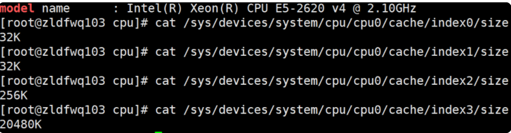
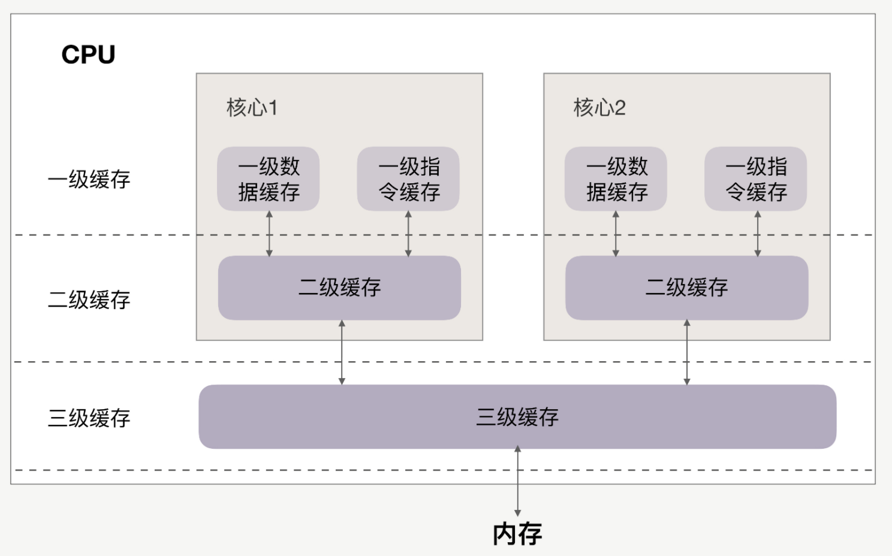
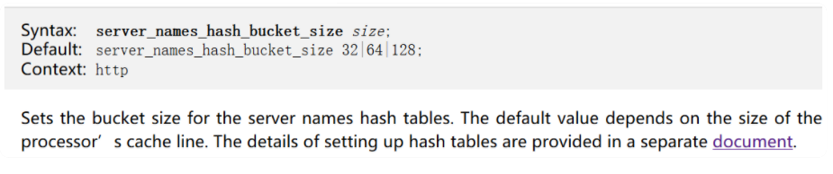
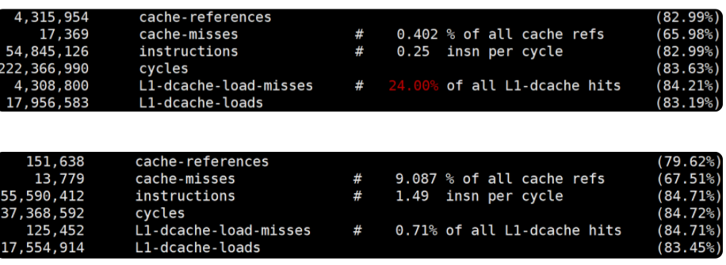
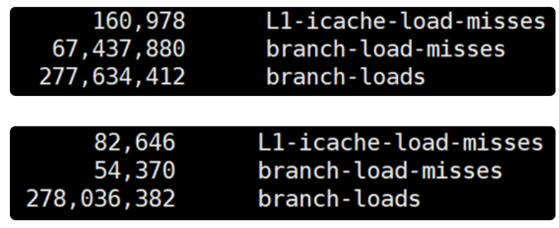

# **第一节 代码让CPU执行得更快 — CPU缓存**


任何代码的执行都依赖 CPU，通常，使用好 CPU 是操作系统内核的工作。然而，当我们编写计算密集型的程序时，CPU 的执行效率就开始变得至关重要。

**由于 CPU 缓存由更快的 SRAM 构成（内存是由 DRAM 构成的），而且离 CPU 核心更近，如果运算时需要的输入数据是从 CPU 缓存，而不是内存中读取时，运算速度就会快很多**。

所以，了解 CPU 缓存对性能的影响，便能够更有效地编写我们的代码，优化程序性能。

## **1、CPU 的多级缓存**

CPU 缓存离 CPU 核心更近，由于电子信号传输是需要时间的，所以离 CPU 核心越近，缓存的读写速度就越快。但 CPU 的空间很狭小，离 CPU 越近缓存大小受到的限制也越大。所以，综合硬件布局、性能等因素，CPU 缓存通常分为大小不等的三级缓存。

**CPU 缓存的材质 SRAM 比内存使用的 DRAM 贵许多，所以不同于内存动辄以 GB 计算，它的大小是以 MB 来计算的。**

**比如，在我的 Linux 系统上，离 CPU 最近的一级缓存是 32KB，二级缓存是 256KB，最大的三级缓存则是 20MB。**



```
$ getconf -a | grep CACHE
LEVEL1_ICACHE_SIZE                 32768
LEVEL1_ICACHE_ASSOC                8
LEVEL1_ICACHE_LINESIZE             64
LEVEL1_DCACHE_SIZE                 32768
LEVEL1_DCACHE_ASSOC                8
LEVEL1_DCACHE_LINESIZE             64
LEVEL2_CACHE_SIZE                  262144
LEVEL2_CACHE_ASSOC                 4
LEVEL2_CACHE_LINESIZE              64
LEVEL3_CACHE_SIZE                  16777216
LEVEL3_CACHE_ASSOC                 16
LEVEL3_CACHE_LINESIZE              64
LEVEL4_CACHE_SIZE                  0
LEVEL4_CACHE_ASSOC                 0
LEVEL4_CACHE_LINESIZE              0
```



缓存要比内存快很多。

CPU 访问一次内存通常需要 100 个时钟周期以上，而访问一级缓存只需要 4~5 个时钟周期，二级缓存大约 12 个时钟周期，三级缓存大约 30 个时钟周期（对于 2GHZ 主频的 CPU 来说，一个时钟周期是 0.5 纳秒。


如果 CPU 所要操作的数据在缓存中，则直接读取，这称为缓存命中。命中缓存会带来很大的性能提升，**因此，我们的代码优化目标是提升 CPU 缓存的命中率。**

当然，缓存命中率是很笼统的，具体优化时还得一分为二。

比如，你在查看 CPU 缓存时会发现有 2 个一级缓存（比如 Linux 上就是上图中的 index0 和 index1），这是因为，CPU 会区别对待指令与数据。**比如，“1+1=2”这个运算，“+”就是指令，会放在一级指令缓存中，而“1”这个输入数字，则放在一级数据缓存中。**

虽然在冯诺依曼计算机体系结构中，代码指令与数据是放在一起的，但执行时却是分开进入指令缓存与数据缓存的，因此我们要分开来看二者的缓存命中率。

## **2、提升数据缓存的命中率**

访问顺序是如何影响缓存命中率

比如现在要遍历二维数组，其定义如下证的 C/C++、Java

```
int array[N][N];
```
用 `array[j][i]` 和 `array[i][j]`访问数组元素，哪一种性能更快？

```
for(i = 0; i < N; i+=1) {
   for(j = 0; j < N; j+=1) {
       array[i][j] = 0;
   }
}
```

C++ 代码实现中，前者 `array[j][i]执`行的时间是后者 `array[i][j]`的 `8 `倍之多

**为什么会有这么大的差距呢？**

**这是因为二维数组 array 所占用的内存是连续的**，比如若长度 N 的值为 2，那么内存中从前至后各元素的顺序是：

```
array[0][0]，array[0][1]，array[1][0]，array[1][1]。
```

此时内存是跳跃访问的，**如果 N 的数值很大，那么操作 `array[j][i]`时，是没有办法把 `array[j+1][i`]也读入缓存的。**

2 个问题

* 为什么两者的执行时间有约 7、8 倍的差距呢？
* 载入 `array[0][0]`元素时，缓存一次性会载入多少元素呢？

其实这两个问题的答案都与 **CPU Cache Line 相关，它定义了缓存一次载入数据的大小**，Linux 上你可以通过 `coherency_line_size` 配置查看它，通常是 64 字节。

> cup cache line一次加载到cpu 高速缓存的字节数(一般64字节), 为了让多核的1,2级高速缓存不失效和被锁(cpu缓存一致性原则)写代码的时候经常会做字节对其,保证一个变量或对象补齐64

```
$ cat /sys/devices/system/cpu/cpu0/cache/index1/coherency_line_size
64
```

测试的服务器一次会载入 64 字节至缓存中。

当载入 `array[0][0]`时，若它们占用的内存不足 64 字节，CPU 就会顺序地补足后续元素。顺序访问的` array[i][j]`因为利用了这一特点，所以就会比 `array[j][i]`要快。

也正因为这样，当元素类型是 4 个字节的整数时，性能就会比 8 个字节的高精度浮点数时速度更快，因为缓存一次载入的元素会更多


**<span style="color:red">因此，遇到这种遍历访问数组的情况时，按照内存布局顺序访问将会带来很大的性能提升。</span>**

再来看为什么执行时间相差 8 倍。在二维数组中，**其实第一维元素存放的是地址，第二维存放的才是目标元素。**

由于 64 位操作系统的地址占用 8 个字节（32 位操作系统是 4 个字节），因此，每批 Cache Line 最多也就能载入不到 8 个二维数组元素，所以性能差距大约接近 8 倍。

**关于 `CPU Cache Line` 的应用其实非常广泛，如果你用过 Nginx，会发现它是用哈希表来存放域名、HTTP 头部等数据的，这样访问速度非常快，而哈希表里桶的大小如 `server_names_hash_bucket_size`，它默认就等于 CPU Cache Line 的值**。

由于所存放的字符串长度不能大于桶的大小，所以当需要存放更长的字符串时，就需要修改桶大小，但 Nginx 官网上明确建议它应该是 `CPU Cache Line` 的整数倍。



为什么要做这样的要求呢？

就是因为按照 cpu cache line（比如 64 字节）来访问内存时，不会出现多核 CPU 下的伪共享问题，可以尽量减少访问内存的次数。

**比如，若桶大小为 64 字节，那么根据地址获取字符串时只需要访问一次内存，而桶大小为 50 字节，会导致最坏 2 次访问内存，而 70 字节最坏会有 3 次访问内存。**

如果你在用 Linux 操作系统，可以通过一个名叫 `Perf `的工具直观地验证缓存命中的情况（可以用 `yum install perf `或者 `apt-get install perf` 安装这个工具，[这个网址中有大量案例可供参考](http://www.brendangregg.com/perf.html)）。

执行 `perf stat` 可以统计出进程运行时的系统信息（通过 `-e` 选项指定要统计的事件，如果要查看三级缓存总的命中率，可以指定缓存未命中 `cache-misses` 事件，以及读取缓存次数 `cache-references` 事件，两者相除就是缓存的未命中率，用 `1 `相减就是命中率。

类似的，通过 `L1-dcache-load-misses` 和 `L1-dcache-loads `可以得到 L1 缓存的命中率），此时你会发现 `array[i][j]`的缓存命中率远高于 `array[j][i]`。

当然，`perf stat `还可以通过指令执行速度反映出两种访问方式的优劣，

如下图所示（instructions 事件指明了进程执行的总指令数，而 cycles 事件指明了运行的时钟周期，二者相除就可以得到每时钟周期所执行的指令数，缩写为 IPC。如果缓存未命中，则 CPU 要等待内存的慢速读取，因此 IPC 就会很低。`array[i][j]`的 `IPC` 值也比 `array[j][i]`要高得多）：



## **2、提升指令缓存的命中率**

说完数据的缓存命中率，再来看指令的缓存命中率该如何提升。

比如，有一个元素为 0 到 255 之间随机数字组成的数组：

```
int array[N];
for (i = 0; i < TESTN; i++) array[i] = rand() % 256;
```

接下来要对它做两个操作：

* 一是循环遍历数组，判断每个数字是否小于 128，如果小于则把元素的值置为 0；
* 二是将数组排序。

那么，先排序再遍历速度快，还是先遍历再排序速度快呢？

```
for(i = 0; i < N; i++) {
       if (array [i] < 128) array[i] = 0;
}
sort(array, array +N);
```

**<span style="color:red">先排序的遍历时间只有后排序的三分之一</span>** 

**这是因为循环中有大量的 if 条件分支，而 CPU含有分支预测器。**

当代码中出现 if、switch 等语句时，意味着此时至少可以选择跳转到两段不同的指令去执行。如果分支预测器可以预测接下来要在哪段代码执行（比如 if 还是 else 中的指令），就可以提前把这些指令放在缓存中，CPU 执行时就会很快。

**当数组中的元素完全随机时，分支预测器无法有效工作，而当 array 数组有序时，分支预测器会动态地根据历史命中数据对未来进行预测，命中率就会非常高。**


**还是用` Linux` 上的 `perf `来做个验证。使用 `-e` 选项指明 `branch-loads` 事件和 `branch-load-misses` 事件，它们分别表示分支预测的次数，以及预测失败的次数**。通过 `L1-icache-load-misses` 也能查看到一级缓存中指令的未命中情况。

先排序的话分支预测的成功率非常高，而且一级指令缓存的未命中率也有大幅下降。



```
#define likely(x) __builtin_expect(!!(x), 1) 
#define unlikely(x) __builtin_expect(!!(x), 0)
if (likely(a == 1)) …
```

## **3、提升多核 CPU 下的缓存命中率**

面向一个 CPU 核心谈数据及指令缓存的，然而现代 CPU 几乎都是多核的。

虽然三级缓存面向所有核心，但一、二级缓存是每颗核心独享的。我们知道，即使只有一个 CPU 核心，现代分时操作系统都支持许多进程同时运行。这是因为操作系统把时间切成了许多片，微观上各进程按时间片交替地占用 CPU，这造成宏观上看起来各程序同时在执行。


因此，若进程 A 在时间片 1 里使用 CPU 核心 1，自然也填满了核心 1 的一、二级缓存，当时间片 1 结束后，操作系统会让进程 A 让出 CPU，基于效率并兼顾公平的策略重新调度 CPU 核心 1，以防止某些进程饿死。

如果此时 CPU 核心 1 繁忙，而 CPU 核心 2 空闲，则进程 A 很可能会被调度到 CPU 核心 2 上运行，这样，即使我们对代码优化得再好，也只能在一个时间片内高效地使用 CPU 一、二级缓存了，下一个时间片便面临着缓存效率的问题。

因此，操作系统提供了将进程或者线程绑定到某一颗 CPU 上运行的能力。

如 Linux 上提供了 `sched_setaffinity`方法实现这一功能，其他操作系统也有类似功能的 API 可用。

当多线程同时执行密集计算，且 CPU 缓存命中率很高时，如果将每个线程分别绑定在不同的 CPU 核心上，性能便会获得非常可观的提升。Perf 工具也提供了 `cpu-migrations` 事件，它可以显示进程从不同的 CPU 核心上迁移的次数。

## **4、本节小结**

CPU 缓存分为数据缓存与指令缓存，对于数据缓存，我们应在循环体中尽量操作同一块内存上的数据，由于缓存是根据 CPU Cache Line 批量操作数据的，所以顺序地操作连续内存数据时也有性能提升。

对于指令缓存，有规律的条件分支能够让 CPU 的分支预测发挥作用，进一步提升执行效率。对于多核系统，如果进程的缓存命中率非常高，则可以考虑绑定 CPU 来提升缓存命中率。

