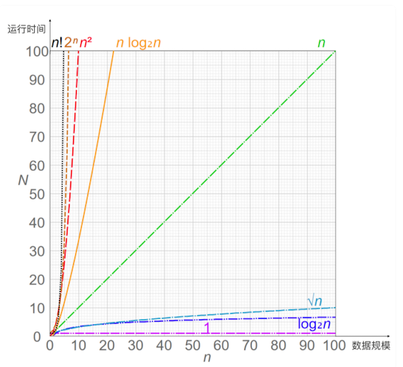
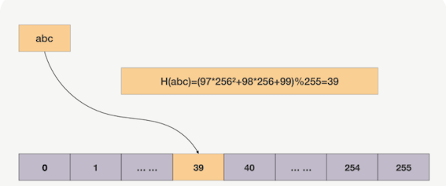

# **第三节 哈希表利用索引管理亿级对象**

Ptmalloc2 为子线程预分配了 64MB 内存池，虽然增大了内存消耗，但却加快了分配速度，这就是**以空间换时间**的思想

**在内存有限的单片机上运行嵌入式程序时，会压缩数据的空间占用，以时间换空间；**

但在面向海量用户的分布式服务中，**使用更多的空间建立索引，换取更短的查询时间，**管理大数据的常用手段。

比如现在需要管理数亿条数据，每条数据上有许多状态，有些请求在查询这些状态，有些请求则会根据业务规则有条件地更新状态，有些请求会新增数据，每条数据几十到几百字节。如果需要提供微秒级的访问速度，该怎么实现？

这种情况你会面对大量数据，**显然，遍历全部数据去匹配查询关键字，会非常耗时**。

如果使用额外的空间为这些数据创建索引，就可以基于索引实现快速查找，这是常用的解决方案。比如，我们用标准库里提供的字典类容器存放对象，就是在数据前增加了索引，其本质就是以空间换时间。

索引有很多，哈希表、红黑树、B 树都可以在内存中使用，如果我们需要数据规模上亿后还能提供微秒级的访问速度，**那么作为最快的索引，哈希表是第一选择**。

## **1、为什么选择哈希表？**

### **1-1 怎么定量评价索引快慢呢？**

时间复杂度可以很好地反映运行时间随数据规模的变化趋势，就如下图中，横轴是数据规模，纵轴是运行时间，随着数据规模的增长，水平直线 1 不随之变化，也就是说，**运行时间不变，是最好的曲线。用大 O 表示法描述时间复杂度，哈希表就是常量级的 O(1)**，数据规模增长不影响它的运行时间，所以 Memcached、Redis 都在用哈希表管理数据。

### **1-2 哈希表做到 O(1) 时间复杂度**

* 首先，哈希表基于数组实现，而数组可以根据下标随机访问任意元素。
	* 数组之所以可以随机访问，**是因为它由连续内存承载，且每个数组元素的大小都相等**。
	* **当知道下标后，把下标乘以元素大小，再加上数组的首地址，就可以获得目标访问地址，直接获取数据。**

* **其次，哈希函数直接把查询关键字转换为数组下标，再通过数组的随机访问特性获取数据**。
	* 比如，如果关键字是字符串，我们使用 BKDR 哈希算法将其转换为自然数，再以哈希数组大小为除数，对它进行求余，就得到了数组下标。 

如下图所示，字符串 abc 经过哈希函数的运算，得到了下标 39，于是数据就存放在数组的第 39 个元素上。

**哈希函数的执行时间是常量，数组的随机访问也是常量，时间复杂度就是 O(1)**。

### **1-3 生产环境用哈希表面临的问题**

在生产环境用哈希表管理如此多的数据，必然面临以下问题

* 首先，面对上亿条数据，为了保证可靠性，需要做灾备恢复，我们可以结合快照 +oplog 方式恢复数据，但内存中的哈希表如何快速地序列化为快照文件？
* 其次，简单的使用标准库提供的哈希表处理如此规模的数据，会导致内存消耗过大，因为每多使用一个 8 字节的指针（或者叫引用）都会被放大亿万倍，此时该如何实现更节约内存的个性化哈希表？
* 再次，哈希表频繁发生冲突时，速度会急剧降低，我们该通过哪些手段减少冲突概率？

## **2、内存结构与序列化方案**

**事实上对于动态（元素是变化的）哈希表，我们无法避免哈希冲突。**

比如上例中，“abc”与“cba”这两个字符串哈希后都会落到下标 39 中，这就产生了冲突。有两种方法解决哈希冲突：

1. **链接法，落到数组同一个位置中的多个数据，通过链表串在一起。使用哈希函数查找到这个位置后，再使用链表遍历的方式查找数据**。Java 标准库中的哈希表就使用链接法解决冲突。
2. 开放寻址法，插入时若发现对应的位置已经占用，或者查询时发现该位置上的数据与查询关键字不同，**开放寻址法会按既定规则变换哈希函数（例如哈希函数设为 H(key,i)，顺序地把参数 i 加 1），计算出下一个数组下标，继续在哈希表中探查正确的位置**。

我们该选择哪种方法呢？

由于生产级存放大量对象的哈希表是需要容灾的，比如每隔一天把哈希表数据定期备份到另一台服务器上。当服务器宕机而启动备用服务器时

首先可以用备份数据把哈希表恢复到 1 天前的状态，再通过操作日志 oplog 把 1 天内的数据载入哈希表，这样就可以最快速的恢复哈希表。所以，为了能够传输，首先必须把哈希表序列化。

链接法虽然实现简单，**还允许存放元素个数大于数组的大小（也叫装载因子大于 1）**，但链接法序列化数据的代价很大，因为使用了指针后，内存是不连续的。

**开放寻址法**确保所有对象都在数组里，就可以把数组用到的这段连续内存原地映射到文件中（参考 Linux 中的 mmap，Java 等语言都有类似的封装），再通过备份文件的方式备份哈希表

虽然操作系统会自动同步内存中变更的数据至文件，但备份前还是需要主动刷新内存（参考 Linux 中的 msync，它可以按地址及长度来分段刷新，以减少 msync 的耗时），以确定备份数据的精确时间点。而新的进程启动时，可以通过映射磁盘中的文件到内存，快速重建哈希表提供服务。

**如果能将数据完整的放进数组，那么开放寻址法已经解决了序列化问题，所以我们应该选择开放寻址法。**

有两个因素使得我们必须把数据放在哈希桶之外

1. 每条数据有上百字节；
2. 哈希表中一定会有很多空桶（没有存放数据）。空桶的比例越高（装载因子越小），冲突概率也会越低，但如果每个空桶都占用上百字节，亿级规模会轻松把浪费的内存放大许多倍。

**所以，我们要把数据从哈希表中分离出来，提升哈希表的灵活性（灵活调整装载因子）。**

最快速的序列化方案，还是像开放寻址法的散列表一样，使用定长数组存放对象，通过原地映射文件的方式序列化数据。由于数据未必是定长的，所以又分为两种情况。

* **一、数据的长度是固定的**。
* **二、数据的长度并不固定。**

## **3、降低哈希表的冲突概率**

虽然哈希冲突有解决方案，但若是所有元素都发生了冲突，哈希表的时间复杂度就退化成了 O(N)，即每查找一次都要遍历所有数据

减少冲突的概率，而减少冲突概率有两个办法，**第一个办法是调优哈希函数，第二个办法就是扩容。**

### **3-1 调优哈希函数**

什么是好的哈希函数呢？

**首先它的计算量不能大，其次应尽量降低冲突概率。回到开头的那个哈希函数：**

这个哈希函数使得“abc”和“cba”两个关键字都落在了下标 39 上，造成了哈希冲突，**是因为它丢失了字母的位置信息**。

BKDR 是优秀的哈希算法，但它不能以 28 作为基数，这会导致字符串分布不均匀。事实上，我们应当找一个合适的**素数作为基数**，比如 31，Java 标准库的 BKDR 哈希算法就以它为基数，它的计算量也很小：`n*31` 可以通过先把 n 左移 5 位，再减去 n 的方式替换`（n*31 == n<<5 - n）`。

**一次位移加一次减法，要比一次乘法快得**多。当然，图中的哈希函数之所以会丢失位置信息，是因为以 28 作为基数的同时，又把 `28-1` 作为除数所致，数学较好的同学可以试着推导证明，这里只需要记住，基数必须是素数就可以了。

**当哈希函数把高信息量的关键字压缩成更小的数组下标时，一定会丢失信息。我们希望只丢失一些无关紧要的信息，尽量多地保留区分度高的信息**

### **3-2 扩容**

装载因子越接近于 1，冲突概率就会越大。我们不能改变元素的数量，只能通过扩容提升哈希桶的数量，减少冲突。

由于哈希函数必须确保计算出的下标落在数组范围中，而扩容会增加数组的大小，进而影响哈希函数，因此，扩容前存放在哈希表中的所有元素，它们在扩容后的数组中位置都发生了变化。

所以，扩容需要新老哈希表同时存在，通过遍历全部数据，用新的哈希函数把关键字放到合适的新哈希桶中。**可见，扩容是一个极其耗时的操作，尤其在元素以亿计的情况下**。

**要把一次性的迁移过程，分为多次后台迁移，且提供服务时能够根据迁移情况选择新老哈希表即可**。

如果单机内存可以存放下新老两张哈希表，那么动态扩容不需要跨主机。反之，扩容过程将涉及新老哈希表所在的两台服务器，实现更为复杂，但原理是相同的。

### **本节小结**

管理上亿条数据。为什么选择哈希表？

* 因为哈希表的运行时间不随着业务规模增长而变化。
* 位图本质上是哈希表的变种，不过它常用于配合主索引，快速判断数据的状态。**因为哈希表本身没办法找到关键字相邻的下一个元素，所以哈希表不支持范围查询与遍历**。
* 如果业务需要支持范围查询时，我们需要考虑红黑树、B 树等索引，它们其实并不慢。当索引太大，必须将一部分从内存中移到硬盘时，B 树就是一个很好的选择。

使用哈希表，几个关键问题。

* 生产环境一定要考虑容灾，而把哈希表原地序列化为文件是一个解决方案，它能保证新进程快速恢复哈希表。解决哈希冲突有链接法和开放寻址法，而后者更擅长序列化数据，因此成为我们的首选 。
* 亿级数据下，我们必须注重内存的节约使用。数亿条数据会放大节约下的点滴内存，再把它们用于提升哈希数组的大小，就可以通过降低装载因子来减少哈希冲突，提升速度。
* 优化哈希函数也是降低哈希冲突的重要手段，我们需要研究关键字的特征与分布，设计出快速、使关键字均匀分布的哈希函数

**哈希表、红黑树等这些索引都使用了以空间换时间的思想。**判断它们的时间消耗，我们都需要依赖时间复杂度这个工具。当然，索引在某些场景下也会降低性能。例如添加、删除元素时，更新索引消耗的时间就是新增的。但相对于整体的收益，这些消耗是微不足道的。