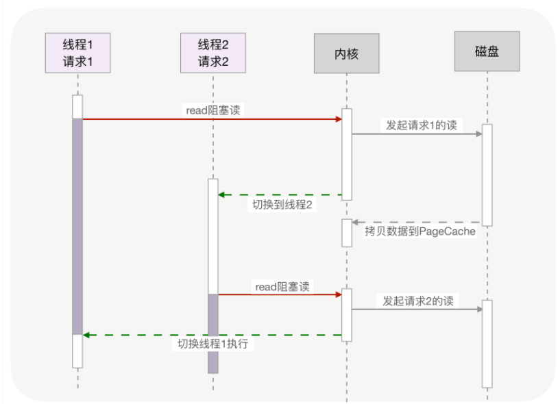
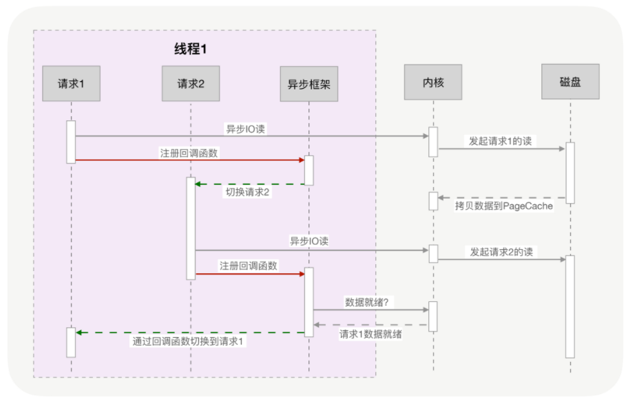

# **第五节 协程快速地实现高并发服务：Coroutine**

如果你需要访问多个服务来完成一个请求的处理，比如实现文件上传功能时，

* 首先访问 Redis 缓存，验证用户是否登陆，
* 再接收 HTTP 消息中的 body 并保存在磁盘上，
* 最后把文件路径等信息写入 MySQL 数据库中

用阻塞 API 写同步代码最简单，但一个线程同一时间只能处理一个请求，有限的线程数导致无法实现万级别的并发连接，过多的线程切换也抢走了 CPU 的时间，从而降低了每秒能够处理的请求数量。

为了达到高并发，可能会选择一个异步框架，用非阻塞 API 把业务逻辑打乱到多个回调函数，通过多路复用实现高并发，然而，由于业务代码过度关注并发细节，需要维护很多中间状态，不但 Bug 率会很高，项目的开发速度也上不去，产品及时上线存在风险。

**如果想兼顾开发效率，又能保证高并发，协程就是最好的选择。它可以在保持异步化运行机制的同时，用同步方式写代码，这在实现高并发的同时，缩短了开发周期，是高性能服务未来的发展方向**。

> 协程就是用户态的线程

## **1、如何通过切换请求实现高并发？**

### **1-1 线程&进程的高并发**

主机上资源有限，一颗 CPU、一块磁盘、一张网卡，如何同时服务上百个请求呢？

多进程模式是最初的解决方案。**内核把 CPU 的执行时间切分成许多时间片（timeslice），比如 1 秒钟可以切分为 100 个 10 毫秒的时间片**，每个时间片再分发给不同的进程，通常，每个进程需要多个时间片才能完成一个请求。

虽然微观上，比如说就这 10 毫秒时间 CPU 只能执行一个进程，但宏观上 1 秒钟执行了 100 个时间片，于是每个时间片所属进程中的请求也得到了执行，**这就实现了请求的并发执行。**

每个进程的内存空间都是独立的，这样用多进程实现并发就有两个缺点：

* 一是内核的**管理成本高**，
* 二是**无法简单地通过内存同步数据，很不方便**。

于是，多线程模式就出现了，**多线程模式通过共享内存地址空间，解决了这两个问题**。

共享地址空间虽然可以方便地共享对象，但这也导致一个问题，**那就是任何一个线程出错时，进程中的所有线程会跟着一起崩溃**。**这也是如 Nginx 等强调稳定性的服务坚持使用多进程模式的原因。**

无论基于多进程还是多线程，都难以实现高并发，这由两个原因所致。

* 首先，单个线程消耗的内存过多，比如，64 位的 Linux 为每个线程的栈分配了 8MB 的内存，还**预分配了 64MB 的内存作为堆内存池** **所以，我们没有足够的内存去开启几万个线程实现并发**。
* 切换请求是内核通过切换线程实现的，什么时候会切换线程呢？
	* 不只时间片用尽，**当调用阻塞方法时，内核为了让 CPU 充分工作，也会切换到其他线程执行。一次上下文切换的成本在几十纳秒到几微秒间，当线程繁忙且数量众多时，这些切换会消耗绝大部分的 CPU 运算能力。**

2 个线程间的切换方式。

### **1-2 怎么才能实现高并发呢？**

**把上图中本来由内核实现的请求切换工作，交由用户态的代码来完成就可以了**。

异步化编程通过应用层代码实现了请求切换，降低了切换成本和内存占用空间。

异步化依赖于 IO 多路复用机制，比如 Linux 的 epoll 或者 Windows 上的 iocp，同时，必须把阻塞方法更改为非阻塞方法，才能避免内核切换带来的巨大消耗。Nginx、Redis 等高性能服务都依赖异步化实现了百万量级的并发。

下图描述了异步 IO 的非阻塞读和异步框架结合后，是如何切换请求的。

**然而，写异步化代码很容易出错**。因为所有阻塞函数，都需要通过非阻塞的系统调用拆分成两个函数

**有没有办法既享受到异步化带来的高并发，又可以使用阻塞函数写同步化代码呢**

**协程可以做到，它在异步化之上包了一层外衣，兼顾了开发效率与运行效率。**

## **2、协程是如何实现高并发的？**

**协程与异步编程相似的地方在于，它们必须使用非阻塞的系统调用与内核交互，把切换请求的权力牢牢掌握在用户态的代码中。**

**但不同的地方在于，协程把异步化中的两段函数，封装为一个阻塞的协程函数。**

这个函数执行时，会使调用它的协程无感知地放弃执行权，由协程框架切换到其他就绪的协程继续执行。当这个函数的结果满足后，协程框架再选择合适的时机，切换回它所在的协程继续执行。

### **2-1 那协程的切换是如何完成的呢？**

**用户态的代码切换协程，与内核切换线程的原理是一样的**

内核通过管理 CPU 的寄存器来切换线程，我们以最重要的栈寄存器和指令寄存器为例，看看协程切换时如何切换程序指令与内存。

**协程就是用户态的线程。**

然而，为了保证所有切换都在用户态进行，协程必须重新封装所有的阻塞系统调用，否则，一旦协程触发了线程切换，会导致这个线程进入休眠状态，进而其上的所有协程都得不到执行。

比如，普通的 sleep 函数会让当前线程休眠，由内核来唤醒线程，而协程化改造后，sleep 只会让当前协程休眠，由协程框架在指定时间后唤醒协程。再比如，线程间的互斥锁是使用信号量实现的，而信号量也会导致线程休眠，协程化改造互斥锁后，同样由框架来协调、同步各协程的执行。

**所以，协程的高性能，建立在切换必须由用户态代码完成之上，这要求协程生态是完整的，要尽量覆盖常见的组件。**

比如 MySQL 官方提供的客户端 SDK，它使用了阻塞 socket 做网络访问，会导致线程休眠，必须用非阻塞 socket 把 SDK 改造为协程函数后，才能在协程中使用。

当然，并不是所有的函数都能用协程改造。比如异步 IO，它虽然是非阻塞的，但无法使用 PageCache，降低了系统吞吐量。如果使用缓存 IO 读文件，在没有命中 PageCache 时是可能发生阻塞的。

### **2-2 面对多核系统，也需要协程与线程配合工作**

实际上，面对多核系统，也需要协程与线程配合工作。**因为协程的载体是线程，而一个线程同一时间只能使用一颗 CPU，所以通过开启更多的线程，将所有协程分布在这些线程中，就能充分使用 CPU 资源。**

**除此之外，为了让协程获得更多的 CPU 时间，还可以设置所在线程的优先级，比如 Linux 下把线程的优先级设置到 `-20`，就可以每次获得更长的时间片。**

CPU 缓存对程序性能的影响，为了减少 CPU 缓存失效的比例，还可以把线程绑定到某个 CPU 上，增加协程执行时命中 CPU 缓存的机率。

## **3、本节小结**

协程融合了多线程与异步化编程的优点，既保证了开发效率，也提升了运行效率。

**有限的硬件资源下，多线程通过微观上时间片的切换，实现了同时服务上百个用户的能力。多线程的开发成本虽然低，但内存消耗大，切换次数过多，无法实现高并发。**

异步编程方式通过非阻塞系统调用和多路复用，把原本属于内核的请求切换能力，放在用户态的代码中执行。**这样，不仅减少了每个请求的内存消耗，也降低了切换请求的成本，最终实现了高并发。然而，异步编程违反了代码的内聚性，还需要业务代码关注并发细节，开发成本很高。**

协程参考内核通过 CPU 寄存器切换线程的方法，在用户态代码中实现了协程的切换，既降低了切换请求的成本，也使得协程中的业务代码不用关注自己何时被挂起，何时被执行。相比异步编程中要维护一堆数据结构表示中间状态，协程直接用代码表示状态，大大提升了开发效率。

在协程中调用的所有 API，都需要做非阻塞的协程化改造。优秀的协程生态下，常用服务都有对应的协程 SDK，方便业务代码使用。开发高并发服务时，与 IO 多路复用结合的协程框架可以与这些 SDK 配合，自动挂起、切换协程，进一步提升开发效率。

协程并不是完全与线程无关，首先线程可以帮助协程充分使用多核 CPU 的计算力，其次，遇到无法协程化、会导致内核切换的阻塞函数，或者计算太密集从而长时间占用 CPU 的任务，还是要放在独立的线程中执行，以防止它影响所有协程的执行。