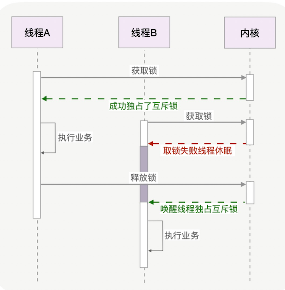
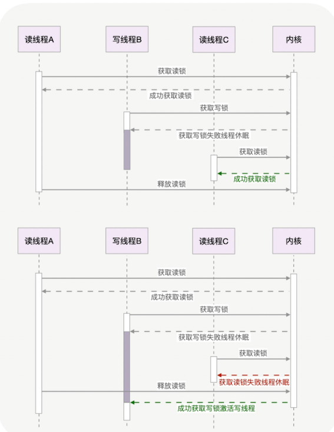

# **第六节 据业务场景选择合适的锁**

## **1、互斥锁与自旋锁：休眠还是“忙等待”？**

常见的各种锁是有层级的，**最底层的两种锁就是互斥锁和自旋锁**，其他锁都是基于它们实现的。

* 互斥锁的加锁成本更高，但它在加锁失败时会释放 CPU 给其他线程；
* 自旋锁则刚好相反。

**<span style="color:red">当你无法判断锁住的代码会执行多久时，应该首选互斥锁，互斥锁是一种独占锁。</span>**

什么意思呢？**当 A 线程取到锁后，互斥锁将被 A 线程独自占有，当 A 没有释放这把锁时，其他线程的取锁代码都会被阻塞。**

### **1-1 阻塞是怎样进行的呢？**

**对于 99% 的线程级互斥锁而言，阻塞都是由操作系统内核实现的（比如 Linux 下它通常由内核提供的信号量实现）。**

**<span style="color:red">当获取锁失败时，内核会将线程置为休眠状态，等到锁被释放后，内核会在合适的时机唤醒线程，而这个线程成功拿到锁后才能继续执行。</span>**

如下图所示：



**互斥锁通过内核帮忙切换线程，简化了业务代码使用锁的难度。**

但是，线程获取锁失败时，增加了两次上下文切换的成本：**从运行中切换为休眠，以及锁释放时从休眠状态切换为运行中。上下文切换耗时在几十纳秒到几微秒之间，或许这段时间比锁住的代码段执行时间还长。而且，线程主动进入休眠是高并发服务无法容忍的行为，这让其他异步请求都无法执行**。


### **1-2 如果能确定被锁住的代码执行时间很短，就应该用自旋锁取代互斥锁**

如果你能确定被锁住的代码执行时间很短，就应该用自旋锁取代互斥锁

### **1-3 自旋锁**

**自旋锁比互斥锁快得多，因为它通过 CPU 提供的 CAS 函数（全称 Compare And Swap），在用户态代码中完成加锁与解锁操作。**

加锁流程包括 2 个步骤：

* 第 1 步查看锁的状态，如果锁是空闲的，
* 第 2 步将锁设置为当前线程持有。

**在没有 CAS 操作前**，多个线程同时执行这 2 个步骤是会出错的。比如线程 A 执行第 1 步发现锁是空闲的，但它在执行第 2 步前，线程 B 也执行了第 1 步，B 也发现锁是空闲的，于是线程 A、B 会同时认为它们获得了锁。


CAS 函数把这 2 个步骤合并为一条硬件级指令。

这样，第 1 步比较锁状态和第 2 步锁变量赋值，将变为不可分割的原子指令。

**于是，设锁为变量 lock，整数 0 表示锁是空闲状态，整数 pid 表示线程 ID，那么 CAS(lock, 0, pid) 就表示自旋锁的加锁操作，CAS(lock, pid, 0) 则表示解锁操作。**

多线程竞争锁的时候，加锁失败的线程会“忙等待”，直到它拿到锁。

什么叫“忙等待”呢？它并不意味着一直执行 CAS 函数，生产级的自旋锁在“忙等待”时，会与 CPU 紧密配合 ，它通过 CPU 提供的 PAUSE 指令，减少循环等待时的耗电量；**对于单核 CPU，忙等待并没有意义，此时它会主动把线程休眠。**

```
while (true) {
  //因为判断lock变量的值比CAS操作更快，所以先判断lock再调用CAS效率更高
  if (lock == 0 &&  CAS(lock, 0, pid) == 1) return;
  
  if (CPU_count > 1 ) { //如果是多核CPU，“忙等待”才有意义
      for (n = 1; n < 2048; n <<= 1) {//pause的时间，应当越来越长
        for (i = 0; i < n; i++) pause();//CPU专为自旋锁设计了pause指令
        if (lock == 0 && CAS(lock, 0, pid)) return;//pause后再尝试获取锁
      }
  }
  sched_yield();//单核CPU，或者长时间不能获取到锁，应主动休眠，让出CPU
}
```

在使用层面上，自旋锁与互斥锁很相似，实现层面上它们又完全不同。

**自旋锁开销少，在多核系统下一般不会主动产生线程切换，很适合在用户态切换请求的编程方式，有助于高并发服务充分利用多颗 CPU。**

但如果被锁住的代码执行时间过长，CPU 资源将被其他线程在“忙等待”中长时间占用。

当取不到锁时，互斥锁用“线程切换”来面对，自旋锁则用“忙等待”来面对。

**这是两种最基本的处理方式，更高级别的锁都会选择其中一种来实现，比如读写锁就既可以基于互斥锁实现，也可以基于自旋锁实现。**

## **2、允许并发持有的读写锁**

**如果你能够明确区分出读和写两种场景，可以选择读写锁。**

### **2-1 读写锁**

读写锁由读锁和写锁两部分构成，仅读取共享资源的代码段用读锁来加锁，会修改资源的代码段则用写锁来加锁。

**读锁**

* **读写锁的优势在于，当写锁未被持有时，多个线程能够并发地持有读锁，这提高了共享资源的使用率。**
* **多个读锁被同时持有时，读线程并不会修改共享资源，所以它们的并发执行不会产生数据错误**。

**写锁**

* 而一旦写锁被持有后，不只读线程必须阻塞在获取读锁的环节，其他获取写锁的写线程也要被阻塞。写锁就像互斥锁和自旋锁一样，**是一种独占锁**；
* **<span style="color:red">而读锁允许并发持有，则是一种共享锁。</span>**

**<span style="color:red">因此，读写锁真正发挥优势的场景，必然是读多写少的场景，否则读锁将很难并发持有。</span>**

**读写倾向**

实际上，读写锁既可以倾向于读线程，又可以倾向于写线程

**前者我们称为读优先锁，后者称为写优先锁。**



**读优先锁并发性更好，但问题也很明显。如果读线程源源不断地获取读锁，写线程将永远获取不到写锁。写优先锁可以保证写线程不会饿死，但如果新的写线程源源不断地到来，读线程也可能被饿死**。

### **2-2 避免读、写线程饿死**

**用队列把请求锁的线程排队，按照先来后到的顺序加锁即可，当然读线程仍然可以并发，只不过不能插队到写线程之前**。Java 中的 ReentrantReadWriteLock 读写锁，就支持这种排队的公平读写锁。

## **3、乐观锁：不使用锁也能同步**

**无论互斥锁、自旋锁还是读写锁，都属于悲观锁。**

### **3-1 悲观锁**

它认为同时修改资源的概率很高，很容易出现冲突，所以访问共享资源前，先加上锁，总体效率会更优。然而，如果并发产生冲突的概率很低，就不必使用悲观锁，而是使用乐观锁。

### **3-2 乐观锁**

就是假定冲突的概率很低，所以它采用的“加锁”方式是，先修改完共享资源，再验证这段时间内有没有发生冲突。

如果没有其他线程在修改资源，那么操作完成。如果发现其他线程已经修改了这个资源，就放弃本次操作。

至于放弃后如何重试，则与业务场景相关，虽然重试的成本很高，但出现冲突的概率足够低的话，还是可以接受的。可见，**乐观锁全程并没有加锁，所以它也叫无锁编程**。

### **3-3 无锁编程中，验证是否发生了冲突是关键**

比如说在线文档。Web 中的在线文档是怎么实现多人编辑的？用户 A 先在浏览器中编辑某个文档，之后用户 B 也打开了相同的页面开始编辑，可是，用户 B 最先编辑完成提交，这一过程用户 A 却不知道。当 A 提交他改完的内容时，A、B 之间的并行修改引发了冲突。

**Web 服务是怎么解决这种冲突的呢？**

它并没有限制用户先拿到锁后才能编辑文档，这既因为冲突的概率非常低，也因为加解锁的代价很高。Web 中的方案是这样的：让用户先改着，但需要浏览器记录下修改前的文档版本号，这通过下载文档时，返回的 HTTP ETag 头部实现。

**<span style="color:red">乐观锁虽然去除了锁操作，但是一旦发生冲突，重试的成本非常高。所以，只有在冲突概率非常低，且加锁成本较高时，才考虑使用乐观锁。</span>**


## **4、本节小结**

互斥锁能够满足各类功能性要求，特别是被锁住的代码执行时间不可控时，它通过内核执行线程切换及时释放了资源，但它的性能消耗最大。需要注意的是，协程的互斥锁实现原理完全不同，它并不与内核打交道，虽然不能跨线程工作，但效率很高。

**如果能够确定被锁住的代码取到锁后很快就能释放，应该使用更高效的自旋锁，它特别适合基于异步编程实现的高并发服务。**

读写锁既可以使用互斥锁实现，也可以使用自旋锁实现，我们应根据场景来选择合适的实现。

当并发访问共享资源，冲突概率非常低的时候，可以选择无锁编程。它在 Web 和数据库中有广泛的应用。然而，一旦冲突概率上升，就不适合使用它，因为它解决冲突的重试成本非常高。

* **<span style="color:red">当你无法判断锁住的代码会执行多久时，应该首选互斥锁，互斥锁是一种独占锁。</span>**
* **<span style="color:red">当获取锁失败时，内核会将线程置为休眠状态，等到锁被释放后，内核会在合适的时机唤醒线程，而这个线程成功拿到锁后才能继续执行。</span>**
* **<span style="color:red">因此，读写锁真正发挥优势的场景，必然是读多写少的场景，否则读锁将很难并发持有。</span>**
* **<span style="color:red">乐观锁虽然去除了锁操作，但是一旦发生冲突，重试的成本非常高。所以，只有在冲突概率非常低，且加锁成本较高时，才考虑使用乐观锁。</span>**