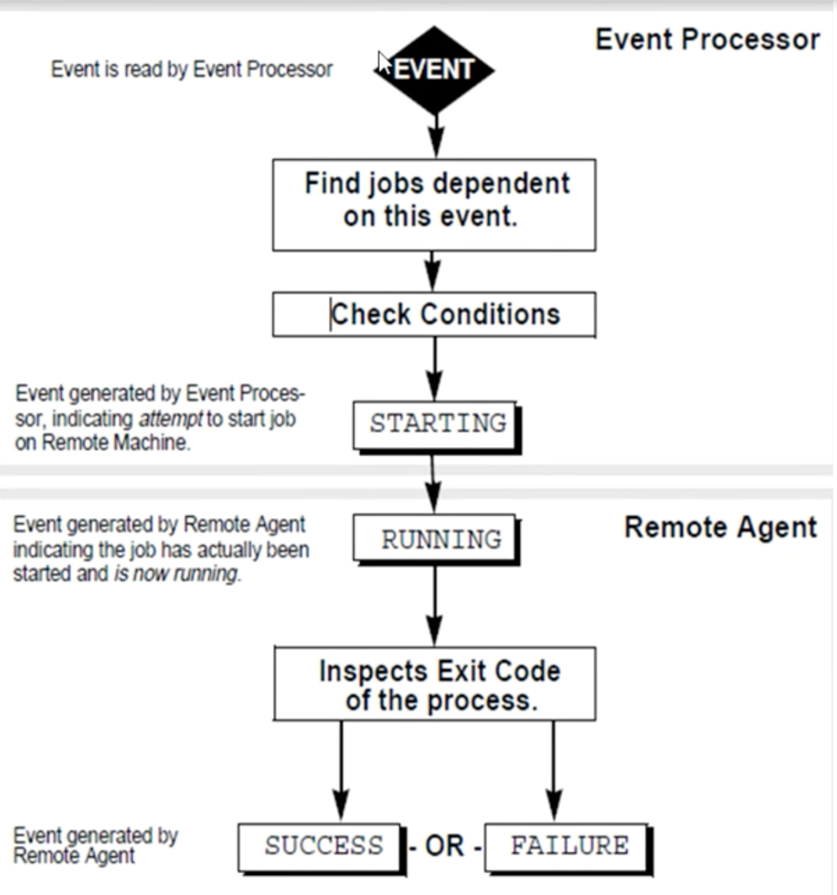

# **1 Autosys Introduction**

## **1 Autosys Introduction**

### **1-1 What is Autosys** 

* Autosys is a **automated job** control system for **monitoring, reporting and scheduling**. 
* A job is any **single command, script, executable file**. 
* Jobs can reside on **any configured machine** that is attached to network. 

###  **1-2 Instance** 

* An **AutoSys instance** is one **licensed version of AutoSys software** running as an **AutoSys server with one or more clients**, on a single machine or on multiple machines. 
* AutoSys instance is defined by the **instance ID** - a capitalized three-letter identifier defined by the **`$AUTOSERV` environment variable**. 
* An instance uses **its own event server** and **event processor** and operates independently of other AutoSys instances 

**Example: ACE**


### **1-3 Components of Autosys** 

There are 3 major component of Autosys. 

* 1) **Event Server**  
* 2) **Scheduler** 
* 3) **Remote agent** 

### **1-4 Events** 

* Autosys is a event driven. 
* Manually events are generated **using the sendevent command**. 


## **2 Why autosys: Event, Sendevent**

### **Why Autosys** 

* To **Automate any process to make business easy** 
* To Reduce manual Intervention 
* To Deliver required results in time 


### **What is an EVENT**

* Event is nothing but an **action taken on a Job**. 
* The action on the job is being performed **using sendevent**. 
* AutoSys is completely event-driven; that is, for a job 


### **SEND EVENT** 

* You can **send events for a variety of purposes**, including 
	* starting or stopping jobs, 
	* Stopping the Event processor, 
	* Putting a job on hold and etc. 


* This command is also used to set global variables or cancel a scheduled event. 
* The event that is sent, **is written to the database**, which the **event processor(Scheduler) is continually polling**. 
	* The event processor(Scheduler) reads and processes the event. 
* To issue a sendevent on a job, you must have execute permission on that job. **Only comments and set global can be sent without regard to permissions**. 

* Sendevent can be performed via two ways 
	* GUI 
	* COMMANDS 

	
## **2 Why autosys: Event, Sendevent**


### **SendEvent via Command** 


```
sendevent -E START_JOB -J <Job name>
# Start the job (job_load)
```

```
sendevent -E FORCE_STARTJOB -J <Job name> 
```

* If you use the sendevent command to send a `FORCE_STARTJOB` event to a job, CA Workload Automation AE immediately starts the job on the machine that is specified in the job definition, regardless of the current load on the machine or the `job_load` value that is set for the job.
	* If you send a `FORCE_STARTJOB` event to a job in `ON_ICE` or `ON_HOLD` status, the job's status does not revert to its previous status when it completes.
	* If you send a `FORCE_STARTJOB` event to a job in RESWAIT status, the `FORCE_STARTJOB` is ignored and the job remains in the **RESWAIT** status.
	* You can remove or alter the resource requirements of the job so the job is no longer in RESWAIT and can be started.


```
sendevent -E KILLJOB -J <job name> 
```

Indicates that the job ends while it is still in the **RUNNING** state. The scheduler issues an alarm when a job is terminated. 


```
sendevent -E DELETEJOB -J <Job name>
```


```
sendevent -E JOB_ON_HOLD -J <Job name> 
sendevent -E JOB_OFF_HOLD -J <Job name> 
sendevent -E JOB_ON_ICE -J <Job name> 
sendevent -E JOB_OFF_ICE -J <Job name> 
```

* <mark>`ON_HOLD`	: **Indicates that the job is on hold and cannot run until you take it off hold**</mark>.
	*  You can place a job in this status only by sending the `JOB_ON_HOLD` event.
	*  To take a job off hold, send the `JOB_OFF_HOLD` event.

* <mark>`ON_ICE`: **Indicates that the job is removed from the job stream but is still defined**</mark>.
	* You can place a job in this status only by sending the `JOB_ON_ICE` event.
	* To return a job that is on ice to the job stream and resume running it, send the
`JOB_OFF_ICE` event.


```
sendevent -E CHANGE_STATUS -s STATUS -J <Job name>
```


When the status of a job with cross-instance dependencies changes, the scheduler sends a `CHANGE_STATUS` event to the remote instance event server while the job in the local instance runs. 

The scheduler also sends an equivalent `CHANGE_STATUS` event to the remote instance for status changes not resulting from a `CHANGE_STATUS` event, specifically status changes resulting from one of the following:

* Unavailable machine load units, resources or agents prevent a job from running and the scheduler change the status of the job.
* The user changes the status by issuing a sendevent command for one of the following events: `JOB_ON_HOLD`, `JOB_OFF_HOLD`, `JOB_ON_ICE`, `JOB_OFF_ICE`, `JOB_ON_NOEXEC`, `JOB_OFF_NOEXEC`.

```
sendevent -E <any event> -c "comment to be displayed"
```

```
sendevent -E SET_GLOABL -G "Global variable=value"
```

## **3 Type of Machines**

### **Objectives** 

* **Types of machines** 
	* Server machine
	* Client Machine 

* **Types of Jobs** 
	* Command Jobs 
	* File Watcher Jobs 
	* Box Jobs 


### **Types Of Machines** 

* Server Machine: 

An Autosys server machine is a machine on which **the scheduler, the event server, and/or both reside**. 

* Client Machine: 

An Autosys client machine is one on which the **remote agent is installed**. This is the machine where the job actually runs 


### **Types Of Jobs** 

**Command Job:** Usually executes a command script or run a program. 

* Run under a user id on remote machine. 
* A single action performed on a validated machine. 
* **Can comprise of only one command to be executed in one job.** 


**File Watcher Job:**  Is a remote process that monitors the **existence and size of a file**. 

* If it detects file - success. 
* It can search only for one file when the job is been defined. 


**Box Job:** 

* Is a **container of jobs which comprises of Command ,File watcher and even box jobs**. 
* It itself performs no action **but it can trigger other jobs to run**. 

## **5 Autosys: Job status, Box Logic**

### **Objectives**

* Autosys Job Status 
* BOX Logic 
* What Happens when BOX Runs 

### **Autosys Job Status**

* Autosys keeps track of the current state, or status , of every job. 
* Here ,are the different status of the job: 
	* INACTIVE(IN) 
	* ACTIVATED(AC) 
	* STARTING(ST) 
	* RUNNING(RU) 
	* SUCCESS(SU) 
	* FAILURE(FA) 
	* TERMINTED(TE) 
	* RESTART(RE) 
	* RESOURCE WAIT(RW) 
	* `ON_HOLD`(OH) 
	* `ON_ICE`(OI) 

	
* ***INACTIVE***: The job has pot vet been processed. Either the job has never been run, or its status was intentionally altered. 
* ***ACTIVATED***: The top-level box that this job is in now in the RUNNING state, but the job itself has not started yet. 
* ***STARTING***: The event processor has initiated the start job procedure with the Remote Agent. 
* ***RUNNING***: The job is ruming. If the job is a box job, this value simply means that jobs within the box may be started. If it is a command or file watcher job, the value means that the process is actually running on the remote machine. 
* ***SUCCESS***: By default, only the exit code "0" is interpreted as "Success". 
* **FAILURE**: By default, any code which is greater than "0" is interpreteLd as " F ilure" . 
* ***TERMINATED***: The job has been terminated while in the Running state i.e if a KILLJOB event has been passed or it can also be terminated if it has exceeded the maximum run time. 
* **RESTART**: The job was unable to start due to hardware or application problems, and has been scheduled to restart. 
* ***SUCCESS***: By default, only the exit code "0" is interpreted as "Success". 
* ***FAILURE***: By default, any code which is greater than "0" is interpreteLd as " **Failure**" . 
* TERMINATED: The job has been terminated while in the Running state i.e if a **KILLJOB** event has been passed or it can also be terminated if it has exceeded the maximum run time. 
* **RESTART**: The job was unable to start due to hardware or application problems, and has been scheduled to restart. 
* **RESOURCE WAIT**: **The job can logically run(that its all starting conditions have been met),but there are not enough machine resources available**. 
* ***`ON_HOLD`***: This job is on hold and will not run until its offholded. 
* ***`ON_ICE`***: This job is removed from all conditions and logic, but is still define to autosys.It will remain ONICE until its officed 


### **BOX LOGIC** 


**Default Box Job Behavior**

* Jobs run only once per box execution. 
* Jobs in a box will start only if the box itself is running. 
* Boxes should be used primarily for jobs with the same starting conditions. 
* As long as any job in a box is running, the box remains in ***RUNNING*** state; the box cannot complete until all jobs have run. 
* By default, a box will return a status ***SUCCESS*** only when all the jobs in the box have run and the status of all the jobs is success. 
* By default, a box will return a status ***FAILURE*** only when all jobs in the box have run and the status of one or more of the jobs is failure.
* Unless otherwise specified, a bo will run indefinitely until it reaches a status ***SUCCESS*** or ***FAILURE*** 
* Changing the state of a box to ***INACTIVE***(through the sendevent command) changes the state of all the jobs in the box to ***INACTIVE***

**What happens when a Box Runs**


* As a box starts running, all the jobs in the box (including sub-boxes )change to status ***ACTIVATED***, meaning they are eligible to run. 

* Then each job is analyzed for additional starting conditions. All jobs with no additional starting conditions are started, without any implied ordering or prioritizing. 

* Jobs with additional starting conditions remain in the  ***ACTIVATED*** state until those additional dependencies have been met. 


## **6 Difference between onhold and onice**

### **Objectives**

* `JOB_ON_HOLD` 
* `JOB_OFF_HOLD` 
* `JOB_ON_ICE` 
* `JOB_OFF_ICE` 
* `DIFF.B/WON HOLD and ON ICE`


### **`JOB_ON_HOLD`**

* Puts the job specified in **`-J` job name** **"On Hold."** When a job is "On Hold," 
	* <mark>**it will not be started, and downstream dependent jobs will not run**</mark>. 
* <mark>A box cannot successfully complete if a job within it is `ON_HOLD`</mark>. 
* <mark>If the job is already ***STARTING*** or ***RUNNING***, You cannot put it `ON_HOLD`</mark>. 

Syntax: 

```
sendevent -E JOB_ON_HOLD -J <Job name> 
```

### **`JOB_OFF_HOLD`**

Takes the jobs specified in -J `job_name` "Off Hold." If the starting conditions are met, the job will be started. 

Syntax: 

```
sendevent -E JOB OFF HOLD -j <Job name> 
```


### **`JOB_ON_ICE`**


* **Prevents the job from running**. 
* The dependencies and run criteria (such as date/time) is not tracked while it's on ice .
 
Syntax: 

```
sendevent -E JOB_ON_ICE -J <Job name> 
```

### **`JOB_OFF_ICE`**


* Takes the job specified in -J `job_name` "Off Ice." 
* The job acts as a brand new when taken off ice. Meaning dependencies need to be **newly satisfied before the job will run again**. 

Syntax: 

```
sendevent -E JOB_OFF_ICE -J <Job name> 
```

### Diff B/W ONHOLD & ONICE

**`ON_HOLD`**

* Putting a job `ON_HOLD` means the **job will not be started and any downstceam dependent jobs will not run**
* When an **"on hold"** job is taken off hold, if its starting **conditions are already met**. it will be scheduled to run, and it will run. 
* **EVENTS** 

```
sendevent -E JOB_ON_HOLD -j jobname -c "tkt #" 
sendevent -E JOB_OFF_HOLD -j jobname -c "tkt #" 

sendevent -E TOB_ON_HOLD -J lock_out -c ma# 1234" 
sendevent -E JOB_OFF_HOLD -J lock_out -c "T1CT#1234" 
```

* **STATUS** 

```
JOB_ON_HOLD ---- OH 
JOB_OFF_HOLD ---- IN (Depends on previous state when onhold) 
```

* A job can not be ***STARTING*** or ***RUNNING*** to have it put "on hold". 


**`ON_ICE`**
 

* Putting a job `ON_ICE` means the job **will not be started and any downstream dependent jobs could run depending on those dependent jobs' start conditions**. 
* When an 'on ice" job is taken "off ice" its starting conditions are already **met it will not start**. 
	* It will not start until its starting conditions reoccur -- **just like a new job** 
* **EVENTS** 

```
sendevent -E JOB_ON_ICE -j jobname -c "tkt #" 
sendevent -E JOB_OFF_ICE -j jobname -c "tkt #" 

sendevent -E TOB_ON_ICE -J lock_out -c ma# 1234" 
sendevent -E JOB_OFF_ICE -J lock_out -c "T1CT#1234" 
```

* **STATUS** 

```
JOB_ON_ICE ---- OI
JOB_OFF_ICE  ---- IN (always) 
```

* A job can not be ***STARTING*** or ***RUNNING*** to have it put "on ice". 


## 7 How to setup future event and cancel event

### Objectives

* **SET FUTURE SEND EVENT** 
* **CANCEL FUTURE SEND EVENT** 


### **How to set future send event**

This is used to schedule an event in the future Date or Time 

Syntax: 


```
sendevent -E JOB_ON_HOLD <JOB NAME> -T "MM/DD/YY YYHH:MM" 
```

**Example**


Put the job on hold at 9:00 a.m., today 

```
sendevent -E JOB_ON_HOLD -J TESTJOB -T "12/11/2016 09:00" 
```


To take the job off hold at 2:00 p.m 

```
sendevent -E JOB_OFF_HOLD -J TESTJOB -T "12/11/2016 14:00" 
```

### How To cancel future send event


This is used **to schedule an event in the future Date or Time** 

Syntax: 

```
sendevent -E <JOB_ON_HOLD> <JOB NAME> -J "MM/DD/YYYY HH:MM" 
```


