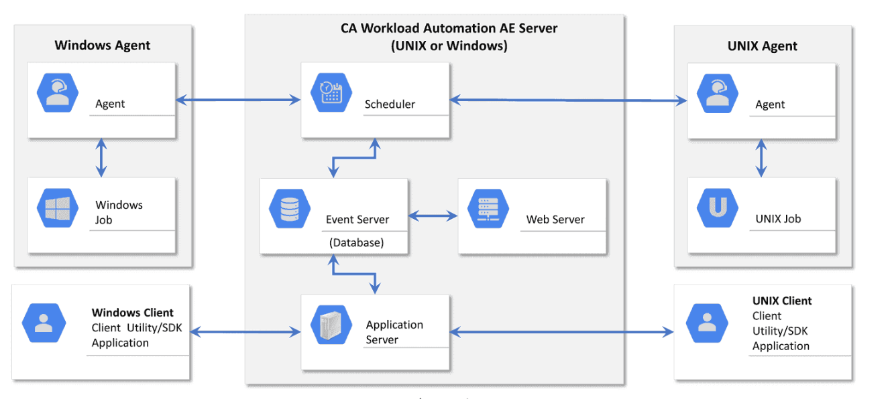
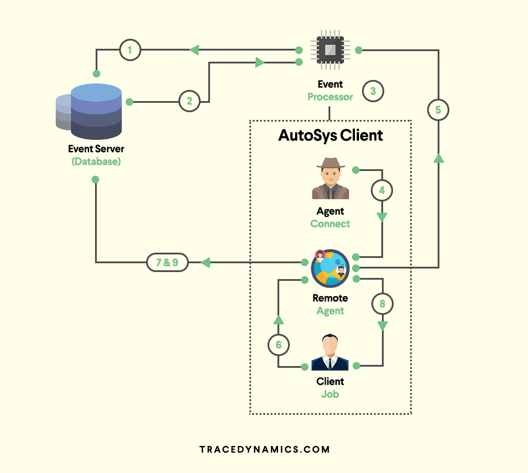
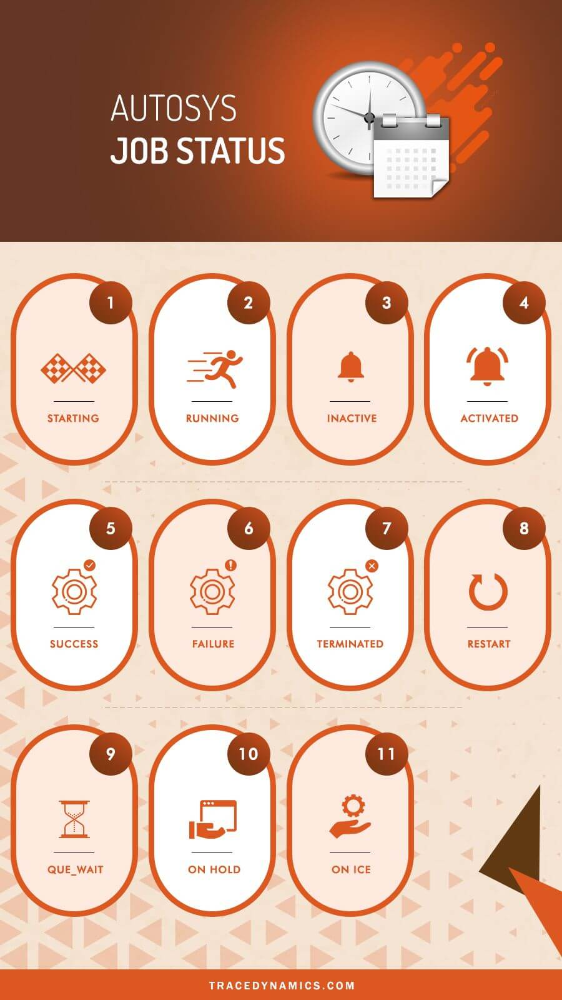

# **1 AutoSys: A Beginner’s Guide AutoSys Workload Automation**

## What is AutoSys?

AutoSys Workload Automation is a multi-platform automated job control system that provides scheduling, monitoring, and reporting of Autoys jobs.

* Autosys server will communicate with the remote AutoSys agent.
* i.e. Installed in the remote machine like Windows/Unix to perform the job operations.


## Autosys AE Architecture



CA Workload Automation AE main components are as follows:

* Event server(database)
* Application server
* Web server
* Scheduler
* Agent
* Client


### How does AutoSys work?

Remote Agent, Event Server, Event Processor are the build blockings.




* **Remote Agent**: The Remote Agent is a process triggered by the event processor to execute a task scheduler on remote machine I.e. on AutoSys client
machine.

* **Event Server (AutoSys Database)**:The Event Server is the repository where job events and autosys job definition stored.

* **Event Processor**:Event Processor is a crucial component, it reads and processes all the events from the autosys database tables(event server).

This process can be a window service or unix and Event Processor will scan the database events continuously.

Majority of the server configurations will be configured by autosys administrator.


### AutoSys Job Types:

Jobs in AutoSys classified into following job type.
Command job

* **Command jobs execute commands**.

An command job is a single command or executable, windows batch file, or unix script/powershell script/shell script(scripting language).

* **File Watcher job:**

The AutoSys file watcher job will watch for the arrival of particular file.

* **Box (box jobs)**:

AutoSys box jobs are containers that consists other jobs

The box job in AutoSys used to control and organize process flow.

> boxes can include another boxes.


### Job Status/States - Infographic

This tool keeps track of the AutoSys status of every job.




The job status used to determine when to start other jobs that are dependent on the job.


The following were the list of job status and their
AutoSys change status behaviours.

* **STARTING** : An event **initiated to the start job procedure with the remote agent**.
* **RUNNING** : Means the job is in running mode. In case if the job is a box job, **this value means that the jobs within the AutoSys box started**.
* **INACTIVE** : Means the job is inactive. The job has been never executed or its status was intentionally marked to turnoff its previous completion status.
* **ACTIVATED** : The top-level box that this job resided now in RUNNING state, but note that job itself has not started yet.
* **SUCCESS**: **The job completed successfully, by default the Exit Code "0" considered as success**. 
	* In case of box job, success status means that all the jobs inside the box has completed successfully.
* **FAILURE : The job failed**, which means the Exit Code-is greater than zero.
* **TERMINATED** : The job terminated while in the running state. **A job terminated when user sends a KILL job event.**
* **RESTART**: The job was unable to start due to application or hardware problems and scheduled to restart.
* **`QUE_WAIT`**: The job ready to run, but there are not enough machine resources available.
* **`ON HOLD`** : The job is ON HOLD and will not run until it receives job **OFF HOLD** event.
* **`ON ICE`** : The job will be ON ICE (AutoSys jobs on ice) until it receives OFF ICE event. In other words, **<mark>ICE job can be ON/OFF</mark>**.

### ON HOLD VS ON ICE?

Its one of the standard AutoSys interview questions.

Here are the details of AutoSys condition which covers **ON ICE to OFF ICE VS ON HOLD to OFF HOLD**.

* When a job is ON HOLD and If the same job has kept OFF HOLD, Its runs in case of job starting conditions met/satisfied. 
* When a job is OFF ICE and If the same Job kept OFF ICE, **Its will not run even though the respective job starting conditions met/satisfied.**
* **<mark>If a job is ON HOLD, The dependent jobs will not run.** 
* Where as If a job is ON ICE, the dependent will A run as per the schedule.

### **Managing File Transfer(FTP/SFTP/SCP) Jobs**

File Transfer jobs allows transferring of, binary, ASCII, EBCDIC files between an agent computer/remote location or FTP server.

File transfer jobs defined as following:

* **FTP**:  Lets you transfer files using File Transfer Protocol(FTP).
* **SFTP**: We can securely transfer binary or ASCII files using the **Secure File Transfer Protocol (SFTP)**.

Also FTP protocol supports wildcard transfers, so you can upload multiple files to a remote FTP server or download multiple files to the agent machine.

* **SCP**: Securely transfer binary files using the Secure Copy Protocol(SCP). Note that SCP protocol doesn't support wildcard transfers.

## What are AutoSys JIL file/scripts?

**JIL stands for Job Information Language.**

JIL file/scripts used to built an job definition via command-line interface.


JIL scripts contain one or more subcommands/attribute statements. 

The following are the jil command syntax for **subcommand** and **attribute**.

* **`sub_command:object_name`**

* `sub_command` -> Defines a JIL sub command.
* `object_name` -> Defines the name of the object (i,e job / machine) to act on.


* **`attribute_keyword:value`**

* `attribute_keyword` -> Defines a valid JIL attribute.
* `value` -> Defines the setting to apply a attribute.


**1.Sample JIL command example for an command job "helloJob.jil"**


```
insert_job :helloJob
machine :unix machine name
owner :username
command :echo "Hello this a welcome command job"
```

**2.To add the command job "`helloJob.jil`" in database(db)**

Run the following autosys unix commands through command prompt.

```
jil < echoJob.jil
```

If you want to read JIL tag and the corresponding job associated with it, can grep the JIL script.

```
grep “hello_job:echo” *.jil | cut -d ‘ ‘ -f2
```

By using above command syntax solution, you can get the job names. 

I.e. via filter options available in Sequential file/script and load using datastage job.


### **AutoSys update job:**

Lets go through update job syntax and each attribute/parameter in detail.

```
update_job: BOX_N
start_times: "18:00"
```

Here `start_times` aceepts **numeric type** of time format. Save into a jil file and run it using jil executable script

**command `jil < filename.jil`**

Example:

```
insert_job: HelloWorld
job_type: c
box_name: box1
command: Datasource/scripts/Autosys/oraclesqlquery/storedprocedure.sh
machine: localhost
owner: admin@localhost
permission: gx,ge,wx,we,mx,me
date_conditions: 1
days_of_week: all
start_times: 0,30]
```


* **`strong>term_run_time: 180`** 

* `alarm_if_fail: 1` Let’s go through each attribute of jil commands from above example
* `insert_job`:  Its a JIL keyword which used as Name to identify a job.
* `job_type`: It defines type of a job and **in this case `C` refers to a Command Job**.
* **command**: This attribute can be any command, UNIX shell script, executable, or batch file. 
* **machine**: The client machine on which the command should run.
 

* **Owner:**

It will be the userID on which the command will be running. For above scenario, I gave autosys admin as owner.

* **permission:**

First letter (g, w,m) combination refers to group user and last letter (x,e) refers to the rights for edit (e) and execute(x).

* **`date_conditions`**:

The AutoSys `date_conditions` which enables the run calendar for the respective job.


* `days_of_week`

Days on which the job should run

* `start_times`

autosys start times, This specifies start time of job that it should trigger/run.


* `term_run_time`

`term_run_time` result in a job status being set to Terminated after specified time. As per example above, it will set the job status to terminated after running 180 minutes.


* `alarmif_fail`

If the value is 1, then you will receive an failure alert and If the value is O, then you will not receive any alert. max run alarm in AutoSys is an classic example for this.

Whenever job runs than the specified time, an max run alarm alert will trigger.

Note: AutoSys `start_mins` leveraged, if a job needs to trigger every minute/minutes.

The following syntax will start the job for every 10 mins. 

* **`start_mins`: 00,10,20,30,40,50**

## AutoSys Commands – Cheat Sheet

* **cron2jil**  To convert from CRON to JIL (only in UNIX)
* **jil**  To define objects like jobs/machines
* **sendevent**  For event commands
* **autoflags / autoping / autosyslog / chk_auto_up / chase**  Check system status
* 	**`autocal_asc`**: To define calendars
* **`archive_jobs/archive_events/clean_files/autotrack/dbspace/dbstatistics/DBMaint`** To maintain Databases
* **autorep/autostatad/autostatus/forecast/monbro**: To report job status
* 	**autosyslog/autorep/monbro**: To monitor jobs
* **`job_depends`**: To report job dependencies and conditions
* 	**`autosys_secure`**: To manage security
* **autotimezone**: To manage time zone	

### `autocal_asc` command :

**`autocal_asc`** used to define AutoSys calendars.

Calendars are very helpful incase of job/box specific events, processed based on a date in a calendar

eg: holiday batch job or batch jobs processing based on the date etc).


**AutoSys condition parameter "date_conditions" related tocalendar concepts.** 

**For a job to run 'standalone'， the 'Date/Time conditions' attribute in the 'Schedule' section must reflect 'true'.**

<mark>If the `date_conditions` field is not set to '1' (true).</mark> , 

AutoSys review ignore 'Days' or 'Time' attributes and rely on dependencies for job scheduling software

**If the ‘Date/Time conditions are ‘true’,**

The job or job box will also reference ‘Run days’, or ‘Run calendar’ and/or ‘Exclude Calendar’;

**and, "Times of day"  or 'Minutes past hour'.**

These job attributes will covered in more details in other sections of autosys documentation.

### CRON2JIL command:

**Cron** is a job scheduler in unix based operating systems.

Used to schedule a job (either command or the scripts that runs at fixed intervals, schedule.

**Cron controlled by a crontab file,** a config file that defines shell commands to run cyclically on a specified schedule.

**cron2jil command is used to convert from CRON to JIL.**

### sendevent command :

The sendevent Autosys command is a component that sends events.

to

* start or stop jobs, 
* stop the AutoSys scheduler, 
* put a job on hold，
* set a AutoSys global variable, 
* cancel a scheduled jobs event 
* and so on.


Basically this command will send event in AutoSys scheduling tool. Following are sample sendevent commands, generally denoted by using sendevent e job name.

To start a job:

```
sendevent -E STARTJOB -J
```

To force start a job : `sendevent -E FORCE_STARTJOB -J`

**AutoSys ON ICE:**

```
sendevent -E ON_ICE -J
```

**Put job OFF ICE :**

```
sendevent -E OFF_ICE -J
```

**AutoSys kill job:**

```
send event -E KILLJOB -J <job name>
```

Event logs verified to check the output, errors.


### Calling an AutoSys job from Unix Script(AutoSys commands in unix):

We can call an AutoSys job via unix executable script, following is an example.

* JobName : SchedulerCommand

* **Custom Script Name: `callJob.ksh`**

* Server: AutoSys Server

In shell script "callJob.ksh" use the below sendevent command to pass the event type and job name.

```
sendevent -E FORCE _STARTJOB -J SchedulerCommand
```

Now save the unix script and invoke it using command `./callJob.ksh` from AutoSys server.

that's it, the job 'SchedulerCommand' will be successfully force started


## autorep Command:

**autorep command** generates reports about jobs, machines, and autosys global variables defined in database.

It pulls data from the database to formulate the reports.

**autorep command used to achieve the following. **

* Displaying the current machine load information.
* Backing up job definitions by extracting definitions and saving them to an output file.
* Displaying a summary of all defined jobs.
* Listing relvant information of any job last run (previous run).

If you want to check the job definition history changes, then you can acieve it using autorep command below

```
autorep -j "mention the job name"
```

Also by using wildcards(%) with autorep command, you export the AutoSys JIL's.

```
autorep -j% -q > /temp/filename.jil
```

* To report on **jobs in a group**: `autorep -B group [-d | -s | -q | -o overnum] [-I application] [-n] [-w] [-t] [-R run_num] [-L print_level]`
* To report on **jobs in an application**: `autorep -I application [-d | -s | -q | -o overnum] [-B group] [-n] [-w] [-t] [-R run_num] [-L print_level]`
* To report on a machine: `autorep -M machine [-p | -q] [-d | -s] [-n] [-w]`
* To report on a user-defined job type: `autorep -Y job_type [-d | -s | -q ] [-n] [-w]`
* To report on global variables: `autorep -G global_name [-n] [-w] [-d | -s]`
* To report on a external instance: `autorep -X ext_instance [-s | -q ] [-n] [-w] [-t]`
* To report on a virtual resource: `autorep -V virtual_resource_name [-d | -s | -q ] [-n] [-w]`
* To display the version number for the command `autorep -x`
* To display help for the command: `autorep -?`


### AutoSys Alarms:

For an instance, jobs could be dependent on a arrival file and if the file not yet arrived in an expected time frame.

* **Then the job fails and then alarm notification alert the respective groups or owners to take appropriate action.**

* Alarms provides notification mechanism during alarming situations like AutoSys job scheduler failures, dependencies.

* Upon these kind of notifications, it will allow manual interventions to address the issue

* Alarms are system specific messages about a detected issue. **Typically alarms sent through system as a event.**


## Best Practices For AutoSys Errors/Exception Handling:

> Exception Handling is one of the key attribute in the software life cycle. 

W.r.t AutoSys, its best practice to have exception handling on failed operator which have exit path for only "retry" scenario. Else having retry without ever exiting the process results in endless loops.

**Error/Err files or log files can found by using following commands.**

**Scheduler Server and Application Server logs: (default)**

```
/opt/CA/WorkloadAutomationAE/autouser.ACE/out
```

**AutoSys WCC logs:**

`(default) /opt/CA/WorkloadCC/log`

**AutoSys agent logs: (default)**

`/opt/CA/WorkloadAutomationAE/SystemAgent/WA_AGENT/log`

### **Exit Codes/Exit Status**

In general, a zero Exit Code- indicates success; while a non zero Exit Code- indicates an error. Following are exit or error codes which are frequently seen.

* Exit Code-1:

Missing System Agent configuration parameter **"oscomponent.cmdprefix.force=true"** and/or the Windows machine definition missing the and/or the Windows machine definition missing the **"opsys: windows" **(JIL) attribute.

* Exit Code-2:

This error is coming from the first line in the job script where the shell was being sourced. The first line read `#!/usr/bin/ksh.`

However, this was an invalid location for setting the shell interpreter which are typically located in /bin and not /usr/bin.

* Exit Code-13:

Due to a permission error on the `std_out_file`.

* Exit Code-15:

The job terminated

* Exit Code-101:

`CHANGE_STATUS` performed on the job. for eg: **The job changed to FAILURE or TERMINATED status**.

* Exit Code-121:

Cannot open `std_in_file`. File does not exist or it is inaccessible

* Exit Code-122:

Cannot open `std_out_file` File does not exist or it is inaccessible.

* Exit Code-123:

Cannot open `std_err_file`. File does not exist or it is inaccessible.

* Exit Code-127:

Directory that holds the executable is not in the command search PATH.

* Exit Code-256:

Unable to execute the command.

* Exit Code-512:

Incorrect command options.

* -656 NO EXIT CODE:

exit code field in database initialized to this.

* -657 `PROCESS_MIA`: Set by a chase-generated FAILURE event.

## **Oracle E-Business Suite Jobs**

Oracle job scheduler definedto run Oraclet-Business Suite workload.

It is illustrated in the following ways.

* Request Set Job : To run multiple programs in oracle application.

* Single Request Job : To run single programs in oracle application.

* Copy Single Request Job: copying the existing Single Request Job and running it under the AutoSys agent.


### Coordination between Hadoop and conventional jobs:


* Seamlessly integrate Hadoop tasks, such as HDFS, PIG, HIVE, SQOOP, and Oozie.
* Gain comprehensive visibility and management capabilities for Hadoop-driven applications through a unified view of workflows spanning the entire IT ecosystem.
* Create Hadoop and other application workflows effortlessly, without the necessity for coding, thanks to an intuitive design interface.
* Empower data scientists to independently execute workload processing without relying on IT specialists through self-service capabilities.

> CA Workload Automation Reviews from subject matter experts posted in itcentralstation.com.

## Interview FAQ


* **What is AutoSys?**

AutoSys Workload Automation is a multi-platform automated job control system that provides scheduling, monitoring, and reporting of AutoSys jobs.

* What is global name in AutoSys batch scheduling tool?

To report on global variables, use below command

`autorep -G global_name [-n] [-w] [-d | -s]`


* **What are all the Autosys job status?**

STARTING, RUNNING, INACTIVE, ACTIVATED, SUCCESS, FAILURE, TERMINATED, RESTART, `QUE_WAIT`, `ON HOLD`, `ON ICE`

* **What is AutoSys JIL file?**

JIL stands for Job Information Language.

* **How to create an AutoSys Job?**

There are two ways to create an AutoSys job definition.

1) Using AutoSys GUI(AutoSys Graphical User Interface).

2) Using Job Information Language (JIL) via command-line interface.

* **What is file watcher in AutoSys?**

File watcher job will watch for the arrival of specific file defined.

* **How to check the job definition history changes in AutoSys?**

By running command "autorep -j"  where -j refers to job name.

* **How to mark job as success in AutoSys?**

1) Login to autosys wec client url.

2) Locate the job you want to mark it as success.

3)Click on send event and select 'mark as success' from the drop-down list, then the job marked as success.

You can perform the same through "send event" command in server command line

* **How to run Python script in Autosys?**

Define the python script as command like "/usr/bin/python" and then pass the script as 'Argument".

* **What is global name in AutoSys batch scheduling tool?**

To report on global variables, use below command

```
autorep -G global_name [-n] [-w] [-d|-s]
```

* **How to mark job as success in AutoSys?**


* 1)Login to autosys wcc client url.
* 2)Locate the job you want to mark it as success.
* 3)Click on send event and select ‘mark as success’ from the drop-down list, then the job marked as success.

You can perform the same through “send event” command in server command line.