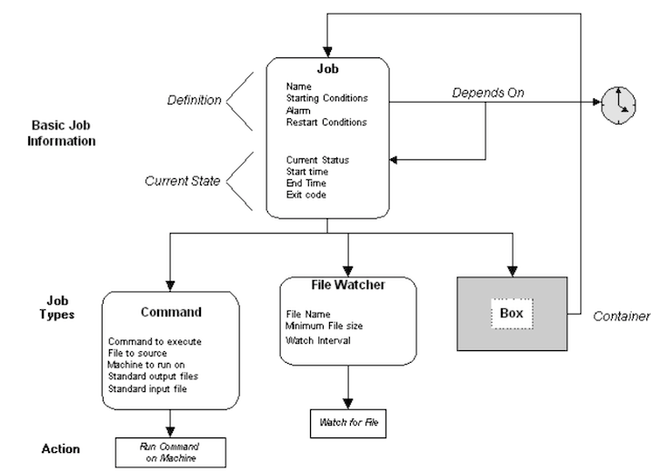

# **2 Autosys JIL**

## **Autosys JIL, Essential, General & Options Attributes**

### **Objectives**

* JIL 
* Essential Attributes 
* General Attributes 
* Optional Attributes 


### **What is an Autosys Job?**

A single action performed on a validated machine which can be a command or executable script or NT batch file. 


Autosys jobs can be defined using **GUI** or **JIL** which contains **a set of qualifying attributes, conditions** specifying when and where a job should be run. 

**Two methods to define Autosys Jobs：** 

* Using Autosys **GUI**. 
* Using Job Information Language(**JIL**). 


### **JIL (Job information language)**

JIL is a language that has its own syntax to describe when, and where and how a job should be run. 

**Example:**

```
/*************MY_JOB_1**********/ 
insert_job: MY_JOB_1 job_type: c 
command: /full-path-of-/clean.sh <dirname> 
machine: machabcWind 
owner: sugnan 
start_times: 00:10 
permission: wx,mx,we,me 
description: "Job to clean the <dirname>" 
job_terminator: 1 
alarm_if_fail: 0
```

* **Essential attributes** 
	* `insert_job`(job name) 
	* `job_type` 
	* owner 
	* Machine 


* **General attributes** 
	* Description 
	* `max_run_alarm` 
	* `min_run_alarm` 
	* `alarm_if_fail` 
	* `std_out_file` 
	* `std_err_file` 
	* `watch_file:` 
	* `watch_interval` 
	* `watch_file_min_size` 
	* command 
	* `box_name` 
	* `job_terminator` 
	* `box_terminator` 


* **Optional attributes**

	* `date_conditions` 
	* `Start_times/start_min` 
	* `days_of_week` 
	* `Condition` 
	* `run_calendar` 
	* `exclude_calendar` 
	* `term_run_time` 
	* `n_retrys` 
	* `run_window` 
	* `job_load` 
	* **Priority** 


## **2 Jobs Attributes in details**

* Essential Attributes 
* General Attributes 


### **Essential Jobs Attributes**

* **`insert_job`**: The job name is used to identify the job, and must be unqiue. It can be from 1 to 30 alphanumetic characters. **Command, file watcher, and box jobs cannot use the same name**

	* `insert_job: PC_JOB1`


* `job_type`: The job type specifies the type of job: command (c), file watcher(f) or box(b). 
	* `job_type: c or f or b`

* **owner**: The job owner specifies whose user ID the command will be run under on the client Machine. 
	* `owner: root`	

* **machine**: This attribute specifies the client machine on which the command should be run. 
	* `Machine: server1` 


## **General Job attributes** 

**command** : command is any single unix command, Shell Script or a NT batch file

`Example : command : ls -1`


**description**: This attribute provides a comment field, used for documentation purposes only. 

`Example: description: "Run every day to zip ARCH files in serverl"`

 
* **`max_run_alarm`**: **A maximum runtime can be specified for a job**. If a maximum runtime is specified, the job should not take longer than the specified time to finish. 

* **`min_run_alarm`**: A minimum runtime (in minutes) can be specified for it job; the job should not end in less than the specified time. 


* **`alarm_if_fail`**: Send ALARM if this Job Fails 
* **`std_out_file`**: The standard output file can be redirected to any file on the client machine to which the job owner has write permission 
* **`std_err_file`**: The standard error file can be redirected to any file on the client machine to which the job owner has write permission. 
* **`watch_file`**: This attribute specifies the name of the file to watch for 
* **`watch_interval`**: The watch interval specifies (in seconds) how often the File Watcher should check the current file size to ascertain whether data is still being written to the file. **The default is every 60 seconds**. 
* **`watch_file_min_size`**: The watch file minimum size determines when enough data has been written to the file to consider it "complete." This attribute is specified in bytes. 
* **`job_terminator`**: This attribute specifies whether or not the job should be terminated if the box it is in fails or terminates. 


### **Optional attributes** 

* `date_conditions`: The start date/time dependencies attribute is a toggle, which specifies whether or not there is date, time, or both, conditions required for starting the job If the attribute **is set to "no"**, the remainder of the related date/ time attributes, will be ignored 
* **`days_of_week`**:The days of the week attribute specifies the days on which the job should be run. You can specify one or more days, **or "all" for every day** 
* **`start_times`**: This attribute **specifies one or more specific times of day when the job should be Started** 

**Example:** 

```
insert_job: job1 job_type: c 
machine: server1 
owner: oracle 
permission: mx,me 
date_conditions: 1 
days_of_week: all 
start_times: "5:00" 
```


**`start_mins`**: **One or more specific times per hour when the of should be started can be specified**. Each time is specified in minutes past the hour 

**Example**: 

```
insert_job: job2 job_type: C
Command: rm -rf *txt 
machine: server1 
owner: oracle 
permission: mx,me 
date_conditions: 1 
days_of_week: all 
start_mines: 0,15,30,45 
description: "Remove .txt files" 
```

* **condition**: **This attribute specifies the Starting Condition required for a job**. Any number of job dependencies can be specified which include successtul completion of a job, failure of a job, a job's exit code, and the value of a global variable. Various combinations of conditions may also he specified 
* `n_retrys`: **This attribute specifies how many times, it any, the job should be restarted after exiting with a FAILURE status**. 
	* The default is 0, which means the job will not be automatically restarted after an application failure. This attribute applies to application failures not **to system or network failures** 
* **`term_run_time`**: A maximum rtmtime (in minutes) can be specified for a job; the job should not take longer than the specified time to finish. This feature allows the job to be automatically terminated it it runs longer than the allotted thee. 
* **run_window**`: This attribute specifies a time range ( or time window) during which a job can be started. 
* **`run_calendar`: The days on which a job should be run can be specified by way of a custom canlendar, rather than through a list of days of the week.** 
* **`exclude_calendar`**: The days on which a job should not lie run can be specified by way of a custom calendar. 


## **JIL Subcommands**


JIL subcommands lets you define and modify asset definitions. You specify JIL subcommands using the jil command.

The following JIL subcommands define and modify jobs and boxes:

* `delete_box`

Deletes an existing box job and all the jobs in that box from the database.

* `delete_job`

Deletes a job from the database. If the specified job is a box job, the box job is deleted and the jobs in the box become stand-alone jobs.

* `insert_job`

Adds a new job definition to the database.

* `override_job`

Defines a one-time override for an existing job definition. This override affects the job for the next run only.

* `update_job`

Updates an existing job definition in the database.
The following JIL subcommands define and modify machines:

* `delete_machine`

Deletes an existing real or virtual machine definition from the database.

* `insert_machine`

Insert a new real or virtual machine definition in the database. A machine must be defined before it can be used in a job definition.

* `update_machine`

Updates an existing machine in the database.

The following JIL subcommands define and modify monitor or report definitions:

* `delete_monbro`

Deletes the specified monitor or report definition from the database.

* `insert_monbro`

Adds a new monitor or report definition to the database.

* `update_monbro`

Updates an existing monitor or report definition in the database.

The following JIL subcommands define and modify job types:

* `delete_job_type`

Verifies that no jobs are currently defined with the specified job type, then deletes the specified job type definition from the database.

* `insert_job_type`

Adds a new user-defined job type definition to the database. This is the only way to create a user-defined job type.

* `update_job_type`

Updates an existing user-defined job type definition in the database. You can use `update_job_type` to change the values of the command and description attributes.

The following JIL subcommands define and modify blobs and globs:

* `insert_blob`

Adds a new blob definition associated with an existing job.

* `insert_glob`
Adds a new glob definition referenced by a given name.

* `delete_blob`
Decouples a blob definition from an existing job and deletes the blob from the database.

* `delete_glob`
Deletes the specified glob definition from the database.
The following JIL subcommands define and modify external instances:

* `delete_xinst`

Deletes the specified external instance definition from the database.

* `insert_xinst`

Adds a new external instance definition to the database.

* `update_xinst`

Updates an existing external instance definition in the database.

**The following JIL subcommands define and modify resources:**

* `delete_resource`

Deletes a virtual resource from the database.

* `insert_resource`

Adds a new virtual resource definition to the database.
JIL Subcommands

**Example JIL Script**

```
# Example of a Machine insert_machine: lowgate type: a
# Example of Jobs insert_job: Nightly_Download job_type: box date_conditions: yes days_of_week: all start_times: "02:00" insert_job: Watch_4_file job_type: ft
box_name: Nightly_Download
watch_file: /DOWNLOAD/MAINFRAME/SALES.RAW watch_file_type: generate
machine: lowgate
insert_job: filter_data
job_type: cmd
box_name: Nightly_Download
condition: success(Watch_4_file)
command: filter_mainframe_info
machine: lowgate
std_in_file: /DOWNLOAD/MAINFRAME/SALES.RAW
insert_job: parse_data 
job_type: cmd
box_name: Nightly_Download c
ondition: success(filter_data) 
machine: lowgate
command: isql -U mutt -P jeff
std_in_file: /DOWNLOAD/MAINFRAME/SALES.SQL std_out_file: /LOG/parse_data.out 
std_err_file: /LOG/LOG/parse_data.err
```


## **3 JIL Job Type Definitions**

When you create a job definition, you must specify the job type. 

Job types define the type of work to be scheduled. 

For example, 

* You can create a CMD job to run a Windows command, 
* An FTP job to download a file from a server, 
* An SAPEM job to monitor for the triggering of an SAP event. 
* You can also define box jobs, which are containers that hold other jobs or box jobs. **You can define your own job type**.

Each job type has required and optional attributes that define the job. 

The job types have many common attributes and CA Workload Automation AE treats them all similarly. 

The primary differences between them are the actions taken when the jobs run.


The structure of a job depends on the job type. For example, the following illustration shows the structure of a Command, File Watcher, and Box job:



### **Insert a Job Definition**

Sometimes the job that you need to run does not have a definition stored in the database

Follow these steps:

* Do one of the following:
	* **Issue JIL in interactive mode**.
	* **Open a JIL script in a text editor**.

* Specify the following definition:

```
insert_job: job_name 
machine: machine_name 
job_type: type 
required_attribute: value 
[attribute: value...]
```

* **`job_name`** Defines a unique name for the job.
* **`machine_name`** Specifies the name of the machine on which the job runs.
* **type** Specifies the type of job you are defining.
* **`required_attribute: value`**   (Optional) Specifies that name of an optional JIL attribute and the corresponding value. The optional attributes that you can specify in a job definition depend on the type of job that you are defining.
* **value**  Defines the value of the corresponding attribute.

Do one of the following:

* Enter exit if you are using interactive mode.
* Redirect the script to the jil command if you are using a script. 


The data is loaded into the database and the job is defined.

**Example: Define a Command Job**


This example runs the `/bin/touc`h command on the file named `/tmp/test_run.out`. The job runs on the UNIX client computer named unixagent.


```
insert_job: test_run
job_type: CMD /* This attribute is optional for Command jobs. CMD is the default. */ machine: unixagent
command: /bin/touch /tmp/test_run.out
```

### **Update a Job Definition**

Sometimes you must modify an existing job definition. For example, you must edit the definition of a reporting job to comply with new reporting requirements. To modify the definition, use the `update_job` subcommand.

```
update_job: job_name 
attribute: value 
[attribute: value...]
```


### **Defining Jobs to Run on a Cluster**

Defining jobs to run on a cluster helps improve workload performance. We recommend this method for the following types of jobs:

* Jobs that use shared resources
* Jobs with high CPU consumption
* Command jobs that execute client utilities

### **Delete a Job**

When you no longer need a job definition, you can delete it from the database.


Specify the following subcommand:

```
delete_job: job_name
```

`job_name`: 

This example deletes the `test_run` job.

```
delete_job: test_run
``` 

**Running a Job After Using JIL**

After you submit a job definition to the database, it runs according to the starting parameters specified in its JIL script. 

Example: Run a Job with the sendevent Command

This example assumes that a job named `test_install` has no starting parameters specified in its JIL script. The only way to start it is to issue the following command:

```
sendevent -E STARTJOB -J test_install
```

This command tells the scheduler to start the job named test_install.
