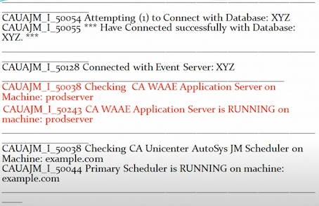

# **3 Autosys Components, Configuration & Validation**

## **CA Worlad Automation AE Components**

### CA Workload Automation AE Components 

* **Event server (database)**
* Application server 
* Web server 
* Scheduler 
* Agent 
* Client 

Event Server 

### Dual Event Server 

Dual event server is nothing but having two events servers like we can configure see a workload automation AE instance to run using Servers and this configuration is called dual event server.

Two servers are **synchronized** to maintain identical data and this data is use when one event server is down 


### **Application Server** : 

The application server acts as the communication interface between the **event server and the client utilities**. 

It receives requests from the client utilities, queries the event server, and returns the responses to the client utilities. 


### **Scheduler** : 

When you start the scheduler, it **continually scans the database for events to process**. 

**High Avaialability**

* **Agent**
	* agentwill allow us to automate monitor and manage workload on different operating environments 

* **Client** 
	* It will include command-line interfaces such as jil job information language auto 
* **Web Server** 
	* 	Web server is used to host the web services

## **2 Checking Autosys System Configuration**

**autoflags** 

**autoflags**: Prints **information** about AutoSys and the system configuration. 

### `options: -`

* `-a`:  Displays **all** autoflags information to standard output. 
* `-i` Displays the AutoSys **tape ID number** to standard output. 
* `-o` Displays the **operating system** to standard output. 
* `-d` Displays the **database type** to standard output, either SYB for Sybase or ORA for Oracle. 
* `-v` Displays theAutoSys version number to standard output. 
* `-r` Displays theAutoSys **release** number to standard output. 
* `-h` Displays the **`host-id`** to standard output to standard output. 
* `-n` Displays the **`host-name`** to standard output to standard output. 

**Example**

**autoflags -a**


```
3 AIX SYB 11.3.6 1 coae38prodserver 
```

### **How to check whether the Autosys is up or down** 


**`chk_auto_up`**

* This command Verifies status of the Unicenter AutoSys JM Scheduler and database. 
* It determines if the **Event Server (database) and the scheduler are running**. 
	* This is the utility you can use for debugging of Autosys 


**`chk_auto_up -r 111`** 

Command gives Event server, Scheduler and Application server status as well. 




## **3 `chk_files` Attribute**

**Verify File Space Required to Start a job**


* `chk_files` attribute
* Unix file system
* Windows drive
* Alarm
* `n_retrys`
* MaxRestartTrys
* Default size in KB
* Sizes B.KB.G.M


### **Example on unix machine**


```
insert job: job_unix_chk 
job_type: CMD
machine: agentunix
```

**command:** 

```
autorep -m agentunix

chk files: /tmp 100 /home 120
```

### **Example on windows server**

```
insert_job: job_win_chk 
job_type: CMD
machine: agentwin
```

```
command: "C:\Programs\powershel.ps1"
chk_files: "C:110  D:100"
```