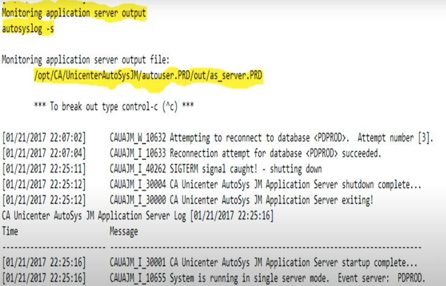
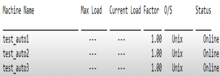
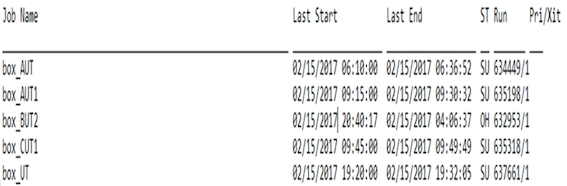
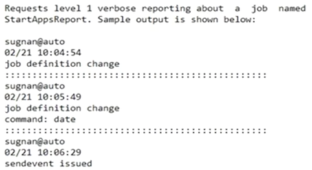

# **4 Austosys command**

* autoping
* autostatus
* autosyslog
* `as_server`
* astail
* autorep

## **1 autoping Command ---- Verify Server, Agent, and Client Communication**

### **autoping** 

* Unicenter AutoSys JM Autoping Utility
* USAGE: **`autoping [-m Machine | All][-A][-D][-x][-?]`**

WHERE: 

* `-m` Machine | ALL Machine name to ping, or ALL for ALL machines 
* `-D`: Checks the Database connections from Application Server 
* `-A` Sends an ALARM if there are problems 
* `-x` Returns version information 
* `-?` Help 


## **2 autostatus Command - Report Job Status or Global Varibale Value** 

The autostatus command is a client component utility that reports the current status of the specified job or the current value of a global variable to standard output

```
unicenter AutoSys JM Autostatus utility 

USAGE: autostatus [-J Jobname | -G GlobalName] [-S AUTOSERV] [-x] [-?] 

WHERE: 

-J jobname Displays status of the Job 
-G globalname Displays Global variable's value 
-S instance AutoSys instance to be queried for -J or -G options 
-x 			Returns version information 
-?       Help 
```

* Example: Check the Status of a Job on the Current Instance 
* This example checks the current status of the job test install on the current instance. 
	* `autostatus -J test_job` 
* The command writes the result to standard output. For example: **SUCCESS** 


**Example:** 

* Check the Value of a Global Variable 
* This example checks the value of a global variable named "**Today**". 
	* `autostatus -G today` 
* The command writes the result to standard output. For example:  **`01/21/2017 `**

## **3 autosyslog for Event scheduler, Application Server, and log file for Job**

The **autosyslog** command is a client component utility that displays the **scheduler, application server, agent log file, or spool file for a job**. 


```
Autosys Command - autosyslog 

unicenter Autosys Jm log utility 

USAGE: autosyslog [-e | -s | -j Job_Name][-p][-?] 

WHERE -e [monitor (tail -f) the event scheduler output file.]
	 -s [monitor (tail -f) the application server output file.]
	 -j job_name [inspect the latest remote agent output file for job_name] 
	 -p Include the output from the environment if available (RemoteProFile) 
	 -? Help 
```

**`autosyslog  -e`**: scheduler


**`autosyslog  -s`**: application server



### **Application Server Log File** 

**Path** 

**`/opt/CA/UnicenterAutosysJM/autouser.PRD/out/as_server.PRD`**


## **4 `as_server` Command Run the Application Server** 

`as_server` - Runs the Unicenter AutoSys Job Management(JM) Application Server 

* **SYNOPSIS** 

**`as_server -A autoserv`**
 
* **DESCRIPTION** 

Runs the Unicenter AutoSys JM Application Server for a specific instance.

 
* **OPTIONS** 

**`-A autoserv`: Specifies the instance for which to start the Application Server.**

**EXAMPLES** 

**`as server -A ACE`** 

Start the Unicenter AutoSys JM Application Server for the instance ACE. 

## **5 astail Command—Display End of File**

**Valid on UNIX** 

**The astail command displays the last 10 lines of the file specified in the command** 

**Syntax** 

This command has the following format: 

```
astail [-f filename] [-x] 
```

**`-f filename`**


* `-f` filename: (optional) Defines the name of the file to display. 
* `-x` (Optional) Returns the version number of the astail command to standard output. 

Note: To terminate the command, press `Ctrl+C`. 

**Example: Display the Last 10 Lines of the Scheduler Log File** 
 
This example displays the last 10 lines of the scheduler log file where `instance_name` is the unique `3-character` identifier chosen for this installation. 

```
astail -f $AUTOUSER/out/event_demon.instance_name 
```

## **6 autorep Command—Report job, Machine, and Variable Information**

The autorep command is a client component utility that generates reports about objects such as **jobs, machines, and global variables currently defined in the database**. 

The autorep command retrieves data from the database to formulate the reports 

* Display a **summary** of all currently defined jobs 
* Display **current machine load information** 
* List all **relevant event information** for the last run of any job or for a specified job run 
* Back up job **definitions by extracting definitions** and **saving them to an output file** 

```
USAGE: autorep [-J JobName] [-d | -s | -q | -o OverRide # -a | -w ]
 		[-B GroupName] [-I ApplicationName] [-t] 
 		[-X ExternalInstanceName] [-Y JobType] [-x]
 		[-R Run_num] [-L PrintLevel] [-N Retry] 
 		[-z GlobalBlobName] [-f BlobDownloadDirectory] 
 		[-G GlobalName] [-M MachineName] [-D DataSource] [-?] 
 		
WHERE: -J JobName 
       -I ApplicationName 
       -B GroupName 
       -o Overnum 
       -X ExternalInstance 
       -Y JobType 
       -z GlobalBlobName 
       -G GlobalName 
       -M MachineName 
       -d Generates a detail report
       -s Generates a summary report 
       -q Generates a query report(Jil format)
       -w Reports untruncated job name and machine name and uses the long form of job conditions 
       -t Includes the timezone in the report
       -R Run_num  Generates the report for the job run
       -L PrintLevel Generated Box Job hierarchy report will be limited to level specified
       -N Retry Attempts to connect to the database for number of times before generating an error 
       -D DataSource Generates report from specified DataSource
       -f BlobDownloadDirectory Location on disk where blob data is downloaded to
       -a Download blob data to file as ASCII text
       -x Returns version information 
       -?  Help 
```


**Examples** 

View Machines 

```
autorep -M All 
```



**View Global Variables** 

```
autorep -G %AUT%
```


**Backup Global Variables** 

```
autorep -G ALL > DUMP_GLOBAL_ALL
```

**Backup ALL JIL's** 

```
autorep -J ALL -q > DUMP_JOBDEFINITION_ALL 
```

**First level reporting** 

```
autorep -w -J All -L0 
```


**Example** 

```
autorep -w -J %UT% -L0 | sort
```



**Second Level reporting** 

```
autorep -J ALL -L1
``` 

**Detail info about the job execution** 

```
autorep -w -J box_AUT_daily_batch -d
``` 

**What is currently running** 

```
autorep -d -m ALL
``` 

* `-d` Generates a detail report
* `-M` MachineName 

**Job Status** 

```
autorep -J <box/job>
```

**Job Definition** 

```
autorep -J <box/job> -q
```


## **autotrack Command - Tracks Changes to the Database**

 
* **autotrack can flack changes made to job definitions from JIL or the GUI**. 
* **It cannot track changes made directly to the database through SQL commands**. 


**autotrack** 

Tracks changes to the Unicenter AutoSys Job Management (JM) database 


**USAGE** 

```
autotrack [-D data_source] [-F "from_time"] [-h] 
				[-J job_name|All] [-l] [-m machine] 
				[-t type] [-T "to_time"] [-u level] 
				[-U user_name] [-v] 
```


**`-u level`**

**Updates the level of detail that autotrack writes to the database. Set level to one of following**

* O The default setting, and detail. 
* 1 Tracks the following and condenses each tracked event to a one-line summary: 
	* Job, calendar, monitor, browser, and machine 
definition changes
	* Job overrides
	* `autosys_secure`, `autotrack`,  and `sendevent calls`
* Tracks the same information as level 1, but also writes the entire job definition for overrides and job definition changes. 
	* Level 2 is very database intensive and will significantly impair JIL per-formance

	
**`-U user_name`**

Reports changes or events initiated by the specified user. 


**`-m machine`** 

Reports changes or events initiated from the specified machine. 


**`-J job_name`**

**Identifies the job on which to report**. 

* To report on all jobs, enter `-J` All. 
* You can use the percent (%) and underscore (`_`) characters as wildcards in this value. 
* The SQL ESCAPE option is not supported for wildcards. 


**`-t type`** 

Reports a specific event. Set type to one of the following: 

* **A** Reports calls generated by the autosys_secure command. 
* **B** Reports Monitor/Browser definition changes generated by JIl or the GUI. 
* **C** Reports calendar definition changes generated BY the `autocal_asc` command or the GUI. 
* **J** Reports job definition changes, `sendevent -J`,  or overrides to a specific job generated by JIL or the GUI. 
* **M** Reports **machine** definition changes generated by JIL or the GUI. 
* **O** Reports **override** definition changes generated by JIL or the GUI. 


### **Examples**

```
autotrack -u 1 -J StartAppReport -v
```



```
autotrack u -2 -3 StartAppsReport -v 

Requests level 2 verbose reporting about a job named StartAppsReport. 
```

```
autotrack -F "02/12/2017 01:00" -J StartAppsReport 

View all the changes that occurred to the job NightlyReport after 1 a.m. on February 12, 2017. 
```

```
autotrack -U sugnan -F "02/16/2017 01:00" -T "02/17/2004 23:59"
``` 

View all changes made by user sue over the weekend of 
February 16 and 17, 2017. 

```
autotrack -t A -m testmachine
```
 
View all `autosys_secure` changes that occurred from the machine gemini. The output from this command would resemble the following: 

```
jacob@testmachine 
02/0S 19:08:12 
auto_sysesecure change 
EDIT Super-User: jacob 
EXEC Super-User: jacob 
password: ***************
```

**Notes:**

**Only the EXEC or EDIT superuser can change the tracking level**. 

## **7 forecast Command一Report Job Flow**

The forecast report displays day-based jobs and event-based jobs expected to **occur during a specified time frame of any length** 

### **Syntax** 

* This command has the following formats: 

```
forecast {-M machine_name | -J job_name | -M machine_name -J job_name | -F {"mm/dd/yyyy HH:MM | mm/dd/yyyy HH:MM-mm/dd/yyyy HH:MM)[-T "mm/dd/yyyy HH:MM"][OPTIONS] 
```

* **`-s`** (Optional) **Sorts the data by job names and start times**. 
* **`-h`** (Optional) **Generates a report without header information**. 
* **`-n`** (Optional) **Generates a report in narrow format**. 


**the forecast command considers a the following job attributes:**

* `-start_mins` 
* `-start_times` 
* `-run_windows` 
* `-run_calendar` 
* `-exclude_calendar` 
* `-days_of_week`


forecast command ignores **global variables, job overrides, cross-instance dependencies, DST changes, and the timezone attribute associated with a job**. 

The forecast report is based on the local time zone. 

**Examples** 


**`forecast -m machinetest -F "05/27/2017"`**

report forecasts when each job runs between `00:00` on 

**`May 27, 2017 and 23:59 on May 27, 2017`**

## **3 chase Command Verify Job STARTING or RUNNING Status** 

**Verifies the status of jobs that the database indicates are running and checks the associated agents**. 

The database is also inspected to determine which jobs are in the **STARTING** or **RUNNING** state, and on which machine. 

For each client, **chase passes a list of jobs that are supposed to be running there to an agent**. 

The agent then verifies that the processes are running. 

For Command jobs running on a UNIX machine, the agent also checks for the pid of the UNIX process. 

When verifying that the agent is running, chase checks that the agent has a lock on the agent log file. This is more reliable than checking the **agent process ID**. 


**When the scheduler is started (with the eventor command), chase is automatically invoked**. 


<mark>**Because chase uses the same mechanism as the scheduler to communicate with the agent machines, it gives an accurate picture of the system state**</mark>. 

> Note: The scheduler **does not have to be running** while chase runs, **but the database must be available**. 

**When chase detects errors, the client sends them to 
standard output.** 

Optional parameters used with chase further determine the actions to take for error conditions. 

* The `-A` option sends an alarm to alert the user that problems were found. 
* When the `-E` option is specified, chase forces a **FAILURE** of jobs that should be running but are not.
* When the **`n_retrys`** attribute is defined, this triggers an **automatic restart of the job**. 
* The scheduler must be running for chase to **automatically restart jobs**. 

It is a good idea to run **chase automatically** at **regular intervals** to track problems on the network. 

> For example, if a machine becomes unreachable while running a job, chase will detect that the machine is down and send an alarm. 

> If a user has a monitor running, they are also alerted to the problem. 

### **OPTIONS -A** 

sends alarms when errors occur. 

* **`<:vspace> -E`** 

Puts a job in FAILURE status when the job and its agent are not running on the client but the database indicates they should be. in this case, the job restarts if the job definition includes the ruetrys attribute. 

* **`<:vspace>`**

Note: when you run chase with no options, unicenter Autosys JM performs all chase activities and writes the results to standard output, but sends no alarms or job restart events. 

* **<:vspace>** 

**EXAMPLE** 

If a job is running longer than expected and you suspect it may have abnorrally ended (but still shows as running), you should run chase. 

To verify that the job is running, receive an alarm if there is an inconsistency, and restart the job if necessary, enter this: 

**`<:vspace>`** 

**`chase -A -E`**

