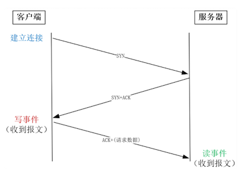
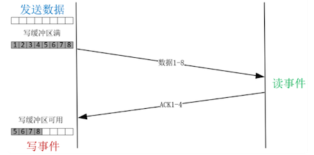
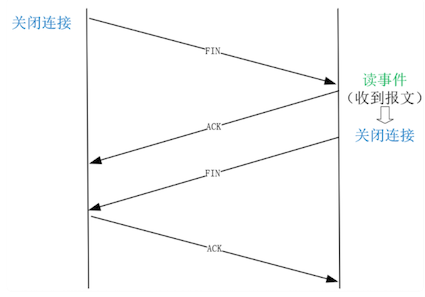

# **第二节 C10M是如何实现事件驱动**

谈到高并发，总是会提到 C10K，这是指服务器同时处理 1 万个 TCP 连接。

* 随着服务器性能的提升，近来我们更希望单台服务器的并发能力可以达到 C10M，也就是同时可以处理 1 千万个 TCP 连接。
* 从 C10K 到 C10M，实现技术并没有本质变化，都是用事件驱动和异步开发实现的。

处理基于 TCP 的应用层协议时，一个请求的处理代码必须被拆分到多个回调函数中，由异步框架在相应的事件生成时调用它们。这就是事件驱动方式，它通过减少上下文切换次数，实现了 C10M 级别的高并发。

这样，在高并发下，当多个 HTTP 请求争抢执行时，涉及资源分配、释放等重要工作的回调函数，就可能在错误的时间被调用，进而引发一系列问题。比如，不同的回调函数对应不同的事件，如果某个函数执行时间过长，就会影响其他请求，可能导致大量请求出现超时而处理失败。

## **1、事件是怎么产生的？**

### **1-1 什么是事件**

**要了解“事件驱动”的运作机制，首先就要搞清楚到底什么是事件**

从网络中接收到一个报文，就可能产生一个事件。绍过的 UDP 请求就是最简单的例子，一个 UDP 请求通常仅由一个网络报文组成，所以，当收到一个 UDP 报文，就意味着收到一个请求，它会生成一个事件，进而触发回调函数执行。

常见的 HTTP 等协议都是基于 TCP 实现的。由于 TCP 是一种面向字节流的协议，HTTP 请求的大小并不受限制，当一个 HTTP 请求的大小超过 TCP 报文的最大长度时，请求会被拆分到多个报文中运输，在接收端的缓冲区中重组、排序。因此，并不是每个到达的 TCP 报文都能生成事件的。

### **1-2 事件类型**

事件并没有你想象中那么复杂，它只有两种类型：**读事件与写事件**，其中，

* 读事件表示有到达的消息需要处理，
* 写事件表示可以发送消息（TCP 连接的写缓冲区中有可用空间）。

由于 TCP 允许双向传输，所以**建立连接时，会依次在连接的两个方向上建立通道**。

* 主动发起连接的一方叫做客户端
* 被动监听端口等待连接的一方叫做服务器。

**客户端首先发送 SYN 报文给服务器，而服务器收到后回复 ACK 和 SYN，当它们到达客户端时，双向连接中由客户端到服务器的通道就建立好了，此时客户端就已经可以发送请求了，因此客户端会产生写事件**。

接着，**客户端发送 ACK 报文，到达服务器后，服务器上会产生读事件**，因为进程原本在监听 80 等端口，此时有新连接建立成功，应当调用 `accept` 函数读取这个连接，所以这是一个读事件。

在建立好的 TCP 连接上收发消息时，读事件对应着接收到对方的消息，这很好理解。写事件则稍微复杂些，我们举个例子加以说明。假设要发送一个 2MB 的请求，**当调用 write 函数发送时，会先把内存中的数据拷贝到写缓冲区中后，再发送到网卡上。**

在对方没有明确表示收到前，TCP 会通过定时器重发写缓冲区中的数据，保证消息能够到达对方。写缓冲区是有大小限制的。这里假设写缓冲区只有 1MB，所以调用 write 发送 2MB 数据时，write 函数的返回值只有 1MB，表示写缓冲区已用尽。当收到对方发来的 ACK 报文后，缓冲区中的数据才能释放，就会产生写事件通知进程发送剩余的那 1MB 数据。

如同建立连接需要双向建立一样，关闭连接也需要双方各自关闭每个方向的通道。主动关闭的一方发送 FIN 报文，到达被动方后，内核自动回复 ACK 报文，这表示从主动方到被动方的通道已经关闭。**但被动方到主动方的通道也需要关闭，所以此时被动方会产生读事件，提醒被动方调用 close 函数关闭连接**。

相对而言，网络不只速度慢，而且波动很大，既受制于连接对端的性能，也受制于网络传输路径。

* 把操作网络的同步 API 改为事件驱动的异步 API 收益最大。
* 而磁盘（特别是机械硬盘）访问速度虽然不快，但它最慢时也不过几十毫秒，是可控的。
* 而且目前磁盘异步 IO 技术还不成熟，它绕过了 PageCache 性能损失很大。所以当下的事件驱动，主要就是指网络事件。

## **2、该怎样处理网络事件？**

### **2-1 用户态代码如何处理事件**

网络事件是由内核产生的，进程该怎样获取到它们呢？**如 epoll 这样的多路复用技术可以帮我们做到。多路复用是通讯领域的词汇，有些抽象但原理确很简单。**

比如，一条高速的光纤上，允许多个用户用较低的网速同时通讯，这就是多路复用。同样道理，一个进程虽然任一时刻只能处理一个请求，但处理每个请求产生的事件时，若耗时控制在 1 毫秒以内，这样 1 秒钟就可以处理数千个请求，**从更长的时间维度上看，多个请求复用了一个进程，也叫做多路复用（或者叫做时分多路复用）**。

**epoll，就是内核提供给用户态的多路复用接口，进程可以通过它从内核中获取事件。**

### **2-1 epoll 是如何获取网络事件**

最简单的方法，就是在获取事件时，把所有并发连接传给内核，再由内核返回产生了事件的连接，再处理这些连接对应的请求即可。epoll 前的 select 等多路复用函数就是这么干的。

然而，C10M 意味着有一千万个连接，若每个 socket 是 4 字节，那么 1 千万连接就是 40M 字节。这样，每收集一次事件，就需要从用户态复制 40M 字节到内核态。而且，高性能 Server 必须及时地处理网络事件，所以每隔几十毫秒就要收集一次事件，性能消耗巨大。

**epoll 为了降低性能消耗，把获取事件拆分成两步。**

* 第一步把需要监控的 socket 传给内核（`epoll_ctl` 函数），它仅在连接建立等有限的时机调用；
* 第二步收集事件（`epoll_wait` 函数）便不用传递 socket 了，这样就把 socket 的重复传递改为了一次传递，降低了性能损耗。

### **2-2 怎样保证处理一个事件的时间不会太长**

* **第一类是计算任务，虽然内存、CPU 的速度很快，然而循环执行也可能耗时达到秒级**。所以，如果一定要引入需要密集计算才能完成的请求，为了不阻碍其他事件的处理，要么把这样的请求放在独立的线程中完成，要么把请求的处理过程拆分成多段，确保每段能够快速执行完，同时每段执行完都要均等地处理其他事件，这样通过放慢该请求的处理时间，就保障了其他请求的及时处理。
* **第二类会读写磁盘，由于磁盘的写入操作使用了 PageCache 的延迟写特性，当 write 函数返回时只是复制到了内存中，所以写入操作很快**。磁盘的读取操作就比较慢了，这时，通常要把大文件的读取，拆分成许多份，每份仅有几十 KB，降低单次操作的耗时。
* **第三类是通过网络访问上游服务**。与处理客户端请求相似，我们必须使用非阻塞 socket，用事件驱动方式处理请求。需要注意的是，许多网络服务提供的 SDK，都是基于阻塞 socket 实现的，使用前必须先做完非阻塞改造。比如 Memcached 的官方 SDK 是用阻塞 socket 实现的，Nginx 如果直接使用该 SDK 访问它，性能就会一落千丈。正确的访问方式，是使用第三方提供的 `ngx_http_memcached_module` 模块，它用非阻塞 socket 重新封装了 SDK。

**网络报文到达后，内核就产生了读、写事件，而 epoll 函数使得进程可以高效地收集到这些事件。接下来，要确保在进程中处理每个事件的时间足够短，才能及时地处理所有请求，这个过程中既要避免阻塞 socket 的使用，也要把耗时过长的操作拆成多份执行。最终，通过快速、及时、均等地执行所有事件，异步 Server 实现了高并发。**

## **3、本节小结**

事件有很多种，网络消息的传输既慢又不可控，所以用网络事件驱动请求的性价比最高。这样，就需要你了解 TCP 报文是如何产生事件的。

TCP 连接建立时，会在客户端产生写事件，在服务器端产生读事件。连接关闭时，则会在被动关闭端产生读事件。在连接上收发消息时，也会产生事件，其中发送消息前的写事件与内核分配的缓冲区有关。

你需要注意的是，处理 epoll 收集到的事件时，必须保证处理一个事件的平均时间在毫秒级以内。传统的阻塞 socket 是做不到的，所以必须用非阻塞 socket 替换阻塞 socket。如果事件的回调函数耗时过长，也得拆分为多个耗时短的函数，用多次事件（比如定时器事件）的触发来替代。

虽然我们有了上述的事件驱动方案，但实现 C10M 还需要更谨慎地使用不过数百 GB 的服务器内存