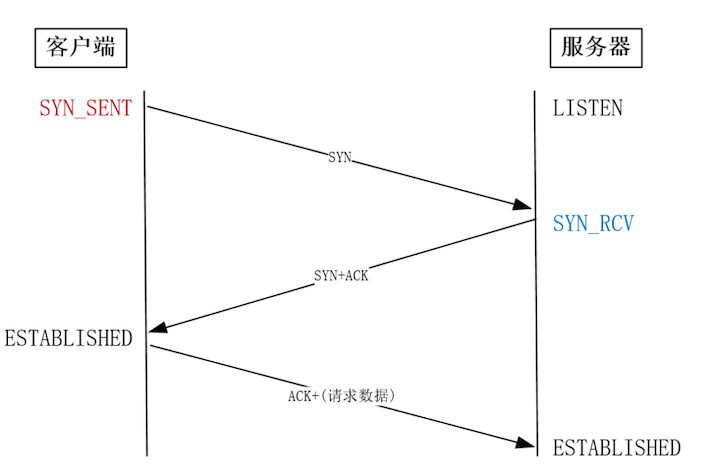

# **第四节 提升TCP四次挥手的性能**

**close 和 shutdown 函数都可以关闭连接，但这两种方式关闭的连接，不只功能上有差异，控制它们的 Linux 参数也不相同。**

* close 函数会让连接变为孤儿连接，
* **shutdown 函数则允许在半关闭的连接上长时间传输数据**。

TCP 之所以具备这个功能，是因为它是**全双工协议**，但这也造成四次挥手非常复杂。


四次挥手中你可以用 `netstat` 命令观察到 6 种状态。

Linux 为四次挥手提供了很多控制参数，有些参数的名称与含义并不相符。例如 `tcp_orphan_retries` 参数中有 orphan 孤儿，却同时对非孤儿连接也生效。

而且，错误地配置这些参数，不只无法针对高并发场景提升性能，还会降低资源的使用效率，甚至引发数据错误。

## **1、四次挥手的流程**

为什么建立连接是三次握手，而关闭连接需要四次挥手呢？

**这是因为 TCP 不允许连接处于半打开状态时就单向传输数据，所以在三次握手建立连接时，服务器会把 ACK 和 SYN 放在一起发给客户端**(ESTABLISHED)

**<span style="color:red">其中，ACK 用来打开客户端的发送通道，SYN 用来打开服务器的发送通道。这样，原本的四次握手就降为三次握手了。</span>**



但是当连接处于半关闭状态时，TCP 是允许单向传输数据的。

**<span style="color:red">先关闭连接的一方叫做主动方，后关闭连接的一方叫做被动方。</span>**

当主动方关闭连接时，被动方仍然可以在不调用 close 函数的状态下，长时间发送数据，此时连接处于半关闭状态。这一特性是 TCP 的双向通道互相独立所致，却也使得关闭连接必须通过四次挥手才能做到。


**互联网中往往服务器才是主动关闭连接的一方**。这是因为，HTTP 消息是单向传输协议，服务器接收完请求才能生成响应，发送完响应后就会立刻关闭 TCP 连接，这样及时释放了资源，能够为更多的用户服务。

这就使得服务器的优化策略变得复杂起来。

* 一方面，由于被动方有多种应对策略，从而增加了主动方的处理分支。
* 另一方面，服务器同时为成千上万个用户服务，任何错误都会被庞大的用户数放大。所以对主动方的关闭连接参数调整时，需要格外小心。


**<span style="color:red">其实四次挥手只涉及两种报文：FIN 和 ACK。</span>**

* **FIN 就是 Finish 结束连接的意思，谁发出 FIN 报文，就表示它将不再发送任何数据，关闭这一方向的传输通道。**
* **ACK 是 Acknowledge 确认的意思，它用来通知对方：你方的发送通道已经关闭。**


### **当主动方关闭连接时**

1. 当主动方关闭连接时，会发送 FIN 报文，此时主动方的连接状态由 ESTABLISHED 变为 `FIN_WAIT1`。
2. 当被动方收到 FIN 报文后，内核自动回复 ACK 报文，连接状态由 ESTABLISHED 变为 `CLOSE_WAIT`，顾名思义，它在等待进程调用 close 函数关闭连接。
3. 当主动方接收到这个 ACK 报文后，连接状态由 `FIN_WAIT1` 变为 `FIN_WAIT2`，主动方的发送通道就关闭了。

### **被动方的发送通道是如何关闭的**

1. 当被动方进入 `CLOSE_WAIT` 状态时，进程的 read 函数会返回 0，这样开发人员就会有针对性地调用 close 函数，进而触发内核发送 FIN 报文，此时被动方连接的状态变为 `LAST_ACK`。
2. 当主动方收到这个 FIN 报文时，内核会自动回复 ACK，同时连接的状态由 `FIN_WAIT2` 变为 `TIME_WAIT`，Linux 系统下大约 1 分钟后 `TIME_WAIT` 状态的连接才会彻底关闭。
3. 而被动方收到 ACK 报文后，连接就会关闭。


## **2、主动方的优化**

关闭连接有多种方式，比如进程异常退出时，针对它打开的连接，内核就会发送 RST 报文来关闭。

RST 的全称是 Reset 复位的意思，它可以不走四次挥手强行关闭连接，但当报文延迟或者重复传输时，这种方式会导致数据错乱，所以这是不得已而为之的关闭连接方案。


### **`tcp_max_orphans`**

安全关闭连接的方式必须通过四次挥手，它由进程调用 close 或者 shutdown 函数发起，这二者都会向对方发送 FIN 报文（shutdown 参数须传入 `SHUT_WR` 或者 `SHUT_RDWR` 才会发送 FIN），区别在于 close 调用后，哪怕对方在半关闭状态下发送的数据到达主动方，进程也无法接收。


**<span style="color:red">此时，这个连接叫做孤儿连接，如果你用 `netstat -p` 命令，会发现连接对应的进程名为空。而 shutdown 函数调用后，即使连接进入了 `FIN_WAIT1` 或者 `FIN_WAIT2 `状态，它也不是孤儿连接，进程仍然可以继续接收数据。</span>**

* 主动方发送 FIN 报文后，连接就处于 `FIN_WAIT1` 状态下，该状态通常应在数十毫秒内转为 `FIN_WAIT2`。
* 只有迟迟收不到对方返回的 ACK 时，才能用 `netstat` 命令观察到 `FIN_WAIT1` 状态。
* 此时，内核会定时重发 `FIN` 报文，其中重发次数由 `tcp_orphan_retries` 参数控制（注意，orphan 虽然是孤儿的意思，该参数却不只对孤儿连接有效，事实上，它对所有 `FIN_WAIT1` 状态下的连接都有效），**默认值是 0，特指 8 次：**

```
net.ipv4.tcp_orphan_retries = 0
```

**如果 `FIN_WAIT1 `状态连接有很多，你就需要考虑降低 `tcp_orphan_retries `的值。当重试次数达到 `tcp_orphan_retries` 时，连接就会直接关闭掉。**

**<span style="color:red">对于正常情况来说，调低 `tcp_orphan_retries `已经够用，但如果遇到恶意攻击，FIN 报文根本无法发送出去</span>**。这是由 TCP 的 2 个特性导致的。

* 首先，TCP 必须保证报文是有序发送的，FIN 报文也不例外，当发送缓冲区还有数据没发送时，FIN 报文也不能提前发送。
* 其次，TCP 有流控功能，当接收方将接收窗口设为 0 时，发送方就不能再发送数据。所以，当攻击者下载大文件时，就可以通过将接收窗口设为 0，导致 FIN 报文无法发送，进而导致连接一直处于 `FIN_WAIT1` 状态。

解决这种问题的方案是调整 `tcp_max_orphans` 参数：

```
net.ipv4.tcp_max_orphans = 16384
```

**<span style="color:red">`tcp_max_orphans` 定义了孤儿连接的最大数量。</span>**

当进程调用 close 函数关闭连接后，无论该连接是在 `FIN_WAIT1` 状态，还是确实关闭了，这个连接都与该进程无关了，它变成了孤儿连接。Linux 系统为防止孤儿连接过多，导致系统资源长期被占用，就提供了 `tcp_max_orphans` 参数。如果孤儿连接数量大于它，新增的孤儿连接将不再走四次挥手，而是直接发送 RST 复位报文强制关闭。

当连接收到 ACK 进入 `FIN_WAIT2` 状态后，就表示主动方的发送通道已经关闭，接下来将等待对方发送 FIN 报文，关闭对方的发送通道

**这时，如果连接是用 shutdown 函数关闭的，连接可以一直处于 FIN_WAIT2 状态。但对于 close 函数关闭的孤儿连接，这个状态不可以持续太久，而 `tcp_fin_timeout` 控制了这个状态下连接的持续时长。**

```
net.ipv4.tcp_fin_timeout = 60
```

它的默认值是 60 秒。这意味着对于孤儿连接，如果 60 秒后还没有收到 FIN 报文，连接就会直接关闭。

### **`TIME_WAIT` 是主动方四次挥手的最后一个状态**

**<span style="color:red">`TIME_WAIT` 状态的连接，在主动方看来确实已经关闭了。然而，被动方没有收到 ACK 报文前，连接还处于 `LAST_ACK` 状态。如果这个 `ACK`报文没有到达被动方，被动方就会重发 FIN 报文。重发次数仍然由前面介绍过的 `tcp_orphan_retries` 参数控制。</span>**

如果主动方不保留 `TIME_WAIT` 状态，会发生什么呢？

此时连接的端口恢复了自由身，可以复用于新连接了。然而，被动方的 FIN 报文可能再次到达，这既可能是网络中的路由器重复发送，也有可能是被动方没收到 ACK 时基于 `tcp_orphan_retries` 参数重发。这样，**正常通讯的新连接就可能被重复发送的 FIN 报文误关闭**。保留 `TIME_WAIT` 状态，就可以应付重发的 FIN 报文，当然，其他数据报文也有可能重发，所以 `TIME_WAIT` 状态还能避免数据错乱。

这与孤儿连接 `FIN_WAIT2 `状态默认保留 60 秒的原理是一样的，**因为这两个状态都需要保持 2MSL 时长。MSL 全称是 Maximum Segment Lifetime，它定义了一个报文在网络中的最长生存时间**（报文每经过一次路由器的转发，IP 头部的 TTL 字段就会减 1，减到 0 时报文就被丢弃，这就限制了报文的最长存活时间）。

**<span style="color:red">因此，`TIME_WAIT` 和 `FIN_WAIT2` 状态的最大时长都是 2 MSL，由于在 Linux 系统中，MSL 的值固定为 30 秒，所以它们都是 60 秒。</span>**

虽然 `TIME_WAIT` 状态的存在是有必要的，但它毕竟在消耗系统资源，比如 `TIME_WAIT` 状态的端口就无法供新连接使用。怎样解决这个问题呢？

**Linux 提供了 `tcp_max_tw_buckets` 参数，当 `TIME_WAIT `的连接数量超过该参数时，新关闭的连接就不再经历 `TIME_WAIT` 而直接关闭。**

```
net.ipv4.tcp_max_tw_buckets = 5000
```

当服务器的并发连接增多时，相应地，同时处于 `TIME_WAIT` 状态的连接数量也会变多，此时就应当调大 `tcp_max_tw_buckets` 参数，减少不同连接间数据错乱的概率。


当然，`tcp_max_tw_buckets` 也不是越大越好，毕竟内存和端口号都是有限的。有没有办法让新连接复用 TIME_WAIT 状态的端口呢？如果服务器会主动向上游服务器发起连接的话，就可以把 `tcp_tw_reuse` 参数设置为 1，它允许作为客户端的新连接，在安全条件下使用 `TIME_WAIT` 状态下的端口。

```
net.ipv4.tcp_tw_reuse = 1
```

当然，要想使 `tcp_tw_reuse` 生效，还得把 timestamps 参数设置为 1，它满足安全复用的先决条件（对方也要打开 tcp_timestamps ）：

```
net.ipv4.tcp_timestamps = 1
```

老版本的 Linux 还提供了 `tcp_tw_recycle `参数，它并不要求 TIME_WAIT 状态存在 60 秒，很容易导致数据错乱，不建议设置为 1。

```
net.ipv4.tcp_tw_recycle = 0
```

所以在 Linux 4.12 版本后，直接取消了这一参数。

## **2、被动方的优化**

当被动方收到 FIN 报文时，就开启了被动方的四次挥手流程。内核自动回复 ACK 报文后，连接就进入 `CLOSE_WAIT` 状态，顾名思义，它表示等待进程调用 close 函数关闭连接。

内核没有权力替代进程去关闭连接，因为若主动方是通过 shutdown 关闭连接，那么它就是想在半关闭连接上接收数据。**因此，Linux 并没有限制 `CLOSE_WAIT` 状态的持续时间**。


**由于 `CLOSE_WAIT` 状态下，连接已经处于半关闭状态，所以此时进程若要关闭连接，只能调用 close 函数（再调用 shutdown 关闭单向通道就没有意义了），内核就会发出 FIN 报文关闭发送通道，同时连接进入 `LAST_ACK` 状态，等待主动方返回 ACK 来确认连接关闭。**

**如果迟迟等不到 ACK，内核就会重发 FIN 报文，重发次数仍然由 `tcp_orphan_retries` 参数控制，这与主动方重发 FIN 报文的优化策略一致。**

**需要你注意的是，如果被动方迅速调用 close 函数，那么被动方的 ACK 和 FIN 有可能在一个报文中发送，这样看起来，四次挥手会变成三次挥手，这只是一种特殊情况，不用在意。**

如果连接双方同时关闭连接，会怎么样？

**两方发送 FIN 报文时，都认为自己是主动方，所以都进入了 FIN_WAIT1 状态，FIN 报文的重发次数仍由 `tcp_orphan_retries` 参数控制。**


接下来，双方在等待 ACK 报文的过程中，都等来了 FIN 报文。这是一种新情况，所以连接会进入一种叫做 CLOSING 的新状态，它替代了 `FIN_WAIT2` 状态。此时，内核回复 ACK 确认对方发送通道的关闭，仅己方的 FIN 报文对应的 ACK 还没有收到。所以，CLOSING 状态与 `LAST_ACK` 状态下的连接很相似，它会在适时重发 FIN 报文的情况下最终关闭。

## **3、本节小结**

四次挥手的主动方，为了应对丢包，允许在 `tcp_orphan_retries` 次数内重发 FIN 报文。当收到 ACK 报文，连接就进入了 `FIN_WAIT2` 状态，此时系统的行为依赖这是否为孤儿连接。

如果这是 close 函数关闭的孤儿连接，那么在` tcp_fin_timeout` 秒内没有收到对方的 FIN 报文，连接就直接关闭，反之 shutdown 函数关闭的连接则不受此限制。毕竟孤儿连接可能在重发次数内存在数分钟之久，为了应对孤儿连接占用太多的资源，`tcp_max_orphans `定义了最大孤儿连接的数量，超过时连接就会直接释放。

被动关闭的连接方应对非常简单，它在回复 ACK 后就进入了 `CLOSE_WAIT` 状态，等待进程调用 close 函数关闭连接。因此，出现大量 `CLOSE_WAIT` 状态的连接时，应当从应用程序中找问题。当被动方发送 FIN 报文后，连接就进入 `LAST_ACK` 状态，在未等来 ACK 时，会在 `tcp_orphan_retries` 参数的控制下重发 FIN 报文。