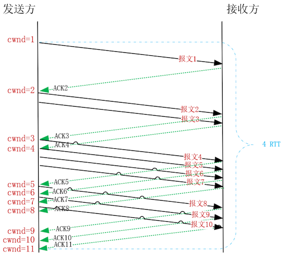
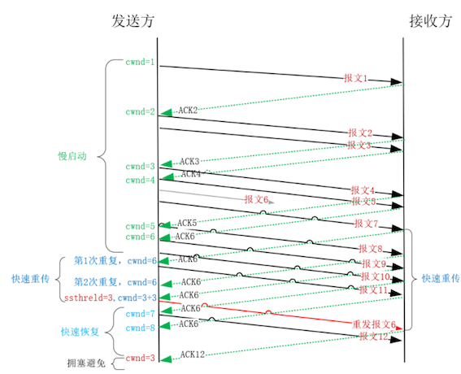

# **第六节 调整TCP拥塞控制的性能**

接收主机的处理能力不足时，是通过滑动窗口来减缓对方的发送速度

网络处理能力不足时又该如何优化 TCP 的性能

**如果没有拥塞控制，整个网络将会锁死，所有消息都无法传输。**

## **1、慢启动阶段如何调整初始拥塞窗口？**

上一讲谈到，只要接收方的读缓冲区足够大，就可以通过报文中的接收窗口，要求对方更快地发送数据。

然而，网络的传输速度是有限的，它会直接丢弃超过其处理能力的报文。

**而发送方只有在重传定时器超时后，才能发现超发的报文被网络丢弃了，发送速度提不上去。更为糟糕的是，如果网络中的每个连接都按照接收窗口尽可能地发送更多的报文时，就会形成恶性循环，最终超高的网络丢包率会使得每个连接都无法发送数据。**

### **拥塞控制**

解决这一问题的方案叫做拥塞控制，它包括 4 个阶段，我们首先来看 TCP 连接刚建立时的**慢启动阶段**。由于 TCP 连接会穿越许多网络，所以最初并不知道网络的传输能力，为了避免发送超过网络负载的报文，**TCP 只能先调低发送窗口，减少飞行中的报文来让发送速度变慢，这也是“慢启动”名字的由来**。

让发送速度变慢是通过引入拥塞窗口（全称为 congestion window，缩写为 CWnd，类似地，接收窗口叫做 rwnd，发送窗口叫做 swnd）实现的，它用于避免网络出现拥塞。上一讲我们说过，如果不考虑网络拥塞，发送窗口就等于对方的接收窗口，而考虑了网络拥塞后，发送窗口则应当是拥塞窗口与对方接收窗口的最小值：

```
swnd = min(cwnd, rwnd)
```

发送速度就综合考虑了接收方和网络的处理能力。

虽然窗口的计量单位是字节，但为了方便理解，通常我们用 MSS 作为描述窗口大小的单位，其中 MSS 是 TCP 报文的最大长度。

如果初始拥塞窗口只有 1 个 MSS，当 MSS 是 1KB，而 RTT 时延是 100ms 时，发送速度只有 10KB/s。所以，当没有发生拥塞时，拥塞窗口必须快速扩大，才能提高互联网的传输速度。因此，慢启动阶段会以指数级扩大拥塞窗口（扩大规则是这样的：发送方每收到一个 ACK 确认报文，拥塞窗口就增加 1 个 MSS），比如最初的初始拥塞窗口（也称为 initcwnd）是 1 个 MSS，经过 4 个 RTT 就会变成 16 个 MSS。

这样，当 MSS 是 1KB 时，多数 HTTP 请求至少包含 10 个报文，即使以指数级增加拥塞窗口，也需要至少 4 个 RTT 才能传输完，参见下图：



因此，你可以根据网络状况和传输对象的大小，调整初始拥塞窗口的大小。

**调整前，先要清楚你的服务器现在的初始拥塞窗口是多大**。你可以通过 ss 命令查看当前拥塞窗口：

```
# ss -nli|fgrep cwnd
         cubic rto:1000 mss:536 cwnd:10 segs_in:10621866 lastsnd:1716864402 lastrcv:1716864402 lastack:1716864402
```

再通过 ip route change 命令修改初始拥塞窗口：

```
# ip route | while read r; do
           ip route change $r initcwnd 10;
       done
```

当然，更大的初始拥塞窗口以及指数级的提速，连接很快就会遭遇网络拥塞，从而导致慢启动阶段的结束。

## **2、出现网络拥塞时该怎么办？**

以下 3 种场景都会导致慢启动阶段结束：

1. 通过定时器明确探测到了丢包；
2. 拥塞窗口的增长到达了慢启动阈值 ssthresh（全称为 slow start threshold），也就是之前发现网络拥塞时的窗口大小；
3. 接收到重复的 ACK 报文，可能存在丢包。

### **2-1 在规定时间内没有收到 ACK 报文**

在规定时间内没有收到 ACK 报文，这说明报文丢失了，**网络出现了严重的拥塞，必须先降低发送速度，再进入拥塞避免阶段**。

不同的拥塞控制算法降低速度的幅度并不相同，比如 CUBIC 算法会把拥塞窗口降为原先的 0.8 倍（也就是发送速度降到 0.8 倍）。**此时，我们知道了多大的窗口会导致拥塞，因此可以把慢启动阈值设为发生拥塞前的窗口大小。**


### **2-2 还没有发生丢包，但发送方已经达到了曾经发生网络拥塞的速度**

虽然还没有发生丢包，但发送方已经达到了曾经发生网络拥塞的速度（拥塞窗口达到了慢启动阈值），接下来发生拥塞的概率很高，**所以进入拥塞避免阶段，此时拥塞窗口不能再以指数方式增长，而是要以线性方式增长**。

接下来，拥塞窗口会以每个 RTT 增加 1 个 MSS 的方式，代替慢启动阶段每收到 1 个 ACK 就增加 1 个 MSS 的方式。这里可能有同学会有疑问，在第 1 种场景发生前，慢启动阈值是多大呢？

### **2-3 接收到重复的 ACK 报文，可能存在丢包**

CP 传输的是字节流，而“流”是天然有序的。因此，当接收方收到不连续的报文时，就可能发生报文丢失或者延迟，等待发送方超时重发太花时间了，为了缩短重发时间，**快速重传算法便应运而生**。

当连续收到 3 个重复 ACK 时，发送方便得到了网络发生拥塞的明确信号，通过重复 ACK 报文的序号，我们知道丢失了哪个报文，这样，不等待定时器的触发，立刻重发丢失的报文，可以让发送速度下降得慢一些，这就是快速重传算法。

出现拥塞后，发送方会缩小拥塞窗口，再进入前面提到的拥塞避免阶段，用线性速度慢慢增加拥塞窗口。**然而，为了平滑地降低速度，发送方应当先进入快速恢复阶段，在失序报文到达接收方后，再进入拥塞避免阶段。**

我们不妨把网络看成一个容器（上一讲中说过它可以容纳 BDP 字节的报文），每当接收方从网络中取出一个报文，发送方就可以增加一个报文。当发送方接收到重复 ACK 时，可以推断有失序报文离开了网络，到达了接收方的缓冲区，因此可以再多发送一个报文。如下图所示：




**慢启动、拥塞避免、快速重传、快速恢复，共同构成了拥塞控制算法。Linux 上提供了更改拥塞控制算法的配置，你可以通过 `tcp_available_congestion_control` 配置查看内核支持的算法列表：**

```
net.ipv4.tcp_available_congestion_control = cubic reno
```

再通过 `tcp_congestion_control` 配置选择一个具体的拥塞控制算法：

```
net.ipv4.tcp_congestion_control = cubic
```

Linux 4.9 版本之后都支持 BBR 算法，开启 BBR 算法仍然使用 `tcp_congestion_control` 配置：

```
net.ipv4.tcp_congestion_control=bbr
```

## **3、本节小结**

当 TCP 连接建立成功后，拥塞控制算法就会发生作用，首先进入慢启动阶段。决定连接此时网速的是初始拥塞窗口，Linux 上可以通过 route ip change 命令修改它。通常，在带宽时延积较大的网络中，应当调高初始拥塞窗口。

丢包以及重复的 ACK 都是明确的拥塞信号，此时，发送方就会调低拥塞窗口减速，同时修正慢启动阈值。这样，将来再次到达这个速度时，就会自动进入拥塞避免阶段，用线性速度代替慢启动阶段的指数速度提升窗口大小。

当然，重复 ACK 意味着发送方可以提前重发丢失报文，快速重传算法定义了这一行为。同时，为了使得重发报文的过程中，发送速度不至于出现断崖式下降，TCP 又定义了快速恢复算法，发送方在报文重新变得有序后，结束快速恢复进入拥塞避免阶段。


但以丢包作为网络拥塞的信号往往为时已晚，于是以 BBR 算法为代表的测量型拥塞控制算法应运而生。当飞行中报文数量不变，而网络时延升高时，就说明网络中的缓冲队列出现了积压，这是进行拥塞控制的最好时机。Linux 高版本支持 BBR 算法，你可以通过 `tcp_congestion_control` 配置更改拥塞控制算法。