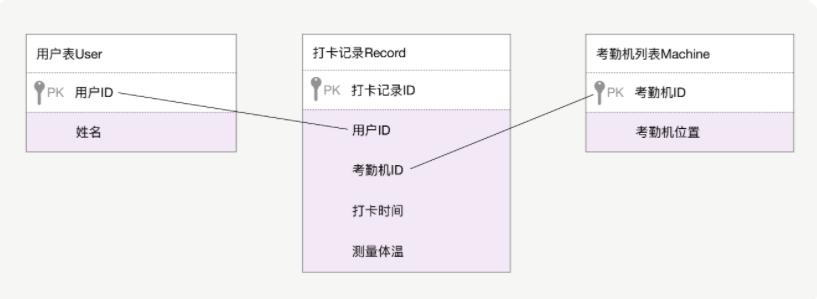
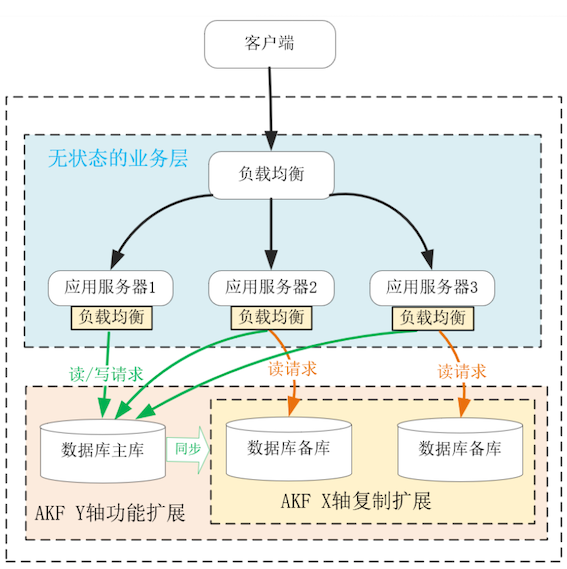
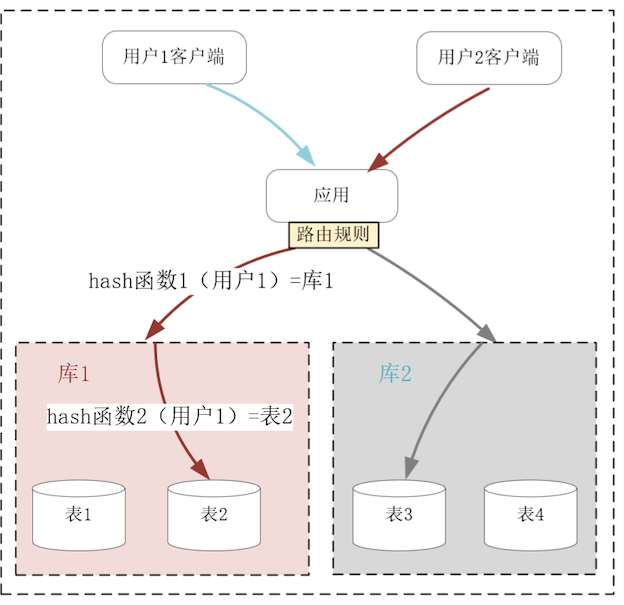

# **第十节 权衡关系数据库与NoSQL数据库**

**在分布式系统中，会同时使用多种数据库。**

比如，你可能会在 Redis 中存放用户 Session 会话，将业务数据拆解为由行、列构成的二维表存储在 MySQL 中，将需要全文检索的数据放在 ElasticSearch 中，将知识图谱放在 Neo4j 图数据库中，将数据量、访问量很大的数据放在 Cassandra 列式数据库或者 MongoDB 文档型数据库中，等等。


选择数据库时，我们的依据可能是访问速度，比如基于哈希表的 Redis 查询复杂度只有 O(1)，也可能从事务的支持程度上选择了关系数据库，甚至从应用层的开发效率上还给它添加了 Hibernate 等 ORM 框架，也可能从处理数据的体量上选择了 NoSQL 数据库。

可是，除了各种实现层面上的差异外，各类 NoSQL 与关系数据库之间，有没有最本质的区别？

## **1、关系数据库的优点**

关系数据库对业务层开发效率的提升有很大帮助。

下面先基于一个简单的例子，看看关系数据库有何优点。疫情期间新增了一批能够测量体温的考勤机，通过关系数据库我们新建了用户、考勤机、考勤记录三张表



在关系数据库中，表中的每行数据由多个从属于列的单一值（比如数字、字符串）构成。虽然表中可以存放任意行数据，但列却是预先定义且不变的，因此我们很容易通过行、列交汇处的单一值进行关联操作，

进而完成各类业务目的不同的查询。比如，业务开发者可以通过下面这行 SQL 语句，找到体温超过 37 度的员工，上报其姓名、测量时间以及所在地理位置：

```
select user.name, record.time, machine.location from user, record, machine where user.id = record.user_id and machine.id = record.machine_id and record.temporature > 37;
```

运营人员则可以通过下面这行 SQL 语句，找出各类考勤机的使用频率：

```
select count(*), machine.id from machine, record where machine.id = record.machine_id group py machine.id;
```

因此，关系数据库可以通过预定义的关系，由数据库自身完成复杂的逻辑计算，为不同的场景提供数据服务。由于不同的数据间具有了关系，关系数据库还提供了“Transaction 事务”，用于保证相关数据间的一致性，这大大释放了应用开发者的生产力。所谓“事务”，**会同时具有 ACID4 个特性**：

* **Atomicity 原子性**，指多个 SQL 语句组成了一个逻辑单位，执行时要么全部成功，要么全部失败。
* **Consistency 一致性**，指数据库只能从一个一致性状态转换到另一个一致性状态。即使数据库发生了重启，仍然得维持一致性。
* **Isolation 隔离性**，由于数据库可以支持多个连接并发操作，因此并发的事务间必须互相隔离才有意义。[SQL 标准定义了以下 4 种隔离级别](https://chao-xi.github.io/jxdatabasebook/chap1/3mysql_isolaion/)：
	* **READ UNCOMMITTED 未提交读**，它表示在事务 A 还未提交时，并发执行的事务 B 已经可以看到事务 A 改变的数据。这种隔离级别会带来很多问题，因此很少使用。
	* **READ COMMITTED 提交读，它表示当事务 A 未提交时，事务 B 看不到事务 A 改变的任何数据，这是 PostgreSQL 数据库的默认隔离级别**。
	* **REPEATABLE READ 可重复读，指在 READ COMMITTED 的基础上解决了脏读问题。所谓脏读，是指在一个事务内，多次读取到同一数据时，结果可能不一致。这是 MySQL 数据库的默认隔离级别**。
	* SERIALIZABLE 可串行化，它通过对每一行数据加锁，使得所有事务串行执行，虽然隔离性最好，但也大大降低了数据库的并发性，所以很少使用。

**Durability 持久性**，指一旦事务提交，事务所做的修改必须永久性地保存到数据库中。


* 无论是商业版的 Oracle，还是开源的 MySQL、PostgreSQL，只要是关系数据库就拥有同样的数据模型，因此它们可以通过SQL 语言为应用层提供标准化、几乎没有差异的访问接口；
* 生产级的数据库对持久化都有良好的支持，全面的冷备、热备方案提供了很高的可用性；
* 通过索引、缓存等特性，当行数在亿级以下时，关系数据库的性能并不低；关
* 系数据库支持还不错的并发度，一般可以服务于上千个并发连接。


## **2、关系数据库的问题**

虽然基于单一值的关系映射提供了事务等许多功能，但同时也引入了 3 个问题。

**首先，内存中的数据结构非常多样，难以直接映射到行列交汇处的单一值上。**不过，这个问题可以通过ORM（Object-relational mapping）框架解决。比如，Python 中的 Django ORM 框架，可以将上述 3 张表映射为内存中的 3 个类：

```
from django.db import models

class User(models.Model):
    name = models.CharField(max_length=20)

class Machine(models.Model):
    location = models.CharField(max_length=100)
    
class Record(models.Model):
    time = models.DateTimeField()
    temporature = models.FloatField()
    user = models.ForeignKey(User)
    machine= models.ForeignKey(Machine)
```

ORM 框架会为每张表生成 id 字段，而 Record 表将 User 和 Machine 表中的 id 字段作为外键（ForeignKey）互相关联在一起。

于是，这 3 个类就映射了数据库中的那 3 张表，而内存中的对象（即类的实例）则映射为每张表中的一行数据。在 ORM 框架下，找到体温大于 37 度员工的那串长 SQL，可以转化为 OOP 中的函数调用，如下所示：

```
#gte表示大于等于
records = Record.objects.filter(temporature__gte = 37)
for r in records:
  print(r.user.name, r.machine.location, r.time)
```

相比起 SQL 语句，映射后的 OO 编程要简单许多。

其次，为了实现关系映射，每张表中的字段都得预先定义好，一旦在产品迭代过程中数据模型发生了变化，便需要同步完成以下 3 件事：

* 修改表结构；
* 修改应用层操作数据的代码；
* 根据新的规则转换、迁移已有数据。

**最后是关系数据库固有的可伸缩性问题，这是各类 NoSQL 数据库不断诞生的主要原因。**介绍过沿 AKF X 轴扩展的复制型主从结构，然而单点主库无法解决数据持续增长引入的性能问题。




沿 AKF Z 轴扩展数据库虽然能够降低数据规模，**但分库分表后，单一值关系引申出的 ACID 事务不能基于高时延、会抖动的网络传输强行实现，否则会导致性能大幅下降，这样的可用性是分布式系统无法接受的**。



因此，在单机上设计出的关系数据库，难以处理 PB 级的大数据。而 NoSQL 数据库放弃了单一值数据模型，非常适合部署在成千上万个节点的分布式环境中。

## **3、NoSQL 数据库是如何解决上述问题的？**

NoSQL 数据库可以分为以下 4 类：

* **Key/Value 数据库，通常基于哈希表实现，性能非常好**。其中 Value 的类型通常由应用层代码决定，**当然，Redis 这样的 Key/Value 数据库还可以将 Value 定义为列表、哈希等复合结构**。
* 文档型数据库，在 Key/Value 数据库中，由于没有预定义的值结构，所以只能针对 Key 执行查询，这大大限制了使用场景。**文档型数据库将 Value 扩展为 XML、JSON（比如 MongoDB）等数据结构，于是允许使用者在文档型数据库的内部解析复合型的 Value 结构，再通过其中的单一值进行查询，这就兼具了部分关系数据库的功能。**
* 列式数据库，介绍过的 Cassandra。列式数据库基于 Key 来映射行，再通过列名进行二级映射，同时它基于列来安排存储的拓扑结构，这样当仅读写大量行中某个列时，操作的数据节点、磁盘非常集中，磁盘 IO、网络 IO 都会少很多。**列式数据库的应用场景非常有针对性，比如博客文章标签的行数很多，但在做数据分析时往往只读取标签列，这就很适合使用列式数据库。再比如，通过倒排索引实现了全文检索的 ElasticSearch，就适合使用列式存储存放 Doc Values，这样做排序、聚合时非常高效。**
* 图数据库，在社交关系、知识图谱等场景中，携带各种属性的边可以表示节点间的关系，由于节点的关系数量多，而且非常容易变化，所以关系数据库的实现成本很高，而图数据库既没有固定的数据模型，遍历关系的速度也非常快，很适合处理这类问题。当然，我们日常见到的主要是前 3 类 NoSQL 数据库。


相对于关系数据库，NoSQL 在性能和易用性上都有明显的优点。

* NoSQL 数据库的可伸缩性都非常好。虽然许多文档型、列式数据库都提供了类 SQL 语言接口，但这只是为了降低用户的学习成本，它们对跨节点事务的支持极其有限。因此，这些 NoSQL 数据库可以放开手脚，基于 Key/Value 模型沿 AKF Z 轴将系统扩展到上万个节点。
* 在数据基于 Key 分片后，很容易通过介绍过的 MapReduce 思想，提高系统的计算能力。比如，MongoDB 很自然的就在查询接口中，提供了MapReduce 函数。
* 通过冗余备份，NoSQL 可以提供优秀的容灾能力。比如，Redis、Cassandra 等数据库，都可以基于介绍过的 NWR 算法，灵活地调整 CAP 权重。
* 如果每个 Key 中 Value 存放的复合数据已经能满足全部业务需求，那么 NoSQL 的单机查询速度也会优于关系数据库。


其次再来看易用性，这主要体现在我们可以低成本地变更 Value 结构。虽然 NoSQL 数据库支持复合型 Value 结构，但并不限定结构类型。

比如，文档型数据库中，同一个表中的两行数据，其值可以是完全不同的 JSON 结构；同样的，列式数据库中两行数据也可以拥有不同的列数。因此，当数据结构改变时，只需要修改应用层操作数据的代码，并不需要像关系数据库那样同时修改表结构以及迁移数据。


## **4、本节小结**

关系数据库通过行、列交汇处的单一值，实现了多种数据间的关联。通过统一的 SQL 接口，用户可以在数据库中实现复杂的计算任务。为了维持关联数据间的一致性，关系数据库提供了拥有 ACID 特性的事务，提升了应用层的开发效率。

虽然单一值无法映射内存中的复合数据结构，但通过 ORM 框架，关系数据库可以将表映射为面向对象编程中的类，将每行数据映射为对象，继续降低开发成本。然而，关系数据库是为单机设计的，一旦将事务延伸到分布式系统中，执行成本就会高到影响基本的可用性。因此，关系数据库的可伸缩性是很差的。

NoSQL 数据库基于 Key/Value 数据模型，可以提供几乎无限的可伸缩性。

同时，将 Value 值进一步设计为复合结构后，既可以增加查询方式的多样性，也可以通过 MapReduce 提升系统的计算能力。实际上，关系数据库与每一类 NoSQL 数据库都有明显的优缺点，我们可以从数据模型、访问方式、数据容量上观察它们，结合具体的应用场景权衡取舍。