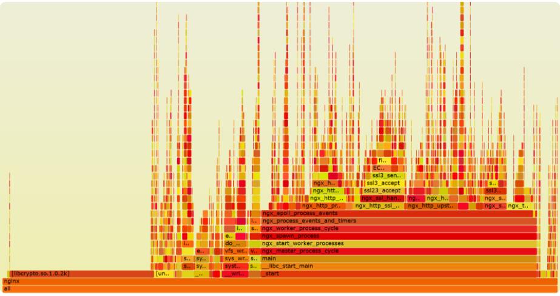
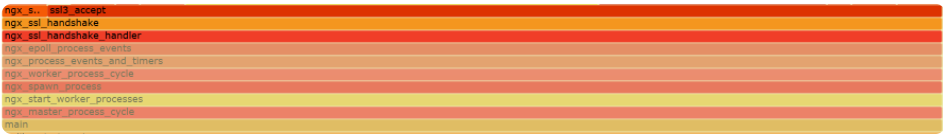
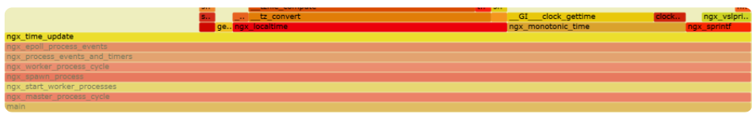
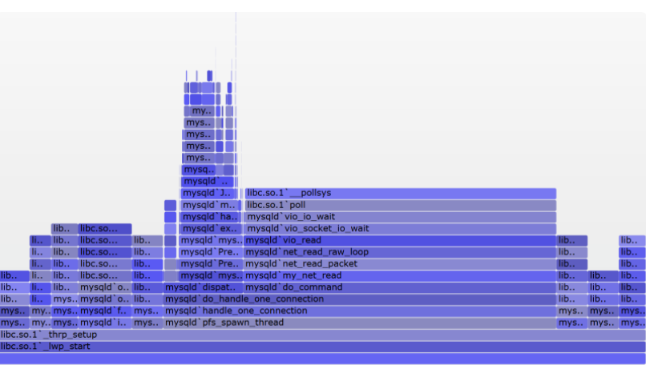

# **第一节 通过监控找到性能瓶颈**

根据帕累托法则（也叫二八定律），只有优化处于性能瓶颈的那些少量代码，才能用最小的成本获得最大的收益。

**如果监控动作自身的开发成本过高，或者施行监控时显著降低了业务请求的性能，或者无法全面覆盖潜在的问题，都会影响性能优化目标的实现。**

## **1、单机：通过火焰图找到性能瓶颈**

对于工作在一台主机上的进程而言，有许多监控方案可用于寻找性能瓶颈。

比如在 Linux 下，你可以通过 `iostat` 命令监控磁盘状态，也可以通过 `top` 命令监控 CPU、内存的使用。

这些方案都是在旁敲侧击着寻找性能瓶颈，然而，有一种最直接有效的方式，就是从代码层面直接寻找调用次数最频繁、耗时最长的函数，通常它就是性能瓶颈。

要完成这样的目标，通常还有 3 个约束条件。

1. 没有代码侵入性。
2. 覆盖到代码中的全部函数。
3. 搭建环境的成本足够低。


[火焰图](http://www.brendangregg.com/flamegraphs.html)，以及为火焰图提供监控数据的工具

火焰图可以将监控期间涉及到的所有函数调用栈都列出来，就像上图对 Nginx worker 进程的监控一样，函数非常密集，因此通常采用可缩放、可互动的SVG 矢量格式图片来展示




火焰图中最重要的信息，就是表示函数执行时间的 X 轴，以及表示函数调用栈的 Y 轴。

先来看 X 轴。X 轴由多个方块组成，每个方块表示一个函数，其长度是定时采样得到的函数调用频率，因此你可以简单粗暴地把它近似为执行时间


需要注意的是，如果函数 A 中调用了函数 B、C、D，监控采样时会形成 A->B、A->C、A->D 这 3 个函数调用栈，但火焰图会将 3 个调用栈中表示 A 函数的方块合并，并将 B、C、D 放在上一层中，并以字母表顺序排列它们。这样更有助于你找到耗时最长的函数。


再来看 Y 轴，它表示函数的调用栈。这里，我们既可以看到内核 API 的函数调用栈，也可以看到用户态函数的调用栈，非常强大。如果你正在学习开源组件的源码，推荐你先生成火焰图，再对照图中的 Y 轴调用栈，理解源码中函数的调用关系。**注意，函数方块的颜色是随机的，并没有特别的意义，只是为了在视觉上更容易区分开。**

首先，火焰图很容易从全局视角，通过寻找长方块，找到调用频率最高的几个函数。

其次，函数方块长，有些是因为函数自身执行了很消耗 CPU 的代码，而有些则是调用的子函数耗时长造成的。怎么区分这两种场景呢？

很简单，**如果函数方块的长度，远大于调用栈中子函数方块的长度之和，那么这个函数就执行了比较耗费 CPU 的计算**。比如，下图中执行 TLS 握手的 `ngx_ssl_handshake_handler` 函数，自身并没有消耗 CPU 多少计算力



而更新 Nginx 时间的 `ngx_time_update` 函数就不同，它在做时间格式转换时消耗了许多 CPU，如下图所示：



怎么生成火焰图呢？在 Linux 上这非常简单，因为 Linux 内核默认支持 perf 工具，你可以用 perf 生成函数的采样数据，再用 FlameGraph 脚本生成火焰图。当然，如果你在使用 Java、GoLang、Python 等高级语言，也可以使用各自语言生态中封装过的 Profile 类工具，生成采样数据。这里我以最基本的 perf、FlameGraph 为例，介绍下生成火焰图的 5 步流程。


首先，你可以通过 yum 或者 `apt-get` 安装 perf 工具，再通过 git 来下载 FlameGraph：

```
yum install perf
git clone --depth 1 https://github.com/brendangregg/FlameGraph.git
```

[Kubernetes 应用性能分析工具 - Kubectl Flame](https://github.com/Chao-Xi/JacobTechBlog/blob/master/k8s_dev/flame/flame_start.md)

接着，针对运行中的进程 PID，使用 perf 采样函数的调用频率（对于 C/C++ 语言，为了能够显示完整的函数栈，你需要在编译时加入 -g 选项），如下所示：

```
perf record -F 99 -p 进程PID -g --call-graph dwarf
```

上述命令行中各参数的含义，[可以参见这里](http://www.brendangregg.com/perf.html)。

再将二进制信息转换为 ASCII 格式的文件，方便 FlameGraph 处理：

```
perf script > out.perf
```

再然后，需要汇聚函数调用栈，转化为 FlameGraph 生成火焰图的数据格式：

```
FlameGraph/stackcollapse-perf.pl out.perf > out.folded
```

最后一步，生成 SVG 格式的矢量图片：

```
FlameGraph/flamegraph.pl out.folded > out.svg
```

**需要注意，上面的火焰图只能找到消耗 CPU 计算力最多的函数，因此它也叫做 On CPU 火焰图，由于 CPU 工作时会发热，所以色块都是暖色调**

有些使用了阻塞 API 的代码，则会导致进程休眠，On CPU 火焰图无法找到休眠时间最长的函数，**此时可以使用 Off CPU 火焰图，它按照函数引发进程的休眠时间的长短，确定函数方块的长度。由于进程休眠时不使用 CPU，所以色块会使用冷色调**。如下图所示：




生成 Off CPU 火焰图的步骤稍微繁琐点，[你可以参照这个页面](http://www.brendangregg.com/FlameGraphs/offcpuflamegraphs.html)。

## **2、分布式系统：如何通过全链路监控找到性能瓶颈？**

说完微观上性能瓶颈的定位，我们再来看宏观上的分布式系统，它通过网络把不同类型的硬件、操作系统、编程语言组合在一起，结构很复杂，


当然，与单机不同的是，找到分布式系统的性能瓶颈组件后，除了可以继续通过火焰图优化组件中某个进程的性能外，还有下面这样 3 个新收益。

1. 首先，可以通过简单的扩容动作，利用负载均衡机制提升性能。其
2. 次，在云计算和微服务时代，扩容可以在分钟级时间内完成。因此，如果性能瓶颈可以实时检测到，就可以自动化地完成扩容和流量迁移。这可以提升服务器资源的利用率。
3. 最后，既然能够找到瓶颈组件，同样也能找出资源富裕的组件，这样就可以通过反向的缩容，减少服务器资源的浪费。

### **4 个角度介绍分布式系统中的性能监控体系**

* 首先，监控基于日志来做，对系统的侵入性最低，因此，你要把格式多样化的文本日志，进行结构化管理
* 其次，同时搜集系统中每个组件的日志并汇总在一起，这样日志数据的规模就非常可观，每天可能会产生 TB 级别的数据，因此关系型数据库并不可取，因为它们为了照顾事务、关联查询等操作，不具备很好的可伸缩性。同时，结构化的日志源于我们必须针对某类请求、某类组件做聚合分析，因此纯粹的 Key/Value 数据库也无法实现这类功能。因此，像 HBase 这样的半结构化列式数据库往往是监控数据的首选落地形式。
* 再次，我们分析日志时，首先会从横向上，聚合分析成百上千个组件中时延、吞吐量、错误码等数据项的统计值。

这样，计算力就是一个很大的问题，因此通常选择支持 Map Reduce 算法的系统（比如 Hadoop）进行计算，并将结果以可视化的方式展现出来，协助性能分析。由于计算时间比较久，所以这也称为离线计算。其次会在纵向上，监控一个请求在整个生命周期内，各个参与组件的性能状态。因此必须设计一个请求 ID，能够贯穿在各个组件内使用，由于分布式系统中的请求数量非常大，这个 ID 的碰撞概率必须足够低。所以，请求 ID 通常会同时包含时间和空间元素（比如 IP 地址）。这个方案还有个很威武的名字，叫做全链路监控


最后，你还得对性能瓶颈做实时监控，这是实现分布式系统自动化扩容、缩容的前提。由于监控数据规模庞大，所以我们通常要把流量在时间维度上分片，仅对每个时间小窗口中有限的数据，做快速的增量计算。像 Storm、Spark、Flink 都是这样的实时流计算中间件，你可以基于它们完成实时数据的汇聚分析。


## **3、本节小结**

在 Linux 系统中，你可以用内核支持的 perf 工具，快速地生成火焰图。其他高级编程语言生态中，都有类似的 Profiler 工具，可生成火焰图。

火焰图中可以看到函数调用栈，它对你分析源码很有帮助。图中方块的长度表示函数的调用频率，当采样很密集时，你可以把它近似为函数的执行时长。父方块长度减去所有子方块长度的和，就表示了父函数自身代码对 CPU 计算力的消耗。因此，火焰图可以直观地找到调用次数最频繁且最耗时的函数。

**对于分布式系统，性能监控还有利于系统的扩容和缩容运维**。搭建性能监控体系包括以下四个关键点：

* 首先要把五花八门的日志用正则表达式提取为结构化的监控数据；
* 其次用半结构化的列式数据库存放集群中的所有日志，便于后续的汇聚分析；
* 第三，**使用统一的请求 ID 将各组件串联在一起，并使用 MapReduce 算法对大量的监控数据做离线分析；**
* 最后，**通过实时流计算框架，对监控数据做实时汇聚分析**。