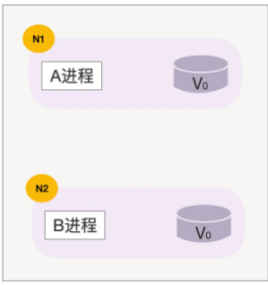
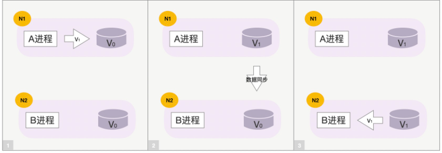
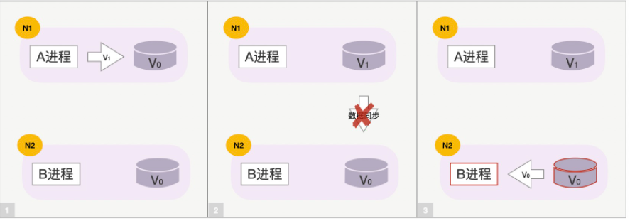
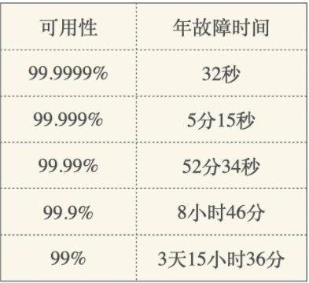
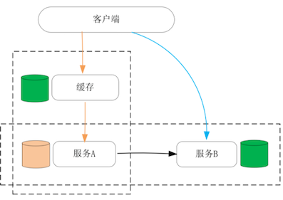
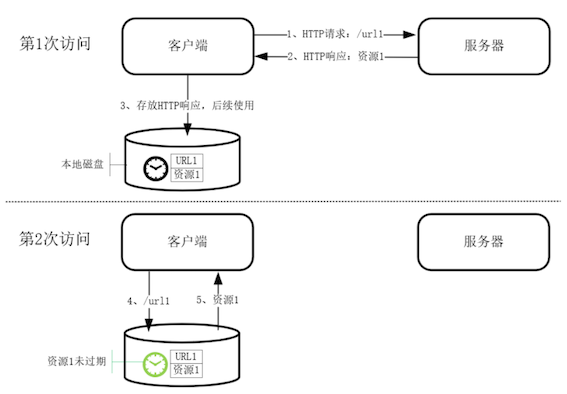
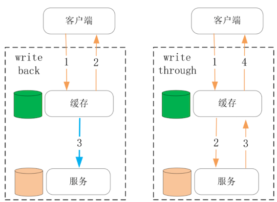
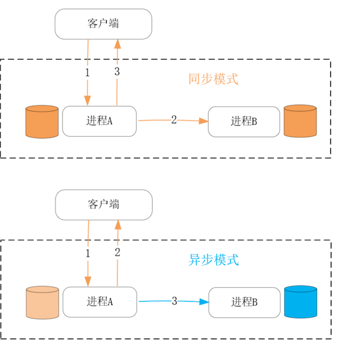

# **第二节 舍弃一致性去换取性能的CAP理论**

进程的性能必然受制于一台服务器上各硬件的处理能力上限。如果需要进一步地提升服务性能，那只有整合多台主机组成分布式系统才能办到。

当多台主机通过网络协同处理用户请求时，如果主机上的进程含有数据状态，那么必然需要在多台主机之间跨网络同步数据，由于网络存在时延，也并不稳定，因此不可靠的数据同步操作将会增加请求的处理时延。

**CAP 理论指出，当数据同时存放在多个主机上时，可用性与一致性是不可兼得的。**

根据 CAP 的指导性思想，我们可以通过牺牲一致性，来提升可用性中的核心因素：性能。当然，在实践中对一致性与性能并不是非黑即白的选择，而是从概率上进行不同程度的取舍。

## **1、如何权衡性能与一致性？**

首先，**针对的是有状态服务的性能优化**。所谓有状态服务，是指进程会在处理完请求后，仍然保存着影响下次请求结果的用户数据，而无状态服务则只从每个请求的输入参数中获取数据，在请求处理完成后并不保存任何会话信息。

因此，无状态服务拥有最好的可伸缩性，但涉及数据持久化时，则必须由有状态服务处理，这是 CAP 理论所要解决的问题。

什么是 CAP 理论呢？这是 2000 年University of California, Berkeley 的计算机教授Eric Brewer（也是谷歌基础设施 VP）提出的理论。所谓 CAP，是以下 3 个单词的首字母缩写，它们都是分布式系统最核心的特性：

* **C**onsistency 一致性
* **A**vailability 可用性
* **P**artition tolerance 分区容错性

3 张示意图，快速理解下这 3 个词的意义。下图中 N1、N2 两台主机上运行着 A 进程和 B 进程，它们操作着同一个用户的数据（数据的初始值是 V0），这里 N1 和 N2 主机就处于不同的 Partition 分区中，如下所示：

正常情况下，当用户请求到达 N1 主机上的 A 进程，并将数据 V0 修改为 V1 后，A 进程将会把这一修改行为同步到 N2 主机上的 B 进程，**最终 N1、N2 上的数据都是 V1，这就保持了系统的 Consistency 一致性**。

然而，一旦 N1 和 N2 之间网络异常，数据同步行为就会失败。

这时，N1 和 N2 之间数据不一致，如果我们希望在分区间网络不通的情况下，N2 能够继续为用户提供服务，就必须容忍数据的不一致，此时系统的 Availability 可用性更高，**系统的并发处理能力更强，比如 Cassandra 数据库**。

反之，如果 A、B 进程一旦发现数据同步失败，那么 B 进程自动拒绝新请求，**仅由 A 进程独立提供服务，那么虽然降低了系统的可用性**，但保证了更强的一致性，比如 MySQL 的主备同步模式。

当然，可用性是一个很大的概念，它描述了分布式系统的持续服务能力，如下表所示：

当用户、流量不断增长时，系统的性能将变成衡量可用性的关键因素。当希望拥有更强的性能时，就不得不牺牲数据的一致性。当然，一致性并不是只有是和否这两种属性，既可以从时间维度上设计短暂不一致的同步模型，也可以从空间维度上为不含有因果、时序关系的用户数据设计并发模型。

**在学术上，通常会按照 2 个维度对一致性模型分类。**

首先是从数据出发设计出的一致性模型，比如顺序一致性必须遵照读写操作的次序来保持一致性，而弱一些的因果一致性则允许不具备因果关系的读写操作并发执行。

其次是从用户出发设计出的一致性模型，比如单调读一致性保证客户端不会读取到旧值，而单调写一致性则保证写操作是串行的。

**实际工程中一致性与可用性的边界会模糊很多，因此又有了最终一致性这样一个概念**，这个“最终”究竟是多久，将由业务特性、网络故障率等因素综合决定。伴随最终一致性的是 BASE 理论：

* Basically Available 基本可用性
* Soft state 软状态
* Eventually consistent 最终一致性

## **2、怎样舍弃一致性提升性能？**

服务的性能，主要体现在**请求的时延**和**系统的并发性**这两个方面，而它们都与上面提到的最终一致性有关。

这样，**在纵向上在离客户端更近的位置增加数据的副本**，并把它存放在处理速度更快的物理介质上，就可以作为缓存降低请求的时延；

**而在横向上对数据增加副本**，并在这些主机间同步数据，这样工作在数据副本上的进程也可以同时对客户端提供服务，这就增加了系统的并发性，如下图所示：

看纵向上的缓存，是如何在降低请求处理时延时，保持最终一致性的

缓存可以由读、写两个操作触发更新，例如 HTTP 私有缓存，就是工作在浏览器上基于读操作触发的缓存。

工作在代理服务器上的 HTTP 共享缓存，也是由读操作触发的。这些缓存与源服务器上的数据最终是一致的，但在 CacheControl 等 HTTP 头部指定的时间内，缓存完全有可能与源数据不同，这就是牺牲一致性来提升性能的典型例子。

事实上，也有很多以写操作触发缓存更新的设计，它们通常又分**为 write back 和 write through 两种模式**。

**write back 牺牲了更多的一致性，但带来了更低的请求时延。比如 Linux 磁盘高速缓存就采用了 write back 这种设计，它虽然是单机内的一种缓存设计，但在分布式系统中缓存的设计方式也是一样的。**

**write through 会在更新数据成功后再更新缓存，虽然带来了很好的一致性，但写操作的时延会更久**

如下图所示：

**write through 的一致性非常好是首选设计。**

然而，一旦缓存到源数据的路径很长、延时很高的时候，就值得考虑 write back 模式，此时一致性模型虽然复杂了许多，但可以带来显著的性能提升。**比如机械磁盘相对内存延时高了很多，因此磁盘高速缓存会采用 write back 模式。**

虽然缓存也可以在一定程度上增加系统的并发处理连接，但这更多是缘于缓存采用了更快的算法以及存储介质带来的收益。

从水平方向上，在更多的主机上添加数据副本，并在其上用新的进程提供服务，这才是提升系统并发处理能力最有效的手段。

此时，进程间同步数据主要包含两种方式：**同步方式以及异步方式**，前者会在每个更新请求完成前，将数据成功同步到每个副本后，请求才会处理完成，而后者则会在处理完请求后，才开始异步地同步数据到副本中，如下图所示：

同步方式下系统的一致性最好，但由于请求的处理时延包含了副本间的通讯时长，所以性能并不好。

而异步方式下系统的一致性要差，特别是在主进程宕机后，副本上的进程很容易出现数据丢失，但异步方式的性能要好得多，这不只由于更新请求的返回更快，而且异步化后主进程可以基于合并、批量操作等技巧，进行效率更高的数据同步。

比如 MySQL 的主备模式下，默认就使用异步方式同步数据，当然你也可以改为同步方式，包括 `Full-synchronous Replication`（同步所有数据副本后请求才能返回）以及 `Semi-synchronous Replication`（仅成功同步 1 个副本后请求就可以返回）两种方式。

当然，在扩容、宕机恢复等场景下，副本之间的数据严重不一致，如果仍然基于单个操作同步数据，时间会很久，性能很差。此时应结合定期更新的 Snapshot 快照，以及实时的 `Oplog` 操作日志，协作同步数据，这样效率会高很多。

其中，快照是截止时间 T0 时所有数据的状态，而操作日志则是 T0 时间到当下 T1 之间的所有更新操作，这样，副本载入快照恢复至 T0 时刻的数据后，再通过有限的操作日志与主进程保持一致。

## **3、本节小结**

CAP 理论指出，可用性、分区容错性、一致性三者只能取其二，因此当分布式系统需要服务更多的用户时，只能舍弃一致性，换取可用性中的性能因子。

当然，性能与一致性并不是简单的二选一，而是需要你根据网络时延、故障概率设计出一致性模型，在提供高性能的同时，保持时间、空间上可接受的最终一致性。

具体的设计方法，可以分为纵向上添加缓存，横向上添加副本进程两种做法。对于缓存的更新，write through 模式保持一致性更容易，但写请求的时延偏高，而一致性模型更复杂的 write back 模式时延则更低，适用于性能要求很高的场景。

提升系统并发性可以通过添加数据副本，并让工作在副本上的进程同时对用户提供服务。

副本间的数据同步是由写请求触发的，其中包括同步、异步两种同步方式。异步方式的最终一致性要差一些，但写请求的处理时延更快。在宕机恢复、系统扩容时，采用快照加操作日志的方式，系统的性能会好很多。