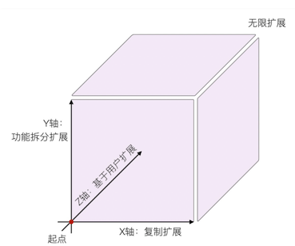
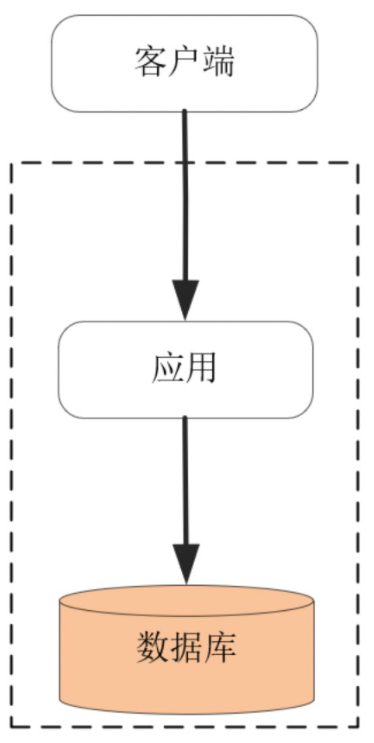
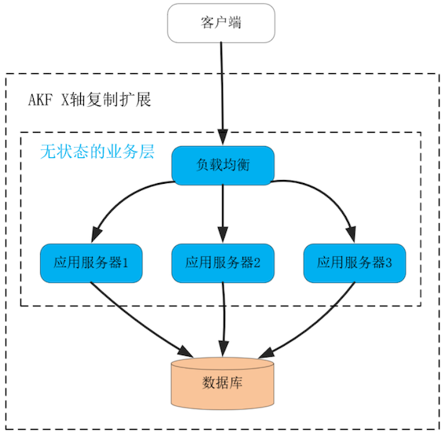
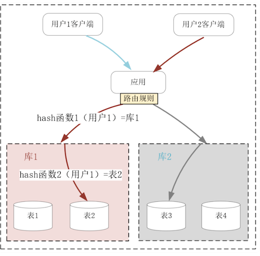
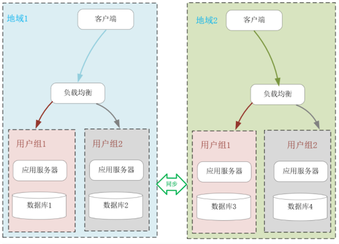

# **第三节 AKF立方体可扩展性来提高性能**

在面对 Scalability 可伸缩性问题时，我们必须有一个系统的方法论，才能应对日益复杂的分布式系统。这一讲我将介绍 AKF 立方体理论，它定义了扩展系统的 3 个维度，我们可以综合使用它们来优化性能。 

## **1、如何基于 AKF X 轴扩展系统？**

AKF 立方体也叫做[scala cube](https://en.wikipedia.org/wiki/Scale_cube)，它在《The Art of Scalability》一书中被首次提出，旨在提供一个系统化的扩展思路。AKF 把系统扩展分为以下三个维度：

* X 轴：直接水平复制应用进程来扩展系统。
* Y 轴：将功能拆分出来扩展系统。
* Z 轴：基于用户信息扩展系统。

如下图所示：

假定我们开发一个博客平台，用户可以申请自己的博客帐号，并在其上发布文章。最初的系统考虑了 MVC 架构，将数据状态及关系模型交给数据库实现，应用进程通过 SQL 语言操作数据模型，经由 HTTP 协议对浏览器客户端提供服务，如下图所示：

在这个架构中，处理业务的应用进程属于无状态服务，用户数据全部放在了关系数据库中。因此，当我们在应用进程前加 1 个负载均衡服务后，就可以通过部署更多的应用进程，提供更大的吞吐量。

而且，初期增加应用进程，RPS 可以获得线性增长，很实用。

这就叫做沿 AKF X 轴扩展系统。这种扩展方式最大的优点，就是开发成本近乎为零，而且实施起来速度快！在搭建好负载均衡后，只需要在新的物理机、虚拟机或者微服务上复制程序，就可以让新进程分担请求流量，而且不会影响事务 Transaction 的处理。

**AKF X 轴扩展最大的问题是只能扩展无状态服务，当有状态的数据库出现性能瓶颈时，X 轴是无能为力的**

例如，当用户数据量持续增长，关系数据库中的表就会达到百万、千万行数据，SQL 语句会越来越慢，这时可以沿着 AKF Z 轴去分库分表提升性能。又比如，当请求用户频率越来越高，那么可以把单实例数据库扩展为主备多实例，沿 Y 轴把读写功能分离提升性能。

## **2、如何基于 AKF Y 轴扩展系统？**

当数据库的 CPU、网络带宽、内存、磁盘 IO 等某个指标率先达到上限后，系统的吞吐量就达到了瓶颈，此时沿着 AKF X 轴扩展系统，是没有办法提升性能的。

在现代经济中，更细分、更专业的产业化、供应链分工，可以给社会带来更高的效率，而 AKF Y 轴与之相似，当遇到上述性能瓶颈后，**拆分系统功能，使得各组件的职责、分工更细，也可以提升系统的效率。**

比如，当我们将应用进程对数据库的读写操作拆分后，就可以扩展单机数据库为主备分布式系统，使得主库支持读写两种 SQL，而备库只支持读 SQL。这样，主库可以轻松地支持事务操作，且它将数据同步到备库中也并不复杂，如下图所示：

当然，上图中如果读性能达到了瓶颈，我们可以继续沿着 AKF X 轴，用复制的方式扩展多个备库，提升读 SQL 的性能，可见，AKF 多个轴完全可以搭配着协同使用。

拆分功能是需要重构代码的，它的实施成本比沿 X 轴简单复制扩展要高得多。在上图中，通常关系数据库的客户端 SDK 已经支持读写分离，所以实施成本由中间件承担了，这对我们理解 Y 轴的实施代价意义不大，所以我们再来看从业务上拆分功能的例子。

当这个博客平台访问量越来越大时，一台主库是无法扛住所有写流量的。因此，基于业务特性拆分功能，就是必须要做的工作。比如，把用户的个人信息、身份验证等功能拆分出一个子系统，再把文章、留言发布等功能拆分到另一个子系统，由无状态的业务层代码分开调用，并通过事务组合在一起，如下图所示：

这样，每个后端的子应用更加聚焦于细分的功能，它的数据库规模会变小，也更容易优化性能。比如，针对用户登录功能，你可以再次基于 Y 轴将身份验证功能拆分，用 Redis 等服务搭建一个基于 LRU 算法淘汰的缓存系统，快速验证用户身份。

然而，沿 Y 轴做功能拆分，实施成本非常高，需要重构代码并做大量测试工作，上线部署也很复杂。比如上例中要对数据模型做拆分（如同一个库中的表拆分到多个库中，或者表中的字段拆到多张表中），设计组件之间的 API 交互协议，重构无状态应用进程中的代码，为了完成升级还要做数据迁移，等等。

## **3、如何基于 AKF Z 轴扩展系统？**

不同于站在服务角度扩展系统的 X 轴和 Y 轴，**AKF Z 轴则从用户维度拆分系统，它不仅可以提升数据持续增长降低的性能，还能基于用户的地理位置获得额外收益。**

仍然以上面虚拟的博客平台为例，当注册用户数量上亿后，无论你如何基于 Y 轴的功能去拆分表（即“垂直”地拆分表中的字段），都无法使得关系数据库单个表的行数在千万级以下，这样表字段的 B 树索引非常庞大，难以完全放在内存中，最后大量的磁盘 IO 操作会拖慢 SQL 语句的执行。

这个时候，关系数据库最常用的分库分表操作就登场了，它正是 AKF 沿 Z 轴拆分系统的实践。比如已经含有上亿行数据的 User 用户信息表，可以分成 10 个库，每个库再分成 10 张表，利用固定的哈希函数，就可以把每个用户的数据映射到某个库的某张表中。这样，单张表的数据量就可以降低到 1 百万行左右，如果每个库部署在不同的服务器上（具体的部署方式视访问吞吐量以及服务器的配置而定），它们处理的数据量减少了很多，却可以独占服务器的硬件资源，性能自然就有了提升。如下图所示：

**分库分表是关系数据库中解决数据增长压力的最有效办法，但分库分表同时也导致跨表的查询语句复杂许多，而跨库的事务几乎难以实现，因此这种扩展的代价非常高。**

当然，如果你使用的是类似 MySQL 这些成熟的关系数据库，整个生态中会有厂商提供相应的中间件层，使用它们可以降低 Z 轴扩展的代价。

**再比如，最开始我们采用 X 轴复制扩展的服务，它们的负载均衡策略很简单，只需要选择负载最小的上游服务器即可，比如 RoundRobin 或者最小连接算法都可以达到目的。**

但若上游服务器通过 Y 轴扩展，开启了缓存功能，那么考虑到缓存的命中率，就必须改用 Z 轴扩展的方式，基于用户信息做哈希规则下的新路由，尽量将同一个用户的请求命中相同的上游服务器，才能充分提高缓存命中率。

Z 轴扩展还有一个好处，就是可以充分利用 IDC 与用户间的网速差，选择更快的 IDC 为用户提供高性能服务。网络是基于光速传播的，当 IDC 跨城市、国家甚至大洲时，用户访问不同 IDC 的网速就会有很大差异。当然，同一地域内不同的网络运营商之间，也会有很大的网速差。

例如你在全球都有 IDC 或者公有云服务器时，就可以通过域名为当地用户就近提供服务，这样性能会高很多。事实上，**CDN 技术就基于 IP 地址的位置信息，就近为用户提供静态资源的高速访问**。

用了 2 种 Z 轴扩展系统的方式。首先是基于客户端的地理位置，选择不同的 IDC 就近提供服务。其次是将不同的用户分组，比如免费用户组与付费用户组，这样在业务上分离用户群体后，还可以有针对性地提供不同水准的服务。

沿 AKF Z 轴扩展系统可以解决数据增长带来的性能瓶颈，也可以基于数据的空间位置提升系统性能，然而它的实施成本比较高，尤其是在系统宕机、扩容时，一旦路由规则发生变化，会带来很大的数据迁移成本，

## **4、本节小结**

**X 轴扩展系统时实施成本最低，只需要将程序复制到不同的服务器上运行，再用下游的负载均衡分配流量即可。**	X 轴只能应用在无状态进程上，故无法解决数据增长引入的性能瓶颈。

**Y 轴扩展系统时实施成本最高，通常涉及到部分代码的重构，但它通过拆分功能，使系统中的组件分工更细，因此可以解决数据增长带来的性能压力**，也可以提升系统的总体效率。**比如关系数据库的读写分离、表字段的垂直拆分，或者引入缓存，都属于沿 Y 轴扩展系统。**

**Z 轴扩展系统时实施成本也比较高，但它基于用户信息拆分数据后，可以在解决数据增长问题的同时，基于地理位置就近提供服务，进而大幅度降低请求的时延**，比如常见的 CDN 就是这么提升用户体验的。**但 Z 轴扩展系统后，一旦发生路由规则的变动导致数据迁移时，运维成本就会比较高**。