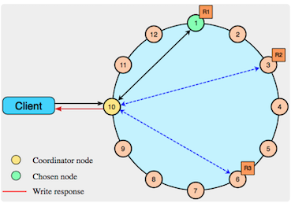
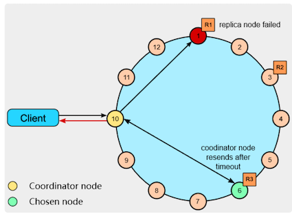
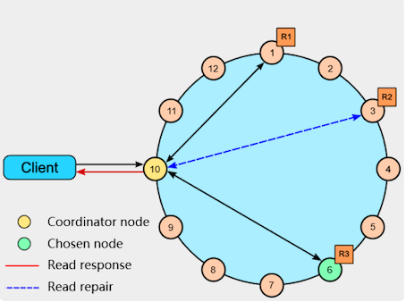
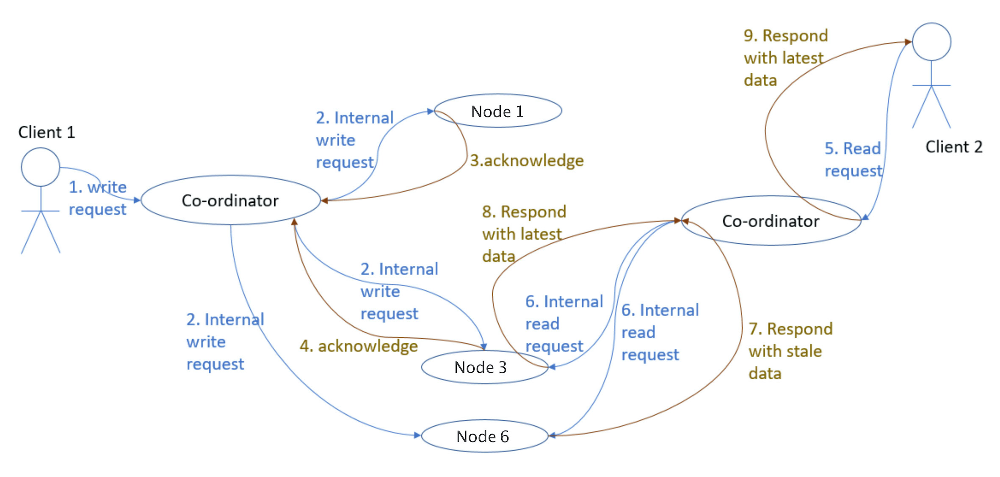
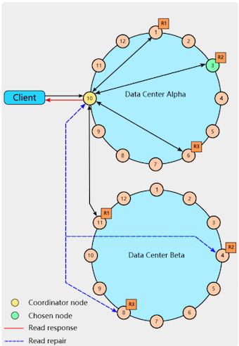

# **第四节 NWR算法修改读写模型以提升性能**


数据库的扩展时，写请求仍然在操作中心化的 Master 单点，这在很多业务场景下都是不可接受的。这一讲将介绍对于无单点的去中心化系统非常有用的 NWR 算法，它可以灵活地平衡一致性与性能。

在单机上部署数据库，一旦性能到达瓶颈，我们可以基于 AKF Y 轴将读写分离，这样多个 Slave 从库将读操作分流后，写操作就可以独享 Master 主库的全部性能。

然而主库作为中心化的单点，一旦宕机，未及时同步到从库的数据就有可能丢失。而且，这一架构下，主库的故障还会导致整个系统瘫痪。

去中心化系统中没有“Master 主库”这一概念，数据存放在多个 Replication 冗余节点上，且这些节点间地位均等，所以没有单点问题。

为了保持强一致性，系统可以要求修改数据时，必须同时写入所有冗余节点，才能向客户端返回成功。但这样系统的可用性一定很成问题，毕竟大规模分布式系统中，出现故障是常态，写入全部节点的操作根本无法容错，任何 1 个节点宕机都会造成写操作失败。而且，同步节点过多也会导致写操作性能低下


**NWR 算法提供了一个很棒的读写模型，可以解决上述问题。这里的“NWR”，是指在去中心化系统中将 1 份数据存放在 N 个节点上，每次操作时，写 W 个节点、读 R 个节点，只要调整 W、R 与 N 的关系，就能动态地平衡一致性与性能**。

NWR 在 NoSQL 数据库中有很广泛的应用，比如 Amazon 的 Dynamo 和开源的 Cassandra，这些数据库往往跨越多个 IDC 数据中心，包含成千上万个物理机节点，适用于海量数据的存储与处理。

[分布式键值存储 Dynamo 的实现原理](https://github.com/Chao-Xi/JacobTechBlog/blob/master/Database/dydb1.md)

## **1、从鸽巢原理到 NWR 算法**

NWR 算法是由鸽巢原理得来的：如果 10 只鸽子放入 9 个鸽巢，那么有 1 个鸽巢内至少有 2 只鸽子，这就是鸽巢原理

**鸽巢原理告诉我们，只要哈希函数输入主键的值范围大于输出索引，出现冲突的概率就一定大于 0；只要存放元素的数量超过哈希桶的数量，就必然会发生冲突。**

基于鸽巢原理，David K. Gifford 在 1979 年首次提出了[Quorum 算法](https://en.wikipedia.org/wiki/Quorum_(distributed_computing))（参见《[Weighted Voting for Replicated Data](https://dl.acm.org/doi/epdf/10.1145/800215.806583)》论文），解决去中心化系统冗余数据的一致性问题。

而 Quorum 算法提出，如果冗余数据存放在 N 个节点上，且每次写操作成功写入 W 个节点（其他 `N - W` 个节点将异步地同步数据），而读操作则从 R 个节点中选择并读出正确的数据，**<span style="color:red">只要确保 `W + R > N`，同 1 条数据的读、写操作就不能并发执行，这样客户端就总能读到最新写入的数据。特别是当 `W > N/2` 时，同 1 条数据的修改必然是顺序执行的</span>**。


**这样，分布式系统就具备了强一致性，这也是 NWR 算法的由来。**


比如，若 N 为 3，那么设置 W 和 R 为 2 时，在保障系统强一致性的同时，还允许 3 个节点中 1 个节点宕机后，系统仍然可以提供读、写服务，这样的系统具备了很高的可用性。

**当然，R 和 W 的数值并不需要一致，如何调整它们，取决于读、写请求数量的比例。比如当 N 为 5 时，如果系统读多写少时，可以将 W 设为 4，而 R 设为 2，这样读操作的性能会更好。**


NWR 算法最早应用在 Amazon 推出的Dynamo 数据库中，你可以参见 2007 年 Amazon 发表的[《Dynamo: Amazon’s Highly Available Key-value Store》](https://www.allthingsdistributed.com/files/amazon-dynamo-sosp2007.pdf)论文。

2008 年 Dynamo 的作者 Avinash Lakshman 跳槽到 FaceBook，开发了 Dynamo 的开源版数据库Cassandra，它是目前最流行的 NoSQL 数据库之一，在 Apple、Netflix、360 等公司得到了广泛的应用。想必你对 NWR 算法的很多细节并不清楚，那么接下来我们以 Cassandra 为例，看看 NWR 是如何应用在实际工程中的。

## **2、Cassandra 数据库是如何使用 NWR 算法的？**

1 个 Cassandra 分布式系统可以由多个 IDC 数据中心、数万个服务器节点构成，这些节点间使用 RPC 框架通信

由于 Cassandra 推出时 gRPC 还没有诞生，**因此它使用的是性能相对较低的 `Thrift RPC` 框架（Thrift 的优点是支持的开发语言更多）**。

**同时，Cassandra 虽然使用宽列存储模型（每行最多可以包含20 亿列数据），但数据的分布是基于行 Key 进行的，它和 Dynamo 一样使用了一致性哈希算法，将 Key 对应的数据存储在多个节点中**

Cassandra 对客户端提供一种类 SQL 的CQL 语言，你可以使用下面这行 CQL 语句设定数据存储的冗余节点个数，**也就是 NWR 算法中的 N（也称为 Replication Factor）**：

```
CREATE KEYSPACE excalibur
  WITH REPLICATION = {'class' : 'NetworkTopologyStrategy', 'dc1' : 3};
```

上面这行 CQL 语句设置了每行数据在数据中心 DC1 中存储 3 份冗余，即 N = 3，接下来我们通过下面的 CQL 语句，将读 R、写 W 的节点数都设置为 1：

```
cqlsh> CONSISTENCY ONE
Consistency level set to ONE.
cqlsh> CONSISTENCY
Current consistency level is ONE.
```

**此时，Cassandra 的性能最高，但达成最终一致性的耗时最长，丢数据风险也最大。**

如果业务上对丢失少量数据不太在意，可以采用这种模型。此时修改数据时，客户端会并发地向 3 个存储节点写入数据，但只要 1 个节点返回成功，Cassandra 就会向客户端返回写入成功，如下图所示：



系统由 12 个主机节点构成，由于数据采用一致性哈希算法分片，故构成了一个节点环。

其中，本次写入的数据被分布到 1、3、6 这 3 个节点中存储。**客户端可以随机连接到系统中的任何一个节点访问 Cassandra，此时该节点被称为 Coordinator Node，由它根据 NWR 的值来选择一致性模型，访问存储节点。**

再来看读取数据的流程。下图中，作为 Coordinator Node 的节点 10 首先试图读取节点 1 中的数据，**但发现节点 1 已经宕机，于是改选节点 6 并获取到数据，由于 R = 1 于是立刻向客户端返回成功。**



**如果我们将 R、W 都设置成 2，这就满足了 `R + W > N(3) `的场景，此时系统具备了强一致性。**

客户端读写数据时，必须有 2 个节点返回，才算操作成功。比如下图中读取数据时，只有接收到节点 1、节点 6 的返回，操作才算成功。



蓝色线叫做 Read repair，如果节点 3 上的数据不一致，那么本次读操作可以将它修复为正确的数据。说完正常场景，我们再来看当一个节点出现异常时，NWR 是如何保持强一致性的。

下图中，客户端 1 在第 2 步，同时向 3 个存储节点写入了数据，由于节点 1、3 返回成功，所以写入操作实际已经完成了，但是节点 6 由于网络故障，却一直没有收到 Coordinator Node 发来的写入操作。

在强一致性的约束下，客户端 2 在第 5 步发起的读请求，必须能获取到第 2 步写入的数据。然而，客户端 2 连接的 Coordinator Node 与客户端 1 不同，它选择了节点 3 和节点 6，这两个节点上的数据并不一致。

**根据不同的 timestamp 时间戳，Coordinator Node 发现节点 3 上的数据才是最后写入的数据，因此选择其上的数据返回客户端。这也叫 `Last-Write-Win` 策略。**



Cassandra 提供了一个简单的方法，用于设置读写节点数量都过半，满足强一致性的要求，如下所示：

```
cqlsh> CONSISTENCY QUORUM
Consistency level set to QUORUM.
cqlsh> CONSISTENCY
Current consistency level is QUORUM.
```

读取数据时，这 2 个 IDC 内必须由 4 个存储节点返回数据，才满足 QUORUM 一致性的要求。下图中，Coordinator Node 获取到了 IDC Alpha 中节点 1、3、6 的返回，以及 IDC Beta 中节点 11 的返回，就可以基于 timestamp 时间戳选择最新的数据返回客户端。而且 Coordinator Node 会并发地发起 Read repair，试图修复 IDC Beta 中可能存在不一致的节点 4 和 8。



Cassandra 还有许多一致性模型，比如 LOCAL_QUORUM 只要求本地 IDC 内有多数节点响应即可，而 EACH_QUORUM 则要求每个 IDC 内都必须有多数节点返回成功（注意，这与上图中 IDC Alpha 中有 3 个节点返回，而 IDC Beta 则只有 1 个节点返回的 QUORUM 是不同的）


## **3、本节小结**

当鸽子的数量超过了鸽巢后，就要注定某一个鸽巢内一定含有两只以上的鸽子，同样的道理，只要读、写操作涉及的节点超过半数，就注定读写操作总包含一个含有正确数据的节点。**NWR 算法将这一原理一般化为：只要读节点数 R + 写节点数 W > 存储节点数 N，特别是 W > N/2 时，就能使去中心的分布式系统获得强一致性。**


支持上万节点的 Cassandra 数据库，就使用了 NWR 算法来保持一致性。当然，Cassandra 支持多种一致性模型，**当你需要更强劲的性能时，你可以令 R + W < N，当业务变化导致需要增强系统的一致性时，你可以实时地修改 R、W。Cassandra 也支持跨数据中心部署，此时的一致性模型更为复杂，但仍然将 NWR 算法作为实现基础。**