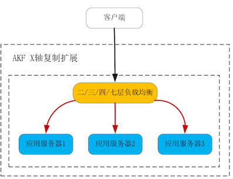
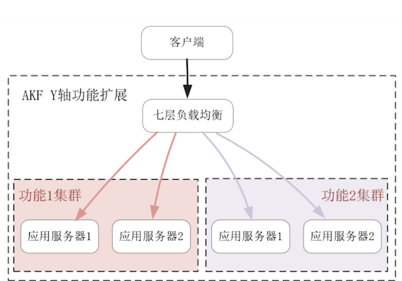
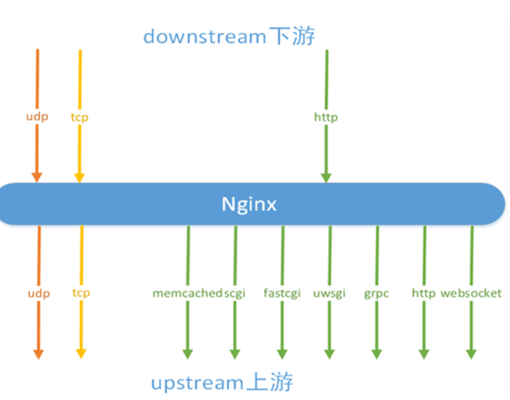
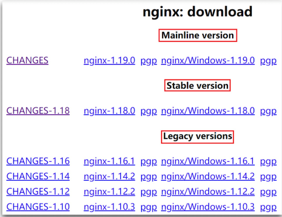
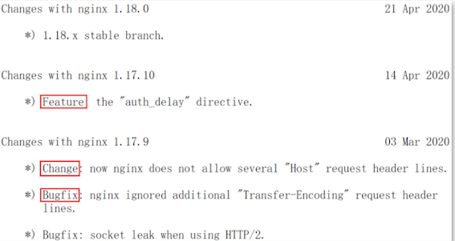

# **第五节 负载均衡：选择Nginx还是OpenResty**

负载均衡通过将流量分发给新增的服务器，提升了系统的性能。

因此，对负载均衡最基本的要求，就是它的吞吐量要远大于上游的应用服务器，否则扩展能力会极为有限。因此，目前性能最好的 Nginx，以及在 Nginx 之上构建的 OpenResty，通常是第一选择。

系统接入层的负载均衡，常通过 Waf 防火墙承担着网络安全职责，系统内部的负载均衡则通过权限、流量控制等功能承担着 API 网关的职责，CDN 等边缘节点上的负载均衡还会承担边缘计算的任务。  


Nginx 完全符合上述要求，它性能一流而且非常稳定。

从 2004 年诞生之初，Nginx 的模块化设计就未改变过，这样 16 年来累积下的各种 Nginx 模块都可以复用。它的[2-clause BSD-like license](https://opensource.org/licenses/BSD-2-Clause) 源码许可协议极其开放，即使修改源码后仍然可作商业用途，因此 Nginx 之上延伸出了 TEngine、OpenResty、Kong 等生态，这大大扩展了 Nginx 的能力边界。

Nginx 以及建立了 Lua 语言生态的 OpenResty 为例，看看负载均衡是怎样扩展系统的，以及 Nginx 和同源的 OpenResty 有何不同。

## **2、负载均衡是如何扩展系统提升性能的？**

### **2-1 AKF 立方体 X 轴扩展系统**

通过 AKF 立方体 X 轴扩展系统时，负载均衡只需要能够透传协议，并选择负载最低的上游应用作为流量分发对象即可。

这样，三层（网络层）、四层（传输层）负载均衡都可用于扩展系统，甚至在单个局域网内你还可以使用二层（数据链路层）负载均衡

其中，分发流量的路由算法既可以使用 RoundRobin 轮转算法，也可以基于 TCP 连接或者 UDP Session 使用最少连接数算法，如下图所示：




### **2-2 AKF Y 轴扩展系统**

于 AKF Y 轴扩展系统时，负载均衡必须根据功能来分发请求，也就是说它必须解析完应用层协议，才能明白这是什么请求。

因此，如 LVS 这样工作在三层和四层的负载均衡就无法满足需求了，我们需要 Nginx 这样的七层（应用层）负载均衡，它能够从请求中获取到描述功能的关键信息，并以此为依据路由请求。

比如当 HTTP 请求中的 URL 描述功能时，Nginx 就可以用 location 匹配 URL，再基于 location 来路由请求，如下图所示




### **2-3 AKF Z 轴扩展时**

如果只是使用了网络报文中的源 IP 地址，那么三层、四层负载均衡都能胜任。然而如果需要帐号、访问对象等用户信息扩展系统，仍然只能使用七层负载均衡从请求中获得。比如，Nginx 可以通过 $ 变量获取到 URL 参数或者 HEADER 头部的值，再以此作为路由算法的输入参数。

**因此，七层负载均衡是分布式系统提升性能的必备工具。**

除了基于各种路由策略分发流量，提高性能及可用性（如宕机迁移）外，负载均衡还需要完成上、下游协议间的适配、转换。例如考虑到信息安全，**跑在公网上的外部协议常基于 TLS/SSL 协议，而在效率优先的企业内网中，一般不会使用大幅降低性能的 TLS 协议，因此负载均衡需要拥有卸载或者装载 TLS 层的能力。**


下游客户端多样且难以保持一致（比如 IE6 这个古董浏览器仍然存在于当下的互联网中），因此常使用 HTTP 协议与服务器通讯，而上游组件则依据开发团队或者系统架构的特点，会选择 CGI、uWSGI、gRPC 等协议，这样负载均衡还得拥有转换各种协议的功能。Nginx 可以通过反向代理模块，轻松适配各类协议，如下所示（通过 stream 模块，Nginx 也支持四层负载均衡）：



从性能角度，Nginx 支持 C10M 级别的并发连接。

从功能角度，良好的模块化设计，使得 Nginx 可以完成各类协议的适配，不只包括第 3 部分课程介绍过的通用协议，甚至支持 Redis、MySQL 等专有协议。因此，Nginx 是目前最好用的负载均衡。


## **3、Nginx 与 OpenResty 的差别在哪里？**


首先看版本差异。当你在[官网下载](http://nginx.org/en/download.html) Nginx 时，会发现有 3 类版本：Mainline、Stable 和 Legacy。其中，Mainline 是单号版本，**它是含有最新功能的主线版本，迭代速度最快。Stable 是 mainline 版本稳定运行一段时间后，将单号大版本转换为双号的稳定版本**，比如 1.18.0 就是由 1.17.10 转换而来。Legacy 则是曾经的稳定版本，如下图所示：



你可以通过源代码中的 CHANGES 文件，通过 4 种不同类型的变更查看版本间的差异，包括：

* 表示新功能的 **Feature**，比如下图中 HTTP 服务新增的 `auth_delay` 指令。
* 表示已修复问题的 `Bugfix`。
* 表示已知特性变更的 `Change`，比如 `Nginx` 曾经允许 HTTP 请求头部中出现多个 Host 头部，但在 1.17.9 这个 Change 之后，这类 HTTP 请求将作为非法请求处理。
* 表示安全升级的 **Security**，比如 1.15.6 版本就修复了 CVE-2018-16843 等 3 个安全问题。



当你安装好了 OpenResty 或者 Nginx 后，你可以通过 nginx -v 命令查看它们的版本。你会发现，**2014 年以后发布的 OpenResty 都是运行在单号 Mainline 版本上的**：

```
# /usr/local/nginx/sbin/nginx -v
nginx version: nginx/1.18.0
# /usr/local/openresty/nginx/sbin/nginx -v
nginx version: openresty/1.15.8.3
```

OpenResty 并没有修改 Nginx 的源代码，为什么不能由用户在官方 Nginx 上自行添加 C 模块，实现 OpenResty 的安装呢？

这源于部分 OpenResty C 模块，没有按照 Nginx 架构指定的顺序添加到模块列表中，而且它们的编译环境也过于复杂。因此，OpenResty 放弃了 Nginx 官方的 configure 文件，用户需要使用 OpenResty 改造过的 configure 脚本编译 Nginx。

再来看模块间的差异。如果你留意 OpenResty 与 Nginx 间二进制文件的体积，会发现使用默认配置时，OpenResty 的可执行文件大了 5 倍，如下所示：

```
# ls -s --block-size=1 /usr/local/openresty/nginx/sbin/nginx 
16437248 /usr/local/openresty/nginx/sbin/nginx
# ls -s --block-size=1 /usr/local/nginx/sbin/nginx 
3851568 /usr/local/openresty/nginx/sbin/nginx
```

这由 2 个原因所致。

首先，官方 Nginx 提供的四层负载均衡功能（由 18 个 STREAM 模块实现）、TLS 协议处理功能，默认都是不添加到 Nginx 中的，

而 OpenResty 的 configure 脚本将其改为了默认模块。当然，如果你在编译官方 Nginx 时，加入以下选项：

```
./configure --with-stream --with-stream_ssl_module --with-stream_ssl_preread_module --with-http_ssl_module
```

那么从官方模块上，Nginx 就与 OpenResty 完全一致了，此时再观察二进制文件的体积，会发现它翻了一倍：

```
# ls -s --block-size=1 /usr/local/openresty/nginx/sbin/nginx 
6999144 /usr/local/openresty/nginx/sbin/nginx
```

其次，OpenResty 添加了近 20 个第三方 C 模块，除了支持 Lua 语言的 2 个模块外，还有支持 Redis、Memcached、MySQL 等服务的模块。这些模块编译时，还需要链接依赖的软件库，因此它们又将 Nginx 可执行文件的体积增加了 1 倍多。

除版本、模块外，OpenResty 与 Nginx 间还有一些小的差异，比如 Nginx 使用了 GCC 编译器的 -O1 优化参数，而 OpenResty 则使用了 -O2 优化参数。再比如，官方 Nginx 最新版本的 Makefile 支持 upgrade 参数，简化了热升级操作。当然，这些小改动并不重要，只要修改 configure 脚本就能做到。

**到底该如何在二者中选择呢？我认为，如果不使用 Lua 语言，那么我建议使用 Nginx。**

**官方 Nginx 的 Stable 版本更稳定，可执行文件的体积也更小。如果你需要使用 OpenResty、TEngine 中的部分 C 模块，可以通过`–add-module` 选项将其加入到官方 Nginx 中。**


注意，Lua 语言给你带来极大灵活性的同时，也会引入许多不确定性。比如，如果你调用了会导致进程休眠的 Lua 阻塞函数（比如封装了系统调用的原生 Lua 库，或者第三方服务提供的同步 SDK），将会导致 Nginx 正在处理数万并发请求的 C 模块同时进入休眠，从而让服务的性能大幅度下降。

## **4、本节小结**

负载均衡的工作方式，以及 Nginx、OpenResty 这两个最流行的负载均衡之间的异同。

任何负载均衡都能从 AKF X 轴水平扩展系统，但只有能够解析应用层协议，获取到请求的功能、用户身份、访问对象等信息，才能够沿 AKF Y 轴、Z 轴全方位扩展系统。因此，七层负载均衡是分布式系统提升性能的利器。

Nginx 的开放式架构允许第三方模块通过 10 多个钩子函数，在不同的生命周期中处理请求。同时，还允许 C 模块自行解析 nginx.conf 配置文件。这样，OpenResty 就通过 2 个 C 模块，将 Lua 代码用 LuaJIT 编译到 Nginx 中执行，并通过 FFI 技术将 C 函数暴露给 Lua 代码。这就是 OpenResty 允许 Lua 语言与 C 模块协同处理请求的原因。

OpenResty 虽然就是 Nginx，但由于版本发布频率低于官方 Nginx，因此使用了单号的 Mainline 版本以获得 Nginx 的最新特性。由于 OpenResty 默认加入了四层负载均衡和 TLS 协议处理功能，还新增了近 20 个第三方 C 模块，这造成它编译出的 Nginx 体积大了 5 倍。如果无须使用 Lua 语言就能够满足业务需求，我推荐你使用 Nginx。