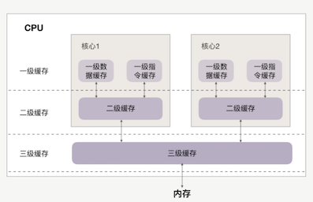
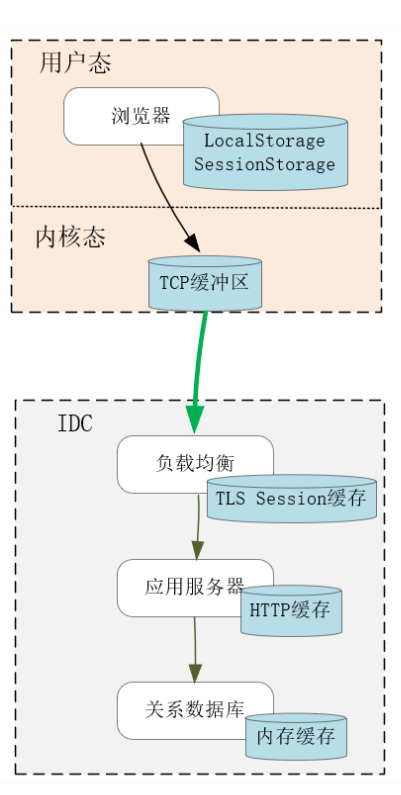
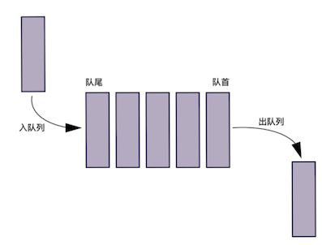
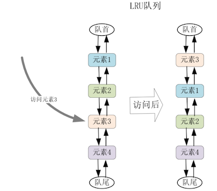
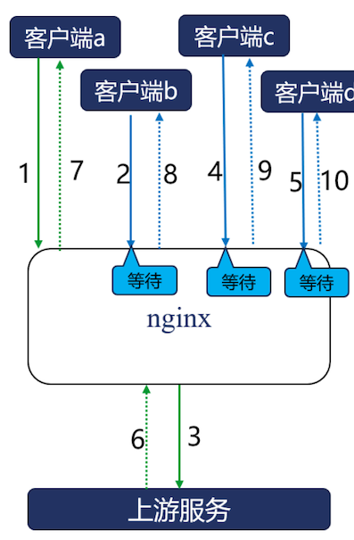
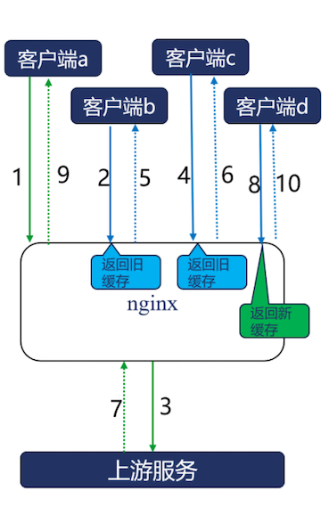

# **第七节 过期缓存防止缓存被流量打穿**

**在分布式系统中，缓存无处不在。**

**比如，浏览器会缓存用户 Cookie，CDN 会缓存图片，负载均衡会缓存 TLS 的握手信息，Redis 会缓存用户的 session，MySQL 会缓存 select 查询出的行数据，HTTP/2 会用动态表缓存传输过的 HTTP 头部，TCP Socket Buffer 会缓存 TCP 报文，Page Cache 会缓存磁盘 IO，CPU 会缓存主存上的数据，等等。**

只要系统间的访问速度有较大差异，缓存就能提升性能。比如，MySQL 为避免自身缓存与 Page Cache 的重合，就使用直接 IO 绕过了磁盘高速缓存。

缓存提升性能的幅度，不只取决于存储介质的速度，还取决于缓存命中率。

为了提高命中率，缓存会基于时间、空间两个维度更新数据。在时间上可以采用 LRU、FIFO 等算法淘汰数据，而在空间上则可以预读、合并连续的数据。

在分布式系统中，缓存服务会为上游应用挡住许多流量。**如果只是简单的基于定时器淘汰缓存，一旦热点数据在缓存中失效，超载的流量会立刻打垮上游应用，导致系统不可用**。

## **1、缓存是最有效的性能提升工具**

在计算机体系中，各类硬件的访问速度天差地别。比如：

* CPU 访问缓存的耗时在 10 纳秒左右，访问内存的时延则翻了 10 倍；
* 如果访问 SSD 固态磁盘，时间还要再翻个 1000 倍，达到 100 微秒；
* 如果访问机械硬盘，对随机小 IO 的访问要再翻个 100 倍，时延接近 10 毫秒；
* 如果跨越网络，访问时延更要受制于主机之间的物理距离。比如杭州到伦敦相距 9200 公里，ping 时延接近 200 毫秒。当然，网络传输的可靠性低很多，一旦报文丢失，TCP 还需要至少 1 秒钟才能完成报文重传。

最快的 CPU 缓存与最慢的网络传输，有 1 亿倍的速度差距！


我们会使用高速的存储介质创建缓冲区，通过预处理、批处理以及缓冲数据的反复命中，提升系统的整体性能。


不只是硬件层面，软件设计对访问速度的影响更大。比如，对关系数据库的非索引列做条件查询，时间复杂度是 O(N)，而对 Memcached 做 Key/Value 查询，时间复杂度则是 O(1)，所以在海量数据下，两者的性能差距远高于硬件。**因此，RabbitMQ、Kafka 这样的消息服务也会充当高速、低速应用间的缓存。**

如果两个实体之间的访问时延差距过大，还可以通过多级缓存，逐级降低访问速度差，提升整体性能

CPU 三级缓存，每级缓存越靠近 CPU 速度越快，容量也越小，以此缓解 CPU 频率与主存的速度差，提升 CPU 的运行效率。



**再比如下图的 Web 场景中，浏览器的本地缓存、操作系统内核中的 TCP 缓冲区（、负载均衡中的 TLS 握手缓存、应用服务中的 HTTP 响应缓存、MySQL 中的查询缓存等，每一级缓存都缓解了上下游间不均衡的访问速度，通过缩短访问路径降低了请求时延，通过异步访问、批量处理提升了系统效率。**



当然，缓存使用了简单的 Key/Value 结构，因此可以用哈希表、查找树等容器做索引，这也提升了访问速度。


从系统底层到业务高层，缓存都大有用武之地。比如在 Django 这个 Python Web Server 中，既可以使用视图缓存，将动态的 HTTP 响应缓存下来：

```
from django.views.decorators.cache import cache_page

@cache_page(60 * 15)
def my_view(request):
    ...
```

也可以使用[django-cachealot](https://django-cachalot.readthedocs.io/en/latest/) 这样的中间件，将所有 SQL 查询结果缓存起来:

```
INSTALLED_APPS = [
  ...
  'cachalot',
  ...
]
```

还可以在更细的粒度上，使用 Cache API 中的 get、set 等函数，将较为耗时的运算结果存放在缓存中：

```

cache.set('online_user_count', counts, 3600)
user_count = cache.get('online_user_count')
```

## **2、缓存数据的更新方式**

缓存的存储容量往往小于原始数据集，这有许多原因，比如：

* 缓存使用了速度更快的存储介质，而这类硬件的单位容量更昂贵，因此从经济原因上只能选择更小的存储容量；
* 负载均衡可以将上游服务的动态响应转换为静态缓存，从时间维度上看，上游响应是无限的，这样负载均衡的缓存容量就一定会不足；
* 即使桌面主机的磁盘容量达到了 TB 级，但浏览器要对用户访问的所有站点做缓存，就不可能缓存一个站点上的全部资源，在一对多的空间维度下，缓存一样是稀缺资源。


**必须保证在有限的缓存空间内，只存放会被多次访问的热点数据，通过提高命中率来提升系统性能。要完成这个目标，必须精心设计向缓存中添加哪些数据，缓存溢出时淘汰出哪些冷数据。**

通常，缓存数据的添加或者更新，都是由用户请求触发的，这往往可以带来更高的命中率。比如，当读请求完成后，将读出的内容放入缓存，基于时间局部性原理，它有很高的概率被后续的读请求命中

**对于磁盘操作，还可以基于空间局部性原理，采用预读算法添加缓存数据**。比如当我们统计出连续两次读 IO 的操作范围也是连续的，就可以判断这是一个顺序读 IO，如果这个读 IO 获取 32KB 的数据，就可以在这次磁盘中，多读出 128KB 的数据放在缓存，这会带来 2 个收益：

* 首先，通过减少定位时间提高了磁盘工作效率。机械磁盘容量大价格低，它的顺序读写速度由磁盘旋转速度与存储密度决定，通常可以达到 100MB/s 左右。然而，由于机械转速难以提高（服务器磁盘的转速也只有 10000 转 /s），磁头定位与旋转延迟大约消耗了 8 毫秒，因此对于绝大部分时间花在磁头定位上的随机小 IO（比如 4KB），读写吞吐量只有几 MB。
* 其次，当后续的读请求命中提前读入缓存的数据时，请求时延会大幅度降低，这提升了用户体验。


**而且，并不是只有单机进程才能使用预读算法。**

**比如公有云中的云磁盘，之所以可以实时地挂载到任意虚拟机上，就是因为它实际存放在类似 HDFS 这样的分布式文件系统中。因此，云服务会在宿主物理机的内存中缓存虚拟机发出的读写 IO，由于网络传输的成本更高，所以预读效果也更好。**


### **写请求也可以更新缓存，**

参考 [舍弃一致性去换取性能的CAP理论](https://chao-xi.github.io/jxtechbook/chap3/2perf_cap/#2)介绍过 write through 和 write back 方式。

* **write back 采用异步调用回写数据，能通过批量处理提升性能**。比如 Linux 在合并 IO 的同时，也会像电梯运行一样，每次使磁头仅向一个方向旋转写入数据，提升机械磁盘的工作效率，因此得名为电梯调度算法。


### **2 种最常见的缓存淘汰算法**

**先来看FIFO(First In, First Out) 先入先出淘汰算法**

* 例如 HTTP/2 动态表，会将 HTTP/2 连接上首次出现的 HTTP 头部，缓存在客户端、服务器的内存中。由于它们基于相同的规则生成，所以拥有相同的动态表序号。
* 这样，传输 1-2 个字节的表序号，要比传输几十个字节的头部划算得多。当内存容量超过 `SETTINGS_HEADER_TABLE_SIZE` 阈值时，会基于 FIFO 算法将最早缓存的 HTTP 头部淘汰出动态表。




**再比如的 TLS 握手很耗时**

所以我们可以将密钥缓存在客户端、服务器中，等再次建立连接时，通过 session ID 迅速恢复 TLS 会话。

由于内存有限，服务器必须及时淘汰过期的密钥，其中，Nginx 也是采用 FIFO 队列淘汰 TLS 缓存的。


**LRU(Less Recently Used) 也是最常用的淘汰算法**，

比如 Redis 服务就通过它来淘汰数据，OpenResty 在进程间共享数据的 `shared_dict` 在达到共享内存最大值后，也会通过 LRU 算法淘汰数据。

**LRU 通常使用双向队列实现（时间复杂度为` O(1)`），队首是最近访问的元素，队尾就是最少访问、即将淘汰的元素。当访问了队列中某个元素时，可以将其移动到队首。**

当缓存溢出需要淘汰元素时，直接删除队尾元素，如下所示：




以上我只谈了缓存容量到达上限后的淘汰策略，为了避免缓存与源数据不一致，在传输成本高昂的分布式系统中，**通常会基于过期时间来淘汰缓存**。

比如 HTTP 响应中的 Cache-Control、Expires 或者 Last-Modified 头部，都会用来设置定时器，响应过期后会被淘汰出缓存。

**然而，一旦热点数据被淘汰出缓存，那么来自用户的流量就会穿透缓存到达应用服务。由于缓存服务性能远大于应用服务，过大的流量很可能会将应用压垮**。

因此，过期缓存并不能简单地淘汰，下面我们以 Nginx 为例，看看如何利用过期缓存提升系统的可用性。


## **3、Nginx 是如何防止流量打穿缓存的？**

当热点缓存淘汰后，大量的并发请求会同时回源上游应用，其实这是不必要的。

**比如下图中 Nginx 的合并回源功能开启后，Nginx 会将多个并发请求合并为 1 条回源请求，并锁住所有的客户端请求，直到回源请求返回后，才会更新缓存，同时向所有客户端返回响应。**

由于 Nginx 可以支持 C10M 级别的并发连接，因此可以很轻松地锁住这些并发请求，降低应用服务的负载。




启用合并回源功能很简单，只需要在 `nginx.conf` 中添加下面这条指令即可：


```
proxy_cache_lock on;
```

**当 1 个请求回源更新时，其余请求将会默认等待，如果 5 秒（可由 `proxy_cache_lock_timeout `修改）后缓存依旧未完成更新，这些请求也会回源，但它们的响应不会用于更新缓存。**

同时，**第 1 个回源请求也有时间限制，如果到达 5 秒（可由 proxy_cache_lock_age 修改）后未获得响应，就会放行其他并发请求回源更新缓存**。


开启过期缓存功能也很简单，添加下面 2 行指令即可：



```
proxy_cache_use_stale updating;
proxy_cache_background_update on;
```

## **4、本节小结**

当组件间的访问速度差距很大时，直接访问会降低整体性能，在二者之间添加更快的缓存是常用的解决方案。根据时间局部性原理，将请求结果放入缓存，会有很大概率被再次命中，而根据空间局部性原理，可以将相邻的内容预取至缓存中，这样既能通过批处理提升效率，也能降低后续请求的时延。

由于缓存容量小于原始数据集，因此需要将命中概率较低的数据及时淘汰出去。其中最常用的淘汰算法是 FIFO 与 LRU，它们执行的时间复杂度都是 O(1)，效率很高。

由于缓存服务的性能远大于上游应用，一旦大流量穿透失效的缓存到达上游后，就可能压垮应用。Nginx 作为 HTTP 缓存使用时，可以打开合并回源功能，减轻上游压力。在上游应用宕机后，还可以使用过期缓存为用户提供降级服务。