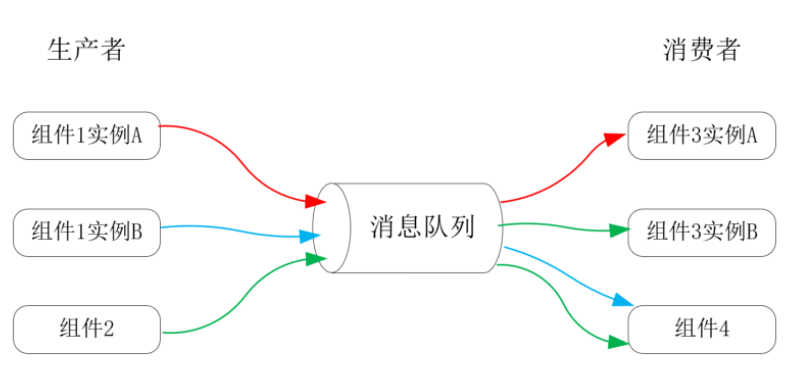
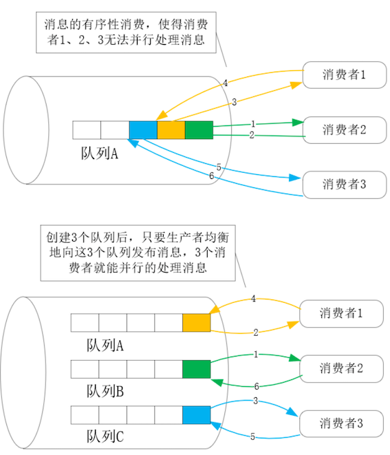

# **第八节 消息队列基于异步消息提升性能**

异步通讯是最常用的性能提升方式，比如 gRPC 提供的异步 API，或者基于 write-back 模式向缓存写入数据时，系统性能都可以提高。然而，对于复杂的大规模分布式系统，这些分散、孤立的异步实现机制，无法解决以下问题：

* 组件间耦合在一起，不只迭代变更时更为困难，而且当它们之间的性能有差异时，吞吐量较低的组件就会成为系统瓶颈；
* 当业务在时间上具有明显的峰谷访问差异时，实现**削峰填谷**需要一定的开发成本；
* 实现 BASE 理论中的 Basically Available 并不容易；
* 每个组件都要自行维护负载均衡组件，以此提供可伸缩性；
* 每个组件的请求格式、日志都不尽相同，因此系统总体的监控成本相对较高；
* 批量处理请求、异步化都可以提升性能，但每个组件独立实现这些基础功能付出的成本并非完全必要。

## **1、消息队列解决了哪些问题？**

当进程中需要交互的两个模块性能差距很大时，我们会基于 FIFO 先入先出队列实现生产者消费者模型，通过调整生产者、消费者的数量，实现线程间的负载均衡。而且，生产者仅将任务添加至队列首部就可以返回，这种异步操作释放了它的性能

**把单机中的 FIFO 队列放大到分布式系统中，就形成了独立的消息队列服务**。

此时，生产者、消费者的角色从线程变成了网络中的独立服务，生产者可以向消息队列发布多种消息，多个消费者也可以订阅同一种消息，如下图所示：

总结一下的话，消息队列就具备了以下 7 个优点：

1. **降低了系统的耦合性**。比如上图中，组件 2 发布了一条用户注册成功消息，原本只有负责通知用户注册结果的组件 3 在处理，如果组件 4 需要立刻开启新用户的营销工作，只需要同时向消息队列订阅即可；再比如，组件 2、组件 3、组件 4 通讯时并不需要统一应用层协议或者 RPC 接口，所有参与方只需要与消息队列服务的 SDK 打交道。
2. **可伸缩性很容易实现**。比如，当组件 3 的性能不足时，添加订阅消息的新实例，就可以通过水平扩展提升消费能力。反之，也可以扩展组件 1，提升消息的生产能力。
3. **天然实现“削峰填谷”功能**。消息队列服务会将消息持久化存储在磁盘中，在高峰期来不及处理的消息，会在低谷期被消费者服务处理完。通常，消息队列会使用廉价、高容量的机械磁盘存放消息，可以轻松缓存住高峰期超载的全部请求。
4. **提高了系统可用性**。
	* 首先，持久化到磁盘中的消息，在宕机故障时比内存中的请求有更高的可用性；
	* 其次，消息队列可以隔离故障，比如，消费者服务宕机后，生产者服务短期内不会受到影响；
	* 再次，当总吞吐量超过性能上限时，还可以设置不同的消息优先级，通过服务降级保障系统的基本可用性。
5. **消息队列的生产者天然具备异步功能，这降低了生产者的请求处理时延，提升了用户体验**。
6. 基于 AKF Y 轴拆分功能可以降低数据规模，而且组件间分工更细也会带来更深入的性能优化。当消息队列作为通讯方式时，这种“事件驱动”的分布式系统很容易通过消息实现服务拆分，成本会低很多。
7. 消息队列服务对于各种消息的发布、消费情况都有统计，因此，从消息中就能获得业务的实时运行状态，以极低的成本实现系统的监控。

正是因为这么多的优点，所以消息队列成为了多数分布式系统必备的基础设施。

而且，消息队列自身也拥有很高的性能，**比如 RabbitMQ 单机每秒可以处理 10 万条消息，而 Kafka 单机每秒甚至可以处理百万条消息**。

除了消息队列处理逻辑简单外，还有一个重要原因，就是消息的产生、消费在时间上是连续的，这让消息队列在以下优化点上能获得很高的收益：

* 首先，在网络通讯中，很容易通过批量处理提高网络效率。比如生产者快速发布消息时，Kafka 的客户端 SDK 会自动聚集完一批消息，再一次性发送给 Broker，这样网络报文的有效载荷比会很高。
* 其次，在数据写入磁盘的过程中，由于时序性特征，存放消息的文件仅以追加形式变更，这样多数情况下机械硬盘的磁头仅朝一个方向转动，这让磁盘写入速度可以轻松达到 100MB/s。
* 最后，由于消费者也是按照 FIFO 规则有序接收消息的，这样消息队列的缓存就可以通过批量预读等优化方式，大幅提高读操作的缓存命中率。

## **2、消息队列的服务质量是如何保证的？**

为了提升整个分布式系统的性能，我们在处理消息时，还需要在生产端、消费端以及消息队列的监控上，做到以下 3 件事：

* **首先，虽然生产者会异步地发布消息，但毕竟需要接收到消息队列的确认，才构成完整的发布流程。**网络传输是相对漫长、不可控的，所以在高性能场景中，生产者应基于多线程或者非阻塞 Socket 发布消息，以提高并发能力。
* **其次，当消费端性能不足需要扩容时，必须同步增加消息队列服务中的队列（在 Kafka 中叫做分区），才能允许新增的消费节点并行接收消息，提高消息的处理能力。**否则，当多个消费者消费同一消息队列时，消息的有序性会导致多个消费节点串行处理消息，无法发挥出它们的全部性能，如下图所示：

* 最后，**如果通过监控发现消息的消费能力小于生产能力，那就必须及时扩容消费端，或者降低消息的发布速度，否则消息就会积压，最终导致系统不可用**。

**接下来，再来看消息队列的 QoS（Quality of Service）是如何保证的**，即：消息在传递过程中会不会丢失，以及接收方会不会重复消费消息。在[MQTT 协议](https://en.wikipedia.org/wiki/MQTT)中，给消息队列定义了三种 QoS 级别：

* at most once，每条消息最多只被传送一次，这意味着消息有可能丢失；
* at least once，每条消息至少会传送一次，这意味着消息可能被重复消费；
* exactly once，每条消息恰好只传送一次，这是最完美的状态。

需要 at most once 约束的场景较罕见，**因此目前绝大部分消息队列服务提供的 QoS 约束都是 at least once**，它是通过以下 3 点做到的：

* 生产端发布消息时，只有消息队列确定写入磁盘后，才会返回成功；
* **为防止消息队列服务出现故障后丢消息们也需要将数据存放在多个副本节点中**。许多高可用策略，消息队列都会采用，比如 Kafka 就是使用介绍过的 NWR 算法来选出副本中的 Leader 节点，再经由它同步数据副本。
* 消费端必须在消费完消息（而不是收到消息）后，才能向消息队列服务返回成功。

这样，消息队列就能以很高的可用性提供 at least once 级别的 QoS。

**而 exactly once 是在 at least once 的基础上，通过幂等性 idempotency 实现的。对于一条“幂等性消息”，无论消费 1 次还是多次，**

结果都是一样的。因此，Kafka 通过消息事务和幂等性约束实现了exactly once 语义，其中，发布消息时 Kafka 会创建全局唯一的递增 ID，这样传输消息时它就能低成本地去除重复的消息，通过幂等性为单队列实现 exactly once 语义；针对生产者向多个分区发布同一条消息的场景，消息事务通过“要么全部成功要么全部失败”，也实现了 exactly once 语义。

## **3、本节小结**

消息队列可以解耦分布式系统，其缓存的消息提供了削峰填谷功能，将消息持久化则提高了系统可用性，共享队列则为系统提供了可伸缩性，而且统计消息就可以监控整个系统，因此消息队列已成为当下分布式系统的必备基础设施。

虽然消息队列自身拥有优秀的性能，但若想提高使用效率，我们就需要确保在生产端实现网络传输上的并发，在消费端扩容时同步增加队列或者分区，并且需要持续监控系统，确保消息的生产能力小于消费能力，防止消息积压。

消息队列的 Qos 提供三种语**义，其中 at most once 很少使用，而主流的 at least once 由消息持久化时的冗余，以及生产端、消息端使用消息的方式共同保障。Kafka 通过幂等性、事务消息这两个特性，在 at least once 的基础上提供了 exactly once 语义**。
