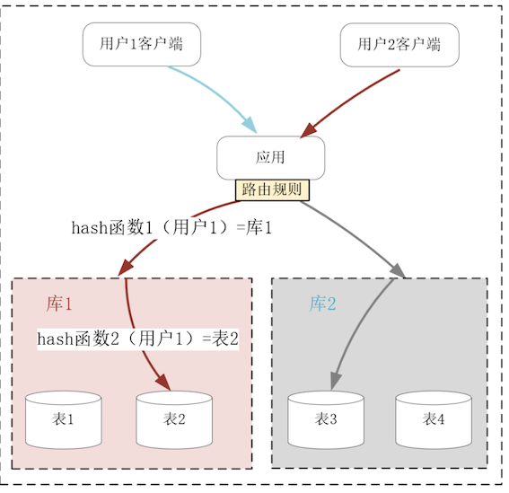
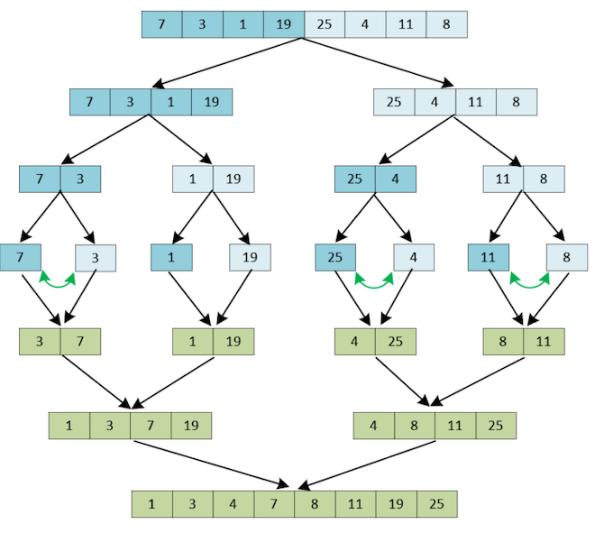
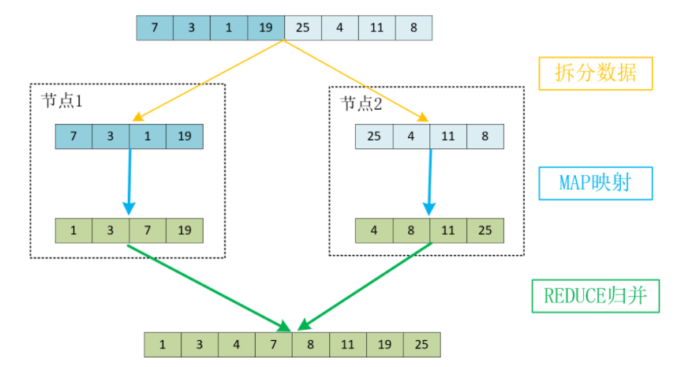
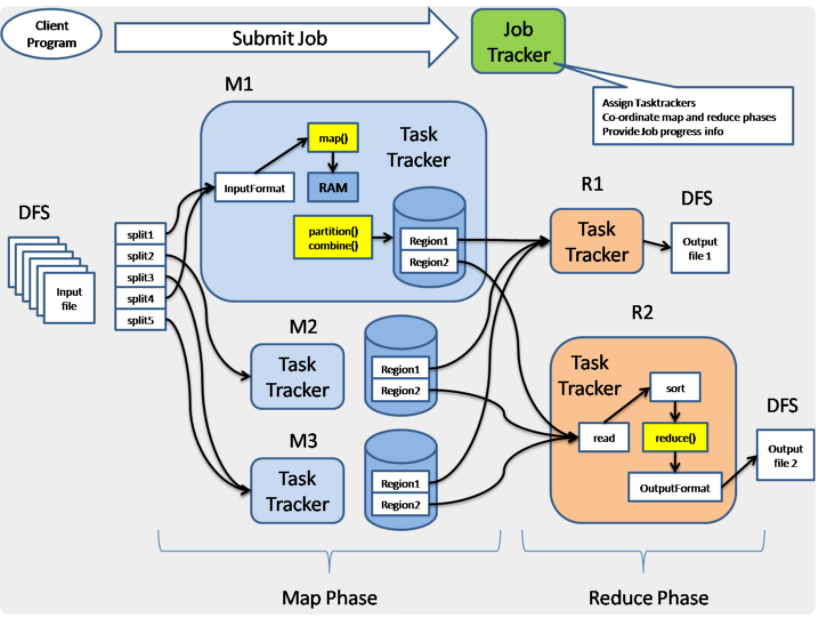
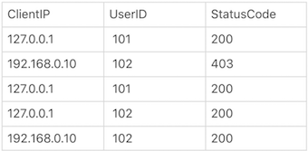
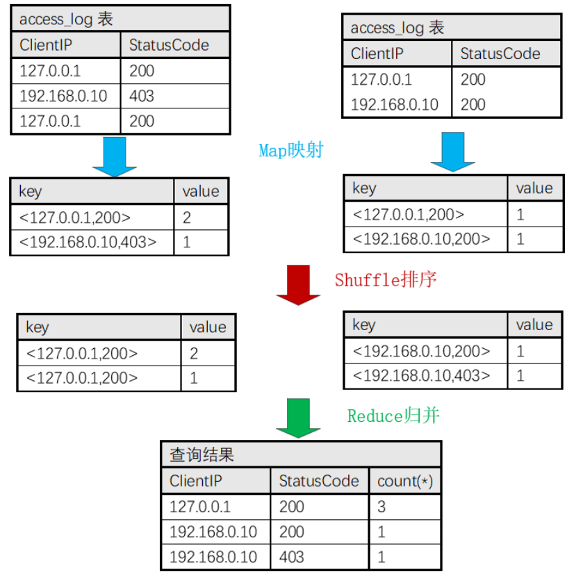

# **第九节 MapReduce通过集群实现离线计算**

对大量数据做计算时，通常会采用分而治之的策略提升计算速度。

比如单机上基于递归、分治思想实现的快速排序、堆排序，时间复杂度只有 `O(N*logN)`，这比在原始数据集上工作的插入排序、冒泡排序要快得多`（O(N2)）`。

然而，当单机磁盘容量无法存放全部数据，或者受限于 CPU 频率、核心数量，单机的计算时间远大于可接受范围时，我们就需要在分布式集群上使用分治策略。

当单机磁盘容量无法存放全部数据，或者受限于 CPU 频率、核心数量，单机的计算时间远大于可接受范围时，我们就需要在分布式集群上使用分治策略。

**比如，大规模集群每天产生的日志量是以 TB 为单位计算的，这种日志分析任务单台服务器的处理能力是远远不够的。**

需要将计算任务分解成单机可以完成的小任务，由分布式集群并行处理后，再从中间结果中归并得到最终的运算结果。这一过程由 Google 抽象为[MapReduce](https://zh.wikipedia.org/wiki/MapReduce) 模式，实现在 Hadoop 等分布式系统中。

虽然 MapReduce 已经有十多个年头的历史了，但它仍是分布式计算的基石，这种编程思想在新出现的各种技术中都有广泛的应用。比如当在单机上使用 TensorFlow 完成一轮深度学习的时间过久，或者单颗 GPU 显存无法存放完整的神经网络模型时，就可以通过 Map 思想把数据或者模型分解给多个 TensorFlow 实例，并行计算后再根据 Reduce 思想合并得到最终结果。再比如知识图谱也是通过 MapReduce 思想并行完成图计算任务的。

## **1、分而治之：如何实现集群中的批量计算？**

分而治之的思想在分布式系统中广为使用，比如介绍过的 AKF 立方体 Z 轴扩展，就是基于用户的请求，缩小集群中单个节点待处理的数据量，比如下图中当关系数据库中单表行数达到千万行以上时，此时不得不存放在磁盘中的索引将会严重降低 SQL 语句的查询速度。

**而执行分库分表后，由应用或者中间层的代理分解查询语句，待多个不足百万行的表快速返回查询结果后，再归并为最终的结果集。**



与上述的 IO 类任务不同，并非所有的计算任务都可以基于分治策略，分解为可以并发执行的子任务。

可以使用 MapReduce 的计算任务，其中最经典的例子是排序（Google 在构建倒排索引时要为大量网页排序）。

当使用插入排序（不熟悉插入排序的同学，可以想象自己拿了一手乱牌，然后在手中一张张重新插入将其整理有序）在整个数据集上操作时，计算的时间复杂度是`O(N2)`，但快排、堆排序、归并排序等算法的时间复杂度只有 `O(N*logN)`，这就是通过分治策略，缩小子问题数据规模实现的。

**比如下图是在 8 个数字上使用归并排序算法进行排序的流程**。我们将数组递归地进行 `3（log8`）轮对半拆分后，每个子数组就只有 2 个元素。对 2 个元素排序只需要进行 1 次比较就能完成。接着，再将有序的子数组不断地合并，就可以得到完整的有序数组。



其中，将两个含有 N/2 个元素的有序子数组（比如 1、3、7、19 和 4、8、11、25），合并为一个有序数组时只需要做 `N/2` 到 `N-1` 次比较（图中只做了 5 次比较），速度非常快。因此，比较次数乘以迭代轮数就可以得出时间复杂度为 `O(N*logN)`。

**同样的道理引申到分布式系统中，就成为了 MapReduce 模式。**

**其中，原始数据集要通过 SPLIT 步骤拆分到分布式系统中的多个节点中，而每个节点并发执行用户预定义的 MAP 函数，最后将 MAP 运算出的结果通过用户预定义的 REDUCE 函数，归并为最终的结果。**


比如上例中我们可以将 8 个元素拆分到 2 个节点中并行计算，其中每个节点究竟是继续采用归并排序，还是使用其他排序算法，这由预定义的 MAP 函数决定。当

**MAP 函数生成有序的子数组后，REDUCE 函数再将它们归并为完整的有序数组**，具体如下图所示：



**当面对 TB、PB 级别的数据时，MapReduce 思想就成了唯一的解决方案。**

当然，在实际软件工程中实现 MapReduce 的框架要比上面的示意图复杂许多，毕竟在大规模分布式系统中，故障每时每刻都会发生，如何分发数据、调度节点执行 MAP 映射、监控计算节点等，都需要精心的设计。特别是，当单个节点的磁盘无法存放下全部数据时，常常使用类似 HDFS 的分布式文件系统存放数据，所以 MapReduce 框架往往还需要对接这样的系统来获取数据，具体如下图所示：





而且，生产环境中的任务远比整数排序复杂得多，所以写对 Map、Reduce 函数并不容易。


另一方面，大部分数据分析任务又是高度相似的，所以我们没有必要总是直接编写 Map、Reduce 函数，实现发布式系统的离线计算。

由于 SQL 语言支持聚合分析、表关联，还内置了许多统计函数，很适合用来做数据分析，它的学习成本又非常低，所以大部分 MapReduce 框架都提供了类 SQL 语言的接口，可以替代自行编写 Map、Reduce 函数。


## **2、SQL 是如何简化 MapReduce 模式的？**

最常见的 Web 日志分析为例，观察用 SQL 语言做统计时，MapReduce 流程是怎样执行的。举个例子，Nginx 的 `access.log` 访问日志是这样的（基于默认的 `combined` 格式）：

```
127.0.0.1 - - [18/Jul/2020:10:16:15 +0800] "GET /login？userid=101 HTTP/1.1" 200 56 "-" "curl/7.29.0"
```

你可以通过正则表达式取出客户端 IP 地址、用户名、HTTP 响应码，这样就可以生成结构化的数据表格：



如果我们想按照客户端 IP、HTTP 响应码聚合统计访问次数，基于通用的 SQL 规则，就可以写出下面这行 SQL 语句：

```
select ClientIp, StatusCode, count(*) from access_log group by ClientIp, StatusCode
```

而建立在 MapReduce 之上的框架（比如 Hive）会将它翻译成如下图所示的 MapReduce 流程：



**其中，我们假定 5 行数据被拆分到 2 个节点中执行 Map 函数，其中它们分别基于 2 行、3 行这样小规模的数据集，生成了正确的聚合统计结果。**

接着，在 Shuffle 步骤基于 key 关键字排序后，再交由 Reduce 函数归并出正确的结果。


除了这个例子中的 count 函数，像 max（求最大值）、min（求最小值）、distinct（去重）、sum（求和）、avg（求平均数）、median（求中位数）、stddev（求标准差）等函数，都很容易分解为子任务并发执行，最后归并出最终结果。

当多个数据集之间需要做交叉统计时，SQL 中的 join 功能（包括内连接、左外连接、右外连接、全连接四种模式）也很容易做关联查询。此时，我们可以在并行计算的 Map 函数中，把 where 条件中的关联字段作为 key 关键字，经由 Reduce 阶段实现结果的关联。

由于 MapReduce 操作的数据集非常庞大，还需要经由网络调度多台服务器才能完成计算，因此任务的执行时延至少在分钟级，所以通常不会服务于用户的实时请求，而只是作为离线的异步任务将运算结果写入数据库。


## **3、本节小结**

当数据量很大，或者计算时间过长时，如果计算过程可以被分解为并发执行的子任务，就可以基于 MapReduce 思想，利用分布式集群的计算力完成任务。其中，用户可以预定义在节点中并发执行的 Map 函数，以及将 Map 输出的列表合并为最终结果的 Reduce 函数。

虽然 MapReduce 将并行计算抽象为统一的模型，但开发 Map、Reduce 函数的成本还是太高了，于是针对高频场景，许多 MapReduce 之上的框架提供了类 SQL 语言接口，通过 group by 的聚合、join 连接以及各种统计函数，我们就可以利用整个集群完成数据分析。


**MapReduce 模式针对的是静态数据，也叫有边界数据，它更多用于业务的事前或者事后处理流程中，而做事中处理时必须面对实时、不断增长的无边界数据流，此时 MapReduce 就无能为力了**。