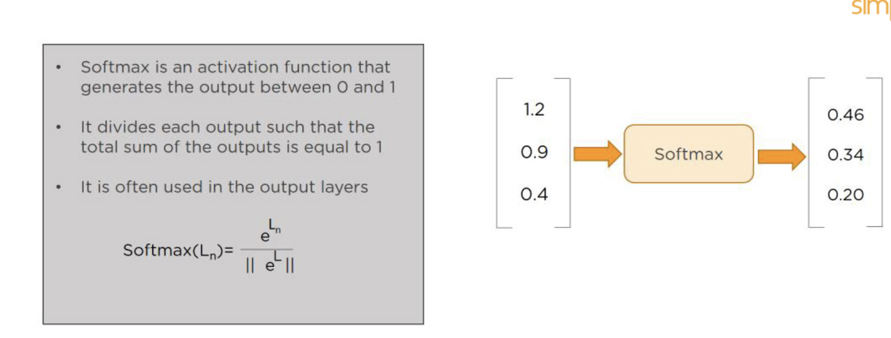

# **L10 30 Frequently asked Deep Learning Interview**

## **1. What is Deep Learning?**

**It performs complex operations to extract hidden patterns and features**(for instance, distinguishing the image of a cat from that of a dog).

 

## **2. What is a Neural Network?**

Neural Networks replicate the way humans learn, inspired by how the neurons in our brains fire, only much simpler.

 

The most common Neural Networks consist of three network layers:

* An input layer
* A hidden layer (this is the most important layer where feature extraction takes place, and adjustments are made to train faster and function better)
* An output layer

**Each sheet contains neurons called “nodes,” performing various operations. Neural Networks are used in deep learning algorithms like CNN, RNN, GAN, etc.**

## **3. What Is a Multi-layer Perceptron(MLP)?**

As in Neural Networks, **MLPs have an input layer, a hidden layer, and an output layer**. 

It has the same structure as a single layer perceptron with one or more hidden layers. 

**A single layer perceptron can classify only linear separable classes with binary output (0,1), but MLP can classify nonlinear classes.**

Except for the input layer, each node in the other layers uses a nonlinear activation function. 

This means the input layers, the data coming in, and the activation function is based upon all nodes and weights being added together, producing the output. MLP uses a supervised learning method called “backpropagation.” In backpropagation, the neural network calculates the error with the help of cost function. It propagates this error backward from where it came (adjusts the weights to train the model more accurately).

## **4. What Is Data Normalization, and Why Do We Need It?**

**The process of standardizing and reforming data is called “Data Normalization.” It’s a pre-processing step to eliminate data redundancy.**


Often, data comes in, and you get the same information in different formats. In these cases, you should rescale values to fit into a particular range, achieving better convergence.

## **5. What is the Boltzmann Machine?**


**One of the most basic Deep Learning models is a Boltzmann Machine, resembling a simplified version of the Multi-Layer Perceptron. **

**This model features a visible input layer and a hidden layer -- just a two-layer neural net that makes stochastic decisions as to whether a neuron should be on or off.** Nodes are connected across layers, but no two nodes of the same layer are connected.

## **6. What Is the Role of Activation Functions in a Neural Network?**

**At the most basic level, an activation function decides whether a neuron should be fired or not.**

**It accepts the weighted sum of the inputs and bias as input to any activation function.** 

Step function, Sigmoid, ReLU, Tanh, and Softmax are examples of activation functions.

 

## **7. What Is the Cost Function?**

**Also referred to as “loss” or “error,” cost function is a measure to evaluate how good your model’s performance is.**


It’s used to compute the error of the output layer during backpropagation. 

We push that error backward through the neural network and use that during the different training functions.

 

## **8. What Is Gradient Descent?**

**Gradient Descent is an optimal algorithm to minimize the cost function or to minimize an error.**

**The aim is to find the local-global minima of a function**. This determines the direction the model should take to reduce the error.

 

## **9. What Do You Understand by Backpropagation?**

This is one of the most frequently asked deep learning interview questions. Backpropagation is a technique to improve the performance of the network. 

**It backpropagates the error and updates the weights to reduce the error.**


 

## **10. What Is the Difference Between a Feedforward Neural Network and Recurrent Neural Network?**

Feedforward Neural Network signals travel in one direction from input to output. There are no feedback loops; the network considers only the current input. It cannot memorize previous inputs (e.g., CNN).

A Recurrent Neural Network’s signals travel in both directions, creating a looped network. It considers the current input with the previously received inputs for generating the output of a layer and can memorize past data due to its internal memory.

 

### **11. What Are the Applications of a Recurrent Neural Network (RNN)?**

The RNN can be used for sentiment analysis, text mining, and image captioning. 

**Recurrent Neural Networks can also address time series problems such as predicting the prices of stocks in a month or quarter.**

## **12. What Are the Softmax and ReLU Functions?**

Softmax is an activation function that generates the output between zero and one. It divides each output, such that the total sum of the outputs is equal to one. Softmax is often used for output layers.

 

ReLU (or Rectified Linear Unit) is the most widely used activation function. It gives an output of X if X is positive and zeros otherwise. ReLU is often used for hidden layers.

 

## **13. What Are Hyperparameters?**


With neural networks, you’re usually working with hyperparameters once the data is formatted correctly. **hyperparameter is a parameter whose value is set before the learning process begins.** It determines how a network is trained and the structure of the network (such as the number of hidden units, the learning rate, epochs, etc.).

 

## **14. What Will Happen If the Learning Rate Is Set Too Low or Too High?**

When your learning rate is too low, training of the model will progress very slowly as we are making minimal updates to the weights. It will take many updates before reaching the minimum point.

If the learning rate is set too high, this causes undesirable divergent behavior to the loss function due to drastic updates in weights. It may fail to converge (model can give a good output) or even diverge (data is too chaotic for the network to train).

 

## **15. What Is Dropout and Batch Normalization?**

**Dropout is a technique of dropping out hidden and visible units of a network randomly to prevent overfitting of data (typically dropping 20 percent of the nodes).** It doubles the number of iterations needed to converge the network.


 

Batch normalization is the technique to improve the performance and stability of neural networks by normalizing the inputs in every layer so that they have mean output activation of zero and standard deviation of one.

## **16. What Is the Difference Between Batch Gradient Descent and Stochastic Gradient Descent?**

 

## **17. What is Overfitting and Underfitting, and How to Combat Them?**


**Overfitting occurs when the model learns the details and noise in the training data to the degree that it adversely impacts the execution of the model on new information. It is more likely to occur with nonlinear models that have more flexibility when learning a target function.**


An example would be if a model is looking at cars and trucks, but only recognizes trucks that have a specific box shape. It might not be able to notice a flatbed truck because there's only a particular kind of truck it saw in training. The model performs well on training data, but not in the real world.


**Underfitting alludes to a model that is neither well-trained on data nor can generalize to new information. This usually happens when there is less and incorrect data to train a model. Underfitting has both poor performance and accuracy.**

To combat overfitting and underfitting, you can resample the data to estimate the model accuracy (k-fold cross-validation) and by having a validation dataset to evaluate the model.

## **18. How Are Weights Initialized in a Network?**

There are two methods here: **we can either initialize the weights to zero or assign them randomly.**


Initializing all weights to 0: **This makes your model similar to a linear model. All the neurons and every layer perform the same operation, giving the same output and making the deep net useless.**

Initializing all weights randomly: **Here, the weights are assigned randomly by initializing them very close to 0. It gives better accuracy to the model since every neuron performs different computations. This is the most commonly used method**.

## **19. What Are the Different Layers on CNN?**

There are four layers in CNN:


* Convolutional Layer -  the layer that performs a convolutional operation, creating several smaller picture windows to go over the data.
* ReLU Layer - it brings non-linearity to the network and converts all the negative pixels to zero. The output is a rectified feature map.
* Pooling Layer - pooling is a down-sampling operation that reduces the dimensionality of the feature map.
* Fully Connected Layer - this layer recognizes and classifies the objects in the image.

## **20. What is Pooling on CNN, and How Does It Work?**

**Pooling is used to reduce the spatial dimensions of a CNN.** It performs down-sampling operations to reduce the dimensionality and creates a pooled feature map by sliding a filter matrix over the input matrix.

 

## **21. How Does an LSTM Network Work?**

Long-Short-Term Memory (LSTM) is a special kind of recurrent neural network capable of learning long-term dependencies, remembering information for long periods as its default behavior. There are three steps in an LSTM network:

* Step 1: The network decides what to forget and what to remember.
* Step 2: It selectively updates cell state values.
* Step 3: The network decides what part of the current state makes it to the output.


 

## **22. What Are Vanishing and Exploding Gradients?**

While training an RNN, your slope can become either too small or too large; this makes the training difficult. When the slope is too small, the problem is known as a “Vanishing Gradient.” When the slope tends to grow exponentially instead of decaying, it’s referred to as an “Exploding Gradient.” Gradient problems lead to long training times, poor performance, and low accuracy.

 

### **23. What Is the Difference Between Epoch, Batch, and Iteration in Deep Learning?**

* Epoch - Represents one iteration over the entire dataset (everything put into the training model).
* Batch - Refers to when we cannot pass the entire dataset into the neural network at once, so we divide the dataset into several batches.
* Iteration - if we have 10,000 images as data and a batch size of 200. then an epoch should run 50 iterations (10,000 divided by 50).


### **25. What Do You Mean by Tensor in Tensorflow?**

This is another most frequently asked deep learning interview question. **A tensor is a mathematical object represented as arrays of higher dimensions. These arrays of data with different dimensions and ranks fed as input to the neural network are called “Tensors.”**


### **26. What Are the Programming Elements in Tensorflow?**

 

Constants - Constants are parameters whose value does not change. To define a constant we use  `tf.constant()` command. For example:

```
a = tf.constant(2.0,tf.float32)

b = tf.constant(3.0)

Print(a, b)
```

Variables - Variables allow us to add new trainable parameters to graph. To define a variable, we use the tf.Variable() command and initialize them before running the graph in a session. An example:


```
W = tf.Variable([.3].dtype=tf.float32)

b = tf.Variable([-.3].dtype=tf.float32)
```

Placeholders - these allow us to feed data to a tensorflow model from outside a model. It permits a value to be assigned later. To define a placeholder, we use the `tf.placeholder()` command. An example:

```
a = tf.placeholder (tf.float32)

b = a*2

with tf.Session() as sess:

result = sess.run(b,feed_dict={a:3.0})

print result
```

Sessions - a session is run to evaluate the nodes. This is called the “Tensorflow runtime.” For example:

```
a = tf.constant(2.0)

b = tf.constant(4.0)

c = a+b

# Launch Session

Sess = tf.Session()

# Evaluate the tensor c

print(sess.run(c))
```


## **27. Explain a Computational Graph.**

Everything in a tensorflow is based on creating a computational graph. It has a network of nodes where each node operates, Nodes represent mathematical operations, and edges represent tensors. Since data flows in the form of a graph, it is also called a “DataFlow Graph.”


## **28. Explain Generative Adversarial Network.**


Suppose there is a wine shop purchasing wine from dealers, which they resell later. But some dealers sell fake wine. In this case, the shop owner should be able to distinguish between fake and authentic wine.

The forger will try different techniques to sell fake wine and make sure specific techniques go past the shop owner’s check. The shop owner would probably get some feedback from wine experts that some of the wine is not original. The owner would have to improve how he determines whether a wine is fake or authentic.

The forger’s goal is to create wines that are indistinguishable from the authentic ones while the shop owner intends to tell if the wine is real or not accurately.

 

Let us understand this example with the help of an image shown above.

There is a noise vector coming into the forger who is generating fake wine.

Here the forger acts as a Generator.

The shop owner acts as a Discriminator.

The Discriminator gets two inputs; one is the fake wine, while the other is the real authentic wine. The shop owner has to figure out whether it is real or fake.

So, there are two primary components of Generative Adversarial Network (GAN) named:

* Generator
* Discriminator

The generator is a CNN that keeps keys producing images and is closer in appearance to the real images while the discriminator tries to determine the difference between real and fake images The ultimate aim is to make the discriminator learn to identify real and fake images.


## **29. What Is an Auto-encoder?**


 

This Neural Network has three layers in which the input neurons are equal to the output neurons. The network's target outside is the same as the input. It uses dimensionality reduction to restructure the input. It works by compressing the image input to a latent space representation then reconstructing the output from this representation.


## **30. What Is Bagging and Boosting?**

Bagging and Boosting are ensemble techniques to train multiple models using the same learning algorithm and then taking a call.


With Bagging, we take a dataset and split it into training data and test data. Then we randomly select data to place into the bags and train the model separately.

 


With Boosting, the emphasis is on selecting data points which give wrong output to improve the accuracy.

 