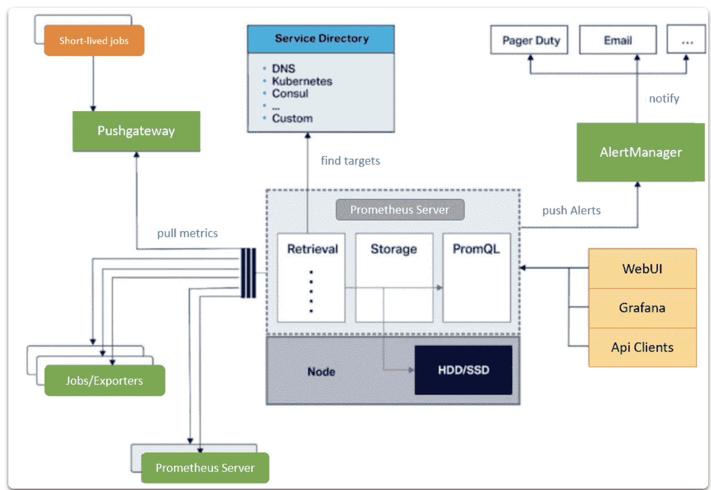
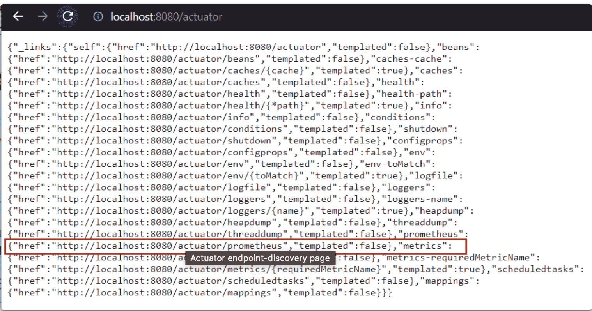
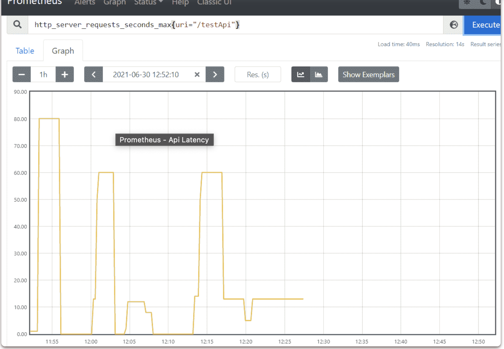
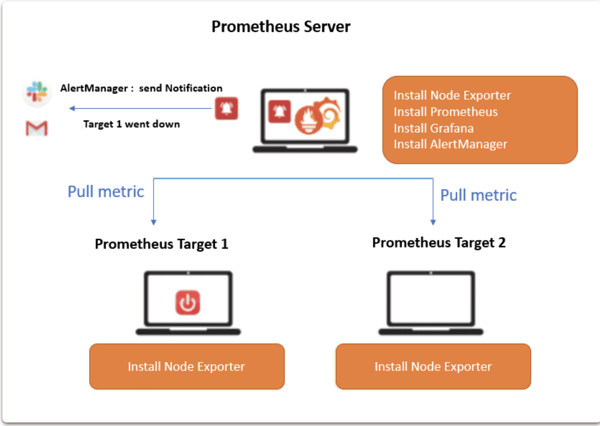

# **15 Top Prometheus Interview Questions and Answers (2022)**

[https://www.techgeeknext.com/tools/prometheus-interview-questions](https://www.techgeeknext.com/tools/prometheus-interview-questions)

### **1 What is Prometheus?**

**Prometheus is a free event monitoring and alerting software application**. 

It logs **real-time metrics** in a **time series database** built with an **HTTP pull model**, allowing for **flexible queries and real-time alerting.**

### **2 What is the Architecture of Prometheus Monitoring?**

Prometheus can run with both **Go and Docker applications**. The monitoring application consists of a **time-series database**, a **user interface, and the PromQL query language**, which is a flexible and intelligent query language.



Prometheus **gathers metrics** via instrumented jobs. 

The samples can be kept locally. It can also be scanned using rules to record or collect any new time-series via existing data and generate design alerts. **Histograms, gauges, and counters are used to display these metrics. Plaintext data can be transmitted over HTTP.**

### **3: How do we manage and monitor Spring boot application in production using Prometheus?**

**Spring Boot Actuator** is a Spring Boot sub-project that **adds monitoring and management capabilities for your production-ready apps**. 

**It offers a number of HTTP or JMX endpoints with which you can communicate**.




**`localhost:8080/actuator/prometheus`**

The Prometheus (a tool for monitoring) endpoint is provided by the Spring Boot Actuator, which regularly pulls this endpoint for metric data and offers graphic representation for data. We can see Api latency, performance etc in Prometheus Graph.

Below is Prometheus graph for testApi endpoint.



https://www.techgeeknext.com/spring-boot/spring-boot-actuator-prometheus-grafana


### **4 What are the Features of Prometheus?**


The following are some of the most important aspects of Prometheus:

* Numerous dashboards and graphing modes are available.
* **Representation of a time series grouping from any HTTP pull model**.
* **Abilities to use PromQL to support a data model's multidimensionality feature.**
* **Individual server nodes are self** - reliant and do not rely on distributed storage.
* **It display time series data**, i.e., identified with the metric's name or with KVP (Key-value pairs).

### **5 What are the Components of Prometheus?**

The majority of Prometheus components are written in a programming language, namely Go, and can be deployed and built as static binaries. A large number of its components are optional.

* **Prometheus Server**

**Prometheus' server stores and scrapes metrics**. 

It makes use of the persistence layer. This layer is part of the server and is not explicitly defined in the documentation. This server's nodes are all self-contained and do not rely on distributed storage.

* **Prometheus UI**

**We can see charts/graphs, visualise, and access stored data using the web UI.** Prometheus simplifies its user interface. We can also configure other visualisation tools, such as Grafana, to connect to the Prometheus server via the Prometheus Query Language (PromQL).

* **Prometheus Alertmanager**

**Alertmanager sends alerts via client applications like the Prometheus server.** It has advanced features for routing, grouping, and deduplicating alerts, and it can route alerts from other services like OpsGenie and PagerDuty.

### **6 What database is used by Prometheus?**

**Disk Time Series Database**

Prometheus comes with a local on-disk time series database and also can integrate with remote storage systems.

### **7 What is PromQL?**

Prometheus helps make its query language, Prometheus Query Language, easier to use (PromQL). It allows users to aggregate and select data. PromQL is specifically designed for use in conjunction with the Time-Series database. Prometheus includes four different types of metrics, that are mentioned below:

* **Prometheus Gauge**
* **Prometheus Counter**
* **Prometheus Summary**
* **Prometheus Histogram**

### **8. What are the different PromQL data types available in Prometheus Expression language?**

An expression or sub-expression in Prometheus expression language can evaluate to one of four types:

* **Instant vector**

**A set of time series containing a single sample for each time series, all sharing the same timestamp**.

This example selects all time series with metric name `http_requests_total` metric name:

**`http_requests_total`**

We can filter the data further by using comma separated list of label matchers in curly braces `({})` also with matching operators like `=`, `!=`, `=~ (for regex-match)`, `!~ (do not regex-match)`


```
// selects data with the http_requests_total metric name that have job label set to prometheus 
//and their group label set to canary
http_requests_total{job="prometheus",group="canary"}

//selects all http_requests_total time series for staging, testing, 
//and development environments and HTTP methods other than GET.
http_requests_total{environment=~"staging|testing|development",method!="GET"}
```

* **Range vector**

A set of time series containing a range of data points over time for each time series.

Time durations can be specified as `ms, s, m, h, d (day with 24h),w (week of 7d),y (year with 365d)`.

```
// Select all values recorded within the last 5 minutes for all time series 
//with the metric name http requests total and a job label of prometheus:
http_requests_total{job="prometheus"}[5m]
```

* **Scalar**

A simple numeric floating point value.

* **String**

A a simple string value, currently unused.

There is no escaping inside backticks. Unlike Go, Prometheus does not discard newlines within backticks.

```
"Example of string"
'Example of unescaped: \n \\ \t'
'Example of escaped: \n ' " \t'
```

### **9 How To calculate the average request duration over the last 5 minutes from a histogram or summary?**

```
rate(http_request_duration_seconds_sum[5m])
/
 rate(http_request_duration_seconds_count[5m])
```

### **10 What is Gauges in Prometheus?**

**A gauge is any metric that shows an individual value that can vary randomly up and down**. 

Gauges are used to measure the values that are typically or recently used in memory.

**仪表是显示可以随机上下变化的单个值的任何指标。仪表用于测量内存中通常或最近使用的值。**

### **11 What are Counters in Prometheus?**

A counter is any cumulative metric that shows an individual increasing counter monotonically and whose value could only reset or increase to zero over a restart. For example, we can use a counter to represent the number of errors, completed tasks, and requests served.


**计数器是任何累积度量，它显示单个计数器单调递增，并且其值只能在重新启动时重置或增加到零。例如，我们可以使用计数器来表示错误数、已完成任务数和服务请求数。**

### **12  What do you mean by Summaries and Histograms in Prometheus?**

Prometheus supports two kinds of complex metrics: **Summaries and Histograms**.

These metrics are being used to keep track of the number of observations and the sum of observed values. It generates time series in the database. For example, they all add the suffix `_sum` to the observed value's sum.

* **Histogram**

A histogram is used to represent the counts and observations (typically response size and request durations) in the configuration buckets. It also makes the sum of each observed value easier.


**直方图用于表示配置桶中的计数和观察结果（通常是响应大小和请求持续时间）。它还使每个观察值的总和更容易。**

It makes a histogram an important choice for tracking things like latency, which may have SLO (Service Level Objective) defined across it.

* **Summary**

A summary is used to represent different observations (like response size or request durations usually). It also displays the total number of observations and the sum of each observed value. On any sliding time window, it can calculate configurable quantities.


摘要用于表示不同的观察结果（通常如响应大小或请求持续时间）。它还显示观察的总数和每个观察值的总和。在任何滑动时间窗口上，它都可以计算可配置的数量。

### **13 What is the default data retention period in Prometheus?**

**The default data retention period is 15 days in Prometheus.** Data would be automatically deleted after the data storage default retention duration has passed.


### **14 How to persist its data between restarts in Prometheus running in a Docker container?**

We can create/mount volume and persist application data between multiple restarts in Prometheus by using below command:

```
$ docker volume create a-new-volume
$ docker run \ --publish 9090:9090 \
--volume a-new-volume:/prometheus \
--volume "$(pwd)"/prometheus.yml:/etc/prometheus/prometheus.yml \ prom/prometheus
```

### **15: How do I check my Prometheus status?**

```
check-node_exporter
```

Open your browser and go to **http://localhost:9090** to test the Prometheus server installation. You should be able to see the Prometheus interface. Select Status, then Targets. Your machines should be listed as UP under State.


### **16 How do I trigger a Prometheus alert?**

AlertManager is a single binary that receives alerts from the Prometheus server and sends them to the end user through email, Slack, or other means



The following are the steps for setting up Prometheus alerts:

* Configure and set up AlertManager.
* Configure Prometheus' config file to allow it to communicate with the AlertManager.
* In the Prometheus server configuration, define alert rules.
* In AlertManager, create an alert mechanism to send alerts via Slack and email.

### **17 What is Prometheus exporter?**

A Prometheus Exporter is a part of software that allows it to fetch statistics from another, non-Prometheus system. 

**It converts those statistics into Prometheus metrics, using a client library.** 

You can start a web server which exposes a /metrics URL, and can see that URL display the system metrics.


Prometheus Exporter 是软件的一部分，允许它从另一个非 Prometheus 系统获取统计信息。**它使用客户端库将这些统计信息转换为 Prometheus 指标。您可以启动一个公开 /metrics URL 的 Web 服务器，并且可以看到该 URL 显示系统指标。**

### **18 What is Thanos Prometheus?**

Thanos is a "highly available Prometheus setup with long-term storage capability," to put it simply. 

Thanos enables you to query and aggregate data from several Prometheus instances from a single endpoint. 

**Thanos also handles duplicate measurements that may result from several Prometheus instances automatically.**


**简单地说，Thanos 是“具有长期存储能力的高可用性 Prometheus 设置”。** Thanos 使您能够从单个端点查询和聚合来自多个 Prometheus 实例的数据。 Thanos 还自动处理可能由多个 Prometheus 实例产生的重复测量。

### **19 How do I delete old Prometheus data earlier than default retention time?**

You have the option of deleting particular data early.

Before you can do so, you must first enable the admin api in Prometheus.

```
sudo nano /etc/default/prometheus
```

Add `--web.enable-admin-api` to the `ARGS=""` variable.

```
ARGS="--web.enable-admin-api"
```

Restart Prometheus and check status.

```
sudo service prometheus restart
sudo service prometheus status
```

You can now make calls to the admin api.

**Example**: Delete all time series for the instance="sbcode.net:9100"

```
curl -X POST -g 'http://localhost:9090/api/v1/admin/tsdb/delete_series?match[]={instance="sbcode.net:9100"}'
```

**NOTE**: Once data is deleted, make sure you should disable the admin api again by following steps:

```
sudo nano /etc/default/prometheus
```

* Remove `--web.enable-admin-api` from the ARGS variable.

```
ARGS=""
```

* Restart Prometheus and check status

```
sudo service prometheus restart
sudo service prometheus status
```

### **20 How do you increase the time retention period in Prometheus?**

Prometheus metrics are stored for 1**5 days by default**. For troubleshooting purposes, this retention duration may be insufficient.

**You can increase the time retention period in the Prometheus configuration file as given below:**

Open the `/etc/sysconfig/prometheus` file on the management node, update the **STORAGE RETENTION** option to the required retention duration, and save your modifications.

For example:

```
STORAGE_RETENTION="--storage.tsdb.retention.time=30d"
```

Restart the Prometheus service:

```
systemctl restart prometheus.service
```

### **21 How do you increase the size retention policy?**


If the data is kept for a long time, the root partition where it is stored may run out of space. You can prevent this by setting the Prometheus metrics' maximum size.

Open the `/etc/sysconfig/prometheus` file on the management node, update the STORAGE RETENTION option to the required **size retention duration,** and save your modifications.
For example:

```
STORAGE_RETENTION="--storage.tsdb.retention.size=10GB"
```

* estart the Prometheus service

```
systemctl restart prometheus.service
```