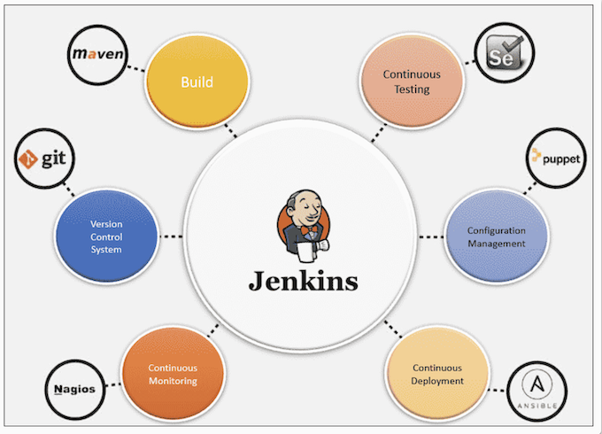
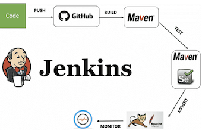
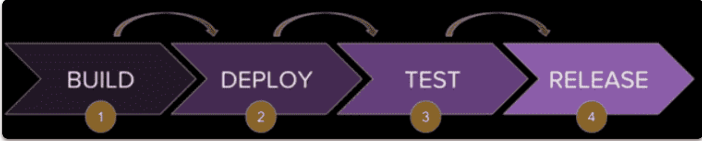

# **16 Top Jenkins Interview Questions and Answers (2022)**

### **1 Why to use Jenkins?**

Jenkins is used to continually build and test the software projects, making it easier for developers to integrate changes to the project and for users to get a new build.



### **2 What is a Jenkins Pipeline?**

This is the user-defined block, which includes all of the processes like build, test, and deploy. 

**It is a set of all JenkinsFile stages.**

**This block contains all of the stages and steps.**

It's a collection of stages and steps that make Jenkins easier to use for integrating and implementation of continuous delivery pipelines.

```
pipeline{
// stages
  //steps
}  
```

### **3 What is Jenkins Stage?**

**This block includes a pipeline with a series of steps.**

**In other words, a stage is where the build, test, and deploy stages all come together.** 

A stage block is a visual representation of the Jenkins pipeline process. Consider the following example for multiple stages, each of which performs a particular task:


这个块包括一个带有一系列步骤的管道。**换句话说，一个阶段是构建、测试和部署阶段都聚集在一起的地方**。阶段块是 Jenkins 流水线过程的可视化表示。考虑以下多个阶段的示例，每个阶段执行特定任务：



```
pipeline {
    any agent
    stages {
       stage ('Build') {
           //step...  
       }
       stage ('Test') {
           //step...  
       }
       stage ('Deploy') {
           //step...   
       }
       stage ('Monitor') {
           //step...  
       }
    }
}  
```

### **4 What is Steps in Jenkins?**

**A step is a single task that performs a specific task at a specific time.** A pipeline is made up of a set of steps that are specified within a stage block

```
pipeline {
    any agent
    stages {
      stage ('Build') {
          steps {
                  echo 'Started build phase...'
          }
      }
    }
}  
```

### **5 What is Continuous Delivery Pipeline?**

A Jenkins continuous delivery pipeline is depicted in the diagram below. It has a number of states, **including build, deploy, test, and release**. These jobs or events are connected in some way. Every state has its own set of jobs and works in a sequence called a continuous delivery pipeline.



Continuous delivery (CD) and continuous integration provide a complete process for delivering code packages. 

At this stage, automated build tools are used to compile the artifacts and make them ready for delivery to end users.

Its goal is to make software build, test, and release faster and more frequently. This approach can reduce the cost and time of software development and reduce risks.


### **6 What is the use of JenkinsFile in Jenkins tool?**

JenkinsFile is a text file, used to define Jenkins Pipeline steps. JenkinsFile can be used to implement pipelines as code, and this can be described using a DSL (Domain Specific Language). You may use JenkinsFile to write down the steps needed to run a Jenkins Pipeline.

### **7: What is Jenkins Job DSL?**

**Jenkins Job DSL (Domain Specific Language) is a plugin that enables us to programmatically define jobs with relatively little effort.** The Jenkins job DSL plugin was designed to make job management easier.
