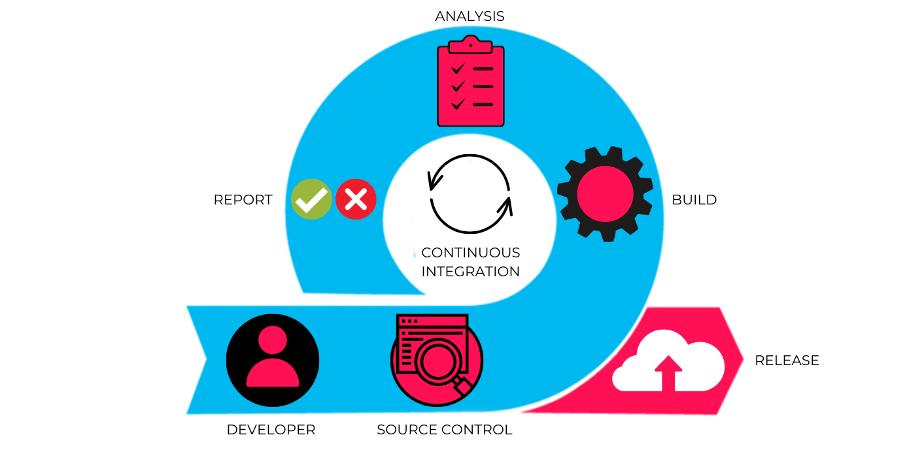
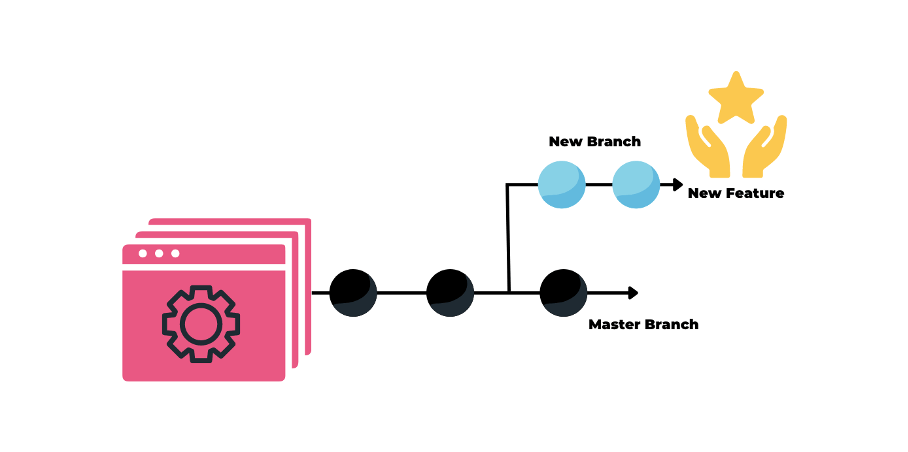
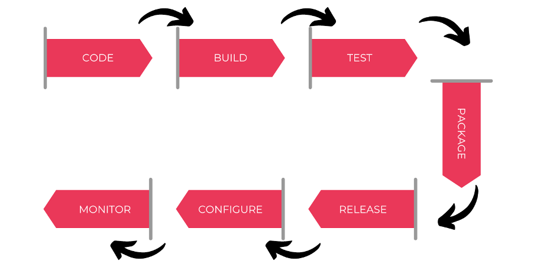

# DevOps Engineer: 30+ Interview Questions and Answers

[https://mp.weixin.qq.com/s/ZJm_dVF4T7CLLtZre_UcMg](https://mp.weixin.qq.com/s/ZJm_dVF4T7CLLtZre_UcMg)

**1. How much do you know about DevOps?**

The words "Developer" and "Operator" are combined to form the term "DevOps".

Developers and Operators are two separate teams working together to get the app ready.

The people who develop the application are called "developers", and the operators set up and operate the application on the server. 

In previous years, not many updates were required after the application was created and launched. Everyone's happy these days because it's going to take too long to update and adjust software to accommodate changes. Development and operations thus diverge. However, modern apps have been constantly updated in recent years. Newer redundancy required the development of a new process culture, giving rise to DevOps.

By coordinating and orchestrating software development and IT operations, businesses can design and deliver applications and services using a set of adaptive practices and processes known as DevOps.

“Developer”和“Operator”这两个词组合起来形成术语“DevOps”。

开发人员和运营商是两个独立的团队，共同努力准备好应用程序。
开发应用程序的人称为“开发人员”，运营人员在服务器上设置并运维此应用程序。前几年，创建并启动应用程序后不需要进行太多更新。这些天每个人都很高兴，因为更新和调整软件以适应变化将花费太长时间。开发和运营因此产生分歧。然而，现代近年来应用不断更新。更新的冗余性要求开发新的流程文化，从而催生了 DevOps。

通过协调和编排软件开发与 IT 运营，企业可以使用一组称为 DevOps 的适应性实践和流程来设计和交付应用程序和服务。

当开发和运营团队协作时，他们可以减少障碍并改进软件创建、分发和监控。
通俗地说，它消除了以前阻碍他们的障碍，以便可以持续交付优质软件功能和应用程序 (CI/CD)。

**2. What is the difference between DevOps and Agile methodologies?**  DevOps 和敏捷方法有什么区别？

A DevOps culture fosters collaboration between development and operations workgroups. **Therefore, software is continuously developed, tested, integrated, deployed and monitored throughout its life cycle.** DevOps resolves issues and disagreements between IT operations and developers.

Agile is a software development methodology that **emphasizes customer feedback and iterative, incremental, small and rapid software releases**. It resolves disagreements and disputes between clients and developers.

DevOps 文化促进开发和运营工作组之间的合作。因此，软件在其整个生命周期中不断开发、测试、集成、部署和监控。DevOps 解决 IT 运营和开发人员之间的问题和分歧。

敏捷是一种强调客户反馈和迭代、增量、小而快速的软件发布的软件开发方法。它解决了客户和开发人员之间的分歧和纠纷。

**3. Which DevOps tools are most widely used?**

The most common DevOps tools are:

* Saltstack
* Puppet
* Chef
* Git
* Jenkins
* Ansible
* Docker
* SonarQube
* Nexus/Artifactory
* Harbor
* Kubernetes
* Maven/Gradle

**4. How many stages are there in DevOps?**

The DevOps lifecycle has eight phases:

* **Planning**: A detailed application type plan is required to fully understand the development process.
* **Code**: The program is coded according to the requirements of the end user.
* **Build**: Create the application by merging the code generated by the previous stages.
* **Testing**: This is the most important stage in the application creation process. Check the functionality of the application and rewrite it if something goes wrong.
* **Integration**: Multiple codes from different programmers are combined into one code.
* **Deployment**: Publishing code in the cloud for use by other users. New updates are thoroughly checked to make sure they don't break high-traffic sites.
* **Action**: Manipulate the code if necessary.
* **Monitoring**: The running of the application is always monitored. The needs of the final consumer are prioritized and adjusted accordingly.

DevOps 生命周期有八个阶段：

* 计划：需要详细的应用类型计划，以便全面了解开发过程。
* 代码：程序根据最终用户的要求进行编码。
* 构建：通过合并前面阶段生成的代码来创建应用程序。
* 测试：这是应用程序创建过程中最重要的阶段。检查应用程序的功能，如果出现问题则重写它。
* 集成：来自不同程序员的多个代码被组合成一个代码。
* 部署：在云计算中发布代码供其他用户使用。新的更新都会经过彻底检查，以确保它们不会破坏高流量的网站。
* 操作：如果需要，对代码进行操作。
* 监控：应用程序的运行始终受到监控。最终消费者的需求被优先考虑，并做出相应的调整。

**5. Describe some of the main benefits of DevOps**

**The main benefits of DevOps are:**

* Continuous delivery of software
* Fewer complex issues to deal with
* Identify defects earlier and fix them faster
* Deliver features faster
* reliable working conditions
* Enhance teamwork and communication

DevOps 的主要优点是：

* 持续交付软件
* 需要处理的复杂问题更少
* 更早识别并更快速修复缺陷
* 更快地交付功能
* 可靠的工作条件
* 增强团队合作和沟通

**6. What is Continuous Integration (CI)?**

开发人员进行编码，然后使用持续集成（CI）方法将其代码组合到主存储库中。每个集成都会通过自动构建过程进行检查，使团队能够比发布后更快地发现代码中的错误。

Developers code and then combine their code into the master repository using a continuous integration (CI) approach. 

Every integration is checked through an automated build process, enabling teams to find bugs in code faster than after release.

7. What is the difference between Continuous Delivery and Continuous Deployment?

**Continuous Delivery 持续交付** 

* Make sure your code is safe to put into production.
* Guarantees the intended functionality of applications and services
* * Deliver every modification to a production-like environment with rigorous automated testing 
* 确保代码可以安全地投入生产。
* 保证应用程序和服务的预期功能。	
* 通过严格的自动化测试将每次修改交付到类似生产的环境中

**Continuous Deployment 持续部署**
 
* Every update that succeeds in automated testing is automatically deployed to production.
* Improve the speed and reliability of software development and release.
* In the absence of such public developer buy-in, monitoring practices are always in place.

* 在自动化测试中成功的每个更新都会自动部署到生产中
* 提高软件开发和发布的速度和可靠性。
* 在缺乏这种公开的开发人员认可的情况下，始终会建立监控实践。

**8. What role does AWS play in DevOps?**

AWS plays the following roles in DevOps:

* **Flexible Services:** Provides elastic, fully provisioned services with no software to install or configure.
* **Built to scale**: AWS services support scaling from a single instance to multiple instances.
* **Automation**: Automate tasks and processes with AWS, giving you more time to innovate.
* **Security**: AWS Identity and Access Management (IAM) supports configuring user permissions and policies.
* **Huge partner ecosystem**: AWS offers a sizable technology platform that can integrate and extend the functionality of AWS services.

AWS 在 DevOps 中扮演以下角色：

* 灵活的服务：提供弹性、充分准备的服务，无需安装或配置软件。
* 专为扩展而构建：AWS 服务支持从单个实例扩展到多个实例。
* 自动化：使用 AWS 实现任务和流程自动化，让您有更多时间进行创新。
* 安全：AWS Identity and Access Management (IAM)支持配置用户权限和策略。
* 庞大的合作伙伴生态系统：AWS提供了一个相当大的技术平台，可以集成和扩展AWS服务的功能。

**9. What is version control?**

Version control, often called source code control, is the act of monitoring and controlling modifications to software code.

With version control, you can:

* Restores the state of the file to its previous state.
* Reverts the entire state of the project to its previous state.
* Compare evolution over time.
* Check who last changed something that could be problematic.
* Who and when initiated the issue?

版本控制通常称为源代码控制，是监视和控制对软件代码的修改的行为。

使用版本控制，您可以：

* 将文件的状态恢复到之前的状态。
* 将项目的整个状态恢复到之前的状态。
* 比较随时间的演变。
* 检查谁最后更改了可能有问题的内容。
* 谁以及何时发起了问题？

**10.使用版本控制有什么好处？**

I suggest you list the benefits of version control as follows:

* A version control system (VCS) enables all team members to work on each file independently at any time. You can later use VCS to merge all the changes into one release.
* VCS neatly organizes all previous iterations and variants. You can request any version whenever you need it, giving you instant access to screenshots of your entire project.
* Every time you save an updated version of your project, your VCS asks you to enter a short summary of the changes you made. Additionally, you can view the contents of the file to determine what changes have been made. From this you can determine who changed the content of the project.
* If the central server goes down, you can use any team member's local Git repository because a distributed VCS like Git gives all team members access to the entire project history.

我建议您列出版本控制的好处如下：

* 版本控制系统(VCS)使所有团队成员能够随时独立处理每个文件 。您稍后可以使用 VCS 将所有更改合并到一个版本中。
* VCS 整齐地组织了之前的所有迭代和变体。您可以在需要时随时索取任何版本，从而可以立即访问整个项目的屏幕截图。
* 每次保存项目的更新版本时，您的 VCS 都要求您输入所做更改的简短摘要。此外，您可以查看文件的内容以确定进行了哪些更改。由此您可以确定谁改变了项目的内容。
* 如果中央服务器出现故障，您可以使用任何团队成员的本地 Git 存储库，因为像 Git 这样的分布式 VCS 使所有团队成员都可以访问整个项目历史记录。

**11. What is the function of SSH?**

Secure Shell (or SSH) is a command-line management protocol that enables users to connect to and control remote servers over a network.

The secure encrypted SSH protocol replaces the previously popular and insecure Telnet. By doing this, you can ensure that communication with the remote server is encrypted.

Secure Shell（或 SSH）是一种命令行管理协议，使用户能够通过网络连接和控制远程服务器。

安全加密的SSH协议取代了以前流行且不安全的Telnet。通过这样做，可以确保与远程服务器的通信是加密的。

**12.How to push files from local computer to GitHub repository using Git? 如何使用 Git 将文件从本地计算机推送到 GitHub 存储库？**

* Step 1: Link the local repository to the remote repository: `git remote add origin [web addr.]`
	* (Example: `git remote add https://github.com/file.git`)
* Step 2: Push the files to the remote repository: `git push origin master`

* 步骤 1：将本地存储库链接到远程存储库：`git remote add origin [web addr.]`    （示例：`git remote add https://github.com/file.git`）
* 步骤 2：将文件推送到远程存储库：`git push origin master`。

**13.Describe the Git branching concept.**

Imagine you are working on an application and plan to add new features to it. New features can be built on new branches that you create.

* The default working branch is always the master branch.
* Different branch commits are indicated by circles on the branches.
* Once you've made all your changes, you can merge them into the master branch.

想象一下您正在制作一个应用程序并计划为其添加新功能。新功能可以构建在您创建的新分支上。

* 默认工作分支始终是 master 分支。
* 不同的分支承诺由分支上的圆圈表示。
* 完成所有更改后，您可以将其合并到主分支。

**14. What are the three most important KPIs for DevOps?**

**A few DevOps KPIs are listed below: DevOps 的三个最重要的 KPI 是什么？下面列出了几个 DevOps KPI：**

* Reduces the time required to recover from failures on average.
* Increase the frequency of deployments.
* Reduce deployment failure rate.

* 平均减少从故障中恢复所需的时间。
* 增加部署的频率。
* 降低部署失败率。

**15. How does Ansible work?**

There are two different categories of servers in Ansible:

* **Control the machine**
* **node**

Ansible must be installed on the control computer to manage nodes using SSH. The manifest of the control machine will specify and configure the location of the nodes.

**Due to the agentless nature of Ansible, no installation is required on the server hosting the remote nodes.** Therefore, there is no need to run any background processes while managing remote nodes.

**With Ansible Playbook and SSH connections, Ansible can control multiple nodes from a single system**. Playbooks can perform various tasks and are in YAML format.

Ansible 中的服务器有两种不同的类别：

• 控制机器

• 节点

Ansible 必须安装在控制计算机上才能使用 SSH 来管理节点。控制机器的清单将指定和配置节点的位置。

由于 Ansible 的无代理特性，无需在托管远程节点的服务器上进行安装。因此，无需在管理远程节点时运行任何后台进程。

借助 Ansible Playbook 和 SSH 连接，Ansible 可以从单个系统控制多个节点。Playbook 可以执行各种任务，并且采用 YAML 格式。

**16. What is Continuous Testing (CT)?**

Continuous testing (CT) is a DevOps phase that requires running automated test cases, which are components of an automated software delivery pipeline. This is a way to receive immediate feedback on the performance of the code being developed and the validation of any business risks.

CT is the DevOps step that consists of executing automated test cases as part of the pipeline in order to receive quick feedback on the quality and validation of company risks associated with automatically generated code.

By using this stage, the team will be able to continuously test each build (once the developed code is pushed), giving the development team the opportunity to receive immediate feedback on their work, and preventing these issues from recurring later in the SDLC.

Doing so will significantly speed up a developer's workflow for developing a project by eliminating the manual involvement steps required to rebuild the project and execute automated tests every time a change occurs.

持续测试 (CT) 是需要运行自动化测试用例的 DevOps 阶段，测试用例是自动化软件交付管道的组件。这是一种接收有关所开发代码的性能和任何业务风险验证的即时反馈的方法。

CT 是 DevOps 步骤，包括作为管道的一部分执行自动化测试用例，以便接收有关与自动生成代码相关的公司风险的质量和验证的快速反馈。

通过使用此阶段，团队将能够连续测试每个构建（一旦开发的代码被推送），使开发团队有机会收到有关其工作的即时反馈，并防止这些问题稍后在 SDLC 中出现循环。

由于不需要在每次发生更改时重建项目和执行自动化测试所需的手动参与步骤，因此这样做将显着加快开发人员开发项目的工作流程。

**17. Can you differentiate between continuous testing and automated testing?**

Here are the differences:

**continuous testing** 

* All automated test cases are run through this process as part of the delivery process. 
* This process replaces manual testing by helping developers create test cases that can be executed repeatedly without manual involvement.
* 所有自动化测试用例都作为交付过程的一部分通过此过程运行。
* 此过程重点关注与最早可能的软件发布相关的商业风险。

**automated testing**

* This process focuses on the business risks associated with the earliest possible software releases. 
* Using a set of pass/fail positions as a guide, this process enables developers to determine whether the functionality they create is bug-free.
* 此过程通过帮助开发人员创建无需手动参与即可重复执行的测试用例来取代手动测试
* 使用一组通过/失败位置作为指导，此过程使开发人员能够确定他们创建的功能是否没有错误。

18. Explain the master-slave architecture of Jenkins.

* Every time code is committed, the Jenkins master retrieves the updated code from the remote GitHub repository.
* It spreads the workload across all Jenkins slaves.
* **The slave executes, builds, tests and generates test reports as instructed by the Jenkins master**.

* 每次提交代码时，Jenkins master 都会从远程GitHub存储库检索更新的代码。
* 它将工作负载分散到所有Jenkins 从机上。
* 从机按照Jenkins 主机的指示执行、构建、测试并生成测试报告。

**19. What are the key concepts in a Jenkins pipeline? Jenkins 管道中的关键概念是什么？**

* **Pipeline**: A CD pipeline is a user-defined model. The pipeline's code specifies how the application is built, tested, and delivered.
*  **Agent**: It is a component of the Jenkins environment that can run pipelines.
*  **Steps**: Indicates a single task that Jenkins executes when triggered.
*  **Stage**: Identifies a theoretically independent set of tasks performed throughout the pipeline (build, test, deploy stages)

* Pipeline：CD 管道是用户定义的模型。管道的代码指定如何构建、测试和交付应用程序。
* Agent：它是Jenkins 环境的组件，可以运行管道。
* Steps：指示Jenkins 在触发时执行的单个任务。
* Stage：标识在整个管道（构建、测试、部署阶段）中执行的一组理论上独立的任务

**20. Describe some basic Git commands.**

The table below summarizes some basic Git commands.

*  starts a new repository `git init` 
* Set the user's username and email address.
	* `git config`
	* `git config --global user.name“[name]”`
	* `git config --global user.email“[email]”`
* Generate a local copy of the repository.
	* `git clone <repository path>`
* Add multiple files to the staging area.
	* `git add`
	* `git add <comma-separated filenames>`
	* `git add .`
* Create a record or snapshot of the file in the staging area.
	* `git commit`
	* `git commit -a`
	* `git commit -m “<add commit message>”`

* Show the diffs between the two mentioned branches and compare the current version with the staging area's file version.
	* `git diff`
	* `git diff [first branch] [second branch]`
	* `git diff -staged`
* List each file that needs to be submitted.
	* git status	
* Delete one or more files from the current working directory and stage them.
	* `git rm <filename>`
* Displays committed metadata and content changes.
	* `git show <commit>`
* Create a brand new branch. Delete the mentioned branch. Lists all available branches, highlighting the branch we are currently on.
	* `git branch`
	* `git branch [branch name]`
	* `git branch -d [branch name]`

**21. How to copy Jenkins from one server to another?**

* Step 1: Transfer jobs from one Jenkins installation to another by copying the relevant job directory.
* Step 2: To duplicate an existing job, clone the job directory and give it a new name.
* Step 3: Rename directory to rename existing jobs.

* 步骤 1：复制相关作业目录，将作业从一个 Jenkins 安装转移到另一个安装。
* 步骤 2：要复制现有作业，请克隆作业目录并为其指定新名称。
* 步骤 3：重命名目录以重命名现有作业。

**22. What resources are available in Puppet?**

* Resources are the main components of any configuration management tool.
* These are characteristics of a node, such as its software or services.
* The actions performed on a resource are described in the resource declaration written to the catalog.
* When the catalog is performed, the node will be in the desired state.

* 资源是任何配置管理工具的主要组件。
* 这些是节点的特征，如其软件或服务。
* 对资源执行的操作在写入目录的资源声明中进行描述。
* 执行编录时，节点将处于所需状态。

**23. What are Ansible roles?**

Ansible 角色是什么？

**Ansible roles are embedded in Playbooks, which are independent sets of tasks, variables, files, and templates**

Ansible 角色嵌入在Playbook中，是一组独立的任务、变量、文件和模板。

**24. What is the use of Dockerfile?**

* **Docker image is generated using Dockerfile**.
* **Docker images allow any user to run code that builds Docker containers**.
* **After the Docker image is created, it will be uploaded to the Docker registry.**
* **Users can create new containers at any time by retrieving Docker images from the Docker registry.**

* Docker 镜像是使用Dockerfile生成的。
* Docker 镜像允许任何用户运行构建 Docker 容器的代码。
* Docker 镜像创建后会上传到 Docker 注册表。
* 用户可以随时通过从 Docker 注册表检索 Docker 镜像来创建新容器。

**25. How to run multiple containers with a single service? 如何使用单个服务运行多个容器？**

* 使用 Docker Compose，多个容器可以作为单个服务运行。
* 每个容器独立运行，但仍然能够通信。
* Docker Compose 文件是 YAML 文件。

* Using Docker Compose, multiple containers can run as a single service.
* Each container runs independently, but is still able to communicate.
* Docker Compose files are YAML files.

**26. Which are the top DevOps tools? What tools have you used?**

The most popular DevOps tools are

* Git: for version control.
* Jenkins: for continuous integration.
* Selenium: For continuous testing.
* Puppet, Chef, Ansible: for configuration management and deployment.
* Prometheus: for continuous monitoring.
* Docker: for containerization.

最流行的 DevOps 工具是

* Git：用于版本控制。
* Jenkins：用于持续集成。
* Selenium：用于连续测试。
* Puppet、Chef、Ansible：用于配置管理和部署。
* Prometheus：用于连续监控。
* Docker：用于容器化。

在我的职业生涯中，我使用所有这些工具成功开发和部署了软件。

如果您没有使用所有这些工具：这些（您使用的）工具是我的专业领域，并且我熟悉其他工具

**27. How do all these tools work together?**

我将用一个简单的流程来解释。但根据具体情况，此过程可能因组织而异。

* 开发人员生成源代码，并使用Git等版本控制系统工具对其进行管理。
* 开发人员将代码发送到 Git 存储库，然后将任何更改提交到存储库。
* Jenkins 使用 Git 插件从存储库中提取此代码，然后使用 Ant 或 Maven 构建它。
* Puppet 是一个配置管理工具，用于部署和设置测试环境。然后 Jenkins 在测试环境中发布此代码，并使用 Selenium 等工具进行测试。
* 代码经过测试后，Jenkins 将代码发送到生产服务器进行部署。
* 当使用 Prometheus 等部署工具对其进行持续监控时。
* 构建功能的测试环境由 Docker 容器提供。

I will explain with a simple flow. However, this process may vary from organization to organization, depending on the circumstances.

* Developers generate source code and manage it using version control system tools like Git.
* Developers send code to a Git repository, and then commit any changes to the repository.
* Jenkins pulls this code from the repository using a Git plugin, then builds it using Ant or Maven.
* **Puppet is a configuration management tool for deploying and setting up test environments. Jenkins then publishes this code in a test environment and tests it with tools like Selenium**.
* After the code is tested, Jenkins sends the code to the production server for deployment.
* When it is continuously monitored with a deployment tool such as Prometheus.
* The test environment for build functionality is provided by Docker containers.

**28. How are Puppet modules different from Puppet manifests?**

**Puppet modules consist of manifests and data**. 

Puppet automatically loads classes, facts, custom types, definition types, and tasks when they have a specific directory structure. 

**Modules must have valid names and be installed in Puppet's module path.**

**The Puppet Manifest is a code-based Puppet program. It uses PP extensions.**

**Puppet 模块由清单和数据组成**。

当类、事实、自定义类型、定义类型和任务具有特定的目录结构时，Puppet 会自动加载它们。模块必须具有有效的名称并安装在 Puppet 的模块路径中。

**Puppet Manifest 是基于代码的 Puppet 程序。它采用PP扩展。**

**29. How to configure a system using Puppet?**

There are two ways to configure a system with Puppet:

* **Puppet Agent and Puppet Master should be used in client or server architecture.**
* Puppet applications should be used in standalone architectures.

使用 Puppet 配置系统有两种方法：

* Puppet Agent 和 Puppet Master 应该在客户端或服务器架构中使用。
* Puppet 应用程序应在独立架构中使用。

**30. How is Ansible playbook different from ad-hoc commands?**

* Server configuration work is described in scripted organizational units called Ansible playbooks. It works well for repetitive movements.
* Temporary commands are used for quick, occasionally repetitive tasks.

* 服务器配置工作在称为 Ansible playbook 的脚本组织单元中进行描述。它适用于重复性动作。
* 临时命令用于快速、偶尔重复的任务。

**31. How is Ansible different from Puppet?**

**Ansible **

* Easy agentless installation 
* Developing in Python 
* Configuration files are written in YAML 
* 轻松无代理安装	
* 使用Python开发	
* 配置文件是用YAML编写的	

**Puppet**

* Agent-based installation
* Developing in Ruby
* Configuration files are written in DSL
* 基于代理的安装
* 使用 Ruby 开发
* 配置文件是用DSL编写的

**32. Why use SSL certificate in Chef?**

* To ensure that each node can access the correct data, **SSL certificates are used between the Chef server and clients**.
* **Each node has a set of private and public keys. On the Chef server, save the public key.**
* **The node's private key will be included in the SSL certificate sent to the server**.
* The server uses this in conjunction with the public key to identify the node and grant it access to the data.

* 为了确保每个节点都能访问正确的数据，Chef 服务器和客户端之间使用了 SSL 证书。
* 每个节点都有一组私钥和公钥。在 Chef 服务器上，保存公钥。
* 节点的私钥将包含在发送到服务器的 SSL 证书中。
* 服务器将其与公钥结合使用来识别节点并授予其访问数据的权限。

33. How is a Chef CookBook different from a Chef Recipe?

* **Chef Recipes are a collection of resources primarily for configuring software and other infrastructure.** Ruby is the language used to write recipes.
* In contrast, **Chef cookbooks** contain recipes for achieving the desired state of a node.

* Chef Recipe 是主要用于配置软件和其他基础设施的资源集合。Ruby 是用来编写菜谱的语言。
* 相比之下，厨师食谱包含实现节点所需状态的食谱。

34. Explain the architecture of Docker

* Docker runs on a client-server architecture.
* Commands are run by the Docker client service. The REST API is used to translate commands before sending them to the Docker daemon (server).
* To create Docker images and run Docker containers, the Docker daemon accepts requests and communicates with the operating system.
* Instruction templates called Docker images are used to build containers.
* A Docker container is a package that contains an application and its dependencies.
* Docker Registry is a service for storing and distributing Docker images to users.

* Docker 在客户端-服务器架构上运行。
* 命令由 Docker 客户端服务运行。REST API 用于在将命令发送到 Docker 守护程序（服务器）之前对其进行翻译。
* 为了创建 Docker 映像并运行 Docker 容器，Docker 守护进程接受请求并与操作系统进行通信。
* 称为 Docker 映像的指令模板用于构建容器。
* Docker 容器是一个包含应用程序及其依赖项的包。
* Docker 注册表是一个用于存储和分发 Docker 镜像给用户的服务。

**35. What is kubectl?**

Kubectl is a command-line tool that allows users to issue commands to Kubernetes clusters. Ctl stands for "control" in this context. You can use the "kubectl" command line interface to deploy applications, inspect and manage cluster resources, and view logs.

37. How do containers communicate in Kubernetes?

In Kubernetes, Pods map containers to each other. 

Multiple containers may exist within a Pod. 

In an overlay network, Pods have a simple network hierarchy and communicate with each other in a flat fashion, so in theory, any Pod there can communicate with any other Pod.

在 Kubernetes 中，Pod 将容器相互映射。一个 Pod 内可能存在多个容器。在覆盖网络中，Pod 具有简单的网络层次结构，并以扁平的方式相互通信，因此理论上，那里的任何 Pod 都可以与任何其他 Pod 通信。

**38. Describe IaC and configuration management**

Unlike manually or through a GUI, the infrastructure as code (IaC) paradigm manages and tracks infrastructure configuration in files. This allows for more flexibility in the configuration of the infrastructure, and more importantly, changes can be clearly tracked using a version control system.

Software programs known as configuration management systems enable consistent, reliable, and secure management of environments.
By using an optimized DSL to specify the state and configuration of system elements, multiple people can collaborate and store system configurations for hundreds of servers in one place.

Ansible has no centralized server, configuration is stored in YAML. Via SSH (or WinRM on Windows), the stateful configuration is sent to the server, where it is then executed. The downside of this approach is that managing thousands of machines can take a long time.

与手动或通过图形用户界面不同，基础设施即代码 (IaC)范式管理和跟踪文件中的基础设施配置。这使得基础设施的配置更加灵活，更重要的是，可以使用版本控制系统清晰地跟踪更改。

称为配置管理系统的软件程序可实现环境的一致、可靠且安全的管理。
通过使用优化的 DSL 来指定系统元素的状态和配置，多个人可以协作并将数百台服务器的系统配置存储在一个位置。

Ansible 没有集中式服务器，配置存储在 YAML 中。通过 SSH（或 Windows 上的 WinRM），状态配置被发送到服务器，然后在服务器上执行。

这种方法的缺点是管理数千台机器可能需要很长时间。