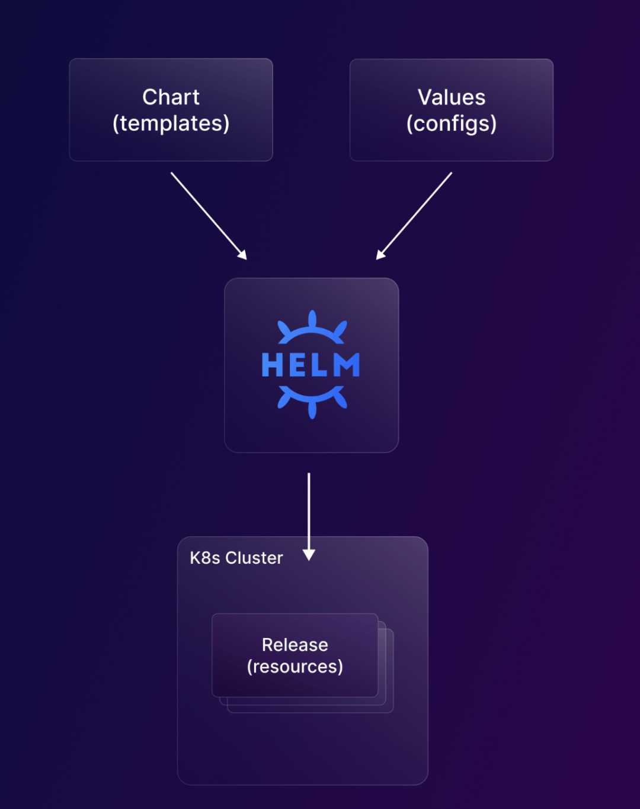
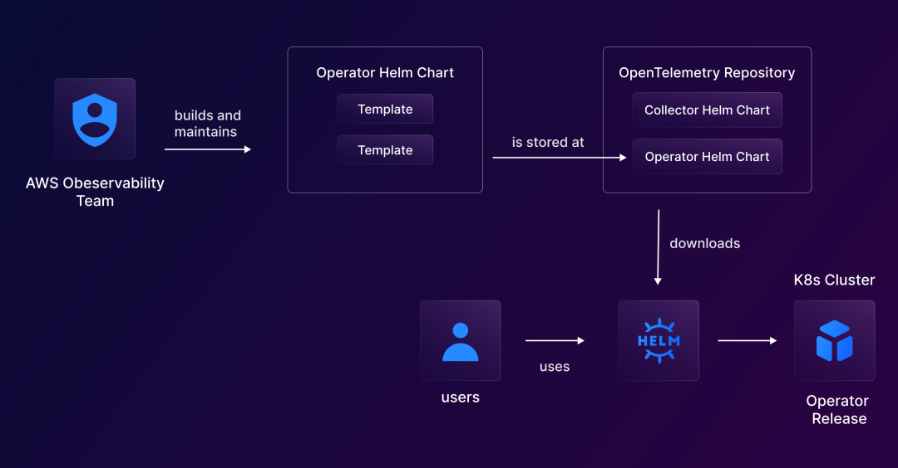

# **Helm指南：Kubernetes包管理器简介**

**什么是Helm？**

* Helm是Kubernetes的包管理器，可简化应用程序部署和管理。
* 它使用户能够使用单个命令定义、安装和升级复杂的应用程序。
* Helm 提供适合初学者的用户友好型设计，以及大量随时可用的Helm Chart仓库，可轻松安装和管理各种应用程序。

**What is Helm?**

* Helm is a package manager for Kubernetes that simplifies application deployment and management. 
* It enables users to define, install and upgrade complex applications with a single command. 
* Helm offers a user-friendly design for beginners, and a large repository of ready-to-use Helm Charts for easy installation and management of various applications.


**关键概念**

Helm 使用 Helm Charts 管理应用程序的部署生命周期，确保跨不同环境和用户的一致性。

用户可以创建自己的Helm Charts进行部署，或使用来自公共存储库的第三方和开源工具的Charts，**例如artifacthub、bitnami charts、harbor和 chart museum.**


Helm uses Helm Charts to manage the deployment lifecycle of applications, ensuring consistency across different environments and users. 

Users can create their own Helm Charts for deployment, or use charts from third-party and open source tools from public repositories such as artifacthub, bitnami charts, harbor, and chart museum.


### **Helm Charts**

Helm Charts是一组文件，描述了在 Kubernetes 上部署应用程序所需的资源和依赖项。它允许模块化和版本控制，使应用程序分发、共享和管理更易于跨各种集群和用户访问。


该包由多个文件和目录组成，每个文件和目录都有特定的功能。**Helm 读取Charts并根据提供的配置（values.yaml 文件）生成必要的 Kubernetes 清单。Helm Charts可以具有依赖项，存储在charts目录中称为subcharts**

### **Chart 结构**

* charts: 子chart，目录下存放依赖项。
* templates: 这些用Golang 编写的模板文件与 values.yaml 配置数据合并。
* templates/NOTES.txt: 包含简短使用说明的纯文本文件。
* crd: 存储将在 helm 安装期间安装的 CRD。
* Chart.yaml: 元数据信息，例如版本、名称、搜索关键字等。
* LICENSE：Chart 的纯文本格式许可证。
* README.md: 以可读的格式使用chart的重要描述信息。
* requirements.yaml ：Chart的依赖配置。
* values.yaml: Chart中的配置文件。
* values.schema.json： 用于在 value.yaml 文件上强加结构的 JSON 架构。


### **Helm releases**

Helm 架构中的下一个重要组件是releases. Helm中的release表示 Kubernetes 集群中部署的 Chart 的实例。release由所有Kubernetes对象和资源组成，例如部署、服务和入口规则，它们是作为Chart中指定配置的一部分创建的。


### **Helm chart repository**


Helm chart存储库或 repos 是专用的HTTP服务器，它与 index.yaml 文件一起托管和提供Chart，该文件提供有关Chart集合及其下载位置的信息。

Helm 客户端可以连接到多个Chart存储库，最初默认情况下没有配置。使用该helm repo add命令，用户可以毫不费力地配置和添加新的Chart存储库，从而可以无缝访问和管理其 Kubernetes 部署的各种Chart。


流行的Chart存储库有artifcathub、bitnami Charts、Harbor和Chart Museum。

### **Chart version**


每个Chart都必须有一个版本号。存储库中的包通过名称加版本来标识。Helm chart根据SemVer2 规范进行版本控制。**例如，版本字段设置为版本：1.2.3的nginx将被命名为：nginx-1.2.3.tgz**


版本号可在Chart.yaml文件中找到，并由各种 Helm 工具（包括 CLI）使用。

**`helm package`创建包时，该命令使用Chart.yaml中定义的版本号。系统期望包名称中的版本号与Chart.yaml中的版本号相匹配，任何差异都会导致错误。**


### Chart dependency

在Helm中，一个Chart可能依赖于任意数量的其他chart。这些依赖项可以通过两种方式添加 - 通过使用依赖项字段动态链接Chart.yaml或将其放入charts/目录并手动管理。

使用 dependencies 字段的示例：

```
dependencies:
  - name: apache
    version: 1.2.3
    repository: https://example.com/charts
  - name: mysql
    version: 3.2.1
    repository: https://another.example.com/charts
```

存放到charts目录的示例：

```
wordpress:
  Chart.yaml
  # ...
  charts/
    apache/
      Chart.yaml
      # ...
    mysql/
      Chart.yaml
      # ...
```

### Release version（发布版本）

一个版本可以修改多次。为了跟踪这些变化，使用了连续计数器。helm install初始时，版本号设置为 1。每次后续升级或回滚时，版本号都会增加 1。如果需要回滚到以前的版本号，此历史记录很有用。

### Helm rollback

该`helm rollback <RELEASE> [REVISION] [flags]` 命令可用于回滚到该版本的任何先前版本。注意：回滚版本将收到新的版本号。

### Helm SDK

Helm SDK是指直接与 Kubernetes API 服务器交互以安装、升级、查询和删除 Kubernetes 资源的 Go 代码。它可以导入到项目中以使用 Helm 作为客户端库而不是 CLI。


## Helm 架构

该图更好地解释了 Helm 如何使用chart和values文件来管理 Kubernetes 集群中的发布（已部署的资源）。


此图显示了 OpenTelemetry Operator Helm chart工作流程。

在这里，您可以看到 AWS Observability 团队如何在公共存储库中构建和维护 Helm chart，并且可以将其无缝下载并部署到用户集群。




此图显示了 OpenTelemetry Operator Helm chart工作流程。在这里，您可以看到 AWS Observability 团队如何在公共存储库中构建和维护 Helm chart，并且可以将其无缝下载并部署到用户集群。

与之前部署 OpenTelemetry Operator的方法相比，此过程还有几个好处。

* 添加了安装/卸载包、升级、回滚和自定义安装等功能。
* 用户可以通过values.yaml 文件灵活地配置值，您可以确定将哪些值传递给 OpenTelemetry Operator Helm 图表配置。您可以使用一个命令覆盖多个值。
* 这是将 Operator 部署到 Kubernetes 的最简单方法。



## 为什么要使用 Helm？

在 Kubernetes 上部署和管理资源的方法有多种；为什么要选择 Helm？流行的替代方案是Kustomize、Tanka和Carvel，它们的社区都不如 Helm 成熟，并且缺乏公开可用的Chart（包）的数量。

Helm 因其处理简单和复杂配置、版本控制、可重用性等的能力而成为明显的赢家。

还有一些方法可以同时使用Helm 和 Kustomize。
以下是 Helm 的主要优点：


* 简单性：只需一个命令即可定义、安装、升级和回滚复杂的 Kubernetes 应用程序。这极大地简化了Kubernetes资源的管理和部署。
* 可重用性：Helm Chart本质上是预先配置的 Kubernetes 资源的包。这些图表可以在项目之间重复使用，并与更广泛的社区共享。
* 可配置性：Helm 提供了一个高度可配置的结构，包括图表（模板）和值（配置）。只需更改一些参数，我们就可以使用相同的图表在多个环境（例如 stag/prod 或多个云提供商）上进行部署。
* 一致性：Helm 图表提供了打包和部署 Kubernetes 资源的标准化方法。这有助于确保不同环境之间的一致性，并降低部署中出现错误或不一致的风险。
* 可扩展性：使用 Helm，您可以通过调整文件中的值轻松扩展或缩小 Kubernetes 应用程序values.yaml。
* 社区：Helm 拥有一个庞大且活跃的社区，不断开发和改进该工具。这意味着有许多资源和最佳实践可帮助您充分利用 Helm。