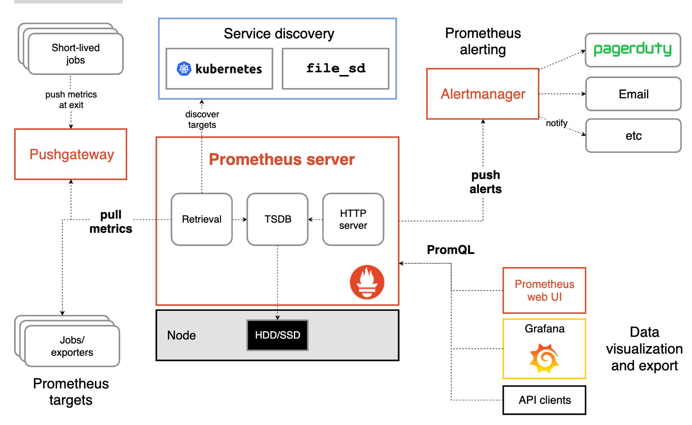

# **第七节 prometheus：要点总结及面试**


## **1、要点总结**

### **1-1 简介**

Prometheus是一款开源的监控和告警工具，用于**时序数据的存储和查询**。Prometheus适用于统计相关的指标，但不适合记录复杂的细节信息。


### **1-2 主要特征**

* 多维的数据模型；
* 灵活的查询语言；
* 不依赖分布式存储，单个服务器节点是自主的；
* 基于HTTP的数据拉取；
* 通过中间网关推送数据；
* 通过静态配置和服务发现监控目标；
* 多样化的数据界面。


### **1-3 重要组件**


* Prometheus server：最重要的组件，用于抓取及存储数据；
* **client libraries：客户端库**
* **push gateway：中间网关，用来支持短生命周期的服务**
* exporters：特定目的的数据源
* alertmanager：用于处理告信息
* 各种支持的工具


### **1-4 基础架构**



主要流程：

1. 数据抓取。Prometheus server从监控目标（targets）中拉取数据。targets包括：
	* `short-lived jobs`，由于服务时间很短，所以短期服务在服务结束时将数据推送给`Pushgateway`，`Prometheus server`从`Pushgateway`中抓取数据；
	* **exporters：用于第三方的服务给Prometheus**；
	* **Service discovery：consul、DNS等服务发现**。
2. 数据存储。Prometheus server用于存储抓取到的指标。数据可以存储到本地硬盘或者云端。
3. 告警。**Prometheus可以通过配置rule实现告警。当满足特定条件时，将alert推送到AlertManager**。
4. 数据查询和显示。通过PromQL查询，通过Prometheus webUI或grafana等其他工具来可视化显示数据


##  **2、基本概念**

### **2-1 数据模型**

Prometheus以时间序列的形式存储数据，以名称和键值对标签为唯一标识，不同标识代表不同的时间序列。

**指标名称（metric name）：**

指标名称用来指定测量指标的功能。它必须满足`[a-zA-Z_:][a-zA-Z0-9_:]*`。

**标签（label）：**

标签的应用保证了Prometheus数据的多维性。对于同一个指标名称，不同标签的组合代表了不同维度的数据。查询语句支持基于标签进行过滤和聚合。标签的增删也代表了时序数据的增删。

 标签名要求匹配`[a-zA-Z_][a-zA-Z0-9_]*`，但是“_”开头的标签预留给内部使用；标签值可以包含任意Unicode字符。

**样本（sample）：**

样本是时序数据在一个时间点的数值，是时序数据的组成元素。样本包含一个float64的数值，和一个毫秒级的时间戳。

格式：

```
<metric name>{<label name>=<label value>, ...}
```

示例：

```
api_http_requests_total{method="POST", handler="/messages"}
```

### **2-2 指标类型：**

Prometheus客户端支持4中数据格式。

**计数器（counter）：**

**计数器是一种累加的指标，用来表示只增不减的数据。适用于记录请求次数等指标**。

**仪表值（gauge）：**

**仪表值表示数值可以任意增减的指标，适用于记录内存使用率等指标**。

**直方图（histogram）：**

直方图主要用于表示在一段时间范围内对数据进行采样，**并对指定区间和总数进行统计**。通常用来统计请求时间或者响应大小等数据。

直方图通过指标的basename暴露一系列的时序数据：

1. 观察值在观察区间的计数值，显示为`<basename>_bucket{le="<upper inclusive bound>"}`的形式；
2. 观察值的汇总值，显示为`<basename>_sum`；
3. 观察值的计数值，显示为`<basename>_count，等效于<basename>_bucket{le="+Inf"}`。

使用`histo_quantile()`函数可以计算直方图的分位数。

从Prometheus的metrics路径下，可以看到`Prometheus`中的指标，直方图示例：

```
# HELP prometheus_http_response_size_bytes Histogram of response size for HTTP requests.
# TYPE prometheus_http_response_size_bytes histogram
prometheus_http_response_size_bytes_bucket{handler="/",le="100"} 1
prometheus_http_response_size_bytes_bucket{handler="/",le="1000"} 1
prometheus_http_response_size_bytes_bucket{handler="/",le="10000"} 1
prometheus_http_response_size_bytes_bucket{handler="/",le="100000"} 1
prometheus_http_response_size_bytes_bucket{handler="/",le="1e+06"} 1
prometheus_http_response_size_bytes_bucket{handler="/",le="1e+07"} 1
prometheus_http_response_size_bytes_bucket{handler="/",le="1e+08"} 1
prometheus_http_response_size_bytes_bucket{handler="/",le="1e+09"} 1
prometheus_http_response_size_bytes_bucket{handler="/",le="+Inf"} 1
prometheus_http_response_size_bytes_sum{handler="/"} 29
prometheus_http_response_size_bytes_count{handler="/"} 1
```

**概要（summary）：**

**概要和直方图类似，也是一种总结性的观察样本，例如请求时间和响应大小。它除了提供观察值的总的计数值和汇总值，还可以计算分位数。**

概要也通过指标的basename暴露一系列的时序数据：

1. 观察值的中位数，显示为`<basename>{quantile="<φ>"}，(0 ≤ φ ≤ 1)`；
2. 观察值的汇总值，显示为`<basename>_sum`；
3. 观察值的计数值，显示为`<basename>_count`。

示例：

```
# HELP go_gc_duration_seconds A summary of the GC invocation durations.
# TYPE go_gc_duration_seconds summary
go_gc_duration_seconds{quantile="0"} 2.9743e-05
go_gc_duration_seconds{quantile="0.25"} 6.9639e-05
go_gc_duration_seconds{quantile="0.5"} 0.000105693
go_gc_duration_seconds{quantile="0.75"} 0.000173332
go_gc_duration_seconds{quantile="1"} 0.02720063
go_gc_duration_seconds_sum 0.083278187
go_gc_duration_seconds_count 346
```

### **2-3 Job和Instance**

**一个单独的抓取目标是一个Instance，一组相同类型的Instance组成一个job。**例如：


**`job: api-server`**


* instance 1: 1.2.3.4:5670
* instance 2: 1.2.3.4:5671
* instance 3: 5.6.7.8:5670
* instance 4: 5.6.7.8:5671

Prometheus抓取指标的时候，会自动生成一些标签，包括job和instance。

* `job`：配置文件中该抓取目标归属的job。
* `instance：<host>:<port>`形式的抓取目标的url。

对于每个抓取目标，Prometheus会自动生成一些时序数据：

* `up{job="<job-name>", instance="<instance-id>"}`：判断实例是否可用，可用为1，不可用为0；
* `scrape_duration_seconds{job="<job-name>", instance="<instance-id>"}`：从该数据集抓取数据的时间开销。
* `scrape_samples_post_metric_relabeling{job="<job-name>", instance="<instance-id>"}`：表示采用重定义标签操作后仍然剩余的样本数。
* `scrape_samples_scraped{job="<job-name>", instance="<instance-id>"}`：**从该数据源抓取到的样本数量**。


## **3、配置**

Prometheus有两种配置方式：通**过命令行参数配置，以及通过配置文件配置**。

命令行参数主要用于配置系统参数（例如：存储位置，保留在磁盘和内存中的数据量大小等），可以通过`./prometheus -h`命令查看全部命令行参数。

配置文件则用来定义抓取目标相关的一系列信息，并制定加载的rule文件，默认为`prometheus.yml`文件。

在`--web.enable-lifecycle`开启的情况下，可以通过给`Prometheus server`发送`SIGHUP`或者向`/-/reload`路径发送一条HTTP post请求，让运行中的`Prometheus`加载配置文件，以及配置的rule文件。

如下主要描述配置文件中的配置。

### **3-1 全局配置**

global标签下的配置，会作用到所有的抓取目标。有4种配置

* `scrape_interval`：拉取 targets的默认时间间隔。
* `scrape_timeout`：拉取一个 target 的超时时间。
* **`evaluation_interval`：评估rules的时间间隔**。
* **`external_labels`：和外部系统交流时，添加到数据中的标签**。

格式和默认值：

```
global:
  # How frequently to scrape targets by default.
  [ scrape_interval: <duration> | default = 1m ]
 
  # How long until a scrape request times out.
  [ scrape_timeout: <duration> | default = 10s ]
 
  # How frequently to evaluate rules.
  [ evaluation_interval: <duration> | default = 1m ]
 
  # The labels to add to any time series or alerts when communicating with
  # external systems (federation, remote storage, Alertmanager).
  external_labels:
    [ <labelname>: <labelvalue> ... ]
```

示例：

```
global:
  scrape_interval: 15s
  scrape_timeout: 10s
  evaluation_interval: 15s
```


### **3-2 规则文件配置**

`rule_files`标签下的配置，它指定了一系列的rules 文件。

格式：

```
# Rule files specifies a list of globs. Rules and alerts are read from
# all matching files.
rule_files:
  [ - <filepath_glob> ... ]
```

示例：

```
rule_files:
  - "rules/simple.rules"
  - "rules/rules/*.rules"
```

### **3-3 抓取配置**


`scrape_configs`节点下的配置。主要用来配置拉取的数据。

格式：

```
# A list of scrape configurations.
scrape_configs:
  [ - <scrape_config> ... ]
```

**`scrape_config`：**

`scrape_config`中包含如下标签：

* `job_name`：任务名称
* `honor_labels`： 用于解决拉取的数据中标签和服务端侧标签（Prometheus自动生成的job和instance）有冲突的情况。当设置为 true, 以拉取数据中的标签为准，忽略服务器端配置的标签；设置为false则标签以服务配置为准，并将抓取数据中的标签重命名为`exported_<original-label>`，例如exported_instance。当然，全局配置中的external_labels不受此标签的影响，external_labels只在时序数据没有external_labels中配置的标签的情况下，才会生效。honor_labels的默认值为false。
* params：数据拉取访问时带的请求参数
* `scrape_interval`： 拉取时间间隔
* `scrape_timeout`: 拉取超时时间
* `metrics_path`： 拉取节点的 metric 路径
* `scheme`： 拉取数据访问协议
* `sample_limit`： 被抓取数据的标签个数限制。如果指标的标签在relabel之后超过限制（大于或等于限制值），该数据将被忽略，不入存储；默认值为0，表示没有限制
* `relabel_configs`： 拉取数据重置标签配置
* `metric_relabel_configs`：metric重置标签配置

示例：

```

scrape_configs:
- job_name: node
  metrics_path: /metrics
  scheme: http
  static_configs:
  - targets:
    - 10.1.204.109:9100
    labels:
      instance: service1
  - targets:
    - 10.1.205.235:9100
    labels:
      instance: private
- job_name: consul-knowledge
  metrics_path: /actuator/prometheus
  scheme: http
  consul_sd_configs:
  - server: 10.1.204.79:8500
    tag_separator: ','
    scheme: http
    allow_stale: true
    refresh_interval: 30s
    services:
    - knowledge-service
    - gateway-service
```

完整的`scrape_configs`的配置参考官网：[`scrape_config`](https://prometheus.io/docs/prometheus/latest/configuration/configuration/#scrape_config)

### **3-4 告警配置**

alerting节点下的配置，用来指定Alertmanager相关的配置。

格式和包含的标签：

```
# Alerting specifies settings related to the Alertmanager.
alerting:
  alert_relabel_configs:
    [ - <relabel_config> ... ]
  alertmanagers:
    [ - <alertmanager_config> ... ]
```

### **3-5 远程读写配置**

`remote_write`节点主要用于可写远程存储配置，主要包含以下参数：

* url: 访问地址
* `remote_timeout`: 请求超时时间
* `write_relabel_configs`: 标签重置配置, 拉取到的数据，经过重置处理后，发送给远程存储

`remote_read`节点主要用于可读远程存储配置，主要包含以下参数：

* url: 访问地址
* `remote_timeout`: 请求超时时间

详细的标签信息参考官网：https://prometheus.io/docs/prometheus/latest/configuration/configuration/#remote_write

## **4、告警模块**

告警模块分为两部分。Prometheus Server中的告警规则用来给Alertmanager发送告警；Alertmanager负责管理告警，包括告警的沉默、抑制、汇聚以及通过邮件、PagerDuty或HipChat等方式来发送告警。

创建告警及提示的主要流程：

1. 创建并配置Alertmanager；
2. 建立Prometheus和Alertmanager的联系；
3. 在Prometheus创建告警规则。

### **4-1 Alertmanager**

Alertmanager用于接受和处理客户端发来的告警消息，例如Prometheus server发送的告警。它主要负责告警消息的去重、分组、路由，以及沉默和消除告警。Alertmanager在Prometheus的配置文件中进行配置。

**分组Grouping：**

 分组功能是把具有相似行政的告警归类到一个通知中。这个功能在发生停电、断网之类的事故，导致很多系统同时故障、出现大量告警的情况下，作用非常显著。这种情况下用户可以对告警按集群或者告警名字分组，避免这种情况下收到大量重复的告警消息。

警报分组，分组通知的时间，和通知的接受者是在配置文件中由一个路由树配置的。

**抑制Inhibition：**

 抑制功能用来在一些特定告警已经产生的情况下，抑制另外一些特定告警的通知。例如一个通知集群不可用的告警触发的时候，其他的关于这个告警中的服务或者机器不可用的告警就可以被抑制。

**沉默Silences：**

沉默用来设置在给定时间内忽略告警。沉默功能是在matchers中进行配置的，和路有树相似。接受到的告警会被检查是否和活跃的slience相等或者相匹配，如果是的话这些告警不会发送通知。

## **5、查询**

### **5-1 数据类型**

* 瞬时向量：例如`http_request_total`
* 范围向量：例如：`http_request_total[5m]`。时间单位：[s,m,h,d,w,y]
* 标量：例如：函数up的值
* 字符串：暂未启用

### **5-2 操作符**

**二元操作符：**

* 算术二元运算符：`+, -, *, /, %, ^`
* 比较二元操作符：`==, !=, >, <, >=, <=`
* 逻辑/集合二元操作符：`and, or, unless`

**聚合操作符**：

* sum ，max ，min ，avg，stddev (求标准差)，stdvar (求方差)，
* count ，`count_values` (统计相同数据值的元素数量)，bottomk (样本值第k个最小值)，
* topk (样本值第k个最大值)，quantile (统计分位数)

**二元运算符的优先级：**

二元运算符优先级从高到低：

* ^
* *, /, %
* +, -
* ==, !=, <=, <, >=, >
* and, unless
* or

### **5-3 函数**

  参数过多，详情参考官方文档：[Prometheus-Functions](https://prometheus.io/docs/prometheus/latest/querying/functions/)
  
示例：

* `increase(v range-vector)`：v是参数值，range-vector是参数类型，例如：`increase(http_request_total{job=”prometheus”}[1m])`
* `year(v=vector(time()) instant-vector)`：vector(time())表示默认值，有默认值的函数可以不传参数


## **6、prometheus之面试题**

### **6-1 全局配置**

global标签下的配置，会作用到所有的抓取目标。有4种配置

* `scrape_interval`：拉取 targets的默认时间间隔。
* `scrape_timeout`：拉取一个 target 的超时时间。
* `evaluation_interval`：评估rules的时间间隔。
* `external_labels`：和外部系统交流时，添加到数据中的标签。

```
global:
  scrape_interval: 15s
  scrape_timeout: 10s
  evaluation_interval: 15s　
```

### **6-2 规则文件配置**

`rule_files` 标签下的配置，它指定了一系列的rules 文件。

```
rule_files:
  - "rules/simple.rules"
  - "rules/rules/*.rules"
```

### **6-3 抓取配置**

`scrape_configs`节点下的配置。主要用来配置拉取的数据。、

```
scrape_configs:
- job_name: node
  metrics_path: /metrics
  scheme: http
  static_configs:
  - targets:
    - 10.1.204.109:9100
    labels:
      instance: service1
  - targets:
    - 10.1.205.235:9100
    labels:
      instance: private
- job_name: consul-knowledge
  metrics_path: /actuator/prometheus
  scheme: http
  consul_sd_configs:
  - server: 10.1.204.79:8500
    tag_separator: ','
    scheme: http
    allow_stale: true
    refresh_interval: 30s
    services:
    - knowledge-service
    - gateway-service
```

### **6-4 告警配置**

alerting节点下的配置，用来指定Alertmanager相关的配置。

```
# Alerting specifies settings related to the Alertmanager.
alerting:
  alert_relabel_configs:
    [ - <relabel_config> ... ]
  alertmanagers:
    [ - <alertmanager_config> ... ]
```

### **6-5 服务发现配置**

prometheus服务发现：

```
- job_name: kubernetes-nodes
kubernetes_sd_configs:
- role: node
```

### **6-6 prometheus热更新：**

`curl -X POST “http://10.102.74.90:9000/-/reload”`


