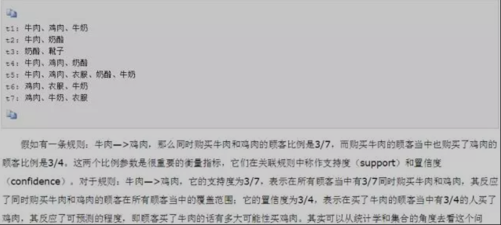
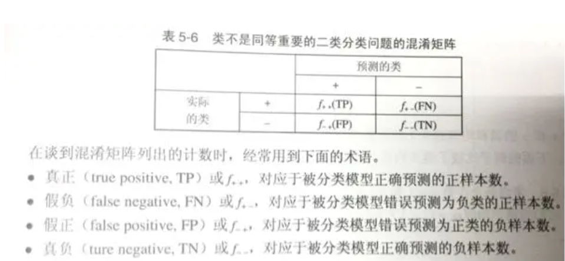
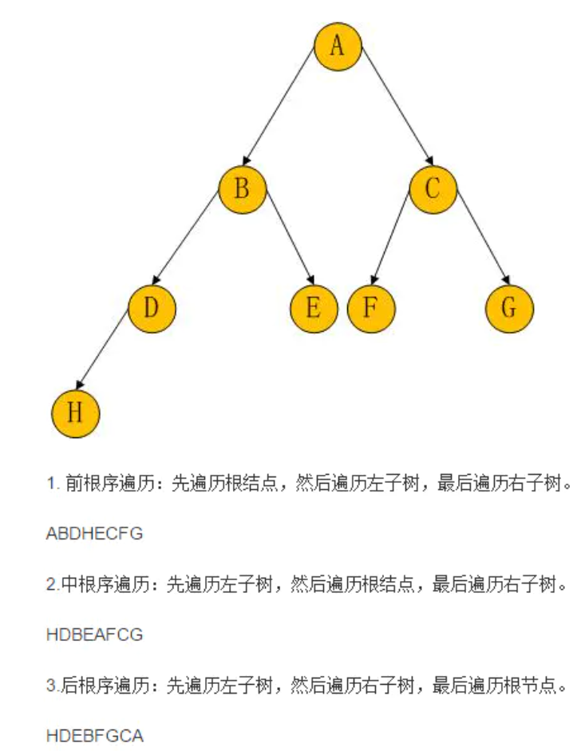

# **第八节 分析岗笔试/面试知识点**

## **知识点1：贝叶斯公式**

贝叶斯公式：`P(B|A)=P(A|B)*P(B)/P(A)`

其中P(A)可以展开为

```
P(A)=P(A|B1)P(B1)+P(A|B2)P(B2)+...+P(A|Bn)*P(Bn)
```

## **知识点2：关联规则分析**

主要考的是支持度和置信度。


 

## **知识点3：聚类**


聚类之间类的度量是分距离和相似系数来度量的，距离用来度量样品之间的相似性（K-means聚类，系统聚类中的Q型聚类），相似系数用来度量变量之间的相似性（系统聚类中的R型聚类）。

最常用的是K-means聚类，适用于大样本，但需要事先指定分为K个类。

处理步骤：

* 1）、从n个数据对象中任意选出k个对象作为初始的聚类中心
* 2）、计算剩余的各个对象到聚类中心的距离，将它划分给最近的簇
* 3）、重新计算每一簇的平均值（中心对象）
* 4）、循环2-3直到每个聚类不再发生变化为止。

系统聚类适用于小样本。

## **知识点4：分类**

有监督就是给的样本都有标签，分类的训练样本必须有标签，所以分类算法都是有监督算法。

监督机器学习问题无非就是“minimizeyour error while regularizing your parameters”，也就是在规则化参数的同时最小化误差。

最小化误差是为了让我们的模型拟合我们的训练数据，而规则化参数是防止我们的模型过分拟合我们的训练数据，提高泛化能力。

### **1.朴素贝叶斯**

**1）基础思想：**

对于给出的待分类项，求解在此项出现的条件下各个类别出现的概率，哪个最大，就认为此分类项属于哪个类别。

**2）优点：**

可以和决策树、神经网络分类算法相媲美，能运用于大型数据库中。

方法简单，分类准确率高，速度快，所需估计的参数少，对于缺失数据不敏感。

**3）缺点：**

假设一个属性对定类的影响独立于其他的属性值，这往往并不成立。（喜欢吃番茄、鸡蛋，却不喜欢吃番茄炒蛋）。

需要知道先验概率。

### **2.决策树**

**1）基础思想：**

决策树是一种简单但广泛使用的分类器，它通过训练数据构建决策树，对未知的数据进行分类。**决策树的每个内部节点表示在一个属性上的测试，每个分枝代表该测试的一个输出，而每个叶结点存放着一个类标号。**

**在决策树算法中，ID3基于信息增益作为属性选择的度量，C4.5基于信息增益比作为属性选择的度量，CART基于基尼指数作为属性选择的度量。**


**2）优点 ：**

不需要任何领域知识或参数假设。

适合高维数据。

简单易于理解。


**3）缺点：**

对于各类别样本数量不一致数据，信息增益偏向于那些具有更多数值的特征。

易于过拟合。

忽略属性之间的相关性。


### **3.支持向量机**


**1）基础思想：**

支持向量机把分类问题转化为寻找分类平面的问题，并通过最大化分类边界点距离分类平面的距离来实现分类。

**2）优点 ：**

**可以解决小样本下机器学习的问题。**

提高泛化性能。

可以解决文本分类、文字识别、图像分类等方面仍受欢迎。

避免神经网络结构选择和局部极小的问题。

**3）缺点：**

缺失数据敏感。

内存消耗大，难以解释。

### **4.K近邻**


**1）基础思想：**

通过计算每个训练样例到待分类样品的距离，取和待分类样品距离最近的K个训练样例，K个样品中哪个类别的训练样例占多数，则待分类样品就属于哪个类别。

2）优点 ：
适用于样本容量比较大的分类问题

3）缺点：
计算量太大

对于样本量较小的分类问题，会产生误分。

### **5.逻辑回归（LR）**

**1）基础思想：**


**回归模型中**，y是一个定型变量，比如`y=0`或`1`，`logistic`方法主要应用于研究某些事件发生的概率。

2）优点 ：

速度快，适合二分类问题。

简单易于理解，直接看到各个特征的权重。

能容易地更新模型吸收新的数据。

**3）缺点**：

对数据和场景的适应能力有局限，不如决策树算法适应性那么强


## **知识点5：分类的评判指标**

准确率和召回率广泛用于信息检索和统计分类领域

* **准确率（precision rate）**：提取出的正确信息条数/提取出的信息条数
* **召回率（recall rate）**：提取出的正确信息条数/样本中的信息条数

 

ROC和AUC是评价分类器的指标

### **3）ROC曲线：**

**True Positive Rate ( TPR，真正率 ) = TP / [ TP + FN] ，TPR代表预测为正实际也为正占总正实例的比例**

**False Positive Rate( FPR，假正率 ) = FP / [ FP + TN] ，FPR代表预测为正但实际为负占总负实例的比例**

在ROC 空间中，每个点的横坐标是FPR，纵坐标是TPR


 

### **4）AUC：AUC（Area Under Curve）**

被定义为ROC曲线下的面积，显然这个面积的数值不会大于1。

又由于ROC曲线一般都处于y=x这条直线的上方，所以AUC的取值范围在0.5和1之间。

使用AUC值作为评价标准是因为很多时候ROC曲线并不能清晰的说明哪个分类器的效果更好，而AUC作为数值可以直观的评价分类器的好坏，值越大越好。

### **5）如何避免过拟合？**

过拟合表现在训练数据上的误差非常小，而在测试数据上误差反而增大。其原因一般是模型过于复杂，过分得去拟合数据的噪声和outliers。

**常见的解决办法是正则化是：增大数据集，正则化**

正则化方法是指在进行目标函数或代价函数优化时，在目标函数或代价函数后面加上一个正则项，一般有L1正则与L2正则等。规则化项的引入，在训练（最小化cost）的过程中，当某一维的特征所对应的权重过大时，而此时模型的预测和真实数据之间距离很小，通过规则化项就可以使整体的cost取较大的值，从而在训练的过程中避免了去选择那些某一维（或几维）特征的权重过大的情况，即过分依赖某一维（或几维）的特征。

**L1正则与L2正则区别：**


L1：计算绝对值之和，用以产生稀疏性（使参数矩阵中大部分元素变为0），因为它是L0范式的一个最优凸近似，容易优化求解；

L2：计算平方和再开根号，L2范数更多是防止过拟合，并且让优化求解变得稳定很快速；

所以优先使用L2 norm是比较好的选择。

## **知识点6：二叉树（前、中、后遍历）**

（这里的前中后是指的根节点的遍历次序）

1）前序遍历（DLR），首先访问根结点，然后遍历左子树，最后遍历右子树；

2）中序遍历（LDR），首先遍历左子树，然后访问根结点，最后遍历右子树；

3）后序遍历（LRD），首先遍历左子树，然后访问遍历右子树，最后访问根结点。


 

## **知识点7：几种基本排序算法**

### **1）冒泡排序（Bubble Sort）**

冒泡排序方法是最简单的排序方法。这种方法的基本思想是，将待排序的元素看作是竖着排列的“气泡”，较小的元素比较轻，从而要往上浮。

冒泡排序是稳定的。算法时间复杂度是O(n^2)。

### **2）插入排序（Insertion Sort）**

插入排序的基本思想是，经过i-1遍处理后，`L[1..i-1]`己排好序。第i遍处理仅将L[i]插入L[1..i-1]的适当位置，使得`L[1..i]`又是排好序的序列。

直接插入排序是稳定的。算法时间复杂度是O(n^2)。

### **3）堆排序**

堆排序是一种树形选择排序，在排序过程中，将`A[n]`看成是完全二叉树的顺序存储结构，利用完全二叉树中双亲结点和孩子结点之间的内在关系来选择最小的元素。

堆排序是不稳定的。算法时间复杂度`O(nlog n)`。

### **4）快速排序**

快速排序是对冒泡排序的一种本质改进。快速排序通过一趟扫描，就能确保某个数（以它为基准点吧）的左边各数都比它小，右边各数都比它大。

快速排序是不稳定的。最理想情况算法时间复杂度O(nlog2n)，最坏`O(n ^2)`。

## **知识点8：SQL知识**


### **1）左连接、右连接、inner连接，full连接**

### **2）修改表：**

* `alter table 教师 add 奖金 int`
* `alter table 教师 drop 奖金`
* `alter table 教师 rename 奖金 to 津贴`

### **3）表权限的赋予**

### **4）怎样清空表数据，但不删除表结构**

`delete from tablename或者delete * from table_name`

`truncate table tablename`

### **5）外键能不能为空**

外键可以为空，为空表示其值还没有确定；

如果不为空，刚必须为主键相同。

## **知识点9：统计学基础知识**

**1）四分位极差、左右偏分布、p值**

**2）方差分析：**
用于两个及两个以上样本均数差别的显著性检验，基本思想是：通过分析研究不同来源的变异对总变异的贡献大小，从而确定控制变量对研究结果影响力的大小。

**3）主成分分析：**

是一种统计方法。通过正交变换将一组可能存在相关性的变量转换为一组线性不相关的变量，转换后的这组变量叫主成分。

**4）幸存者偏差：**

意思是指，当取得资讯的渠道，仅来自于幸存者时（因为死人不会说话），此资讯可能会存在与实际情况不同的偏差。