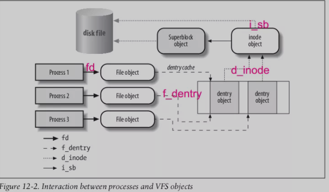
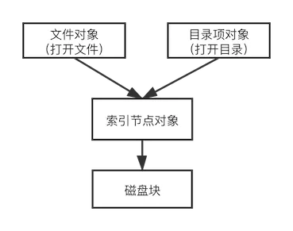

# **L12 从 lsof 开始，深入理解 Linux 虚拟文件系统**

## **1 背景**

有时会出现这样的情况，磁盘空间显示已经被占满，但是在查看磁盘的具体文件占用情况时，发现磁盘仍然有很大的空余空间。

1.执行`df`命令查看磁盘使用情况，发现磁盘已经满了。

```
$ df -Th
Filesystem     Type      Size  Used Avail Use% Mounted on
/dev/vda1      ext4       30G    30G 0      100% /
devtmpfs       devtmpfs  489M     0  489M   0% /dev
tmpfs          tmpfs     497M     0  497M   0% /dev/shm
tmpfs          tmpfs     497M   50M  447M  11% /run
tmpfs          tmpfs     497M     0  497M   0% /sys/fs/cgroup
```

2.执行 `du` 命令查看各个目录的磁盘占用情况，把各个目录文件的大小相加，发现并没有占满磁盘，有10多G空间莫名失踪。

```
$ du -h --max-depth=1 /home16M /home/logs11G /home/serverdog11G /home
```

**3.为何会出现这样的情况呢？**

因为虽然文件已被删除，但是一些进程仍然打开这些文件，因此其占用的磁盘空间并没有被释放。**执行lsof 命令显示打开已删除的文件。将有问题的进程重启（或，清空），磁盘空间就会得到释放**。

```
# lsof | grep delete
mysqld     2470         mysql    4u      REG              253,1           0     523577 /var/tmp/ibfTeQFn (deleted)
mysqld     2470         mysql    5u      REG              253,1           0     523579 /var/tmp/ibaHcIdW (deleted)
mysqld     2470         mysql    6u      REG              253,1           0     523581 /var/tmp/ibLjiALu (deleted)
mysqld     2470         mysql    7u      REG              253,1           0     523585 /var/tmp/ibCFnzTB (deleted)
mysqld     2470         mysql   11u      REG              253,1           0     523587 /var/tmp/ibCjuqva (deleted)
```

```
 lsof | grep delete
fileprovi   552 i515190    7r      DIR                1,4         64            89767166 /Users/i515190/Library/Application Support/FileProvider/FC87C0C5-2334-48A1-B44C-2C49D4F6ADB4/wharf/wharf/delete
deleted   20055 i515190  cwd       DIR                1,4        640                   2 /
deleted   20055 i515190  txt       REG                1,4    1384240 1152921500312492067 /System/Library/PrivateFrameworks/CacheDelete.framework/deleted
deleted   20055 i515190  txt       REG                1,4      46052            88735091 /Library/Preferences/Logging/.plist-cache.ql5gssJz
deleted   20055 i515190  txt       REG                1,4       7704            89818142 /Library/Application Support/CrashReporter/SubmitDiagInfo.domains
deleted   20055 i515190  txt       REG                1,4     114829            89908732 /private/var/db/analyticsd/events.whitelist
```

那么，Linux 的文件系统，到底为什么这么设计呢？要了解这些，就要先弄清楚并不容易，下面将从一些基本概念入手，一步步将这些梳理清楚：

* 什么是虚拟文件系统（VFS：virtual filesystem）？

* 什么是通用文件模型？

	* 超级块对象（superblock object）
	* 索引节点对象（inode object）
	* 文件对象（file object）
	* 目录项对象（dentry object）
	* 文件的概念

* 文件的表达

	* 内存表达
	* 磁盘表达

* 目录树的构建
	* 软链接 vs 硬链接

* 文件 & 磁盘管理
	* 索引节点状态


* 文件 & 进程管理
	* 操作：打开&删除

## **2 虚拟文件系统（virtual filesystem）**

下图显示了 Linux 操作系统中负责文件管理的基本组件。上半区域为用户模式，下半区域为内核模式。应用程序使用标准库libc来访问文件，库将请求映射到系统调用，以便进入内核模式。


所有与文件相关的操作的入口都是虚拟文件系统（VFS），而非特定的额文件系统（如Ext3、ReiserFS和NFS）。VFS 提供了系统库和特定文件系统之间的接口。

因此，VFS 不仅充当抽象层，而且实际上它提供了一个文件系统的基本实现，可以由不同的实现来使用和扩展。因此，要了解文件系统是如何工作的，就要先了解VFS 。

## **3 通用文件模型**

VFS 的主要思想在于引入了一个通用文件模型（common file model）。通用文件模型由以下对象类型组成：

### **3-1 超级块对象（superblock object）**

* 内存：文件系统安装时创建，存放文件系统的有关信息
* 磁盘：对应于存放在磁盘上的文件系统控制块（filesystem control block）


### **3-2 索引节点对象（inode object）**

* **内存：访问时创建，存放关于具体文件的一般信息（inode 结构）**
* **磁盘：对应于存放在磁盘上的文件控制块（file control block）**
* **每个索引节点对象都有一个索引节点号，唯一地标识文件系统的文件**

### **3-3 文件对象（file object）**

* 内存：打开文件时创建，存放 打开文件 与进程之间进行交互的有关信息（file 结构）
* 打开文件信息，仅当进程访问文件期间存在于内核内存中。

### **3-4 目录项对象（dentry object）**

* 内存：目录项一旦被读入内存，VFS就会将其转换成dentry 结构的目录项对象
* 磁盘：特定文件系统以特定的方式存储在磁盘上
* 存放目录项（即，文件名称）与对应文件进行链接的有关信息

## **4 目录树**

综合来说，Linux 的 根文件系统(system’s root filessystem) 是内核启动mount的第一个文件系统。内核代码映像文件保存在根文件系统中，而系统引导启动程序会在根文件系统挂载之后，从中把一些基本的初始化脚本和服务等加载到内存中去运行（文件系统和内核是完全独立的两个部分）。

其他文件系统，则后续通过脚本或命令作为子文件系统安装在已安装文件系统的目录上，最终形成整个目录树。

```
start_kernel 
　　vfs_caches_init 
　　　　mnt_init 
　　　　　　init_rootfs     // 注册rootfs文件系统
　　　　　　init_mount_tree // 挂载rootfs文件系统 
　　… 
　　rest_init 
　　kernel_thread(kernel_init, NULL, CLONE_FS);
```

就单个文件系统而言，在文件系统安装时，创建超级块对象；沿树查找文件时，总是首先从初识目录的中查找匹配的目录项，以便获取相应的索引节点，然后读取索引节点的目录文件，转化为dentry对象，再检查匹配的目录项，反复执行以上过程，直至找到对应的文件的索引节点，并创建索引节点对象。

## **5 软链接 vs 硬链接**

**软链接是一个普通的文件，其中存放的是另外一个文件的路径名。**

* 硬链接则指向同一个索引节点，硬链接数记录在索引节点对象的 `i_nlink` 字段。
* 当`i_nlink`字段为零时，说明没有硬链接指向该文件。

## **6 文件 & 进程管理**

下图是一个简单示例，说明进程是怎样与文件进行交互。三个不同进程打开同一个文件，每个进程都有自己的文件对象，其中两个进程使用同一个硬链接（每个硬链接对应一个目录对象），两个目录项对象都指向同一个 索引节点对象。



**索引节点的数据又由两部分组成：内存数据和磁盘数据。**

Linux 使用 Write back 作为索引节点的数据一致性策略。

**对于索引节点的数据，当文件被打开时，才会加载索引节点到内存；当不再被进程使用，则从内存踢出；如果中间有更新，则需要把数据写回磁盘。**

```
*  "in_use" - valid inode, i_count > 0, i_nlink > 0
*  "dirty"  - as "in_use" but also dirty
*  "unused" - valid inode, i_count = 0
```


索引节点是否仍在使用，是通过 `open()` 和 `close()` 操作建立和销毁文件对象，文件对象通过索引节点提供的 `iget` 和 `iput`  更新索引节点的`i_count`字段，以完成使用计数。

* `open` 操作使得 `i_count` 加一， close 操作使得 `i_count` 减一。
* 在 close 操作时判断索引节点是否释放，如果 `i_count = 0`，则意味着不再有进程引用，将会从内存释放。


## **7 文件 & 磁盘管理**

文件与磁盘管理联系最紧密的操作，莫过于`touch`和`rm`操作，而尤以后者最为关键。通过`strace`(或 dtruss)，查看 `rm` 的实际的系统调用

```

# dtruss rm tmp
...
geteuid(0x0, 0x0, 0x0)       = 0 0
ioctl(0x0, 0x4004667A, 0x7FFEE06F09C4)       = 0 0
lstat64("tmp\0", 0x7FFEE06F0968, 0x0)        = 0 0
access("tmp\0", 0x2, 0x0)        = 0 0
unlink("tmp\0", 0x0, 0x0)        = 0 0
```

可以发现 rm 实际是通过 unlink 完成的。unlink代表删除目录项，以及减少其索引节点的计数。

* 删除命令（一个进程）使用 open 操作获得父目录文件对象
* 通过 iget 增加 目录文件的索引节点对象计数
* 读取目录文件数据
	* 将目录文件数据转化为目录项对象
	* 由于目录项包含文件的索引节点，类似的，需要通过 iget 增加文件的索引节点对象计数
* 删除目录的目录项
* 减少文件索引节点对象的硬链接计数`i_nlink`
* 通过 iput 结束对文件索引节点对象的操作，使用计数` i_count` 减一
	* 判断`i_count`是否为零，如果为零，则释放内存
	* 然后，判断`i_nlink`是否为零，如果为零，则释放磁盘空间
* 通过 iput 结束对目录索引节点对象的操作。


### **索引与数据**

文件系统与文件、磁盘管理与文件、进程管理与文件，最核心的都是文件的索引，而不是文件的数据。把数据和索引分开是理解文件系统的关键。




### **缓存策略**

由于操作系统使用 Write back 的策略，意味着只有先释放内存，才有可能释放磁盘。

**Why lsof ?**

从上面的模型可以很清楚的理解，**因为目录已经没有索引到文件了，但是打开文件还有索引到文件，所以不能立刻释放磁盘空间**。

为什么 lsof 可以找到已删除未释放的文件呢？

lsof，顾名思义：list open files，该命令的原理就是查找打开文件的列表，**因此可以找到已删除未释放的文件。**


