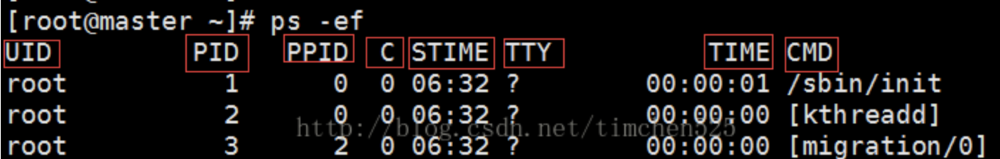
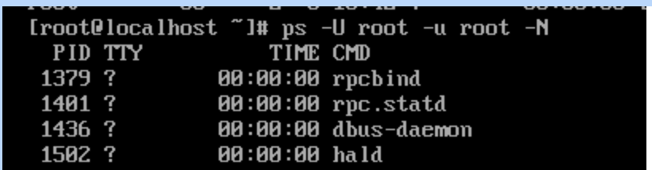
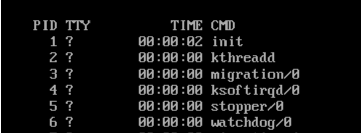
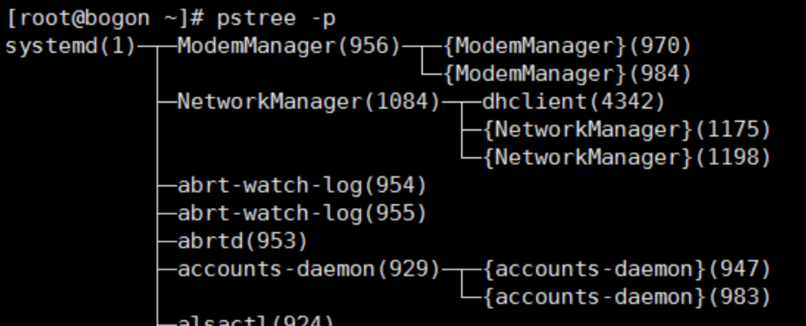
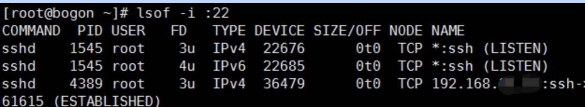
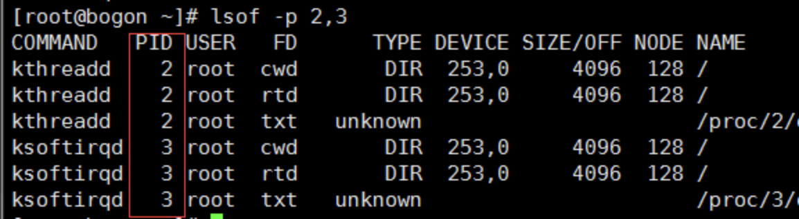

# **L13 Linux故障排查思路及常用命令**

### **1. 查看当前系统状态(top)**

top命令：可以持续的监视进程的信息。

挖矿应急通常优先使用top命令来查看系统进程，

**一般挖矿病毒站用CPU比较大**


### **2. 查看当前系统进程信息(ps)**

ps命令：可以查看进程的瞬间信息。
常用参数：

* `-a`：显示现行终端机下的所有程序，包括其他用户的程序。
* `-e`：列出程序时，显示每个程序所使用的环境变量。
* `-f`：显示UID,PPIP,C与STIME栏位。



### **3. 查看非root运行的进程(ps)**

命令: `ps -U root -u root -N`



### **4. 查看用户root运行的进程(ps)**

**命令: `ps -u root`**



### **5 查看有没有奇怪进程(ps)**


* 命令:`ps -aef | grep inetd`
* grep 是搜索命令
* inetd 程序是一个Linux守护进程.


### **6. 检测隐藏进程(ps)**

* 命令:`ps -ef | awk '{print}' | sort -n |uniq >1`
* 命令:`ls /proc | sort -n |uniq >2`

* sort 命令将文本文件内容加以排序,可针对文本文件的内容，以行为单位来排序。`-n` 参数依照数值的大小排序。
* uniq 命令用于检查及删除文本文件中重复出现的行列，一般与 `sort` 命令结合使用。


### **7. 检测系统守护进程(ls)**

**命令:`ls /etc/crontab`**

## **任务及用户活动排查命令**

**1 查看当前登陆用户的IP信息(who)**

命令:`who -m`

```
$ who -m
i515190  ttys008  Apr  7 23:28 
```

### **2. 查看近期用户登陆情况(last)**


* 命令: `last -n 5`   ## -n 5 表示输出5条


### **3 查看uid为0的账号(awk)**

```
$ awk -F: '($3==0)' /etc/passwd

root:*:0:0:System Administrator:/var/root:/bin/sh
```

### **4. 查看uid为0的账号(grep)**

```
grep -v -E "^#" /etc/passwd | awk -F: '$3==0{print $1}'

root
```

### **5. 查看进程树是否所有异常进程存在一个父进程、判断进程的父子关系(pstree)**

```
pstree -p
```



## **网络排查命令**

netstat 命令用来打印Linux中网络系统的状态信息。

常用参数：

* -a或`–all`：显示所有连线中的Socket。
* -c或`–continuous`：持续列出网络状态。
* -i或`–interfaces`：显示网络界面信息表单。
* l或`–listening`：显示监控中的服务器的Socket。
* -n或`–numeric`：直接使用ip地址，而不通过域名服务器。
* -t或`–tcp`：显示TCP传输协议的连线状况。
* -u或`–udp`：显示UDP传输协议的连线状况。

### **2. 查看谁在使用某个端口(lsof)**

**lsof 命令用于查看你进程开打的文件**，打开文件的进程，进程打开的端口(TCP、UDP)。
常用参数：

* `-g`：列出GID号进程详情；
* `-d`<文件号>：列出占用该文件号的进程；
* `-i`<条件>：列出符合条件的进程。（4、6、协议、:端口、 @ip ）
* `-p`<进程号>：列出指定进程号所打开的文件；
* `-u`：列出UID号进程详情；

命令:`lsof -i :22` # 看看谁在使用22端口




### **3. 查看多个进程号对应的文件信息(lsof)**

命令：`lsof -p 2,3` # 使用逗号分隔

‘

### **4 查看所有tcp网络连接信息(lsof)**

```
lsof -i tcp
```

查看所有udp网络连接信息(lsof)

```
lsof -i udp
```

## **文件排查命令**

### **1 查找最近24小时内修改过的文件(find)**


* 命令：`find ./ -mtime 0`
* find 命令用来在指定目录下查找文件。

**参数 `-mtime n` 按照文件的更改时间来找文件，n为整数。**

* `-mtime 0` 表示文件修改时间距离当前为0天的文件，即距离当前时间不到1天（24小时）以内的文件。
* `-mtime 1` 表示文件修改时间距离当前为1天的文件，即距离当前时间1天（24小时－48小时）的文件。
* `-mtime＋1` 表示文件修改时间为大于1天的文件，即距离当前时间2天（48小时）之外的文件
* `-mtime -1` 表示文件修改时间为小于1天的文件，即距离当前时间1天（24小时）之内的文件

### **查找(不）以.txt结尾的文件名(find)**

```
find / -name "*.txt"
```

忽略大小写，命令：`find / -iname "*.txt"`

`find / ! -name "*.txt"`
