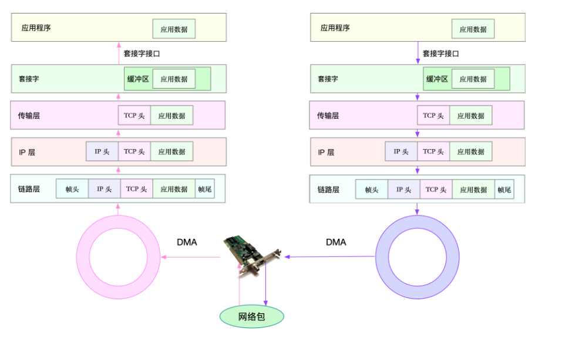
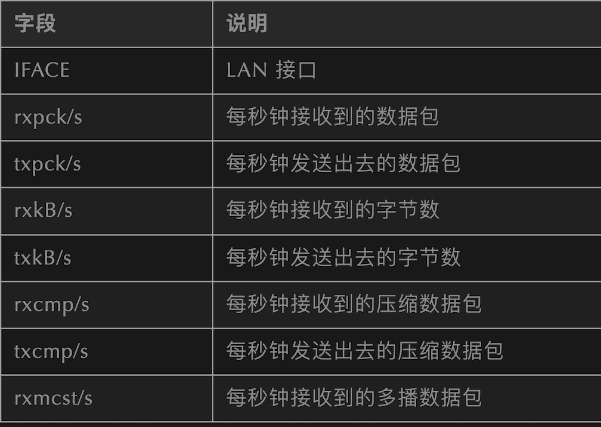

# L15 Linux网络基础与性能优化

## 1 网络模型

> 常见的有 OSI 网络模型、TCP/IP 网络模型、五层协议网络模型：

OSI 七层网络模型：将传统的五层 TCP 模型中的应用层分为应用层、表示层、会话层

* 应用层：负责为应用程序提供统一的接口
* 表示层：负责把数据转换成兼容接收系统的格式
* 会话层：负责维护计算机之间的通信连接，即负责在网络中的两节点之间建立、维持和终止通信
* 传输层：负责为数据加上传输表头，形成数据包
* 网络层：负责数据的路由和转发
* 数据链路层：负责 MAC 寻址、错误侦测和改错
* 物理层：负责在物理网络中传输数据帧

**Linux 上使用的是 TCP/IP 网络模型，即四层网络模型：**

* 应用层，负责向用户提供一组应用程序，比如 HTTP、FTP、DNS 等
* 传输层，负责端到端的通信，比如 TCP、UDP 等
* 网络层，负责网络包的封装、寻址和路由，比如 IP、ICMP 等
* 网络接口层，负责网络包在物理网络中的传输，比如 MAC 寻址、错误侦测以及通过网卡传输网络帧等

在 TCP/IP 模型下，网络数据将逐层传递并处理:



## 2 网络性能

常用的网络[性能指标]：

* **带宽**：表示链路的最大传输速率，单位通常为 b/s （比特 / 秒）
* **吞吐量**：表示单位时间内成功传输的数据量，单位通常为 b/s（比特 / 秒）或者 B/s（字节 / 秒）
* **延时**：表示从网络请求发出后，一直到收到远端响应，所需要的时间延迟。在不同场景中，这一指标可能会有不同含义。比如，它可以表示，建立连接需要的时间（比如 TCP 握手延时），或一个数据包往返所需的时间（比如 RTT）
* **PPS**：Packet Per Second（包 / 秒），表示以网络包为单位的传输速率。PPS 通常用来评估网络的转发能力基于 Linux 服务器的转发，则容易受网络包大小的影响。
* **网络的可用性**：网络正常通信
* **并发连接数**：TCP 可以连接多少
* **丢包率**：丢包占总包的比重
* **重传率**：重新传输的网络包比例

## 3 常用的网络性能监控工具：

* **netstat**：用于显示与 IP、TCP、UDP 和 ICMP 协议相关的统计数据，核心是显示套接字状态
* **ifconfig**：用于显示或配置网络设备（网络接口卡）信息
* **route**：用于显示和操作 IP 路由表，通过目标地址 ip 和子网掩码可以分析出发包路径
* `sar -n DEV`：显示网络信息，用 sar 分析网络更多的是用于流量和包量的检测和异常发现
* **nmap**：用于网络探测和安全审核的工具
* **ss**：查询网络的连接信息
* ping：检测网络连通性

简单介绍下各种工具的使用：

### **netstat**

用于显示与 IP、TCP、UDP 和 ICMP 协议相关的统计数据，核心是显示套接字状态

参数：-a 显示所有套接字 -n 不解析 DNS 名字 (解析 DNS 会比较慢) -t 过滤出 TCP 相关的网络套接字 -p 显示进程 / 程序名 -s 显示出协议栈中相关的一些统计信息

tips：现在常用 ss 替代，ss 的速度更快一些 -t 表示只显示 TCP 套接字 -n 表示显示数字地址和端 -p 表示显示进程信息

```
#使用netstat查看tcp和udp的套接字信息
[root@ja /] netstat -antu
Active Internet connections (servers and established)
Proto Recv-Q Send-Q Local Address           Foreign Address         State      
tcp        0      0 0.0.0.0:22              0.0.0.0:*               LISTEN     
tcp        0      0 172.30.0.39:46522       169.254.0.55:5574       ESTABLISHED
tcp        0     36 172.30.0.39:22          163.177.68.30:3199      ESTABLISHED
udp        0      0 0.0.0.0:68              0.0.0.0:*                          
udp        0      0 0.0.0.0:68              0.0.0.0:*                          
udp        0      0 172.30.0.39:123         0.0.0.0:*                          
udp        0      0 127.0.0.1:123           0.0.0.0:*                          
udp        0      0 0.0.0.0:50844           0.0.0.0:*                          
udp6       0      0 fe80::5054:ff:fed2::123 :::*                               
udp6       0      0 ::1:123                 :::*    

#使用ss也可以达到同样的效果

[root@ja /] ss -ant
State      Recv-Q Send-Q             Local Address:Port              Peer Address:Port              
LISTEN     0      128                      *:22                             *:*                  
ESTAB      0      0                   172.30.0.39:46522              169.254.0.55:5574               
ESTAB      0      36                  172.30.0.39:22                 163.177.68.30:3199
```

用 **netstat** 查看更为详细的协议栈信息更加直观和详细：

```
[root@ja /] netstat -s
Ip:
    16250019 total packets received
    0 forwarded
    0 incoming packets discarded
    16249365 incoming packets delivered
    17150794 requests sent out
    1784 dropped because of missing route
Icmp:
    3568568 ICMP messages received
    87 input ICMP message failed.
    ICMP input histogram:
        destination unreachable: 339
        timeout in transit: 107
        echo requests: 3567914
        echo replies: 202
        timestamp request: 2
    3568477 ICMP messages sent
    0 ICMP messages failed
    ICMP output histogram:
        destination unreachable: 109
        echo request: 420
        echo replies: 3567914
        timestamp replies: 2
....
Tcp:
    1462144 active connections openings
    208661 passive connection openings
    1787 failed connection attempts
    2493 connection resets received
    2 connections established
    12207346 segments received
    13063063 segments send out
    105967 segments retransmited
    14 bad segments received.
    148312 resets sent
    InCsumErrors: 14
```

### ifconfig

> 用于显示或配置网络设备（网络接口卡）信息 （现用 ip 相关命令替代，包括 ip link ip address 等）

```
#用ifconfig查看网卡信息
[root@ja /] ifconfig 
eth0: flags=4163<UP,BROADCAST,RUNNING,MULTICAST>  mtu 1500
        inet 172.30.0.39  netmask 255.255.240.0  broadcast 172.30.15.255
        inet6 fe80::5054:ff:fed2:e0d8  prefixlen 64  scopeid 0x20<link>
        ether 52:54:00:d2:e0:d8  txqueuelen 1000  (Ethernet)
        RX packets 16381686  bytes 1576456712 (1.4 GiB)
        RX errors 0  dropped 0  overruns 0  frame 0
        TX packets 17176768  bytes 2555718092 (2.3 GiB)
        TX errors 0  dropped 0 overruns 0  carrier 0  collisions 0

lo: flags=73<UP,LOOPBACK,RUNNING>  mtu 65536
        inet 127.0.0.1  netmask 255.0.0.0
        inet6 ::1  prefixlen 128  scopeid 0x10<host>
        loop  txqueuelen 1000  (Local Loopback)
        RX packets 19726  bytes 967210 (944.5 KiB)
        RX errors 0  dropped 0  overruns 0  frame 0
        TX packets 19726  bytes 967210 (944.5 KiB)
        TX errors 0  dropped 0 overruns 0  carrier 0  collisions 0

> 可以看到网络接口的状态标志、MTU 大小、IP、子网、MAC 地址以及网络包收发的统计信息

#ip命令是非常强大的，可以用ip addr替代ifconfig
[root@ja /] ip addr
1: lo: <LOOPBACK,UP,LOWER_UP> mtu 65536 qdisc noqueue state UNKNOWN group default qlen 1000
    link/loopback 00:00:00:00:00:00 brd 00:00:00:00:00:00
    inet 127.0.0.1/8 scope host lo
       valid_lft forever preferred_lft forever
    inet6 ::1/128 scope host 
       valid_lft forever preferred_lft forever
2: eth0: <BROADCAST,MULTICAST,UP,LOWER_UP> mtu 1500 qdisc mq state UP group default qlen 1000
    link/ether 52:54:00:d2:e0:d8 brd ff:ff:ff:ff:ff:ff
    inet 172.30.0.39/20 brd 172.30.15.255 scope global eth0
       valid_lft forever preferred_lft forever
    inet6 fe80::5054:ff:fed2:e0d8/64 scope link 
       valid_lft forever preferred_lft forever

# tips：   ip命令显示的LOWER_UP表示物理网络是联通的，ifconfig显示的是RUNNING，如果没有显示可能就是物理问题
```

ifconfig 的一些配置操作：

```
#启动或者关闭指定网卡
ifconfig eth0 down   
ifconfig eth0 up
#修改MAC地址
ifconfig eth0 down //关闭网卡
ifconfig eth0 hw ether $MACaddress //修改MAC地址
ifconfig eth0 up //启动网卡
#配置IP地址
ifconfig eth0 $ipaddress netmask 255.255.255.0  // 给eth0网卡配置IP地址,并加上子掩码
#启用和关闭ARP协议
ifconfig eth0 arp  //开启
ifconfig eth0 -arp  //关闭
#设置最大传输单元
ifconfig eth0 mtu 1460 //设置能通过的最大数据包大小为 1460 bytes
```

### route


用于显示和操作 IP 路由表，通过目标地址 ip 和子网掩码可以分析出发包路径 (现常用 ip route 替代) (补充：`ip rule show` 显示路由策略表，调整路由策略表可以设置路由转发策略)

```
#用route查看路由表
[root@ja /] #route -n
Kernel IP routing table
Destination     Gateway         Genmask         Flags Metric Ref    Use Iface
0.0.0.0         172.30.0.1      0.0.0.0         UG    0      0        0 eth0
172.30.0.0      0.0.0.0         255.255.240.0   U     0      0        0 eth0

#也可以用ip命令查看和操作IP路由的一些信息：
[root@ja /] ip route
default via 172.30.0.1 dev eth0 
172.30.0.0/20 dev eth0 proto kernel scope link src 172.30.0.39 
[root@jessy /] ip route show
default via 172.30.0.1 dev eth0 
172.30.0.0/20 dev eth0 proto kernel scope link src 172.30.0.39 
[root@jessy /] ip rule show
0: from all lookup local 
32766: from all lookup main 
32767: from all lookup default
```

> 可以通过 route 去配置路由表：

```
route add -net 224.0.0.0 netmask 240.0.0.0 reject  #屏蔽一条路由
route del -net 224.0.0.0 netmask 240.0.0.0   #删除路由记录
route add default gw 192.168.120.240 #添加设置默认网关
```

### sar

sar 是一个优秀的一般性能监视工具，它可以输出 Linux 所完成的几乎所有工作的数据。sar 命令在 sysetat rpm 中提供。sar 可以显示 CPU、运行队列、磁盘 I/O、分页（交换区）、内存、CPU 中断、网络等性能数据

用 `sar -n DEV` 显示网络信息

```
[root@ja /] sar -n DEV 1
Linux 3.10.0-1062.18.1.el7.x86_64 (jessy)  08/03/2020  _x86_64_ (4 CPU)

02:57:41 PM     IFACE   rxpck/s   txpck/s    rxkB/s    txkB/s   rxcmp/s   txcmp/s  rxmcst/s
02:57:42 PM      eth0      4.00      2.00      0.21      0.21      0.00      0.00      0.00
02:57:42 PM        lo      0.00      0.00      0.00      0.00      0.00      0.00      0.00

02:57:42 PM     IFACE   rxpck/s   txpck/s    rxkB/s    txkB/s   rxcmp/s   txcmp/s  rxmcst/s
02:57:43 PM      eth0     10.00     10.00      0.80      1.32      0.00      0.00      0.00
02:57:43 PM        lo      0.00      0.00      0.00      0.00      0.00      0.00      0.00

02:57:43 PM     IFACE   rxpck/s   txpck/s    rxkB/s    txkB/s   rxcmp/s   txcmp/s  rxmcst/s
02:57:44 PM      eth0      8.00      8.00      0.61      1.43      0.00      0.00      0.00
02:57:44 PM        lo      0.00      0.00      0.00      0.00      0.00      0.00      0.00

02:57:44 PM     IFACE   rxpck/s   txpck/s    rxkB/s    txkB/s   rxcmp/s   txcmp/s  rxmcst/s
02:57:45 PM      eth0      4.00      5.00      0.37      0.79      0.00      0.00      0.00
02:57:45 PM        lo      0.00      0.00      0.00      0.00      0.00      0.00      0.00
```



用 sar 分析网络更多的是用于流量和包量的检测和异常发现。要更加详细分析细节还是 tcpdump+wireshark 方便

### nmap

> 一个用于网络探测和安全审核的工具，需要自行安装 (yum install nmap)

常用来：

```
nmap baidu.com

Starting Nmap 6.40 ( http://nmap.org ) at 2020-08-03 14:59 CST
Nmap scan report for baidu.com (39.156.69.79)
Host is up (0.042s latency).
Other addresses for baidu.com (not scanned): 220.181.38.148
Not shown: 998 filtered ports
PORT    STATE SERVICE
80/tcp  open  http
443/tcp open  https

Nmap done: 1 IP address (1 host up) scanned in 17.84 seconds
```

```
nmap <target ip1 address> <target ip2 address> #快速扫描多个ip地址
nmap -p(range) <target IP>    #指定端口和范围
```

### ping

> ping 程序是**测试另一个主机是否可达**的常用程序，常用来测试远程主机的连通性和延时。
> 
> ping 程序的原理就是发送一个 ICMP 报文给主机，等待返回的 ICMP 回显应答。

一些选项，包括 `-s` 设置包的大小，`-c` 设置 ping 的次数，`-t` 表示一直 ping 直至自己终止，`-R` 查看路由选项

```
ping baidu.com
PING baidu.com (39.156.69.79) 56(84) bytes of data.
64 bytes from 39.156.69.79 (39.156.69.79): icmp_seq=1 ttl=47 time=41.9 ms
64 bytes from 39.156.69.79 (39.156.69.79): icmp_seq=2 ttl=47 time=41.9 ms
...
--- baidu.com ping statistics ---
8 packets transmitted, 8 received, 0% packet loss, time 10491ms
rtt min/avg/max/mdev = 41.915/41.930/41.967/0.271 ms
```

### iperf

iperf 是常用的网络性能测试工具，用来测试 TCP 和 UDP 的吞吐量，以客户端和服务器通信的方式，测试一段时间内的平均吞吐量。

```
#在服务器执行iperf
# -s 表示启动服务端，-i 表示汇报间隔，-p 表示监听端口
iperf3 -s 
#在客户端执行iperf
iperf3 -c 192.168.77.131 

[root@ja /] iperf3 -s -i 1 -p 12345
-----------------------------------------------------------
Server listening on 12345
-----------------------------------------------------------
Accepted connection from 172.30.0.39, port 49566
[  5] local 172.30.0.39 port 12345 connected to 172.30.0.39 port 49568
[ ID] Interval           Transfer     Bandwidth
[  5]   0.00-1.00   sec  5.23 GBytes  44.9 Gbits/sec                  
[  5]   1.00-2.00   sec  5.60 GBytes  48.1 Gbits/sec                  
[  5]   2.00-3.00   sec  5.10 GBytes  43.8 Gbits/sec                  
[  5]   3.00-4.00   sec  5.45 GBytes  46.8 Gbits/sec                  
[  5]   4.00-5.00   sec  4.84 GBytes  41.6 Gbits/sec                  
[  5]   5.00-6.00   sec  4.84 GBytes  41.6 Gbits/sec                  
[  5]   6.00-7.00   sec  4.93 GBytes  42.3 Gbits/sec                  
[  5]   7.00-8.00   sec  5.57 GBytes  47.8 Gbits/sec                  
[  5]   8.00-9.00   sec  5.85 GBytes  50.2 Gbits/sec                  
[  5]   9.00-10.00  sec  5.79 GBytes  49.7 Gbits/sec                  
[  5]  10.00-10.04  sec   274 MBytes  59.1 Gbits/sec                  
- - - - - - - - - - - - - - - - - - - - - - - - -
[ ID] Interval           Transfer     Bandwidth
[  5]   0.00-10.04  sec  0.00 Bytes  0.00 bits/sec                  sender
[  5]   0.00-10.04  sec  53.4 GBytes  45.7 Gbits/sec                  receiver
-----------------------------------------------------------
Server listening on 12345
-----------------------------------------------------------
```

> 可以看到机器的 TCP 吞吐量、带宽等信息，发送方也可以看到窗口大小、吞吐量、带宽等信息

## 4 [SOCKET]性能优化

> 主要是 TCP 的头部选项部分和 socket 连接时的选项部分，根据复杂的网络环境进行选择会大大提升 socket 的性能。

### TCP 选项

`SO_LINGER`

> `SO_LINGER` ：指定函数 close 对面向连接的协议如何操作，内核缺省 close 操作是立即返回，如果有数据残留在套接口缓冲区中则系统将试着将这些数据发送给对方。

```
struct linger {
     int l_onoff; /* 0 = off, nozero = on */
     int l_linger; /* linger time */
};
```

* 设置 l_onoff 为 0，则关闭 linger，close 直接返回，未发送数据将由内核完成传输
* 设置 l_onoff 为非 0，l_linger 为 0，则打开 linger，则立即关闭该连接，通过发送 RST 分组 (而不是用正常的 FIN|ACK|FIN|ACK 四个分组) 来关闭该连接。如果发送缓冲区中如果有未发送完的数据，则丢弃。主动关闭一方的 TCP 状态则跳过 TIMEWAIT，直接进入 CLOSED
* 设置 l_onoff 为非 0，l_linger 为非 0，将连接的关闭设置一个超时。如果 socket 发送缓冲区中仍残留数据，进程进入睡眠，内核进入定时状态去尽量去发送这些数据。在超时之前，如果所有数据都发送完且被对方确认，内核用正常的 FIN|ACK|FIN|ACK 四个分组来关闭该连接，close() 成功返回。如果超时之时，数据仍然未能成功发送及被确认，用上面的方式来关闭此连接。close() 返回 EWOULDBLOCK

> 四次挥手断开连接主动关闭方会进入 TIME_WAIT 状态，TIME_WAIT 状态非常多的话会导致系统负载较大 (TIME_WAIT 本身不占用资源，但是处理 TIME_WAIT 需要耗费资源)，故可以通过设置打开 linger 则直接发送 RST 分组，这种情况不会产生 `TIME_WAIT`。
> 
> （TIPS:TIME_WAIT 状态太多，系统会进行回收和利用，因此，回收时是等待的时间最长的，故如果 TIME_WAIT 状态太多的话，就需要维护一个非常大的数据结构用来找等待时间最长的，会占据一定的系统计算资源）
> 
> 对于 TIME_WAIT 过多也可以直接设置系统的最大 TIME_WAIT 数，将该数字调小一些。(会导致一些不太可靠的断开，不过对于减少服务器压力来说还是比较不错的方式，只是会令客户端断开连接更慢一些，客户端通常是一个主机，维持连接较少，一个较长的断开影响不大)

### `SO_REUSEADDR`

通常一个端口释放后会等待两分钟 (TIME_WAIT 时间) 之后才能再被使用，SO_REUSEADDR 是让端口释放后立即就可以被再次使用。

SO_REUSEADDR 用于对 TCP 套接字处于 TIME_WAIT 状态下的 socket，才可以重复绑定使用。server 程序总是应该在调用 bind() 之前设置 SO_REUSEADDR 套接字选项。在 TCP 连接中，主动关闭方会进入 TIME_WAIT 状态，因此这个功能也就是主动方收到被动方发送的 FIN 后，发送 ACK 后就可以断开连接，不再去处理该 ACK 丢失等情况。

也就是说，这个套接字选项向内核传达了该消息：如果这个端口被占用但是 TCP 状态位于 `TIME_WAIT` ，则可以重用端口。而如果端口忙，而 TCP 状态位于其他状态，那么重用端口时依旧得到一个错误信息，指明 "地址已经使用中"。如果想要让服务程序停止后就可以立即重用，并且使用的端口还是这个端口，那么设置 `SO_REUSEADDR` 选项将非常有必要。总体来说，对于需要维持大量 TCP 连接的服务器可以设置这个选项，因为可能会存在大量的 `TIME_WAIT` 状态 (尤其是 HTTP 服务通常是服务器充当主动断开一方)，设置该选项就很有必要，毕竟最糟糕的情况下基本是客户端的断开慢一些，影响也不是非常大 (客户机通常不需要大量的 TCP 连接需要)

### `TCP_NODELAY/TCP_CHORK`

#### Nagle 算法

Nagle 算法针对的是需要连续发送多个小数据包的情况下，发送的有效数据相较于头部太小，因此发送的效率过低，甚至可能导致网络阻塞。Nagle 算法可以减少网络中小的数据包的数量，从而降低网络的拥塞程度。最常见的 Nagle 算法的例子就是 Telnet 程序，用户在控制台的每次击键都会发送一个数据包，这个包通常包含 41 个字节，然而只有一个字节是有效负载，其余 40 个字节都是报头，如果每次击键都发送一个报文，那就会造成了巨大的开销。为了减小这种开销，Nagle 算法规定，当 TCP 发送了一个小的 segment（小于 MSS），它必须等到接收到对方的 ACK 之后，才能继续发送另一个小的 segment，因此发送方将第一个小包发出去后，将后面到达的少量字符数据都缓存起来而不立即发送，直到收到上一个数据包的 ACK 或者 当前字符属于紧急数据 或者 缓存的字符数据已经到达一定的长度。Nagle 算法并非灵丹妙药，它会增加 TCP 发送数据的延迟。在一些要求低延迟的应用程序中（例如即时通讯应用），Nagle 算法的规定是不易被接受的，因此需要设置 `TCP_NODELAY` 或者 `TCP_CHORK` 关闭 Nagle 算法。

TIPS: TCP 的延迟 ACK 与 Nagle 算法有异曲同工之妙，延迟 ACK：当 TCP 接收到数据时，并不会立即发送 ACK 给对方，相反，它会等待应用层产生数据，然后将 ACK 和数据一起发送，并且发送的 ACK 序号为将可能会是更大的 ACK 序号（在 Linux 的最多等待 40 毫秒）（ACK 序号表示该序号之前的报文已经收到，故等待期间可能又收到了部分报文，最终只需要发送一个最大的 ACK 序号即可表示之前的都收到了）

### `TCP_NODELAY/TCP_CHORK`


`TCP_NODELAY` 和 `TCP_CHORK` 都禁掉了 Nagle 算法，行为需求有些不同：

* `TCP_NODELAY` 不使用 Nagle 算法，不会将小包进行拼接成大包再进行发送，而是直接将小包发送出去
* `TCP_CORK` 适用于需要传送大量数据时，可以提高 TCP 的发行效率。设置 `TCP_CORK` 后将每次尽量发送最大的数据量，当然也有一个阻塞时间，当阻塞时间到的时候数据会自动传送

### **`TCP_DEFER_ACCPT`**

推迟接收，设置该选项后，服务器接收到第一个数据后，才会建立连接。(可以用来防范空连接攻击)

当设置该选项后，服务器收到 connect 完成 3 次握手后，服务器仍然是 `SYN_RECV`，而不是 ESTABLISHED 状态，操作系统不会接收数据，直至收到一个数据才会进行 ESTABLISHED 状态。因此如果客户一直没有发送数据，则服务器会重传 SYN/ACK 报文，会有重传次数和超时值的限制。

### **`SO_KEEPALIVE`**

`SO_KEEPALIVE` 保持连接检测对方主机是否崩溃，避免（服务器）永远阻塞于 TCP 连接的输入。

设置该选项后，如果 2 小时内在此套接口的任一方向都没有数据交换，TCP 就自动给对方 发一个保持存活探测分节 (keepalive probe)。这是一个对方必须响应的 TCP 分节. 它会导致以下三种情况：

* 对方接收一切正常：以期望的 ACK 响应，2 小时后，TCP 将发出另一个探测分节
* 对方已崩溃且已重新启动：以 RST 响应。套接口的待处理错误被置为 ECONNRESET，套接 口本身则被关闭。
* 对方无任何响应：源自 berkeley 的 TCP 发送另外 8 个探测分节，相隔 75 秒一个，试图得到一个响应。在发出第一个探测分节 11 分钟 15 秒后若仍无响应就放弃。套接口的待处理错误被置为 ETIMEOUT，套接口本身则被关闭。如 ICMP 错误是 “host unreachable(主机不可达)”，说明对方主机并没有崩溃，但是不可达，这种情况下待处理错误被置为 EHOSTUNREACH。

有关 `SO_KEEPALIVE` 的三个参数详细解释如下:

* `tcp_keepalive_intvl`，保活探测消息的发送频率。默认值为 75s。
* `tcp_keepalive_probes`，TCP 发送保活探测消息以确定连接是否已断开的次数。默认值为 9
* `tcp_keepalive_time`，在 TCP 保活打开的情况下，最后一次数据交换到 TCP 发送第一个保活探测消息的时间，即允许的持续空闲时间。默认值为 7200s（2h）。

### `SO_SNDTIMEO & SO_RCVTIMEO`

`SO_RCVTIMEO` 和 `SO_SNDTIMEO` ，它们分别用来设置 socket 接收数据超时时间和发送数据超时时间。

因此，这两个选项仅对与数据收发相关的系统调用有效。接收超时会影响 read、readv、recv、recvfrom、recvmsg 的状态，发送超时会影响 write、writev、send、sendto 和 sendmsg 的状态。

### 缓存大小

`SO_RCVBUF` 和 `SO_SNDBUF`：设置的是 Socket 缓存大小，缓存大小会影响套接字的的性能

* `SO_SNDBUF`：TCP 发送缓冲区的容量上限；
* `SO_RCVBUF`：TCP 接受缓冲区的容量上限；
* 接收端缓冲区，缓存了远端发过来的数据。如果缓冲区已满，就不能再接收新的数据
* 写缓冲区，缓存了要发出去的数据。如果写缓冲区已满，应用程序的写操作就会被阻塞

proc 目录下的 SOCKET 缓存参数路径为：

```
/proc/sys/net/core/rmem_default
/proc/sys/net/core/rmem_max
/proc/sys/net/core/wmem_default
/proc/sys/net/core/wmem_max
```

调大缓存理论上是会提升 Socket 传输速率的，但是，并不是总是这样。缓存是一个只有在发送方和接收方的性能差异比较大时缓存会产生影响。还要补充的是，对于 TCP 连接而言，真正的传输过程是依赖于发送方和接收方两方的窗口大小的，因此单单调大发送方缓存并不会对整体产生明显影响。

在大延时网络上的带宽利用率低，主要原因是延时变大之后，发送方发的数据不能及时到达接收方。导致发送缓存满之后，不能再持续发送数据。接收方则因为 TCP 通告窗口受到接收方剩余缓存大小的影响。接收缓存小的话，则会通告对方发送窗口变小。进而影响发送方不能以大窗口发送数据。所以，这里的调优思路应该是，发送方调大 tcp_wmem，接收方调大 tcp_rmem。

如果网络的环境比较差，即丢包率比较高，那么会发现哪怕调高发送和接收双方的缓存大小，也无法提升整体的传输速率，主要原因是由于丢包比较高，因此网络比较拥塞，会频繁引发慢启动，使得真正的窗口瓶颈并不在于缓存的大小，甚至一直难以到达一个较大的值。这种情况下，可以考虑采用不同的拥塞控制算法，bbr 算法对丢包不敏感，因此在这种情况下如果采用 bbr 拥塞控制算法将使得整个网络性能较高。如果网络的丢包很少延时很大，那么调整拥塞控制算法也不会由明显提升，此时主要瓶颈就是缓存。

为了提高网络的吞吐量，通常需要调整这些缓冲区的大小：


* 增大每个套接字的缓冲区大小 `net.core.optmem_max`；
* 增大套接字接收缓冲区大小 `net.core.rmem_max` 和发送缓冲区大小 `net.core.wmem_max`；
* 增大 TCP 接收缓冲区大小 `net.ipv4.tcp_rmem` 和发送缓冲区大小 `net.ipv4.tcp_wmem`

### **backlog**

TCP socket 服务的 4 个步骤 `socket->bind->listen->accept`

> 在调用 listen 函数时, 有一个 backlog 参数. 在 Linux 中 backlog 表示已完成 (ESTABLISHED) 且未 accept 的队列大小.

```
int listen(int sockfd, int backlog);
```

TCP 建立连接过程：服务器收到客户端 SYN 包, 发送 SYN+ACK 包后, 在内存创建一个状态为 SYN_RCVD 的连接, 放入未完成队列, 这个队列的大小可通过 `/ proc/sys/net/ipv4/tcp_max_syn_backlog` 设置. 服务器收到客户端的 ACK 包后, 该连接的状态由 SYN_RCVD 改为 `ESTABLISHED`, 并移到已完成队列.

服务器程序调用 accept 后, 该连接移除已完成队列, 由内核交给程序控制.

（在第二次握手完成后服务器已经将该连接放入了半连接队列，当第三次握手成功后放入了全连接队列，当 accept 进程被调用后，该连接被调走由内核管理）

backlog 就是指定全连接队列的大小，如果全连接队列队列满了并且 `tcp_abort_on_overflow` 是 0 的话，server 过一段时间再次发送 syn+ack 给 client，如果 client 超时等待比较短，就会很容易导致异常。(`tcp_abort_on_overflow `为 0 表示如果三次握手第三步的时候全连接队列满了那么 server 扔掉 client 发过来的 ack), 因此如果 backlog 太小的话会导致全连接队列容易满，从而 TCP 连接建立失败。


设置 backlog 后，系统会和 `/ proc/sys/net/core/somaxconn` 比较，取较小值作为真正的 backlog

当已连接队列满后，如果设置 `tcp_abort_on_overflow` 为 0 表示如果三次握手第三步的时候全连接队列满了那么 server 扔掉 client 发过来的 ack

当半连接队列满后，如果启用 `syncookies (net.ipv4.tcp_syncookies = 1)`, 新的连接不进入未完成队列, 不受影响. 否则, 服务器不在接受新的连接.

### SYN 洪水攻击 (syn flood attack)

通过伪造 IP 向服务器发送 SYN 包, 塞满服务器的未完成队列, 服务器发送 SYN+ACK 包 没回复, 反复 SYN+ACK 包, 使服务器不可用. 启用 syncookies 是简单有效的抵御措施. 仅未完成队列满后才生效.

SYN 洪水攻击导致被攻击服务器保持大量 `SYN_RECV `状态的 “半连接”，并且会重试默认 5 次回应第二个握手包，塞满 TCP 等待连接队列，资源耗尽（CPU 满负荷或内存不足），让正常的业务请求连接不进来

### 性能优化思路

从网络 I/O 的角度来说，有如下思路：

* I/O 多路复用技术 epoll，主要用来取代 select 和 poll
* 异步 I/O 技术。异步 IO 允许应用程序同时发起很多 I/O 操作，而不用等待这些操作完成，等到 I/O 完成后，系统会用事件通知的方式，告诉应用程序结果

从进程的工作模型来说，有如下思路：

* 主进程 + 多个 worker 子进程。其中，主进程负责管理网络连接，而子进程负责实际的业务处理
* 监听到相同端口的多进程模型，即负载均衡策略。所有进程都会监听相同接口，并且开启 `SO_REUSEPORT` 选项，由内核负责，把请求负载均衡到这些监听进程中去


**应用层的网络协议优化思路：**

* 在每秒请求次数较多时并且连接通常是连续时，使用长连接取代短连接，可以显著降低 TCP 建立连接的成本
* 使用内存等方式，来缓存不常变化的数据，可以降低网络 I/O 次数，同时加快应用程序的响应速度
* 使用 Protocol Buffer 等序列化的方式，压缩网络 I/O 的数据量，可以提高应用程序的吞吐
* 使用 DNS 缓存、预取、HTTPDNS 等方式，减少 DNS 解析的延迟，也可以提升网络 I/O 的整体速度


