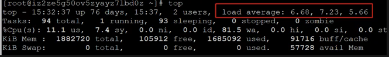
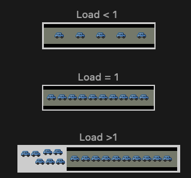

# **L2 当面试官问你load average时，怎么回答？**

## **1、什么是load average？**

**linux系统中的Load 是对当前CPU工作量的度量** (WikiPedia: the system load is a measure of the amount of work that a computer system is doing)。

**也有简单的说是进程队列的长度。**

**Load Average 就是一段时间 (1 分钟、5分钟、15分钟) 内平均 Load 。
我们可以通过系统命令"w" 或者 "uptime" 、"top"等可查看当前load average情况**



上面内容显示系统负载为“6.68, 7.23, 5.66”，这3个值是什么意思呢？


* 第一位6.68：表示最近1分钟平均负载
* 第二位7.23：表示最近5分钟平均负载
* 第三位5.66：表示最近15分钟平均负载

**linux系统是5秒钟进行一次Load采样**


## **2、load average值的含义**

### **2-1 单核处理器**

假设我们的系统是单CPU单内核的，把它比喻成是一条单向马路，把CPU任务比作汽车。当车不多的时候，load <1；当车占满整个马路的时候 load=1；当马路都站满了，而且马路外还堆满了汽车的时候 load>1



### **2-2 多核处理器**

我们经常会发现服务器Load > 1但是运行仍然不错，那是因为服务器是多核处理器（Multi-core）。


假设我们服务器CPU是2核，那么将意味我们拥有2条马路，我们的Load = 2时，所有马路都跑满车辆。


查看CPU core 

```
grep 'model name' /proc/cpuinfo | wc -l
```

## **3、什么样的Load average值要提高警惕**

0.7 < load < 1: 此时是不错的状态，如果进来更多的汽车，你的马路仍然可以应付。


load = 1: 你的马路即将拥堵，而且没有更多的资源额外的任务，赶紧看看发生了什么吧。


load > 5: 非常严重拥堵，我们的马路非常繁忙，每辆车都无法很快的运行


## **4、三种Load值，应该看哪个？**

通常我们先看15分钟load，如果load很高，再看1分钟和5分钟负载，查看是否有下降趋势。

1分钟负载值 > 1，那么我们不用担心，但是如果15分钟负载都超过1，我们要赶紧看看发生了什么事情。所以我们要根据实际情况查看这三个值。


