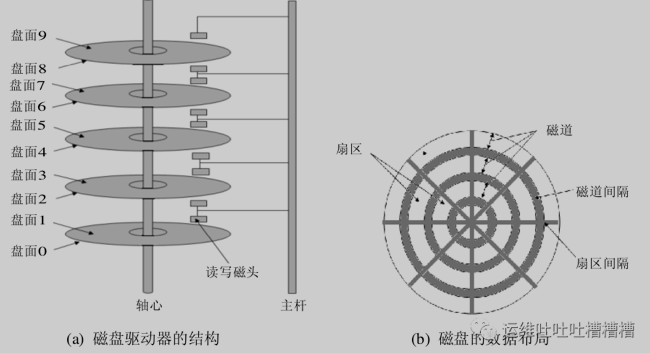

# **L3 文件系统inode**

* 1.文件系统包括哪些？
* 2.inode的作用是什么？
* 3.扇区和块以及inode之间是怎样的关系？

答：

1. **文件系统包含元数据（索引数据）以及数据内容（数据块）**
2. **inode即为元数据，inode记录数据块的位置及索引信息（文件属性，ctime，atime，mtime等）**
3. .硬盘是由盘片和存储面组成，每个盘片包含磁道，磁盘逻辑上划分为扇区，默认扇区是512个字节，每8个扇区组成一个块，文件读取的最小单位是块（默认4K），**inode记录块的位置**


## **1、 磁盘设备**

磁盘设备是一种相当复杂的机电设备（比较详细的介绍可以参考blog硬盘内部硬件结构和工作原理详解 ）。

磁盘设备可以包括一个或多个物理盘片，每个磁盘片分一个或两个存储面（如图（a）所示）。

**每个磁盘面被组织成若干个同心环，这种环称为磁道track，各磁道之间留有必要的间隙。每条磁道又被逻辑上划分成若干个扇区sectors**。

在不同扇区之间又保留必要的间隔, 图（b）中显示了显示了一个有3个磁道，每个磁道又被分成 8 个扇区的磁盘片的一个存储面。



在操作系统中，信息一般以扇区(sectors)的形式存储在硬盘上，而每个扇区包括512个字节的数据和一些其他信息（即一个扇区包括两个主要部分：存储数据地点的标识符和存储数据的数据段）。

**操作系统读取硬盘的时候，不会一个个扇区地读取，这样效率太低，而是一次性连续读取多个扇区，即一次性读取一个块（blocks）**。

这种由多个扇区组成的”块”，是文件存取的最小单位。**”块”的大小，最常见的是4KB，即连续八个 sectors组成一个 blocks。**


## **2、inode的内容**

**既然文件数据都储存在”块”中，那么对于操作系统而言，必须采用一种方式来找到这个存储文件数据的“块”，为此操作系统便引入了一个非常重要的概念”inode”，中文名为“索引结点**” 。

**既然引进inode的目的是为了找到“块”，那么inode中必然包括像文件数据block位置这么重要的信息，当然也不仅仅包括这么一个信息，还包括比如文件的创建者、文件的创建日期、文件的大小等等**。

**具体可以输入stat指令查看某个文件的inode信息**，这里以`example.txt`为例。


```
stat example.txt
```


这里便可以看到inode信息主要包括：


* 文件的字节数，块数
* 文件拥有者的User ID
* 文件的Group ID
* 文件的读、写、执行权限
* 文件的时间戳，共有三个：**ctime指inode上一次变动的时间，mtime指文件内容上一次变动的时间，atime指文件上一次打开的时间**。
* 链接数，即有多少文件名指向这个inode
* 文件数据block的位置
* inode编号


## **3、inode的大小**

前面已经提到inode中包括关于某个文件的索引信息，那么其中必然会存储部分数据，在计算机中必然会占据一定的空间，所以硬盘格式化的时候，操作系统自动将硬盘分成两个区域。

**一个是数据区，存放文件数据；另一个是inode区（inode table），存放inode所包含的信息**。

> 每个inode节点的大小，一般是128字节或256字节。inode节点的总数，在格式化时就给定，一般是每1KB或每2KB就设置一个inode。 
> 
> 假定在一块1GB的硬盘中，每个inode节点的大小为128字节，每1KB就设置一个inode，那么inode table的大小就会达到128MB，占整块硬盘的12.8%。

查看每个硬盘分区的inode总数和已经使用的数量，可以使用df命令查看。

```
df -i
```

查看每个inode节点的大小，可以用如下命令：

```
sudo dumpe2fs -h /dev/sda9 | grep “Inode size”
```

由于每个文件都必须有一个inode，因此有可能会发生磁盘空间未满而inode已经用完导致不能存入文件的情况。


## **4、inode编号**

在Unix/Linux操作系统中，系统内部并不采用文件名查找文件，而是使用inode编号来识别文件。

因此对于系统来说，文件名只是inode号码便于识别的别称或者绰号。而站在用户角度，用户通过文件名，打开文件，实际上，系统内部是获取inode信息找到数据块的，这个过程分成三步：


* **首先，系统找到这个文件名对应的inode号码**；
* **其次，通过inode号码，获取inode信息**；
* **最后，根据inode信息，找到文件数据所在的block，读出数据**。

**注：可以使用`df -i`或者`ls -i`均可以查看到文件名对应的inode号码。**


## **5、目录文件**
 
 Unix/Linux系统中，目录（directory）也是一种文件。打开目录，实际上就是打开目录文件。 


目录文件的结构非常简单，就是一系列目录项（dirent）的列表。每个目录项，由两部分组成：所包含文件的文件名，以及该文件名对应的inode号码。 


对于目录文件而言，其读权限（r）和写权限（w）并不难理解，都是针对目录文件本身。

由于目录文件内只有文件名和inode号码，所以如果只有读权限，只能获取文件名，无法获取其他信息，这主要是因为其他信息都储存在inode节点中，而读取inode节点内的信息需要目录文件的执行权限（x）。

## **6、硬链接**


一般情况下，文件名和inode号码是”一一对应”关系，每个inode号码对应一个文件名。

但是Unix/Linux系统允许，多个文件名指向同一个inode号码。

这意味着，可以用不同的文件名访问同样的内容；对文件内容进行修改，会影响到所有文件名；但是，删除一个文件名，不影响另一个文件名的访问。这种情况就被称为”硬链接”（hard link）。

**可以使用ln指令添加硬链接。**


运行上面这条命令以后，源文件与目标文件的inode号码相同，都指向同一个inode。

inode信息中有一项叫做”链接数”，记录指向该inode的文件名总数，这时就会增加1。

反过来，删除一个文件名，就会使得inode节点中的”链接数”减1。

当这个值减到0，表明没有文件名指向这个inode，系统就会回收这个inode号码，以及其所对应block区域。 

这里顺便说一下目录文件的”链接数”。创建目录时，默认会生成两个目录项：”.”和”..”。

前者的inode号码就是当前目录的inode号码，等同于当前目录的”硬链接”；

后者的inode号码就是当前目录的父目录的inode号码，等同于父目录的”硬链接”。

所以，任何一个目录的”硬链接”总数，总是等于2加上它的子目录总数（含隐藏目录）。


## **7、软链接**

除了硬链接以外，还有一种特殊情况。 

**文件A和文件B的inode号码虽然不一样，但是文件A的内容是文件B的路径。**

读取文件A时，系统会自动将访问者导向文件B。因此，无论打开哪一个文件，最终读取的都是文件B。这时，文件A就称为文件B的”软链接”（soft link）或者”符号链接（symbolic link）。 

这意味着，文件A依赖于文件B而存在，如果删除了文件B，打开文件A就会报错：”No such file or directory”。

这是软链接与硬链接最大的不同：**文件A指向文件B的文件名，而不是文件B的inode号码，文件B的inode”链接数”不会因此发生变化。`ln -s`命令可以创建软链接。**


## **8、inode的特殊作用**

由于inode号码与文件名分离，这种机制导致了一些Unix/Linux系统特有的现象。

* 有时，文件名包含特殊字符，无法正常删除。这时，直接删除inode节点，就能起到删除文件的作用。
* 移动文件或重命名文件，只是改变文件名，不影响inode号码。
* 打开一个文件以后，系统就以inode号码来识别这个文件，不再考虑文件名。因此，通常来说，系统无法从inode号码得知文件名。

最后一点使得软件更新变得简单，可以在不关闭软件的情况下进行更新，不需要重启。因为系统通过inode号码，识别运行中的文件，不通过文件名。更新的时候，新版文件以同样的文件名，生成一个新的inode，不会影响到运行中的文件。等到下一次运行这个软件的时候，文件名就自动指向新版文件，旧版文件的inode则被回收。
