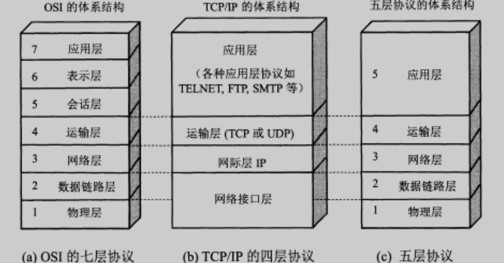
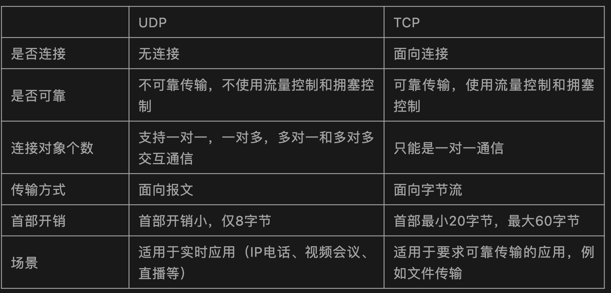
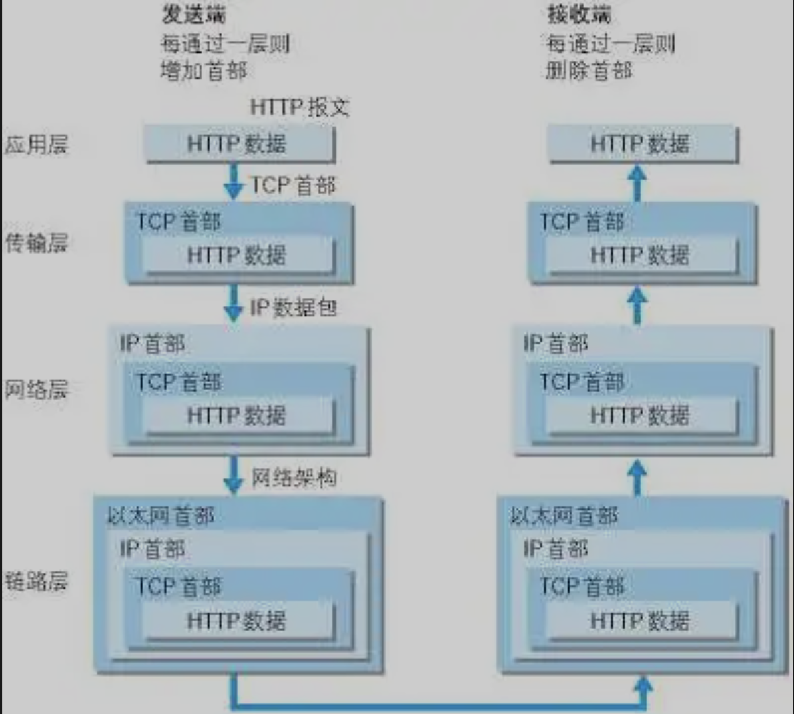
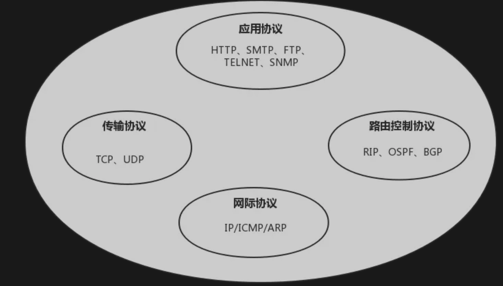
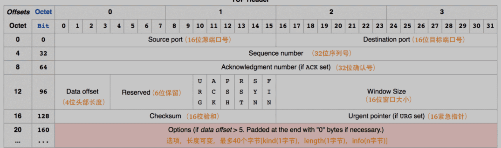
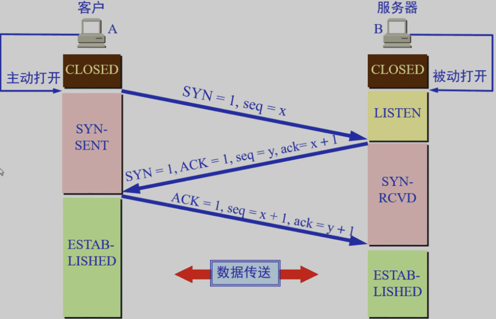
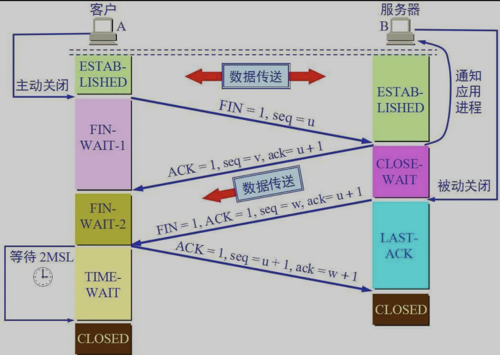
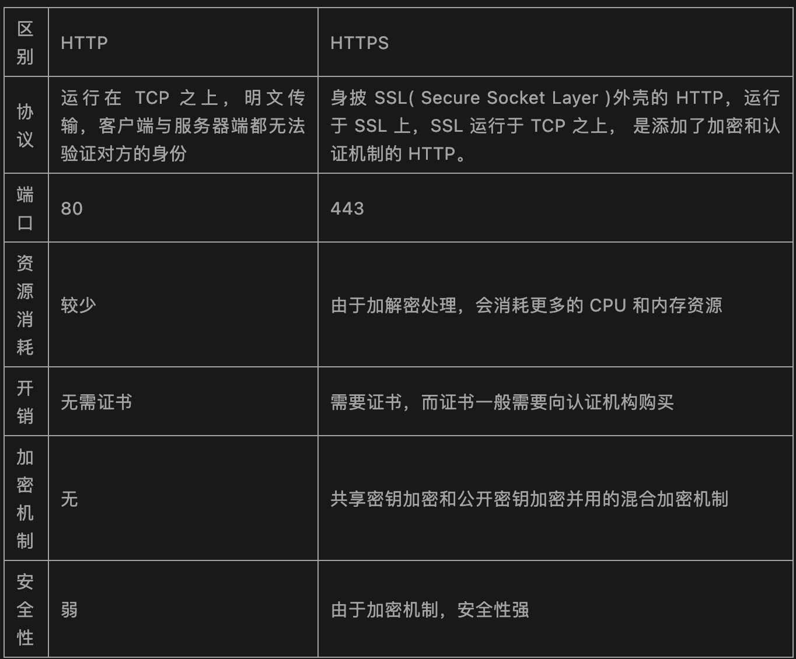
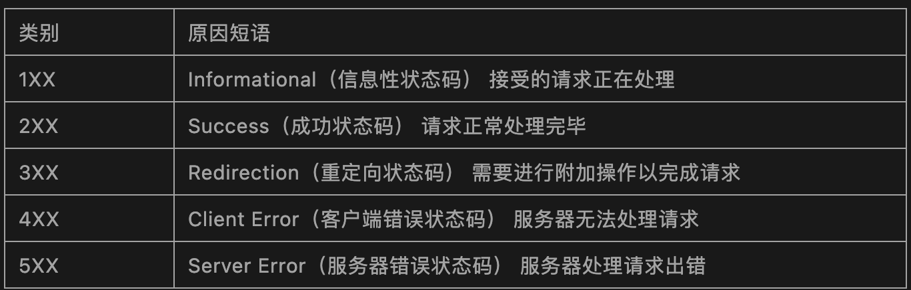
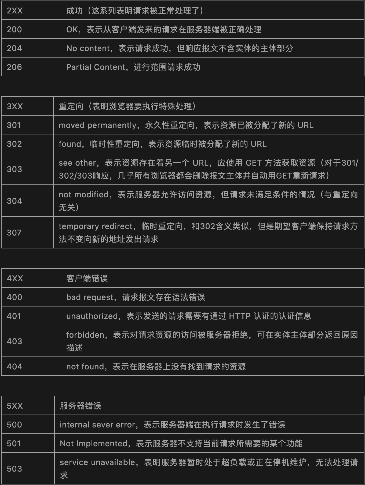

# **L5 常见网络编程面试题**

### **网络协议是什么？**

在计算机网络要做到有条不紊地交换数据，就必须遵守一些事先约定好的规则，**比如交换数据的格式、是否需要发送一个应答信息**。这些规则被称为网络协议。


**为什么要对网络协议分层？**

* 简化问题难度和复杂度。由于各层之间独立，我们可以分割大问题为小问题。
* 灵活性好。当其中一层的技术变化时，只要层间接口关系保持不变，其他层不受影响。
* 易于实现和维护。
* 促进标准化工作。分开后，每层功能可以相对简单地被描述。

网络协议分层的缺点：功能可能出现在多个层里，产生了额外开销。

为了使不同体系结构的计算机网络都能互联，国际标准化组织 ISO 于 1977 年提出了一个试图使各种计算机在世界范围内互联成网的标准框架，即著名的开放系统互联基本参考模型 OSI/RM，简称为 OSI。

OSI 的七层协议体系结构的概念清楚，理论也较完整，但它既复杂又不实用，TCP/IP 体系结构则不同，但它现在却得到了非常广泛的应用。

TCP/IP 是一个四层体系结构，它包含应用层，运输层，网际层和网络接口层（用网际层这个名字是强调这一层是为了解决不同网络的互连问题），不过从实质上讲，TCP/IP 只有最上面的三层，因为最下面的网络接口层并没有什么具体内容，因此在学习计算机网络的原理时往往采用折中的办法，即综合 OSI 和 TCP/IP 的优点，采用一种只有五层协议的体系结构，这样既简洁又能将概念阐述清楚，有时为了方便，也可把最底下两层称为网络接口层。


四层协议，五层协议和七层协议的关系如下：

* **TCP/IP是一个四层的体系结构，主要包括：应用层、运输层、网际层和网络接口层**。
* 五层协议的体系结构主要包括：应用层、运输层、网络层，数据链路层和物理层。
* OSI七层协议模型主要包括是：应用层（Application）、表示层（Presentation）、会话层（Session）、运输层（Transport）、网络层（Network）、数据链路层（Data Link）、物理层（Physical）。




注：五层协议的体系结构只是为了介绍网络原理而设计的，实际应用还是 TCP/IP 四层体系结构。


## **1、TCP/IP 协议族**

### **1-1 应用层**

应用层（application-layer）的任务是通过应用进程间的交互来完成特定网络应用。应用层协议定义的是应用进程（进程：主机中正在运行的程序）间的通信和交互的规则。


对于不同的网络应用需要不同的应用层协议。在互联网中应用层协议很多，如域名系统 DNS，支持万维网应用的 HTTP 协议，支持电子邮件的 SMTP 协议等等。


### **1-2 运输层**

运输层（transport layer）的主要任务就是负责向两台主机进程之间的通信提供通用的数据传输服务。应用进程利用该服务传送应用层报文。


运输层主要使用一下两种协议：


* 传输控制协议-TCP：**提供面向连接的，可靠的数据传输服务**。
* 用户数据协议-UDP：**提供无连接的，尽最大努力的数据传输服务（不保证数据传输的可靠性）**。



每一个应用层（TCP/IP 参考模型的最高层）协议一般都会使用到两个传输层协议之一。

运行在 TCP 协议上的协议：

* HTTP（Hypertext Transfer Protocol，超文本传输协议），主要用于普通浏览。
* HTTPS（HTTP over SSL，安全超文本传输协议），HTTP 协议的安全版本。
* FTP（File Transfer Protocol，文件传输协议），用于文件传输。
* POP3（Post Office Protocol，version 3，邮局协议），收邮件用。
* SMTP（Simple Mail Transfer Protocol，简单邮件传输协议），用来发送电子邮件。
* TELNET（Teletype over the Network，网络电传），通过一个终端（terminal）登陆到网络。
* SSH（Secure Shell，用于替代安全性差的 TELNET），用于加密安全登陆用。

运行在UDP协议上的协议：

* BOOTP（Boot Protocol，启动协议），应用于无盘设备。
* NTP（Network Time Protocol，网络时间协议），用于网络同步。
* DHCP（Dynamic Host Configuration Protocol，动态主机配置协议），动态配置IP地址。

运行在TCP和UDP协议上：

* DNS（Domain Name Service，域名服务），用于完成地址查找，邮件转发等工作。

### **1-3 网络层**

网络层的任务就是选择合适的网间路由和交换结点，确保计算机通信的数据及时传送。在发送数据时，网络层把运输层产生的报文段或用户数据报封装成分组和包进行传送。在 TCP/IP 体系结构中，由于网络层使用 IP 协议，因此分组也叫 IP 数据报 ，简称数据报。

互联网是由大量的异构（heterogeneous）网络通过路由器（router）相互连接起来的。互联网使用的网络层协议是无连接的网际协议（Intert Prococol）和许多路由选择协议，因此互联网的网络层也叫做网际层或 IP 层。

### **1-4 数据链路层**

数据链路层（data link layer）通常简称为链路层。两台主机之间的数据传输，总是在一段一段的链路上传送的，这就需要使用专门的链路层的协议。

在两个相邻节点之间传送数据时，数据链路层将网络层交下来的 IP 数据报组装成帧，在两个相邻节点间的链路上传送帧。每一帧包括数据和必要的控制信息（如同步信息，地址信息，差错控制等）。

在接收数据时，控制信息使接收端能够知道一个帧从哪个比特开始和到哪个比特结束。

一般的Web应用的通信传输流是这样的：



发送端在层与层之间传输数据时，每经过一层时会被打上一个该层所属的首部信息。反之，接收端在层与层之间传输数据时，每经过一层时会把对应的首部信息去除。


### **1-5 物理层**

在物理层上所传送的数据单位是比特。物理层（physical layer）的作用是实现相邻计算机节点之间比特流的透明传送，尽可能屏蔽掉具体传输介质和物理设备的差异。使其上面的数据链路层不必考虑网络的具体传输介质是什么。“透明传送比特流”表示经实际电路传送后的比特流没有发生变化，对传送的比特流来说，这个电路好像是看不见的。


### **1-6 TCP/IP 协议族**

在互联网使用的各种协议中最重要和最著名的就是 TCP/IP 两个协议。现在人们经常提到的 TCP/IP 并不一定是单指 TCP 和 IP 这两个具体的协议，而往往是表示互联网所使用的整个 TCP/IP 协议族。




互联网协议套件（英语：Internet Protocol Suite，缩写IPS）是一个网络通讯模型，以及一整个网络传输协议家族，为网际网络的基础通讯架构。它常被通称为 TCP/IP 协议族（英语：TCP/IP Protocol Suite，或 TCP/IP Protocols），简称 TCP/IP。因为该协定家族的两个核心协定：TCP（传输控制协议）和IP（网际协议），为该家族中最早通过的标准。

划重点：TCP（传输控制协议）和 IP（网际协议） 是最先定义的两个核心协议，所以才统称为 TCP/IP 协议族。


## **2、TCP的三次握手四次挥手**

TCP 是一种面向连接的、可靠的、基于字节流的传输层通信协议，在发送数据前，通信双方必须在彼此间建立一条连接。所谓的“连接”，其实是客户端和服务端保存的一份关于对方的信息，如 IP 地址、端口号等。


TCP 可以看成是一种字节流，它会处理 IP 层或以下的层的丢包、重复以及错误问题。在连接的建立过程中，双方需要交换一些连接的参数。这些参数可以放在 TCP 头部。


一个 TCP 连接由一个 4 元组构成，分别是两个 IP 地址和两个端口号。一个 TCP 连接通常分为三个阶段：**连接、数据传输、退出（关闭）。通过三次握手建立一个链接，通过四次挥手来关闭一个连接。**

当一个连接被建立或被终止时，交换的报文段只包含 TCP 头部，而没有数据。

**TCP 报文的头部结构**

在了解 TCP 连接之前先来了解一下 TCP 报文的头部结构。


上图中有几个字段需要重点介绍下：

* 序号：seq 序号，占 32 位，用来标识从 TCP 源端向目的端发送的字节流，发起方发送数据时对此进行标记。
* 确认序号：ACK 序号，占 32 位，只有 ACK 标志位为1时，确认序号字段才有效，`ack=seq+1`。
* 标志位：共 6 个，即 URG、ACK、PSH、RST、SYN、FIN 等，具体含义如下：
	* ACK：确认序号有效。
	* FIN：释放一个连接。
	* PSH：接收方应该尽快将这个报文交给应用层。
	* RST：重置连接。
	* SYN：发起一个新连接。
	* URG：紧急指针（urgent pointer）有效。

需要注意的是：

* 不要将确认序号 ACK 与标志位中的 ACK 搞混了。
* 确认方 ack = 发起方 seq + 1，两端配对。


### **2-1 三次握手**

三次握手的本质是确认通信双方收发数据的能力。

首先，我让信使运输一份信件给对方，对方收到了，那么他就知道了我的发件能力和他的收件能力是可以的。

于是他给我回信，我若收到了，我便知我的发件能力和他的收件能力是可以的，并且他的发件能力和我的收件能力是可以。

然而此时他还不知道他的发件能力和我的收件能力到底可不可以，于是我最后回馈一次，他若收到了，他便清楚了他的发件能力和我的收件能力是可以的。

这，就是三次握手，这样说，你理解了吗？



* 第一次握手：客户端要向服务端发起连接请求，首先客户端随机生成一个起始序列号 ISN（比如是 100），那客户端向服务端发送的报文段包含 SYN 标志位（也就是 SYN = 1），序列号 seq = 100。
* 第二次握手：服务端收到客户端发过来的报文后，发现 SYN = 1，知道这是一个连接请求，于是将客户端的起始序列号 100 存起来，并且随机生成一个服务端的起始序列号（比如是 300）。然后给客户端回复一段报文，回复报文包含 SYN 和 ACK 标志（也就是 SYN = 1，ACK = 1）、序列号 seq = 300、确认号 ack = 101（客户端发过来的序列号 + 1）。
* 第三次握手：客户端收到服务端的回复后发现 ACK = 1并且 ack =101，于是知道服务端已经收到了序列号为 100 的那段报文；同时发现 SYN = 1，知道了服务端同意了这次连接，于是就将服务端的序列号 300 给存下来。然后客户端再回复一段报文给服务端，报文包含 ACK 标志位（ACK = 1）、ack = 301（服务端序列号+1）、seq = 101（第一次握手时发送报文是占据一个序列号的，所以这次 seq 就从 101 开始，需要注意的是不携带数据的 ACK 报文是不占据序列号的，所以后面第一次正式发送数据时 seq 还是 101）。当服务端收到报文后发现 ACK = 1 并且 ack = 301，就知道客户端收到序列号为 300 的报文了，就这样客户端和服务端通过 TCP 建立了连接。



### **2-2 四次挥手**

四次挥手的目的是关闭一个连接。



比如客户端初始化的序列号 ISA = 100，服务端初始化的序列号 ISA = 300。TCP 连接成功后客户端总共发送了 1000 个字节的数据，服务端在客户端发 FIN 报文前总共回复了 2000 个字节的数据。

* 第一次挥手：当客户端的数据都传输完成后，客户端向服务端发出连接释放报文（当然数据没发完时也可以发送连接释放报文并停止发送数据），释放连接报文包含 FIN 标志位（FIN = 1）、序列号 seq = 1101（100 + 1 + 1000，其中的 1 是建立连接时占的一个序列号）。需要注意的是客户端发出 FIN 报文段后只是不能发数据了，但是还可以正常收数据；另外FIN报文段即使不携带数据也要占据一个序列号。
* 第二次挥手：服务端收到客户端发的FIN报文后给客户端回复确认报文，确认报文包含 ACK 标志位（ACK = 1）、确认号 ack = 1102（客户端 FIN 报文序列号 1101 + 1）、序列号 seq = 2300（300 + 2000）。此时服务端处于关闭等待状态，而不是立马给客户端发 FIN 报文，这个状态还要持续一段时间，因为服务端可能还有数据没发完。
* 第三次挥手：服务端将最后数据（比如 50 个字节）发送完毕后就向客户端发出连接释放报文，报文包含 FIN 和 ACK 标志位（FIN = 1，ACK = 1）、确认号和第二次挥手一样 ack = 1102、序列号 seq = 2350（2300 + 50）。
* 第四次挥手：客户端收到服务端发的FIN报文后，向服务端发出确认报文，确认报文包含 ACK 标志位（ACK = 1）、确认号 ack = 2351、序列号 seq = 1102。注意客户端发出确认报文后不是立马释放 TCP 连接，而是要经过 2MSL（最长报文段寿命的 2 倍时长）后才释放 TCP 连接。而服务端一旦收到客户端发出的确认报文就会立马释放 TCP 连接，所以服务端结束 TCP 连接的时间要比客户端早一些。

## **3、常见面试题**

### **3-1 为什么 TCP 连接的时候是 3 次？2 次不可以吗？**

因为需要考虑连接时丢包的问题，**如果只握手 2 次，第二次握手时如果服务端发给客户端的确认报文段丢失，此时服务端已经准备好了收发数据（可以理解服务端已经连接成功），而客户端一直没收到服务端的确认报文，所以客户端就不知道服务端是否已经准备好了（可以理解为客户端未连接成功），这种情况下客户端不会给服务端发数据，也会忽略服务端发过来的数据**。

如果是三次握手，即便发生丢包也不会有问题，比如如果第三次握手客户端发的确认 ack 报文丢失，服务端在一段时间内没有收到确认 ack 报文的话就会重新进行第二次握手，也就是服务端会重发 SYN 报文段，客户端收到重发的报文段后会再次给服务端发送确认 ack 报文。


### **3-2 为什么 TCP 连接的时候是 3 次，关闭的时候却是 4 次？**

因为只有在客户端和服务端都没有数据要发送的时候才能断开 TCP。

而客户端发出 FIN 报文时只能保证客户端没有数据发了，服务端还有没有数据发客户端是不知道的。而服务端收到客户端的 FIN 报文后只能先回复客户端一个确认报文来告诉客户端我服务端已经收到你的 FIN 报文了，但我服务端还有一些数据没发完，等这些数据发完了服务端才能给客户端发 FIN 报文（所以不能一次性将确认报文和 FIN 报文发给客户端，就是这里多出来了一次）。

### **3-3 为什么客户端发出第四次挥手的确认报文后要等 2MSL 的时间才能释放 TCP 连接？**

这里同样是要考虑丢包的问题，如果第四次挥手的报文丢失，服务端没收到确认 ack 报文就会重发第三次挥手的报文，这样报文一去一回最长时间就是 2MSL，所以需要等这么长时间来确认服务端确实已经收到了。


### **3-4 如果已经建立了连接，但是客户端突然出现故障了怎么办？**

TCP 设有一个保活计时器，客户端如果出现故障，服务器不能一直等下去，白白浪费资源。服务器每收到一次客户端的请求后都会重新复位这个计时器，时间通常是设置为 2 小时，若两小时还没有收到客户端的任何数据，服务器就会发送一个探测报文段，以后每隔 75 秒钟发送一次。若一连发送 10 个探测报文仍然没反应，服务器就认为客户端出了故障，接着就关闭连接。


### **3-5 什么是 HTTP，HTTP 与 HTTPS 有什么区别？**

HTTP 是一个在计算机世界里专门在两点之间传输文字、图片、音频、视频等超文本数据的约定和规范。



**常用 HTTP 状态码**

HTTP 状态码表示客户端 HTTP 请求的返回结果、标识服务器处理是否正常、表明请求出现的错误等。

**状态码的类别：**



**常用 HTTP 状态码：**




### **3-6 GET 和 POST 区别**

**说道 GET 和 POST，就不得不提 HTTP 协议，因为浏览器和服务器的交互是通过 HTTP 协议执行的，而 GET 和 POST 也是 HTTP 协议中的两种方法**。

HTTP 全称为 Hyper Text Transfer Protocol，中文翻译为超文本传输协议，目的是保证浏览器与服务器之间的通信。HTTP的工作方式是客户端与服务器之间的请求-应答协议。


HTTP 协议中定义了浏览器和服务器进行交互的不同方法，基本方法有 4 种，分别是 GET，POST，PUT，DELETE。这四种方法可以理解为，对服务器资源的查，改，增，删。


* GET：从服务器上获取数据，也就是所谓的查，仅仅是获取服务器资源，不进行修改。
* POST：向服务器提交数据，这就涉及到了数据的更新，也就是更改服务器的数据。
* PUT：英文含义是放置，也就是向服务器新添加数据，就是所谓的增。
* DELETE：从字面意思也能看出，这种方式就是删除服务器数据的过程。


**GET 和 POST 区别：**

* Get 是不安全的，因为在传输过程，数据被放在请求的 URL 中；Post 的所有操作对用户来说都是不可见的。但是这种做法也不时绝对的，大部分人的做法也是按照上面的说法来的，但是也可以在 get 请求加上 request body，给 post 请求带上 URL 参数。
* Get 请求提交的 url 中的数据最多只能是 2048 字节，这个限制是浏览器或者服务器给添加的，http 协议并没有对 url 长度进行限制，目的是为了保证服务器和浏览器能够正常运行，防止有人恶意发送请求。Post 请求则没有大小限制。
* Get 限制 Form 表单的数据集的值必须为 ASCII 字符；而 Post 支持整个 ISO10646字符集。
* Get 执行效率却比 Post 方法好。Get 是 form 提交的默认方法。
* GET 产生一个 TCP 数据包；POST 产生两个 TCP 数据包。
* 对于 GET 方式的请求，浏览器会把 http header 和 data 一并发送出去，服务器响应 200（返回数据）；而对于 POST，浏览器先发送 header，服务器响应 100 continue，浏览器再发送 data，服务器响应 200 ok（返回数据）。


### **3-7 什么是对称加密与非对称加密？**


**对称密钥加密是指加密和解密使用同一个密钥的方式，这种方式存在的最大问题就是密钥发送问题，即如何安全地将密钥发给对方。**

**而非对称加密是指使用一对非对称密钥，即公钥和私钥，公钥可以随意发布，但私钥只有自己知道。发送密文的一方使用对方的公钥进行加密处理，对方接收到加密信息后，使用自己的私钥进行解密。**

**由于非对称加密的方式不需要发送用来解密的私钥，所以可以保证安全性；但是和对称加密比起来，非常的慢。**


### **3-8 什么是 HTTP2？**

HTTP2 可以提高了网页的性能。

在 HTTP1 中浏览器限制了同一个域名下的请求数量（Chrome 下一般是六个），当在请求很多资源的时候，由于队头阻塞当浏览器达到最大请求数量时，剩余的资源需等待当前的六个请求完成后才能发起请求。


HTTP2 中引入了多路复用的技术，这个技术可以只通过一个 TCP 连接就可以传输所有的请求数据。多路复用可以绕过浏览器限制同一个域名下的请求数量的问题，进而提高了网页的性能。


### **3-9 Session、Cookie 和 Token 的主要区别**

**HTTP 协议本身是无状态的。什么是无状态呢，即服务器无法判断用户身份。**

#### **3-9-1 什么是 Cookie**

**Cookie 是由 Web 服务器保存在用户浏览器上的小文件（key-value 格式），包含用户相关的信息。**

客户端向服务器发起请求，如果服务器需要记录该用户状态，就使用 response 向客户端浏览器颁发一个 Cookie。

客户端浏览器会把 Cookie 保存起来。当浏览器再请求该网站时，浏览器把请求的网址连同该 Cookie 一同提交给服务器。服务器检查该 Cookie，以此来辨认用户身份。

#### **3-9-2 什么是 Session**

Session 是依赖 Cookie 实现的。Session 是服务器端对象。

**Session 是浏览器和服务器会话过程中，服务器分配的一块储存空间**。

服务器默认为浏览器在 Cookie 中设置 sessionid，浏览器在向服务器请求过程中传输 Cookie 包含 sessionid ，服务器根据 sessionid 获取出会话中存储的信息，然后确定会话的身份信息。


#### **3-9-3 Cookie 与 Session 区别**

* 存储位置与安全性：Cookie 数据存放在客户端上，安全性较差，Session 数据放在服务器上，安全性相对更高；
* 存储空间：单个 Cookie 保存的数据不能超过4 K，很多浏览器都限制一个站点最多保存 20 个 Cookie，Session 无此限制
* 占用服务器资源：Session 一定时间内保存在服务器上，当访问增多，占用服务器性能，考虑到服务器性能方面，应当使用 Cookie。


#### **3-9-4 什么是 Token**

Token 的引入：Token 是在客户端频繁向服务端请求数据，服务端频繁的去数据库查询用户名和密码并进行对比，判断用户名和密码正确与否，并作出相应提示，在这样的背景下，Token 便应运而生。

Token 的定义：Token 是服务端生成的一串字符串，以作客户端进行请求的一个令牌，当第一次登录后，服务器生成一个 Token 便将此 Token 返回给客户端，以后客户端只需带上这个 Token 前来请求数据即可，无需再次带上用户名和密码。


使用 Token 的目的：Token 的目的是为了减轻服务器的压力，减少频繁的查询数据库，使服务器更加健壮。

Token 是在服务端产生的。如果前端使用用户名/密码向服务端请求认证，服务端认证成功，那么在服务端会返回 Token 给前端。前端可以在每次请求的时候带上 Token 证明自己的合法地位。


#### **3-9-5 Session 与 Token 区别**


Session 机制存在服务器压力增大，CSRF 跨站伪造请求攻击，扩展性不强等问题；

Session 存储在服务器端，Token 存储在客户端

Token 提供认证和授权功能，作为身份认证，Token 安全性比 Session 好；

Session这种会话存储方式方式只适用于客户端代码和服务端代码运行在同一台服务器上，Token 适用于项目级的前后端分离（前后端代码运行在不同的服务器下）

#### **3-9-6 Servlet 是线程安全的吗？**

Servlet 不是线程安全的，多线程并发的读写会导致数据不同步的问题。

解决的办法是尽量不要定义 name 属性，而是要把 name 变量分别定义在 doGet() 和 doPost() 方法内。虽然使用 synchronized(name){} 语句块可以解决问题，但是会造成线程的等待，不是很科学的办法。


注意：多线程的并发的读写 Servlet 类属性会导致数据不同步。但是如果只是并发地读取属性而不写入，则不存在数据不同步的问题。因此 Servlet 里的只读属性最好定义为 final 类型的。


#### **3-9-7 Servlet 接口中有哪些方法及 Servlet 生命周期探秘**

在 Java Web 程序中，Servlet 主要负责接收用户请求 HttpServletRequest，在 doGet()，doPost() 中做相应的处理，并将回应 HttpServletResponse 反馈给用户。Servlet 可以设置初始化参数，供 Servlet 内部使用。

Servlet 接口定义了 5 个方法，其中前三个方法与 Servlet 生命周期相关：

* void init(ServletConfig config) throws ServletException
* void service(ServletRequest req, ServletResponse resp) throws ServletException, java.io.IOException
* void destory()
* java.lang.String getServletInfo()
* ServletConfig getServletConfig()

生命周期：


Web 容器加载 Servlet 并将其实例化后，Servlet 生命周期开始，容器运行其 init() 方法进行 Servlet 的初始化；

请求到达时调用 Servlet 的 service() 方法，service() 方法会根据需要调用与请求对应的 doGet 或 doPost 等方法；

当服务器关闭或项目被卸载时服务器会将 Servlet 实例销毁，此时会调用 Servlet 的 destroy() 方法。

init 方法和 destory 方法只会执行一次，service 方法客户端每次请求 Servlet 都会执行。Servlet 中有时会用到一些需要初始化与销毁的资源，因此可以把初始化资源的代码放入 init 方法中，销毁资源的代码放入 destroy 方法中，这样就不需要每次处理客户端的请求都要初始化与销毁资源。

### **3-10 如果客户端禁止 Cookie 能实现 Session 还能用吗？**

Cookie 与 Session，一般认为是两个独立的东西，Session 采用的是在服务器端保持状态的方案，而 Cookie 采用的是在客户端保持状态的方案。

但为什么禁用 Cookie 就不能得到 Session 呢？因为 Session 是用 Session ID 来确定当前对话所对应的服务器 Session，而 Session ID 是通过 Cookie 来传递的，禁用 Cookie 相当于失去了 Session ID，也就得不到 Session 了。


假定用户关闭 Cookie 的情况下使用 Session，其实现途径有以下几种：


* 手动通过 URL 传值、隐藏表单传递 Session ID。
* 用文件、数据库等形式保存 Session ID，在跨页过程中手动调用。


## **Linux ‘网络配置’ 和 ‘故障排除’ 命令总结**

### **ifconfig**


ifconfig命令 被用于配置和显示Linux内核中网络接口的网络参数。用ifconfig命令配置的网卡信息，在网卡重启后机器重启后，配置就不存在。要想将上述的配置信息永远的存的电脑里，那就要修改网卡的配置文件了。

```
# ifconfig

eth0: flags=4163<UP,BROADCAST,RUNNING,MULTICAST>  mtu 1500
        inet 172.24.186.123  netmask 255.255.240.0  broadcast 172.24.191.255
        ether 00:16:3e:24:5d:8c  txqueuelen 1000  (Ethernet)
        RX packets 36773275  bytes 9755326821 (9.0 GiB)
        RX errors 0  dropped 0  overruns 0  frame 0
        TX packets 31552596  bytes 6792314542 (6.3 GiB)
        TX errors 0  dropped 0 overruns 0  carrier 0  collisions 0

lo: flags=73<UP,LOOPBACK,RUNNING>  mtu 65536
        inet 127.0.0.1  netmask 255.0.0.0
        loop  txqueuelen 1000  (Local Loopback)
        RX packets 36893510  bytes 27158894604 (25.2 GiB)
        RX errors 0  dropped 0  overruns 0  frame 0
        TX packets 36893510  bytes 27158894604 (25.2 GiB)
        TX errors 0  dropped 0 overruns 0  carrier 0  collisions 0
```

> ifconfig 带网口（eth0) 命令仅显示特定的接口详细信息，例如 IP Address, MAC Address 等与 -a 如果它也被禁用，选项将显示所有可用的接口详细信息。

```
# ifconfig eth0
```

#### **分配 IP 地址和网关**

> 分配一个 IP Address 和 Gateway即时接口。如果系统重新启动，该设置将被删除。

```
# ifconfig eth0 192.168.1.110 netmask 255.255.255.0
```

#### **启用或禁用特定网口**

> enable 或者 disable ，我们使用示例命令如下。

**启用 eth0**


```
# ifup eth0
```

**禁用 eth0**

```
# ifdown eth0
```

#### **设置 MTU 大小**

> 默认情况下 MTU 大小是 1500. 我们可以设置所需MTU大小与以下命令。代替XXXX 与大小。

```
# ifconfig eth0 mtu XXXX
```

#### **将接口设置为混杂模式**

> Network interface 只有收到的数据包属于那个特定的 NIC. 如果你把接口promiscuous模式它将接收所有的数据包。这对于捕获数据包和稍后分析非常有用。为此，您可能需要超级用户访问权限。

```
# ifconfig eth0 - promisc
```

### **2. ping 命令**

ping命令 用来测试主机之间网络的连通性。执行ping指令会使用ICMP传输协议，发出要求回应的信息，若远端主机的网络功能没有问题，就会回应该信息，因而得知该主机运作正常。

```
# ping 127.0.0.1
或
# ping www.rumenz.com
```

在 Linuxping 命令一直执行，直到您中断。**平与`-c `选项退出后 `N `请求数（成功或错误响应）**。

```
# ping -c 5 www.rumenz.com
PING www.rumenz.com (42.194.162.109) 56(84) bytes of data.
64 bytes from 42.194.162.109 (42.194.162.109): icmp_seq=1 ttl=52 time=35.8 ms
64 bytes from 42.194.162.109 (42.194.162.109): icmp_seq=2 ttl=52 time=35.6 ms
64 bytes from 42.194.162.109 (42.194.162.109): icmp_seq=3 ttl=52 time=35.6 ms
64 bytes from 42.194.162.109 (42.194.162.109): icmp_seq=4 ttl=52 time=35.6 ms
64 bytes from 42.194.162.109 (42.194.162.109): icmp_seq=5 ttl=52 time=35.6 ms

--- www.rumenz.com ping statistics ---
5 packets transmitted, 5 received, 0% packet loss, time 4004ms
rtt min/avg/max/mdev = 35.662/35.720/35.893/0.190 ms
```

### **3. traceroute 命令**

traceroute是一个网络故障排除实用程序，它显示到达目的地所用的跳数，也决定了数据包的传播路径。下面我们正在追踪通往全球的路线DNS server IP Address 并且能够到达目的地还显示该数据包正在旅行的路径。


```
# traceroute 8.8.8.8
```

### **4. netstat 命令**

```
netstat命令 用来打印Linux中网络系统的状态信息，可让你得知整个Linux系统的网络情况。
```

```
# netstat -r
Kernel IP routing table
Destination     Gateway         Genmask         Flags   MSS Window  irtt Iface
default         gateway         0.0.0.0         UG        0 0          0 eth0
link-local      0.0.0.0         255.255.0.0     U         0 0          0 eth0
172.24.176.0    0.0.0.0         255.255.240.0   U         0 0          0 eth0
```

### **5. dig 命令**

dig命令 是常用的域名查询工具，可以用来测试域名系统工作是否正常。

```
# dig www.rumenz.com

; <<>> DiG 9.11.4-P2-RedHat-9.11.4-26.P2.el7_9.7 <<>> www.rumenz.com
;; global options: +cmd
;; Got answer:
;; ->>HEADER<<- opcode: QUERY, status: NOERROR, id: 11798
;; flags: qr rd ra; QUERY: 1, ANSWER: 1, AUTHORITY: 0, ADDITIONAL: 0

;; QUESTION SECTION:
;www.rumenz.com.                        IN      A

;; ANSWER SECTION:
www.rumenz.com.         583     IN      A       42.194.162.109

;; Query time: 0 msec
;; SERVER: 100.100.2.136#53(100.100.2.136)
;; WHEN: Sat Nov 20 21:45:32 CST 2021
;; MSG SIZE  rcvd: 48
```

### **6. nslookup 命令**


nslookup 命令也用于找出 DNS相关查询。下面的例子显示A Record (IP Address） 的 rumenz.com.

```
# nslookup www.rumenz.com
Server:         100.100.2.136
Address:        100.100.2.136#53

Non-authoritative answer:
Name:   www.rumenz.com
Address: 42.194.162.109
```

### **7. route命令**

> route 命令还显示和操作 ip路由表。查看默认路由表Linux

```
# route
```

> 使用以下命令添加、删除路由和默认网关。

```
# route add -net 10.10.10.0/24 gw 192.168.0.1
```

删除路由


```
# route del -net 10.10.10.0/24 gw 192.168.0.1
```

**添加默认网关**

```
# route add default gw 192.168.0.1
```

### **8. host命令**


> host 查找名称的命令 IP 或者 IP 命名 IPv4 或者 IPv6 并查询 DNS 记录。

```
# host www.rumenz.com
www.rumenz.com has address 42.194.162.109
```

> 使用 -t 选项我们可以找出 DNS 资源记录，例如 CNAME, NS, MX, SOA 等等。

```
//先安装
# yum install bind-utils -y
# host -t CNAME www.baidu.com
www.baidu.com is an alias for www.a.shifen.com.
```

### **9. arp 命令**

arp 命令 是 Address Resolution Protocol，地址解析协议，是通过解析网络层地址来找寻数据链路层地址的一个网络协议包中极其重要的网络传输协议。而该命令可以显示和修改 arp 协议解析表中的缓冲数据。

```
# arp -e
Address                  HWtype  HWaddress           Flags Mask            Iface
gateway                  ether   ee:ff:ff:ff:ff:ff   C                     eth0
```

### **10. ethtool 命令**

> ethtool命令用于获取以太网卡的配置信息，或者修改这些配置。这个命令比较复杂，功能特别多。

```
# ethtool eth0
Settings for eth0:
        Link detected: yes
```

### **11. iwconfig 命令**

> iwconfig  系统配置无线网络设备或显示无线网络设备信息。iwconfig 命令类似于ifconfig命令，但是他配置对象是无线网卡，它对网络设备进行无线操作，如设置无线通信频段


```

//先安装
# yum install -y wireless-tools
# iwconfig [interface]
eth0      no wireless extensions.
```

### **12. hostname 命令**


hostname是在网络中识别。执行hostname命令以查看机器的主机名。可以在其中永久设置主机名`/etc/sysconfig/network.` 设置正确的主机名后需要重新启动。

```
# hostname
rumenz.com
```

