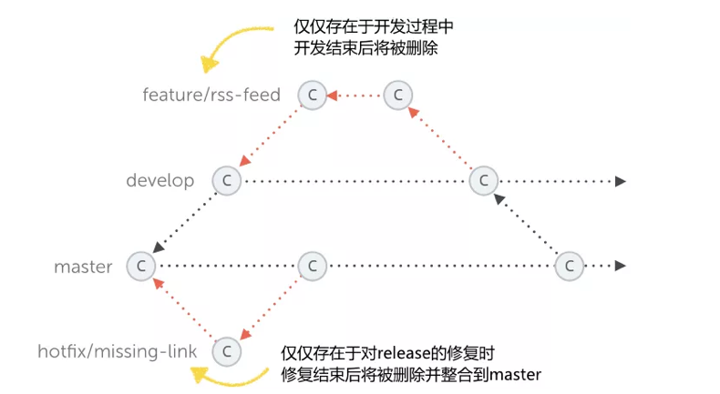
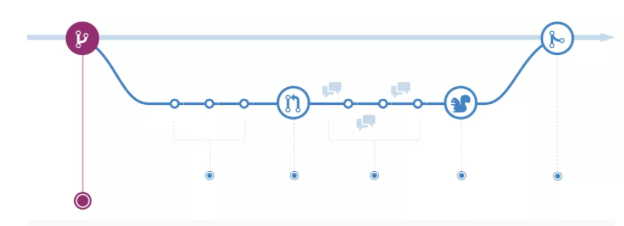
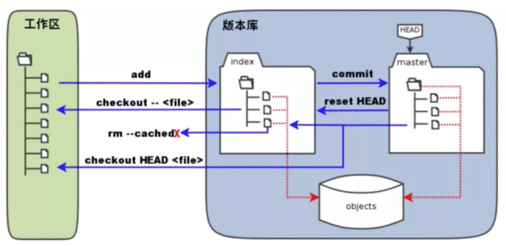
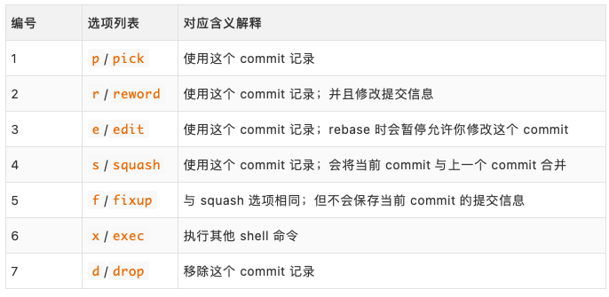

# **L6 Git 实用技巧记录**


**Git Flow：**

* 主干分支
* 稳定分支
* 开发分支
* 补丁分支
* 修改分支



**GitHub Flow：**

* 创建分支
* 添加提交
* 提交 PR 请求
* 讨论和评估代码
* 部署检测
* 合并代码





* 带生产分支
* 带环境分支
* 带发布分支


## **1、日常使用最佳实践**

使用命令行代替图形化界面：

* 使用命令行来操作，简洁且效率高


提交应该尽可能的表述提交修改内容：


* 区分 subject 和 body 内容，使用空行隔开
* subject 一般不超过 50 个字符
* body 每一行的长度控制在 72 个字符
* subject 结尾不需要使用句号或者点号结尾
* body 用来详细解释此次提交具体做了什么

使用 `.gitignore` 文件来排除无用文件：

* 可使用模板文件，然后根据项目实际进行修改

基于分支或 fork 的开发模式：

* 不要直接在主干分支上面进行开发
* 在新建的分支上进行功能的开发和问题的修复

使用 release 分支和 tag 标记进行版本管理：

* 使用 release 分支发布代码和版本维护（release/1.32）
* 使用 tag 来标记版本（A-大 feature 功能；B-小 feature 功能；C-只修 bug）

## **2、常用命令汇总整理**

日常使用只要记住 6 个命令就可以了。



```
# 工作区 -> 暂存区
$ git add <file/dir>

# 暂存区 -> 本地仓库
$ git commit -m "some info"

# 本地仓库 -> 远程仓库
$ git push origin master  # 本地 master 分支推送到远程 origin 仓库
```

```
# 工作区 <- 暂存区
$ git checkout -- <file>  # 暂存区文件内容覆盖工作区文件内容

# 暂存区 <- 本地仓库
$ git reset HEAD <file>   # 本地仓库文件内容覆盖暂存区文件内容

# 本地仓库 <- 远程仓库
$ git clone <git_url>        # 克隆远程仓库
$ git fetch upstream master  # 拉取远程代码到本地但不应用在当前分支
$ git pull upstream master   # 拉取远程代码到本地但应用在当前分支
$ git pull --rebase upstream master  # 如果平时使用 rebase 合并代码则加上
```

```
# 工作区 <- 本地仓库
$ git reset <commit>          # 本地仓库覆盖到工作区（保存回退文件内容修改）
$ git reset --mixed <commit>  # 本地仓库覆盖到工作区（保存回退文件内容修改）
$ git reset --soft <commit>   # 本地仓库覆盖到工作区（保留修改并加到暂存区）
$ git reset --hard <commit>   # 本地仓库覆盖到工作区（不保留修改直接删除掉)
```

## **2、配置实用参数选项**

### **2-1 全局配置**

```
# 用户信息
$ git config --global user.name "your_name"
$ git config --global user.email "your_email"

# 文本编辑器
$ git config --global core.editor "nvim"

# 分页器
$ git config --global core.pager "more"

# 别名
$ git config --global alias.gs "git status"

# 纠错
$ git config --global help.autocorrect 1
```

### **2-2 个人配置**


```
# 不加 --global 参数的话，则为个人配置
$ git config --list
$ git config user.name
$ git config user.name "your_name"

# 如果在项目中设置，则保存在 .git/config文件里面
$ cat .git/config
[user]
    name = "your_name"
......
```

## **3、合并和变基的选择**

*到底什么时候使用 merge 操作，什么时候使用 rebase 操作呢？*


**使用 merge 操作 - Python 中的 Requests 库在使用**

支持使用 merge 的开发者，他们认为仓库的提交历史就是记录实际发生过什么，它是针对于历史的一个文档，本身其实是有价值的，我们不应该随意修改。我们改变历史的话，就相当于使用“谎言”来掩盖实际发生过的事情，而这些痕迹是应该被保留的。可能，这样并不是很好。

```
# 3rd 的两个分支的 commit 修改相同内容
*   62a322d - (HEAD->master) Merge branch 'hotfix3' into master
|\
| * 6fa8f4a - (hotfix3) 3rd commit in hotfix3
* | 548d681 - 3rd commit in master
|/
* 6ba4a08 - 2nd commit
* 22afcc1 - 1st commit
```

**使用 rebase 操作 - Python 中的 Django 库在使用**

支持使用 rebase 的开发者，他们认为提交历史是项目过程中发生过的事情，需要项目的主干非常的干净。而使用 merge 操作会生成一个 merge 的 commit 对象，让提交历史多了一些非常多余的内容。

当我们后期，使用 log 命令参看提交历史的话，会发现主干的提交历史非常的尴尬。比如，同样的修改内容重复提交了两次，这显然是分支合并导致的问题。

```
# 3rd 的两个分支的 commit 修改相同内容
* 697167e - (HEAD -> master, hotfix) 3rd commit
* 6ba4a08 - 2nd commit (2 minutes ago)
* 22afcc1 - 1st commit (3 minutes ago)
```

**两者的使用原则**

总的原则就是，只对尚未推送或分享给其他人的本地修改执行变基操作清理历史，从不对已经推送到仓库的提交记录执行变基操作，这样，你才可能享受到两种方式带来的便利。


## **4、更新仓库提交历史**

Git 提供了一些工具，可以帮助我们完善版本库中的提交内容，比如：

### **4-1 合并多个 commit 提交记录**

**日常开发中，我们为了完成一个功能或者特性，提交很多个 commit 记录。但是在最后，提交 PR 之前，一般情况下，我们是应该整理下这些提交记录的**。有些 commit 需要合并起来，或者需要将其删除掉，等等。

```
# 调整最近五次的提交记录
$ git rebase -i HEAD~5
$ git rebase -i 5af4zd35  # 往前第六次的commit值
reword c2aeb6e 3rd commit
squash 25a3122 4th commit
pick 5d36f1d 5th commit
fixup bd5d32f 6th commit
drop 581e96d 7th commit

# 查看提交历史记录
$ git log
* ce813eb - (HEAD -> master) 5th commit
* aa2f043 - 3rd commit -> modified
* 6c5418f - 2nd commit
* c8f7dea - 1st commit
```



### **4-2 删除意外调试的测试代码**

有时候提交之后，我们才发现提交的历史记录中存在这一些问题，而这个时候我们又不想新生成一个 commit 记录，且达到一个修改的目录。即，修改之前的 commit 提交记录。

```
# 不使用分页器
$ git --no-pager log --oneline -1
d5e96d9 (HEAD -> master) say file

# 改变提交信息并加入暂存区
$ echo "hello" > say.txt
$ git add -u

# 改变当前最新一次提交记录
$ git commit --amend
# 改变且息不改变提交信
$ git commit --amend --no-edit
# 改变当前最新一次提交记录并修改信息
$ git commit --amend -m "some_info"

# 不使用分页器
$ git --no-pager log --oneline -1
9e1e0eb (HEAD -> master) say file
```

### **4-3 取消多个 commit 中的部分提交**

我们开发了一个功能，而在上线的时候，产品经理说这个功能的部分特性已经不需要了，即相关特性的提交记录和内容就可以忽略/删除掉了。

```
# 回滚操作(可多次执行回滚操作)
# 彻底上次提交记录；也可是 PR 的提交记录
# 默认会生成一个类型为 reverts 的新 commit 对象
$ git revert 3zj5sldl
```

### **4-4 合并某些特定的 commit 提交**

我们不希望合并整个分支，而是需要合并该分支的某些提交记录就可以了。

```
# 摘樱桃
$ git cherry-pick -x z562e23d
```

## **5、使用引用日志记录**

如何找回我们丢失的内容和记录？

我们之前说过，使用下面命令回退内容、强制推送代码、删除本地分支，都是非常危险的操作，因为重置之后我们就没有办法在找到之前的修改内容了。

```
# 回退
$ git reset --hard <commit>

# 推送
$ git push origin master -f

# 分支
$ git branch -D <branch_name>
```

其实 Git 给我们留了一个后门，就是使用 relflog 命令来找回之前的内容，只不过是相对来说麻烦一些。而原理也很简答，就是在我们使用 Git 命令操作仓库的时候，Git 偷偷地帮助我们把所有的操作记录了下来。

```
# 查看日志记录
$ git --no-pager log --oneline -1
4bc8703 (HEAD -> master) hhhh

# 回退到上次提交
$ git reset --hard HEAD~1

# 查看引用日志记录
$ git reflog
6a89f1b (HEAD -> master) HEAD@{0}: reset: moving to HEAD~1
4bc8703 HEAD@{1}: commit (amend): hhhh

# 找回内容
$ git cherry-pick 4bc8703
```


## **6、批量修改历史提交**


之前我们学习到的命令都是针对于一个或者多个 commit 提交信息进行修改的，如果我们需要全局修改历史提交呢？当然，Git 中也是支持全局修改历史提交的，比如全局修改邮箱地址，或者将一个文件从全局历史中删除或修改。

* 开源项目中使用了公司邮箱进行提交了
* 提交文件中包含隐私性的密码相关信息
* 提交时将大文件提交到了仓库代码中了


这里我们可以使用 filter-brach 的方式进行修改，但是建议在使用之前，新建一个分支，在上面进行测试没有问题之后，再在主干上操作，防止出现问题，背个大锅在身上。

```
# 创建分支
$ git branch -b testing

# 修改邮箱地址
$ git filter-branch --commit-filter '
    if [ "$GIT_AUTHOR_EMAIL" == "escape@escapelife.site" ]; then
        GIT_AUTHOR_NAME="escape";
        GIT_AUTHOR_EMAIL="escape@gmail.com";
        git commit-tree "$@"
    else
        git commit-tree "$@"
    fi' HEAD
```

## **7、灵活使用钩子函数**

主要介绍.git/hooks 目录下面的示例钩子函数！

在 Git 里面有两类，分别对应客户端和服务端钩子函数。客户端的钩子函数，是在执行提交和合并之类的操作时调用的。而服务端钩子函数，就是当服务端收到代码提交之后，可以出发代码检查和持续集成的步骤。作为开发者我们并不会搭建 Git 服务器，所以基本不会涉及。

下面就是 Git 自带的钩子脚本，但是自带的都 .sample 作为后缀，表示并没有启用，表示为一个示例。如果需要启用的话，将 ·.sample ·作为后缀删除掉，即可。而其钩子脚本的对应内容，都是使用 Shell 语法进行编写的。

```
➜ ll .git/hooks
total 112
-rwxr-xr-x  applypatch-msg.sample
-rwxr-xr-x  commit-msg.sample
-rwxr-xr-x  fsmonitor-watchman.sample
-rwxr-xr-x  post-update.sample
-rwxr-xr-x  pre-applypatch.sample
-rwxr-xr-x  pre-commit.sample
-rwxr-xr-x  pre-merge-commit.sample
-rwxr-xr-x  pre-push.sample  # 不会推送包含WIP的commit提交
-rwxr-xr-x  pre-rebase.sample
-rwxr-xr-x  pre-receive.sample
-rwxr-xr-x  prepare-commit-msg.sample
-rwxr-xr-x  update.sample
```

其实，钩子脚本使用任何语言编写都是可以的，只要你让程序返回对应的退出码就可以了。

正常的代码合入流程就是，我们本地修改之后，提一个 PR 请求并通过 Github 的 CI 检查，接下来进行代码评审，最后被合并入主干。但是，好的一个习惯就是，在代码提交之前就应该保证代码不会出现语法错误等基础问题，比如通过 flake8 和 PEP8 标准等。

这个时候我们就可以使用 pre-commit[1] 这个 GitHub 的开源项目了，其本质就是给项目添加钩子函数的一个脚本，可以保证我们在提交代码或者推送代码之前，先检查代码的质量。

而 pre-commit-hooks 这个项目里面包含的就是，现在所支持的钩子脚本，即开箱即用的钩子脚本集合。而其钩子脚本的对应内容，都是使用 Python 语法进行编写的。

```
# 安装方式
$ pip install pre-commit

# 指定 hook 类型（即在哪里检查）
$ pre-commit install -f --hook-type pre-push

# 配置需要执行的检查
$ cat .pre-commit-config.yaml
repos:
- repo: https://github.com/pre-commit/pre-commit-hooks
  rev: v2.9.2
  hooks:
    - id: trailing-whitespace
    - id: flake8

# 执行 push 操作时检查
$ git push origin master
```

## **8、快速克隆大型项目**

我们如果想为 Linux 或 Python 这样的大型项目贡献提交的时候，首先遇到的问题就是，如果快速的 clone 该项目到本地。因为改项目提交历史超多且仓库巨大，加了国内网络的问题，可能等项目完全拉下来的时候，我们的热情都消减下去了。

好在 Git 也帮我们想到了这样的问题，我们可以使用 --depth 参数值拉取远程仓库上面最新一次的提交历史，并不包含项目历史记录，即 `.git/objects/` 目录下的对象只是本地的，并不包含之前的多次修改产生的对象。

```
# 克隆不包含之前历史
$ git clone http://xxx.xx.xxx/xxx --depth=1
```

但是，有时间我们可能会需要 clone 仓库中的某个 tag 版本对应下的内容。如果我们直接使用 clone 命令是无法做到的，需要执行如下操作，即可完美解决。

```
# 克隆特定版本代码
$ git init xxx-15-0-1
$ git remote add origin http://xxx.xx.xxx/xxx
$ git -c protocol.version=2 fetch origin 15.0.1 --depth=1
$ git checkout FETCH_HEAD
```

上面的效果已经基本可以满足我们日常使用需求了，但是不幸的是，你现在接受了一个机器学习的项目，里面包含了大量的 lfs 文件，现在 clone 又会变得非常慢。可以使用如下操作来避免，Git 工具主动拉去 lfs 文件，来达到目录。


```
# 克隆不包含 LFS 数据
$ GIT_LFS_SKIP_SMUDGE=1 git clone http://xxx.xx.xxx/xxx
```

## **9、何处理工作中断**


比如，我们现在正在一个分支为项目添加一个小的功能，此时，产品经理找到你说是线上环境现在有一个 bug 需要让你来修复下。但是，此时我们添加的小功能并没有完成。

如果此时，我们直接切换到主干分支的话，会将之前分支没有来得及提交的内容全部都带到了主干分支上来，这是我们不想看到的情况。此时，我们需要保存上个分支的工作状态，在我们修改完成线上 bug 之后，再继续工作。

好在 Git 也帮我们想到了这样的问题，我们可以使用 stash 子命令帮助我们将当前工作区、暂存区当中的修改都保存到堆栈之中。等到需要处理的时候，再弹出堆栈中的内容，我们再次进行开发。

```
➜ git stash -h
usage: git stash list [<options>]
   or: git stash show [<options>] [<stash>]
   or: git stash drop [-q|--quiet] [<stash>]
   or: git stash ( pop | apply ) [--index] [-q|--quiet] [<stash>]
   or: git stash branch <branchname> [<stash>]
   or: git stash clear
   or: git stash [push [-p|--patch] [-k|--[no-]keep-index] [-q|--quiet]
          [-u|--include-untracked] [-a|--all] [-m|--message <message>]
          [--pathspec-from-file=<file> [--pathspec-file-nul]]
          [--] [<pathspec>...]]
   or: git stash save [-p|--patch] [-k|--[no-]keep-index] [-q|--quiet]
          [-u|--include-untracked] [-a|--all] [<message>]
```
```
# 存储当前的修改但不用提交 commit
$ git stash

# 保存当前状态包括 untracked 的文件
$ git stash -u

# 展示所有 stashes 信息
$ git stash list

# 回到某个 stash 状态
$ git stash apply <stash@{n}>

# 删除储藏区
$ git stash drop <stash@{n}>

# 回到最后一个 stash 的状态并删除这个 stash 信息
$ git stash pop

# 删除所有的 stash 信息
$ git stash clear

# 从 stash 中拿出某个文件的修改
$ git checkout <stash@{n}> -- <file-path>
```

其实比较保险的做法就是，将当前的所有修改进行 push 并保存到远程仓库里面。这样的好处在于，可以远端备份我们的修改，不会害怕本地文件丢失等问题。等到我们需要继续开发的时候，拉下对应内容，再想办法进行补救，比如使用 `--amend `或者 `reset` 命令。

```
# 将工作区和暂存区覆盖最近一次提交
$ git commit --amend
$ git commit --amend -m "some_info"

# 回退到指定版本并记录修改内容（--mixed）
# 本地仓库覆盖到工作区（保存回退文件内容修改）
$ git reset a87f328
$ git reset HEAD~
$ git reset HEAD~2
$ git reset <tag>~2
$ git reset --mixed <commit/reference>

# 本地仓库覆盖到工作区（不保留修改直接删除掉）
$ git reset --soft <commit/reference>
# 本地仓库覆盖到工作区（保留修改并加到暂存区）
$ git reset --hard <commit/reference>
```


