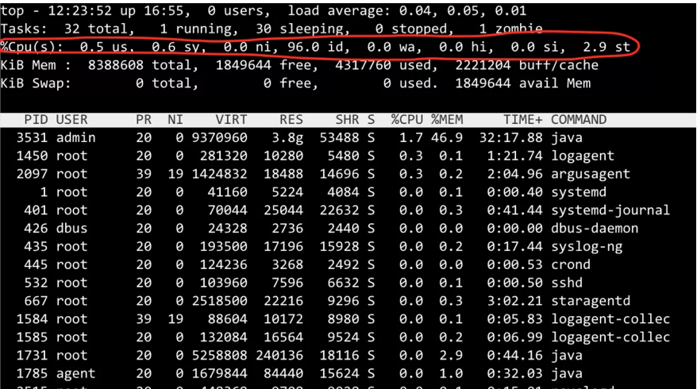
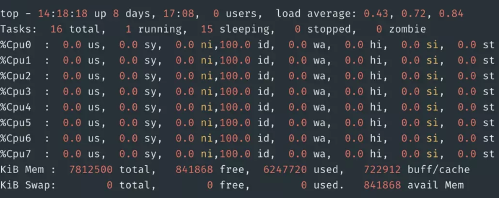

# **L9 Linux面试最高频的5个基本问题（CPU+COMMMAND)**

## **1、CPU利用率和CPU负载的区别是什么**

### **1-1 CPU利用率**

提到CPU利用率，就必须理解时间片。什么是CPU时间片？我们现在所使用的Windows、Linux、Mac OS都是“多任务操作系统”，就是说他们可以“同时”运行多个程序，比如一边打开Chrome浏览器浏览网页还能一边听音乐。


但是，实际上一个CPU内核在同一时刻只能干一件事，那操作系统是如何实现“多任务”的呢？**大概的方法是让多个进程轮流使用CPU一小段时间，由于这个“一小段时间”很短(在linux上为5ms-800ms之间)，用户感觉不到，就好像是几个程序同时在运行了**。

上面提到的“一小段时间”就是我们所说的CPU时间片，**CPU的现代分时多任务操作系统对CPU都是分时间片使用的**。

**CPU使用率，就是程序对CPU时间片的占用情况**

> 即CPU使用率 = CPU时间片被程序使用的时间 / 总时间。

比如A进程占用10ms，然后B进程占用30ms，然后空闲60ms，再又是A进程占10ms，B进程占30ms，空闲60ms，如果在一段时间内都是如此，那么这段时间内的CPU占用率为40%。

**CPU利用率显示的是程序在运行期间实时占用的CPU百分比。**


大多数操作系统的CPU占用率分为用户态CPU使用率和系统态CPU使用率。

用户态CPU使用率是指执行应用程序代码的时间占总CPU时间的百分比。相比而言，系统态CPU使用率是指应用执行操作系统调用的时间占总CPU时间的百分比。系统态的CPU使用率高意味着共享资源有竞争或者I/O设备之间有大量的交互。

### **1-2 CPU负载**

**简单理解，一个是CPU的实时使用情况，一个是CPU的当前以及未来一段时间的使用情况。**

举例来说：如果我有一个程序它需要一直使用CPU的运算功能，那么此时CPU的使用率可能达到100%，但是CPU的工作负载则是趋近于“1”，因为CPU仅负责一个工作嘛！

如果同时执行这样的程序两个呢？CPU的使用率还是100%，但是工作负载则变成2了。所以也就是说，**<mark>CPU的工作负载越大，代表CPU必须要在不同的工作之间进行频繁的工作切换</mark>**。无论CPU的利用率是高是低，跟后面有多少任务在排队(CPU负载)没有必然关系。

**如果单核CPU的话，负载达到1就代表CPU已经达到满负荷的状态了，超过1，后面的进行就需要排队等待处理了。如果是是多核多CPU，假设现在服务器是2个CPU，每个CPU有2个核，那么总负载不超过4都没什么问题。**


可以通过uptime、w命令查看CPU平均负载，使用top命令还能看到CPU负载总体使用率以及各个进程占用CPU的比例。



### **1-3 查看物理CPU个数**

```
cat /proc/cpuinfo | grep “physical id”| sort | uniq | wc -l
```

### **1-4 查看每个物理CPU中core的个数(即核数)**

```
cat /proc/cpuinfo | grep “cpu cores” | uniq
```

### **1-5 查看逻辑CPU的个数**

```
cat /proc/cpuinfo| grep “processor”| wc -l
```

## **2、如果CPU负载很高，利用率却很低该怎么办**

**<mark>CPU负载很高，利用率却很低，说明处于等待状态的任务很多，负载越高，代表可能很多僵死的进程。通常这种情况是IO密集型的任务，大量任务在请求相同的IO，导致任务队列堆积。</mark>**


生产环境造成CPU利用率低负载高的具体场景常见的有如下几种。

### **2-1 场景一：磁盘读写请求过多就会导致大量I/O等待**

进程在cpu上面运行需要访问磁盘文件，这个时候cpu会向内核发起调用文件的请求，让内核去磁盘取文件，这个时候cpu会切换到其他进程或者空闲，这个任务就会转换为不可中断睡眠状态。当这种读写请求过多就会导致不可中断睡眠状态的进程过多，从而导致负载高，cpu低的情况。

### **2-2 场景二：MySQL中存在没有索引的语句或存在死锁等情况**

我们都知道MySQL的数据是存储在硬盘中，如果需要进行sql查询，需要先把数据从磁盘加载到内存中。当在数据特别大的时候，如果执行的sql语句没有索引，就会造成扫描表的行数过大导致I/O阻塞，或者是语句中存在死锁，也会造成I/O阻塞，从而导致不可中断睡眠进程过多，导致负载过大。

**同样，可以先通过top命令观察，假设发现现在确实是高负载低使用率。**




**然后，再通过命令`ps -aux`查看是否存在状态为`D的`进程，这个状态指的就是不可中断的睡眠状态的进程。**


处于这个状态的进程无法终止，也无法自行退出，只能通过恢复其依赖的资源或者重启系统来解决。以下图中没有D状态的进程。


Linux上进程的五种状态

* R (`TASK_RUNNING`)：**可执行状态，只有在该状态的进程才可能在CPU上运行。而同一时刻可能有多个进程处于可执行状态**。
* **S (`TASK_INTERRUPTIBLE)`：可中断的睡眠状态，**处于这个状态的进程因为等待某某事件的发生（比如等待socket连接、等待信号量），而被挂起。
* **D (`TASK_UNINTERRUPTIBLE`)：不可中断的睡眠状态，进程处于睡眠状态，但是此刻进程是不可中断的**。`**TASK_UNINTERRUPTIBLE`状态存在的意义就在于，内核的某些处理流程是不能被打断的**。
* **T (`TASK_STOPPED` or` TASK_TRACED`)：暂停状态或跟踪状态。Z (`TASK_DEAD - EXIT_ZOMBIE)`：退出状态，进程成为僵尸进程。**进程已终止，但进程描述还在，直到父进程调用`wait4()`系统调用后释放。

## **3、如果CPU负载很低，利用率却很高该怎么办**

**<mark>这表示CPU的任务并不多，但是任务执行的时间很长，大概率就是你写的代码本身有问题，通常是计算密集型任务，生成了大量耗时短的计算任务。</mark>**


怎么排查？直**接top命令找到CPU使用率最高的进程，定位到去看看就行了**。如果代码没有问题，那么过段时间CPU使用率就会下降的。往期面试题汇总：250期面试资料

## **4、CPU利用率达到100%怎么排查问题**

### **4-1、通过top找到CPU占用率高的进程（时间占用的多）**


### **4-2、通过`top -Hp pid`命令查看CPU占比靠前的线程ID**


### **4-3、再把线程ID转化为16进制，`printf “0x%x\n” 74317`，得到0x1224d**

### **4-4、通过命令`jstack 72700 | grep ‘0x1224d’ -C5 --color`找到有问题的代码**

```
注意：jstack的对象是java进程的PID，而不是java线程的PID。
```

## **5、说几个常见的Linux命令**

### **5-1 常用的文件/目录命令**

ls：用户查看目录下的文件，`ls -a`可以用来查看隐藏文件，`ls -l可`以用于查看文件的详细信息，包括权限、大小、所有者等信息。

touch：用于创建文件。如果文件不存在，则创建一个新的文件，如果文件已存在，则会修改文件的时间戳。

cat：cat是英文concatenate的缩写，用于查看文件内容。使用cat查看文件的话，不管文件的内容有多少，都会一次性显示，所以他不适合查看太大的文件。

more：more和cat有点区别，more用于分屏显示文件内容。可以用空格键向下翻页，b键向上翻页

less：和more类似，less用于分行显示

tail：可能是平时用的最多的命令了，查看日志文件基本靠它。`tail -fn 100 xx.log`查看最后的100行内容


### **5-2 常用的权限命令**


chmod：修改权限命令。一般用+号添加权限，-号删除权限，x代表执行权限，r代表读取权限，w代表写入权限，常见写法比如`chmod +x `文件名添加执行权限。

**还有另外一种写法，使用数字来授权，因为r=4，w=2，x=1，平时执行命令chmod 777 文件名这就是最高权限了。**

第一个数字7=4+2+1代表着所有者的权限，第二个数字7代表所属组的权限，第三个数字代表其他人的权限。常见的权限数字还有644，所有者有读写权限，其他人只有只读权限，755代表其他人有只读和执行权限。

**chown：用于修改文件和目录的所有者和所属组。一般用法chown user 文件名用于修改文件所有者，chown user:user 文件名修改文件所有者和组，冒号前面是所有者，后面是组。往期面试题汇总：250期面试资料**


### **5-3 常用的压缩命令**

zip：压缩zip文件命令，比如`zip test.zip` 文件名可以把文件压缩成zip文件，如果压缩目录的话则需添加` -r `选项。

`unzip`：与zip对应，解压zip文件命令。`unzip xxx.zip`直接解压，还可以通过 `-d` 选项指定解压目录。


gzip：用于压缩带.gz后缀的文件，gzip命令不能打包目录。需要注意的是直接使用gzip 文件名这个命令会导致源文件会消失，如果要保留源文件，可以使用`gzip -c` 文件名` > xx.gz`，解压缩直接使用`gzip -d xx.gz`

tar：tar命令可以为linux的文件和目录创建档案。利用tar，可以为某一特定文件创建档案（备份文件），也可以在档案中改变文件，或者向档案中加入新的文件。tar常用几个选项，-x 解打包，-c 打包，-f 指定压缩包文件名，-v 显示打包文件过程，一般常用`tar -cvf xx.tar` 文件名来打包，解压则使用`tar -xvf xx.tar`


首先要弄清两个概念：打包和压缩。打包是指将一大堆文件或目录变成一个总的文件；压缩则是将一个大的文件通过一些压缩算法变成一个小文件。为什么要区分这两个概念呢？这源于Linux中很多压缩程序只能针对一个文件进行压缩，这样当你想要压缩一大堆文件时，你得先将这一大堆文件先打成一个包（tar命令），然后再用压缩程序进行压缩（gzip等命令）。

Linux的打包和压缩是分开的操作，如果要打包并且压缩的话，按照前面的做法必须先用tar打包，然后再用gzip压缩。当然，还有更好的做法就是-z命令，打包并且压缩。

**使用命令`tar -zcvf xx.tar.gz` 文件名来打包压缩，使用命令`tar -zxvf xx.tar.gz`来解压缩。**