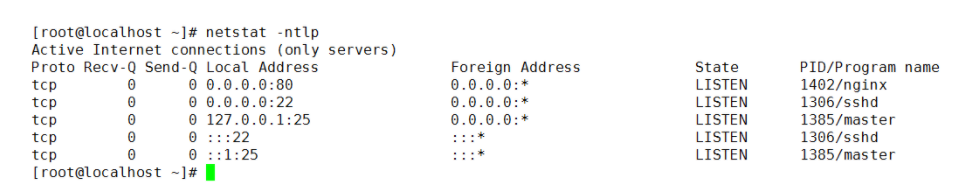
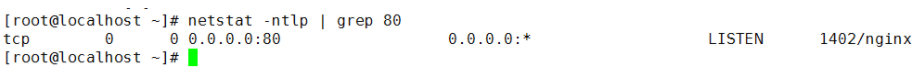
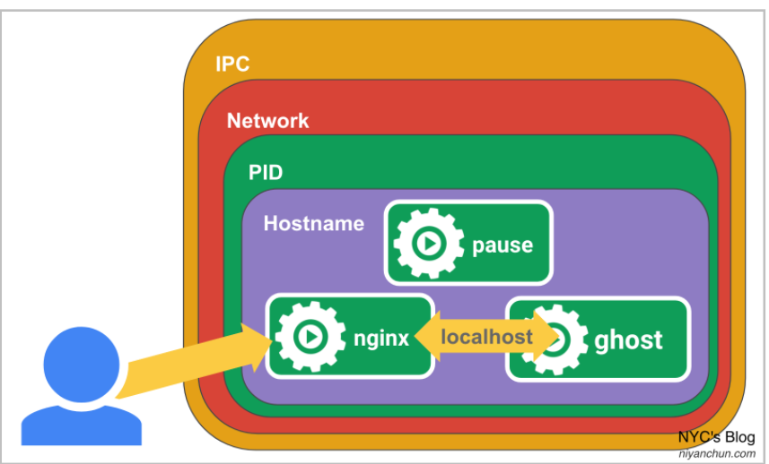
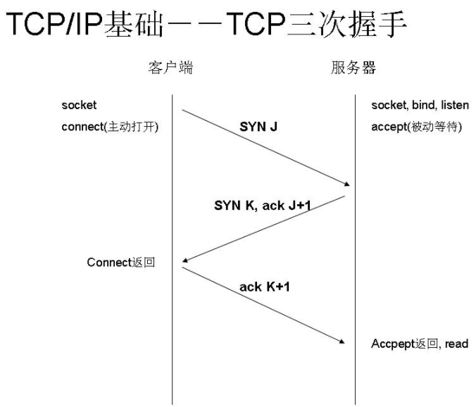
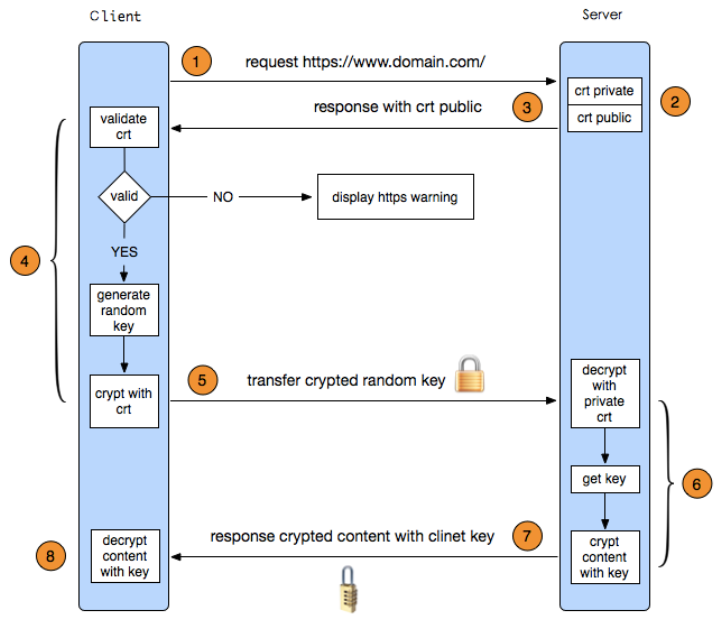

# **1、Microsoft Interview2021**

* Netstat 查看的状态
* pause容器的秘密
* HTTP and HTTPS 的握手过程
* k8s创建service的过程
* StatefulSet和Deployment的区别
* **Docker 挂载点 和 存储驱动**


## **1. Netstat 查看的状态**

netstat命令各个参数说明如下：

```
-a   或–all                             显示所有连线中的Socket。
-A                                       <网络类型>或–<网络类型> 列出该网络类型连线中的相关地址。
-c   或–continuous               持续列出网络状态。
-C 或–cache                       显示路由器配置的快取信息。
-e  或–extend                     显示网络其他相关信息。
-F  或 –fib                          显示FIB。
-g  或–groups                     显示多重广播功能群组组员名单。
-h  或–help                        在线帮助。
-i   或–interfaces                 显示网络界面信息表单。
-l  或–listening                    显示监控中的服务器的Socket。
-M   或–masquerade           显示伪装的网络连线。
-n  或–numeric                   直接使用IP地址，而不通过域名服务器。
-N   或–netlink或–symbolic  显示网络硬件外围设备的符号连接名称。
-o  或–timers                      显示计时器。
-p   或–programs                显示正在使用Socket的程序识别码和程序名称。
-r  或–route                        显示 Routing Table。
-s  或–statistice 显示网络工作信息统计表。
-t  或–tcp 显示TCP 传输协议的连线状况。
-u或–udp 显示UDP传输协议的连线状况。
-v或–verbose 显示指令执行过程。
-V 或–version 显示版本信息。
-w或–raw 显示RAW传输协议的连线状况。
-x或–unix 此参数的效果和指定”-A unix”参数相同。
–ip或–inet 此参数的效果和指定”-A inet”参数相同。
```

即可显示当前服务器上所有端口及进程服务，于grep结合可查看某个具体端口及服务情况：


```
[root@localhost ~]# netstat -ntlp   //查看当前所有tcp端口·

[root@localhost ~]# netstat -ntulp |grep 80   //查看所有80端口使用情况·

[root@localhost ~]# netstat -an | grep 3306   //查看所有3306端口使用情况·
 
[root@localhost ~]# netstat -nlp |grep LISTEN   //查看当前所有监听端口·
```

查看当前所有tcp端口使用情况：



这里解释一下：

1. `0.0.0.0`代表本机上可用的任意地址。 比如`0.0.0.0:135` **表示本机上所有地址的135端口，这样多ip计算机就不用重复显示了**。
2. **`TCP 0.0.0.0:80`表示在所有的可用接口上监听TCP80端口**
3. `0.0.0.0`为默认路由，即要到达不再路由表里面的网段的包都走0.0.0.0这条规则

然后127.0.0.1就是表示你本机ip地址的意思了。

然后`[::]:21`这又是什么鬼？

这个表示ipv6的21号端口的意思。

还有UDP的外部链接怎么都是`*:*`呢？

`*：*`是网址的通配符，就是`192.168.15.12`，这个类型的整体描述。

解释一下状态（state）了


### State

* LISTEN：(Listening for a connection.)  **侦听来自远方的TCP端口的连接请求**
* SYN-SENT：(Active; sent SYN. Waiting for a matching connection request after having sent a connection request.)  **再发送连接请求后等待匹配的连接请求**
* SYN-RECEIVED：(Sent and received SYN. Waiting for a confirming connection request acknowledgment after having both received and sent connection requests.)**再收到和发送一个连接请求后等待对方对连接请求的确认**
* ESTABLISHED：(Connection established.)**代表一个打开的连接**
* FIN-WAIT-1：(Closed; sent FIN.)等待远程TCP连接中断请求，或先前的连接中断请求的确认
* FIN-WAIT-2：(Closed; FIN is acknowledged; awaiting FIN.)从远程TCP等待连接中断请求
* CLOSE-WAIT：(Received FIN; waiting to receive CLOSE.)等待从本地用户发来的连接中断请求
* **CLOSING：(Closed; exchanged FIN; waiting for FIN.)等待远程TCP对连接中断的确认**
* LAST-ACK：(Received FIN and CLOSE; waiting for FIN ACK.)等待原来的发向远程TCP的连接中断请求的确认
* TIME-WAIT：(In 2 MSL (twice the maximum segment length) quiet wait after close. )等待足够的时间以确保远程TCP接收到连接中断请求的确认
* **CLOSED：(Connection is closed.)没有任何连接状态**

例如要查看当前Mysql默认端口80是否启动可以做如下操作




`netstat -ano`来显示协议统计信息和TCP/IP网络连接


`netstat -t/-u/-l/-r/-n`【**显示网络相关信息,-t:TCP协议,-u:UDP协议,-l:监听,-r:路由,-n:显示IP地址和端口号】**


* `netstat -tlun`【查看本机监听的端口】
* `netstat -an`【查看本机所有的网络】
* `netstat -rn`【查看本机路由表】
* 列出所有端口：`netstat -a` 
* 列出所有的TCP端口：`netstat -at` 
* 列出所有的UDP端口：`netstat -au` 
* 列出所有处于监听状态的socket：`netstat -l` 
* 列出所有监听TCP端口的socket：`netstat -lt` 
* 列出所有监听UDP端口的socket：`netstat -lu` 
* 找出程序运行的端口：`netstat -ap | grep ssh` 
* 找出运行在指定端口的进程：`netstat -an | grep ‘:80’`

几个有用查找：

```
1.查找请求数前20个IP（常用于查找攻来源）：
netstat -anlp|grep 80|grep tcp|awk '{print $5}'|awk -F: '{print $1}'|sort|uniq -c|sort -nr|head -n20
 
netstat -ant |awk '/:80/{split($5,ip,”:”);++A[ip[1]]}END{for(i in A) print A[i],i}' |sort -rn|head -n20
 
2.用tcpdump嗅探80端口的访问看看谁最高
tcpdump -i eth0 -tnn dst port 80 -c 1000 | awk -F”.” '{print $1″.”$2″.”$3″.”$4}' | sort | uniq -c | sort -nr |head -20
 
3.查找较多time_wait连接
netstat -n|grep TIME_WAIT|awk '{print $5}'|sort|uniq -c|sort -rn|head -n20
 
4.找查较多的SYN连接
netstat -an | grep SYN | awk '{print $5}' | awk -F: '{print $1}' | sort | uniq -c | sort -nr | more
 
5.根据端口列进程
netstat -ntlp | grep 80 | awk '{print $7}' | cut -d/ -f1
```

## **2、pause容器的秘密**

* 高度耦合的容器间的通信问题
* Pod与Pod之间的通信
* Pod和Service之间的通信
* 外部系统和Service之间的通信

**秘密就在Pause容器。K8s的pause容器有两大作用：**

* **它作为Pod内的“系统容器”，提供一个基础的Linux Namespace，以供其它用户容器加入**。
* **如果开启了PID Namespace共享的话，它还作为Pod的“init进程”（pid=1，也即所有其它容器的父容器，所有其它进程的父进程），负责僵尸进程的回收**。

### **2-1 功能1：共享Namespace**

在Linux系统中，当我们创建一个新的子进程的时候，该进程就会继承父进程的Namespace，K8s的Pod就是模拟这种方式。

**创建Pod时，里面第一个被创建的容器永远都是pause容器（只不过是系统自动创建的），pause容器创建好之后，才会创建用户容器。**

**系统（CRI和CNI）会为pause容器创建好Namespace，后面的用户容器都加入pause的Namespace，这样大家就处于同一个Namespace了**，类似于大家都在一个“虚拟机”里面部署。对于网络而言，**就是共享Network Namespace了**。下面用docker模拟一下k8s的Pod过程。

**第一步：模拟创建Pod的“系统容器”pause容器。**

```
$ docker run -d --name pause -p 8080:80  --ipc=shareable  registry.aliyuncs.com/k8sxio/pause:3.2
184cfffc577e032902a293bf1848f6353bd8a335f57d6b20625b96ebca8dfaa0


$ docker ps -l
CONTAINER ID        IMAGE                                    COMMAND             CREATED             STATUS              PORTS                  NAMES
184cfffc577e        registry.aliyuncs.com/k8sxio/pause:3.2   "/pause"            13 seconds ago      Up 11 seconds       0.0.0.0:8080->80/tcp   pause
```

**这里的操作就是创建一个docker容器，并将容器内的80端口映射到外部的8080端口。需要注意的是为了让其他容器可以共享该容器的`IPC Namespace`，需要增加`--ipc=shareable`。**

**第二步：创建“用户容器” nginx。nginx默认是监听80端口的，先创建一个配置`nginx.conf`：**

```
error_log stderr;
events { worker_connections  1024; }
http {
    access_log /dev/stdout combined;
    server {
         listen 80 default_server;
         server_name example.com www.example.com;
         location / {
             proxy_pass http://127.0.0.1:2368;
         }
     }
}
```

**配置非常简单，将所有请求转发到`127.0.0.1:2368`。然后启动nginx容器，不过该容器共享pause容器的Namespace，而不是像docker默认行为那样创建自己的`Namespace`：**

```
➜ ~ docker run -d --name nginx -v `pwd`/nginx.conf:/etc/nginx/nginx.conf --net=container:pause --ipc=container:pause --pid=container:pause nginx
660af561bc2d5936b3da727067ac30663780c5f7f73efe288b5838a5044c1331


➜  nginx docker ps -l
CONTAINER ID        IMAGE               COMMAND                  CREATED             STATUS              PORTS               NAMES
660af561bc2d        nginx               "/docker-entrypoint.…"   4 seconds ago       Up 3 seconds                            nginx
```
此时，curl一下本机的8080（也就是pause容器的80）端口，就可以看到以下信息：

```
➜  ~ curl 127.0.0.1:8080
<html>
<head><title>502 Bad Gateway</title></head>
<body>
<center><h1>502 Bad Gateway</h1></center>
<hr><center>nginx/1.19.6</center>
</body>
</html>
```

**<mark>也就是说pause容器的80端口上面是nginx服务，这是因为它们都处于一个`Network Namespace`。这里报502是因为我们再nginx配置里面配了所有请求都转发到2368端口，但这个端口没有服务监听。</mark>**


**第三步：再创建一个“用户容器” ghost（一个博客系统，默认监听2368端口）：**

```
➜  ~ docker run -d --name ghost --net=container:nginx --ipc=container:nginx --pid=container:nginx ghost
b455cb94dcec8a1896e55fc3ee9ac1133ba9f44440311a986a036efe09eb9227
➜  ~ docker ps -l
CONTAINER ID        IMAGE               COMMAND                  CREATED             STATUS              PORTS               NAMES
b455cb94dcec        ghost               "docker-entrypoint.s…"   4 seconds ago       Up 3 seconds                            ghost
```

容器启动后，我们直接在浏览器访问本机的8080端口，就可以看到ghost的web页面了：

此时，高度耦合的两个容器nginx+ghost就在一个Namespace里面了，特别是处于同一个Network Namespace（可以通过127.0.0.1相互访问），让他们的通信变得极其方便。如果再加上pause容器，那他们3个就是k8s里面的一个Pod了。





好，最后总结一下，当我们在k8s里面创建容器时，CRI（容器运行时，比如docker）和CNI（容器网络接口，负责容器网络）首先创建好pause容器这个系统容器，这就包含创建并初始化各种Namespace（Network Namespace部分由CNI负责）。之后再创建用户容器，用户容器加入pause的Namespace。其中Network Namespace是默认就共享的，PID Namespace则需要看配置。

## **3. HTTP and HTTPS 的握手过程**

### **3-1 HTTP三次握手**

HTTP（HyperText Transfer Protocol)超文本传输协议是互联网上应用最为广泛的一种网络协议。由于信息是明文传输，所以被认为是不安全的。**而关于HTTP的三次握手，其实就是使用三次TCP握手确认建立一个HTTP连接**。

如下图所示，SYN（synchronous）是TCP/IP建立连接时使用的握手信号、Sequence number（序列号）、Acknowledge number（确认号码），三个箭头指向就代表三次握手，完成三次握手，客户端与服务器开始传送数据。



* 第一次握手：客户端发送syn包(syn=j)到服务器，并进入`SYN_SEND`状态，等待服务器确认；
* 第二次握手：服务器收到syn包，必须确认客户的`SYN（ack=j+1`），同时自己也发送一个`SYN`包（syn=k），即`SYN+ACK`包，此时服务器进入`SYN_RECV`状态；
* 第三次握手：客户端收到服务器的`SYN＋ACK`包，向服务器发送确认包`ACK(ack=k+1)`，此包发送完毕，**客户端和服务器进入`ESTABLISHED`状态，完成三次握手**。

### **3-2 HTTPS握手过程**

HTTPS在HTTP的基础上加入了SSL协议，SSL依靠证书来验证服务器的身份，并为浏览器和服务器之间的通信加密。具体是如何进行加密，解密，验证的，且看下图，下面的称为一次握手。



1. **客户端发起HTTPS请求**
2. **服务端的配置**
	* 采用HTTPS协议的服务器必须要有一套数字证书，可以是自己制作或者CA证书。
	* **区别就是自己颁发的证书需要客户端验证通过，才可以继续访问**，
	* 而使用CA证书则不会弹出提示页面。这套证书其实就是一对公钥和私钥。
	* 公钥给别人加密使用，私钥给自己解密使用。
3. **传送证书**
	* **这个证书其实就是公钥，只是包含了很多信息，如证书的颁发机构，过期时间等**。
4. **客户端解析证书**
	*  <mark>这部分工作是有客户端的TLS来完成的</mark>，
		* 首先会验证公钥是否有效，比如颁发机构，过期时间等，
		* 如果发现异常，则会弹出一个警告框，提示证书存在问题。
		* 如果证书没有问题，那么就生成一个随即值，然后用证书对该随机值进行加密。
5. **传送加密信息**
	* **这部分传送的是用证书加密后的随机值，目的就是让服务端得到这个随机值**，以后客户端和服务端的通信就可以通过这个随机值来进行加密解密了。
6. **服务段解密信息**
	* 服务端用私钥解密后，得到了客户端传过来的随机值(私钥)，然后把内容通过该值进行对称加密。
	* **所谓对称加密就是，将信息和私钥通过某种算法混合在一起，这样除非知道私钥，不然无法获取内容，而正好客户端和服务端都知道这个私钥，所以只要加密算法够彪悍，私钥够复杂，数据就够安全。**
7. **传输加密后的信息**
	* 这部分信息是服务段用私钥加密后的信息，可以在客户端被还原。
8. 客户端解密信息
	* **客户端用之前生成的私钥解密服务段传过来的信息，于是获取了解密后的内容**。

### **3-3 HTTPS和HTTP的区别**

1. https协议需要到ca申请证书或自制证书。
2. http的信息是明文传输，https则是具有安全性的ssl加密。
3. http是直接与TCP进行数据传输，而https是经过一层SSL（OSI表示层），用的端口也不一样，前者是80（需要国内备案），后者是443。
4. http的连接很简单，是无状态的；HTTPS协议是由SSL+HTTP协议构建的可进行加密传输、身份认证的网络协议，比http协议安全。


**注意https加密是在传输层**

https报文在被包装成tcp报文的时候完成加密的过程，无论是https的header域也好，body域也罢都是会被加密的。

当使用**tcpdump或者wireshark之类的tcp层工具抓包，获取是加密的内容，而如果用应用层抓包，使用Charels(Mac)、Fildder(Windows)抓包工具，那当然看到是明文的**。

HTTPS一般使用的加密与HASH算法如下：

非对称加密算法：RSA，DSA/DSS

对称加密算法：AES，RC4，3DES

HASH算法：MD5，SHA1，SHA256

## **4、k8s创建service的过程**

* 通过kubectl提交一个pod的service创建请求
* **<mark>`Controller Manager`会通过对应的`Label`标签查询到相关的`pod`实例，生成`Serveice`的`Endpoints`信息，并通过`API server`写入到`etcd`键值库中</mark>**
* **`Worker Node`节点上的`kube proxy`通过`API server`查询并监听`service`对象与其对应的`Endpoints`信息(服务发现)**，创建一个类似负载均衡器实现Service访问到后端Pod的流量

## **5、StatefulSet和Deployment的区别**

“Deployment用于部署无状态服务，StatefulSet用来部署有状态服务”。

**5-1 无状态的应用**

* **pod之间没有顺序**
* **所有pod共享存储**
* **pod名字包含随机数字**
* **service都有ClusterIP,可以负载均衡**

**5-2 有状态的应用**

* 部署、扩展、更新、删除都要有顺序
* **每个pod都有自己存储，所以都用`volumeClaimTemplates`，为每个pod都生成一个自己的存储，保存自己的状态**
* **pod名字始终是固定的**
* <mark>**service没有`ClusterIP`，是`headlessservice`，所以无法负载均衡，返回的都是pod名，所以pod名字都必须固定**，
	* **StatefulSet在Headless Service的基础上又为StatefulSet控制的每个Pod副本创建了一个DNS域名:`$(podname).(headless server name).namespace.svc.cluster.local`**

	
## **6、Docker 挂载点**

虽然我们已经通过 Linux 的命名空间解决了进程和网络隔离的问题，在 Docker 进程中我们已经没有办法访问宿主机器上的其他进程并且限制了网络的访问，

**<mark>但是 `Docker` 容器中的进程仍然能够访问或者修改宿主机器上的其他目录，这是我们不希望看到的。</mark>**

* 在新的进程中创建隔离的挂载点命名空间需要在<mark> `clone` 函数中传入 `CLONE_NEWNS`，这样**子进程就能得到父进程挂载点的拷贝，如果不传入这个参数子进程对文件系统的读写都会同步回父进程以及整个主机的文件系统**<mark>。

**如果一个容器需要启动，那么它一定需要提供一个根文件系统（`rootfs`），容器需要使用这个文件系统来创建一个新的进程，所有二进制的执行都必须在这个根文件系统中。**