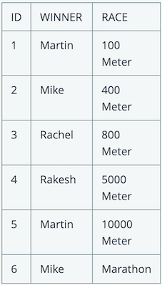
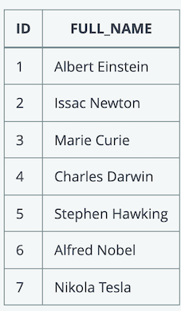

# **3 UBS interview**

## **Database & SQL** 

### 1. SQL Datatypes 

Which of the below is **NOT** data type in a SQL database? 

* DATE 
* NUMBER 
* VARCHAR2 
* **STRING** 


**varchar => string(not exist)**


#### 2. SQL joins 

Which of the following JOINs are valid in SQL statements? 


* **LEFT JOIN**
* BOTH JOIN 
* **RIGHT JOIN**
* **FULL JOIN** 
* CROSS JOIN 
* MIX JOIN 
* JOIN 
* **SELF JOIN** 


### 3. SQL DELETE 

Which of the following are correct statements about DELETE? 

* Remove the blocks in database 
* Rollback is not allowed after DELETE 
* Delete entire database 
* Remove column(s) from a table and then commit or rollback 
* **Remove row(s) from a table and then commit or rollback** 


### 4. SQL Select 

Here is EMPLOYEE table 

```
Name 
Annie 
Bob
Callie 
Derek 
```

which of these queries will display the complete contents of the table? 
 

* **Select name from employee** 
* Select name 
* **Select * from employee** 
* Select employee 

 
### 5. SQL equi-joins 

Select all correct answers if the query is equi-join? 

* select * from TABLE1 t1 where t1.id >= 2 
* **select * from TABLE1 t1, TABLE2 t2 where t1.id = t2.id** 
* select * from TABLE1 t1 where t1.id = 2 and t1.id = 45 
* **select * from TABLE2 t2 join TABLE1 t1 on t1.id = t2.id**

```
SELECT column_list 
FROM table1, table2....
WHERE table1.column_name =
table2.column_name; 
```
```
SELECT *
FROM table1 
JOIN table2
[ON (join_condition)]
```


### **6. SQL syntax**

In which sequence need the following elements of an simple SQL query which is not joining tables be? 

1. ORDER BY 
2. GROUP BY 
3. SELECT 
4. WHERE 
5. FROM 
6. HAVING 

* SELECT, HAVING, FROM, WHERE, GROUP BY, ORDER BY 
* SELECT, FROM, WHERE, HAVING, GROUP BY, ORDER BY 
* SELECT, FROM, WHERE, HAVING, ORDER BY, GROUP BY 
* SELECT, FROM, HAVING, WHERE, ORDER BY, GROUP BY 
* **SELECT, FROM, WHERE, GROUP BY, HAVING, ORDER BY**


###  **7. SQL syntax**




Which are the correct SQL statements to extract the names of those who have **at least once won a race**? 

* select winner from races 
* **select distinct winner from races** 
* select unique winner from races 
* select winner from races having winner = UNIQUE 


**8. SQL remove data**

Which of the following SQL statements will delete all rows in a table **without deleting the table? **

* **DELETE FROM table_name;** 
* DELETE TABLE table_name; 
* DROP TABLE table_name;      [删除表结构]  
* **TRUNCATE table_name;**    [清空表结构] 


**9. SQL Trigger**

Is it possible to create trigger on views? 

* **Yes** 
* No 

**10. SQL Trigger**

What are the difference between Trigger and Stored Procedure? Choose which are correct only 

* Trigger is run automatically if the event is occured but Stored Procedure don't run automatically but you have to run it manually 
* Trigger execute implicitly whereas store procedure execute via procedure call from another block. 
* Within a Stored Procedure you can call specific trigger but within a Trigger you cannot call Stored Procedure 
* We can call a stored procedure from front end (.asp files, .aspx files, .ascx files etc.) but we can't call a trigger from these files. 
* **Stored procedure can take the input parameters, but we can't pass the parameters as an input to a trigger**


### **11. SQL Query one table 1**

A table called "CONSULTANT" is populated with below records.



Which of the following query returns the full name of the consultants whose name starts with "A"? 

> Pick ONE option 

* `select ID from CONSULTANT where FULL_NAME ='%A'` 
* `select FIRST_NAME from CONSULTANT where ID = '%A'`
* `select * from CONSULTANT where FULL_NAME = '%A%'` 
* **`select FULL_NAME from CONSULTANT where FULL_NAME like 'A%'`** 
* `select FULL_NAME from CONSULTANT where FULL_NAME = 'A%'` 
* `select ID from CONSULTANT where FULL_NAME = 'A*'` 
* `select ID from CONSULTANT where FULL_NAME matches 'A.*'` 
* `select ID from CONSULTANT where FULL_NAME like 'A*'` 


### **12 SQL Primary Key**


Which is/are correct statements about primary key of a table? 

> Pick ONE OR MORE options 

* Primary keys can contain NULL values
* **Primary keys cannot contain NULL values.**
* **A table can have only one primary key** 
* A table can have multiple primary keys with single or multiple fields 
* None of the above 

> **Primary keys must contain unique values**. 
> 
> **A primary key column cannot have NULL values**. 
> 
> **A table can have only one primary key, which may consist of single or multiple fields.** 
> 
> **When multiple fields are used as a primary key, they are called a composite key**.


### **13. SQL Primary Key** 

Which statements are **WRONG** about PRIMARY KEY constraint in SQL? 

> Pick ONE option 

* The PRIMARY KEY uniquely identifies each record in a SQL database table 
* Primary key can be made based on multiple columns 
* **Primary key must be made of a single column** 
* Primary keys must contain unique values. 
* None of the above 

### **14. SQL Data Manipulate Language** 

Which of the following is considered DML (Data Manipulate Language)? 

> Pick ONE OR MORE options 

* SELECT 
* ALTER 
* CREATE 
* **INSERT**
* **UPDATE**

https://chao-xi.github.io/jxdatabasebook/db_ops/17ops_review/#dml

**`insert \ delete \ update`**

### **15. Primary Key**

Which is/are correct statements about primary key of a table? 

> Pick ONE OR MORE options 

* Primary keys can contain NULL values 
* **Primary keys cannot contain NULL values**. 
* **A table can have only one primary key with single or multiple fields** 
* A table can have multiple primary keys with single or multiple fields 

### **16 SQL Trigger** 

Which one is not a type of Trigger? 

> Pick **ONE** option 

* AFTER UPDATE Trigger 
* AFTFR INSERT Trigger
* AFTER DELETE Trigger 
* **AFTER ALERT Trigger** 

### **17. SQL Update**

Which of the following statements about the SQL UPDATE command are wrong? 

> Pick ONE option 

* If a WHERE clause is miccina in the ctAtPmpnt then all records will be updated. 
* **Only one record can be updated at a time using WHERE clause** 
* Multiple records can be updated at a time using WHERE clause 
* None of the above 


### **18 SQL Trigger**

When do we use triggers? 

> Pick **ONE** option 


* To maintain complex integrity constraints 
* **Auditing table information by recording the changes** 
* Signaling other program actions when changes are made to the table 
* Enforcing complex business rules 
* All above (a, b, c. d ) 

> Create an audit trail of activity in the database. ...
> 
> Implement a business rule. ...
> 
> Derive additional data that is not available within a table or within the database. ...
> 
> Enforce referential integrity.


## **Task Management**

### **1. problem management** 

Which Process is responsible for eliminating recurring incidents and minimizing the impact of incidents that cannot be prevented? 

> Pick ONE option 


* service level management 
* **problem management** 
* change management 
* event management 


### 2. Service Operations 

____ is an unplanned interruption to an IT Service or reduction in the quality of an IT service. 

> Pick ONE option 

* Event 
* Problem 
* **Incident** 
* Error 


### **3. Timeline** 

In ITIL, the mutually agreed timeline between two internal teams for completing a task is known as 

> Pick ONE option 

* SLA 
* PLA 
* **OLA** 
* None of the above 

The main difference between OLAs and SLAs is that they represent different commitments: 

* The SLA underscores a commitment to the client/customer. 
* **The OLA highlights the commitment to internal groups within the organization.**


### **4. event management**

You are in the process of setting up a monitoring solution for your infrastructure. A server is currently running with only 10% of disk space . What classification do you think the monitoring system should ideally assign to the current situation? 

> Pick ONE option  

* An Incident 
* An Event 
* A Major Incident 
* **A Problem** 


### **5. Event Managament**

"Any detectable or discernible occurrence that has significance for the management of IT Infrastructure or the delivery of IT service" . 

Which of the below ITIL terms implies this statement? 

> Pick ONE option 

* An Incident 
* An Warning 
* **An Event** 
* A Change 

### **6. Incident Priority**

**Incident Priority = ______ * _____**

> Pick ONE OR MORE options 
 
* **Urgency** 
* Importance 
* **Impact** 
* Number of users affected 


### **7. priority** 

Which of the following is most significant in determining the priority of an Incident? 

> Pick ONE option 

* **The impact on the business and how quickly the business needs a resolution** 
* The ease and speed of implementing the fix 
* The seniority of the person logging the Incident 
* The ability of the Service Desk to rectify the Incident without referral to specialist support groups 


### **9. Urgent change**

In case of emergency, we can change data in production immediately with the approval from senior collegues. 

> Pick ONE option 

* Yes, as they are more experienced 
* **No, It requires a change and it should be done after CAB approval** 
* Yes, but with approvals for an emergency change from the ECR sponsor 


### **10. Event and Incident Management**

"All events are incidents, but not all incidents are events" 

What is your response to the above statement? 

> Pick ONE option 

* Yes 
* **No** 
* Sometime 
* None of the above 


## **Linux**

### **1 reboot time**

Complete the blanks in the following question with the appropriate answer. 

Write below a basic command that can be used to find the last reboot time of a unix server. 

* `who -b` 
* `last reboot`
* `uptime`

### **2 last 10 line** 

Complete the blanks in the following question with the appropriate answer. 

Write below the basic command that can be used to find the last 10 lines of a file in UNIX. 

`tail -10`


### **3 shell script**

You are using a BASH or KORN shell, i.e. not a CSH. 

* export A=10 
* export B=20 
* export C=30 
* echo `echo $A` + $(echo $B) 

What is the output of the above sequence of commands? 

> Pick ONE option 

* 30 
* 20 + 10 
* **10 + 20** 
* >
* a syntax error 
* None of the above 


### **4 copy files** 

In Unix, which of the following commands is used to copy all the files that have the string chap and any two other characters to the progs directory? 

> Pick ONE option 

* **`cp chap?? progs`** 
* `cp chap* progs` 
* `cp chap[1 2] /progs/*.*`
* `cp chap?? /progs/*` 


### **5 killing a job** 

What are the command (s) that can be used to surely kill a process ID in UNIX? 

> Pick ONE OR MORE options 

* **kill -9** 
* terminate -9 
* stop -9 
* **kill -kill** 
* kill -SIGkill 


### **6 house keeping**

Which one of the below command can be used to delete log files from a folder older than 30 days? 

> Pick ONE OR MORE options 

* **`find . -type f -name "*.log"  -mtime +30  -exec rm{}\;`** 
* `find . -type f -name "*.log" -mtime -30 -exec rm{}\; `
* `find . -type f -name "*.log" -mtime -30 | xargs rm` 
* **`find . -type f -name "*.log" -mtime +30 | xargs rm`** 
* `find . -type f -name "*.log" -mtime +30 -exec rm -i {}\; `


### **7 Default Environment Variables in Bash**

Which file contains the default environment variables when using the bash shell? 

> Pick ONE option 

* **`~/.profile`**
* `~/.bash` 
* `/etc/profile.d` 
* `/bash` 

### **8 pattern matching** 

In Unix, which of the following symbols is used with the grep command to match the pattern pat at the beginning of a line? 

> Pick ONE option 

* **`^pat`** 
* `$pat` 
* `pat$` 
* `pat^ `


### **9 datetime** 

Complete the blanks in the following question with the appropriate answer. The command used to display the current date and timezone in UNIX? 

**date**


### **10. Memory usage**

Complete the blanks in the following question with the appropriate answer. 

Name any basic command that can be used to find the available memory in a unix server 

**`free -m`**


### **11. shell script execution**

In Unix, let's say that you create a file `my_custom_command` with the following command as content 

`echo my custom command`

What would happen if you execute the file `my_custom_command`? 

> Pick ONE option 

* **The message "my custom command" is displayed** 
* The message "my custom command" is displayed only if the execute permission of the file '`my_custom_command`' is set. 
* The message "my" is displayed 
* The message "my" is displayed only if the execute permission of the file '`my_custom_command`' is set. 

### **12 Filename of the current script.** 

In Unix, which of the following statements shows the file name of the script being executed currently? 

> Pick ONE option 

* `echo $# `
* `echo $$` 
* **`echo $0`** 
* `echo $?` 

*  `$#` is the number of positional parameters passed to the script, shell, or shell function
*  **The `$?` variable represents the exit status of the previous command**.
* `echo $0` it can be used to display the name of the current shell.
* **The `$$` variable is the PID (Process IDentifier) of the currently running shell**.
* `$_` is another special bash parameter and used to reference the absolute file name of the shell or bash script which is being executed as specified in the argument list


### **13 Exit status**

In Unix, which of the following statements shows the exit status of the last executed command? 

> Pick ONE option 

* echo $# 
* echo $$ 
* echo $_ 
* **echo $?** 


### **14 Command Substitution** 
Using command substitution, how would you display the value of the present working directory? 
Pick ONE option 

* **echo $(pwd)** 
* echo pwd 
* $pwd 
* pwd | echo 


### **15 selective searching** 

What command and option we can use to display 5 lines above and 5 lines below an exception we are interested to search in a log file? 

> Pick ONE option 

* `grep +5 <pattern> file name` 
* `grep +5 -5 <pattern> file name` 
* **`grep -A 5 -B 5 <pattern> file name`** 
* `grep <pattern> file name head +5 tail -5` 


### **16  managing processes** 

When you press and hold the Ctrl key and another key a the UNIX process in the foreground will be stopped but not terminated. Which is the second key you need to press? 

> Pick ONE option 

* a
* c
* **z**
* v

### **17 space in a file system** 

Complete the blanks in the following question with the appropriate answer. 

Write a basic command that can be used to find the available space in a file system in UNIX? 

**`df -h`**


## Windows


### **1 Windows** 

A windows server has restarted unexpectedly. The log events records of the system can be checked under: 

> Pick ONE option 

* services.msc 
* Task Manager 
* system.msc 
* **Event Viewer** 


> Event Viewer is a component of Microsoft's Windows NT operating system that lets administrators and users view the event logs on a local or remote machine.

### **2 Windows** 

Which of the following desktop tool can be used to connect remotely to a Windows server? 

> Pick ONE option 

* **Remote Desktop Connection** 
* services.msc 
* Task manager 
* None of the above 


### **3 Windows** 

SSH can be used in only  

> Pick ONE option 

* unix-like operating systems
* windows 
* **Both of the above** 
* None of the above 


### 4 Windows 

In a command prompt, which command displays the short names of the files in the current directory? 

> Pick ONE option 

* **`dir /X`** 
* ls
* dir /S 
* None of the above 


### 5 Windows 

To restart IIS service on Windows webserver, the following command can be executed Please select the 2 correct options 

> Pick ONE OR MORE options 

* iisreset /start 
* iisrecycle 
* **iisreset /restart** 
* **iisreset** 

### **6 Windows** 

Which command can be used to check the IP address on a windows server? 

> Pick ONE OR MORE options 


* **ipconfig** 
* ping 
* **ipconfig /all** 
* tracert 


### On a windows webserver, IIS stands for 

> Pick ONE option 

* Indian Information Service 
* Immunization information system 
* **Internet Information Services** 
* inter-IC Sound 


### Windows 

An Active Directory is: 

> Pick ONE option 

* the protocol used for services authentication 
* Uthe current folder 
* **the directory service database to store the organizational based data,policy,authentication** 
* None of the above 

### Windows 

What command would you use to do a reverse DNS lookup? 

> Pick ONE option 

* host 
* ping 
* **nslookup** 
* ipconfig 

### Windows 

Which of the following method enable you to create a shared network folder? 

> Pick ONE OR MORE options 

* Right-click a folder in either My Computer or Windows Explorer, select Sharing And Security, click the option button Share This Folder, and click OK. 
* **Right-click a folder in either My Computer or Windows Explorer, select ies, click the Sharing tab, click the option button Share This Folder, and click OK.** 
* Open the Computer Management Console, expand Shared Folders, right-click the Shares node, and click New File Share. Follow the onscreen instructions for the Create Shared Folder Wizard. 
* Open a command prompt window. Type "Net Share `share_name=x:folder_name`", where share_name represents the name you want to assign to the shared folder, x: represents the drive letter where the folder resides, and `folder_name` represents the actual name of the folder. 
* All of the above 

## Autosys

### Autosys

A ... is to starts a process that will check the presence of a particular file in the operating system. It is the same as a command job. When this OS file does not increase in size, the file watcher job executes completely 

> Pick ONE option 

* Command job
* **File watcher job**  
* Box job 

### ON ICE 

Keeping a job ON ICE helps to skip the dependency on it. Is this a correct statement? 

> Pick ONE option 

* True 
* **False** 

### ON HOLD 

Keeping a job ON HOLD helps to skip the dependency on it. Is this a correct statement? 

> Pick ONE option 

* **True** 
* False 


> Job on ice :  Dependant job will run, In fact we can call Job on ice as a SUCCESS condition.


>Job on Hold : Dependant job wont run...


## Automation

### Automation 

Scheduled automations cannot be triggered based on conditions (e.g., Trigger automation only when an alert is generated or a ticket is created) 

> Pick ONE option 

* TRUE 
* FALSE 

### Automation 

Which option below is not an example of screen Scraping in Automation 

Pick ONE option 

* Extracting data from a web page 
* Extracting data from a desktop based application 
* **Extracting Data from a Data base** 
* Data entry via web page 


### Automation 

Automation enables __

> Pick ONE option 


* cost based on reduction
* None of the option 
* Reduces delivery risk 
* **All of the options** 
* Easy integration


## Big data

### Big Data 

The type of data Hadoop can deal with is 

Pick ONE option 

* Structured  
* Semi-structured 
* Unstructured 
* **All of the options** 


The V s of Big Data are 

Pick ONE option 

* Volume 
* Variety 
* Velocity 
* Veracity 
* All of the options 

### Big Data 

What are the must-have features for an automation tool? (Select all the applies) 

> Pick ONE option 

* Debugging and object identification
* Supports various frameworks 
* Should support all kinds of test environments 
* **A, B & C** 
* Only B & C 

### Big Data 

Which of the following focuses on discovery of (previously) unknown properties on the data 

> Pick ONE option 


* **Data Mining** 
* Big Data 
* Data Wrangling 
* Machine Learning 


### Automation 

List the benefits of using Automation (Please select the options which is **not appropriate**) 

> Pick ONE option

* Reduces Cost
* Increases Productivity 
* **Increase in complexities during implementation** 
* Eliminates Human errors 


