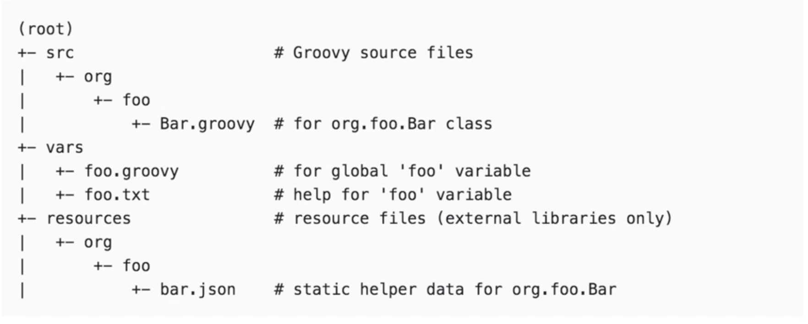

# Morgan Stanly 2021

## Jenkins

### Jenkins Shared Library

* 在pipene中定义函数
* Jenkins 共享库

**Jenkins 共享库**

**在多个项目之间共享流水线有助于减少冗余并保持代码**。流水线支持创建 "共享库" ，可以在外部源代码控制仓库中定义并加载到现有的流水线中。

* `src`目录类似于标准Java源目录结构。执行流水线时，此目录将添加到类路径中。
* **`vars`目录托管脚本文件，这些脚本文件在“管道”中作为变量公开。**
* `resources`目录允许`libraryResource`从外部库中使用步骤来加载相关联的非 `Groovy`文件。



* `Class: bar.grooy`     类
* vars: `foo.groovy`, `foo.txt`   
* resource: `bar.json` stastic helper data for `bar.groovy`

**简单使用库**

标记Load的共享库隐含的允许管道立即使用任何此类库定义的类死全局变量。 要访问其他共享库， Jenkinsfile需要使用`@Library`注释，并指定库的名称

```
@Library('my-shared-library')  _
/* Using a version specifierk such as branch, tag, etc */ 

@Library('my-shared-library@<version>')  _

@Library('my-shared-library@1.0') _ 
/* Accessing multiple libraries with one statement */ 

@Library(['my-shared-library', 'otherlib@abc12341']) _ 
```
`_`： 代表引用

```
@Library('jenkinslib') _
def tools = new org.devops.tools()
```

**常用的共享库**

* 增加格式化输出方法 （ansiColor）
* 封装工具（mvn,  ant, gradle, npm)  `def build = new org.devops.buildtools()`
* gitlab sharedlibrary function: ( 封装HTTP请求, 更改提交状态)
* 邮件发送模板  Email(status,emailUser)
* 流水线进行自动化代码扫描   `SonarScan(projectName, projectDesc, projectPath)`
* Nexus方法 `GetGav() //获取POM中的坐标, NexusUpload(): Nexus plugin deploy
MavenUpload() mvn deploy， ArtifactUpdate(updateType,artifactUrl) //制品晋级
* nexusapi //封装HTTP  //获取仓库中所有组件 //获取单件组件 //获取组件信息
* Gitlab 
	*  `HttpReq(reqType,reqUrl,reqBody)`  //封装HTTP请求
	*  `UpdateRepoFile(projectId,filePath,fileContent)` //更新文件内容
	*  `GetRepoFile(projectId,filePath)` //  获取文件内容
	*  `CreateRepoFile(projectId,filePath,fileContent)`  //创建仓库文件
	*  `ChangeCommitStatus(projectId,commitSha,status)` //更改提交状态
	*  `GetProjectID(repoName='',projectName)`  //获取项目ID
	*  `DeleteBranch(projectId,branchName)` //删除分支
	*  `CreateBranch(projectId,refBranch,newBranch)`  //创建分支
	*  `CreateMr(projectId,sourceBranch,targetBranch,title,assigneeUser="")` // 创建合并请求
	*  `SearchProjectBranches(projectId,searchKey)` //搜索分支
	*  `AcceptMr(projectId,mergeId)` //允许合并
* Jmeter 接口测试生成报告
* 使用 Prometheus 监控 Jenkins

### Jenkins Secrets and Credential

* **添加凭证后，需要安装`"Credentials Binding Plugin"`插件，就可以在`pipeline`中使用`withCredentials` 步骤使用凭证了**。
	* **Secret text**: `withCredentials([string(credentialsId: 'secretText', variable: 'varName')]) `
	* **Usernarne with password**: `withCredentials([usernamePassword(credentialsId: ' ', usernameVariable: ' ', passwordVariable: '')])`
	* **Secret file**: `withCredentials([file(credentialsId: ' ', variable: ' ')])`
	* **SSH Username with private key**: `withCredentials([sshUserPrivateKey(  keyFileVariable:"key",  credentialsId : "private-key" )])`

**优雅地使用凭证**

* Secret text： `environment {   AWS_ACCESS_KEY_ID = credentials( 'aws-secret-key-id' )  } `
* Username with password: ``environment {   BITBUCKET_CREDS = credentials( 'jenkins-bitbucket-creds' ) }`
* Secret file： ` environment {  KNOWN_HOSTS = credentials('known_hosts') }` 
 
**凭证管理使用HashiCorp Vault**

* `vault write -address=${VAULT_ADDR} secret/hello value=world`
* **`def x = vault path: 'secret/hello', key: 'value' `**
* **`wrap([$class: 'MaskPasswordsBuildWrapper',  varMaskRegexes: [[regex: 'abc--.*']]  ] `**

### Jenkins Parallelism and Distributed 

```
parallel (
"stream 1" : { 
    node('linux') {  // runs on one of the nodes labelled as linux nodes
        build 'Job1'
    }
},
"stream 2" : {
    node('named_node_foo'){  // only runs on node named_foo_node
        build 'Job2'
    }
}
```


## Nas Storage

**NFS value**

* 立服务端数据目录,共享目录设置权限
* 关闭防火墙
* 安装配置 nfs   配置 `nfs`，`nfs` 的默认配置文件在 `/etc/exports` 文件下，在该文件中添加下面的配置信息：

```
$ sudo vi /etc/exports
/data/k8s  *(rw,sync,no_root_squash)
```

* `/data/k8s`：是共享的数据目录
* `*`：表示任何人都有权限连接，当然也可以是一个网段，一个 IP，也可以是域名
* `rw`：读写的权限
* `sync`：表示文件同时写入硬盘和内存
* `no_root_squash`：**当登录 NFS 主机使用共享目录的使用者是 root 时，其权限将被转换成为匿名使用者，通常它的 `UID` 与 `GID`，都会变成 `nobody` 身份**

**注意启动顺序，先启动 rpcbind**

```
$ sudo vi exports
$ sudo systemctl start rpcbind.service
$ sudo systemctl enable rpcbind
```

**然后启动 nfs 服务：**

```
$ sudo systemctl start nfs.service
$ sudo systemctl enable nfs
$ systemctl status nfs
```

## Haproxy

* **Load Balancing Algorithms**: 
	* Round Robin selects servers in turns. This is the default algorithm.
* **leastconn**
	* Selects the server with the least number of connections–it is recommended for longer sessions.
* **source**
	* This selects which server to use based on a hash of the source IP i.e. your user’s IP address. 
* static-rr / first / random 

**`server web1 10.10.10.10 weight 50`**

## Log 

### LogStash VS Fluentd


#### **Logstash Event Routing vs Fluentd Event Routing**

Logstash routes all data into a single stream and then uses algorithmic if-then statements to send them to the right destination. 

```
output {
if [loglevel] == "ERROR" and [deployment] == "production" {
pagerduty {
...
		}
	}
}
```

**Fluentd Event Routing**

Fluentd relies on tags to route events. Each Fluentd event has a tag that tells Fluentd where it wants to be route

```
<match production.error>
type pagerduty
…
</match>
```

```
<source>
  @type tail
  tag system.logs
  # ...
<source>
```

**then mark that tag in the area:**

```
<match {app.**,system.logs}>
```

**Fluentd’s approach is more declarative whereas Logstash’s method is procedural.**

* Therefore, programmers trained in procedural programming might see Logstash’s configuration as easier for getting started. 
* On the other hand, Fluentd’s tag-based routing allows complex routing to be expressed clearl

#### **Transport Comparison**

* Logstash: Needs to be deployed with Redis to ensure reliability
* Fluentd: Built-in reliability, but its configuration is more complicated

* **LogStash: limited to an on-memory queue that holds 20 events**.
* **Fluentd: highly configurable buffering system**.

#### **Performance Comparison**

* Logstash: Slightly more memory use. Use Elastic Beats for leaf machines.
* Fluentd: Slightly less memory use. Use Fluent Bit and Fluentd Forwarder for leaf machines.

#### **Performance**

Fluentd: slightly better reputation.

#### **Monitoring & Tuning**

* **LogStash: Metrics filter, can be visualized in 3rd party such as Graphite.**
* **Fluentd: built-in monitoring agent, plug-ins to integrate with your monitoring stack**.

### Jaeger

一个 Trace 的真实数据

```
{"duration":2065,"operationName":"/ping","parentSpanID":"0","process.serviceName":"negri.sidecarserverlistener.myapp","process.tags.hostname":"MacBook-Pro-3.local","process.tags.ip":"192.168.1.88","spanID":"5f1db306ef459b2f","startTime":1609241265147010,"tags.http.method":"GET","tags.http.status_code":"200","tags.http.url":"/ping","tags.peer.address":"http://127.0.0.1:8888","tags.span.kind":"server","traceID":"5f1db306ef459b2f"}
```


* 接口的运行时间 duration，
* 记录了服务名、
* TraceId、
* SpanId、
* ParentSpanId 等上面我们聊到的常用数据，

另外还记录了我们所需要的一些自定义数据，放在了 Tags 字段中。

链路追踪系统，通过收集程序中的打点日志的方式，通常为我们提供了以下功能。

* 排查根因：分析单次请求的调用链路，排查问题根因。
* 调用关系图：通过 Trace 中的服务信息，绘制服务调用关系图。
* 日志追踪：通过关联日志 RequestId，可以链接到日志系统，查看更详细的日志信息。


## Python modules

### **python basic modules**

**sys**

```
import sys
sys.path.append('/A/B/C')
```

**random / math / datetime / calendar / os** 

```
import os 
print(os.getcwd()
```

**Data Format Section**


```
import json
```

**Web Scrap**

```
from bs4 import BeautifulSoup
import requests


# Web Scraping with Requests-HTML
import time
from requests_html import HTMLSession
```

**Python Thread and Process**

```
import subprocess


import time
import threading

import requests
import time
import concurrent.futures
import os

import multiprocessing
import concurrent.futures
```

**psutil**

```
import psutil
print(psutil.cpu_count())  # CPU逻辑数量
>>> 8

print(psutil.cpu_count(logical=False)) # CPU物理核心
>>> 4
```

**re: re Module - How to Write and Match Regular Expressions (Regex)**

```
import re
```

**Generate Random Numbers and Data Using the random Module**

```
import random
```

**OS Module - Use Underlying Operating System Functionality**

```
import os 
```

**Zip Files - Creating and Extracting Zip Archives**

```
import zipfile
```