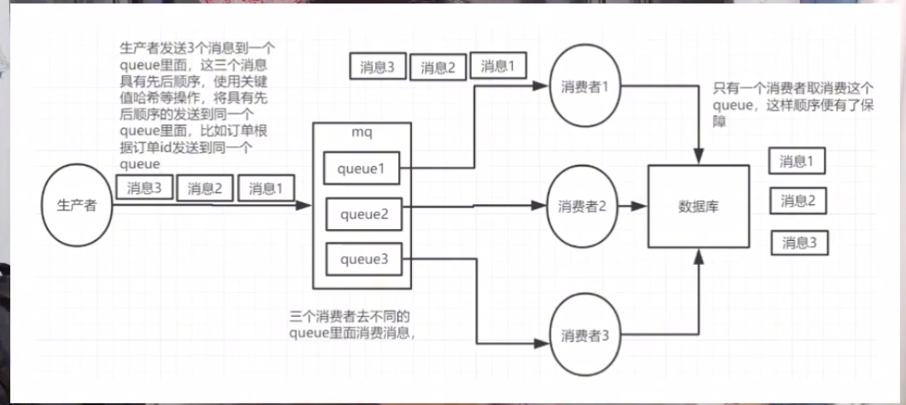

# 架构师面试合集

## **Redis 面试**

### **1 流量洪峰短时间访问量陡增**

* 服务器扛不住，服务器就容易出现这个性能瓶颈来不及响应

**解决方案**

1. 为了保障整个服务的不被流量洪峰所击垮，那我们在这个网关层呢就必须做一个流量的限制。此如说设置**命牌筒token bucket**的算法在规定的时间内, 允许一定量的这个流量的涌入， 剩余的这个请求需要依次排队。
	* 在用户手机端呢就是等待超时，稍后再试一些提示
	* 第二就是应用的崩溃

2. 抵挡不了那么大的流量并发，实际的并发量远远超过理论上的这个最高的并发量，而运维人员的扩容是需要时间响应或者呢没有上云服务的弹性扩容。 没有办法根据流量来动态的增加相应的机器来保障服务，就是抵挡不了流量洪峰，应用崩溃

3. 第三点就是数据库的性能瓶颈，数据库集群的读写分离。满足不了足够多的数据请求。要增加一些数据库的服务器。比如说增加缓存服务器，就是做一些提前的计算。
	* 用户只要一一有请求，服务器就能够立马响应。以空间换时间的这么一个做法
4. 第四点呢就是第三方数据接口的崩溃。健康码关联的很多的数据，关联服务的调用。如果第三方的这个数据接口扛不住这么大的这个并发请求就会导致调用的超时服务的不可用

### **2 必须要掌握的数据库优化技巧**

这三个数据库设计的要点必须掌握, 分别是**主从复制**,**读写分离**, **分库分表,** 就需要去考虑增加数据库服务器。

一般的这个业务系统, 都是读多写少。 一般都会采用一主多从的数据库架构，一个主库搭配多个从库，那主库负责写，从库负责读。在读写的时候，通过触发器来判定读还是写，这就是我们常说的读写分离

**读写分离**

就可以大大的提高了这个数据库的查询效率又可以降低单库读写带来的这个并发沖突. 多个数据库之间的数据同步怎么办? 主从同步的原理数据库灾难的恢复的原理是一致的. 都是通过日志, 将记录的所有的这个dml操作重新执行—遍. 比如说Mysql 那主库所有的增删改, 都会存储在这个binlog 中. 就可以把所有的这个数据库操作, 从库上面全部执行一遍, 这样就会轻松的解決数据同步的间题

**分库**

如何存储平台的这个大数据量,单个的这个关系数据库的容量是有限的无法存放全部的数据, 因此需要分而治之,  就是常说分库分表.  根据数据的种类不同,可以以建立多介数据库, 单个数据库呢仅存放一种类别的数据. 商品数据, 用户数据, 物流数据等等那么就可以分别创建这三个数据库，来存放这三类数据

**分表**

分表就是把原先的一张大表，按照水平拆分的方式产生多个数据表。可以按时间拆分，哈西拆分，可以取余的方式拆分等等。 

要根据实际的这个业务，来做一些取舍，这个分表后的一个关联查询的问题因为数据分散在多个表中。要提前按照策路找到数据所在的这个数据表，才能进行后续的这个数据库的操作

### **3 Redis 热key和大value**

redis 的热key和大value如果处理不好造成的线上问题。正常情况下，像redis集群中，数据都是比较均勻的，分布在每一个节点。请求也会均勻的分布到每一个分片上， 但是一些特殊的场景中。比如说外部的爬虫， 攻击啊热点商品等等啊。

那么这种短时间内，某些key访问量过大然后请求到同一台数据分片上，最终导致该分片不堪重负，成为瓶颈，最终将会导致缓存雪崩

**那么怎么监测热 key**

常规就是根据业务以往的数据做一个判定，比如说我们的促销活动，或者在调用redis的时候，**写一个方法来判定**如果见到到某 1 key 的 qps 如果达到了这介 1000 可能就是一个热 key

**那么怎么解决热key**

可以扩容，增加分片。副本多了，自然压力就分担了一些。防止单个机器打挂。 

**还有一种呢就是使用这个二级缓存， 把热点数据呢放到 jvm 的本地缓存中。 本地缓存呢我们可以使用这个caffeine, guava. 这样就直接读到了本地缓存了, 不需要再去请求 redis**. 就省去了一次这个远程的io调用, 同样也可以使用一些框架, jd-hotkey 会自动的去监测你的熱 key并且转为ivm本地缓存

### **4 redist的大value**

有时候会把一个很大的值塞到同一个Key中， 比如说 **string 类型就会塞
一介很大的宇符串文本**，那么对于一些这个集合类的ist，set动不动就会塞个几万条的数据。 

那么这些大valure， 在项目前期可能不容易发现，但是一旦并发量大了之后，就会暴露很多的问题从而成为服务器的杀手。

比如说数据倾斜，那么大的Value会导致集群, **不同的节点的数据分布不均匀.那么有的多有的少, 会造成数据倾斜的向题**. 大量读写比例非常高的请求，就会落到同一个节点上，那么这个范点的负载，就会严重的升高，容易打挂。

另外大value, 在查询的时候呢会占用 redis server的缓存, 就会导致redis 服务器的缓冲区不足 ,大量的请求就会出现超时的现象. 数据库层被击穿的连锁反应

**怎么解決： 拆**

把你的大value, 大list拆成多个key-value. 将操作压力，平摊到多个 redis 实例中，降低对单个节点的 IO影响. 可以使用哈西算法去拆, 使用这个取模的算法去拆， 核心的思想是将value打散。每次只get 你需要的数据，类似于数据库中的分库分表

### **5 Redis 缓存雪崩**

**什么是缓存雪崩**

大量的查询请求，在redis层找不到数据，就会渗透到数据库层，那么数据库短时问内压力山大。大量的请求会造成查询阻塞，把数据库拖死了。

**怎么引起的缓震雪崩**

大批量的热点数据的过期，那么热点数据一旦过期，自然在redis里面就查不到数据，就会回源数据库。那么大井发量的请求， 在瞬间就会压到数据库上

**另一个原因**

就是redis实例发生了故障，那么无法处理请求，他拖死了Redis的节点，那么也会导致大量的请求积压到数据库层， 

那么对于数据过期，可以使用差异化去定义缓存过期时间，**那不要把大量的key 在同一个时间内过期**。 比如说在初始化缓存的同时， 给这些数据过期时间增加一个比较小的一个随机数，可以避免了大量的数据同时过期。又能保证这些数据在相近的时间内失效

**同时呢我们也可以让这个服务降级**， 允许核心业务访问数据库，非核心业务直接返回事先定义好的信息。 那么针对 redis服务宕机，可以做这个请求限流对。

**控制每秒进入应用程序的这个请求数，避免过多的请求压到数据库可以做服务熔断**。

暂停业务的应用，对缓存服务的访问，先走ivm缓存，从而降低对数据库的压力当然这些都是权益之计还是要保证redis集群的高可用性，那么主节点一旦宕机，那么从节点就可以快速的切换到主节点那么继续对外提供服务

### **6 Redis缓存穿透**

什么是缓存穿透，简单来讲就是在查找这个 key 在缓存和数据库中都不存在。导致每次请求数据， 从缓存中都获取不到， 从而将这个请求打到数据库上，但数据库中也没有对应的数据。 就是每一次请求，都直接打在数据库上面缓存不起任何的作用。 那么一旦并发量上来之后， 数据库压力就大了

**缓存穿透是怎么引起的， 常见就是数据同步的问题**。 库里突然删除了某一个商品的信息，可能是误操作。那微服务的其他板块的数据同步的比较慢或者同步失败。 那么列表中还有这条数据，恰巧访问这条数据的人很多。

访问redis没有数据，访问数据库也没有数据，这个就发生了一次穿透，**那么还有一种可能就是恶意攻击**，找一个不存在的 id，比如说 id 小于0，这个肯定是不存在的。 那么redis 中又没有预热， 数据库中也没有，如果再加上这个并发请求，就变成了恶意攻击数据库。

如果没有做特殊处理，瞬间就会打满数据库的 Cpu，那么最终系统可能会崩掉。

**怎么解決缓存穿透**。

那如果一个查询返回的数据为空，不管是数据不存在还是系统故障，我们仍然把这个空值进行缓存， 但它的过期时间呢可以设置的很短，最长不要超过5分钟。

为什么不能设置过长， 一个是占有缓存，另一个如果有了新数据。会造成数据不一致的情況。

**第二个方法呢就是使用布隆过滤器，判断请求对应的键，是否在这个过滤器中，如果不在就直接返回**。**不去请求数据库也不去缓存空值，极少的空间来标识超大量的数据**

### **7 如何保障redis挂了之后: 数据不丟失？**

redis数据是全部存储在内存中的, 那么如果机器突然挂, 那么数据就会全部丢.数据不会因为redis挂了而丢失, 就是redis所谓的特久化机制. 

持久化的存储比如说像这个磁盘上的文本文档, 日志文件, 还有数据库文件等等.  都是属于这个数据的持久化,  redis的持久化在磁盘上找一个地方来存储。 

**一种呢叫`rdb`，rdb就是`redisdatabase`**, 就是常说的这个redis数据库,叉叫内存存快照。 可以定时的去备份缓存中的数据，隔一段时间就会执行一次备份。 

就跟定期备份数据库文件一样,那如果redis挂了,再次启动的时候. 就会从最新的rdb文件中加载数据,  

另一个是aof，全称是`append only file`. 是在一个文件里面去追加他的命令，是记录redis缓存中所有的修改。 

新增的删除的日志， 都会以命令的方式， 一条一条的存储在日志中， 所以一旦redis挂了，重启redis的时候， 就会根据日志中的命令很轻松的来恢复数据。 就跟mysql中的binlog非常像，只存储命令。 

不存储数据需要的时候，需要恢复数据的时候，直接命令就OK。那么有了aof机制， 也可以往其他的一些中间键，都会以命令的方式，一条一条的存储在日志中， 所以—旦redis挂了， 重后redis的时候，就会根据日志中的命令。 恢复数据， 需要恢复数据的时候， 那么有了aof机制， 做了一些数据同步， 比如说像搜索引擎ES。

### **8 读多写少的场景 该用什么缓存读写策略**

我们用redis缓存最多的场景就是读多写少， 90%的场景是读，10%的场景是写，该怎么选择策路才能够让缓存读读写率最高，性能最好。我们一般会选择一种最常用的缓存读写策略，**叫做 cache-aside，也叫旁入缓存策略**

场景中的数据，**是以数据库中的数据为淮的**，那么缓存中的数据是按需加载的，有需要就加载，不需要就不加载。

也就是redis所谓的惰性加载机制，读策略很简单。 **先从缓存中去读数据，如果缓存命中就直接返回数据**，如果缓存命中失败，从数据库中查询数据，查询到数据之后。 将数据写入到缓存中并且返回给用户，这个就是他的一个读策路。

像社交平台的用户信息， 就非常适合用cache-aside的策略。**那么有的用户主页访问量多， 有的用户呢访问量少，就能够大大的減少冷数据占用的内存空间**  因为内存对于我们是非常的宝贵的， 

那么对于写策略， 步骤非常简单。 先更新数据库中的数据， 然后再删除缓存记录。这时候如果有新的请求进来， 就会先读数据库，再把数据写入到缓存中。 

**Cache aside的存在的最大问题**

就是当写入的此较频繁的时候， 按照这个写策路。**缓存中的这个数据， 就会被频繁的清理**。一旦大量的请求过来，很多缓存找不到，就会对缓存的命中率，有一定的影响就会影响到数据库的读写性能。 

另外就是在并发缓存的时候， 有可能会带来缓存和数据库不一致的情況。 要在更新缓存前，来增加一个分布式锁。 因为这样在同一时间，只许一个线程来更新缓存, 就不会产生并发问题. 对于写入的性能会有一定的影响，一旦多了之后，性能就会大打折扣

### **9 读多写多的场景 该怎么选择缓存策略**

异步缓存写入的读写策略 , 又叫做 write behind caching，把缓存作为主要的数据存储，**注意是作为主要的数据存储**。 那么一旦有写数据的请求，我们先更新缓存，不直接更新数据库。

不管是读操作也好还是写操作也好， 会把全部压力放在redis缓存， 不会直接去操作数据库。 性能就会大大的提升，毕竟这个内存的io读写的性能， 异步更新数据库呢也很容易。 

**可以使用消自对队列， 在这个数据库不忙，来异步更新它，性能就会大大的提升啊** 

异步更新数据库很容易，但是这种方式，对数据库的一致性，会带来很大的挑战

### **10 redis缓存过期策略**

刚过期的缓存， 大概率还是会存在内存中。那么为什么会这样， 就是redis的缓存过期策略，redis缓存过期策略，主要是两部分组成

* 一个是**定期删除**, redis默认是每隔100毫秒, 就会从所有的这个key中,**随机选择一部分key, 来检查过没过期**, 那么如果过期了, 就执行删除操作.
	* 注意: **这是随机选择一部分key**, 不是检查所有的, 那么如果去轮询所有的key过没过期, 很有可能会引发性能灾难. 而如果有几万几十万个key,那么CPU有可能吃不消, 因为间隔时间短. 每个100毫秒呢就会执行一次. 那么时间紧任务重, 全部检查肯定是不可能的. 
	* **定期删除策略其实就是，随机选择一部分key来做检查**，如果到期了就直接删除
	*  第2个过期策略呢就是惰性删除。 之前说过写入缓存，只有访问了某条数据， 把他的加载到的内存中。 那么同样对于缓存过期， **也有类似的缓存惰性刪除**，其实就是**被动检查删除**，必须有人访问了这个key，**那么访问的同时呢，就会去检查这个key是否过期**，如果过期了就执行删除。 这就是redis所谓的惰性删除机制， 

* 一些过期的冷数据， 不经常访问的数据。 **也没有被定期删除， 随机到的这个数据就会成为漏网之鱼** Redis 淘汰策略, 当内存满了之后啊,会优先选择一些这个过期的key, 访问量低的key进行删除. **这样的话呢就堵住了所有的漏网之鱼**

**所有的过期key, 一部分被过期策路给删除掉， 一部分又被淘汰策路给删除掉了。 就能保证redis有足够的空间，来存储新的数据**

### **11 redis缓存淘汰策略**

当这个redis的内存满了， 迖到了最大的内存的时候，**那么redis就必须进行缓存的淘汰，否则将会严重的影响redis的运行**。也无法写入新的数据，请求量多了并发大了。 内存不足的节点， 运行有可能会严重的缓慢， 甚至会引起节点的宕机，

**Redis 是提供了很多的这个缓存淘汰策略**, 从所有的键值对中可以选择, 可以选择key进行删除. 

* lru淘汰策略(least recently used) 进行淘汰，判断最近被访问的这个时间。 **如果距离目前最远，这个数据会优先被淘汰**
* Ifu算法淘汰策略（least frequently used），挑选最少经常使用的数据进行淘汰。 
	* **也就是挑选出最近使用次数最少的key**， 进行数据的删除

来选择不同的策路去淘汰数据， **当缓存数据没有明显的冷热之分的时候**， 也就是数据的访问频率差距不大， **建议这个随机策路**，进行淘汰数据

当数据有明显的冷热之分， 比如社交平台， **也就是Iru算法来淘汰缓存**，将最近最常访问的数据留在缓存中， 把冷数据进行淘汰

不管用什么样的淘汰策略， 总归是有一些重要的数据。 会被缓存淘汰策略误杀掉， **就需要在代码的业务层， 来做好判定，可以通过订阅redlis的回收事件， 去捕捉被淘汰回收的key的信息**。 

如果key非常重要,  那么属于的重要数据, 那么就不进行缓存的淘汰. 虽然使用订阅redis淘汰事件, 会有一定的这个性能损耗， 却能够避免一些重要的缓存数据。 

被删掉所以很多场合下还是有一些非常重要的数据，去做这个特殊保护的 。比如这个业务数据里面，比如说有点赞数据， 浏览量数据。 **虽然数据不是特别重要，但是还是需要，这个数据库里面去做持久化的存储的就需要业务层来写代码进行干预**

### **12 redis 在社交平台下的应用**

可以用这个redis来缓存数据， 那么频繁的数据访问， 像个人信息基本的数据， 就可以缓存在Redis中。

**那么还有一些推荐的feed流，比如好友推荐。 这些带有个性化的推荐的数据，叫做空间换时间**， 

在redis中也同样适用就是数据结构方面的应用， 比如说我们利用zset，较常用的数据结构。 可以直接进行排序。可以用它来做这个人气排行榜， 根据它的访问量，可以直接做个排序。比起我们传统的存储，此如说mysql先去排序再去获取，在查询上的效率也更加的高效。

可以用来做这个计数器，比如像个人主页浏览量，浏览数一般是要求实时。 redis的天然是支持这个基础功能

那么第4个应用可以用来做主库，比如说用户主页的点赞，会涉及到频繁的读写，我们可以先把这部分数据，放在缓存中。然后在数据库不忙的时候， 通过异步的方式， 再把这个数据呢刷到数据库中。 能够大大的提高数据库的性能， 读多写多的这样的一个应用场景

### **13 redis挂了 系统如何补救**

> 谈谈redis的高可用

怎么实现relis的高可用, **但是在大的流量下面的并发**， 比如说机器故障，比如说短时间内访问暴增，来不及响应。**或者是塞入的key值太多, 内存过大来不及回收**,都会导致, redis发生故障甚至宕机,做好redis的高可用配置, **redis常见有3个高可用的模式**

* **第一个 主从模式**

一主一从或者一主多从， 跟数据库的这个高可用类似，多个节点。通过aof命令来保持数据的同步。 那么有了多节点， 就大大的分摊了这个redis的访问底力.

也可以根据业务场景, 来做读写分离, **那么主节点用来写, 从节点用来读**,就是一旦主节点挂了, 就需要手动去指定这个主节点, 一般很少用这种模式. 

**哨兵模式,** 一旦主节点挂，可以重新去选择新的主节点，来保障的业务不间断，其实是主从模式的升级版。加了这个心跳监测切换的功能。就可以大大的提高了redis的可用

哨兵模式呢也有一些缺点，此如说这个主节点跟从节点的数据是一样的，浪费我们宝贵的内存空间，而且一般都是主节点在写。 就容易受到单节点机器的限制，毕竟单机的这个内存是有限的，很容易遇到并发访问的性能瓶颈

Redis 3.0以后，**就有了这个cluster集群模式**，多主多从，将数据进行分布式的存储，**对数据进行分片，那么每台redis节点上面， 存储不同的内容**，不管是数据存储也好访问也妤， 都进行了压力的分摊， 而且Cluster的模式， 扩容也非常方便，支持动态扩展

那么一旦发现压力过大， 可以随时增加节点，cluster的模式，就是为了这个海量数据的存储高并发高可用的场景而生的

### **14 redis到底是单线程还是多线程？**

redis6.0多线程,**是针对的处理网络请求过程中**采用了多线程。而数据的读写命令，多线程只是在处理命令接收和结果的发送上面，但是命命的执行，读数据/写数据还是单线程。就是能够大大的提升io的性能，

redis的瓶颈不在CPU， 而在于**内存和网络**，内存的问题加内存就可以搞定。 

网络IO就不一样, redis大部分的时间都花在这个网络的IO上面,通过多线程的方式来处理网络IO。 

大大的提升了系统的并发数，有了多线程，也会考虑到数据的并发安全，**依然保留了对执行命分的单线程**，不像多线程，需要去频繁的创建销毁线程，避免上下文切换，没有这个并发资源竞争的问题。**速度上面也有了保证，对于这个6.0以后，需要分场景来说，既有了多线程也有了单线程啊**

### **15 怎么保证 数据库．缓存的双写一致性**

数据库在写，缓存也在写, 两个存储单元， 就一定会有数据一致性的问题，最常见的就是读到老数据。 

对于一些比较重要的数据，此如说像交易系统里的这个库存量，就要特别注意数据的一致性问题。

#### 1 加锁

可以保证街更新数据库、缓存的时候， 只有一个线程在操作。 这种就是强一致性了， 也不会存在不一致的问题

> **加锁也是有缺点的,  性能上面就会大打折扣**，不太适合并发量此较大的场景

大部分场景要保证性能，也具能够保证最终的一致性，这就是所谓的cap理论。**可用性， 一致性，容错性具能同时保证两个**，无法同时满足3个条件，性能之下要保持一致性。

#### 2 常见的解決方案就是，延迟双删

**先删缓存再更新数据库， 然后延退几秒钟再删一次缓存**，<mark>延迟时间呢就是读业务逻辑数据耗时</mark>, 加上几百毫秒的随机数，主要的目的， 为了确保读请求结束。 

写请求可以删除，读请求可能带来的这个缓存脏数据，这种方案呢还算可以。休眠可能会有脏数据，一般的业务都能够接受。

属于大并发下高性能下，当然也不是完全没有问题。

最常见的就是操作数据库或者操作缓存失败了，这种情况也是可能存在的，对乎更新数据库失败了。其实没有太大关系，因为此时的数据库和缓存中的，还都是老数据，不存在不一致的问题。

假如删除缓存失败那么问题就大了，这段时间读的缓存都是老数据。可以设置缓存过期时间，作为这个兜底的方案。 **但是呢及时性不高, 就必须考虑对删除操作进行重试.**   重试机制有很多, 可以围消息队列啊完步处理删除,本身也带有这个重试机制. 也可以使用这个数据库的binllog。 

只要监测到数据库的更新，那么就执行删除缓存的操作，删除失败就记录下来等待重试。 

* 如果并发量不大， 直接用锁啊保持强一致性就可以了
* 但是如果并发量很大，建议**缓存延迟双删的策略**， 来保证最终的一致性

### **16 redis在集群下重要应用分布式锁**

redis保证同一时间只能有一个线程, 在修改库存数据. 否则数据库就改乱了。 传统的单体架构，一台服务器一个JVM，可以用jvm里面的一个内部锁， 例如synchrionized, lock 就可以搞定。而对于多台服务器那么分布式架构集群架构,Jvm锁. 是保证不了数据的这个正常扣减的

这时候呢就需要引入分布式锁，分布式锁有很多。典型基于这个数据库， 基于zookeeper.  基于redis, 还是会选择redis来作为一个分布式锁，`setnx key valuext` , 不要忘记了加这个过期时间, 

比如说像业务的bug. **会导致这个解锁失败. 所有需要加锁的线程 , 会全部阻塞, 常说的死锁**,为了防止这个死锁. 加过期时间, 

一个新的问题, 万一这个时间到了。业务逻辑还没处理完怎么办，用一个守护线程去续命（watch dog)。  我们需要额外的起一个线程, 去定期检查,如果还没有处理完, key的这个过期时间做一个延长.

如果想走捷径, 可以去集成。 一些分布式锁的这个组件redisson. 也是基于redis的一个分布式锁

### **17 redis事务**

那么redis所说的这个事务，一系列命分的集合放在一起。然后进行序列化按照集合中的命令的顺序，一个一个的去执行，串行化。在命令执行的过程中，不能去插入的去执行，是redis所说的事务。

### **18 redis的数据结构以及应用场景**

**string应用场景**

结构简单， `set key value`，用来存简单的字母串。可以用来存json, XML, 二进制的图片, 存储,保存登录的token对, spring oauth这个鉴权组件， string存储登陆的token. 还可以用string类型来做计数器,

**对象, 社交系统里的这个用户信息. 有明显的这个冷热数据之分, 可以将这个对象转成json字符串, 那么访问量越高的数据. 有效期可以设置的相应的长一些** 

冷数据， 随着过期时间啊，就慢慢的从这个缓存中淘汰了。除了string类型其他的都是集合了

**list**

就是顺序，一般是用它来做**暂存**，**此如说频繁操作的这个点赞**。 

**set集合的特点呢就是去重无序对**， 

统计存储用户的ID，set还提供了求交集的功能，可以用来做这个推荐啊feed流

**zset 就是加了这个排序** 

它里面有一个double类型的score可以用来做排序,典型的就是用来做排行榜.比如说热门的课程排行. 阅读排行, 热门的话题排行, 都可以用zset来处理

**hash类型**
 
string类型的key跟string类型的这个value组成的, 比较适合对象存储, 就是用来存储这个大容量的数据. 就是redis在集合里面

不管是set还是zset, list 还是 hash, **不提供过期时间的设置**, 所以会长时间的存储在缓存中, 比较适合存储一些访问量大, 比较固化的数据

**如果想添加过期时间**, 需要自己去实现. 

另外从redis3.2开始, redis提供了地理位置的信息的支持, 就是添加了geo的数据类型. 可以将位置信息, 像这个维度, 经纬度添加到这个key中，很容易呢进行这个地理位置的检索。 内部采用的就是有序集合的实现。那么靠着近的就会优先推荐，比较常见的就是基于地理位置的搜索，比如说附近的人，附近的商店，加油站

### **18 redis分布式锁在主从模式下的坑**

一般做redis高可用的时候，都会用redis cluster模式，比如说三主三从。

主库按照一定的逻辑存储数据，既负责读也负责写，**从库其实就是一个打酱油的也就同步个数据**，就等主库挂了来做替补，这种cluster的主从模式，提升了整体的性能。

数据也是分布式存储的，也能够缓解访问压力。

但是提升性能的同时，也带来了一些其他问题。 比如说对于Redis的分布式锁，对于`Redis cluster`模式的分布式锁。

如果想要加锁,一般都会根据一定的计算规则找到一个master来写入key, 在加锁成功之后, master节点key异步复制给对应的从节点, 但是一旦master节点异常故障, 宕机，从节点复制失败. 那么为了保证集群的可用性, 就会进行主备切换. Slave就会变成master，如果有新的线程访问就会把锁加到新的节点上面， 

这样一来系统里面就会出现两把锁，后果可想而知，就会出现各种脏数据。

目前呢也是有一些解決方案，常见就是redlock。原理就是需要部署，redis的很多个节点，每一个节点相对独立，不存在主从复制。

加锁的时候，客户端依次向这几个redis实例呢发起加锁请求，可以用set命令，也都会设置一个超时时间。

如果某一个实例加速失败，比如说网络超时，就会立即向下一个redis实例申请加锁。

如果客户端，大多数的这个实例加锁成功，线程加锁成功，否则就会认为加锁失败。 

加锁成功就可以操作一些共享资源，比如说MYSQL的某一条记录。 如果加锁失败就可以向全部节点发起释放锁的请求。 

也可以使用这个lua脚本， 来释放锁实现起来还是比较复杂的。还是使用这个Redison来做一些处理。

当然如果量不是很大，单机的这个redis实例就可以解决问题。自然就能够避开主从模式的坑，即使上了redis cluster模式， redis挂了的概率还是挺小的， 尽量保证机器的稳定性就好了。 

## 2 分布式

### **1 谈谈你对分布式的理解**

分布式框架，一个是阿里的这个dubbo， 一个是springcloud。实现的原理都大差不差， 注册中心，配置中心，认证中心, 业务中心等等

分布式框架引入很方便，但是同样也带来了很多的问题。比如说系统会变得越来越复杂。 系统的维护成本也很高，版本迭代发布的也变得越来越复杂。还有最常见的就是cap问题, 一致性的问题等等

### **2 分布式微服务的灵魂-rpc的理解**

**RPC其实就是分布式微服务框架的灵魏** 什么是RPC，可以简单的理解成跨模块服务调用的框架，传统的单体架构，调用服务可以很简单，直接是先引用这个service。 用service.方法名的方式就调用成功了，因为所有的服务，都写在一个包里面， 可以直接在本地调用。

但是一旦改写成了这个分布式之后， 微服务之后很多模块。 分别在不同的这个模块中，用户中心，商品中心，订单中心，通知中心等等彼此独立。 

比如说我要购买商品， 就涉及到对用户中心的调用， 比如说需要去判定。 这个用户有没有登录， 账户有没有这个积分可以抵扣， 传统的可能会用这个http接口的方式， 来调用， 传参，响应，返参，那么对于简单的这个业务来说， 其实问题也不大

但是一旦业务量大了，业务复杂，http接口的效率就会很低，http有3次握手。网络开销也因此呢会有非常大，那么一旦频繁使用的效率上还是会有一些影响的。

就得考虑这个rpc框架，**让服务调用跟本地调用一样**，高性能低延迟。

那么用户本身，根本就感受不到这个远程的这个调用。**实现原理也很简单**  所有的服务先注册到注册中心，那么注册中心呢必须要有的，起到了这个服务调度，**监测的一个功能，能看到各个模块的服务包的注册，对应的这个IP啊端口， 有几个服务包在线等等**。 

那么每次调用的时候， 可以先把这个请求发送到注册中心，那么注册中心找到对应的服务。返回给这个调用的模块，如果是集群部署，那么就按照这个轮询的策略或者一些特殊的策略都可以。

找到一个可以对外提供服务包完成调用，然后返回结果。原理基本上都是这样，常见的rpc框架有很多。 此较常见的就是dubbo， spring 里的 feign

注册中心，一般都是zookeeper， 那么Feignt, 一般都用spring cloud里面的全家桶，eureca。还有其他的一些注册中心

### **3 服务挂了注册中心如何感知服务不可用**

通常讲的服务不可用，服务掉线啊一般是有两种情況，一种是属于这个主动下线。 一种是属于这个异常下线，硬件故障啊宕机，超时调用等等各种异常情況。

那么主动下线， 一个可控的状态， 一般是在发版的时候，这时候会先停掉这个服务，在停止之前服务包会通知这个注册中心， 有流量进来的先不要分给我，让别的机器来进行服务，等重启成功之后再放流量进来。

或者是在管理后台，手动去摘掉这个机器。这种情況下是由服务包，来通知这个注册中心。 注册中心收到消息之后，会主动删除该服务的这个在线状态， 这样就能够避免流量访问到这个下线的机器上面

另外一种是这个异常下线，断电断网，服务宕机。注册中心不知道该服务已经掉线了，那么一旦被其他的这个模块调用了就会带来一些何题。

那么为了避免出现这样的情況，**注册中心增加了一个心跳检测功能**，会对服务的提供者provider，进行这介心跳检测，每隔30秒就会发送一个心跳，那么如果三次心跳都没有返回值，该服务已经下线，**然后赶紧通知consumer，消费者端来更新的这个服务列表，告诉这个consumer端调用别的机器**

### **4 注册中心挂了服务之问还能相互调用吗**

如果注册中心挂了服务之间还能不能相互调用？

**能调用，不能调用要看具体的场景** 

注册中心数据库挂掉。 其实也无所谓, 注册中心还是能够用的, 一般都会把注册机的信息放在的缓存里面。 **注册中心数据库挂掉， 我们从缓存里面捞数据就可以了**.

如果缓存也挂了访问不了了,  **如果你采用的是集群模式**, 也不用担心. 还是会选择其他的节点来作为 master 继续对外提供服务的. 

**但是如果注册中心集群都挂了,  数据库缓存也访问不了, 一点事都没有**.因为调用者本地, 也会缓存一份这个服务列表. 包括IP地址, 端口, 名称等等. 都会从注册中心拉取一份， 当**前服务包清单。所以在调用者本地都会存有一份这个服务列表**

**一旦注册中心挂了，服务包之间 consumer和provider之间。 就会采用这个直联的方式，也省略了和注册中心的交互。 服务包之间也能够相互调用， 不受影响。这些策略需要去做一些配置**

不能调用的场景，provider 就是这个服务的提供者的IP地址, 端口发生了改变. 那么正常情況下, 注册中心是能够感知到. 并且广播给所有的服务包. 服务包接收到了更新信息之后, 就会立刻改变本地缓存, 服务清单数据. 但是在注册中心挂了的情況, 其他的服务包就无法更新, 所以就会导致调用失败

### **5 分布式绕不开的魔咒 cap定律**

分布式，**不得不提到CAP定理** 可用性， 一致性，容错性只能同时满足两个。在讨论优化分布式架构的时候， 围绕这3个点的提升，提升这个系统的可用性，就会增加这个缓存，增加服务器，引入消息队列。来提升这个系统的并发量

提升这个容错性，可以进行这个服务器的集群的部署。 那么一台挂掉, 不影响其他这个.  **节点正常对外提供服务. 数据库，缓存都进行这个集群的部署**. 包括这个容灾备份

**分布式数据库, 就是典型的牺牲了一致性, 提升了可用性, 容错性的一个经典的案例**

### **6 聊聊分布式下的 负载均𧗾策咯**

分布式下的负载均衡策略， 在这个分布式微服的架构中，**一个服务通常都是有好几个相同的服务包对外提供服务的**。 比如说订单中心， 就可以根据业务的需要来部署多台服务器， 每台服务器上都会部署一个订单中心，订单中心的集群统一对外提供服务。

如果大量的访问过来，怎么去分配请求到相应的服务器上去。 微服务架构下的负载均衡策略下的负载均衡。 必不可少的一个组件，double有, spring cloudt也有 

spring cloud是引用的外在的组件，ribbon。 常见的负载均衡策略有很多，轮询策略，随机策略，加权策略。 所有的负载均衡其实都需要**配合注册中心来**使用，因为服务包都需要注册在注册中心，调用者首先是获取了服务包的注册信息之后，能使用负载均衡策略

### **7 流量的入口 网关级的负载均衡**

分布式集群有很多的应用负载均衡的场景.  网关级的这个负载均衡. 这个微服务的内部的网关层,  **此如像spincloud的引入了gateway, 引入zuul**, 来作为微服务的网关, 可以起到鉴权限流熔断的作用. 更重要的还是当路由来用. 比如说获取了用户信息, 请求的是用户中心. 网关会把相应的请求,分配给这个用户中心集群.

让用户中心集群去处理获取用户信息的请求, 然后按照默认策略。比如这个轮询策路来进行负载均衡。 

在微服务的外部同样也有负载均衡， 比如说我们常见的nginx。 就是做这个反向代理， 代理背后一堆的服务器。由这个nginx统一对外提供服务， 请求先转发到这个nginx上面，那么nginx 再根据负载均衡策略。 进行请求转发，支持高伸缩性的集群架构。

所以一般的，云服务用的还是比较多一些，配合弹性计算。可以实现这个弹性扩容，灵活增减服务器，可以搭配F5，硬件负载均衡器

### **8 如何提高系統可用性 给每个服务找个备胎**

怎么去提高系统的可用性，就是尽量给每一个服务找一个备胎。但是备胎， 不是集群概念里的一个备用机器而是一种备用方案。 

比如如说常说的这个降级备案，就是一种这个备胎方案，比如查询这个商品信息。 

比如查的这个redlis集群，如果发生了故障，雪崩，穿透各种故障串.  穿透各种故障串,  redls所有的集群呢都挂不能用了。比如 elasticsearch 查询速度，**可能没有这个redls这么快，但是好歹备胎还能用**。

流量控制，也就是限流。 包括单机限流跟集群限流，比如说这个系统qps, 比如说控制在2,000，熔断机制。 当下游服务因为访问压力过大，那么上游服务为了保护自己，以及系统整体的这个可用性，可以暂时切断对下游服务的调用，是一种为了保护系统整体的可用性，而采用的这个备胎策略

**高可用性的也就这么几种方案，一个是降级， 一个是限流， 一个是熔断**

### **9 服务熔断 解決灾难性雪崩效应的育效利器**

为了保护服务不被流量冲垮， 达到一定的这个阈值就会直接掐断服务。熔断器怎么知道什么时候该熔断。 一般容断器都是根据服务调用的失败率来判断，比如说一秒内100个请求， 如果设置失败率为50%，那么一旦达到了50个请求失败。 要么超时，要么是接口错误，熔断器会启动熔断来断开服务

断开之后怎么恢复原来的服务，容断器本身都带有重视机制，比如说5秒钟。 5秒钟之后就会发起重试，如果失败率下降，那么就会关掉熔断， 继续对外提供服务。另外熔断呢往往是跟降级一起用的， 一旦发生了熔断，就就会调用降级方法。

常见的有getfallback，比如说redis服务。如果压力过大出现了熔断，那么熔断器就会自动调用隆级方法。 用其他的资源来代替redis服务，比如elasticsearch, 或者要用本地的缓存像guava. 这样的好处呢就是在容断之后,可以不间断的对外提供服务,来保证高可用性. 

**常用的有hystrix, sentinel.  hystrix spring cloud 中比较常见。 但是呢还是推荐大家来使用sentinel，hystrix已经停止维护**

### **10 分布式下的线程隔离机制**

线程隔离机制, 将这个下单接口, 查询接口, 分开隔离。比如说下单接口允许20个线程，查询接口允许10个线程。那么调用的时候互不影响。 这样就不会出现下单接口占用全部商城中心的线程，从而导致其他的接口不可以用的情况

**线程如果占满了怎么处理**

常见的线程池，比如数据库连接池。 解决方式就是请求一直等待。 一直等到有空余的查询线程，然后完成这个查询的操作。 但是如果等不到，超过了设置的等待时间。 那么一般就是返回响应超时。那么大部分场景都是这么做的

隔离线程，请求一旦发现线程池饱和**他会直接熔断**， 直接拒绝服务比较干脆，**减少了排队时间**，**不会出现很多的线程阻塞**，虽然一部分用户下单失败， 大不了稍后重试。几秒钟的时间其实也无关紧要， 一旦熔断了。请求就会走这个降级的方法，getfallback，可以是友好访问提示。

业务繁忙请稍后再试，要么是走本地的查询， 要么走其他的一些查询等等，反正就是快速失败，反正就是快速失败。如果占用线程池的线程一直不释放，一般要设置这个过期时间， 比如说这个100毫秒， 超过100毫秒呢还不释放，那么就强制释放，防止一直占着坑。

那么线程隔离机制，主要应对的是这个具体的方法， 这个线程控制，主要的功能。 就是将不同的这个方法， 用线程池隔离开。防止有一些这个请求量过大的方法， 耗尽整个系统资源来拖垮整个服务中心

### **11 信号量隔离**

除了线程池隔离，还有一种常见的隔离方式叫信号量隔离。 可以对方法级接口机级做这个隔离的，信号量隔离很简单。就是设置一个量，比如说1,000，请求过来之后就取一个信号。 拿到信号呢才可以访问下游的服务，请求完成之后呢就释放信号。

如果1000个信号同时全部占满了， 那么再次进来的请求就会被拒之门外，服务包会直接熔断。 降级的方法，getfallback， 提示业务帮忙请稍后再试。

**与线程隔离的区别**

线程池隔离相对来说比较重。 属于对这个单个的方法，专门设置了一个隔离线程池。 **对一些这个查询量比较大，计算比较复杂的方法来使用**，可以保证有充足的线程，来保障业务的运行是属于这个异步的处理方式，而且设有这个超时时间，过期就直接释放线程

而信号量就不然了， 它属于这个轻量级的计数器， **而且是同步的处理方式**。 如果针对一些计算量比较大， 查询量比较大的这个方法， 或者说比较耗时的一些方法。 就会有很多的信号量被占用，就会很快发生熔断。 不太适合

所以针对信号量的隔离使用，比较适合一些比较轻量的查询。 或者接口返回比较快的接口，比如说redis查询， 或者处理一些计算量比较小的业务，能够快速的释放这个信号量，让更多的请求进来啊，也能够符合大并发的这个要求。 

现在有很多的组件，在隔离方面都做的不错。 包括Spring cloud的hystrix， sentinel, 也都支持信号量的隔离或者是线程池的隔离. 另外信号量的隔离机制除了方法级以外, 还有在这个网关层用的, zuul & gateway网关。 就是直接在网关层, 对请求量做了信号量的隔离. 

针对不同的场景, 针对不同的这个服务中心, 比如用户中心商城中心,订单中心, 就可以分配不同的数量的这个信号量

### **12 如何实现分布式事务？**

只要涉及到交易，就需要保证数据的一致性，那么就需要保证要么全部成功，要么全部失败，涉及到多个库，那么就一定绕不开分布式事务。

分布式事务的主流的实现方式其实就两种

* 一种是基于xa协议， xa协议的原理其实就是两阶段提交。而且依赖数据库本身的事务，在事务开始之后，**事务管理器先询问各个数据库准备好了吗，如果每个数据库都回复OK**，那么就正式提交事务，在各个数据库上面来执行操作，如果有任何一个数据库回答不OK，那么就回滚事务
* 一种是基于ttc，tcc其实跟xa协议比较大的区别。就是不需要依赖数据库的事务采用的是补偿机制来处理数据的一致性问题。
	* 有3个阶段，一个是try，一个confirm，一个是cancel
	* try这个阶段，对于业务系统，是做了检测和资源预留的作用，比如在交易系统中啊要抵扣的积分，就先通过业务代码先冻结。 然后在confirm阶段，主要就是对这个业务系统做确认提交
	* 那么如果遇到错误，就需要直接回滚，之前冻结的积分就直接释放了
	* tcc代码的侵入性比较强， 每个阶段都需要业务代码来实现，因为不依赖数据库的事务，**回滚是需要通过补偿机制来实现的，比如说支付失败，就需要返还之前扣除的积分**
	* 发送这个消息这个积分中心，让积分中心通过业务代码来处理积分的返还。

tcc在分布式架构下用的更多一些， 不像xa那样占有太长时间。 这个数据库资源， 所以在性能上面要稍微优秀一些。 

**当然除了xa, tcc还有利用这个消息队列做事务. 先发这个半消息然后执行主业务. 成功之后, 半消息就转成正常消息来进行消费**

### **13 分布式系統下 商城秒杀系绕的设计思路**

怎么设计一套既能够满足日常的交易，又能够扛住高并发的妙杀系统。

那么并发量一旦上来，接口，数据库可能就会达到瓶颈。

* **商城的详情页面**

一定要做优化,  **网页版的要尽量的静态化**, 初始化页面的过程中, 尽量不要调接口, 如果没法静态化. 页面也要做好缓存.

把商品的详情, 介绍都缓存到 redis 里面.  比较稳妥的方式, 是再做降级处理. 防止redis 出现故障,  **比如说击穿,雪崩.** 这个时候就可以读取本地缓存. 

另外详情页涉及到的图片, 图片又是比较耗资源的. 所以要把它扔到独立的这个文件服务器上面.  防止这些图片拉取，占满带宽. 会影响到页面的访问, 一般呢都是扔到这个CDN, 边缘计算

* **秒杀模块**

页面级的限流， 比如说限制按钮的点击次数。 服务器端也必须做好限流， 一般就是在网关层， **采用一些限流算法, 比如说令牌桶,漏桶.  那么规定的时间周期, 放一定的流量进来.**

其余的流量, 直接返回网络繁忙请稍后再试. 然后在商城的购买接口上面,也要做好熔断. 因为流量大, 就会出现很多的访问失败, 当访问次数达到一定的國值. 就要开启这个熔断机制, 直接拒绝所有的服务

等恢复，正常之后. 再重新开启会全部走这个降级方法, 请稍后再试.

这样一来呢在服务端的可用性, 就不用过于担心了. 系统不会轻易的被流量冲垮

* **商品购买**

比较容易出事故就是库存的扣减, 就要做好扣减环节的原子性, 常见的就是采用分布式锁,  基于redis, zookeeper, 也可以采用一些数据库的触发器. 超过了库存呢

### **14 聊聊分布式ID生成方案**

在多库多表的情况下面，简单的利用数据库的自增，会出现大面积的ID重复。 可以基于数据库的自增ID， 做个改造啊，比如说a表135，b表246，错开递增。 这个方案还是依赖数据库的自增属性，也无需额外的侵入代码。不足的地方就是在扩容的时候，因为加入了新的表，自增ID需要重新分配。 

**雪花算法**

比较好的方式就是根据业务量多建表，其实分布式ID。公认方案是采用snowflake的雪花算法. 他的核心是由三部分组成, 一个是时间戳代表当前的时间, 一个是机器码代表生成ID的机器, 一个是序列号，递增了一串数字. 

那么同一个机器同一毫秒序列号是连续的,自增码放在内存里面. 同一毫秒按部就班, 那么下一毫秒再重新计算啊

雪花算法呢可能会出问题的地方: 

就是这个时间戳的问题, 因为依赖时间戳. 就有可能生成重复的id, **这个就是我们常说的时间回拨问题**,当然这种情況很少. 服务器的时间一般不会轻易动, 

### **15 聊聊分布式下的链路追踪系统**

对于分布式架构下面, 涉及到多个微服务的模块. 比如说用户中心, 商城中心, 订单中心等等. 彼此之间呢相互独立, 又有复杂的关联调用, 每一个模块又涉及到了负载均衡, 定位到具体是某一个模块出的问题. 

整个的下单就涉及到了商城中心, 用户中心, 积分中心,订单中心, 仓储中心5个模块. 整个下单接口, 就涉及到了五个模块. 很难就发现具体某一个模块出了问题, 因为线上的日志不停的在刷, 要找到具体的某一个日志相对来讲还是比较困难的.

可以使用这个elk分布式的日志系统来汇总日志, 中中间还夹杂了很多其他接口的日志. 就不得不利用分布式系统下的链路追踪系统来解决这些痛点

这个系统的主要任务，就是收集各个服务的日志上报日志分析日志保存展示。 关键的核心就在于这个调用，为每一个请求生成了这个全局的ID，traceId, 将不同系统原先是孤立的状态. 把它孤立的这些信息,调用的信息关联在一起还原出更多有价值的数据, 先调用了啥后调用了啥, 每一个模块调用花费了多长时间, 每一个模块调用花费了多长时间, 成功还是失败,都可以通过界面可视化展示出来.  比较常见的就是像这个zipkin

### 16 聊聊分布式系统下的 鉴权认证方案

分布式系统下面，整个服务就会分割成了很多小模块，又叫做这个微服务。 那比如说像用户中心，课程中心，商城中心，通知中心，物流中心等等好多模块。 

那么每一个模块，可能都需要做鉴权，都要做认证。 所以就迫切需要有一套统一的对外鉴权的认证的中心。需要满足一个地方登录，然后所有的地方都能去同步使用， 整个服务端的存储方面也是个问题， 都是基于这个token的方式， 来对外提供这个鉴权和认证服务的。 

那么实现的原理其实也很简单， 用户登录的时候。 短信验证码或者是账号密码，认证通过接口就会生成一个token，那么其实就是字符串对。然后服务端要把这个token存起来， 那么一般也都是放在的分布式缓存redis, 有一定的这个有效期. 

**有效期内, 所有的这个模块的鉴权访问, 可以从redis里面来获取到token, 如果存在就说明认证成功. 如果不存在就说明他已经失效了, 是一个非法请求, 那么对于前端需要把认证返回的token保存在本地**. 

其他接口请求的时候, 会带上这个token, 当然也可以塞到header里面, 效果都是一样的. 那么基于token模式, 一般也都是采用这个spring oauth2的鉴权方案, 那么除了账户密码还有验证码，微信一键登录。 一个人可能会有三四种这个认证方式， 生成一个全局的这个token，另外token的生产方式也有几种。

* 比较常见的就是JWT， json web token，里面存储了一大堆的用户的基本信息，加密存储， 好处是不需要再去查数据库了。 可以直接从这个，token里面就可能解析出用户的信息，不好的地方就是这个字符串太长了，传来传去也影响我们的这个网络IO
* 我们一般用的其实都是采用这个uuid来生成

### 17 微服务的拆分

* 一个就是基于这个**业务的划分**， 就按照提供服务内容的不同，高内聚低偶和
* 基于这个**资源需求的拆分**，这个模块访问量大不大。 访问量大的要跟访问量小做一个区分，
* **演进式的拆分**，就是一开始拆分的这个粒度不用太大，先放在一起，走一步看一步，**量上来之后再去做拆分**

### 18 如何解決分布式锁的死锁问题

分布式所锁目前用的比较多。**只允许一个线程来访问资源，只允许一个线程来访问资源。** 

带来了很多新的问题，比如说这个死锁问题。常见的场景比如说加锁， **但是没有程序去释放锁**， 一直占用啊就产生了死锁

还有虽然写了程序是释放锁，但是加锁之后，程序挂了啊也产生了死锁。

**还有加锁的时候原子性的问题**，虽然加了锁，但是过期时间没有加上去，程序就挂了也会产生死锁等等

死锁大部分产生的场景，加了锁没有释放。然后其他线程拿不到锁，就造成了大面积的请求失败。

所以解決问题的思路就是，首先要保障分布式锁能够正常释放

**释放锁有几种方式**

* **直接删掉锁的key或者设置过期时间**，一般就这两种释放方式
* 删除锁的key是要注意，
	* **首先需要判断锁是否被占用**，如果占用才开始执行删除。还需要判断是否是当前线程加的锁，不能把别的线程加的锁给释放掉，同时也要保证啊操作的原子性，可以通过这个lua脚本来实现，
* 设置过期时间，一般呢是先`set nx`, 到期了就直接释放，但是这个步骤不是原子性的，所以从redis2.6开始引入了set，**可以直接设置锁的同时设置过期时间**，也可以通过lua脚本来执行这个`setnx`, `expire` 防止删除所锁的代码失效, 可以通过过期时间来补刀

### 19 释放分布式锁要注意哪些问题

一般释放有两个途径, 一个是写代码，直接在业务逻辑处理完成之后，通过Redis来把key进行删除

或者通过过期时间，超过了过期时间之后就直接过期删除。 就是分布式锁超过了过期时间，业务还没有处理完，这个时候的锁就被释放了，就会被其他的线程拿走，锁也就失去了意义

那么两个线程同时访问同一个数据，那么数据就容易出现一些错乱。 

就是要增加一个守护线程，每隔几秒钟来检查一次，判断业务快到期了有没有处理完， 如果没有处理完，就给当前的这个线程续命，比如说再增加5秒，处理完了，就直接关掉这个守护线程（watch dog).这个是处理锁的一个过期续命

那么还有一个问题呢就是代码逻辑，释放锁的时候呢要判断是不是自己线程加的锁，别把别的线程加了锁给释放了。

比较常见的就是a线程卡死锁过期了。 这个时候，被b线程加了锁,这个时候呢a线程又恢复了, 又把b线城的这个锁给释放了.

所以特别强调, 在删除锁的时候. 比如给分布式锁. 增加这个当前的这个线程标记. 比如说这个threadID, 只有自己加的锁才允许删除， 否则是不执行删除

### 20 为什么说可重入锁是个糟糕的设计

可重入锁, 从jvm里面syntronized到redis分布式锁, 也都支持可重入的设计, 就是一个线程获取到了锁, 如果往下调用的方法也涉及到了资源的竞争也需要加锁. 

那么这个时候呢如果是可重入的锁, 往下的锁就不需要再加了，锁就会直接加上，可以反复加锁，那么如果现在的锁不支持可重入，那么就需要在新的子方法上面来加上新的锁

加锁的同时，那么这个时候锁里有锁，在等待当前锁的释放就会很容易出现死锁，**那么可重入锁其实就没有这个问题，这个就是可传入锁的这个设计初衷**

那么在分布式的环境下面, 用的比较多的就是基于Redis的分布式锁, 比如说像redison, 关键点就两个

* 一个是要存储当前线程的ID，那么线程ID的获取，要注意分布式下的ID不要出现重复的，可以用进程的ID线程的ID组合来保障不重复， 
* 一个是要做好计数，就是要记录重复加锁的次数，用redis的这个incr函数，那么存在哈西，那么加了多少次的锁，那么在相应释放锁的时候，就需要减多少次了重入锁。 

**不是一个好的设计**，破坏了这个所谓的不变量增加了复杂度容易产生bug

### **21 聊聊分布式下ID生成方案 - 号段模式**

大名鼎鼎的雪花算法一直在分布式环境下面被广泛的应用，生成也很简单，**首先时间戳，然后机器码自增数，然后机器码自增数**

还有一个ID生存的方案， 叫做这个号段模式，**就是请求一下，可以生成了多个号变成了一种号段**。 

比如说请求一下就放1000个号，那么号码，其实就是相当于生成的这个ID，那其实他是**依赖这个数据库的**，得有个地方来存储，号段发放的进度。

多个客户端请求，就知道本地应该从哪个数开始计算了。**然后有ID请求进来， 本地就加1返回， 直到耗尽号段的资源，再去请求数据库来获取新的号段**

### **22 聊聊分布式下的饪务调度框架**

常见的这个任务交流框架也很多，quartz, xxl-job, elasticjob, 和 schedulex

**quartz**

依赖数据库，支持cron表达式，就是没有这个图形化的界面

**xxl-job**

都是基于cron表达式, 都需要依赖数据库, 当然也增加了很多特性.比如说像这个报警监控, 出现问题可以直接通过邮件报警. 还有丰富的可视化的管理界面, **xxl也比较容易集成**

### **21 聊聊分布式事务下的二阶段提交**

常见的XA，AT模式,

* **一阶段是准备阶段prepare**
* **一阶段是提交阶段commit**

那么在准备阶段事务协调者，又叫他事务管理器，比如说常见的seata，就会给每一个参与者发送prepare消息就是的各个服务了。

每一个参与者要么直接返回失败，比如遇到了一些这个权限的验证问题或者是一些库存不够的问题， 事务就会直接停止，在本地就执行事务了。写本地的一些redo， ando日志。完成所有的insert, update. 

但是如果不提交执行完成, 就报告给事务管理器seata。 已完成，可以提交了，那么事务管理器就会在所有的事务都成功之后，再给每一个这个分支去下达执行commit的命令。 然后每一个参与者分别去提交，这个时候才是真正的提交，

**二阶段有什么问题**

* 就是**性能问题**，在事务没有完成之前，其实每一个分支。它都是阻塞的状态， 
* 另外一个常见的问题，就是**可高性的问题了**，比如说在提交阶，段，分支长时间不响应，可能是宕机了。 或者是服务异常等等，反正就是不响应。

其他的线程都是阻塞状态，需要有一个机制来解决这个问题。比如说起一个守护线程，如果长时间不响应，就直接当成失败来处理。 

让其他的模块，全部回滚掉。

### **22 聊聊分布式事务的三阶段提交**

分布式事务的二阶段，**提交准备阶段，提交阶段**

但是实际上，在项目中用的并不多。主要原因还是在于他的执行过程中，有很多的问题。

比如节点都处于阻塞状态，那么各个数据库节点都占用着数据库的资源，只有当所有节点准备完毕。 

事务协调者才会通知进行全局提交，只有各个节点都提交之后才会释放资源。 

这样的过程往往会比较漫长，对性能的影响也会比较大，然后还有协调者单点故障的问题，那么一旦协调者挂，分支节点收不到通知，到底是回滚，还是提交，就会一直卡死在那里。

然后还有这个数据不一致的问题，比如说网络抖动，那么有的收到了这个提交通知，有的没收到。

三阶段提交3PC，就产生了的进版本。CanCommit，preCommit， doCommit。就是在二阶段的准备阶段，提交阶段中间，增加了pre commit的阶段。 

预提交，这部分就是在原先二阶段的提交阶段，把工作做了进一步的拆分。 先确认各个参与者准备提交的状态是否正常，避免在提交阶段发生各种各样的故障，那么在正式提交之前。 

先尝试做一下提交，判断的订单中心等正不正常。就能够尽早的发现一些问题，避免把这个问题都拖到提交的阶段来处理。

**三阶段提交比较重要的改进方式，就是引入了超时机制**，二阶段提交，只有事务的协调者才有这个超时机制本身各个分支事务，是没有超时机制的。

如果分支的事务，那么三军乱提交，就修补了这样的一个漏洞。如果分支事务长时间无法与协调者啊通讯，那么可能是seata挂了。 

那么参与者，就会在等待命令超时之后，比如说1秒钟或者2秒钟，那么就会自动进入本地的commit，进行资源的释放。

这样的话就能够避免因为这个事务长时间阻塞了。 因为这个事务长时间阻塞了还是不能够解决数据不一致的问题，先把这个触发的这种异常情况然后再反馈给后台，**人工来干预处理**

### **23 分布式事务下的TCC模式**

实际上tcc是二阶段, 通常这个二阶段指的是. 

基于这个xa模式, 要依赖数据库事务的这么一种模式, 那么Tcc这个二阶段, 它其实是传统二阶段的改进版本. 同样也是先尝试发起事务, 如果都正常那么commit, 如果失败那就直接cancel. 有一个很大的改进, 就是抛弃了数据库的事务.

所有的事务处理包括尝试处理, 提交，回滚. 全都要上升到业务层来处理, 就是手写逻辑代码. 在业务里面, 比如说下单扣库存. 

在准备阶段，就是try阶段, 订单的状态是预创建的一个状态，库存的扣减也是在预扣除的状态。 如果遇到分成失败的情况，要分阶段来考虑，如果是在try阶段失败， 那么直接rollback。 但是如果在commit阶段失败了怎么办，只能硬着头皮不停的重试直到成功为止， 这个重试动作也是事务管理器来做的

### 24 分布式下如何对服务进行优雅下线

* kill -9 不行;
* kill -15 

常见的很多命令，比如说像这个Tomcat的停止，基本也都包的是`kill -15`的命令,来结束正在跑的服务

当然了很多的Java框架，像这spring， 也内置了shut down hook. 来响应 `kill -15`的命令, 默认的都是先处理好, 当前上下文的任务, 处理完了才允许kill掉

stop的命令好像不是立即停止, 实际上是服务内部, 可能是在处理一些事务, 所以要等，

**那么对于分布式下微服务怎么下线, 一般都是先从注册中心摘除机器** 比如说像eureka或者是Nacos， 这时候一般都是负载均衡， 比如说用户中心可能有好多个。 

这个时候如果你要下线，某一个用户中心。那么就直接发指令给eureka或者Nacos, 把这个服务摘掉, 后续的请求就不会. 发送到当前的服务上, 这个时候再使用`kill -15`的命令. 结束服务啊

还有像网关层的下线, 一般都是前置 这个Nginx, 这个时候如果要干掉一个服务, 就需要Nginx的服务列表里面把它设置成不可用, 然后再对服务层进行kill的下线处理

### **24 RPC为什么可以实现像本地一样调用**

主流的微服务的框架，服务与服务之间的调用，都是通过RPC的方式来实现的实现方式也很简单，就是通过远程服务类，然后通过方法直接invoke，调用的速度也很快，跟本地没什么区别

两个比较重要的关键点

**一个网络通信**

dubbo的通信方式，是**tcp socket 的长连接**，每次调用不需要重新建立连接，有需要直接调用，而且服务之间一般走的是内网

**另一方面是代理**

微服务的框架，都是通过代理的模式，把调用远程服务封装了起来，包括了对出参入参的序列化，线程池的调用，还有负载均衡的选择，

### 25 聊聊分布式系统下的容错机制

* **首先： 冗余备份**

其实不管是系统的数据也好，还是功能也好，都需要在多个节点上面进行备份，以防止单个节点的故障，导致整个系统崩溃， 一旦某个节点出现了故障

系统可以自动的切换到备用节点上面来继续运行，比如应用服务，注册中心，还有一些这个中间键， 比如说消息队列，redis，数据库，都需要做好冗余备份，

* **那么冗余备份再升一级： 容灾备份**

除了多副本以外， 还需要强调多数据中心，多地理位置，其实就是分散在不同的地方

确保在一个区域发生了灾难或者故障， 可以通过备份数据和服务来恢复系统

* **然后： 心跳监测**

分布式系统中检测故障的重要手段应， 通过系统定期向节点来发送心跳消息， 在一段时间内如果没有收到心跳回复，就会认为节点故障。将它标记为不可用， 就会将任务转移到其他可用的节点上面，

有一个比较典型的功能： 有一个比较典型的功能测各个机器或者各个服务的运行情况，**像redis主从节点的互相监听，注册中心与应用服务之间的监听**，都是采用了心跳检测的方式来实现的

* **负载均衡是容错机制中必不可少的一员**

通过将请求分摊到多个节点上面，来避免单个节点的负载过大,从而提高系统的整体性能和可靠性, 

像微服务下同一个微服务, 可能有好几个相同的服务包来共同组成了服务单元, 怎么访问这些服务包? 

采用什么样的策略, 就需要用到负载均衡来做统一的分配

* **还有就是分布式事务**

也是容错机制中重要的组成部分, 由于分布式环境下面各个节点之间的网络延迟, 或者不可靠性,很容易就出现了这个事物一致性的问题,比如说a成功了, b不成功. 

就要做统一的回滚, 就需要使用分布式事务,来协调各个节点之间的事务保证数据的一致性

常见的解決方案, 就是二阶段三阶段提交了, 像这个XA,TCC, at都是比较常见的方案, 

* **动态伸缩或者弹性伸缩**

当我们的系统负载过大, 可以通过添加更多的节点来分担负载, 当节点故障或者出现性能问题时, 可以动态的来调整系统中各个节点的配置,来确保整个系统的稳定性和可靠性, 这个一般要搭配云服务来做

## **3 消息队列**

### **1 为什么要使用消息队列**

一条一条的消息在排队等待消费,  网上买东西也要排队。 比较常见的就是应用消息队列，将相关的指令来做一个排队， 等待业务方慢慢的去处理。 

消息发布者只管把消息发布到mg中，而不用管谁来取，那么消息使用者也只管从mq中取消息, 而不管是谁发布的.

下单成功, 就发消息给积分中心, 再发消息给通知中心, 排队处理支付成功通知的业务. 排队记录用户的重要操作, **这些操作响应不用很及时**. 所有指令进行排队, 等到也有不忙的时候来处理. 这种场景呢也叫**流量削峰**

我们不用把所有的操作, 都打包在一个下单的接口里面. 而是把业务做了一些拆分, 比如积分中心

应用消息队无外乎就三个方面

* 一个是异步处理
* 一个是流量削峰
* 一个是应用解耦

### **2 消息队列 帶来了哪些问题**

消息队列所带来的一些问题，包含**可用性问题，一致性问题，复杂性问题**。 

系统原先可能处理的好好的， 硬生生的加了一个MQ，多了一个中间件， 可能会增加系统的复杂度。  怎么保证消息有没有重复消费， 怎么处理消息丢失的情况， 怎么保证消息传递的顺序性。 

**引入MQ没有太多的工作, 可能差不多10%的工作量,  处理可能会带来很多的问题. 增加的复杂度可能要翻一倍**

**可用性**

系统引入了这个外部的依赖越多, 越容易挂。 但是如果引入MQ多了一个中间件,  万一mq挂掉整个模块呢可能都挂。 

如果中间的这个消息队列挂掉, 出现一些一致性的问题. 比如说处理这个订单数据, 然后如果要同步，来同步到多个系统中或者mq异常长时间得不到响应， 数据长时间更新不上去。 出现这个数据不一致的情况

应用消息队列的问题 

* 可用性问题
* 一致性问题
* 复杂性问题

### **3 消息队列 如何解決消息重复的问题**

用户在商城中心下单成功了, 然后通过消息队列, 发送消息给这个积分系统去奖励积分. 假如出现了这个消息重复,  比如说积分系统收到了同一个用户, 同一个订单两条相同的消息会怎么样?  出现了重复消息的可能性有很多

**发送方为了防止消息丟失， 做了消息补偿**， 这种情况很多啊，一般都是消费方， 响应超时很有可能是网络抖动或者是MQ挂了.  **反正就是发送方长时间收不到消费成功的消息**.  就会再次发送一条消息进行补偿

当然如果消费端还是响应不及时, 那么可能就会多次补偿. 不停的尝试重发消息.  **需要针对这个积分累积接口, 做幂等设计**。 就去做这个消息去重处理， 比如说下单中心，的确保发送的消息只有1条，但是不能相信他依赖他。 

只有在积分中间做了幂等设计， 才有可能完全避免这种和钱相关的bug。 毕竟如果依赖上真正出了。 

**积分中心的密幂等处理也很简单， 根据用户订单号或者是流水号做强幂等。 每成功操作1条积分奖励， 就记录下来。 即使是把消息重复了，只要判断同一个订单号，那么就是做好接口的幂等设计**

### **4 应对消息重复 幂等设计的几种方案**

**方案一**

**通过纨束控制**， 比如说利用数据库的unique素引，也可以利用redis的setnx来做约束。如果relis中存在啊对应的标识，那么就直接拒绝插入。 利用了数据库或者redis一个约束控制来达到了消息的幂等

**方案2**

**设置前置条件**

比如说在消费端处理之前, 查询一下数据库.判断订单号,对应的积分奖励到底有没有发放成功. 如果发放成功了,那么就不再进行重复奖励. 当然这个查询要加一个分布式锁, 防止出现并发的操作. 

利用数据库的这个查询处理, 常说的**数据库版本号**.  给当前要处理的数据, 设置一个版本号属性.  **如果处理过了, 版本号就加一**.

在更新处理状态的时候,  **会对比版本号.**  如果不一致说明已经处理过了. 重复的消息, 就不再进行相应的处理. 也是数据库乐观锁的实现方式之一

**方案3**

利用了数据的版本号，利用给消息设置一个全局的ID. 其他的重复消息就直接拒绝

**也可以组合使用**， 比如说数据库的这个unique素引， 跟前置条件的这个判断。 果前置的条件出现了一些漏网之鱼， 在数据库层的这个unique索引呢

### **5 消息队列 如何解决消息丢失问题**

消息丢失，很多现在主流的消息队列。类似于 rabbitmq, kafka, rocketmq也都提供了比较完善的这个消息可靠的保障机制。 完全可以做到在消息传递的过程中， 如果硬件的故障， 网络中断也能确保消息的可靠传递。 

为了不丢消息，虽然不同的消息队列提供的API不一样, 相关的配置项也不一样. 但是实现的原理基本是一致的。都是通过3个阶段来保障

* 一个是在**消息的生产阶段**
	* 在生产阶段，消息队列是通过常用的请求确认机制。 来保障消息的可靠传递的。当代码调用发消息的方法，**消息队列就会把消息发送到broker, 那么broker收到消息之后, 就会返回一个确认响应**. 表明消息已经收到了 
	* 有些消息队列, 在长时间没收到, 这个确认响应之后. 会自动重试来做一个消息补偿, 以确保消息能够正常的发送到的broker中. 
* 一个是在**消息的存储阶段**
	* 在存储阶段, 其实一般消息不会丟. 除非出现了一些硬件故障。 比如说进程挂掉了或者是服务器宕机了。那这种情况呢可能是会丟消息的
	* 解决的方法， 做一些持久化的存储。 这个消息队列也会提供一些相应的刷屏配置。 不用去手工的写代码处理，存储的braker挂掉， 那么消息呢也不会丟，重启之后可以继续处理消息。 
* 消息的消费阶段，跟生产阶段其实是差不多。 也都是通过ack的确认机制，来确保消息的可靠传递。 **从broker拉取消息之后, 然后发送到消费端去处理** 处理完成之后, 在给个回调，告知broker已经消费完成
	* 如果broker没有收到消息确认的响应, 也会进行消息的补偿,还会发送同一条消息确保, 消息不会在网络传输的过程中丢失

总结下来保障消息不丟失的策略

* 生产阶段，消费阶段的Ack确认机制
* 存储阶段啊持久化存储的配置

### **6 如何检测消息丢失谈谈消息丢失的兜底方案**

可以利用拦截器的机制， 在生产端限发送消息之前， 通过拦截器将消息版本号注入到消息中。 

那版本号可以利用这个连续递增的ID生成， 也可以通过这个分布式的全区ID，在消费端收到了消息之后， **再通过拦截器把版本号记录下来**，再通过拦截器把版本号记录下来。 

如果检测这个版本号连续性或者他的消费状态，来判断到底有没有丢消息。 如果丟了消息，那么可以再进行这个消息的补偿，比较常见的就是常说的AOP， 那么aop的优势，不用侵入到具体的业务代码中。 耦合度比较低。

另外一个方案比较简单， 根据状态，消费送积分的例子。定期去检查到底有没有成功收到积分。 看这个状态码的变化， 如果没变，那就说明我们消息处理失败了或者是丟了或者其他什么原因。 

那就需要额外的去处理， 可以使用这个定时任务。那么每隔几分钟，可以去定期的检查送积分这个消费情況。 那么一有异常， 就可以进行额外的处理，然后去变更处理狀态.

**防止消息丟失的兜底方案，两个方面**

* **一个是检测我们的版本号的连续性, 有不连续的说明这个丢了消息**
* **另外一个呢是根据订单的状态码**, 如果没有变更, 那就说明需要进行额外的处理. 来保障我们的正常运转

### **7 消息队列如何保证顺序消费**

分布式架构，消息需要分发给多个消费者需要同时处理。 

消息队列中的消息就不能保证，无法保证消费的顺序性。 

那怎么解決，关键呢就在于在消费者消费之前，将有相关性的这个数据，顺序的写入到同一个队列中同一个订单的积分处理。 

短信发送必须，进入同一个队列中。 那么为了分压，队列可以分成好几十个， Hash，取模。 

先分好对列保证相关的数据进入到同一个对列中。 然后呢在消费端， 一个queue对应一个消费端。 

比如说队列，**1-5 对应消费端a的这个5个消费方法， 队列6-10对应消费端b的五个消费方法**。

可以采用多个这个内存队列，比如说这个同一个订单的消息， 可以进入同一个内存对列中， 那么处理完了就释放该线程，那么也能够保证。

在多线程下的这个顺序处理，这个消息队列的数据消费问题。 只要保证一点就是相关性的数据需要按顺序。 写入同一个队列中，保证同一个消费端消费就可以了

### **8 消息队列顺序消费的 应用场景及解决方案**

数据同步的过程中, **就会发生先取消订单, 然后再下单的场景**. 拆分多个queue. 按照订单号**取模, Hash的方式分成多个queue**. 

**同一个订单号的下单, 取消订单的消息, 进入同一个queue中.** 也就是多了一些queue而已, 一个queue一个consumer。

**queue中的消息又是顺序的**，消费者就会先取下单的消息，再取订单取消的消息，**这样的话就能保证消息的这个顺序消费**

在消息队列中多条这个短信验证码的发送请求， 那么为了保证这个校验的准确性，**就必须保证同一个用户同一个场景**，**短信验证码的顺序性，解决方案也跟订单的场景类似** 就是按照用户的ID取模，或者Hash的方式取模，分成多个queue.  那么同一个用户同一个场景发送验证码, 进入同一个queue中。 

然后一个queue， 一个consumer, 这样的话也就能保证消费的这个顺序性。 保障消息顺序消费的也就两个步骤

* 一个是需要顺序消费的，相关消息进入同一个queue中，那么为了分压， 可以拆分成多个queue。 那么其实就是多了一些queue而己， 
* 而是要保证一个queue 一个 consumer

### **9 出现了消息积压该如何解决**

消息队列中的消息都是存放在内存中。 **如果出现了这过量的消息积压， 就会引起内存或者磁盘的告警**，从而造成响应超时连接阻塞， 然后还会影响到其他队列的使用，导致整体的服务不可用

**为什么会出现消息积压？**

这个消息队列有生产端有消费端， 一个进一个出， 那么如果出现了积压。

* 要么就是进的太快， 生产端产生的消息太多。 
* 要么就是出的太慢， 消费端来不及消费，就会产生过多的消息积压在队列中

解决方案， 也就是从这两个方面入手， 

* **限制生产者产生消息**
* **加快消费端消费消息**

加快消费端消费消息，限制生产者产生消息，**其实就是的限流熔断和降级**

* 一部分流量通过限流算法，熔断策略，比如说常见的这个令牌桶算法。 先让一部分用户进来， **其他的用户在外面排队**，等系统发放了令牌再让他进来。这个是限流
* 熔断就是系统压力过大，**请求出现了超时或者响应失败**， 达到一定的次数，**就会自动触发熔断，断开服务**，然后对外返回，请稍后重试， 这是生产端的一些举措

核心就是降低流量，把这个一部分用户挡在外面。就在消息积压的源头上面做了限制。 

**消费端**

消费端的优化策略就是加快消息的消费速度， 

* 首先消费端可以做扩容，多个消费端同时来消费消息，这就相当于做了一个横向扩展。
* 如果业务代码处理比较慢。 可能是需要去优化一下代码的逻辑，从代码层面来做一些优化
* 如果瓶颈出现在数据库， 存库比较慢。可以先存在redis中，然后等到业务不忙的时候，再从redis中把相关的这个数据持久化到我们的数据库里面

总结： 解決消息积压无非就两个方案

* **一个是做好限流，在源头上面防止过多的请求进来**，造成消息积压，要么扩容，要么就优化代码
* 要么就是改变我们的存储策略，在消费端的瓶颈上面来下功夫

### 10 消息队列中的死信队列及应用场景

什么是死信队列，就是消息队列中无法消费的消息。 比如说这个消息过期了，就会被这个消息对列从原有的对列中删除，**然后就转到了这个死性队列**, 再通过消费端来消费这些死掉的消息

这就是死信队列的一个原理, **针对消息积压的场景**。

首先要设置消息的过期时间， 这些消息就会被自动的转移到死信队列，**他不会长时间的在这个业务队列中存在**，就能够避免消息长时间的存放在队列中，也就能够避免这个消息积压而且过期的消息也没有丢，进入了死信队列继续消费。

**相当于多了个分压的队列**，所以配置死信对列也是可以解決这个消息积压的问题。 

**还可以用来处理这个延迟消息**，暂时先不想消费这条消息。 想等5分钟之后再让他消费. 

例如商城下单，可能有些用户成功下单了， 但是这个时候如果使用了这个死信队列。

那么在用户下单之后， 发送一条验证消息，设置过期时间比如说15分钟。那么等到时间过了就自动的进入死信队列。 在消费端去检查有没有未支付的订单，这个也是典型的通过死信队列，来实现这个延迟消息的例子。

### 11 消息队列该如何选型？

* 可业务量比较大，低时延的这个场景要求下面，建议是选用racketmq
* 需要处理大批量的数据的同步, 离线计算 ,建议选择kafka
* 一般场景下考虑兼容, 集成的便利性, 建议考虑rabbitmq

### 12 消息队列中的事务消息如何保证数据一致性

**同样在消息队列中也提供了事务的功能**，同样也是为了保证数据的一致性

在下单的业务逻辑之前，**先发送一条事务消息。但是这个消息是隐形的**， 是一种特殊的队列，等到他发送成功之后，就会通知生产端，可以开始下单的业务了。

这个时候如果下单逻辑失败就就直接回滚，隐形消息也会被删除. **如果下单成功, 那么就会通知消息队列, 将隐形的消息队列转成普通消息**， 再发给这个消费端完成消费。

* 就是先让消息发送出去，再等待主体业务的执行。 如果失败了就全部rollback。
* 如果成功， 消息也不会丢失，因为主体业务开始之前， 已经发送成功了， 这就是一种用事务的方式，来保障消息不丢失的解决方案

**ack的保障机制（适合单一消息）**

可以防止消息丢失，在大部分的场景下。利用消息队列的ack理论，也是可以保证消息的不丢失。但是消息队列引入事务，可以作为消息一致性方案的补充。 

单一的消息可能看不出什么， 如果场景中要发送多条消息。只有通过事务的方式，**多个消息，如果其中一个挂了就会全部回滚**，要么全部成功要么全部失败，这就是事务比较好的方面

### 13 关于消息队列事务一些问题的解答

**1 由消息队列发出的这个隐藏消息是什么意思**

其实很多的消息队列又叫做半消息, 就是消息呢只执行了一半的功能. 就是从这个生产端到了消息队列的broker, 这个时候呢井不是一个正常的消息, 只是存在日志中的一条记录， 在rocketmq里面, 这个日志叫做commitlog.  那么等生产端的业务执行成功之后. **再从这个commitlog里面把这个相关的日志记录捞出来**

**那么所谓的隐藏消息或者半消息就会转成正常消息, 再由broker呢转到消费端进行消费**,这个是**隐藏消息和半消息的解释**.  就像rabbitmq, rocketmq, kafka， 也都支持了这个事务的功能，

**消费端消费失败了生产端怎么回滚**

其实消息队列的事务只能保证主体业务全部成功的情况下，消息也能够从生产端成功的发送到消息队列的broker，**所以如果消费端失败了这个是事务回滚不了的**

**只能够保证消息在生产阶段，能够准确无误的传送到这个broker，消费阶段它是无法保证的**

### **14 消息队列到底是 推模式还是拉模式**

消息队列到底是推模式还是拉模式，要分生产端到broker，以及broker到消费端。 

**先说一说生产端到这个broker**

业务端产生了消息，是**通过推的模式传给broker的**。 不管是RabbitMQ还是RocketMQ还是kafka，都是推的模式。就是不用在这个生产端存消息了， 就是不用在这个生产端存消息了，统一的扔给broker来处理，broker又有持久化的机制。 

**broker到消费端**

* 像rocketMQ，kafka就是拉模式， 
* 那么对于Rabbitmq就是推模式. 推模式就是broker有消息了就直接往消费端推, **消费者必须设置一个缓冲区来缓存这些消息**, 消费者直接可以这个内存里面来取消息. 
* 优势: 实时性高延迟小
* 劣势: 就是缓冲区呢可能会溢出

**所以像rabbitmq比较适合，消息量不大**

实时性要求比较高的场景，那么对于rocketmq, kafka, 都是采用这个拉模式. 消费端主动请求broker来拉取消息, 每隔几秒钟拉一下. 如果没有消息呢就在那等着, 一直等到超时释放, 又叫做**长轮询**

* 优势: 就是可以根据消费者的自身情况, 主动去请求. 如果当前消费者觉得自己这个消费不过来, 那么可以根据一定的策略来停止拉取
* 劣势: 就是有一定的这个时延
* rocketmq 延迟已经很小了

## **4 数据库**

### **1 什么情况下要进行分库分表？**

单表数据如果达到了1,000万，因为达到这个量级的数据库不管是**查询也好，写数据库也好，效率都很低**。 

查询很好理解，需要去遍历数据表，数据表越大，查询肯定就越慢。但是insert完毕之后， 数据库就会针对用户表重新建立对应的素引。 

为了查询的效率，索引采用的是b+树，那么有了新数据。 就需要重新去构建索引的b+树， 那么1,500w行的这个数据，建立起素引来。在系统的开销方面还是不容忽视的， 比较影响数据库的性能。

**1.1 分表**

比如做了分表的操作，比如说分了五个表，在建立索引方面的时间就会下降很多, **也就能够提高数据库的运行效率, 进而也能够提高系统的并发量**

当然分表的好处, 除了索引方面还有很多. **<mark>比如说可以减少这个写操作锁的范围</mark>**, 在写数据的时候，会对数据进行加锁.  **如果数据表里的数据很多, 那么很明显就会增加锁的范围**. 加锁越多, 效率就自然会低. 

**分表，说到底就是把数据分片拆分，又叫水平拆分**， 把单表的数据减少，自然就能提高系统的性能。

**1.2 分库**

提高这个架构的一个可用性， 减少单点故障。 能够有效的分担一个库的压力， 只分库不分表。 

常用于这个读写分离的场景，那么一主多从。主库负责写从库负责读，从库从主库同步更新数据来保证数据的一致性， 主库同步更新数据来保证数据的一致性

### **2 分库分表的几种策略**

**用的比较多的也就3个**， 按 **ID取模**，按 **时间点分区**，**采用一致性哈西**

* **按照时间点分区**

适用干这个订单数据拆分。 按天分表， 按月分表按年分表。那么时间越久的数据， 被查询到的概率也会越低。 **类似冷执数据的分离**，常见的电商或者银行APP，就会提供比如说近3个月，近6个月订单的这个查询快捷键。

其实就是按照天，按照月来做了这个数据表的分区。

* **ID取模**

还是以用戶表为例, 比如說用戶表3,000万, 要拆成6个表, 每个表500万。將数据分摊到6个表中，**查询也简单**，先通过ID取模找到所在的表。再去执行sql语句

但是取模法有一个缺点，如果数据量增加。 **就要扩充数据表, 那么之前已经计算好的取模的值就会改变**, 已经存在的3.000万的数据呢就要重新分片了. 

* **一致性哈西算法**

这个需要面临大量的,额外的这个数据迁移的工作,  **其实可以考虑一致性哈西算法来解决**， 整个**哈西值的空间**，组织成一个虛拟的一个圆环，然后各个数据表进行一个哈西， 可以选择的表的编号或者名称， 作为一个关键词进行哈西，**这样每一个数据表就能够确定在哈西环上的这个位置**

存储数据的时候，只要将数据key。使用相同的这个函数哈西，计算出哈西值。并确定此数据在这个环上的位，然后按照这个算法找到靠近的这个数据表。

然后进行相关的一些数据操作，当然数据量增大。 去新增数据表的时候， 那么分表取模， **还是按照ID取模的大式来做更好一些**，只要估算奸数据的增量合理的做好规划

### **3 分库分表紫来了哪些问题？**

日常生产环境中， 数据库一旦出现了性能瓶颈的时候， 就会想到了分库分表。   

**可以按照取模， 一致性哈西，按照时间点来分区**操作起来还是比较容易，尤其是借助了一些中间键件， 比如mycat。

* **1 比如说分库分表之后怎么去Join?**

**那么一般情况下, 分库分表之后,  就不建议再跟这个单库单表一样进行Join操作, 应该避免这样的一个join查询**

比较常规的做法, **其实可以采用这个字段的冗余**, 有些字段就不用再去join去查询了

* **2 分布式ID的问题**

在分库分表之后,  就不能再像以前一样使用mysql 自增id了。 因为在插入记录的时候， 不同的库不同的表。 

**生成的记录的自增ID就会出现冲突，就需要有一个全局的ID生成器， 系统需要额外的一个可靠的分布式ID的生成器的一个服务**

而且一定要可靠, 否则动不动就宕机超可能就会变成新的性能瓶颈

比较常见的分布式ID生成策略

1. uuid, 看起来就是一堆乱码
2. 还可以使用就是 **redis的incr函数**, **但是redis要确保可靠性**,一日出现了一些故障, **重启之后数据就可能就会丢失**, 可能就会重新开始计算,可能就会出现重复的ID
3. 比如snowflake, 雪花算法等等
4. leaf算法

* **3 分库分表之后会可能会遇到这个扩充表**

一旦这个数据表不够用你、要重新分表。 将几千万， 甚至几亿的这个数据重新刷盘。 

比较头疼的分布式事务，因为涉及到了这个同时要更新多个数据库，多个数据表，**如何保证要么同时成功**， 要么同时失败，就成了一个需要解決的问题

比较常见的也就两种方案

* xa : xa现在其实用的不多
* tcc: 主流的方案其实还是tcc
	* 先try, 锁定资源， 然后confirm, commit
	* 可以使用一些开源的框架， seata， bytecc

### **尽量不要尝试分库分表**

### **4 分库分表之后如何进行分页查询**

比如说如果按照这个时间点分表，或者ID的这个范围分表。 

* 可以根据时间范围的条件， 先找到对应的表， 然后按照传统的单表的分页查询的方法就可以了 （**时间的范围或者是ID的范围来分表**）
* 但是如果是取模的场景， 不具备连续性，数据分散的在各个表中
	* 分页查找，可以根据上一页的ID，增加效率

	
### **5 分库分表之查询优化策略**

提升整个系统的查询性能， 那么对于一些静态的或者变动不大的一些数据。 比如说像商品数据， 就可以直接扔在redis里面， 还有**点赞**，收藏这种操作频繁的数据，也可以扔到redis **因为数据呢都是基于内存**

在查询的性质上面是要比传统的这个数据库查询要高好几个数量级

**基于内存呢还有es**

分库分表之后， 可以异构一份数据到es中。 这样就不用考虑复杂的分页， 

* ES的倒排素引，每一个数据每一个字段都进行了分词。每一个分词都会建立索引。**这样在检索关键词的时候，就可以通过关键词直接找到倒排素引的位置**，然后按图索骥，就可以找到相应的文档
* ES是基于内存， ES把数据迸行处理建立了索引之后。 就会全部扔到内存里面， 要优于mysql的b+树的结构。 却能够直接从内存里面找到目标文档， 可以大大的提升查询效率

### **6 如何实现数据库的读写分离**

基于主从复制的架构，简单来讲就是搞一个主库，挂多个从库。

**只是写主库了，修改，删除新增都是在主库上面进行操作**。 

然后主库就会自动的把数据，给同步到从库上去。 主库啊就跟存库保证了数据统一，从库有多个，统一对外提供查询服务。

在实现层面, 有两个比较重要的点

* 一个是数据的同步问题, **主库怎么把数据同步到从库上面**
* 一个是访问的策略问题, 怎么知道当前的sql语句

该访问哪一个库得有相关的路由协议,  数据的同步问题以mysql为例。核心就是他的一个日志文件叫binlog，

那么主库，每次的操作。 增删改都会把日志扔到binlog中，那么从库会订阅主库的binlog，在连接上主库之后。 

就会实时的去同步binlog的内容， 解析成sql语句，然后在从库的本地，执行sql语句。  

从库之间的数据同步, 当然如果操作并发量大。 binlog的同步执行，相应的也会慢一些。几十秒， 几百毫秒，几秒啊都是有可能的，也是牺牲了数据的一致性， 保证了可用性

**然后访问的策略问题**，增删改要选择主库。查询要选择从库，从库有多个还涉及到负载均衡策略，当然可以在代码里实现， **可以配置多个数据源**。 

根据sql语句来判断，应该访问哪个数据库， 写好路由协议，就会把代码跟数据库，紧密的耦合在一起。**那一般也都会迭择中间件mycat，也不需要再做一些什么路由配置**

### **7 为啥要禁用`select *`**

数据是存储在这个磁盘上的, **去查所有的字段**, 肯定就会增加磁密io的开销. 

如果这些字段中包含了一些大字段, 比如说像text，比如说像blob. 那么读取也会很慢, 

另外从这个应用服务器获取取数据库服务器的数据, **本身也会有一定的网络时延. 查的越多速度肯定就越慢, 查的慢，线程释放的就慢, 就会影响其他的查询线程**.  整体的性能就会受到影响

第二， **无法使用覆盖索引**,  比如说你要查询的字段, 碰巧设置了索引. 就可以直接从索引的b+树中获取数据, 基于b+树的检索速度还是很快的. 

用了`select *`,  不可能说每个字段都建索引,  就没法直接从索引树里面去查找数据. **就得从磁密上面去查找完整记录,  常说的回表**.  在查询性能上面就打了折扣了

### **8 聊聊数据库的乐观锁，悲观锁**

**悲观锁**

同一时刻只允许一个数据库的事务来修改资源， 体现在sql上那就是`select for update`. 

先把这条记录锁住, 其他的事务过来先等着. 只有当前的事务提交了释放了锁, 其他人才能够获取到锁，这样其实就相当于一个串行的操作

**乐观锁**

就是此较乐观的认为每一个事务，都是不更新数据或者少量的更新数据。简单讲就是查的比较多改的比较少，那就对资源可以先不用加锁是乐观锁的核心

虽然没有锁，**但是有了一个概念叫版本号**，一个记录对应一个版本号。 写的时候，再把对应的版本号作为条件带进去，在where条件里。 那么更新的完了之后，把版本号加1。 那么如果写的时候， **版本号跟之前的不一致，那就说明我们的这个数据被其他的事务修改过了**。

所以要抛出更新失败的异常，让前端业务来处理，他不像悲观锁直接锁住资源来串行化。 

不做任何的阻塞用版本号来控制, 相比下来效率就会高很多, 并发自然就能上去了. 遇到了并发大的场景, 就比如说电商秒杀促销, 这个时候呢会频繁的去抇减库存, 但是乐观锁版本号的机制同一时间只能够有一个扣减成功. 

其他的全部失败, 其他的线程就需要再次尝试, 重新刷新页面啊请重新请求. 就会让系统的请求压力抖增, 这个就是所谓的**重试开销**,还会拖垮整个业务平台

所以乐观锁的使用场景, **一般是访问量大但是修改的量少的场景**, 既能够扛住高并发又能够锁定资源, 如果你用乐观锁就再合适不过了,乐观锁也会用在幂等的控制上面

### **9 不推荐用悲观锁**

**从性能方面来**

每次都得加锁，加锁，释放锁，开销就上去了。 

还有**锁竞争**，同一时间只能有一个事务在修改数据， 那么其他的数据部事务，全部是阻塞的状态。 大家都在等待当前的事务结束，就长时间的占用了这个数据库的连接。 数据库连接池的数量是有限的，长时间占用，其他的线程。

获取不到数据库的连接，上面应用层的连接就会超时。比如说像网关层的连接，负载均衡的连接都会超时， 就会引起所谓的**惊群效应**，导致整个平台就会出现超时的现象， 然后数据库平台也会频繁的报错

**加锁**

各种慢sql随之而来，知道悲观锁 （默认） **加的是行锁**。基于数据库的索引来加的锁，如果遇到索引失效。 

**本来加了行锁，可能就立马就升级为表锁，锁住了整个表**，如果涉及到了多个表的关联查询，很容易就会变成死锁。 如果没有外界的干预，就会一直锁下去尤其是并发量大的场景。 

不适用读多写少的场景， 这些场景如果是用悲观锁。

**那什么场景能用**

一般是在一些要求数据强一致的场景，并发量又不高的场景，就可以使用，比如说像金融类的这个账户处理， 库存扣减等等

### 10 聊聊数据库的表锁、行锁

一般默认都是加的是行锁，如果有一个正在更新的操作。那么其他的更新请求是进不来的，主要就是为了防止修改的过程中。 有其他的事务来修改同一条记录造成脏数据。

这个时候用的就是行锁，再比如说修改表结构。修改一个字段，名称。 或者是修改它的类型，那么mysql就会把当前的表锁住，所有关于这个表的。 

只有修改完成之后释放了表锁，才能让他进。这个时候就是把整个表锁住，那么表锁锁的范围比较广。比如说修改了表的结构，字段的名称，或者是类型。 往生产环境同步的时候， 或者说是锁的范围。 

行锁相对表所来说，就要稍微复杂一些，如果where条件里面匹配的是索引，比如说主键ID索引，ID等于1， **这个时候就会把ID等于1的，这条记录加一个锁，叫记录锁，当然这个也是行锁**

只是针对当前的记录加的锁，那么如果查询的条件是所有的范围。比如说这个ID在2-5之间，那么加的也是记录锁，只是它不止一条，是好几条，如果没有记录的话， 照样会加锁，他叫**间隙锁**，属于**行锁**的一种，对一些不存在的记录进行加锁， 加锁的目的主要是为了**防止幻读**

幻读：

如果在同一个事务里面， 一开始读到的数据是空的， 如果不加锁的话。 其他的事物，又把这个空隙增加了一个数据。那么再次读的时候，就会造成两个结果不一样，这个在数据库里面叫做幻读。

这个是innodb不允许，然后行锁里面还有这个**临键锁**，是记录锁跟间隙锁的组合， 如果范围查询里面既涉及到了这个有记录的ID，又涉及到了没有记录的ID，就是记录锁跟间隙锁的组合拳，两个一起

**加行锁也就是3种，记录锁，间隙锁，临键锁** 

当然这些都是要基于索引, **如果你的索引不存在,会直接升级为表锁**,锁住整个表.

只要涉及到这个表的修改都会被阻塞, 会产生各种的慢日志,然后是数据库连接超时,接口响应超时, 网关超时等等一系列的反应

### 11 数据库的主键索引．二级索引

素引存在的目的也就是为了提高数据库的查询效率， 不管表有没有主动设置索引，其实都会有一个默认的索引，这个**默认的索引**，就是数据库里面的主键索引，又叫**聚筷索引**，主键索引里面存储了这条记录的所有数据，只要这条记录存在， 那么就会有主键索引

主键索引，按照b+树的规则排列好主键Id, 从小到大排列, 这个时候呢如果要插入一条记录, 就会先计算ID在b+树上的位置,然后执行插入

二级索引,除了主键索引以外, 其他加的所有的素引都是二级索引. 主键索引里存的是记录, 二级索引里存的是主键素引

**二级索引存在的目的就是为了找到主键索引, 因为所有的数据都在主键索引里面**

### 12 索列加的越多越好 -  No

索引用的是b+树, 每加一个索引, 其实就会增加一棵b加树，所以索引越多，**自然这个树的棵数就会越多**， 那么再加上表的数据持续增大，那么树上的叶子就会越来越多，就占的这个磁盘空间也就越来越大。

**另一方面呢从sql效率**

索引多了，查询上肯定是没问题。 查的快，但是对于表的操作，像新增，修改，删除效率就会变低。 每操作一回，都得维护一下所有的索引树， 如果新增的话，还要去检索添加的位置，因为B+树是从小到大排列，增加一个就得重新排序， 当然如果当前的数据页满了，还要重新去创建新的数据页，那么整个的检索呀排序，创建，插入，就会大大的降低操作的性能

对查询确实不错，但是对于增删改没那么友好了，对于索引的添加，公司规定不是那么随便加的。

* 单表索引的个数不能超过3-5个
* 对于一些频繁操作的一些表，尽量不能建太多的索引，要尽量选择一些操作量比较大的字段或者关联的数量，去 建比较大的字段来作为索引

### 13 高并发下一定适合用乐观锁吗？

选用乐观锁因为不存在锁竞争，没有那么多的冲突。

首先同一时刻高并发下读取资源的线程就有很多，但是只能有一个能更新上去，因为乐观锁的机制，那么其他的请求就会大面积的失败，因为版本号不一致。那么一旦更新失败， 前端就会有这个重试机制，就会不停的去get这个资源，就会增加查询接口的压力

其次我们从数据库的角度，同样也会存在问题，比如说锁竞争，update更新语句的时候，**默认的使用的是行锁**，即使没有开启手动式， 没有用for update, 实际上去更新一条数据, 同样也会有锁住资源,只是速度比较快你没有感知

如果大批量的update的过来， 同一时刻update就会不停的去争抢行锁， 同样会存在锁竞争，如果量一上去整个效率就会下降，同样也会存在性能问题。

所以高并发下，批量的更新操作，肯定是不适合的，**建议使用这个Redis来做库存的预扣减**， 然后定期的做好redis，跟数据库的这个同步

那么什么场景下能用乐观锁， 那就是读多写少，有资源竞争但是不多，那么乐观锁就再合适不过了

### 14 如何防止数据库的死锁

那么死锁怎么产生，总结下来就一条就是不同的事务之间发生了循环依赖，比如说事物a跟事物b，分别占用了资源x跟资源y，当a试图请求y的时候，事物b却又占用了y，这个时候呢a就会被阻塞，同样的当b试图请求x，而a又占用了x的时候，b也会被阻塞，这个时候呢a跟b都无法继续执行，就形成了一个死锁。

也有可能是多个事务之间，变成了一种循环依赖，这个时候就发生了数据库的死锁， **比较常见的场景就是相互转账**，

* 比较常见的解決方案，**就是加上分布式锁**，保证ab之间的转账业务，只能有一个线程在处理
* 另外一种处理方式，**就是规定线程加锁的顺序要一致**， 比如说先锁定a的账户，然后再锁定b的账户，这样的话所有的请求都会先按照先a后b的顺序进行加锁，自然而然就没有死锁的发生了，
* **优化SQL语句和索引， 也可以减少对同一数据行的竞争**， 加锁尽量加在行索上，它的范围就会缩减了，自然就能够降低死锁的概率了。大多数数据库，也会提供死锁的检测和超时机制， 当发现死锁时，数据库会自动回滚其中一个事务来释放资源,避免了死锁的进一步扩大
* **超时机制, 则可以在一定的时间内, 主动结束事物来释放资源, 避免死锁的长时间持续,也 能够提高数据库的并发性能**

### 15 集合数据的更新，先删后增会育什么问题？

如果需要更新的数据，数据库现有的数据量不一致，

解决方案：**捞取当前业务场景中存在的旧数据然后根据请求的这个数据来做对比**

* 如果在老数据不存在，那就代表是新增的数据，就要执行这个insert的操作
* 如果在老数据中存在，如果历史数据中的数据在请求的入参中不存在，那就需要删除历史数据

但是这种处理方式比较费劲，就会采用一些比较暴力的这个做法，**就是全部干掉数据**，先把全部的数据删掉，然后再新增，**很多公司都明令禁止这种做法**

1. 主键的断层，如果是物理删除，大量的主键ID缺失，就会出现断层的现象，那么大量的ID空间浪费，也会导致索引的分裂和碎片化，自然查询效率也会变低，包括后续数据的维护，迁移，分库分表
2. 主键断层，也会导致这个数据不均匀，数据倾斜，性能的浪费

比如只要新增一条数据，本不应该删除的数据，然后要重新添加，这个一删一增的过程，很明显就会浪费很大的数据库性能

比较严谨的处理方式还是分别，通过判断来去处理新增修改和删除，对于整个业务还算稳妥

当然新增和修改，可以做一些优化了，比较常用的方式呢就是用这个“INSERT ON DUPLICATE KEY UPDATE”，在执行时会检查是否已经存在一个unique键的约束的记录。

**如果存在就执行更新的操作，如果不存在就执行插入的操作，这样的话就相当于少了一步，把决定新增还是修改挪到数据库来做**

## 5 Nginx 

### **1 nginx的高可用及集群方案**

* 传统的方案是采用nginx加keepalive，一主一从，如果主服挂掉了，那么keepalive就会停掉主服。把备用的nginx顶上来，来作为主服对外提供服务。 或者双主也可以

如果单台nginx达到瓶颈了，如果你要想让更多的用户进来，就必须进行这个网关的扩容。可以扩展到4到5台，谁来做这些nginx的路由负载。 请求分发，毕竟扩容的nginx是相对独立的。

每一个nginx其实都有一个独立的IP，并发更高的这个LVS，它是一个虛拟的这个服务器集群系统。 因为它工作在**传输层**， 所以它的转换效率还是比较高， 可以支持几十万的这个并发请求，所以用它来代理nginx集群，方向上面是可行的

也可以用云厂商的负载均衡， 就是云服务器貌似不支持虚拟IP，如果想要通过keepalive，在云服务器上面去实现高可用， 要使用这个虚拟IP，这个方案可能不大现实。 其实可以上这个硬件负载F5

## 6 设计模式

### 1 日常搬砖中用到的设计模式

**策略模式**，将不同的支付方式通过不同的接口来实现，就可以通过参数来决定具体使用哪种策略，这样做的好处

* 一是的代码清晰，方便后期的维护，
* 二来如果有新增的支付方式，只要实现支付的接口就可以了，不需要修改原有的代码减少了风险， 不需要修改原有的代码减少了风险

这个是策略模式

还有一些非主流程的一些功能， 比如说像这个关键日志的收集，那么如果写在代码里就很烦，逻辑都是一样的， 每见一个方法都要写一个收集，比较麻烦

这个时候就可以使用切面， **也就是我们常说的这个aop**，通过切片的方式直接截取参数，然后交由专门的日志收集类来处理，这种AOP的切面的方式，应该算是比较常见的，也用到了设计模式，叫做**代理模式**

实际的这个日志收集，是由日志收集类来实现的，它是方法中日志收集的代理，所以叫做**代理模式**

当然代理模式远不止AOP，像微服务之间的调用，也用的**代理模式**，调用远程的服务，可以像本地一样方便

那么除了代理模式，策略模式还有很多其他的设计模式， **抽象工厂模式，单例模式、建造者模式、适配器模式等等**

### 2 工厂模式、抽象工厂模式

只要你的项目里面存在interface，那基本上就会用到工厂模式，interface说到底它就是一个工厂，提供一个标准。

接口实现类，它就是相当于这个标准，对应的不同的实现。举个例子比如说上传文件，对应了好几个文件中心，就可以定一个上传的接口工厂类，里面有文件名的获取，流的获取，包括上传地址，端口，不同的实现类来实现，不同的这个上传方式，上传处理就比较清晰，不用再去通过if else 来做多层级嵌套了

在技术框架里面，比如说在spring里面比较常用的bean, 那么很多的基础配置都放在bean里面。 在spring MVC的时代，还需要手写bean的配置要配在这个xml里面， 现在也都是用的注解，那么配置写好了，就通过BeanFactory, 来创建bean的对象, 这样整个项目才可以访问到bean. 

整个bean的创建过程, 其实就是简单工厂模式的一个体现, 那么把一个bean需要的内容, 方法通通放到工厂里面, 就是一个比较标淮的实体.

就可以认为工厂模式就是一种公共的标准, 所有的相关类别的实现都需要通过这个工厂的标准才能用

那么抽象工厂模式就更加简单了, 它就是各个工厂模式的一个组合

### 3 订单超时关闭的几种方案

通常会出现一个订单截止时间，截止时间到了，如果还没有支付，就需要系统去取消当前的订单释放库存

**首先是定时任务**

系统每隔几秒钟查一下库，如果过期了就直接取消， 通常会用到xxl-job, quartz 这些定时任务的组件, 也可以使用Linux自带的这个crontab, 都是定期来调用检查订单的API

**一种是被动取消** 

比如说用户查看订单的时候, 顺便检查. 当前订单有没有过期, 如果过期了就直接清掉, 是依赖于客户端用户的主动请求, 是依赖于客户端用户的主动请求, 如果用户不查看

如果过期了就直接清掉, 是依赖于客户端用户的主动请求, 如果用户不查看，可能就会一直挂着，单独使用不太可行，跟这个定时任务的方案结合起来，定时任务来作为这个兜底方案来使用

处理的逻辑，就有点像这个redis（过期回收），先惰性删除，清除不掉的，再通过定期清理的方式来处理

**还有一种是利用消息对列的这个延迟对列下订单的， 同时发送一条延迟对列，到了时间发送过去，关掉订单就可以了。**

一些特殊的场景下面，可能会出现订单超时关不掉的情況，比如说请求量大来不及外理，或者是订单关闭的接口挂了，这个时候订单虽然超时了，还是可以发起支付的，所以这个时候一定要限制住。在订单倒计时结束的时候，不能让他再次发起订单的支付，前端肯定要做好限制，后端也要做好订单有效的检验，保证订单在超值关闭的情况下面，用户发起不了支付

### 4 聊AOP的应用场景及注意事项

AOP几乎每个项目都会用到, 面向切面编程. 

在方法上, 通过一个注解就能拦截数据, 然后再做一些特殊的处理逻辑, 跟面向对象是属于两种不同的维度

**传统的面向对象**

就是把所有的业务逻辑放在一起, 分散在不同的对象里面有各种各样的方法, 有各种各样的这个成员变量, 那么所有的核心逻辑, 都是通过面向对象的方式来实现的. 

随着系统越来越大, 很多非主要流程的内容也加入进来了, 比方说方法访问日志的记录， 

如果按照传统的面向对象的方式， 可能就要在方法的入口处来增加log， **但是log本身也不是特别重要**， 属于后面排查问题统计用的，但是却侵入了主流程的代码中， 会产生很多的代码冗余

如果通过AOP切面的方式来做就比较简单，也就是在方法上添加于一个注解，注解的作用呢其实是为了拦截，拦截之后该写盘写盘，该落库落库，完全是异步的操作，不会影响主要的业务流程

**那么除了方法的日志以外还有其他的一些应用场景了**, 比方说权限的判定, 这个方法有没有访问权限也可以通过切面的方式, 只有特定角色或者权限的用户, 才能访问到某些敏感的操作, 那么还可以利用AOP做全局异常的捕获，然后进行处理

还可以用于对系统的性能进行监控，好比方说某个方法执行前后的时间，或者统计查询数据库的次数

那么AOP还有一点需要特别注意，就是要考虑失效的场景，比方说同一个类中的方法互相调用, a方法调用b方法, b方法的AOP的注解, AOP要通过生成动态代理的方式来处理, AOP要通过生成动态代理的方式来处理。但是呢一个类中的方法互相调用，是不需要经过代理的，所以AOP就会失效

解決方案也很简单，要么声明一下当前类的服务， 然后通过代理的方式来进行调用， 要么就移出当前类就可以了。 

还有无法让切面增强的方式，静态方法static， 还有final修饰过的这个方法， 也无法使用动态代理的方式来做， 同样也会使AOP失效

另外还有一点需要特别注意是， 方法中的事务， 大部分都是基于AOP的， 逻辑来实现的也都是为了捕获执行过程中的异常， 然后进行回滚

如果遇到AOP失效的场景， 同一个类中的方法调用， a方法调b方法，b方法相当于被拷贝到了a方法里面， 那么b方法中的AOP是失效的， 那么b方法的事务， 自然而然的也就跟着失效了，就相当于因为AOP的失效间接引发了事务的失效啊，要特别的注意，因为事务的失效，会带来一些数据不一致的问题

## 7 本地开发

### 1 聊聊服务端的本地缓存

**本地缓存也叫做近端缓存**，那么一般的处理场景，就是先访问本地缓存，如果本地缓存没有，再去访问远端的redis，远端redis也没有，那么直接访问数据库

那么一般是这样的一个流程，那么常规的实现就是使用一些框架， 比如像coffine, guava. 

如果redis访问异常了，这个时候就就可以直接降级来读取本地的缓存，也能够减少缓存击穿带来的风险

本地缓存比较大的一个问题，就是数据不一致的问题，跟redis，数据库，可以通过设置过期时间，通过一些同步策略来缓解这个一致性的问题

### 2 日常开发中的批处理

批处理是一个比较简单却比较实用的, 能够提高性能的有效利器.

前端的批处理, 比如说常见的像这个埋点, 用户每点一下就会有一个记录, 这种情况一般都是前端攒着, 先放在本地, 按照一定的这个策略来进行上报, 比如说攒够了10条或者是每隔一分钟批量上报

对于一些高并发下的场景, 来做一些降级, 如果出现了一些妙杀大促. 那么就先暂时不上报或者延长批处理的周期, 这样就能够大大的减少交互的次数,减少网络的IO,节约资源那么对于服务端, 也有涉及到的批处理,比如说涉及到了既有父级数组, 又有子集数组的这样的一个批量插入, 千万不能循环插入

如果你要追求效率追求性能,批处理的思想是必不可少的

### **3 缓存的命中率**

缓存命中率从架构角度来说，毕竟缓存要高于数据库好几个数量级，有了缓存就要用好它，**那么就有了缓存命中率这个概念**，它是衡量系统性能的一个重要指标，请求的数据在缓存中找到了命中了，那么就可以直接通过缓存来获取想要的数据。

命不中那么就需要去查我们的数据库了，命中缓存的请求占总请求的比率，就是所谓的缓存命中率，**命中率越高应用的性能就越好**，简单来说就是响应时间变短了，吞吐量变高了，QPS提高了，自然并发量也就上去了

**那怎么提高缓存命中率呢**

挑一部分访问量比较高的数据，也就是所谓的热点数据来刷到缓存里面。

可以通过一些系统埋点或者通过这个数据监测，或者通过一些开源的组件，比如说像这个啊jd-Hotkey，对于这些热点数据，是可以提前刷到缓存里面，也可以通过访问量来给热key续命，比如说每增加一个访问，就延长一定的这个过期时间，热点数据就会长期的停留在缓存里面，那么命中率也就自然就高了

另外还有一个提升命中率的方式，就是使用多级缓存，请求先过来先在本地查看，如果在近端缓存里面有就直接返回，如果没有就再去redis里面去看，这样一来能够提高缓存的命中率，二来也能够减少对redis的访问，保护了远端缓存

另外还有这个缓存的粒度要注意，尽量要往小的去设，不要笼统的放在一个集合里面

### **4 分布式下的日志系统**

在项目里会引入一些日志的组件，比如说像这个log4j, self4，然后在一些比较关键的地方，来记录日志

集群架构的分布式架构，日志分散在不同的服务器上面尤其是微服务架构， 服务与服务之间的交叉调用

要查看一个事务的全部日志，可能要登录好几台服务器，所以就涌现出了一些分布式，比如说像这个ELK, 可以将多个服务器的日志进行收集,存储和展示

* logstash, 是做日志的收集过滤和上报
* es是做存储和搜索引擎
* kibana 是做这个日志的查询可视化界面

当然现在也引入了这个filebeat, 来替代原先这个logstash, 做日志收集的工作

**filebeat比较专业专门做收集**

像实时打印的日志, 可以直接像`tail-f`—样监听到,也支持消息队列的接收. 可以面对多个数据源

**另一方面呢filebeat比较轻量**

不像logstash, 跑在Jvm里面, 占用的这个资源比较多 

很多场合如果不做数据清洗, 甚至直接可以去掉logstash, 变成了EFK

**需要用到正则过滤, 那么还需要用到logstash, 来做日志清洗的中间件**, 那么就可以加上前置的这个filebeat, 也就是这个FELK, 这是目前比较主流的日志框架

当然基于这个日志, 也可以做一些链路追踪, 所谓的调用链. 只是在一次事务请求的时候, 在一开始

第一次的时候初始化traceID, 然后按照请求的顺序进行编号,那么就可以把整个的链路串起来, 访问了哪个方法, 方法里有哪些关键节点

### 5 盘点线上定位问题的工具

怎么在线上定位和排查问题，想查看这个API的调用链路，各个中心各个服务之间的调用链，就需要使用skywalking，zipkin, ali的鹰眼或者是这个老牌的pinpoint

**查看各个应用之间的调用关系的, 像什么请求延迟错误率, tps吞吐量这些指标, 都可以通过可视化的这个界面来查看**

或者直接在线上的方法加一行代码，要打印某个变量的这个状态值，或者拦截出参入参，甚至加一段代码逻辑

**就可以使用，像这个btrace，或者是arthas，可以动态的来修改这个线上代码， 这就是所谓的热部署**

现在流行通用的是arthas，他的操作方式还有点类似这个Linux， shell脚本， 直接敲命令就可以解決定位问题，实际上都绕不开字节码探针， 不管是链路调用还是代码的这个拦截注入

 ### 6 如何快速删除海量数掘

比如说对于一些过期的操作日志, 这个无效的用户数据大数据分析的临时库

这个无效的用户数据大数据分析的临时库, 大数据分析的临时库啊等等, 那么为了减少存储空间提高性能或者是保证数据的传授效率或者是精度等等

这些数据是要被定时清掉, 其实对于少量的数据来说, 根本不会出现什么性能问题

但是一旦量上来, 要删除几百万的数据,可能要花费好几个小时,主要原因还是在索引这一块. 

因为你每删除一条记录, 就要在对应的索引树里面的主键索引二级索引,都需要删掉相应的节点然后重新排序. 

比较常见的操作方式就是先去掉表的索引, 除了删除数据需要用到的索引以外, 其他的索引全部删掉, 这个过程可能要花费好几分钟, **这样去删除数据啊就会很快**

删完数据之后, 再把索引再加回去, 删除数据之后表的数据没那么多了, 加索引也就很快. 

也可以直接去建临时表存储，然后再truncat你的原表，相对前一种呢会更加的快，删除了海量数据之后，去做一下表空间的压缩，这样才不会影响到数据库的查询

### 7 聊聊灾备的解決方案：两地三中心

集群包含应用服务的集群，数据库的集群，中间件的集群，还要配合各种负载均衡。在服务之间要尽可能的做松耦合，**要做好业务的拆分，引入微服务等等**

那么一般系统，在软件架构层面能做到这一点已经就够了，但是对于一个规模比较大，用户量比较大相应要求比较高的系统平台来说，这些还远远不够。

**还需要去建灾备中心**，那么主要的目的就是为了防止不可预见的灾难发生，自然灾害或者人为了这个原因导致的整个中心挂了，那么就要有冗余的实例或者做到无缝切换。 

**常见的灾备方案，比如说像这个同城灾备，同城双活，两地三中心，就是在两个地方建三个中心，如果同城灾备中心也发生了灾难，那么就让DNS指到异地的灾备中心**。 

那两地三中心是怎么实现的呢，其实跟我们传统的灾备其实区别并不是很大。 在服务的部署上，核心的原则就是做冗余， 做备份。

在同城部署还是在异地部署，其实区别并不是很大，要特别注意的就是这个数据的同步。

异地数据中间同步， **那么同城的灾备，一般都是采用这个热备**。

它就是将整个的服务， 包括web服务包，括数据库，异地数据中间同步。

那么同城的灾备呢，都是实时跟我们的生产中心进行同步的，那么一般也都是采用这个快照增量的方式，再加上这个数据库的这个binlog，整个的同步机制还是比较成熟的，**是处于一个热备的状态，一旦生产中心挂了，同城的灾备就会立即投入使用**。那么对于异地灾备， 一般是做这个温备或者冷备就可以了。